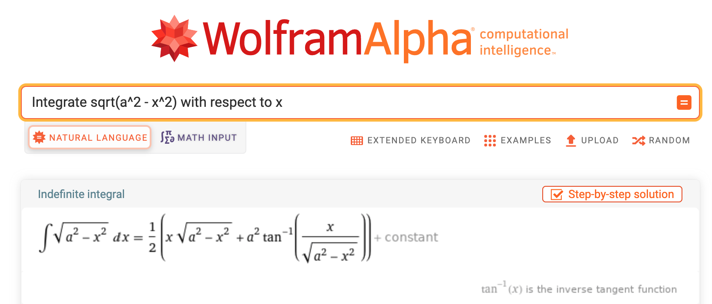

# Symbolic anti-differentiation {#sec-accum-symbolic}

```{r child="../starter.Rmd"}
```

You have already learned how to write down, by sight, the anti-derivative of the many of the pattern-book functions. As a reminder, here is an (almost) complete list of the derivatives and anti-derivatives of the pattern-book functions.

$\partial_x f(x)$ |      $f(x)$     | $\int f(x) dx$
------------------|-----------------|---------------
$e^x$             | $e^x$           | $e^x$
$\cos(x)$         | $\sin(x)$       | $-\cos(x)$  
$p x^{p-1}$       | power-law $x^p$ | $\frac{1}{p+1} x^{p+1}$
$\ \ \ \ 2x$      | $\ \ \ \ x^2$   | $\frac{1}{3} x^3$
$\ \ \ \ 1$       | $\ \ \ \ x$     | $\frac{1}{2} x^2$
$\ \ \ \ 0$       | $\ \ \ \ 1$     | $x$
$\ \ \ \ -x^{-2}$ | $\ \ \ \ 1/x$   | $\ln(|x|)$
$1/x$             | $\ln(x)$        | $x \left(\strut\ln(x)  - 1\right)$
$-x \dnorm(x)$    | $\dnorm(x)$     | $\pnorm()$
$\dnorm(x)$       | $\pnorm(x)$     | See below.

You can see that the derivatives and anti-derivatives of the pattern-book functions can be written in terms of the pattern-book functions. The left column contains the ***symbolic derivatives*** of the pattern book functions.^[One small deviation from the pattern-book functions is $\int \frac{dx}{x} = \ln(|x|)$. The absolute value $|x|$ in $\ln(|x|)$ reflects the differing domains of the functions $\ln(x)$ and $1/x$. Logarithms are defined only the positive half of the number line, while the reciprocal function $1/x$ is defined for all non-zero $x$. Including the absolute value in the argument to log covers situations such as $\int_{-2}^{-1} \frac{dx}{x}$ which has the value $\ln(2)$.] The right column contains the ***symbolic anti-derivatives***. We call them "symbolic," because they are written down with the same kind of symbols that we use for writing the pattern-book functions themselves.^[Mathematicians have a list that is a bit longer than our pattern-book functions---they call them ***elementary functions*** and include the tangent and other trig functions and their inverses, as well as what are called "hyperbolic functions" and their inverses.] 

We are stretching things a bit by including $\dnorm(x)$ and $\pnorm(x)$ among the functions that can be integrated symbolically. As you will see later, $\dnorm(x)$ is special when it comes to integration.

Think of the above table as the "basic facts" of differentiation and anti-differentiation. It is well worth memorizing the table since it shows many of the relationships among the functions that are central to this book. For the sinusoids, we've used the traditional name $\cos(x)$ to refer to $\sin(x + \pi/2)$ and $-\cos(x)$ instead of $\sin(x - \pi/2)$ since generations of calculus students have been taught to name "cosine" as the derivative of "sine," and don't always remember the relationship that $\cos(x) =\sin(x + \pi/2)$.

For differentiation, any function that can be written using combinations of the pattern-book functions by multiplication, composition, and linear combination has a derivative that can be written using the pattern-book functions. So a complete story of symbolic differentiation is told by the above table and the differentiation rules:

- linear combination: $\partial_x \left[{\strut}a\, f(x) + b\, g(x)\right] = a\, \partial_x f(x) + b\, \partial_x g(x)$ 

- product: $\partial_x \left[{\strut}f(x)\cdot g(x)\right] = g(x) \partial_x f(x) + f(x) \partial_x g(x)$

- composition: $\partial_x \left[{\strut}f(g(x))\right] = \left[\partial_x f{\large\strut}\right]\!\left({\large\strut}g(x)\right) \cdot \partial_x g(x)$

This chapter is about the analogous rules for anti-differentiation. The anti-differentiation rule for linear combination is simple: essentially the same as the rule for differentiation.

$$\int \left[\strut a\, f(x) + b\, g(x)\right] dx = a\!\int\! f(x) dx + b\!\int\! g(x) dx$$
How about the rules for function products and for composition? The surprising answer is that there are **no such rules**. There is no template analogous to the product and chain rules for derivatives, that can consistently be used for anti-derivatives. What we have instead are ***techniques of integration***, somewhat vague rules that will sometimes guide a successful search for the anti-derivative, but often will lead you astray. 

Indeed, there are many functions for which a symbolic anti-derivative cannot be constructed from compositions and/or multiplication of pattern-book functions that can be written using pattern-book functions.^[Again, mathematicians prefer to refer to the "elementary functions" rather than the pattern-book functions. $\dnorm()$ and $\pnorm()$ are not elementary functions, and there are several elementary function that we don't include in the pattern-book list.] 

Fortunately, we already know the symbolic anti-derivative form of many functions. We will call those the ***cataloged functions***, but this is not a term in general use in mathematics. For functions not in the catalog, it is non-trivial to find out whether the function has a symbolic anti-derivative or not. This is one reason why the techniques of integration do not always provide a result.

The following sections provide an overview of techniques of integration. We start with a description of the cataloged functions and direct you to computer-based systems for looking up the catalog. (These are almost always faster and more reliable than trying to do things by hand.) Then we introduce a new interpretation of the notation for anti-differentiation: differentials. This interpretation makes it somewhat easier to understand the major techniques of integration: substitution and integration by parts. We will finish by returning to a setting where symbolic integration is easy: polynomials.

Remember that, even if we cannot always find a symbolic anti-derivative, that we can always construct a numerical anti-derivative that will be precise enough for almost any genuine purpose.

## The cataloged functions {#sec-cataloged-functions}

In a traditional science or mathematics education, students encounter (almost exclusively) basic functions from a mid-sized catalog. For instance: $\sqrt{\strut\_\_\_\ }$, $\sin()$, $\cos()$, $\tan()$, square(), cube(), recip(), $\ln()$, $\exp()$, negate(), gaussian(),  and so on. This catalog also includes some functions that take two arguments but are traditionally written without using parentheses. For instance, $a+b$ does not look like a function but is entirely equivalent to $+(a, b)$. Others in this class are $\times(\ ,\ )$, $\div(\ , \ )$, $-(\ ,\ )$, and ^( , ).

The professional applied mathematician's catalog is much larger. You can see an example published by the US National Institute of Standards and Technology as the [Digital Library of Mathematical Functions](https://dlmf.nist.gov/). (Almost all of the 36 chapters in this catalog, important though they be, are highly specialized and not of general interest across fields.) 

There is a considerable body of theory for these ***cataloged functions***, which often takes the form of relating them to one another. For instance, $\ln(a \times b) = \ln(a) + \ln(b)$ demonstrates a relationship among $\ln()$, $+$ and $\times$. Along the same lines of relating the cataloged functions to one another is $\partial_x \sin(x) = \cos(x)$ and other statements about derivatives such as those listed in Chapter @sec-computing-derivs.

Simply to illustrate what a function catalog looks like, @fig-table-of-integrals shows a page from an 1899 handbook entitled [*A Short Table of Integrals*](https://archive.org/details/integralstable00peirrich/page/114/mode/2up). 

```{r echo=FALSE}
#| label: fig-table-of-integrals
#| fig-cap: "Entries 124-135 from *A Short Table of Integrals* (1899) by Benjamin Osgood Pierce. The book includes 938 such entries."
#| column: margin
knitr::include_graphics("www/table-of-integrals-1.png")
```

The use of cataloged functions is particularly prevalent in textbooks, so the quantitatively sophisticated student will encounter symbolic anti-derivatives of these functions throughout his or her studies. 

The cataloged functions were assembled with great effort by mathematicians over the decades. The techniques and tricks they used to find symbolic anti-derivatives are not part of the everyday experience of technical workers, although many mathematically minded people find them a good source of recreation. 

Calculus textbooks that include extensive coverage of the techniques and tricks should be understood as telling a story of the historical construction of catalogs, rather than conveying skills that are widely used today.  In a practical sense, when the techniques are needed, it is more reliable to access them via computer interface such as WolframAlpha, as depicted in @fig-wolfram-alpha-125.

```{r echo=FALSE}
#| label: fig-wolfram-alpha-125
#| fig-cap: "Pierce's entry 125 as computed by the WolframAlpha system."
#| column: margin

```

The systems can do a good job identifying cases where the techniques will not work. In such systems, they provide the anti-derivative as constructed by numerical integration. The R/mosaic `antiD()` function works in this same way, although its catalog contains only a tiny fraction of the functions found in professional systems. (But then, only a tiny fraction of the professional cataloged function are widely used in applied work.)

## Differentials

Breathing some life into the symbol $dx$ will help in understanding the algebra of techniques for anti-differentiating function compositions and products. We've thus far presented $dx$ as a bit of notation: punctuation for identifying the with-respect-to input in anti-derivatives. That is,
in interpreting a sequence of symbols like $\int f(x,t) dx$, we've parsed the sequence of symbols into three parts:

$$\underbrace{\int}_{\text{integral sign}} \overbrace{f(x, t)}^{\text{function to be anti-differentiated}} \underbrace{dx}_{\text{'with respect to'}}$$

By analogy, the English sentence 

$$\text{We loaded up on snacks.}$$ 

consists of five parts: the five words in the sentence.

But you can also see "We loaded up on snacks" as having *three* parts:

$$\underbrace{\text{We}}_{\text{subject}}\  
\overbrace{\text{loaded up on}}^{\text{verb}}\ \ \ 
\underbrace{\text{snacks}}_{\text{object}}$$

Likewise, the integrate sentence can be seen as consisting of just two parts:

$$\underbrace{\int}_{\text{integral sign}} \overbrace{f(x, t) dx}^{\text{differential}}$$

A differential corresponds to the little sloped segments that we add up when calculating a definite integral numerically using the ***slope function visualization***. That is
$$\underbrace{\int}_{\text{Sum}} \underbrace{\overbrace{f(x,t)}^\text{slope of segment}\ \  \overbrace{dx}^\text{run}}_\text{rise}$$

A differential is a genuine mathematical object and is used, for example, in analyzing the geometry of curved spaces, as in the Theory of General Relativity. But this is well beyond the scope of this introductory calculus course. 

Our use here for differentials will be to express rules for anti-differentiation of function compositions and products. 

You should be thinking in terms of differentials when you see a sentence like the following:

> "In $\int \sin(x) \cos(x) dx$, make the substitution $u = \sin(x)$, implying that $du = \cos(x) dx$ and getting $\int u du$, which is simple to integrate."

The table gives some examples of functions and their differentials. "w.r.t" means "with respect to."

::: {#tbl-with-respect-to .column-page-inset-right}
Function | derivative | w.r.t. |differential
---------|------------|-----|----------
$v(x) \equiv x$      |   $\partial_x v(x) = 1$       | x |   $dv = dx$
$u(x) \equiv x^2$    |   $\partial_x u(x) = 2x$     | x | $du = 2x dx$
$f(x) \equiv \sin(x)$ | $\partial_x f(x) = \cos(x)$ | x | $df = \cos(x)dx$
$u(x) \equiv e^{3 x}$ | $\partial_x u(x) = 3 e^{3 x}$ | x | $du = 3 e^{3 x} dx$ 
$g(x) \equiv t^3$     | $\partial_t v(t) = 3 t^2$     | t | $dg = 3 t^2 dt$
:::

As you can see, the *differential* of a function is simply the derivative of that function followed by the little $dx$ or $dt$ or whatever is appropriate for the "with respect to" input.

Notice that the differential of a function is not written with parentheses: The function $u(x)$ corresponds to the differential $du$.

::: {.example data-latex=""}
What is the differential of $\sin(x)$?

As we've seen, $\partial_x \sin(x) = cos(x)$. For form the differential of $\sin()$, take the derivative and suffix it with a $dx$ (since $x$ is the name of the input):

$$\cos(x)\ dx$$
:::


## U-substitution

There is little reason to use $\partial_t$ and $\int \left[\right]dt$ to cancel each other out, but it is the basis of an often successful strategy---***u-substitution***---for finding anti-derivatives symbolically. Here's the differentiate/integrate algorithm behind u-substitution. 

1. Pick a function $f()$ and another function $g()$. Typically $f()$ and $g()$ belong to the family of basic modeling functions, e.g. $e^x$, $\sin(t)$, $x^n$, $\ln(x)$, and so on. For the purpose of illustration, we will use $f(x) = \ln(x)$ and $g(t) = \cos(t)$.
2. Compose $f()$ with $g()$ to produce a new function $f(g())$ which, in our case, will be $\ln(\cos(t))$.
3. Use the chain rule to find $\partial_t f(g(t))$. In the example, the derivative of $\ln(x)$ is $1/x$, the derivative of $g(t)$ is $-\sin(t)$. By the chain rule, $$\partial_t f\left(\strut g(t)\right) = \partial_t \underbrace{\Large\ln}_{f()}\left(\underbrace{\large\cos(t)}_{g(t)}\right) = \underbrace{\left[- \frac{1}{\cos(t)}\right]}_{f'(g(t))} \underbrace{\left[{\LARGE\strut}\sin(t)\right]}_{g'(t)} = -  \frac{\sin(t)}{\cos(t)} = - \tan(t)$$ 

In a sense, we have just watched a function give birth to another through the straightforward process of differentiation. Having witnessed the birth, we know who is the integration parent of $\tan(t)$, namely $\int \tan(t) dt = \ln\left(\cos(t)\right)$. For future reference, we might write this down in our diary of integrals:
$$\int \tan(t) dt = - \ln(\cos(t)) + C$$
Saving this fact in your diary is helpful. The next time you need to find $\int \tan(x) dx$, you can look up the answer ($-\ln(\cos(x)) + C$) from your diary. If you use $\int \tan(x) dx$ a lot, you will probably come to memorize the answer, just as you have already memorized that $\int \cos(t) dt = \sin(t)$ (a fact that you  will use a lot in the rest of this course). 

Now for the u-substitution game. The trick is to take a problem of the form $\int h(t) dt$ and extract from $h(t)$ two functions, an $f()$ and a $g()$. You're going to do this so that $h(t) =  \partial_t F(g(t))$, where $\partial_x F(x) = f(x)$ Once you've done this, you have an answer to the original integration question: $\int h(t) dt = F(g(t)) + C$. 

::: {.example data-latex=""}

Task: Evaluate the definite integral $\int \frac{\sin(\ln(x))}{x} dx$.

You don't know ahead of time that this is an integral amenable to solution by u-substitution. For all you know, it is not. So before you start, look at the function to see if it one of those for which you already know the anti-derivative, for example any of the pattern-book functions or their parameterized cousins the basic modeling functions. 

> If so, you've already memorized the answer and you are done. If not ...

Assume for a moment---without any guarantee that this will work, mind you---that the answer can be built using u-substitution. You will therefore look hard at $h()$ and try to see in it a plausible form that looks like the derivative of some $f(g(x))$. 

In the problem at hand, we can readily see something of the form $f(g(x))$ in the $\sin(\ln(x))$. This immediately gives you a candidate for $g(x)$, namely $g(x)\equiv \ln(x)$ We don't know $f()$ yet, but if $g()$ is the right guess, and if u-substitution is going to work, we know that $f()$ has to be something that produces $\sin()$ when you differentiate it. That is $-\cos()$. So now we have a guess $$h_\text{guess}(x) = -\cos(\ln(x)) \partial_x \ln(x) = - \cos(\ln(x)) \frac{dx}{x}$$ 

> If this guess matches the actual $h()$ then you win. The answer to $\int h(x) dx$ will be $f(g(x)) = -\cos(\ln(x))$. If not, see if there is any other plausible guess for $g(x)$ to try. If you cannot find one that works, try integration by parts. 
:::

## Integration by parts (standard presentation)

If you do a lot of symbolic anti-differentation, you will often come across functions that you don't recognize as being the derivative of an already known function. Consider, for instance, $$\int x \cos(x) dx\ .$$ 

Even though the integrand $x \cos(x)$ is a simple product of two pattern book functions it is likely not a function that you have previously produced by differentiation. Thus, it is not yet in your diary of anti-derivatives. The purpose of integration by parts is to provide a standard way to re-organize anti-derivatives like $\int x \cos(x) dx$, where the integrand is a product of two simple functions, into another form. Being able to do this is no guarantee that the other form will be something you can anti-differentiate, but it is worth rolling the dice to see if you get lucky.

The re-organization rule is based on two fundamental properties of differentiation and anti-differentiation. 

i. $\int f'(x) dx = f(x)$. This is saying nothing more than if $f'(x)$ is the derivative of $f(x)$, then $f(x)$ must be an anti-derivative of $f'(x)$.

ii. $\partial_x \left[\strut u(x)\cdot v(x) \right] = u'(x)\cdot v(x) + v'(x)\cdot u(x)$: the product rule of differentiation.

Let's integrate both sides of the statement of the product rule. For the left side, applying rule (i), we get a simple result:

$$\int\left[\strut\partial_x \left[\strut u(x)\cdot v(x) \right]\right] dx = u(x) \cdot v(x)$$

As for the right side, all we get is two anti-derivatives:
$$\int\left[\strut u'(x)\cdot v(x) + v'(x)\cdot u(x)\right]dx =
\int\left[\strut u'(x)\cdot v(x)\right]dx + \int\left[\strut u(x)\cdot v'(x)\right]dx$$
Putting together the previous two expressions and re-arranging gives:
$$\int u(x)\cdot v'(x)\, dx = u(x) \cdot v(x) - \int  v(x)\cdot u'(x)dx\ \ \ \mathbf{ \text{parts re-arrangment}}$$
Now, consider a problem like $\int x \cdot \cos(x) dx$ that we don't yet know how to solve. Let's associate this problem with the left side of the parts re-arrangement equation. With luck, we will recognize a problem that we will know how to do on the right-hand side. 

To implement the re-arrangement, we need to split our as yet unknown anti-derivative into two pieces: $u(x)$ and $v'(x) dx$. There are many possible ways to do this but the most obvious is
$$\int \underbrace{\strut x}_{u(x)} \cdot \underbrace{\cos(x) dx}_{v'(x) dx}$$
According to this proposed splitting, we have $u(x) = x$ and $v'(x) dx = \cos(x) dx$. To plug things into the right side of the parts re-arrangement we will need to find $v(x)$ and $u'(x) dx$. Since we know $u(x) = x$ it is easy to take the differential, 
$du = dx$. Similarly, we know $v'(x) dx = \cos(x) dx$ so we can integrate both sides:
$$v(x) = \underbrace{\int v'(x) dx = \int \cos(x) dx}_{\text{from }\ v'(x)\,dx\ =\ \cos(x)\,dx} = \sin(x)$$
Now that we know the $v(x)$ that is  consistent with our original splitting of the anti-derivative into $\int u(x) \cdot v'(x) dx$ we can plug in our results to the right side of the parts re-arrangement equation:

$$\int x \cdot \cos(x)dx = x \sin(x) - \int \underbrace{\sin(x)}_{v(x)}\  \underbrace{\ 1\ dx\ \strut}_{u'(x) dx}$$
We are in luck! We already know the anti-derivative $\int \sin(x) dx = -\cos(x)$. Substituting this result for the $\int v(x) u'(x) dx$ term, we arrive at 
$$\int x \cdot \cos(x)dx = x \sin(x) + \cos(x)\ .$$

The key creative step in using integration by parts effectively is to choose a helpful split of the original integral into the $u(x)$ and $v'(x) dx$ parts. This is usually based on a solid knowledge of derivatives and anti-derivatives of basic functions as well as insight into the downstream consequences of any choice. In this sense, picking $u(x)$ and $v'(x)dx$ is like making a move in chess. Some players can see two or three moves ahead and so can pick the first move to improve their position. Without such foresight, the best most people can do is to pick a first move that seems attractive and accept that their fate might be either victory or checkmate.

For the calculus student learning integration by parts, there is an irony. Gaining enough experience to make good choices of $u(x)$ and $v'(x)dx$ means that you will solve, or read about solving, many anti-differentiation problems. You can, of course, enter the solutions into your diary of anti-derivatives, obviating to that extent the need to  perform integration by parts in the future.

::: {.example data-latex=""}
In demonstrating that $$\int x \cdot \cos(x)dx = x \sin(x) + \cos(x)$$ we followed a number of steps each of which might be subject to error. Best to confirm our solution before accepting it. This can be done by *differentiating* both sides of our solution: $$\partial_x \int x \cdot \cos(x)dx = x \cos(x) = \partial_x \left[\strut x \sin(x) + \cos(x)\right] = \underbrace{\sin(x) + x \cos(x)}_{\partial_x \left[x\cdot\sin(x)\right]}\  \underbrace{- \sin(x)}_{\partial_x \cos(x)}= x\cos(x)$$
:::

::: {.example data-latex=""}
What would happen in the previous example if we had made a *bad* choice for $u(x)$ and $v'(x) dx$? For instance, we might have split $x \cos(x) dx$ into $u(x) = \cos(x)$ and $v'(x)\,dx = x\, dx$. Working out $u'(x)\,dx$ and $v(x)$ is easy: $u'(x)\, dx = -\sin(x)\, dx$ and $v(x) = \frac{1}{2} x^2$. Plugging into the re-arrangement formula gives:

$$\int x \cdot \cos(x)\,dx = \frac{1}{2} x^2 \cos(x) - \int \frac{1}{2} x^2 \left[\strut - \sin(x)\right]\,dx = \frac{1}{2} x^2 \cos(x) + \int \frac{1}{2} x^2  \sin(x)\,dx$$
Unless you know $\int x^2 \sin(x) dx$, this re-arrangement leaves you no better off than at the beginning.

On the other hand ... if you are in the business of compiling diaries of anti-derivatives, you could use this situation to chalk up another entry based on already knowing $\int x \cdot \cos(x) dx$:
$$\int x^2 \sin(x) dx = 2 \int x\cdot \cos(x)dx - x^2\cos(x) = 2x\sin(x) + 2\cos(x) - x^2 \cos(x)$$
:::

::: {.example data-latex=""}
Find $\int x \ln(x) dx$.

Let $u(x) = \ln(x)$ and $v'(x)dx = x dx$.

Then, $u'(x)dx = \frac{1}{x} dx$ and $v(x) = \frac{1}{2} x^2$.

Using the parts re-arrangement formula ...

$$\int x \ln(x) dx = \frac{1}{2} x^2 \cdot \ln(x) - \int \frac{1}{2} x^2\cdot \frac{1}{x}\, dx \\
\frac{1}{2} x^2 \cdot \ln(x) - \frac{1}{4} x^2$$
And don't forget, after all this work, to add the constant of integration $C$!
:::


## Integration by parts (optional alternative presentation)

Integration by parts applies to integrals that are recognizably of the form 
$$\int f(x) g(x) dx$$
Step 1: Split up the integrand into an $f(x)$ and a $g(x)$ multiplied together. That is, split the integrand into ***parts*** that are multiplied together. The way we wrote the integrand, this was trivial.

Step 2: Pick one of $f(x)$ or $g(x)$. Typically, you pick the one that has a dead-easy anti-derivative. For our general description, let's suppose this is $g(x)$ which has anti-derivative $G(x)$ (where we know $G()$).

Step 3: Construct a ***helper function*** $h(x) \equiv f(x) G(x)$. This requires no work, since we've already identified $f(x)$ and $G(x)$ in step (2).

Step 4: Find $\partial_x h(x)$. It is always easy to find derivatives, and here we just use the product rule:
$$\partial_x h(x) = \partial_x f(x) \cdot G(x) + f(x)\cdot\partial_x G(x)$$
We know from the way we constructed $G(x)$ that $\partial_x G(x) = g(x)$, so the equation is
$$\partial_x h(x) = \partial_x f(x) \cdot G(x) + f(x)\cdot g(x)$$

Step 5: Anti-differentiate both sides of the previous equation. From the fundamental theorem of calculus, we know how to do the left side of the equation.
$$\int \partial_x h(x) = h(x) \equiv f(x)g(x)$$
The right side of the equation has two ***parts***:
$$\int \left[{\large\strut}\partial_x f(x) \cdot G(x) + f(x)\cdot g(x)\right]dx = \underbrace{\int \partial_x f(x) \cdot G(x) dx}_\text{Some NEW integral!}\ \ \ \  + \underbrace{\int f(x) g(x) dx}_\text{The original integral we sought!}$$
Putting together the left and right sides of the equation, and re-arranging gives us a new expression for the original integral we sought to calculate: 
$$\text{Integration by parts re-arrangement}\\\underbrace{\int f(x) g(x) dx}_\text{The original integral we sought.} = \underbrace{f(x) g(x)}_\text{We know this!}  - \underbrace{\int \partial_x f(x) \cdot G(x) dx}_\text{Some NEW integral!}$$
It may seem that we haven't accomplished much with this re-organization. But we have done something. We took a problem we didn't otherwise know how to solve (that is $\int f(x) g(x) dx$) and broke it down into two parts. One is very simple. The other is an integral. If we are clever in picking $g()$ and lucky, we will be able to figure out the new integral and, thereby, we will have computed the original integral. But everything depends on cleverness and luck!

::: {.example data-latex=""}
Task: Find $\int x \cos(x) dx$.

An obvious choice for the two parts is $x$ and $\cos(x)$. But which one to call $g(x)$. We will just guess and say $g(x)\equiv \cos(x)$ which implies $G(x) = \sin(x)$. The helper function is $h(x) \equiv f(x) G(x) = x \sin(x)$.

Differentiating $h(x)$ can be done by the product rule.
$$\partial_x h(x) = \sin(x) + x \cos(x)\ .$$
Now anti-differentiate both sides of the above, the left side by the fundamental theorem of algebra and the right side by other means:
$$\int \partial_x h(x) = h(x) = x \sin(x)= \underbrace{\int\sin(x)dx}_{-\cos(x)} + \underbrace{\int x \cos(x) dx}_\text{The original integral}$$
Re-arranging gives the answer
$$\underbrace{\int x \cos(x) dx}_\text{The original integral} = x \sin(x) + \cos(x) + C$$
The constant of integration $C$ needs to be included to make the equality true.

To confirm the result, you can differentiate the right-hand side; differentiation is always easy.

Alternatively, we can check numerically if $\int x \cos(x) dx - (x\sin(x)+cos(x))$ is a constant. (See \@fig-check-constant).)

```{r}
#| label: fig-check-constant
#| column: margin
#| fig-caption: A numerical check shows $\\int x \\cos(x) dx - (x\\sin(x)+cos(x))$ is a constant. 
F1 <- antiD(x*cos(x) ~ x)
F2 <- makeFun(x*sin(x) + cos(x) ~ x)
slice_plot(F1(x) - F2(x) ~ x, domain(x=-5:5))
```
:::

::: {.example data-latex=""}
Task: Find $\int \ln(x) dx$.

The easy solution is to recognize that the anti-derivative of $\ln(x)$ is contained in the table at the top of the chapter.  But let's try doing it by parts as an example (and to show you how it got into the table in the first place).

It is hard to see a separate $f(x)$ and $g(x)$ in the integrand $\ln(x)$. But sometimes you need to be clever. We will set $f(x) \equiv \ln(x)$ and $g(x) \equiv 1$. This means that $G(x) = x$. The helper function is therefore $h(x) = x\ln(x)$

Differentiating the helper function gives (by the product rule):
$\partial_x h(x) = \ln(x) + x \frac{1}{x} = \ln(x) + 1$

Integrating the differentiated helper function, we find
$$\int \partial_x h(x) dx = f(x)g(x) = x \ln(x) = \underbrace{\int \ln(x) dx}_\text{The original integral} + \underbrace{\int 1 dx}_{x}$$
Re-arranging, we have 
$$\underbrace{\int \ln(x) dx}_\text{The original integral} = x \ln(x) - x\ \  =\ \  x\left[\strut \ln(x) - 1\right]$$
:::


::: {.example data-latex=""}
Task: Find $\int \sin(x) e^x dx$.

This isn't the integral of a pattern book or basic modeling function, and substitution didn't work, so we try integration by parts. 

The obvious choice for the two parts is $\sin(x)$ and $e^x$. Both are really easy to anti-differentiate. Let's choose $g(x) = \sin(x)$, giving $G(x) = -\cos(x)$. The re-arrangement of the original integral will be
$$\sin(x) e^x + \int \cos(x) e^x dx$$
The new integral that we need to compute does not look any friendlier than the original, but who knows? we will do $\int cos(x) e^x dx$ by parts as well and keep our fingers crossed. That integral turns out to be
$$\int \cos(x) e^x dx = \cos(x) e^x - \int \sin(x) e^x dx$$
This may look like we are going in circles, and maybe we are, but let's put everything together.
$$\underbrace{\int \sin(x) e^x dx}_\text{The original problem} = \underbrace{\sin(x) e^x + \cos(x) e^x}_\text{Easy stuff!}\ \ \  - \underbrace{\int \sin(x) e^x dx}_\text{Also the original problem}$$
Rearranging gives 
$$\int \sin(x) e^x dx = \frac{\sin(x) e^x + \cos(x) e^x}{2} = \frac{e^x}{2}\left[{\large\strut} \sin(x) + \cos(x)\right]$$
And don't forget the constant of integration.
:::

[The presentation of integration by parts in this section was formulated by Prof. Michael Brilleslyper.]

## Didn't work?


If integration by parts does not work ... and it does not always work! ... there is a variety of possibilities such as asking a math professor (who has a much larger set of functions at hand than you), looking through a table of integrals (which is to say, the collective calculus diary of generations of math professors), using a computer algebra system, or using numerical integration. One of these will work. 

If you have difficulty using u-substitution or integration by parts, you will be in the same league as the vast majority of calculus students. Think of your fellow students who master the topic in the way you think of ice dancers. It is beautiful to watch, but you need a special talent and it hardly solves every problem. People who would fall on their face if strapped to a pair of skates have nonetheless made huge contributions in technical fields, even those that involve ice.  

Prof. Kaplan once had a heart-to-heart with a 2009 Nobel-prize winner who confessed to always feeling bad and inadequate as a scientist because he had not done well in introductory calculus. It was only when he was nominated for the Nobel that he felt comfortable admitting to his "failure." Even if you don't master u-substitution or integration by parts, remember that you can integrate any function using easily accessible resources.  

## Integrating polynomials

One of the most famous settings for integration comes from the physics of free fall under gravity.

Here's the setting. An object---a ball, let's imagine---is being held at height $x_0$. At $t=0$ the ball is released. Perhaps the ball is released from a standstill in which case it is velocity at release is $v_0 = v(t=0) =0$. Or perhaps the ball has been tossed upward so that $v_0 > 0$, or downward so that $v_0 < 0$. Whichever it is, the initial velocity will be labelled $v_0$. 

On release, the force that held the ball steady is removed and the object moves under the influence of only one factor: gravity. The effect of gravity near the Earth's surface is easy to describe: it accelerates the object at a constant rate of about 9.8 m/s$^2$.

Acceleration is the derivative with respect to time of velocity. Since we know acceleration, to find velocity we find an anti-derivative of acceleration:
$$v(t) = \int -9.8\ dt = -9.8\ t + C$$
The constant of integration $C$ is not just a formality. It has physical meaning. In this case, we see that $C=v(0)$, that is, $C = v_0$.

Velocity is the derivative of position: height in this case. So height is an anti-derivative of velocity. 
$$x(t) = \int v(t) dt = \int \left[\strut -9.8\ t + v_0\right]dt = - \frac{9.8}{2} t^2 + v_0\ t + C$$
Why is $C$ back again? it is a convention to use $C$ to denote the constant of integration. Those experienced with this convention know, from context, that the value of $C$ in the integration that produced $v(t)$ has nothing to do with the value of $C$ involved in the production of $x(t)$. The situation is a bit like the presentation of prices in US stores: to the price of the item itself, you must always add "plus taxes." Nobody with experience would assume that "taxes" is always the same number. It depends on the price and type of the item itself.^[Many jurisdictions tax food and clothing, etc. at a different rate than other items.] You won't have to deal with the taxes at the time you pick the item from the shelf, but eventually you will see them when you check out of the store. Think of $+\ C$ as meaning, "plus some number that we will have to deal with at some point, but not until checkout."

Let's checkout the function $x(t)$ now. For that, we need to figure out the value of $C$. We can do that by noticing that $x(0) = C$.  So in the anti-differentiation producing $x()$, $C = x_0$ giving, altogether the formula for free-fall famous from physics classes
$$x(t) =  - \frac{9.8}{2} t^2 + v_0\ t + x_0$$
An important thing to notice about $x(t)$: it is a polynomial in $t$. Polynomials can be birthed by successive anti-differentiations of a constant. At each anti-differentiation, each of the previous terms is promoted by one order. That is, the previous constant becomes the first order term. The previous first-order term becomes the second order term, with the division by 2 familiar from anti-differentiating $t$. A previous second-order term will become the new third-order term, again with the division by 3 familiar from anti-differentiating $t^2$. 

Stated generally, the anti-derivative of a polynomial is

$${\Large\int} \left[\strut \underbrace{a + b t + ct^2 + \ldots}_\text{original polynomial}\right] dt = \underbrace{C + a\,t + \frac{b}{2} t^2 + \frac{c}{3} t^3 + \ldots}_\text{new polynomial}$$
By use of the symbol $C$, it is easy to spot how the constant of integration fits in with the new polynomial. But if we were to anti-differentiate the new polynomial, we had better replace $C$ with some more specific symbol to that we don't confuse the old $C$ with the one that is  going to be produced in the new anti-differentiation.

::: {.intheworld data-latex=""}
In exercise `r dereference_hash("jAOmME")$number`, we introduced a Taylor polynomial approximation to the gaussian function. That might have seemed like a mere exercise in high-order differentiation at the time, but there is something more important at work.

The gaussian is one of those functions for which the anti-derivative cannot be written exactly in terms of what the mathematicians call "elementary functions." (See Section @sec-cataloged-functions.) Yet integrals of the gaussian are very commonly used in science, especially in statistics where the gaussian is called the ***normal PDF***. 

The approach we've taken in this book is simply to give a name and a computer implementation of the anti-derivative of the gaussian. This is the function we've called $\pnorm()$ with the R computer implementation `pnorm()`.

We never told you the algorithm contained in `pnorm()`. Nor do we really need to. We all depend on experts and specialists to design and build the computers we use. The same is true of software implementation of functions like `pnorm()`. And for that matter, for implementations of functions like `exp()`, `log()`, `sin()`, and so on. You don't have to know about semi-conductors to use a computer productively, and you don't need to know about numerical algorithms to use those functions.

One feasible algorithm for implementing $\pnorm()$ is to integrate the Taylor polynomial. It is very easy integrate polynomials. To ensure accuracy, different Taylor polynomials can be computed for different centers, say $x=0$, $x=1$, $x=2$, and so on.

Another feasible approach integrates $\dnorm()$ numerically using an advanced algorithm such as Gauss-Hermite quadrature.
:::

## Exercises

`r insert_exercises("Accumulation", "symbolic")`
