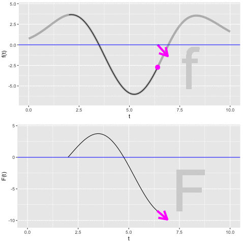

# Integration {#sec-net-change}

```{r include=FALSE}
source("../starter.R")
```

Anti-derivatives are useful when you know how a quantity is changing but don't yet know the quantity itself. 

It is important, of course, to keep track of which is the "quantity itself" and which is the "rate of increase in that quantity." This always depends on context and your point of view. It is convenient, then, to set some fixed examples to make it easy to keep track of which quantity is which.


Context | Quantity             | Rate of increase in quantity
--------|----------------------|--------------------
Money   | Cash on hand ${\mathbf S}(t)$         | Cash flow $s(t)$
Fuel    | Amount in fuel tank ${\mathbf F}(t)$ | Fuel consumption rate, e.g. kg/hour $f(t)$
Motion  | Momentum   ${\mathbf M}(t)$          | Force $m(t)$
notation| ${\mathbf H}(t)$               | $\partial_t {\mathbf H}(t)$
notation| $G(t) = \int g(t) dt$| $g(t)$

We will also adopt a convention to make it simpler to recognize which quantity is the "quantity itself" and which is the "rate of increase in that quantity." We will use CAPITAL LETTERS to name functions that are the quantity itself, and *lower-case* letters for the rate of increase in that quantity. For example, if talking about motion, an important quantity is ***momentum*** and how it changes over time. The momentum itself will be ${\mathbf M}(t)$ while the rate of increase of momentum will be $m(t)$.^[Momentum is velocity times mass. Newton's Second Law of Motion stipulates that force equals the rate of change of momentum.] The amount of money a business has on hand at time $t$ is ${\mathbf S}(t)$ measured, say, in dollars.  The rate of increase of that money is $s(t)$, in, say, dollars per day.  

Notice that we are using the phrase "rate of increase" rather than "rate of change." that is  because we want to keep straight the meaning of the sign of the *lower-case* function. If $m(t)$ is positive, the momentum is increasing. If $m(t)$ is negative then it is a "negative rate of increase," which is, of course, just a "decrease."

For a business, money coming in means that $s(t)$ is positive. Expenditures of money correspond to $s(t)$ being negative. In the fuel example. ${\mathbf F}(t)$ is the amount of fuel in the tank. $f(t)$ is the rate of *increase* in the amount of fuel in the tank. Of course, engines burn fuel, removing it from the tank. So we would write the rate at which fuel is burned as $-f(t)$: removing fuel is a negative increase in the amount of fuel, an expenditure of fuel.

The objective of this chapter is to introduce you to the sorts of calculations, and their notations, that let you figure out how much the CAPITAL LETTER quantity has changed over an interval of $t$ based on what you already know about the value over time of the *lower-case* function.

The first step in any such calculation is to find or construct the *lower-case* function $f(t)$ or $c(t)$ or $m(t)$ or whatever it might be. This is a modeling phase. In this chapter, we will ignore detailed modeling of the situation and just present you with the *lower-case* function. 

The second step in any such calculation is to compute the anti-derivative of the *lower-case* function, giving as a result the CAPITAL LETTER function. You've already seen the notation for this, e.g.
$${\Large  F(t) = \int f(t) dt}\ \ \ \ \ \text{or}\ \ \ \ \ {\Large G(t) = \int g(t) dt}\ \ \ \ \text{and so on.}$$ In this chapter, we will not spend any time on this step; we will assume that you already have at hand the means to compute the anti-derivative. (Indeed, you already have `antiD()` available which will do the job for you.) Later chapters will look at the issues around and techniques for doing the computations by other means.

The remaining steps in such calculations are to work with the CAPITAL LETTER function to compute such things as the amount of that quantity, or the change in that quantity as it is accumulated over an interval of $t$.

::: {.callout-note icon=false data-latex=""}
## Why capital letters?
Sometimes we write capital letter functions in **bold-face**, e.g. ${\mathbf F}(t)$ and other times you aren't, e.g. $F(t)$. What's going on?

This is a convention we are adopting for this chapter, which is when we need it the most to introduce the concepts.

**Bold-face** is being used in this chapter to represent the real-world quantity of interest. So ${\mathbf F}(t)$ is the actual amount of fuel in the tank, ${\mathbf M}(t)$ is the actual momentum of the car, and ${\mathbf S}(t)$ is the actual amount of money on hand. The regular-face functions, $F(t)$ and $M(t)$ and $S(t)$ are the functions that we get by applying anti-differentiation to $f(t)$ or $m(t)$ or $s(t)$.

Our broad interest is to construct the **bold-face** function knowing just the derivative of that function, which we are writing in *lower-case*. So, $f(t) \equiv \partial_t {\mathbf F}(t)$. Similarly, $m(t) \equiv \partial_t {\mathbf M}(t)$ and $s(t) \equiv \partial_t {\mathbf S}(t)$. We are in the situation where we know $f(t)$ but not ${\mathbf F}(t)$, or we know $m(t)$ but not ${\mathbf M}(t)$, and so on.

How could such a situation arise in the real world? Suppose the car's fuel gauge is broken, leaving us without direct knowledge of $\mathbf F$ (liters).  But there is a dashboard readout of the instantaneous rate of fuel consumption (say, liters per 100 km). So, we know $f(t)$ but not ${\mathbf F}(t)$. Or suppose you are in charge of day-to-day running of a business, collecting the income each day and paying the daily expenses. Thus, each day you know $s(t)$---the cash flow. But it is your boss who has access to the bank account; you merely deposit money as you get it and authorize electronic funds transfers to suppliers. Your boss knows ${\mathbf S}(t)$ but you know only $s(t)$.

Anti-differentiation is part of the way to reconstruct the fuel level ${\mathbf F}(t)$ from the known $f(t)$, or to figure out the bank balance ${\mathbf S}(t)$ from your records of $s(t)$.

But anti-differentiation, while part of the solution, is only just a part. You can apply anti-differentiation to $f(t)$, but what you get back will be $F(t)$, not ${\mathbf F}(t)$. 

What's the difference between the two? It involves a constant value $C$ which, alas, you can never figure out from $f(t)$. All that you can claim, given the $F(t)$ generated by anti-differentiation, is that $${\mathbf F}(t) = F(t) + C .$$

:::


## Net change

Perhaps it goes without saying, but once you have the CAPITAL LETTER function, e.g. $F(t)$, you can evaluate that function at any input that falls into the domain of $F(t)$. If you have a graph of $F(t)$ versus $t$, just position your finger on the horizontal axis at input $t_1$, then trace up to the function graph, then horizontally to the vertical axis where you can read off the value $F(t_1)$. If you have $F()$ in the form of a computer function, just ***apply*** $F()$ to the input $t_1$.

In this regard, $F(t)$ is like any other function.

However, in using and interpreting the $F(t)$ that we constructed by anti-differentiating $f(t)$, we have to keep in mind the limitations of the anti-differentiation process. In particular, any function $f(t)$ does not have a unique anti-derivative function. If we have one anti-derivative, we can always construct another by adding some constant: $F(t) + C$ is also an anti-derivative of $f(t)$.

But we have a special purpose in mind when calculating $F(t_1)$. We want to figure out from $F(t)$ how much of the quantity $f(t)$ has accumulated up to time $t_1$. For example, if $f(t)$ is the rate of increase in fuel (that is, the negative of fuel consumption), we want $F(t_1)$ to be the amount of fuel in our tank at time $t_1$. **That cannot happen.** All we can say is that $F(t_1)$ is the amount of fuel in the tank at $t_1$ give or take some unknown constant C.

Instead, the correct use of $F(t)$ is to say how much the quantity has changed over some interval of time, $t_0 \leq t \leq t_1$. This "change in the quantity" is called the ***net change*** in $F()$. To calculate the net change in $F()$ from $t_0$ to $t_1$ we apply $F()$ to both $t_0$ and $t_1$, then subtract:

$$\text{Net change in}\ F(t) \ \text{from}\ t_0 \ \text{to}\ t_1 :\\= F(t_1) - F(t_0)$$

::: {.example data-latex=""}
Suppose you have already constructed the rate-of-change function for momentum $m()$ and implemented it as an R function `m()`. For instance, $m(t)$ might be the amount of **force** at any instant $t$ of a car, and ${\mathbf M}(t)$ is the **accumulated force**, better known as momentum. We will assume that the input to `m()` is in seconds, and the output is in kg-meters-per-second-squared, which has the correct dimension for force.

You want to find the amount of force accumulated between time $t=2$ and $t=5$ seconds. 


```{r echo=FALSE}
mraw <- doodle_fun( ~ t, seed=9090)
m <- function(t) mraw(t-5)
```

```{r}
# You've previous constructed m(t)
M <- antiD(m(t) ~ t)
M(5) - M(2)
```

To make use of this quantity, you will need to know its dimension and units. For this example, where the dimension [$m(t)$] is M L T$^{-2}$, and [$t$] = T, the dimension [${\mathbf M}(t)$] will be M L T$^{-1}$. In other words, if the output of $m(t)$ is kg-meters-per-second-squared, then the output of $V(t)$ must be kg- meters-per-second.
:::

## The "definite" integral

We have described the process of calculating a net change from the *lower-case* function $f(t)$ in terms of two steps:

1. Construct $F(t) = \int f(t) dt$. 
2. Evaluate $F(t)$ at two inputs, e.g. $F(t_2) - F(t_1)$, giving a net change, which we will write as ${\cal F}(t_1, t_2) = F(t_2) - F(t_1)$.

As a matter of notation, the process of going from $f(t)$ to the net change is written as one statement.
$${\cal F}(t_1, t_2) = F(t_2) - F(t_1) = \int_{t_1}^{t_2} f(t) dt$$

The punctuation $$\int_{t_1}^{t_2} \_\_\_\_ dt$$ captures in one construction both the anti-differentiation step ($\int\_\_dt$) and the evaluation of the anti-derivative at the two bound $t_2$ and $t_1$.

Several names are used to describe the overall process. It is important to become familiar with these.

- $\int_a^b f(t) dt$ is called a ***definite integral*** of $f(t)$.
- $a$ and $b$ are called, respectively, the ***lower bound of integration*** and the ***upper bound of integration***, although given the way we draw graphs it might be better to call them the "left" and "right" bounds, rather than lower and upper.
- The pair $a, b$ is called the ***bounds of integration***. 

As always, it pays to know what *kind of thing* is ${\cal F}(t_1, t_2)$.
Assuming that $t_1$ and $t_2$ are fixed quantities, say $t_1 = 2$ seconds and $t_2 = 5$ seconds, then ${\cal F}(t_1, t_2)$ is itself a quantity. The dimension of that quantity is [$F(t)$] which in turn is [$f(t)$]$\cdot$[$t$]. So if $f(t)$ is fuel consumption in liters per second, then $F(t)$ will have units of liters, and ${\cal F}(t_1, t_2)$ will also have units of liters.

Remember also an important distinction:

- $F(t) = \int f(t) dt$ is a ***function*** whose output is a quantity.
- $F(t_2) - F(t_1) = \int_{t_1}^{t_2} f(t) dt$ is a ***quantity***, not a function. 

Of course, $f(t)$ is a ***function*** whose output is a quantity. In general, the two functions $F(t)$ and $f(t)$ produce outputs that are *different kinds* of quantities. For instance, the output of $F(t)$ is liters of fuel while the output of $f(t)$ is liters per second: fuel consumption. Similarly, the output of $S(t)$ is dollars, while the output of $s(t)$ is dollars per day. 

The use of the term ***definite integral*** suggests that there might be something called an ***indefinite integral***, and indeed there is. "Indefinite integral" is just a synonym for "anti-derivative." In this book we favor the use of ***anti-derivative*** because it is too easy to leave off the "indefinite" and confuse an indefinite integral with a definite integral. Also, "anti-derivative" makes it completely clear what is the relationship to "derivative."

Since 1700, it is common for calculus courses to be organized into two divisions:

i. Differential calculus, which is the study of derivatives and their uses.
ii. Integral calculus, which is the study of anti-derivatives and their uses. 

Mathematical notation having been developed for experts rather than for students, very small typographical changes are often used to signal very large changes in meaning. When it comes to anti-differentiation, there are two poles of fixed meaning and then small changes which modify the meaning. The poles are:

i. Anti-derivative: $\int f(t) dt$, which is a function whose output is a quantity.
ii. Definite integral $\int_a^b f(t) dt$, which is a quantity, plain and simple.

But you will also see some intermediate forms:

a. $\int_a^t f(t) dt$, which is a **function** with input $t$.

b. $\int_a^x f(t) dt$, which is the same function as in (a) but with the input name $x$ being used.

c. $\int_t^b f(t) dt$, which is a **function** with input $t$.

d. Less commonly, $\int_x^t f(t) dt$ which is a **function** with two inputs, $x$ and $t$. The same is true of $\int_x^y f(t) dt$ and similar variations.

## Initial value of the quantity

Recall that we are interested in a real quantity ${\mathbf F}(t)$, but we only know $f(t)$ and from that can calculate an anti-derivative $F(t)$. The relationship between them is
$${\mathbf F}(t) = F(t) + C$$ where $C$ is some fixed quantity that we cannot determine directly from $f(t)$.

Still, even if we cannot determine $C$, there is one way we can use $F(t)$ to make definite statements about ${\mathbf F}(t)$. Consider the net change from $t_1$ to $t_2$ in the real quantity ${\mathbf F}$. This is
$${\mathbf F}(t_2) - {\mathbf F}(t_1) =  \left[F(t_2) + C\right] - \left[F(t_1) + C\right] = F(t_2) - F(t_1)$$
In other words, just knowing $F(t)$, we can make completely accurate statements about net changes in the value of ${\mathbf F}(t)$.

Let's develop our understanding of this unknown constant $C$, which is called the ***constant of integration***. To do so, watch the movie in @fig-accum-movie-1 showing the process of constructing the anti-derivative $$F(t) = \int_2^t f(t) dt\ .$$

```{r echo=FALSE}
#| label: fig-accum-movie-1 
#| fig-cap: "Constructing the anti-derivative $F(t)$ by reading the slope from $f(t)$ and using that slope to extend the picture of $F()$"
#| fig-cap-location: margin
if (knitr::is_html_output()) {
  knitr::include_graphics("www/arrow-plot.gif")
} else {
  
}
```

1. Focus first on the top graph. The function we are integrating, $f(t)$, is known before we carry out the integration, so it is shown in the top graph. 

$f(t)$ is the rate of increase in $F(t)$ (or ${\mathbf F}(t)$ for that matter). From the graph, you can read using the vertical axis the value of $f(t)$ for any input $t$. But since $f(t)$ is a rate of increase, we can also depict $f(t)$ as a slope. That slope is being drawn as a $\color{magenta}{\text{magenta}}$ arrow. Notice that when $f(t)$ is positive, the arrow slopes upward and when $f(t)$ is negative, the arrow slopes downward. The steepness of the arrow is the value of $f(t)$, so for inputs where the value of $f(t)$ is far from zero the arrow is steeper than for values of $f(t)$ that are near zero.

2. Now look at both graphs, but concentrate just on the arrows in the two graphs. They are always the same: carbon copies of one another.

3. Finally the bottom graph. We are starting the integral at $t_1=2$. Since nothing has yet been accumulated, the value $F(t_1 = 2) = 0$. From (1) and (2), you know the arrow shows the slope of $F(t)$.  So as $F(t>2)$ is being constructed the arrow guides the way. When the slope arrow is positive, $F(t)$ is growing. When the slope arrow is negative, $F(t)$ is going down.

In tallying up the accumulation of $f(t)$, we started at time $t=2$ and with $F(t=2) = 0$. This makes sense, since nothing can be accumulated over the mere instant of time from $t=2$ to $t=2$.  On the other hand, it was our choice to start at $t=2$. We might have started at another value of $t$ such as $t=0$ or $t=-5$ or $t=-\infty$. If so, then the accumulation of $f(t)$ up to $t=2$ would likely have been something other than zero.

But what if we knew an actual value for ${\mathbf F}(2)$. This is often the case. For instance, before taking a trip you might have filled up the fuel tank. The accumulation of fuel consumption only tells you how much fuel has been used since the start of the trip. But if you know the starting amount of fuel, by adding that to the accumulation you will know instant by instant how much fuel is in the tank. In other words, $${\mathbf F}(t) = {\mathbf F}(2) + \int_2^t f(t) dt\ .$$
This is why, when we write an anti-derivative, we should always include mention of some constant $C$---the so-called ***constant of integration***---to remind us that there is a difference between the $F(t)$ we get from anti-differentiation and the ${\mathbf F}(t)$ of the function we are trying to reconstruct. That is,
$${\mathbf F}(t) = F(t) + C = \int f(t) dt + C\ .$$
We only need to know ${\mathbf F}(t)$ at one point in time, say $t=0$, to be able to figure out the value of $C$: $$C = {\mathbf F}(0) - F(0)\ .$$ 

Another way to state the relationship between the anti-derivative and ${\mathbf F}(t)$ is by using the anti-derivative to accumulate $f(t)$ from some starting point $t_0$ to time $t$. That is:
$${\mathbf F}(t) \ =\  {\mathbf F}(t_0) + \int_{t_0}^t f(t)\, dt\  = \ 
{\mathbf F}(t_0) + \left({\large\strut}F(t) - F(t_0)\right)$$

::: {.callout-note icon=false data-latex=""}
## Math in the World: Galileo in Pisa

An oft-told legend has Galileo at the top of the Tower of Pisa around 1590. The legend illustrates Galileo's finding that a light object (e.g. a marble) and a heavy object (e.g. a ball) will fall at the same speed. Galileo published his mathematical findings in 1638 in  *Discorsi e Dimostrazioni Matematiche, intorno a due nuove scienze*. (English: Discourses and Mathematical Demonstrations Relating to Two New Sciences)

In 1687, Newton published his world-changing*Philosophiae Naturalis Principia Mathematica*. (English: Mathematical Principles of Natural Philosophy)


Let's imagine the ghost of Galileo returned to Pisa in 1690 after reading Newton's *Principia Mathematica*. In this new legend, Galileo holds a ball still in his hand, releases it, and figures out the position of the ball as a function of time.

Although Newton famously demonstrated that gravitational attraction is a function of the distance between to objects, he also knew that at a fixed distance---the surface of the Earth---gravitational acceleration was constant. So Galileo was vindicated by Newton. But, although gravitational acceleration is constant from top to bottom of the Tower of Pisa, Galileo's ball was part of a more complex system: a hand holding the ball still until release. Acceleration of the ball versus time is therefore approximately a Heaviside function:

$\text{accel}(t) \equiv \left\{\begin{array}{rl}0 & \text{for}\ t \leq 3\\
{-9.8}  & \text{otherwise}\end{array}\right.$

```{r}
accel <- makeFun(ifelse(t <= 3, 0, -9.8) ~ t)
```


Acceleration is the derivative of velocity. We can construct a function $V(t)$ as the anti-derivative of acceleration, but the real-world velocity function will be 
$${\mathbf V}(t) = {\mathbf V}(0) + \int_0^t \text{accel}(t) dt$$ 

```{r}
V_from_antiD <- antiD(accel(t) ~ t)
V <- makeFun(V0 + (V_from_antiD(t) - V_from_antiD(0)) ~ t, V0 = 0)
```

In the computer expression, the parameter `V0` stands for ${\mathbf V}(0)$. We've set it equal to zero since, at time $t=0$, Galileo was holding the ball still. 

Velocity is the derivative of position, but the real-world velocity function will be the accumulation of velocity from some starting time to time $t$, plus the position at that starting time:
$$x(t) \equiv x(0) + \int_0^t V(t) dt$$
We can calculate $\int V(t) dt$ easily enough with `antiD()`, but the function $x(t)$ involves evaluating that anti-derivative at times 0 and $t$:

```{r}
x_from_antiD <- antiD(V(t) ~ t)
x <- makeFun(x0 + (x_from_antiD(t) - x_from_antiD(0)) ~ t, x0 = 53)
```

We've set the parameter `x0` to be 53 meters, the height above the ground of the top balcony on which Galileo was standing for the experiment.


```{r echo=FALSE, warning=FALSE}
#| label: fig-galileo-accel
#| fig-cap: "The acceleration, velocity, and position of the ball as a function of time in Galileo's Tower of Pisa experiment. The ball is released at time $t_0$."
P1 <- slice_plot(accel(t) ~ t, bounds(t=0:7), npts=351,
                 singularities=3) %>%
  gf_text(-10 ~ 3, label=expression(paste(t[0]))) %>%
  gf_vline(xintercept = 3, color="brown", linetype="dotted") %>%
  gf_labs(y = "Acceleration") %>%
  gf_refine(scale_y_continuous(breaks=c(0, -2, -4, -6, -8, -10)))
P2 <- slice_plot(V(t) ~ t, bounds(t=0:7)) %>%
  gf_text(-10.5 ~ 3, label=expression(paste(t[0]))) %>%
  gf_vline(xintercept = 3, color="brown", linetype="dotted") %>%
  gf_labs(y = "Velocity")
P3 <- slice_plot(x(t) ~ t, bounds(t=0:7)) %>%
  gf_text(-10.5 ~ 3, label=expression(paste(t[0]))) %>%
  gf_vline(xintercept = 3, color="brown", linetype="dotted") %>%
  gf_labs(y = "Position")
gridExtra::grid.arrange(P1, P2, P3, nrow=3)
```
:::


In the (fictional) account of the 1690 experiment, we had Galileo release the ball at time $t=0$. That is a common device in mathematical derivations, but in a physical sense it is entirely arbitrary. Galileo might have let go of the ball at any other time, say, $t=3$ or $t=14:32:05$. 

A remarkable feature of integrals is that it does not matter what we use as the lower bound of integration, so long as we set the initial value to correspond to that bound. 


::: {.callout-note icon=false data-latex=""}
## Why $\int f(x) dx$ instead of $\int f(t) dt$?

For a while you were writing integrals like this: $\int_a^b f(t) dt$. Then you replaced $b$ with the input name $t$ to get $\int_a^t f(t) dt$. But then you switched everything up by writing $\int_a^t f(x) dx$. Is that the same as $\int_a^t f(t) dt$? If so, why do you get to replace the $t$ with $x$ in some places but not in others?

Recall from @sec-notation that the names used for inputs to a function definition don't matter so long as they are used consistently on the left and right sides of $\equiv$. For instance, all these are the same function:

- $f(x) \equiv m x + b$
- $g(t) \equiv m t + b$
- $h(\text{wind}) \equiv m \text{wind} + b$

Now think about the integral $\int_a^b f(t) dt$:
$$\int_a^b f(t) dt = F(b) - F(a)\ .$$

On the left-hand side, the input name $t$ is prominent, appearing in two places: $f(\color{magenta}{t}) d\color{magenta}{t}$. But $t$ is nowhere on the right-hand side. We could have equally well written this as $\int_a^b f(x) dx$ or $\int_a^b f(\text{wind}) d\text{wind}$. The name we use for the input to $f()$ does not matter so long as it is consistent with the name used in the $d\_\_$ part of the notation. Often, the name placed in the blanks in $\int f(\_\_) d\_\_$ is called a ***dummy variable***.

Writing $\int_a^t f(t) dt$ is perfectly reasonable, but many authors dislike the multiple appearance of $t$. So they write something like $\int_a^t f(x) dx$ instead.
:::

## Integrals from bottom to top

The bounds of integration appear in different arrangements. None of these are difficult to derive from the basic forms:

- The relationship between an integral and its corresponding anti-derivative function: $$\int_a^b f(x) dx = F(b) - F(a)$$ This relationship has a fancy-sounding name: the ***second fundamental theorem of calculus***.
- The accumulation from an initial-value $${\mathbf F}(b)\  =\  {\mathbf F}(a) + \int_a^b f(x) dx\  = \ {\mathbf F}(a) + F(b) - F(a)$$
For many modeling situations, $a$ and $b$ are fixed quantities, so $F(a)$ and $F(b)$ are also quantities; the output of the anti-derivative function at inputs $a$ and $b$. But either the lower-bound or the upper-bound can be input names, as in $$\int_0^t f(x) dx = F(t) - F(0)$$

Note that $F(t)$ is not a quantity but a function of $t$.

On occasion, you will see forms like $\int_t^0 f(x)dx$. You can think of this in either of two ways:

1. The accumulation from a time $t$ less than 0 up until 0.
2. The *reverse* accumulation from 0 until time $t$.

Reverse accumulation can be a tricky concept because it violates everyday intuition. Suppose you were harvesting a row of ripe strawberries. You start at the beginning of the row---position zero. Then you move down the row, picking strawberries and placing them in your basket. When you have reached position $B$ your basket holds the accumulation $\int_0^B s(x)\, dx$, where $s(x)$ is the lineal density of strawberries---units: berries per meter of row.

But suppose you go the other way, starting with an empty basket at position $B$ and working your way back to position 0. Common sense says your basket will fill to the same amount as in the forward direction, and indeed this is the case. But integrals work differently. The integral $\int_B^0 s(x) dx$ will be the **negative** of $\int_0^B s(x) dx$. You can see this from the relationship between the integral and the anti-derivative:
$$\int_B^0 s(x) dx \ = \ S(0) - S(B) \ =\ -\left[{\large\strut}S(B) - S(0)\right]\ = \ -\int_0^B s(x) dx$$

This is not to say that there is such a thing as a negative strawberry. Rather, it means that harvesting strawberries is similar to an integral in some ways (accumulation) but not in other ways. In farming, harvesting from 0 to $B$ is much the same as harvesting from $B$ to 0, but integrals don't work this way. 

Another property of integrals is that the interval between bounds of integration can be broken into pieces. For instance:

$$\int_a^c f(x) dx \ = \ \int_a^b f(x) dx + \int_b^c f(x) dx$$
You can confirm this by noting that 
$$\int_a^b f(x) dx + \int_b^c f(x) dx \ = \ \left[{\large\strut}F(b) - F(a)\right] + \left[{\large\strut}F(c) - F(b)\right] = F(c) - F(a) \ = \ \int_a^c f(x) dx\ .$$

Finally, consider this function of $t$:
$$\partial_t \int_a^t f(x) dx\ .$$
First, how do we know it is a function of $t$? $\int_a^t f(x) dx$ is a definite integral and has the value $$\int_a^t f(x) dx = F(t) - F(a)\  .$$ Following our convention, $a$ is a parameter and stands for a specific numerical value, so $F(a)$ is the output of $F()$ for a specific input. But according to convention $t$ is the name of an input. So $F(t)$ is a function whose output depends on $t$. Differentiating the function $F(t)$, as with every other function, produces a new function. 

Second, there is a shortcut for calculating $\partial_t \int_a^t f(x) dx$:
$$\partial_t \int_a^t f(x) dx\ =\ \partial_t \left[{\large\strut}F(t) - F(a)\right]\ .$$
Since $F(a)$ is a quantity and not a function, $\partial_t F(a) = 0$. That simplies things. Even better, we know that the derivative of $F(t)$ is simply $f(t)$: that is  just the nature of the derivative/anti-derivative relationship between $f(t)$ and $F(t)$. Put together, we have:
$$\partial_t \int_a^t f(x) dx\ =\ f(t)\ .$$


This complicated-looking identity has a fancy name: the ***first fundamental theorem of calculus***. 

::: {.callout-note icon=false data-latex=""}
## Math out of the World: Backtracking the stars

In the 1920s, astronomers and cosmologists questioned the idea that the large-scale universe is static and unchanging. This traditional belief was undermined both by theory (e.g. General Relativity) and observations. The most famous of these were collected and published by Edwin Hubble, starting in 1929 and continuing over the next decade as improved techniques and larger telescopes became available. In recent years, with the availability of the space telescope named in honor of Hubble data has expanded in availability and quality. @fig-hubble-curve shows a version of [Hubble's 1929 graph](https://www.pnas.org/content/15/3/168) based on [contemporary data](https://www.ncbi.nlm.nih.gov/pmc/articles/PMC314128/).

```{r echo=FALSE}
#| label: fig-hubble-curve
#| fig-cap: "The relationship between velocity and distance of stars, using contemporary data in the same format at Edwin Hubble's 1929 publication." 
#| out-width: "60%"
#| fig-align: "center"
knitr::include_graphics("www/hubble-curve.png")
```
Each dot in @fig-hubble-curve is an exploding star called a *supernova*. The graph shows the relationship between the distance of the star from our galaxy and the outward velocity of that star. The velocities are large, $3 \times 10^4 = 30,000$ km/s is about one-tenth the speed of light. Similarly, the distances are big; 600 Mpc is the same as 2 billion light years or $1.8 \times 10^{22} \text{km}$. The slope of the line in @fig-hubble-curve is $\frac{3.75 \times 10^4\, \text{km/s}}{1.8 \times 10^{22}\, \text{km}} = 2.1 \times 10^{-18}\, \text{s}^{-1}$. For ease of reading, we will call this slope $\alpha$ and therefore the velocity of a start distance $D$ from Earth is $$v(D) \equiv \alpha D\ .$$

Earlier in the history of the universe each star was a different distance from Earth. We will call this function $D(t)$, distance as a function of time in the universe.

The distance travelled by each star from time $t$ (billions of years ago) to the present is 
$$\int_t^\text{now} v(t) dt  = D_\text{now} - D(t)$$ 
which can be re-arranged to give
$$D(t) = D_\text{now} - \int_t^\text{now} v(t) dt .$$
Assuming that $v(t)$ for each star has remained constant at $\alpha D_\text{now}$, the distance travelled by each star since time $t$ depends on its current distance like this:
$$\int_t^\text{now} v(t) dt = \int_t^\text{now} \left[ \alpha D_\text{now}\right]\, dt = \alpha D_\text{now}\left[\text{now} - t\right]$$
Thus, the position of each star at time $t$ is 
$$D(t) = D_\text{now} - \alpha D_\text{now}\left[\text{now} - t\right] = D(t)$$ or, 
$$D(t) = D_\text{now}\left({\large\strut} 1-\alpha \left[\text{now} - t\right]\right)$$

According to this model, there was a common time $t_0$ when  when all the stars were at the same place: $D(t_0) = 0$. This happened when $$\text{now} - t_0 = \frac{1}{\alpha} = \frac{1}{2.1 \times 10^{-18}\, \text{s}^{-1}} = 4.8 \times 10^{17} \text{s}\ .$$
It seems fair to call such a time, when all the stars where at the same place at the same time, as the origin of the universe. If so, $\text{now} - t_0$ corresponds to the ***age of the universe*** and our estimate of that age is $4.8\times 10^{17}\text{s}$. Conventionally, this age is reported in years. To get that, we multiply by the ***flavor of one*** that turns seconds into years:
$$\frac{60\, \text{seconds}}{1\, \text{minute}} \cdot \frac{60\, \text{minutes}}{1\, \text{hour}} \cdot \frac{24\, \text{hours}}{1\, \text{day}} \cdot \frac{365\, \text{days}}{1\, \text{year}} = 31,500,000 \frac{\text{s}}{\text{year}}$$
The grand (but hypothetical) meeting of the stars therefore occurred $4.8 \times 10^{17} \text{s} / 3.15 \times 10^{7} \text{s/year} = 15,000,000,000$ years ago. Pretty crowded to have all the mass in the universe in one place at the same time. No wonder they call it the Big Bang! 
:::

