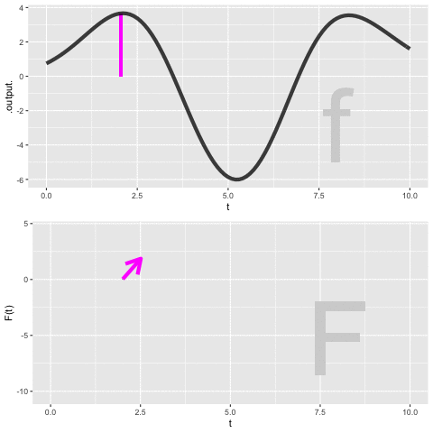
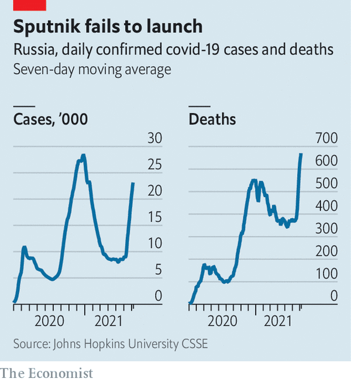

# Integrals step-by-step

<!-- take this out when the CRAN version of mosaicCalc is updated -->

```{webr-r}
#| context: setup
doodle_fun <- function (vars = ~x & y, seed = NULL, n = 0) 
{
  if (!is.null(seed)) 
    set.seed(seed)
  if (!inherits(vars, "formula")) 
    stop("Must provide a formula, e.g. ~x&y, to identify the variables")
  nmaxes <- ifelse(n == 0, ceiling(runif(1, min = 4, max = 10)), 
                   n)
  varnames <- all.vars(vars)
  nvars <- length(varnames)
  locs <- list()
  for (k in 1:nvars) locs[[k]] <- runif(nmaxes, min = -3, max = 3)
  signsmax <- runif(nmaxes, min = 3, max = 10) * sign(runif(nmaxes, 
                                                            min = -1, max = 1))
  xscales <- runif(nmaxes, min = 0.1, max = 5)
  if (nvars == 1) {
    f <- function() {
      x <- eval(parse(text = varnames[1]))
      res <- 0
      for (k in 1:nmaxes) {
        res <- res + signsmax[k] * exp(-(xscales[k] * 
                                           (x - locs[[1]][k])^2)/9)
      }
      return(res)
    }
  }
  if (nvars == 2) {
    f <- function() {
      x <- eval(parse(text = varnames[1]))
      y <- eval(parse(text = varnames[2]))
      res <- 0
      for (k in 1:nmaxes) {
        res <- res + signsmax[k] * exp(-(xscales[k] * 
                                           (x - locs[[1]][k])^2 + (y - locs[[2]][k])^2)/9)
      }
      return(res)
    }
  }
  if (nvars == 3) {
    f <- function() {
      x <- eval(parse(text = varnames[1]))
      y <- eval(parse(text = varnames[2]))
      z <- eval(parse(text = varnames[3]))
      res <- 0
      for (k in 1:nmaxes) {
        res <- res + signsmax[k] * exp(-(xscales[k] * 
                                           (x - locs[[1]][k])^2 + (y - locs[[2]][k])^2 + 
                                           (z - locs[[3]][k])^2)/9)
      }
      return(res)
    }
  }
  if (nvars > 3) {
    f <- function() {
      x <- eval(parse(text = varnames[1]))
      res <- 0
      for (k in 1:nmaxes) {
        foo <- xscales[k] * (x - locs[[1]][k])^2
        for (j in 2:nvars) {
          x <- eval(parse(text = varnames[j]))
          foo <- foo + (x - locs[[j]][k])^2
        }
        res <- res + signsmax[k] * exp(-foo/9)
      }
      return(res)
    }
  }
  tmp <- paste("alist( ", paste(varnames, "=", collapse = ",", 
                                sep = ""), ")")
  tmp <- eval(parse(text = tmp))
  formals(f) <- tmp
  return(f)
}
```

```{r include=FALSE}
source("../starter.R")
```

The setting for anti-differentiation (and its close cousin, integration) is that we have a function $F(t)$ which we do not yet know, but we do have access to some information about it: its slope as a function of time $f(t) \equiv \partial_t F(t)$ and, perhaps, its value $F(t_0)$ at some definite input value.

@sec-totaling-bits showed some ways to visualize the construction of an $F(t)$ by accumulating short segments of slope. The idea is that we know $f(t)$ which tells us, at any instant, the slope of $F(t)$. So, in drawing a graph of $F(t)$, we put our pen to paper at some input value $t_0$ and then move forward in $t$, setting the instantaneous slope of our curve according to $f(t)$.

@sec-net-change deals with one of the limitations of finding $F(t)$ by anti-differentiation of $f(t)$; the anti-derivative is not unique. This is because to start drawing $F(t)$ we need pick a $t_0$ and an initial value of $F(t_0)$. If we had picked a a different starting point $t_1$ or a different initial value $F(t_1)$, the new curve would be different than the one drawn through $(t_0, F(t_0))$, although it would have the same shape, just shifted up or down according to our choice. We summarize this situation algebraically by writing $$\int f(t) dt = F(t) + C\ ,$$ where $C$ is the ***constant of integration***, that is, the vertical shift of the curve. 

The non-uniqueness of $F(t)$ does not invalidate its usefulness. In particular, the quantity $F(b) - F(a)$, will be the same regardless of which starting point we used to draw $F(t)$. We have two names for $F(b) - F(a)$

1. The ***net change*** in $F()$ from $a$ to $b$.
2. The ***definite integral*** of $f()$ from $a$ to $b$, written $\int_a^b f(t) dt$.

These two things, the net change and the definite integral, are really one and the same, a fact we describe by writing $$\int_a^b f(t) dt = F(b) - F(a)\ .$$

In this chapter, we will introduce a simple numerical method for calculating from $f()$ the net change/definite integral. This will be a matter of trivial but tedious arithmetic: adding up lots of little bits of $f(t)$. Later,  @sec-accum-symbolic shows how to avoid the tedious arithmetic by use of algebraic, symbolic transformations. This symbolic approach has great advantages, and is the dominant method of anti-differentiation found in college-level science textbooks. However, there are many common $f(t)$ for which the symbolic approach is not possible, whereas the numerical method works for any $f(t)$. Even more important, the numerical technique has a simple natural extension to some commonly encountered accumulation problems that look superficially like they can be solved by anti-differentiation but rarely can be in practice. We will meet one such problem and solve it numerically, but a broad approach to the topic, called ***dynamics*** or ***differential equations***, will have to wait until Block 6.

## Euler method

The starting point for this method is the definition of the derivative of $F(t)$. Reaching back to @sec-continuous-change, 

$$\partial_t F(t) \equiv \lim_{h\rightarrow 0} \frac{F(t+h) - F(t)}{h}$$
To translate this into a numerical method for computing $F(t)$, let's write things a little differently.

- First, since the problem setting is that we don't (yet) know $F(t)$, let's refer to things we do know. In particular, we know $f(t) = \partial_t F(t)$.
- Again, recognizing that we don't yet know $F(t)$, let's re-write the expression using something that we do know: $F(t_0)$. Stated more precisely, $F(t_0)$ is something we get to make up to suit our convenience. (A common choice is $F(t_0)=0$.)
- Let's replace the symbol $h$ with the symbol $dt$. Both of them mean "a little bit of" and $dt$ makes explicit that we mean "a little bit of $t$."
- we will substitute the limit $\lim_{h\rightarrow 0}$ with an understanding that $dt$ will be something "small." How small? we will deal with that question when we have to tools to answer it.

With these changes, we have $$f(t_0) = \frac{F(t_0+dt) - F(t_0)}{dt}\ .$$
The one quantity in this relationship that we do not yet know is $F(t_0 + dt)$. So re-arrange the equation so that we can calculate the unknown $F(t_0 + dt)$ from the known $F(t_0)$ and $f(t_0)$. That is,
$$F(t_0 + dt) = F(t_0) + f(t_0)\, dt\ .$$

::: {.callout-tip}
Let's consider finding the anti-derivative of $\dnorm()$, that is, $\int_0^t \dnorm(x) dx$. In one sense, you already know the answer, since $\partial_x \pnorm(x) = \dnorm(x)$. But $\pnorm()$ is just a name. Beneath the name we know $\pnorm()$ only because it has been numerically constructed by integrating $\dnorm()$. The $\pnorm()$ function is so important that the numerically constructed answer has been memorized by software.
:::


## Area

The quantity $$\Large \color{magenta}{f(t_0)}\, \color{orange}{dt}$$ 
gives rise to a visualization that has been learned by generations of calculus students. The visualization is so compelling and powerful that many students (and teachers, and textbook authors) mistake the visualization for integration and anti-differentiation themselves. 

We will start the visualization with a simple graph of $f(t)$, which is called the ***integrand*** in the integral $\int_a^b f(t) dt$. @fig-area-integrand shows the graph of $f(t)$. A specific point $t_0$ has been marked on the horizontal axis. Next to it is another mark at $t_0 + dt$. Of course, the distance between these marks is $\color{orange}{dt}$.

::: {#fig-area-integrand}
```{r echo=FALSE, warning=FALSE} 
raw <- doodle_fun( ~ t, seed=541)
f <- makeFun((raw(t)+10)/2 ~ t) 

gf_rect(0 + 4.384 ~ 1.25 + 1.60, color=NA, fill="brown", alpha=0.25) |>  
slice_plot(f(t) ~ t, bounds(t=-.5:4)) %>%
  gf_hline(yintercept = ~ 0, color="brown") %>%
  gf_refine(scale_x_continuous(breaks=c(-1,0,1, 1.25, 1.60, 2, 3, 4),
                               labels = c(-1, 0, 1, latex2exp::TeX(c("$t_0$", "$t_0 + dt$")), 2, 3, 4 ))) %>%
  gf_segment(0 + 4.384 ~ 1.25 + 1.25, color = "magenta", arrow=arrow(ends="both", type="closed", length=unit(0.12, "inches"))) %>%
  gf_vline(xintercept= ~ 1.60, color = "blue") %>%
  gf_text(2.4 ~ 1.0, label=latex2exp::TeX("$f(t_0)$"), angle=0, color="magenta", size=6) %>%
  gf_segment(0 + 0 ~ 1.25 + 1.6, color = "orange", arrow=arrow(ends="both", type="closed", length=unit(0.12, "inches"))) %>%
  gf_text(-.2 ~ 1.425, label="dt", color="orange")
```

Illustrating the interpretation of $f(t_0) dt$ as an "area."
:::

Per the usual graphical convention, a position along the vertical axis corresponds to a possible output of $f(t)$. The output for $t=t_0$ is $\color{magenta}{f(t_0)}$. That same quantity corresponds to the length of the vertical orange segment connecting $(t_0, 0)$ to $(t_0, f(t_0))$. 

The $\color{orange}{dt}$ line segment and the $\color{magenta}{f(t_0)}$ segment constitute two sides of a rectangle, shown as a shaded zone. The "area" of that rectangle is the product $\color{magenta}{f(t_0)}\ \color{orange}{dt}$.

In this sort of visualization, an integral is the accumulation of many of these $f(t) dt$ rectangles. For instance, @fig-bars-0-3 the visualization of the integral $$\int_{0}^3 f(t) dt\ .$$

::: {#fig-bars-0-3}
```{r echo=FALSE, warning=TRUE}
Bars <- Znotes::Riemann_bars(f(t) ~ t, h=0.3, bounds(t=0:3))

gf_text(1.5 ~ 2.2, label=latex2exp::TeX("$\\sim \\int_0^3 f(t)dt$"), size=10, color=alpha("blue", 0.5)) %>%
gf_rect(ymin + ymax ~ xmin + xmax, data = Bars, color= "grey", fill=~color, alpha=0.3 ) %>%
  gf_refine(scale_fill_identity()) %>%
  slice_plot(f(t) ~ t, bounds(t=-1:4), inherit=FALSE) %>%
  gf_hline(yintercept = ~ 0, color="brown") %>%
  gf_segment(0 + f(1.5) ~ 1.5 + 1.5, color = "magenta", arrow=arrow(ends="both", type="closed", length=unit(0.12, "inches"))) %>%
  gf_text(1.7 ~ 1.4, label=latex2exp::TeX("$f(t=1.5)$"), angle=90, color="magenta", size=5) %>%
  gf_segment(0 + 0 ~ 0.6 + 0.9, color = "orange", arrow=arrow(ends="both", type="closed", length=unit(0.12, "inches"))) %>%
  gf_text(-.2 ~ 0.75, label="dt", color="orange") %>%
  gf_segment(0 + 0 ~ 1.5 + 1.8, color = "orange", arrow=arrow(ends="both", type="closed", length=unit(0.12, "inches"))) %>%
  gf_segment(0 + f(0.6) ~ 0.6 + 0.6, color = "magenta", arrow=arrow(ends="both", type="closed", length=unit(0.12, "inches"))) %>%
  gf_text(-.2 ~ 1.65, label="dt", color="orange") %>%
  gf_text(1.5 ~ 0.5, label=latex2exp::TeX("$f(t=0.6)$"), angle=90, color="magenta", size=5) %>%
  gf_segment(0 + 0 ~ 0.6 + 0.9, color = "orange", arrow=arrow(ends="both", type="closed", length=unit(0.12, "inches"))) %>%
  gf_text(4 ~ 2.5, label="dt=0.3", color="orange") 
  
```                    

Visualizing the integral $\\int_0^3 f(t) dt$ as the total \"area\" of several $f(t) dt$ bars. The width of each of the bars is $dt$. The height depends on the value of the function $f(t)$ at the bar. For illustration, two of the bars are marked with vertical and horizontal line segments.
:::

As always in calculus, we imagine $dt$ as a "small" quantity. In @fig-bars-0-3B you can see that the function output changes substantially over the sub-domain spanned by a single rectangle. Using smaller and smaller $dt$, as in @fig-bars-0-3 brings the visualization closer and closer to the actual meaning of an anti-derivative.

::: {#fig-bars-0-3B}
```{r echo=FALSE, warning=FALSE}
Bars <- Znotes::Riemann_bars(f(t) ~ t, h=0.1, bounds(t=0:3))
P1 <- 
  slice_plot(f(t) ~ t, bounds(t=-1:4)) %>%
  gf_rect(ymin + ymax ~ xmin + xmax, data = Bars, color= "grey", fill=~color, alpha=0.3, inherit=FALSE ) %>%
  gf_refine(scale_fill_identity()) %>%
  gf_text(2 ~ 1.5, label=latex2exp::TeX("$\\sim\\int_0^3 f(t)dt$"), size=10, color=alpha("blue", 0.5)) %>%
  
  gf_hline(yintercept = ~ 0, color="brown") %>%
  gf_text(-.4 ~ 1.65, label="dt", color="orange") %>%
  gf_text(-.4 ~ 0.65, label="dt", color="orange") %>%
  gf_segment(0 + 0 ~ 0.6 + 0.7, color = "orange", arrow=arrow(ends="both", type="closed", length=unit(0.06, "inches"))) %>%
  gf_segment(0 + 0 ~ 1.6 + 1.7, color = "orange", arrow=arrow(ends="both", type="closed", length=unit(0.06, "inches"))) %>%
  gf_lims(y=c(-0.5, 5)) %>%
  gf_text(4 ~ 2.5, label="dt=0.1", color="orange")
Bars2 <- Znotes::Riemann_bars(f(t) ~ t, h=0.0333, bounds(t=0:3))
P2 <- slice_plot(f(t) ~ t, bounds(t=-1:4)) %>%
  gf_rect(ymin + ymax ~ xmin + xmax, data = Bars2, color= "grey", fill=~color, alpha=0.3, inherit=FALSE ) %>%
  gf_refine(scale_fill_identity()) %>%
  
  gf_hline(yintercept = ~ 0, color="brown") %>%
gf_text(2 ~ 1.5, label=latex2exp::TeX("$\\sim \\int_0^3 f(t)dt$"), size=10, color=alpha("blue", 0.5)) %>%
  gf_lims(y=c(-0.5, 5)) %>%
  gf_text(4 ~ 2.5, label="dt=0.03", color="orange") 
gridExtra::grid.arrange(P1, P2, nrow=2)
```                    

Visualizing the integral $\int_0^3 f(t) dt$ as the total "area" of several $f(t) dt$ bars. The width of each of the bars is $dt$. The height depends on the value of the function $f(t)$ at the bar. For illustration, two of the bars are marked with vertical and horizontal line segments.
:::

::: {.callout-note icon=false data-latex=""}
## Why do you keep putting "area" in quotes?

When $f(t_i) < 0$, then $f(t_i) dt$ will be negative. There is no such thing as a negative area, but in constructing an integral the $f(t_i)dt$, being negative, diminishes the accumulated area. 

::: {#fig-neg-area}
```{r echo=FALSE, warning=FALSE}
raw <- doodle_fun( ~ t, seed=541)
g <- makeFun((raw(-t)+10)/2 ~ t) 
Bars3 <- Znotes::Riemann_bars(g(t) ~ t, h=0.0333, bounds(t=-2:3))
gf_text(2 ~ -1, label="+7.4", color="blue", size=10) %>%
  gf_text(-3 ~ 2, label="-18.1", color="orange", size=10) |> 
  gf_rect(ymin + ymax ~ xmin + xmax, 
          data = Bars3, color= NA, fill=~color, alpha=0.3 ) %>%
  gf_hline(yintercept = ~ 0, color="brown") %>%
  slice_plot(g(t) ~ t, bounds(t=-4:4), color="black", inherit=FALSE) %>%
  gf_refine(scale_fill_identity(), scale_y_continuous(breaks=seq(-10,6,by=2))) %>%
  gf_text(-7 ~ -1.7, label=latex2exp::TeX("$\\sim \\int_{-2}^3 g(t)dt = +7.4\\,-18.1=10.7$"), size=8, color=alpha("blue", 0.5)) %>%
  gf_labs(x = "t")
```

The $\int_{-2}^3 g(t) dt$ covers subdomains where $g(t) > 0$ and where $g(t) < 0$. In those latter subdomains, the "area" is negative, and shown in light orange here.
:::

Another problem is that area is a physical quantity, with dimension L$^2$. The quantity produced by integration will have physical dimension $[f(t)][t]$, the product of the dimension of the with-respect-to quantity and the output of the function. 

"Area" is an effective metaphor for visualizing integration, but the goal of integration is not to calculate an area but, typically, some other kind of quantity.
:::

## The Euler Step

Without invoking "areas," a definite integral $\int_a^b f(t) dt$ can be computed by constructing the anti-derivative $F(t) \equiv \int f(t) dt$ and evaluating it at the upper and lower bounds of integration: $F(b) - F(a)$.  In this section, we will look at the numerical process of constructing an anti-derivative function, which uses many of the same concepts as those involved in finding an integral by combining areas of rectangles.

```{webr-r}
#| context: setup
raw <- doodle_fun( ~ t, seed=541)
f <- makeFun((raw(t)+10)/2 ~ t) 
```


A definite integral produces a **quantity**, not a function. The anti-derivative function constructed by using quantities like $f(t) dt$ will be a ***series of quantities*** rather than a formula. In particular, it will have the form of a data table, something like this:

::: {#tbl-fun-table1}
$t$ | $F(t)$
----|-------
-2  | 10.62
-1.5 | 6.47
-1 | 3.51
-0.5 | 2.02
0 | 2.4
0.5 | 3.18 
1.0 | 5.14
$\vdots$ | $\vdots$
:::

To start in creating $F()$ by anti-differentiating $f()$, we will need to create a series of $t$ values. We will do this by specifying a starting value for $t$ and then creating successive values by adding a numerical increment $dt$ to the entries one after the other until we reach a terminating value. For instance, in the above table, the starting value for $t$ is $-2$, the numerical increment is $dt=0.5$, and the terminating value is $1$.

In previous chapters of this book we have worked with data tables, but always the data table was *given* to us, we did not have to construct it.^[The root  of the word "data" is the Latin for "given".] Now we need to construct the data frame with the $t$ column containing appropriate values. Computer languages provide many ways to accomplish this task. We will use a simple R/mosaic function `Picket()`, which constructs a data table like the one shown above. You provide two arguments: the domain for $t$, that is, the desired upper and lower bounds of integration; the interval size $dt$ (which is called `h` in the argument list). For instance, to construct the $t$ column of the table shown above, you can use `Picket()` this way:

```{webr-r}
Pts <- Picket(bounds(t = -2:1), h=0.5)
Pts
```

As you can see, the data table produced by `Picket()` has the $t$ column, as well as a second column named `weight`. We haven't explained `weight` yet, but you can see that it is the same value we specified as `h`.

The name `Picket()` is motivated by the shape of a picket fence. The pickets are evenly spaced, which keeps things simple but is not a requirement.

Note that the picket does not say anything at all about the function $f(t)$ being anti-differentiated. The picket can be applied to any function although precision might require a smaller $dt$ for functions that have a lot going on in a small domain.

The next step in using the picket to perform anti-differentiation is to apply the function $f()$ to the pickets. That is, we will add a new column, perhaps called `vals` to the data table.

Adding a new column is a common task when dealing with data. We will do this with a new function, `mutate()`, whose specific function is adding new columns (or modifying old ones). Here's the command to apply $f()$ to `t` and call the new column `vals`:


```{webr-r}
# Find the height of the pickets
Pts <- Pts %>%
  mutate(vals = f(t))
Pts
```

Now that we know the value of the function at each of the pickets, the next step is to multiply the value by the spacing between pickets. That spacing, which we set with the argument `h = 0.5` in our original call to `Picket()` is in the column called `weight`.  we will call the result of the multiplication `step`. Note that the following R command incorporates the previous calculation of `vals`; we are looking to build up a single command that will do all the work.

```{webr-r}
# Multiply the height by the picket spacing
Pts <- Pts %>%
  mutate(vals = f(t),
         step = vals * weight)
Pts
```


We used the name `step` to identify the product of the height and spacing of the pickets to help you think about the overall calculation as accumulating a series of steps. Each step provides a little more information about the anti-derivative that we will now calculate. In the area metaphor for integration, each step is the area of one vertical bar of the sort presented in the previous section.

We will call these ***Euler steps***, a term that will be especially appropriate when, in Block 6, we use integration to calculate the trajectories of systems---such as a ball in flight---that change in time.

The final step in constructing the anti-derivative is to add up the steps. This is simple addition. But we will arrange the addition one step at a time. That is, for the second row, the result will be the sum of the first *two* steps. For the third row, the result will be the sum of the first *three* steps. And so on. The name for this sort of accumulation of the previous steps is called a ***cumulative sum***. Another name for a cumulative sum is a "running sum": the sum-so-far as we move down the column of steps.  Cumulative sums are computed in R by using `cumsum()`. Here, we are calling the result of the cumulative sum `F` to emphasize that it is the result of anti-differentiating $f()$. But keep in mind that the anti-derivative is not just the `F` column, but the table with both `t` and `F` columns. That is, the table has a column for the input as well as the output. That is what it takes to be a function.

```{webr-r}
# Doing everything in one command
Pts <- 
  Picket(bounds(t = -2:1), h=0.5) %>%
  mutate(vals = f(t),
         step = vals * weight,
         F = cumsum(step))
Pts
```


We can summarize the steps in this Euler approach to numerical integration graphically:

```{r echo=FALSE, warning=FALSE, message=FALSE}
dt <- 1
f2 <- makeFun(f(t) + 2 ~ t)
Pts <- Picket(bounds(t=-5:5), h=dt) %>%
  mutate(center = t + dt/2,
         neighbor = t + 0.95* dt, 
         val = f2(t), 
         area = val*dt,
         F = cumsum(area))
P1 <- gf_point(0 ~ t, data = Pts) %>%
  slice_plot(f2(t) ~ t, bounds(t=-5:5), color="grey") %>%
  gf_hline(yintercept = ~ 0, color="brown") %>%
  gf_text(-1 ~ center, data = Pts, label = "dt") %>%
  gf_segment(-0.5 + -0.5 ~ t + neighbor, color="orange",
             arrow = arrow(length=unit(.06, "inches"), ends="both")) %>%
  gf_lims(y=c(-10,8), x=c(-5, 5))
P2 <- P1 %>%
  gf_segment(0 + val ~ t + t, data = Pts, color="magenta",
             arrow = arrow(length=unit(.06, "inches"), ends="both"))
P3 <- P2 %>%
  gf_rect(0 + val ~ t + neighbor, data = Pts, fill="brown", color=NA, alpha = 0.3)
AntiD <- Pts |> select(t, F) |> mutate(t=t+dt)
prepend <- tibble(t = min(Pts$t), F=0)
AntiD <- rbind(prepend, AntiD)
P4 <- P3 %>%
  gf_path(F ~ t, data = AntiD, color="green", size=1, alpha=0.6) %>%
  gf_point(F ~ t, data = AntiD, color="black") %>%
  gf_lims(y=c(-20,15))
```

::: {#fig-euler-integration1}
```{r echo=FALSE, layout-ncol: 1}
#| fig-subcap:
#| - 1. Create the picket
#| - 2. Eval function f(x) at picket locations to set height.
#| - 3. Multiply picket height by width
#| - 4. Cumulative sum of areas versus t
  P1 |> gf_labs(y = "f(t)")
  P2 |> gf_labs(y = "f(t)") 
  P3 |> gf_labs(y = "f(t)") 
  P4 |> gf_labs(y = "F(t)")
```

Steps in a numerical construction of an anti-derivative. (1) Create a set of picket locations over the domain of interest. The locations are spread horizontally by amount dt, so each picket will be dt units wide. (2) evaluate the original function at the picket points to give picket heights. (3) Multiply the picket height by the picket width to create an \"area\". (4) Starting at zero for the left-most picket, add in successive picket areas to construct the points on the anti-derivative function (green). Note that the vertical axis in (4) has a different dimension and units than in steps (1)-(3). In (4) the vertical scale is in the units of the anti-derivative function output.
:::

@fig-dynamic-anti-d shows a dynamic version of the process of constructing an anti-derivative by Euler steps. The integrand $f(t)$ is shown in the top panel, the anti-derivative $F(t)$ is shown being built up in the bottom panel. The [magenta]{style="color: magenta;"} bar in the top plot is the current Euler step. That step is added to the previously accumulated steps to construct $F(t)$.

::: {#fig-dynamic-anti-d}


A dynamic view of building $F(t)$ from $f(t)$ by accumulating Euler steps.
:::

::: {#thm-russian-covid  style="display: none;"}
--- What does "daily" tell you?
:::
::: {.callout-note icon=false data-latex=""}
## @thm-russian-covid Russian COVID-19 cases

The following graphic from a well-respected news magazine, *[The Economist](https://www.economist.com/img/b/600/653/90/sites/default/files/images/print-edition/20210710_EUC776.png)*, shows the reported number of cases and deaths from Covid-19 during a two-year period in Russia. 

::: {#fig-sputnik}

COVID in Russia. (Source: *The Economist*)
:::

The figure caption gives information about the units of the quantities being graphed. Notice the word "daily," which tells us, for example, that in mid-2021 there were about 10,000 new cases of Covid-19 each day and correspondingly about 350 daily deaths. 

How many total cases and total deaths are reported in the graphic?

There are, of course, two distinct ways to present such data which can be easily confused by the casual reader. One important way to present data is as ***cumulative*** cases and deaths as a function of date. We will call these $C(t)$ and $D(t)$. Another prefectly legitimate presentation is of the rate of change $\partial_t C(t)$ and $\partial_t D(t)$ which, following our informal capital/lower-case-letter convention, we could write $c(t)$ and $d(t)$. Since there is no such thing as a "negative" case or death, we know that $C(t)$ and $D(t)$ are monotonic functions, never decreasing. So the graphs cannot possibly be of $C(t)$ and $D(t)$, since the graphs are far from monotonic. Consequently, the displayed graphs are $c(t)$ and $d(t)$, as confirmed by the word "daily" in the caption.

To find $C(t)$ and $D(t)$ requires integrating $c(t)$ and $d(t)$. The value of $C(t)$ and $D(t)$ at the right-most extreme of the graph can be found by calculating the "area" under the $c(t)$ and $d(t)$ curves. But care needs to be taken in reading the horizontal axis. Although the axes are labelled with the year, the tick marks are  spaced by one month. (Notice "month" does not appear in the caption.) The far right end of the graph is in early July 2021. The far left end, when the graph moves away from zero cases and deaths, is early April 2020.

You can do a reasonable job estimating the "area" by extending the tick marks on the horizontal axis and counting the resulting rectangles that fall under the curve.

::: {#fig-sputnik2}


Dividing the domain into regions of width $dt = 1$ month."
:::

For the graph of cases, the "area" of each rectangle is $\frac{5000\, \text{cases}}{\text{ day}}\cdot \text{1 month}$. This has the right dimension, "cases," but the units are screwy. So replace 1 month with 30.5 days (or thereabouts) to get an "area" of each rectangle of 172,500 cases. Similarly, the "area" of the rectangles on the right graph is 3050 deaths.
:::


## Better numerics (optional)

Except as a textbook exercise, you will likely never have to compute a numerical anti-derivative from scratch as we did in the previous section. This is a good thing. To understand why, you have to know one of the important features of modern technical work. That feature is: We never work alone in technical matters. There is always a set of people whose previous work we are building on, even if we never know the names of those people. This is because technology is complicated and it is evidently beyond the reach of any human to master all the salient aspects of each piece of technology being incorporated into the work we consider our own.

Of course this is true for computers, since no individual can build a useful computer from first principles. It is also true for software. One detail in particular is relevant to us here. Computer arithmetic of the sort used in the previous section---particularly addition---is prone to error when adding up lots and lots of small bits. This means that it is not always sensible to choose very small $dt$ to get a very accurate approximation to the anti-derivative.

Fortunately, there are specialists in numerical mathematics who work on ways to improve the accuracy of calculations for mid-sized $dt$. Their work has been incorporated into the results of `antiD()` and `Integrate()` and so the details are, for us, unimportant. But they are only unimportant because they have been taken care of.

To illustrate how considerably more accuracy can be gained in calculating an anti-derivative, consider that the rectangular bars drawn in the previous sections are intended to approximate the "area" under the function. With this in mind, we can replace the rectangular bars with more suitable shapes that stay closer to the function over the finite extend of each $dt$ domain. The rectangular bars model the function as piecewise constant. A better job can be done with piecewise linear approximations or piecewise quadratic approximations. Often, such refinements can be implemented merely by changing the weight column in the picket data frame used to start off the process. 

One widely used method, called ***Gauss-Legendre quadrature*** can calculate a large segment of an integral accurately (under conditions that are common in practice) with just five evaluations of the integrand $f(t)$. 

::: {#tbl-picket-locations}

location        | weight
:---------------|:-------
$c - 0.90618 w$ | $0.236927 \times w$
$c - 0.53847 w$ | $0.478629 \times w$
$c$             | $0.568889 \times w$
$c + 0.53847 w$ | $0.478629 \times w$
$c + 0.90618 w$ | $0.236927 \times w$

Picket locations and weights For the integral $\int_a^b f(t) dt$ where $c = \frac{a+b}{2}$ and $w = (b-a)/2$.

:::

The locations and weights may seem like a wizard parody of mathematics, but those precise values are founded in an advanced formulation of polynomials rooted in the theory of linear combinations to which you will be introduced in Block 5. Needless to say, you can hardly be expected to have any idea where they come from. That is why it is useful to build on the work of experts in specialized areas. It is particularly helpful when such expertise is incorporated into software that faithfully and reliably implements the methods. The lesson to take to heart: Use professional software systems that have been extensively vetted. 


