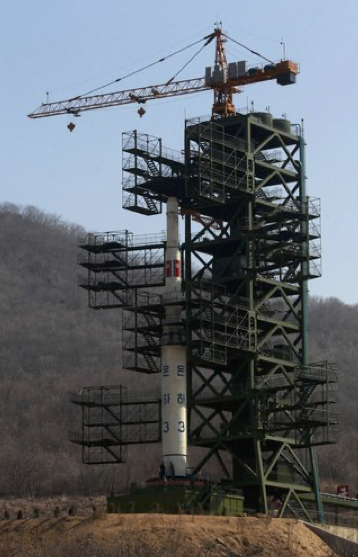

# Block 3 Projects and review

THIS NEEDS REVIEW

```{r}
stop("This needs review.")
```

## Missile intelligence

On April 12, 2012, North Korea tested its first candidate for an intercontinental missile, the three-stage Unha-3 rocket (pictured on the launch pad). Since then, there have been several successful tests.  But according to news reports, the 2012 rocket broke up at an altitude of 100 miles after about 1 minute of flight. The burn time for the first stage of the rocket is approximately 120 seconds, so the break-up occurred during the first-stage burn. Let's see what we can figure out about the rocket from this test result.

```{r echo=FALSE, out-width: "30%", fig.align="center"}

```

Rockets have to be highly optimized to fly successfully. Most of the mass of a rocket will be fuel. From the photograph, it is possible to estimate the geometrical dimensions of the rocket, and since it is mostly fuel, the mass can be estimated. The estimate for the Unha-3 was 85,000 kg.

To lift the rocket from the ground, the upward acceleration due to thrust must be more than the downward acceleration from gravity. North Korea, as secretive as it is, has the same acceleration due to gravity as everywhere else on Earth's surface, about 9.8 m/s$^2$.

> Question 1: *What's the minimum thrust of the rocket engine that will lift the rocket from the launchpad? Remember that thrust divided by mass is acceleration. Make sure to give units for your answer.*

<!-- Answer: thrust is roughly 10 * 85,000 = 850,000 kg m / s$^2$ -->

> Question 2: *Assuming for the sake of convenience that the mass of the Unha-3 is 90% fuel and that four-fifths of the fuel is burned at an even rate in the first 100 seconds, what will be the numeric value of $b$ (in kg/s). 

<!-- Answer: b = 4/5 * 0.9 * 85,000 kg / 100 s = 612 kg/s -->

Rocket engines can be more or less efficient. The efficiency is quantified by the ***specific impulse***, $I_s$ a quantity with dimension L/T, that is, velocity. You can conceptualize a rocket engine as a machine for accelerating fuel from velocity zero to a final velocity; the engine hurtles fuel backwards, the combustion creates the energy that gives the fuel its velocity.

Suppose an engine is burning $b$ kilograms of fuel per second. Multiplying $b$ by the specific impulse $I_s$ gives the ***thrust of the engine.*** 

> Question 3: *Demonstrate that $b I_s$ has the dimension of force (which is called thrust in this context).*


> Question 4: *Given your answers to (1) and (2) above, estimate what the specific impulse $I_s$ would have to be to generate the thrust needed to barely lift the rocket from the pad? Check your answer to make sure that you have the correct dimension and units for specific impulse.*

<!-- Thrust = I_s * b, so I_s = Thrust/b = 850,000 kg m / s$^{-2}$ / 612 kg /s = 1389 m/s-->

It might be obvious that a rocket that can barely overcome the force of gravity is unlikely to get very far in 100 seconds. But we can figure out how far. The overall acceleration of the rocket is thrust divided by mass, minus the 9.8 m/s$^2$ due to gravity. We will write thrust as $b I_s$, which will become two of the parameters in the problem. 

We have preliminary estimates for $b$ and $I_s$ from your answers to Questions (2) and (4). Another important parameter is the starting mass of the system, for which we have the estimate $m_0=85,000$ kg.

A crucial aspect of rocket physics is that the mass of the rocket gets smaller as fuel is burned. That is, mass is a function of time: $m(t) \equiv m_0 - b\, t$. This implies that the acceleration of the rocket is also a function of time:
$$\text{accel}(t) \equiv \frac{b I_s}{m_0 - b\,t} - 9.8\ .$$
Here is an implementation of $\text{accel}(t)$:

```{r}
accel <- makeFun(b * Is / (m0 - b * t) - 9.8 ~ t, m0 = 85000, Is=2000, b = 700)
```
(The values we are giving for $I_s$ and $b$ are not the ones you should have gotten from answering questions (2) and (4). We don't want to give those answers away! But you can start with these.)

The anti-derivative of $\text{accel}(t)$ is an important step toward finding the rocket velocity as a function of time. It is simple to compute:
```{r}
antiDaccel <- antiD(accel(t) ~ t)
```

Why use the awkward name `antiDaccel()` rather than simply "velocity?" Because we haven't yet found the correct ***constant of integration*** that, when added to `antiDaccel()` will give us the velocity.  To find that constant of integration, we need an additional fact about velocity: its value at a known instant. If we take that instant to be the moment of launch, we know the velocity is 0 m/s; the rocket is standing still as the engine ignites. We can find the correct constant of integration by evaluating `antiDaccel(0)` and setting the constant to the negative of that number. 

```{r}
antiDaccel(0)
```
Now we know velocity, subtract zero from `antiDaccel(t)`.

```{r}
velocity <- antiDaccel
```

> Question 5: *Find the rocket position `pos(t)` as the anti-derivative of `velocity(t)` plus the appropriate constant of integration. To find the constant of integration, we can refer to the fact that at $t=0$, the rocket's position is zero; it is still on the launch pad.

```{r echo=FALSE, results="hide}
antiDvelocity <- antiD(velocity(t) ~ t)
antiDvelocity(0) # the constant of integration
pos <- antiDvelocity
```

If we have the parameters $b$ and $I_s$ set appropriately, the rocket will reach an altitude of 100 miles (=160900 m) at $t=100$. Graph the position over the domain $0 < t < 100$.

```{r eval=FALSE}
slice_plot(pos(t) ~ t, bounds(t=0:100))
```

You will see from your graph that for $b=700$ kg/s and $I_s = 2000$ m/s that the rocket does not reach 160900 meters at $t=100$. So our parameters must be wrong. We are limited in how much we can change our estimate of $b$. If **all** the fuel were burned up at $t=100$ then $b$ would be no larger than $b \leq 0.9 \times 85,000$ kg / 100 s $=765$ kg/s. 

> Question 6: *Keeping the specific impulse at $I_s = 2000$, but increasing $b$ to 765 kg/s, does the rocket reach 160,900 m altitude at $t=100$?*  <!-- no --> 

> Question 7: *Keeping $b=765$kg/s, find the specific impulse $I_s$ that will bring the rocket to an altitude of 160900 at $t=100$. What is that specific impulse?* <!-- about 3000 m/s -->

```{r echo=FALSE, results="hide"}
accel <- makeFun(b * Is / (m0 - b * t) - 9.8 ~ t, m0 = 85000, Is=3500, b = 765)
velocity <- antiD(accel(t) ~ t)
pos <- antiD(velocity(t) ~ t)
slice_plot(pos(t)/160900 ~ t, bounds(t=0:100))
```

> Question 8: *Given the value of $I_s$ that brought the rocket to 160900 kg, what was the velocity and acceleration of the rocket at $t=100$, when it broke up. <!-- velocity= 5928 m/s and acceleration 260 m/s^2. -->

```{r echo=FALSE, results="hide"}
velocity(100)
accel(100)
```

e. A standard way to measure acceleration of planes and rockets is in terms of “g”, the acceleration due to gravity. An acceleration of 30 m/s$^2$ corresponds to 30/9.8 = 3.06 g. Untrained people loose consciousness at around 5 g, while trained pilots can stay conscious at up to 10 g. A sustained acceleration of around 20 g is considered life- threatening. 

> *How many g’s was the acceleration of the Unha-3 missile at the time of break-up?* <!-- 26.5 g -->


## Review


`r insert_calcZ_exercise("XX.XX", "yCkyoU", "Exercises/Accum/pony-freeze-room.Rmd")`

`r insert_calcZ_exercise("XX.XX", "IYwZLx", "Exercises/Accum/dolphin-choose-sofa.Rmd")`

`r insert_calcZ_exercise("XX.XX", "Zb22kJ", "Exercises/Accum/crow-bid-gloves.Rmd")`

`r insert_calcZ_exercise("XX.XX", "IXk4ua", "Exercises/Accum/elm-blow-lamp.Rmd")`


## Algebra-free calculus?

These problems deal with important aspects of calculus, but don't use either algebra or computing. Instead, they are about ideas that can help you understand the concepts of calculus (e.g., "signed area", dimension change) and provide insight into calculus operations in science and engineering.

## Boxing areas

### Problem 1

```{r child="beech-sleep-drawer.Rmd"}
```

### Problem 2

```{r child="beech-sleep-drawer2.Rmd"}
```

## Seeing slope, height, area in the same graph


```{r child="fox-make-stove.Rmd"}
```

## Jumping between dimensions

```{r child="goat-pitch-socks.Rmd"}
```

## Definite and indefinite integrals

[This is a repeat of a problem from DD-08]

```{r child="fundamental-theorem-duplicate.Rmd"}
```


Whenever you undertake to study a field, it is helpful to be able to figure out when you have already learned enough and can apply what you know with confidence to solve the analysis and design tasks you encounter. In academia, we sidestep the heart of this important question and define "enough" in procedural terms: "enough" is when the semester has ended and you have passed the final exam. For academic institutions, especially ones based on the liberal arts, there is little point in trying to be more definitive. After all, the "analysis and design tasks you [will] encounter" are as yet unknown, even though we can make reasonable guesses what many of them will be. 

You will never know all there is to know about integration. Thousands of talented and highly trained mathematicians and applied scientists have contributed to the body of knowledge over 300+ years you simply don't have enough time in your life to master all of it. Even if you devoted your life to this task, the field evolves. For instance, in 1953 (that may seem like antiquity) a hugely important integration innovation was presented [in this paper](https://bayes.wustl.edu/Manual/EquationOfState.pdf). This method, which involves using random numbers, was refined, extended, and improved. A breakthrough in 1988 led to an algorithm for solving genuinely important applied problems in statistics that had previously been thought impossible. 

Since you will never know everything about integration, you need to prioritize. But you are not yet in a position to set priorities. You're at the start of a university-level sequence of courses and don't yet know what you will encounter. Of course, your instructors know what's in that sequence of courses and can make sensible choices for you, except ... what's in those courses depends on the traditions and conventions of those fields as interpreted by by the textbook writers in those fields. That is rooted in the textbooks that those instructors used as students. In turn, those textbooks were shaped by the education of earlier textbook authors 50 and 100 years ago. 

Another aspect of the prioritization we make for you has to do with the imperatives of our jobs as teachers. Instructors focus on topics that can be *assessed* successfully with the resources at hand. In practice this means topics where answers are either right or wrong and where its possible to generate new assessment questions easily. Sometimes, in some places, the cart gets put before the horse and ease of assessment becomes the highest priority. 

*MOSAIC Calculus* is motivated by a desire to start over from scratch and reframe priorities according to what skills you are likely to need in the next few years. Yet it would be a disservice to you to sweep the floor completely clean. An important part of your work in the next few years will be engaging with instructors who communicate using their own conceptions of calculus, largely formed when they were educated. 

Which brings us to ... today's Daily Digital. We have already introduced you to methods of anti-differentiation based on algebraic notation, specifically anti-derivatives of basic modeling functions with a linear interior function. These are important and relatively easy to teach and learn. 

Today we will introduce you to two more algebraic methods of anti-differentiation: "u-substitution" and "integration by parts." You may encounter these in some of your future courses. That "may" is likely enough that instructors of those courses rank them as high-priority topics for your introduction to calculus. They want us to teach these topics and the topics are without argument traditional components of introductory statistics courses. 

Regrettably, an emphasis on three algebraic methods of integration will give you a picture that integration is about algebra. It is not. Integration is about functions. And there are many important and widely used function types for which there is no algebraic solution to the problem of integration. Yet *every function* can be anti-differentiated. And, a good technique for anti-differentiating any function is readily at hand via numerical techniques similar to the Euler method. These methods are implemented in a pretty simple R function: `antiD()`. Consider `antiD()` and learning to use it a fourth method of integration, and one that is much easier than either u-substitution or integration by parts. Since `antiD()` can handle all comers, while the algebraic methods can handle only a small (and hard to predict) set of functions, in terms of *using* anti-derivatives, `antiD()` would be the highest priority and would, on its own, be adequate for doing integration. The algebraic methods of integrating the basic modeling functions give you the vocabulary you need to communicate with the huge majority of people who learned calculus in the traditional, algebraic way. U-substitution and integration by parts bring you marginally further along, but not nearly so far along as computer algebra systems or even the traditional printed handbook called a "table of integrals." 

Finally, as you will learn in statistics, the way you take a sample is of fundamental importance in whether you will get a faithful representation of a process. In calculus textbooks (even our own MMAC text), the sample of integration problems is highly influenced by the relatively ease for instructors to generate new and never-before-seen functions that can be anti-differentiated using u-substitution or integration by parts. It is safe to say that you would never encounter such functions in professional uses of calculus. (Uses other than teaching calculus, that is!) 

If you have difficulty using u-substitution or integration by parts, you will be in the same league as the vast majority of calculus students. Think of your fellow students who master the topic in the way you think of ice dancers. It is beautiful to watch, but hardly solves every problem. People who would fall on their face if strapped to a pair of skates have nonetheless made huge contributions in technical fields, even those that involve ice.  (Prof. Kaplan once had a heart-to-heart with a 2009 Nobel-prize winner who confessed to always feeling bad and inadequate as a scientist because he had not done well in introductory calculus. It was only when he was nominated for the Nobel that he felt comfortable admitting to his "failure.") Even if you don't master u-substitution or integration by parts, remember that you can integrate any function using easily accessible resources. 


We've devoted about a third of this block on accumulation to algebraic techniques for calculating anti-derivatives. You will see these techniques in use in some of your future classes and work in science and engineering.  

It is the nature of things that some people master the algebraic techniques and many do not. But it is easy to make mistakes. Even more fundamentally, there are many accumulation problems where the functions to be integrated do not have an algebraic form for the anti-derivative. In such cases, professionals use numerical techniques such as the Euler method. 

to give you a simple way to construct the anti-derivative of (just about) any function, while minimizing the amount of computer programming, we have packaged up anti-differentiation techniques into one, easy to use R function. This is `antiD()`. 

The `antiD()` function has the same interface as `D()` or `makeFun()`: the argument is a tilde expression of the sort `sqrt(x*sin(3*x)) ~ x`. The result returned from `antiD()` is a new R function. The with-respect-to input will always be in the list of arguments. The sandbox provides a space to play with `antiD()` so that you feel comfortable using it. 

```{r eval=FALSE}
antiD(x^-2 ~ x)

f <- makeFun(sqrt(x*sin(3*x)) ~ x)
antiD(f(x) ~ x)
```

As you can see from the output of the sandbox, `antiD()` returns an R `function()`. The name on the right of the tilde expression in the argument becomes the first of the arguments to that function. There is also a `C` argument: the constant of integration. 

`antiD()` knows a few of the algebraic integration techniques, roughly at the level of the basic modeling functions part of the course. When `antiD()` identifies the tilde expression as something it can handle, it returns a function whose body is the algebraic formula for the anti-derivative (although sometimes written in a cumbersome way).

When `antiD()` does not recognize its argument as a basic modeling function, the result is still an R function with the "with respect to" argument and `C` as arguments. But the body of the function is  unintelligible to a human reader (except perhaps for the `numerical_integration()`). The method of numerical integration is more sophisticated than Euler, and is highly precise and reliable. 

We will use `antiD()` in this daily digital simply because we want to focus on the process of differential modeling. The integrals you encounter will sometimes be ones you know how to handle algebraically. It is a good idea to do such integrals by hand and then compare to the results of `antiD()` to check your work. 

**Example**: Find the numerical value of this definite integral.

$$\int^{7}_{3} e^{x^{2}} dx$$

Example Solution in R
```{r}
F <- antiD(exp(x^2)~x)
F(7) - F(3)
```


