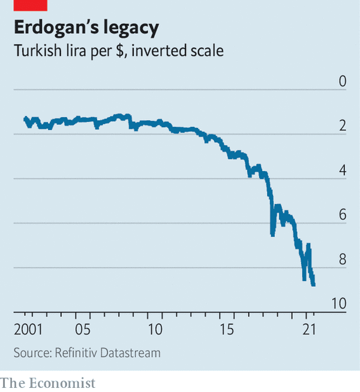

`r insert_calcZ_exercise("XX.XX", "Z8UXZ0", "Exercises/calf-see-sofa.Rmd")`

Turkey has suffered inflation near 20%/year over the last few years, as shown by this graphic from *[The Economist](https://www.economist.com/img/b/600/653/90/sites/default/files/images/print-edition/20210710_EUC775.png)* news magazine. Note the "inverted scale" of the graph, which simply means it has been flipped top for bottom. This was done to convey correctly that the Turkish unit of currency, the lira, has been decreasing in value over the last 10 years, meaning that one US dollar can buy increasing amounts of lira. Other than this up-down flipping, the vertical scale is a normal, linear scale.

```{r}

```


```{r cssw-1, echo=FALSE, results="markup"}
askMC(
  "Suppose that each year, since 2000, you had bought $100 USD of Turkish lira, saving them under your mattress. How many lira would you have accumulated up to 2021? (Choose the best of these answers.)",
  "300 lira" = "This is just about the average number of Turkish lira that could be bought with $100 USD during the time period shown.",
  "600 lira",
  "3000 lira",
  "+6000 lira+",
  random_answer_order=FALSE
)
```

