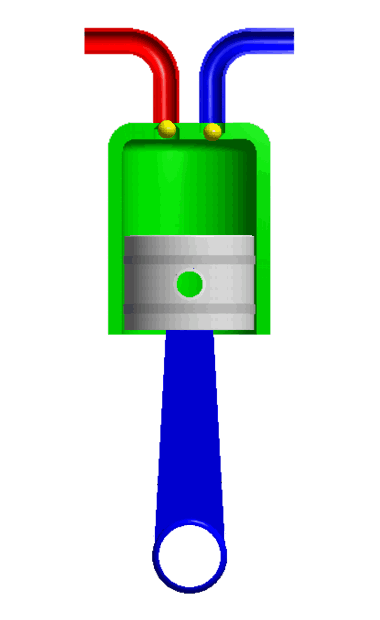
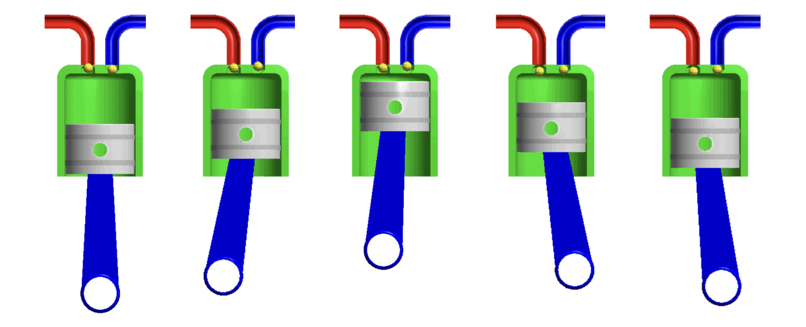

```{r include=FALSE}
library("mosaic")
library("mosaicCalc")
```

In the 1660s, John Boyle made use of then-new instrumentation to measure gas pressure. He discovered what's now called *Boyle's Law*, which says that, at constant temperature in a closed system, pressure times volume is a constant:

$$PV = const$$ 
In the 1720s, Daniel Fahrenheit developed the first reliable thermometer consisting of a column of mercury in a glass straw. He developed a temperature scale which divided the range from freezing to boiling into 180 small units, which he called "degrees," as was traditional in measuring angles. (In 1742, Anders Celsius created another scale with freezing at 0 and 100 small units---still called "degrees"---between freezing and boiling.

With the availability of reliable thermometers, scientists started to consider the role of temperature in the relationship between pressure and volume. Their many discoveries were eventually synthesized into a "combined gas law" and then into an "ideal gas law" which famously states:
$$PV = nRT .$$
Here, $n$ is "amount" of gas, quantified as the number of moles of the gas in the container, $T$ is temperature, and $R$ is the "ideal gas constant":
$$R = 8.314  \text{J}/(\text{K}\ \text{mol})$$
The "mol" cancels out the dimension of $n$, the $K$ cancels out the dimension of $T$, leaving us with $PV$ having the dimension of energy (Joules). The temperature $T$ is measured in degrees Kelvin, which is just like Celsius but moving the location of 0 from freezing to ... well ... the hypothetical temperature when $PV=0$, which can be estimated by extrapolating measurements of $PV(T)$ (that is, $PV$ as a function of $T$) to the $T$ where $PV = 0$. 

```{r PV-units, echo=FALSE}
askMC(
  "It's convenient to have specific units in mind for pressure and volume. Since $P V$ gives energy, let's arrange $P$ and $V$ to have units such that when multiplied the result is Joules. What is the expression of the dimension Joule in terms of the SI system, that is, time in seconds, length in meters, and mass in kg? Hint: use the above paragraph and knowing that the units for energy are consistent for potential, kinetic, or other types of energy.",
  '+$kg  m^2 s^{-2}$+',
  "$kg m / s$" = "This is the units of momentum.",
  "$kg^2 m^2 s^3$",
  "$m^2 / s^2$"
)
```

```{r PV_units2, echo=FALSE}
askMC(
  "In the SI units system, volume has units of cubic meters: $m^3$. What are the SI units for pressure in terms of kg, m, and s? The units of your answer to this question times the units for pressure should be equivilent to your answer from the previous question.",
  "+$kg m^{-1} s^{-2}$+",
  "$kg m^1 s^{-2}$" = "This is the units of force",
  "$kg^2 m^1 s^2$",
  "$m s^2 / kg$" 
)
```


For use in calculus, it's helpful to re-write the Ideal Gas Law in functional form. There are several ways to do this. For instance, if we wanted to measure the number of moles of gas in a container, we could use the function $n(P, V, T) = PV/RT$. Here, we're going to focus on pressure as a function of the other quantities:
$$P(n, V, T) = nRT/V.$$
Now consider a very simple machine consisting of a cylinder, closed on one end and sealed by a movable piston at the other, as in this picture.

```{r echo=FALSE}
if (knitr::is_html_output()) {
    
} else {
  
}
```

Source: [R. Castelnuovo - Own work, CC BY-SA 3.0](https://commons.wikimedia.org/w/index.php?curid=375503)

The machine in the picture is more complicated than the simple machine we want to model. The picture includes two small valves at the top of the cylinder connected each to a pipe.

Our machine has no valves and no pipes. The cylinder is charged with gas when it is manufactured. After that, nothing material goes in or out of the closed cylinder/piston system.

When you push on the cylinder, the volume available for the gas gets smaller and the pressure increases. When you let the cylinder push on you, the volume available gets bigger and the pressure decreases. The amount of gas, $n$, never changes. For simplicity, we'll imagine that $n=1$ and that the gas is N$_2$. This means the mass of the gas is 0.028 kg.

And, to simplify even more, let's insist that the temperature of the cylinder and its gaseous content does not change from room temperature: 293$^\circ$ Kelvin.

```{r echo=FALSE, warning=FALSE}
myP <- makeFun(n*R*T/V ~ V & T, R = 8.314, n = 1, T = 293)
slice_plot(myP(V, T=300) ~ V, color = "dodgerblue", domain(V = c(1, 10)), label_text = "300 K") %>%
  slice_plot(myP(V, T=1200) ~ V, label_text = "1200K", label_x = 0.3, color = "orange") %>%
  gf_labs(y = "Pressure (kg / m s2)", x = "Volume (m^3)") %>%
  gf_lims(y = c(0, 5000))
```

If you start in a high-volume, low-pressure state and push the piston to move to a low-volume, high-pressure state at the same temperature, you will be putting energy into the machine.

The "area" of each little box in the graph, that is, pressure times volume, 

```{r PV3, echo=FALSE}
askMC(
  "How much energy (in Joules) corresponds to one small rectangle of area in the graph?",
  "500 J"="pick a gray box, what are its dimensions?",
  "+625 J+",
  "2500 J"="pick a gray box, what are its dimensions?",
  "25,000 J"="This is four gray boxes, not one",
  random_answer_order = FALSE
)
```

```{r PV4, echo=FALSE}
askMC(
  "By counting rectangles in the graph, estimate how much energy needs to be put into the machine when the  volume changes from 7.5 m$^3$ to 2.5 m$^3$ at a temperature of 300 K?",
  "1000 J",
  "+3000 J+",
  "5000 J",
  "10,000 J",
  random_answer_order = FALSE
)
```

Now that you have compressed the gas in the cylinder, by doing work on it, let's heat up the machine to 1200K.

```{r PV5, echo=FALSE}
askMC(
  "What will be the pressure of the gas when the volume of the machine is 2.5 m$^3$ at temperature 1200 K? (The units will be kg m$^{-1} $s^{-2}$)",
  "1000",
  "2000",
  "3000", 
  "+4000+",
  random_answer_order = FALSE
)
```

```{r PV6, echo=FALSE}
askMC(
  "Starting with the machine at 1200K and a volume of 2.5 m$^3$, how much energy will the machine transfer to you when it expands to 7.5 m$^3$? Estimate this by counting squares in the graph.",
  "about 5000 J",
  "+about 10,000 J+",
  "about 50,000 J",
  "about 100,000 J",
  random_answer_order = FALSE
)
```

The net work done by the machine in completing the cycle, shifting from compression at low temperature to expansion at high temperature, is the difference between the energy put out by the machine when expanding and the energy put into the machine to compress the gas. Such a machine is called a "heat engine" since it turns a source of high temperature and a source of low temperature into energy.

In a `r sandbox_link()`, evaluate the code below. The first line defines a function $P(V, T)$ with default $n=1$ mole of gas. Anti-differentiate $P()$ with respect to $V$ then calculate the energy needed to compress the cylinder at the low temperature, that is $$\int_{7.5}^{2.5} P(V, T=300) dV .$$ Call this numerical result `compress_energy`. 

Similarly, calculate the energy done by the machine in the high-temperature expansion $$\int_{2.5}^{7.5} P(V, T=1200) dV .$$ Call this numerical result `expand_energy`. 

You may want to make a graph of your $P(V, T)$ function to check that it is right. Also, check that the integrals are right by comparing them to the rough estimate you made earlier by counting squares.

```{r eval=FALSE}
P <- makeFun( n*8.314*T/V ~ V + T, n=1)
antiP <- makeFun(n*8.314*T*log(V) ~ V + T, n=1)

compress_energy <- ... evaluate antiP appropriately
expand_energy   <- ... ditto
compress_energy # prints out the values 
expand_energy
```

```{r PV7-check, eval=FALSE, echo=FALSE}
# myP <- makeFun(n*R*T/V ~ V & T, R = 8.314, n = 1, T = 293)
grade_result(
  #pass_if( ~ compress_energy < 0, message = "It was negative"),
  fail_if( ~ ! abs(abs(compress_energy) - 2740)<1, message="Are you sure you set the temperature to 300K and integrated from V = 7.5 to 2.5?"),
  fail_if( ~ ! abs(abs(expand_energy) - 10960)<1, message="Are you sure you set the temperature to 1200K and integrated from V = 2.5 to 7.5?"),
  pass_if( ~ TRUE)
)
```
