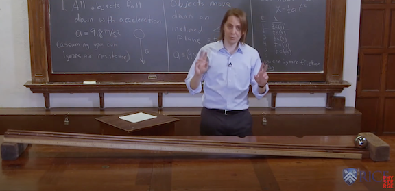

# Continuous change {#sec-continuous-change}

```{r child="../starter.Rmd"}
```

For our purposes, a good definition of calculus is  

> *The use of functions to model and explore continuous change*

In previous chapters we defined and studied functions. Now it is time to get at the core of calculus, the idea of "continuous change."


## Mathematics in motion

The questions that started it all had to do with motion of planets and marbles. In more technical language, "ballistics," the science of balls. There were words to describe speed: fast and slow. There were words to describe force: strong and weak, heavy and light. And there were words to describe location and distance: far and near, long and short, here and there. But what were the relationships among these things? And how did time fit in, an intangible quantity that had aspects of location (long and short) and speed (quick and slow)? 

Galileo (1564-1642) started the ball rolling.^[Galileo was not aware of Kepler's elliptical theory, even though they lived at the same time.] As the son of a musician and music theorist, he had a sense of musical time, a steady beat of intervals. When a student of medicine in Pisa, he noted that swinging pendulums kept reliable time, regardless of the amplitude of their swing. After unintentionally attending a geometry lecture, he turned to mathematics and natural philosophy. 


Using his newly developed apparatus, the telescope, Galileo's observations put him on a collision course with the accepted classical truth about the nature of the planets. Seeking to understand gravity, he built an apparatus that enabled him accurately to measure the position in time of a ball rolling down a straight ramp. The belled gates he set up to mark the ball's passage were spaced evenly in musical time: 1, 2, 3, 4, .... To get this even spacing in time, Galileo found he had to position the gates unevenly. Defining as 1 the distance of the first gate from the ball's release point, the gates were at positions 1, 4, 9, 16, .... 

```{asis eval=knitr::is_html_output()}
::: {.column-margin}
<iframe width="140" height="79" src="https://www.youtube.com/embed/9BQKe9HT1OE?start=9" title="YouTube video player" frameborder="0" allow="accelerometer; autoplay; clipboard-write; encrypted-media; gyroscope; picture-in-picture" allowfullscreen></iframe>

A re-enactment of Galileo's rolling-ball experiment. The frets on the ramp are at positions 2 cm, 8 cm, 18 cm, 32 cm, 50 cm, ..., that is, 2 cm times 1, 4, 9, 16, 25.
:::
```

```{r eval=knitr::is_latex_output(), echo=FALSE}
#| label: fig-galileo-reinactment
#| fig-cap: "A re-enactment of Galileo's rolling-ball experiment. The frets on the ramp are at positions 2 cm, 8 cm, 18 cm, 32 cm, 50 cm, ..., that is, 2 cm times 1, 4, 9, 16, 25. Link to video: <https://youtu.be/9BQKe9HT1OE?t=9>"
#| column: margin


```


::: {#tbl-galileo-ball }

$t$ | $x(t)$ | first increment | second increment
----|--------|-------|-------
0   | 0      | 1        | 2
1   | 1      | 3        | 2
2   | 4      | 5        | 2
3   | 9      | 7        | 
4   | 16     |          |

Galileo's observations and their first & second increments. 

:::


Anyone familiar with the squares of the integers can see the pattern in 1, 4, 9, 16, .... To demonstrate the pattern, Galileo took the difference between the successive positions, what we will call the "first increment." 

$$\underbrace{1 - 0}_1 \ \ \ \ \ \underbrace{4 - 1}_3\ \ \ \ \ \underbrace{9 - 4}_{5}\ \ \ \ \ \underbrace{16-9}_7\ \ \ \underset{{\Large\strut}\text{first increment}}{\text{}}$$
Next, Galileo repeated the differencing process on the first increment to produce a "second increment."

$$\underbrace{3 - 1}_2 \ \ \ \ \ \underbrace{5 - 3}_2\ \ \ \ \ \underbrace{7 - 5}_{2}\ \ \ \underset{{\Large\strut}\text{second increment}}{\text{}}$$
::: {.column-margin} 
For more about Galileo's measurements, see 
Stillman Drake (1986) "Galileo’s physical measurements" *American Journal of Physics* **54**, 302-305 <https://doi.org/10.1119/1.14634>
:::


The rule established by Galileo's observations for the motion of a ball rolling down the ramp:

> The second increment of position is constant.

## Continuous time

Galileo's mathematics of first and second increments was suited to the discrete-time measurements he was able to make. It would be for Newton to develop the continuous-time analog of increments. 

To start, we can imagine a function $x(t)$ that gives the position of the ball at any instant $t$. With this notation, Galileo's measured positions were $x(0), x(1), x(2), x(3), x(4), \ldots$, and the first increments were $x(1) - x(0)$, $x(2) - x(1)$, $x(3) - x(2)$, and so on. 

But just as position $x(t)$ is a continuous function of time $t$, the first increment can also be written as a continous function: $$y(t) \equiv x(t+1) - x(t)\ .$$
Similarly, there is a second increment function: 
\begin{eqnarray}z(t) & \equiv&  y(t+1) - y(t)\\ & = & \left[x(t+2) - x(t+1)\right] - \left[x(t+1) - x(t)\right] \\ &=& x(t+2) - 2 x(t+1) + x(t)\ .
\end{eqnarray} 

The $+1$ and $+2$ in the first and second increment functions correspond to the time elapsed from one belled gate to the next. More generally, rather than using Galileo's unit of rhythmic time, we can define the increment functions using a time quantity of our own choice; we will call it $h$.

Re-written using $h$, the first increment becomes $$y(t) \equiv x(t+h) - x(t)\ .$$
The second increment function is 
\begin{eqnarray}z(t) & \equiv&  y(t+h) - y(t)\\ & = & \left[x(t+2h) - x(t+h)\right] - \left[x(t+h) - x(t)\right] \\ &=& x(t+2h) - 2 x(t+h) + x(t)\ .
\end{eqnarray} 

Evidently, the numerical values (dimension L) of the first and second increments depend on $h$, which is a choice made by the experimenter, not a fact of nature. If the experimenter selects a large $h$, the first and second increments will be large.

It would be nice to frame the ballistics theory so that $h$ does not appear. Newton's insight amounts to taking two steps:


1. Replace the simple difference $x(t+h) - x(t)$ with a ***rate of change***, that is:
::: {.column-margin}
Note that we are using the symbol ${\cal D}\_t$ and naming the rate of change function ${\cal D}_t y(t)$. Read ${\cal D}_t$ as "the rate of change with respect to $t$.
:::
    $$\text{Rate of change of } x(t): \ \ \ \ {\cal D}_t y(t) \equiv \frac{x(t+h) - x(t)}{h}$$


Likewise, the second increment will become a "rate of change of a rate of change," a phrase that is easier to understood when written as a formula:

::: {.column-margin}
Read ${\cal D}_t {\cal D}_t y(t)$ as "the rate of change of the rate of change of $y(t)$."
:::


\begin{eqnarray}
{\cal D}_t {\cal D}_t y(t)  &\equiv&   {\cal D}_t \left(\strut \frac{{\cal D}_t y(t+h) - {\cal D}_t y(h)}{h}\right) \\
&=& \frac{y(t+h) - y(t)}{h} \\
&=& \frac{\frac{x(t+2h) - x(t+h)}{h}- \frac{x(t+h) - x(t)}{h}}{h}\\
&=& \frac{x(t+2h) - 2 x(t+h) + x(t)}{h^2}\ .
\end{eqnarray}

Admittedly, this complicated expression for the rate-of-change equivalent of Galileo's second increment hardly looks like an improvement! And it still depends on $h$.

This is where the second step of Newton's insight comes in. 

2. Make $h$ vanishingly small. 

In the next chapters, we will look at how these two steps---use rate of change rather than change and make $h$ vanishingly small---create mathematical entities that allowed Newton to extend Galileo's work to become a universal theory of motion.


## Change relationships

As you know, ***function*** is a mathematical idea used to represent a relationship between quantities. For instance, the **water volume** of a reservoir behind a dam varies with the seasons and over the years. As a function, water volume is a relationship between water volume (one quantity) and time (another quantity). Similarly, the **flow** in a river feeding the reservoir has its own relationship with time. In spring, the river may be rushing with snow-melt, in late summer the river may be dry, but after a summer downpour the river flow again rises briefly. In other words, river flow is a function of time.

***Differentiation*** is a way of describing a *relationship between relationships*. The water volume in the reservoir has a relationship with time. The river flow has a relationship with time. Those two relationships are themselves related: the river flow feeds the reservoir and thereby influences the water volume.

It is not easy to keep straight what's going on in a "relationship between relationships." Consequently, we need tools such as differentiation to aid our understanding. For instance, Johannes Kepler (1572-1630) spent years analyzing the data collected by astronomer Tycho Brahe (1546-1601). The data showed a relationship between time and the speed of a planet across the sky. Long-standing wisdom claimed that there is also a specific relationship between a planet's position and time. From antiquity, it had been claimed that planets moved in circular orbits. Kepler worked hard to find the relationship between the two relationships: speed versus time and position versus time. He was unsuccessful until he dropped the assumption that planetary orbits are circular. Testing the hypothesis that orbits are **elliptical**, Kepler was able to find a simple relationship between speed vs. time and position vs. time.  

Building on Kepler's earlier work, Newton hypothesized that planets might be influenced by the same gravity that pulls an apple to the ground. It was evident from human experience that gravity has the most trivial relationship with time: gravity is constant! But Newton could not find a link between this notion of gravity as a constant and Kepler's planetary motion as a function of time. Success came when Newton hypothesized---without any direct evidence from experience---that gravity is a function of distance. Newton's formulation of the relationship between relationships--- gravity-as-a-function-of-distance and orbital-position-as-a-function-of time---became the foundation of modern science. Newton's theories of gravity, force, and motion created an extremely complicated chain or reasoning that is still hard to grasp. Or, more precisely, it is hard to grasp *until* you have the language for describing relationships between relationships. Newton invented this language: differentiation. As you learn this language, you will find it easier to express and understand relationships between relationships, that is, the mechanisms that account for the ever-changing quantities around us.


## With respect to ...

We've introduced a bit of new notation in the previous section, ${\cal D}_t$. [In Chapter @sec-evanescent-h, when we carry out the second step of Newton's program by making $h$ vanishingly small, we will switch from the big ${\cal D}$ to a smaller one, $\partial$, to remind us that $h$ has vanished from the picture.]{.aside}
As mentioned previously, ${\cal D}$ stands for "the rate of change of ____." In use, you put a function in the slot indicated by ____. Which function depends on what you want to describe. For instance, the position of a rolling ball is a function of time:  $x(t)$. "The rate of change of $x(t)$" is written ${\cal D}_t x(t)$. This object ${\cal D}_t x(t)$ is itself a function of time. 

Another example: consider a water reservoir fed by a spring and drained by the water utility to serve its customers. Suppose $w(t)$ is the volume of water in the reservoir, a quantity that changes over time. Then ${\cal D}_t w(t)$ is the rate of change of water volume in the reservoir. Common sense suggests that the rate of change in water volume will be positive during a wet season and negative in a drought. 

The subscript on ${\cal D}_t$ is the ***with-respect-to*** input. To illustrate, suppose that $h(v, w)$ is the volume of the harvest from a field as a function of the amount of irrigation water $w$ and the amount of fertilizer used during the growing season. [Constructing such a function could be done by collecting data over many years of the harvest, along with the amount of water and fertilizer used each year.]{.aside} As will be described in Chapter @sec-partial-change, there are two different rate-of-change functions associated with $h()$. One is the rate of change in harvest volume with respect to $w$, the other is the rate change in harvest volume with respect to $v$. In everyday language, ${\cal D}_w h(v, w)$ can be used to predict how much the harvest will change if, next year, the farmer uses less irrigation water. Similarly, ${\cal D}_v h(v, w)$ can inform a farmer's decision to reduce costs by using less fertilizer.

Strictly speaking, for functions with just one input the subscript on ${\cal D}$ isn't needed. Even so, we will always include a subscript, if only for the sake of forming good habits to serve us when we do examine rates of change in functions of multiple inputs.


