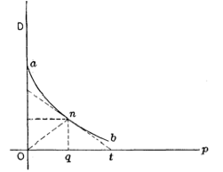

# Optimization {#sec-optim-and-shape}

```{r include=FALSE}
source("../starter.R")
```

To "optimize" means to make something as good as possible with the available resources. Optimization problems are common in science, logistics, industry, and any other area where one seeks the best solution to a problem. Some everyday examples: 

- When to harvest trees being grown for lumber. Harvest too soon and you might be losing out on the prime growing years. On the other hand, wait too long and trees will show slow or zero growth.
- Walking up too steep a slope is tiring and slows you down; that is  why hiking trails have switchbacks. However, when the switchbacks are too shallow, it takes a long time to cover the distance. What's the most efficient angle to enable hikers to get up the hill in the shortest time.
- How much salt to add to a stew. Stews can be too salty, or they can be not salty enough. Somewhere in the middle is the optimum.

## Structure of the problem

::: {.callout-tip}
## Definitions...

This section introduces several important terms relating to optimization. Become fluent with all of them. This will greatly improve your ability to master the topic.

- *decision quantity*
- *objectives*
- *objective function*
- *minimize* and *maximize*
- *minimum* and *maximum*
- *argmax* and *argmin*
:::

In an optimization problem, there is one or more input quantities whose value you have to choose. The amount of salt; the years to wait from planting to harvesting a tree; the angle of the trail with respect to the slope. We will call this the ***decision quantity***.  

Similarly, there is one or more output quantity that you value and want to make as good as possible. The taste of the stew; the amount of usable wood harvested; the time it takes to walk up the hill. The output quantities are called the ***objectives***.  

This chapter deals with optimization problems that involve only a single objective. Problems with multiple objectives are among the most interesting and important in real-world decision making. Single-objective optimization techniques are a component of the more complex decision making, but they are a good place to get started. 

The model that relates inputs to the objective output is the ***objective function***. Solving an optimization problem---once the modeling phase is complete---amounts to finding a value for the decision quantity (the input to the objective function) that produces the best output from the objective function. 

Sometimes the objective is something that you want to ***minimize***, make as small as possible. For instance, in the hiking trail problem, we seek to minimize the time it takes to walk up the trail. Sometimes you want to ***maximize*** the objective, as in the wood-harvest problem where the objective is to harvest the most wood per year. 

Mathematically, maximization and minimization are the same thing. Every minimization problem can be turned into a maximization problem by putting a negative sign in front of the objective function. To simplify the discussion, in talking about finding the solution to an optimization problem we will imagine that the goal is to maximize. But keep in mind that many circumstances in the real world, "best" can mean minimization. For example, when fitting a function to data, the parameters are selected that *minimize* the residuals.

Recall from @sec-local-extremes that there are two components to the task of maximization or minimization. The ***argmax*** is the **input** to the objective function which produces the largest output. The ***maximum*** is the value of that output.^[Another word for an "input" is "argument." Argmax is the contraction of **arg**ument producing the **max**imum output.] ***Argmin*** and ***minimum*** are the words used in a situation where you seek the smallest value of the objective function.

Once you have found the argmax you can plug that value into the objective function to find the output value. That value is the ***maximum***. 

::: {.callout-tip}
People often talk about "finding the maximum." This is misleading. Instead, the idea is to find the input to the objective function---that is, the **argmax**---that produces the maximum output.
:::

To illustrate the setup of an optimization problem, imagine yourself in the situation of a contest to see who can shoot a tennis ball the farthest into a field with a slingshot. During the contest, you will adjust the vertical angle of launch, place the ball into the slingshot's cradle, pull back as far as possible, and let go. To win the contest, you need to optimize how you launch the ball. 

The objective is to maximize the distance traveled by the ball. The ***objective function*** models the distance travelled as a function of the quantities you can control, for instance the vertical angle of launch or the amount by which you pull back the slingshot. For simplicity, we will imagine that the slingshot is pulled back by a standard amount, producing a velocity of the ball at release of $v_0$. You will win or lose based on the angle of launch you choose. 

Before you head out into the field to experiment, let's prepare by modeling the objective function. Using some principles of physics and mathematics (which you may not yet understand) the distance flown by the ball (horizontally) will be a function of the angle of launch $\theta$ and the initial velocity $v_0$. 

The mathematics of such problems involves an area called ***differential equations***, an important part of calculus which we will come to later in the course. Since you don't have the tools yet, we will just state a simple model of how long the ball stays in the air.
$$\text{duration}(v_0, \theta) = 2 \frac{v_0}{g} \sin(\theta)$$ $g$ is the acceleration due to gravity, which is about $9.8 \text{m}\text{s}^{-2}$, assuming that the contest is being held on Earth.

The horizontal distance travelled by the tennis ball will be $$\text{distance}(v_0, \theta) = \cos(\theta) v_0\times \text{duration}(v_0, \theta) = 2 \frac{v_0^2}{g} \cos(\theta)\sin(\theta) / g$$
Our objective function is distance(), and we seek to find the argmax. Distance() has two inputs, but let's assume there is only one decision quantity $\theta$ and that $v_0$ is fixed. @fig-ball-theta is drawn for $v_0 = $ cm/sec. 

Finding the argmax can be accomplished simply by plotting the function $\text{distance}(v_0, \theta)$ with 5061 cm/sec.

::: {#fig-ball-theta layout-ncol=2}
```{r echo=FALSE}
#| label: fig-ball-theta1
#| fig-subcap: 
#| - From 0 to 90 degrees
f <- makeFun(5227*cos(pi*theta/180)*sin(pi*theta/180) ~ theta)
slice_plot(f(theta) ~ theta, bounds(theta=c(0,90))) %>%
  gf_labs(x = "Angle θ (deg)", y= "Distance travelled (cm)")
```

```{r echo=FALSE, out.width="60%" }
#| label: fig-ball-theta-zoom
#| fig-subcap:
#| - "Zooming in around the argmax: 40 to 50 degrees"
slice_plot(f(theta) ~ theta, bounds(theta = c(40, 50)), color="blue") %>%
  gf_labs(x = "Angle θ (deg)", y= "Distance travelled (yards)") |>
  gf_theme(aspect.ratio = .15) +
  scale_x_continuous(breaks=c(40,45,50)) +
  scale_y_continuous(limits = c(2500, 2800), breaks = c(2500, 2600, 2700,  2800))
```
Zooming in on the argmax of the objective function. It is important to look at the scale of the vertical axis. Any value of $\theta$ between about 40 and 50 degrees gives a close approximation to the maximum.
:::

In the simple model of  a tennis ball launched at an angle $\theta$ from the horizontal, the distance travelled  is $$\text{distance}(\theta) \equiv 2 v_0^2 / g$ times $\cos(\theta)\sin(\theta)$$.

@fig-ball-theta1 shows the objective function $\text{distance}(\theta)$. *Be careful when interpreting the graph.* At first glance, you may think the graph shows the parabolic trajectory of the tennis ball. It does not. Instead, the function tells *how far* (in cm) the tennis ball flew before hitting the ground. Notice that the distance flown is zero for a launch angle of 90$^\circ$. If you aim the ball straight up, it will come down in the same place it was launched.

You can see that the maximum distance is about 2600 cm and that this occurs at an argmax $\theta^\star$ that is a bit less than 50$^\circ$.

Zooming in on the $\theta$ axis (@fig-ball-theta-zoom) let's you find the argmax with more precision: the argmax is $\theta^\star = 45^\circ$.

::: {.callout-tip}
## Interpreting the argmax

The graphical solution given to the slingshot problem is entirely satisfactory. Whether that solution will win the contest depends on whether the model we built for the objective function is correct. We have left out, for instance, air resistance, which is potentially important. 

Solving the optimization problem has prepared us to test the result in the field. Perhaps we will find that the real-world optimum angle is somewhat steeper or shallower than $\theta = 45^\circ$. 

Besides the argmax, another important quantity to read from the graph in @fig-ball-theta is the ***precision*** of the argmax. In strict mathematical terms, the argmax for the tennis-ball problem is exactly 45 degrees at which point $\cos(\theta)\sin(\theta) = 0.5$. Suppose, however, that the ball were launched at only 40 degrees. Five degrees difference is apparent to the eye, but the result will be essentially the same as for 45 degrees: $\cos(\theta)\sin(\theta) = 0.492$.  The same is true for a launch angle of 50 degrees. For both "sub-optimal" launch angles, the output is within 2 percent of the 45-degree result. It is easy to imagine that a factor outside the scope of the simple model---the wind, for instance---could change the result by as much or more than 2 percent, so a practical report of the argmax should reasonable be "40 to 50 degrees" rather than "exactly 45 degrees."  

Contests are won or lost by margins of less than 1%, so you should not casually deviate from the argmax. On the other hand, $45^\circ$ is the argmax of the *model*. Reality may deviate from the model. For instance, suppose that air resistance or wind might might affect distance by 1%. That is. the real-world result might deviate by as much as 1% of the model value. If so, we shouldn't expect the real-world argmax to be any closer to 45$^\circ$ than $\pm 5^\circ$; anywhere in that domain interval generates an output that is within 1% of the maximum output for the model. 
:::

## Derivatives and optimization

We are now going to reframe the search for the argmax and its interpretation in terms of derivatives of the objective function with respect to the decision quantity ($\theta$ in the slingshot problem). For a function with one input, this will not be an improvement from the look-at-the-graph technique to find the argmax. However, a genuine reason to use derivatives is to set us up in the future to solve problems with more than one input, where it is hard to draw or interpret a graph. Also, describing functions in the language of derivatives can help us think more clearly about aspects of the problem, such as the precision of the argmax. 

With a graph such as @fig-ball-theta, it is easy to find the argmax; common sense carries the day. So it won't be obvious at first why we will take the following approach:

Let's denote an argmax of the objective function $f(x)$ by $x^\star$. 
Let's look at the derivative $\partial_x f(x)$ in the neighborhood of $x^\star$. Referring to @fig-ball-theta, where $x^\star = 45^\circ$, you may be able to see that $\partial_x f(x^\star)$ is zero; the line tangent to the function's graph at $x^\star$ is horizontal.   

Seen another way, the slope of $f(x)$ to the left of $x^\star$ is positive. Moving a tiny bit to the right (that is, increasing $x$ by a very small amount) increases the output $f(x)$.  On the other hand, just to the right of $x^\star$, the slope of $f(x)$ is negative; as you reach the top of a hill and continue on, you will be going downhill. So the derivative function is positive on one side of $x^\star$ and negative on the other, suggesting that it crosses zero at the argmax. 

Common sense is correct: Walk uphill to get to the peak, walk downhill to move away from the peak. At the top of a smooth hill, the terrain is level. (Since our modeling functions are smooth, so must be the hills that we visualize the functions with.)

Inputs $x^\star$ such that $\partial_x f(x^\star) = 0$ are called ***critical points***. Why not call them simply argmaxes? Because a the slope will also be zero at an argmin. And it is even possible to have the slope be zero at a point that is  neither an argmin or an argmax. 

At this point, we know that values $x^\star$ that give $\partial_x f(x^\star) = 0$ are "critical points," but we haven't said how to figure out whether a given critical point is an argmax, an argmin, or neither. This is where the behavior of $\partial_x f(x)$ *near* $x=x^\star$ is important. If $x^\star$ is an argmax, then $\partial_x f(x)$ will be positive to the left of $x^\star$ and negative to the right of $x^\star$; walk up the hill to get to $x^\star$, at the top the hill is flat, and just past the top the hill has a negative slope. 

For an argmin, changing $x$ from less than $x^\star$ to greater than $x^\star$;  you will be walking down into the valley, then level at the very bottom $x=x^\star$, then back up the other side of the valley after you pass $x=x^\star$. @fig-d2-hill shows the situation.  

```{r echo=FALSE, warning=FALSE}
f <- makeFun(sin(2*pi*x/4)~ x)
f2 <- D(f(x) ~ x)
P1 <- slice_plot(f(x) ~ x, bounds(x=c(0.5, 1.5))) %>%
  gf_labs(title="Objective function") %>%
  gf_vline(xintercept = ~ 1, color="dodgerblue", alpha = 0.25, size=2) %>%
  gf_text(.9 ~ 0.95, label="x*", size=6, color="dodgerblue")
P2 <- slice_plot(f(x) ~ x, bounds(x=c(2.5, 3.5))) %>%
  gf_labs(title="Objective function") %>%
  gf_vline(xintercept = ~ 3, color="dodgerblue", alpha = 0.25, size=2) %>%
  gf_text(-0.8 ~ 2.97, label="x*", size=6, color="dodgerblue")
P3 <- slice_plot(f2(x) ~ x, bounds(x=c(0.5, 1.5))) %>%
  gf_labs(title="", y="Derivative of f(x)") %>%
  gf_vline(xintercept = ~ 1, color="dodgerblue", alpha = 0.25, size=2) %>%
  gf_text(0.96 ~ 0.95, label="x*", size=6, color="dodgerblue") %>%
  gf_hline(yintercept = ~ 0, color="orange")
P4 <- slice_plot(f2(x) ~ x, bounds(x=c(2.5, 3.5))) %>%
  gf_labs(title="", y="Derivative of f(x)") %>%
  gf_vline(xintercept = ~ 3, color="dodgerblue", alpha = 0.25, size=2) %>%
  gf_text(.85 ~ 2.97, label="x*", size=6, color="dodgerblue") %>%
  gf_hline(yintercept = ~ 0, color="orange")
# gridExtra::grid.arrange(P1, P2, P3, P4, ncol=2)
```

::: {#fig-d2-hill layout-ncol=2}
```{r echo=FALSE, warning=FALSE}
#| label: fig-d2-hill-a
#| fig-subcap:
#| - Objective function
P1
```

```{r echo=FALSE, warning=FALSE}
#| label: fig-d2-hill-b
#| fig-subcap:
#| - Objective function
P2
```

```{r echo=FALSE, warning=FALSE}
#| label: fig-d2-hill-c
#| fig-subcap:
#| - Derivative of objective function
P3
```

```{r echo=FALSE, warning=FALSE}
#| label: fig-d2-hill-d
#| fig-subcap:
#| - Derivative of objective function
P4
```

Very close to an argmax or argmin (Panels a and b) objective functions often look like a parabola. Similarly, the derivative of the objective function (Panels c and d) are a straight line. The argmax is located where the derivative function crosses zero.

:::

The bottom row of graphs in @fig-d2-hill shows the derivative of the objective function $f(x)$, that is, $\partial_x f(x)$. You can see that for the argmax of $f(x)$, the derivative $\partial_x f(x)$ is positive to the left and negative to the right. Similarly, near the argmin of $f(x)$, the derivative $\partial_x f(x)$ is negative to the left and positive to the right.  

Stated another way, the derivative $\partial_x f(x)$ has a negative slope just to the left of an argmin and a positive slope to the left of an argmax.  

The second derivative of the objective function $f(x)$ at a critical point $x^\star$ is what tells us whether the critical point is an argmax, an argmin, or neither. 

::: {.column-margin}
Critical point $x^\star$ | $\partial_x f(x^\star)$ | $\partial_{xx} f(x^\star)$
-----------------------|---------------------|-------------------
argmax | 0 | negative
argmin | 0 | positive
neither| 0 | 0
:::

i. The **slope** of a function $f(x)$ at any input $x$ is the **value** of the derivative function $\partial_x f(x)$ at that same $x$.
ii. The  **concavity** of a function $f(x)$ at any input is the **slope** of the derivative function, that is, $\partial_{xx} f(x)$.
iii. Putting (i) and (ii) together, we get that the **concavity** of a function $f(x)$ at any input $x$ is the **value of the second derivative** function, that is, $\partial_{xx} f(x)$.
iv. At an argmax $x^\star$ of $f(x)$, the value of the derivative function $\partial_x f(x^\star)$ is zero and the value of the second derivative function $\partial_{xx} f(x^\star)$ is **negative**. The situation at an argmin is along the same lines, the derivative of the objective function is zero and the second derivative is **positive**. 

::: {.callout-important #try-critical-point}
## Where's the critical point?

You're familiar with the quadratic polynomial: $$g(x) = a_0 + a_1 x + a_2 x^2$$
The graph of a quadratic polynomial is a ***parabola***, which might be concave up or concave down. A parabola has only one critical point, which might be an argmin or an argmax. 

Let's find the critical point .... 

We know that the critical point is $x^\star$ such that $\partial_x g(x^\star) = 0$. Since we know how to differentiate a power law, we can see that
$$\partial_x g(x) = a_1 + 2 a_2 x$$ and, more specifically, at the critical point $x^\star$ the derivative will be
$$a_1 + 2 a_2 x^\star = 0$$
The above is an equation, not a definition. It says that whatever $x^\star$ happens to be, the quantity $a_1 + 2 a_2 x^\star$ must be zero. Using simple algebra, we can find the location of the critical point $$x^\star = -\frac{a_1}{2 a_2}$$ 

:::


::: {#thm-demand-curve style="display: none;"}
---In economics, demand for a good is a function of the good's price (and other things). This function is called the "demand curve."
:::
::: {.callout-note icon=false} 
## @thm-demand-curve The demand "curve"

In economics, a monopoly or similar arrangement can set the price for a good or commodity. Monopolists can set the price at a level that generates the most income for themselves. 

```{r echo=FALSE}
#| label: fig-cournot-demand2
#| fig-cap: "Demand as a *function* of price, as first published by Antoine-Augustin Cournot in 1836. [Source](https://www.richmondfed.org/~/media/richmondfedorg/publications/research/economic_review/1992/pdf/er780201.pdf))" 
#| out-width: "50%"

```

In 1836, early economist Antoine-Augustin Cournot published a theory of revenue versus demand based on his conception that demand will be a monotonically decreasing function of price. (That is, higher price means lower demand.) we will write as $\text{Demand}(p)$ demand as a function of price.

The ***revenue*** generated at price $p$ is $R(p) \equiv p \text{Demand}(p)$: price times demand.

To find the revenue-maximizing demand, differentiate $R(p)$ with respect to $p$ and find the argmax $p^\star$ at with $\partial_p R(p^\star) = 0).$ This can be done with the product rule.

$$\partial_p R(p) = p \ \partial_p \text{Demand}(p) + \text{Demand}(p)$$
At the argmax $p^\star$ we have: $$p^\star \partial_p \text{Demand}(p^\star) + \text{Demand}(p^\star) = 0 \ \ \stackrel{\text{solving for}\ p^\star}{\Longrightarrow} \ \ p^\star = - \frac{\text{Demand}(p^\star)}{\partial_p \text{Demand}(p^\star)}$$

If the monopolist knows the demand function $D(p)$, finding the revenue maximizing price is a simple matter. But in general, the monopolist does not know the demand function in advance. Instead, an informed guess is made to set the initial price $p_0$. Measuring sales $D(p_0)$ gives one point on the demand curve. Then, try another price $p_1$. This gives another point on the demand curve as well as an estimate 
$$\partial_p D(p_0) = \frac{D(p_1) - D(p_0)}{p_1 - p_0}$$
Now the monopolist is set to model the demand curve as a straight-line function and easily to find $p^\star$ for the model. For instance, if the demand function is modeled as $D_1 (p) = a + b p$, the optimal price will be $p^\star_1 = - \frac{a + b p^\star}{b}$ which can be solved as $p^\star_1 = - a/2b$. 

$p^\star_1$ is just an estimate of the optimum price. Still, the monopolist can try out that price, giving a third data point for the demand function. The new data can lead to a better model of the demand function. With the better estimate, find a new a argmax $p^\star_2$. This sort of iterative process for finding an argmax of a real-world function is very common in practice. 


<!--

As described in "Marshallian Cross Diagrams and
Their Uses before Alfred Marshall:
The Origins of Supply and Demand Geometry", 
Thomas M. Humphrey, ECONOMIC REVIEW. MARCH-APRIL 1992 [Link to PDF](https://www.richmondfed.org/~/media/richmondfedorg/publications/research/economic_review/1992/pdf/er780201.pdf)

To find the revenue-maximizing price, Cournot
differentiated the revenue function $R(p) = pD(p) = pF(p)$
with respect to price. (Note that the product rule applies here.) He obtained the expression $pF'(p) + F(p)$, where $F'$ is the derivative of the demand function $F(p)$. Setting this expression equal to zero as required for a maximum and rearranging, he got $p = -F(p)/F'(p)$, which says that the revenue maximizing price must equal the ratio of the quantity demanded to the slope of the demand curve at that price.

-->


:::

## Be practical! {#sec-flat-on-top}

Decision making is about choosing among alternatives. In some engineering or policy contexts, this can mean finding a value for an input that will produce the "best" outcome. For those who have studied calculus, it is natural to believe that calculus-based techniques for optimization are the route to making the decision.

We emphasize that the optimization techniques covered in this chapter are **only part** of a broader set of techniques for real-world decision-making problems. In particular, most policy contexts involve ***multiple objectives***. For example, in designing a car one goal is to make it cheap to manufacture, another to make it attractive, and still another to make it safe. These different objectives are often at odds with one another. In Block 4 of this text, we will discuss some calculus techniques that help policy-makers in multi-objective settings. 

For now, sticking with the idealized (and often unrealistic) setting of maximizing a single objective, with one or more inputs.
Recall the setting for calculus-type maximization. You have a function with one or more inputs, say, $f(x)$ or $g(x,y)$ or, often, $h(x, y, z, \ldots)$ where $\ldots$ might be standing for tens or hundreds or thousands of inputs or more.

If you can graph the function (feasible for one- or two-input functions), you can often easily scan the graph by eye to find the peak.  The basis of the calculus techniques is the observation that, at the argmax of a smooth function, the derivative of the function is 0. 

For example, consider [a style problem that often appears in calculus textbooks](https://www.dummies.com/education/math/calculus/calculate-the-optimum-volume-of-a-soup-can-practice-question/).  Suppose you have been tasked to design a container for a large volume V of liquid. The design specifications call for the weight of the container to be as little as possible. (This is a *minimization* problem, then.) In classical textbook fashion, the specifications might also stipulate that the container is to be a cylinder made out of a particular metal of a particular thickness. 

The above is a lovely geometry/calculus problem. Whether it is relevant to any genuine, real-world problem is another question.


::: {#fig-cylinder-diagram}
{width="40%"}

Diagram of a cylinder
:::

Using the notation in the diagram, the volume and surface area of the cylinder is $$V(r, h) \equiv \pi r^2 h \ \ \ \text{and}\ \ \ A(r, h) \equiv 2 \pi r^2 + 2 \pi r h$$

Minimizing the weight of the cylinder is our objective (according to the problem statement) and the weight is proportional to the surface area. Since the volume $V$ is given (according to the problem statement), we want to re-write the area function to use volume:

$$h(r, V) \equiv V / \pi r^2 \ \ \ \implies\ \ \ A(r, V) = 2 \pi r^2 + 2 \pi r V/\pi r^2 = 2 \pi r^2 + 2 V / r$$
Suppose $V$ is specified as 1000 liters. A good first step is to choose appropriate units for $r$ to make sure the formula for $A(r, V)$ is dimensionally consistent. Suppose we choose $r$ in cm. Then we want $V$ in cubic centimeters (cc). 1000 liters is 1,000,000 cc. Now we can plot a slice of the area function:

::: {#fig-cyl-surface-area}
```{r echo=FALSE}
A <- makeFun(2*pi*r^2 + 2*V/r ~ r, V=1000000)
slice_plot(A(r) ~ r, bounds(r=c(10, 100))) %>%
  gf_labs(x = "radius (cm)", y = "Surface area of container (square cm)")
```

Surface area of a cylindrical tank (@fig-cylinder-diagram) of capacity 1000 liters as a function of radius. Since the volume is specified, the height of the cylinder is a function of radius.
:::


As always, the function's derivative is zero at the optimal $r$. In the graph, the argmin is near $r=50$ cm at which point the minimum is about 50,000 cm$^2$. Since $h(r,V) = V/\pi r^2$, the required height of cylinder will be near $10^6 / \pi 50^2 = 127$cm. 

In calculus courses, the goal is often to find a **formula** for the optimal radius as a function of $V$. So we differentiate the objective function---that is, the area function for any $V$ and $r$ with respect to $r$,
$$\partial_r A(r, V) = 4 \pi r - 2 V / r^2$$
Setting this to zero (which will be true at the optimal $r^\star$) we can solve for $r^\star$ in terms of $V$:
$$4 \pi r^\star - 2 \frac{V}{\left[r^\star\right]^2} = 0 \ \ \ \Longrightarrow\ \ \ 4\pi r^\star = 2\frac{V}{\left[r^\star\right]^2} \Longrightarrow\ \ \ \left[r^\star\right]^3 = \frac{1}{2\pi} V \ \ \ \Longrightarrow\ \ \  r^\star = \sqrt[3]{V/2\pi}$$

For $V = 1,000,000$ cm$^3$, this gives $r^\star = 54.1926$ cm which in turn implies that the corresponding height $h^\star = V/\pi (r^\star)^2 = 108.3852$ cm. 

We've presented the optimum $r^\star$ and $h^\star$ to the nearest **micron**. (Does that make sense to you? Think about it for a moment before reading on.) 

In modeling, a good rule of thumb is this: "If you don't know what a sensible precision is for reporting your result, you don't yet have a complete grasp of the problem." Here are two reasonable ways to sort out a suitable precision.

1. Solve a closely related problem that would have been equivalent for many practical purposes.
2. Calculate how much the input can deviate from the argmax while producing a trivial change in the output of the objective function.

Approach (2) is always at hand, since you already know the objective function. Let's graph the objective function near $r = 54.1926$ ...

::: {#fig-container-objective}
```{r echo=FALSE}
slice_plot(A(r) ~ r, bounds(r=c(50, 60))) %>%
  gf_point(A(54.1926) ~ 54.1926, shape="*", size=10) %>%
  gf_labs(x = "radius (cm)", y="Container surface area (square cm)")
```

Zooming in on the argmin for the surface area of the container as a function of radius of the cylinder.
:::

Look carefully at the axes scales. Deviating from the mathematical optimum by about 5cm (that is, 50,000 microns) produces a change in the output of the objective function by about 400 units **out of 55,000**. In other words, about 0.7%. 

It is true that $r^\star = 54.1926$ cm gives the "best" outcome. And sometimes such precision is warranted. For example, improving the speed of an elite marathon racer by even 0.1% would give her a 7 second advantage: often the difference between silver and gold!

What's different is that you know exactly the ultimate objective of a marathon: finish faster. But you may not know the ultimate objective of the system your "optimal" tank will be a part of. For instance, your tank may be part of an external fuel pod on an aircraft. Certainly the aircraft designers want the tank to be as light as possible. But they also want to reduce drag as much as possible. A 54 cm diameter tube has about 17% more drag than a 50 cm tube. It is probably well worth increasing weight by 0.7% to save that much drag.

In reporting the results from an optimization problem, you ought to give the decision maker all relevant information. That might be as simple as including the above graph in your report.

We mentioned another technique for getting a handle on what precision is meaningful: (1) solve a closely related problem. It can requires some insight and creativity to frame the new problem. For instance, large capacity tanks often are shaped like a lozenge: a cylinder with hemi-spherical ends.  

::: {#fig-hemisphere}


Diagram of a cylindrical tank with hemispherical end caps.
```

Using $h$ for the length of the cylindrical portion of the tank, and $r$ for the radius, the volume and surface area are:
$$V(r, h) = \pi r^2 h + \frac{4}{3} \pi r^3 \ \ \ \text{and}\ \ \ A(r,h) = 2 \pi r h + 4 \pi r^2$$
Again, $V$ is specified as 1000 liters. As detailed in Exercise `r ref_ex("ph92lT")`, the surface area of this 1000-liter tank is about 48,400 cm$^2$. This is more than 10% less than for the cylindrical tank. 


