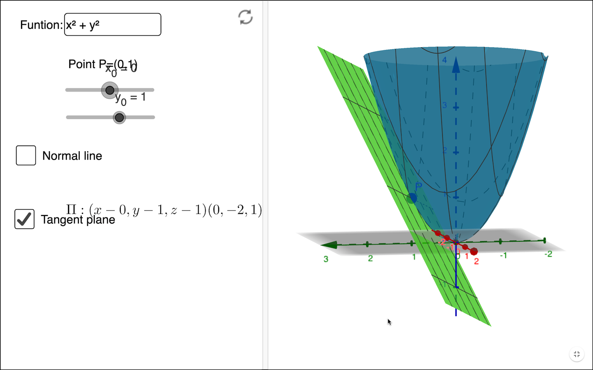

# Partial change and the gradient vector

```{r child="../starter.Rmd"}
```

This is a good time to point out something we have been doing all along, but which has likely been such a persistent component of your mathematics education that you may not have realized that it is a construction. 

We have two ways by which we represent functions:

1. As a ***computational algorithm*** for generating the output from an input(s), typically involving arithmetic and such. 
2. As a geometrical entity, specifically the graph of a function which can be a ***curve*** or, for functions of two inputs, a ***surface***.

These two modes are sometimes intertwined, as when we use the name "line" to refer to a computational object: $\line(x) \equiv a x + b$.

Unfortunately for functions of two inputs, a ***surface*** is hard to present in the formats that are most easily at hand: a piece of paper, a printed page, a computer screen. That's because a curved surface is naturally a 3-dimensional object, while paper and screens provide two-dimensional images. Consequently, the graphics mode we prefer for presenting functions of two variables is the contour plot, which is not a single geometrical object but a set of many objects: contours, labels, colored tiles.  

We've been doing calculus on functions of one variable because it is so easy to exploit both the computational mode and the graphical mode. And it might fairly be taken as a basic organizing theme of calculus that  

> a line segment approximates a curve in a small region around a point.

When figuring out the derivative function $\partial_x f(x)$ from a graph of $f(x)$, we find the tangent to the graph at each of many input values, record the slope of the line (and throw away the intercept) and then write down the series of slopes as a function of the input, typically by representing the slope by position along the vertical axis and the corresponding input by position along the horizontal axis. @fig-segment-deriv shows the process. 

```{r echo=FALSE, warning=FALSE}
f <- rfun(~ x, seed=977)
df <- D(f(x) ~ x)
dom = c(-3, 3)
touches = seq(dom[1] + 0.3, dom[2] - 0.3, by = 0.25)
Pts <- tibble(x = touches, y = f(x), dy = df(x), 
              label=LETTERS[1:length(x)],
              slope = df(x), slopeval = signif(slope,2),
              slope_color = ifelse(slope < 0, "orange3", "dodgerblue"),
              color = rainbow(length(x), start=0.6)) 
Segments <- Pts %>%
  mutate(xend = lag(x), y = dy, yend=lag(y))
graph_with_tangents(f, domain=dom, 
                    touches = touches,
                    offsets=rep(1, length(touches))) %>%
  gf_text(y-1 ~ x, data=Pts, color=~slope_color, label=~ slopeval) %>%
  gf_labs(y="f(x)", title="(A) Value of function f(x)")
  ```

```{r echo=FALSE, warning=FALSE}
#| label: fig-segment-deriv
#| fig-cap: "(A) The graph of a smooth function annotated with small line segments that approximate the function locally. The color of each labeled segment corresponds to the value of $x$ for that segment. The slope of each segment is written numerically below the segment.  (B) The labeled dots show the slope of each segment from (A). The slope is encoded using vertical position (as usual) and carries over the numerical label from (A). Connecting the dots sketches out the derivative of the function in (A)."
#| fig-cap-location: margin
gf_point(dy ~ x, data = Pts, color = ~ color) %>%
  gf_refine(scale_color_identity()) %>%
  gf_segment(dy + yend ~ x + xend, data = Segments, color = ~ color) %>%
  gf_lims(x = c(-3,3)) %>%
  gf_text(dy ~ I(x+0.2), data=Segments, color=~slope_color, label=~ slopeval) %>%
  gf_text(dy ~ -3, data=Segments, color=~slope_color, label=~ slopeval) %>%
  gf_labs(y="Slope of f(x)", title="(B) Slope of f(x)") %>%
  gf_text(I(dy+1) ~ x, data = Segments, color=~ color, label=~label)
```

Panel (A) in @fig-segment-deriv shows a smooth function $f(x)$ (thin black curve). To find the function $\partial_x f(x)$, we take the slope of $f(x)$ at many closely spaced inputs. In Panel (A), we've highlighted short, tangent line segments at the closely-spaced points labeled A through V. The slope of each tangent line segment can be calculated by the usual rise-over-run method; the numerical value of the slope is written underneath the segment. To plot the derivative $\partial_x f(x)$, I have taken the slope information from (A) and plotted it as a function of $x$. 

To restate what you already know, in the neighborhood of any input value $x$, the slope of any local straight-line approximation to $f(x)$ is given by the value of of $\partial_x f(x)$. 

## Calculus on two inputs

Although we use contour plots for good practical reasons, the ***graph*** of a function $g(x,y)$ with two inputs is a surface, as described in Section \@ref(surface-plot). The derivative of $g(x,y)$ should encode the information needed to approximate the surface at any input $(x,y)$. In particular, we want the derivative of $g(x,y)$ to tell us the orientation of the ***tangent plane*** to the surface.

A tangent plane is infinite in extent. Let's use the word ***facet*** to refer to a little patch of the tangent plane centered at the point of contact. Each facet is flat. (It's part of a plane!) @fig-melon-facets shows some facets tangent to a familiar curved surface. No two of the facets are oriented the same way.

```{r echo=FALSE}
#| label: fig-melon-facets
#| fig-cap: "A melon as a model of a curved surface such as the graph of a function of two inputs. Each tangent facet has its own orientation. (Disregard the slight curvature of the small pieces of paper. Summer humidity has interfered with my attempt to model a flat facet with a piece of Post-It paper!"
#| column: margin
knitr::include_graphics("www/tangent-planes-on-melon.png")
```

Better than a picture of a summer melon, pick up a hardcover book and place it on a curved surface such as a basketball. The book cover is a flat surface: a facet. The orientation of the cover will match the orientation of the surface at the point of tangency. Change the orientation of the cover and you will find that the point of tangency will change correspondingly.  

If melons and basketballs are not your style, you can play the same game on an interactive graph of a function of two variables. The snapshot below is a link to an applet that shows the graph of a function as a **blue** surface. You can specify a point on the surface by setting the value of the (x, y) input using the sliders. Display the tangent plane (which will be **green**) at that point by check-marking the "Tangent plane" input. (Acknowledgments to Alfredo Sánchez Alberca who wrote the applet using the GeoGebra math visualization system.) 

<!--
[](https://www.geogebra.org/m/wTh7KKd3){:target="_blank"}
-->

<a href="https://www.geogebra.org/m/wTh7KKd3" target="_blank"></a>

 


For the purposes of computation by eye, a contour graph of a surface can be easier to deal with. @fig-whole-plot shows the contour graph of a smoothly varying function. Three points have been labeled A, B, and C.  


```{r echo=FALSE, warning=FALSE}
g <- rfun(~ x + y, seed=382)
Pts <- tibble::tribble(
  ~ x, ~ y, ~ label,
  -1, 1, "A",
  1.5, 1.2, "B",
  -1.7, -1.7, "C"
)
P <- contour_plot(g(x, y) ~ x + y, domain(x=c(-3,3), y=c(-3,3))) %>%
  gf_text(y ~ x, data = Pts, color="magenta", label=~label) %>%
  gf_refine(coord_fixed())
dx <- D(g(x, y) ~ x)
dy <- D(g(x, y) ~ y)
xA <- -1
yA <- 1
gA <- function(x, y) {g(xA, yA) + dx(xA, yA)*(x-xA) + dy(xA,yA)*(y-yA)}
PA <- contour_plot(gA(x, y) ~ x + y, domain(x=xA + 3*c(-.1, .1), y=yA +3*c(-.1, .1))) %>%
  gf_text(y ~ x, data = Pts %>% filter(label=="A"), label=~label, color="magenta", size=12)%>%
  gf_refine(coord_fixed())
PzA <- contour_plot(g(x, y) ~ x + y, domain(x=xA + 3*c(-.1, .1), y=yA +3*c(-.1, .1))) %>%
  gf_text(y ~ x, data = Pts %>% filter(label=="A"), label=~label, color="magenta", size=12)%>%
  gf_refine(coord_fixed())

xB <- 1.5
yB <- 1.2
gB <- function(x, y) {g(xB, yB) + dx(xB, yB)*(x-xB) + dy(xB,yB)*(y-yB)}
PB<-   contour_plot(gB(x, y) ~ x + y, domain(x=c(xB-.1, xB+.1), y=c(yB-.1, yB+.1))) %>%
  gf_text(y ~ x, data = Pts %>% filter(label=="B"), label=~label, color="magenta", size=12)%>%
  gf_refine(coord_fixed())
PzB <- contour_plot(g(x, y) ~ x + y, domain(x=xB + 1*c(-.1, .1), y=yB +1*c(-.1, .1))) %>%
  gf_text(y ~ x, data = Pts %>% filter(label=="B"), label=~label, color="magenta", size=12)%>%
  gf_refine(coord_fixed())

xC <- -1.7
yC <- -1.7
gC<- function(x, y) {g(xC, yC) + dx(xC, yC)*(x-xC) + dy(xC,yC)*(y-yC)}
PC <- contour_plot(gC(x, y) ~ x + y, domain(x=c(xC-.1, xC+.1), y=c(yC-.1, yC+.1))) %>%
  gf_text(y ~ x, data = Pts %>% filter(label=="C"), label=~label, color="magenta", size=12)%>%
  gf_refine(coord_fixed())
PzC <- contour_plot(g(x, y) ~ x + y, domain(x=xC + 1*c(-.1, .1), y=yC +1*c(-.1, .1))) %>%
  gf_text(y ~ x, data = Pts %>% filter(label=="C"), label=~label, color="magenta", size=12)%>%
  gf_refine(coord_fixed())

```

```{r echo=FALSE}
#| label: fig-whole-plot
#| fig-cap: "A function of 2 inputs with 3 specific inputs marked A, B, and C"
#| fig-cap-location: margin
P
```


Zooming in on each of the marked points presents a simpler picture for each of them, although one that is different for each point. Each zoomed-in plot contains almost parallel, almost evenly spaced contours. If the surface had been exactly planar over the entire zoomed-in domain, the contours would be *exactly* parallel and exactly evenly spaced. We can approach such exact parallelness by zooming in more closely around the labeled point. 

```{r echo=FALSE}
#| label: fig-zoomed-plot
#| fig-cap: "Zooming in on the neighborhoods of A, B, and C in @fig-whole-plot shows a simple, almost planar, local landscape. The bottom row shows the contours of the tangent plane near each of the neighborhoos in the top row."
#| column: page-right
Pc <- PzC
Pa <- PzA
Pb <- PzB
gridExtra::grid.arrange(Pa, Pb, Pc, PA, PB, PC, ncol=3)
```

Just as the function $\line(x) \equiv a x + b$ describes a straight line, the function $\text{plane}(x, y) \equiv a + b x + c y$ describes a plane whose orientation is specified by the value of the parameters $b$ and $c$. (Parameter $a$ is about the vertical location of the plane, not it's orientation.) 

In the bottom row of @fig-zoomed-plot, the facets tangent to the original surface at A, B, and C are displayed. Comparing the top and bottom rows of @fig-zoomed-plot)  you can see that each facet has the same orientation as the surface; the contours face in the same way. 


Remember that the point of constructing such facets is to generalize the idea of a derivative from a function of one input $f(x)$ to functions of two or more inputs such as $g(x,y)$. Just as the derivative $\partial_x f(x_0)$ reflects the ***slope*** of the *line* tangent to the graph of $f(x)$ at $x=x_0$, our plan for the "derivative" of $g(x_0,y_0)$ is to represent the ***orientation*** of the facet tangent to the graph of $g(x,y)$  at $(x=x_0, y=y_0)$. The question for us now is what information is needed to specify an orientation. 

One clue comes from the formula for a function whose graph is a plane oriented in a particular direction:

$$\text{plane}(x,y) \equiv a + b x + cy$$

::: {.scaffolding  data-latex=""}
To explore the roles of the parameters $b$ and $c$ in setting the orientation of the line, open a `r sandbox_link()`. The scaffolding code generates a particular instance of $\text{plane}(x,y)$ and plots it in two ways: a contour plot and a surface plot. Change the numerical values of $b$ and $c$ and observe how the orientation of the planar surface changes in the graphs. You can also see that the value of $a$ is irrelevant to the orientation of the plane, just as the intercept of a straight-line graph is irrelevant to the slope of that line. 

```{r}
plane <- makeFun(a + b*x + c*y ~ x + y, a = 1, b = -2.5, c = 1.6)
if (knitr::is_html_output()) {
  interactive_plot(plane(x, y) ~ x + y, domain(x=c(-2, 2), y=c(-2, 2)))
} else {
  knitr::include_graphics(normalizePath("www/plane-3d.png"))
}
contour_plot(plane(x, y) ~ x + y, domain(x=c(-2, 2), y=c(-2, 2))) %>%
  gf_refine(coord_fixed())
```
As always it can be difficult to extract quantitative information from a surface plot. For the example here, you can see that the high-point on the surface is when $x$ is most negative and $y$ is most positive. Compare that to the contour plot to verify that that two modes are displaying the same surface. 


(Note: The `gf_refine(coord_fixed())` part of the contour-plot command makes numerical intervals on the horizontal and vertical axes have the same length.)
:::

An instructive experience is to pick up a rigid, flat object, for instance a smartphone or hardcover book. Hold the object level with pinched fingers at the mid-point of each of the short ends, as shown in @fig-hold-book (left).  

```{r echo=FALSE, fig.show="hold"}
#| label: fig-hold-book
#| fig-cap: "Combining two simple movements can tip a plane to all sorts of different orientations."
P1 <- knitr::include_graphics("www/level-book.png")
P2 <- knitr::include_graphics("www/rotated-book.png")
P3 <- knitr::include_graphics("www/tipped-book.png")
gridExtra::grid.arrange(P1, P2, P3, ncol=3)
```
You can tip the object in one direction by raising or lowering one hand. (middle picture) And you can tip the object in the other coordinate direction by rotating the object around the line joining the points grasped by the left and right hands. (right picture) By combining these two motions, you can orient the surface of the object in a wide range of directions.^[In describing the orientation of aircraft and ships, three parameters are used: pitch, roll, and yaw. For a geometrical plane (as opposed to an aircraft or ship, which have distinct front and back ends), yaw isn't applicable.] 

The purpose of this lesson is to show that two-numbers are sufficient to dictate the orientation of a plane. In terms of @fig-hold-book these are 1) the amount that one hand is raised relative to the other and 2) the angle of rotation around the hand-to-hand axis. 

Similarly, in the formula for a plane, the orientation is set by two numbers, $b$ and $c$ in $\text{plane}(x, y) \equiv a + b x + c y$.

How do we find the right $b$ and $c$ for the tangent facet to a function $g(x,y)$ at a specific input $(x_0, y_0)$? Taking slices of $g(x,y)$ provides the answer. In particular, these two slices:
$$\text{slice}_1(x) \equiv g(x, y_0) = a + b\, x + c\, y_0 \\ \text{slice}_2(y) \equiv g(x_0, y) = a + b x_0 + c\, y$$

Look carefully at the formulas for the slices. In $\text{slice}_1(x)$, the value of $y$ is being held constant at $y=y_0$. Similarly, in $\text{slice}_2(y)$ the value of $x$ is held constant at $x=x_0$.  

The parameters $b$ and $c$ can be read out from the derivatives of the respective slices: $b$ is equal to the derivative of the slice$_1$ function with respect to $x$ evaluated at $x=x_0$, while $c$ is the derivative of the slice$_2$ function with respect to $y$ evaluated at $y=y_0$. Or, in the more compact mathematical notation:

$$b = \partial_x \text{slice}_1(x)\left.\strut\right|_{x=x_0} \ \ \text{and}\ \ c=\partial_y \text{slice}_2(y)\left.\strut\right|_{y=y_0}$$
These derivatives of slice functions are called ***partial derivatives***. The word "partial" refers to examining just one input at a time. In the above formulas, the ${\large |}_{x=x_0}$ means to evaluate the derivative at $x=x_0$ and  ${\large |}_{y=y_0}$ means something similar. 

You don't need to create the slices explicitly in order to calculate the partial derivatives. 
Simply differentiate $g(x, y)$ with respect to $x$ in order to get parameter $b$ and differentiate $g(x, y)$ with respect to $y$ to get parameter $c$. To demonstrate, we'll make use of the ***sum*** rule:
$$\partial_x g(x, y) = \underbrace{\partial_x a}_{=0} + \underbrace{\partial_x b x}_{=b} + \underbrace{\partial_x cy}_{=0} = b$$
Similarly, $$\partial_y g(x, y) = \underbrace{\partial_y a}_{=0} + \underbrace{\partial_y b x}_{=0} + \underbrace{\partial_y cy}_{=c} = c$$

::: {.takenote  data-latex=""}
Get in the habit of noticing the subscript on the differentiation symbol $\partial$. When taking, for instance, $\partial_y f(x,y,z, \ldots)$, all variables other than $y$ are to be ***held constant***. Some examples: 

$$\partial_y 3 x^2 = 0\ \ \text{but}\ \ \ 
\partial_x 3 x^2 = 6x\\
\ \\
\partial_y 2 x^2 y = 2x^2\ \ \text{but}\ \ \
\partial_x 2 x^2 y = 4 x y
$$
:::


## All other things being equal ...

Recall that the derivative of a function of one variable, say, $\partial_x f(x)$ tells you, at each possible value of the input $x$, how much the output will change proportional to a small change in the value of the input. 

Now that we are in the domain of multiple inputs, writing $h$ to stand for "a small change" is not entirely adequate. Instead, we'll write $dx$ for a small change in the $x$ input and $dy$ for a small change in the $y$ input.

With this notation, we write the first-order polynomial approximation to a function of a single input $x$ as $$f(x+dx) = f(x) + \partial_x f(x) \times dx$$
Applying this notation to functions of two inputs, we have:
$$g(x + \color{magenta}{dx}, y) = g(x,y) + \color{magenta}{\partial_x} g(x,y) \times \color{magenta}{dx}$$ and $$g(x, y+\color{brown}{dy}) = g(x,y) + \color{brown}{\partial_y} g(x,y) \times \color{brown}{dy}$$

Each of these statements is about *changing one input* while *holding the other input(s) constant*. Or, as the more familiar expression goes, "The effect of changing one input  **all other things being equal** or **all other things held constant**.^[The Latin phrase for this is *ceteris paribus*, often used in economics.] 


Everything we've said about differentiation rules applies not just to functions of one input, $f(x)$, but to functions with two or more inputs, $g(x,y)$, $h(x,y,z)$ and so on.  

## Gradient vector

For functions of two inputs, there are two partial derivatives. For functions of three inputs, there are three partial derivatives. We can, of course, collect the partial derivatives into Cartesian coordinate form. This collection is called the ***gradient vector***. 

Just as our notation for differences ($\cal D$) and derivatives ($\partial$) involves unusual typography on the letter "D," the notation for the gradient involves such unusual typography although this time on $\Delta$, the Greek version of "D." For the gradient symbol, turn $\Delta$ on its head: $\nabla$. That is,
$$\nabla g(x,y) \equiv \left(\stackrel\strut\strut\partial_x g(x,y), \ \ \partial_y g(x,y)\right)$$

Note that $\nabla g(x,y)$ is a function of both $x$ and $y$, so in general the gradient vector differs from place to place in the function's domain.

The graphics convention for drawing a gradient vector for a particular input, that is, $\nabla g(x_0, y_0)$, puts an arrow with its root at $(x_0, y_0)$, pointing in direction $\nabla g(x_0, y_0)$, as in @fig-one-grad-arrow. 

```{r echo=FALSE, cache=TRUE,warning=TRUE}
#| label: fig-one-grad-arrow
#| fig-cap: "The gradient vector $\\nabla g(x=1,y=2)$. The vector points in the steepest uphill direction. Consequently, it is perpendicular to the contour passing through its root."
#| fig-cap-location: margin
graw <- rfun( ~ x + y, seed=562)
g <- makeFun(graw(x, y)  ~ x & y)
contour_plot(g(x, y+.2) ~ x + y, domain(x=c(-2,2), y=c(0, 4))) %>%
  gf_text(2 ~ 1, label= ~"(x=1,y=2)", color="orange3", hjust=0, vjust=-0.50) %>%
  gradient_plot(g(x, y) ~ x + y, domain(x=c(1,2), y=c(2, 3)), npts=1, color="orange3", alpha=1) %>%
  gf_refine(coord_fixed())
```

A ***gradient field*** (see @fig-gradient-field-A) is the value of the gradient vector at each point in the function's domain. Graphically, in order to prevent over-crowding, the vectors are drawn at discrete points. The lengths of the drawn vectors are set proportional to the numerical length of $\nabla g(x, y)$, so a short vector means the surface is relatively level, a long vector means the surface is relatively steep.  

```{r echo=FALSE, cache=TRUE, warning=FALSE}
#| label: fig-gradient-field-A
#| fig-cap: "A plot of the gradient field $\\nabla g(x,y)$." 
#| fig-cap-location: margin
contour_plot(g(x, y+.2) ~ x + y, domain(x=c(-2,2), y=c(0, 4))) %>%
  gradient_plot(g(x, y) ~ x + y, color="orange3", alpha=1) %>%
  gf_refine(coord_fixed())
```


## Total derivative (optional)

The name "partial derivative" suggests the existence of some kind of derivative that's not just a part, but the whole thing. The ***total derivative*** is such a whole and gratifyingly made up of it's parts, that is, the partial derivatives.

Suppose you are modeling the temperature of some volume of the atmosphere, given as $T(t, x, y, z)$. This merely says that the temperature depends on both time and location, something that is familiar from everyday life.

The partial derivatives have an easy interpretation: $\partial_t T()$ tells how the temperature is changing over time at a given location, perhaps because of the evaporation or condensation of water vapor. $\partial_x T()$ tells how the temperature changes in the $x$ direction, and so on.

The total derivative gives an overall picture of the changes in a parcel of air, which you can thnk of as a tiny balloon-like structure but without the balloon membrane. The temperature inside the "balloon" may change with time (e.g. condensation or evaporation of water), but as the ballon drifts along with the motion of the air (that is, the wind), the evolving location can change the temperature as well. Think of a balloon caught in an updraft: the temperature goes down as the balloon ascends. 

For an imaginary observer located in the balloon, the temperature is changing with time. Part of this change is the instrinsic change measured by $\partial_t T$ but we need to add to that the changes induces by the evolving location of the balloon.  The partial change in temperature due to a change in altitude is $\partial_z T$, but it's important to realize that the coordinates of the location are themselves functions of time: $x(t), y(t), z(t)$. Seeing the function $T()$ for the observer in the balloon as a function of $t$, we have $T(t, x(t), y(t), z(t))$.  This is a function composition: $T()$ composed with each of $x()$, $y()$, and $z()$. Recall in the chain rule $\partial_v f(g(v)) = \partial_v f(g(v)) \partial_v g(v)$ that the derivative of the composed quantity is the product of two derivatives.

Likewise, the total derivative of temperature with respect to the observer riding in the balloon will be add together the parts due to changes in time (holding position constant), x-coordinate (holding time and the other space coordinates constant), and the like. Signifying the total differentiation with a capital $D$, we have
$$D\, T(t) = \partial_t T() + \partial_x T() \cdot\partial_t x + \partial_y T()\cdot \partial_t y + \partial_z T() \cdot\partial_t z$$
Note that $\partial_t x$ is the velocity of the balloon in the x-direction, and similarly for the other coordinate directions. Writing these velocities as $v_x, v_y, v_z$, the total derivative for temperature of a parcel of air embedded in a moving atmosphere is

$$D\ T(t) = \partial_t T + v_x\, \partial_x T + v_y\, \partial_y T + v_z\, \partial_z T$$
Formulations like this, which put the parts of change together into a whole, are often seen in the mathematics of fluid flow as applied in meteorology and oceanology.

<!-- ## Other optimization algorithms

Nelder-Mead, etc.

`rrr insert_calcZ_exercise("XX.XX", "kcblMf", "Exercises/pony-run-bed.Rmd")`

-->

## Differentials {#sec-differential-skier}

> *A little bit of this, a little bit of that.* --- Stevie Wonder, "The Game of Love"

We have framed calculus in terms of ***functions***: transformations that take one (or more!) quantities as input and return a quantity as output. This was not the original formulation. In this section, we will use the original style in order to demonstrate how you can sometimes skip the step of constructing a function before differentiating to answer a question of the sort: "If this quantity changes by a little bit, how much will another, related quantity change?"

As an example, consider the textbook-style problem of a water skier being pulled along the water by a rope pulled in from the top of a tower of height $H$. The skier is distance $x$ from the tower. As the rope is winched in at a constant rate, does the skier go faster or slower as she approaches the tower.

```{r echo=FALSE}
knitr::include_graphics("www/water-skier.png")
```

In the function style of approach, we can write the position function $x(t)$ with input the length of the rope $L(t)$. Using the diagram, you can see that
$$x(t) = \sqrt{\strut L(t)^2 - H^2}\ .$$

Differentiate both sides with respect to $t$ to get the velocity of the skier: $\partial_t x(t)$ through the chain rule:
$$\underbrace{\partial_t x(t)}_{\partial_t f(g(t))} = \underbrace{\frac{1}{2\sqrt{\strut L(t)^2 - H^2}}}_{\left[ \partial_t f \right](g(t)) } \times \underbrace{\left[2 \partial_t L(t)\right]}_{\partial_t g(t)} = \frac{\partial_t L(t)}{\strut\sqrt{L(t)^2 - H^2}}$$

Now to reformulate the problem without defining a function.

Newton referred to "flowing quantities" or "*fluents*" and to what today is universally called derivatives as "*fluxions*." Newton did not have a notion of ***inputs*** and ***output***.^[The meaning of "output" as "to produce" dates from more than 100 years after Newton's death.]

At about the same time as Newton's inventions, very similar ideas were being given very different names by mathematicians on the European continent. There, an infinitely small change in a quantity was called a "*differential*" and the differential of $x$ was denoted $dx$. 

The first calculus textbook was subtitled, *Of the Calculus of Differentials*, in other words, how to calculate differentials. (See @fig-calcul-des-differences.) Section I of this 1696 text is entitled, "Where we give the rules of this calculation," those rules being recognizably the same as presented in @sec-prod-comp-rules of this book.


```{r echo=FALSE}
#| label: fig-calcul-des-differences
#| column: margin
#| fig-cap: "From the start of the first calculus textbook, by le marquis de l'Hôpital, 1696."
knitr::include_graphics("www/Hopital-part-1.png")
```
Definition I of Section I states, 

> "*We call quantities *variable* that grow or decrease continuously; and to the contrary *constant* quantities are those that remain the same while the others change. ... The infinitely small amount by which a continuous quantity increases or decreases is called the **differential**.*"

The differential is not a derivative. The differential is an ***infinitely small change*** in a quantity and a derivative is a ***rate of change***. The differential of a quantity $x$ is written $dx$ in the textbook.^[A "warning" is given in the textbook that the symbol $d$ will always be used to mark the differential of a variable quantity and that $d$ will never be used to indicate a parameter.]

The point of Section I of de l'Hôpital's textbook is to present the rules by which the differentials of complex quantities can be calculated. You'll recognize the product rule in de l'Hôpital's notation: 

```{r echo=FALSE}
#| fig-cap: "The differential of $x\\,y$ is $y\\,dx + x\\,dy$"
#| column: margin
knitr::include_graphics("www/lhopitals-product-rule.png")
```

The Pythagorean theorem relates the various quantities this way: 

$$L^2 = x^2 + H^2$$

The differential of each side of the equation refers to "a little bit" of increase in the quantity on that side of the equation:
$$d(L^2) = d(x^2)\ \ \ \implies\ \ \ 2 L\, dL = 2 x\, dx$$ where we've used one of the "rules" for calculating differentials. This gives us
$$dx = \frac{L}{x} dL$$
Think of this as a recipe for calculating $dx$. If you tell me $L$, $x$, and $dL$ then you can calculate the value of $dx$. For instance, suppose the tower is 52 feet tall and that there is $L=173$ feet of tow-rope extending to the skier. The Pythagorean theorem tells us the skier is $x=165$ feet from the base of the tower.  The rope is, let us suppose, being pulled in at the top of the tower at $dL = 10$ feet per second. How fast is $x$ changing?
$$dx = \frac{173\ \text{ft}}{165\ \text{ft}} \times 10 \text{ft s}^{-2} = 10.05\ \text{ft s}^{-1}$$

We'll return to "a little bit of this" when we explore how to add up little bits to get the whole in @sec-accum-symbolic.


## Exercises

`r if (knitr::is_latex_output()) knitr::knit_exit()`


`r insert_calcZ_exercise("24.01", "xdkw", "Exercises/gradient-field-orange.Rmd")`

`r insert_calcZ_exercise("24.02", "9iowVB", "Exercises/partial-purple.Rmd")`

`r insert_calcZ_exercise("24.04", "qdkw", "Exercises/partial-tan.Rmd")`

`r insert_calcZ_exercise("24.06", "uekses", "Exercises/partial-doctor.Rmd")`


`r insert_calcZ_exercise("24.07", "RbuhMy", "Exercises/child-hide-lamp.Rmd")`

`r insert_calcZ_exercise("24.08", "lkwciw", "Exercises/gradient-field-blue.Rmd")`


`r insert_calcZ_exercise("24.10", "wkd83", "Exercises/gradient-field-red.Rmd")`

`r insert_calcZ_exercise("24.12", "tPsfoR", "Exercises/boy-iron-dish.Rmd")`

`r insert_calcZ_exercise("24.13", "YMxxSG", "Exercises/buck-lie-plant.Rmd")`

`r insert_calcZ_exercise("24.14", "vkdlw", "Exercises/partial-house.Rmd")`

`r insert_calcZ_exercise("24.16", "72ldw", "Exercises/spider-blow-lamp.Rmd")`


`r insert_calcZ_exercise("24.18", "oekse", "Exercises/grass-grows-red.Rmd")`


`r insert_calcZ_exercise("24.20", "ZQlUv4", "Exercises/shark-bite-sheet.Rmd")`

## Drill


`r Znotes:::MC_counter$reset(labels="roman")`


```{r drill-partialderivatives-1, echo=FALSE, results='markup'}
Znotes::askMC(
  prompt = r"(What is $\partial_x x$?  )",
r"($0$)" = r"( )",
  r"(+$1$+)" = r"( )",
  r"($x$)" = r"( )",
  r"($y$)" = r"(There's no $y$ in the problem.)",
  random_answer_order=FALSE
)
```


```{r drill-partialderivatives-2, echo=FALSE, results='markup'}
Znotes::askMC(
  prompt = r"(What is $\partial_x y$?  )",
r"(+$0$+)" = r"(Because the function is constant with respect to $x$, which is the with-respect-to variable here.)",
  r"($1$)" = r"(There is no $x$ in the function being differentiated.)",
  r"($x$)" = r"( )",
  r"($y$)" = r"( )",
  random_answer_order=FALSE
)
```


```{r drill-partialderivatives-3, echo=FALSE, results='markup'}
Znotes::askMC(
  prompt = r"(What is $\partial_x a\, x$?  )",
r"($0$)" = r"( )",
  r"(+$a$+)" = r"( )",
  r"($x$)" = r"( )",
  r"($y$)" = r"( )",
  random_answer_order=FALSE
)
```


```{r drill-partialderivatives-4, echo=FALSE, results='markup'}
Znotes::askMC(
  prompt = r"(What is $\partial_x  x\, y$?  )",
r"($0$)" = r"( )",
  r"($1$)" = r"(But the "constant" multiplying $x$ is called $y$, not 1.)",
  r"($x$)" = r"( )",
  r"(+$y$+)" = r"( )",
  random_answer_order=FALSE
)
```


```{r drill-partialderivatives-5, echo=FALSE, results='markup'}
Znotes::askMC(
  prompt = r"(What is $\partial_y  x\, y$?  )",
r"($0$)" = r"( )",
  r"($1$)" = r"(But the "constant" multiplying $y$ is called $x$, not 1.)",
  r"(+$x$+)" = r"( )",
  r"($y$)" = r"( )",
  random_answer_order=FALSE
)
```


```{r drill-partialderivatives-6, echo=FALSE, results='markup'}
Znotes::askMC(
  prompt = r"(What is $\partial_x  A e^{kt}$?  )",
r"(+$0$+)" = r"($x$ is the with-respect-to input, but there is no $x$ in the function being differentiated.)",
  r"($A k e^{kx}$)" = r"($x$ is the with-respect-to input, but there's no $x$ in the function being differentiated: the input is $t$.)",
  r"($t$)" = r"( )",
  random_answer_order=FALSE
)
```


```{r drill-partialderivatives-7, echo=FALSE, results='markup'}
Znotes::askMC(
  prompt = r"(What is $\partial_t  A e^{kt}$?  )",
r"($0$)" = r"( )",
  r"(+$k A e^{kt}$+)" = r"( )",
  r"($k A e^{kx}$)" = r"( )",
  r"($t A e^{kt}$)" = r"(You pulled down the wrong quantity from the exponent.)",
  random_answer_order=FALSE
)
```


```{r drill-partialderivatives-8, echo=FALSE, results='markup'}
Znotes::askMC(
  prompt = r"(What is $\partial_x  A x e^{kt}$?  )",
r"($0$)" = r"( )",
  r"($A x e^{kt}$)" = r"(You forgot to differentiate!)",
  r"($A k x e^{kt}$)" = r"(You don't need to apply the chain rule to $e^{kt}$ since the with-respect-to input is $x$, not $t$.)",
  r"(+$A e^{kt}$+)" = r"( )",
  random_answer_order=TRUE
)
```


```{r drill-partialderivatives-9, echo=FALSE, results='markup'}
Znotes::askMC(
  prompt = r"(What is $\partial_t  A x e^{kt}$?  )",
r"($0$)" = r"( )",
  r"($A k e^{kt}$)" = r"(What happened to the $x$? The with-respect-to input is $t$.)",
  r"(+$A k x e^{kt}$+)" = r"( )",
  r"($A e^{kt}$)" = r"( )",
  random_answer_order=TRUE
)
```


```{r drill-partialderivatives-10, echo=FALSE, results='markup'}
Znotes::askMC(
  prompt = r"(What is $\partial_x \left[\strut a_0 + a_1 x + a_2 x^2 \right]$?  )",
r"($a_1 + a_2 x$)" = r"( )",
  r"(+$a_1 + 2 a_2 x$+)" = r"( )",
  r"($a_0 + a_1 x$)" = r"(The $a_0$ term got eliminated entirely by the differentiation.)",
  r"(0)" = r"( )",
  random_answer_order=TRUE
)
```


```{r drill-partialderivatives-11, echo=FALSE, results='markup'}
Znotes::askMC(
  prompt = r"(What is $\partial_y \left[\strut a_0 + a_1 x + a_2 x^2 \right]$?  )",
r"($a_1 + a_2 x$)" = r"( )",
  r"($a_1 + 2 a_2 x$)" = r"( )",
  r"($a_1 + 2 a_2 y$)" = r"(There's no $y$ in the function being differentiated.)",
  r"(+0+)" = r"(The function being differentiated has no $y$, so the derivative with respect to $y$ must be 0. This is just a fancy way of saying that changing $y$ causes 0 change in the output of the function being differentiated.)",
  random_answer_order=TRUE
)
```


```{r drill-partialderivatives-12, echo=FALSE, results='markup'}
Znotes::askMC(
  prompt = r"(What is $\partial_x \left[\strut a_0 + a_1 y + a_2 y^2 \right]$?  )",
r"($a_1 + a_2 x$)" = r"( )",
  r"($a_1 + 2 a_2 x$)" = r"( )",
  r"($a_1 + 2 a_2 y$)" = r"(There's no $y$ in the function being differentiated.)",
  r"(+0+)" = r"(The function being differentiated has no $x$, so the derivative with respect to $x$ must be 0.)",
  random_answer_order=TRUE
)
```


```{r drill-partialderivatives-13, echo=FALSE, results='markup'}
Znotes::askMC(
  prompt = r"(What is $\partial_x \left[\strut a_0 + a_1 x + b_1 y + c x y \right]$?  )",
r"(+$a_1 + cy$+)" = r"( )",
  r"($a_1$)" = r"(What about the interaction term?)",
  r"($a_1 + b1 + c$)" = r"( )",
  r"($a_1 + c$)" = r"(The last term is $c x y$, so differentiating with respect to $x$ leaves $cy$.)",
  random_answer_order=TRUE
)
```


```{r drill-partialderivatives-14, echo=FALSE, results='markup'}
Znotes::askMC(
  prompt = r"(What is $\partial_y \left[\strut a_0 + a_1 x + b_1 y + c x y \right]$?  )",
r"(+$b_1 + cx$+)" = r"( )",
  r"($b_1$)" = r"(What about the interaction term?)",
  r"($a_1 + b1 + c$)" = r"( )",
  r"($b_1 + c$)" = r"(The last term is $c x y$, so differentiating with respect to $y$ leaves $cy$.)",
  random_answer_order=TRUE
)
```


```{r drill-partialderivatives-15, echo=FALSE, results='markup'}
Znotes::askMC(
  prompt = r"(What is $\partial_x \partial_y \left[\strut a_0 + a_1 x + b_1 y + c x y \right]$?  (Usually we would write $\partial_{xy}$ instead of $\partial_x \partial_y$, but they amount to the same thing.) )",
r"(+$c$+)" = r"( )",
  r"($a_1$)" = r"(This term got eliminated by the $\partial_y$ step.)",
  r"($b_1$)" = r"(This term got eliminated by the $\partial_x$ step.)",
  r"($0$)" = r"(The $c x y$ term survives both the $\partial_y$ step and the $\partial_x$ step.)",
  random_answer_order=TRUE
)
```


```{r drill-partialderivatives-16, echo=FALSE, results='markup'}
Znotes::askMC(
  prompt = r"(What is $\partial_x \partial_x \left[\strut a_0 + a_1 x + b_1 y + c x y \right]$?  (Usually we would write $\partial_{xx}$ instead of $\partial_x \partial_x$, but they amount to the same thing.) )",
r"($c$)" = r"(This term survived the first $\partial_x$ step, leaving $cy$. But the second $\partial_x$ step eliminated the $cy$.)",
  r"($a_1$)" = r"(This term got eliminated by the $\partial_y$ step.)",
  r"($b_1$)" = r"(This term got eliminated by the $\partial_x$ step.)",
  r"(+$0$+)" = r"(There's no term in this polynomial that can survive two successive differentiations by $x$.)",
  random_answer_order=TRUE
)
```


```{r drill-partialderivatives-17, echo=FALSE, results='markup'}
Znotes::askMC(
  prompt = r"(What is $\partial_x \partial_x \left[\strut a_0 + a_1 x + b_1 y + c x y + a_2 x^2 + b_2 y^2 \right]$?  (Usually we would write $\partial_{xx}$ instead of $\partial_x \partial_x$, but they amount to the same thing.) )",
r"(+$2 a_2$+)" = r"( )",
  r"($a_2$)" = r"(But the first $\partial_x$ turned $a_2 x^2$ into $2 a_2 x$. The second $\partial_x$ strips off the $x$, leaving only $2 a_2$.)",
  r"($c + a_2$)" = r"( )",
  r"($0$)" = r"( )",
  random_answer_order=TRUE
)
```


```{r drill-partialderivatives-18, echo=FALSE, results='markup'}
Znotes::askMC(
  prompt = r"(What is $\partial_y \partial_x \left[\strut a_0 + a_1 x + b_1 y + c x y + a_2 x^2 + b_2 y^2 \right]$?  (Usually we would write $\partial_{yx}$ instead of $\partial_y \partial_x$, but they amount to the same thing.) )",
r"(+$c$+)" = r"( )",
  r"($2 a_2$)" = r"($a_2 x^2$ doesn't survive $\partial_y$.)",
  r"($2 b_2$)" = r"($b_2 y^2$ doesn't survive $\partial_x$.)",
  r"($0$)" = r"( )",
  random_answer_order=TRUE
)
```


```{r drill-partialderivatives-19, echo=FALSE, results='markup'}
Znotes::askMC(
  prompt = r"(What is $\partial_x \left[\strut A x^n y^m \right]$?  )",
r"(+$A n x^{n-1} y^m$+)" = r"( )",
  r"($A n m x^{n-1} y^{m-1}$)" = r"($\partial_x$ won't change the $y^m$ component of the product.)",
  r"($A m x^{n} y^{m-1}$)" = r"(But the with-respect-to input is $x$!)",
  r"($A y^m$)" = r"( )",
  random_answer_order=TRUE
)
```


```{r drill-partialderivatives-20, echo=FALSE, results='markup'}
Znotes::askMC(
  prompt = r"(What is $\partial_y \left[\strut A x^n y^m \right]$?  )",
r"($A n x^{n-1} y^m$)" = r"(But the with-respect-to input is $x$!)",
  r"($A n m x^{n-1} y^{m-1}$)" = r"($\partial_y$ won't change the $x^n$ component of the product.)",
  r"(+$A m x^{n} y^{m-1}$+)" = r"( )",
  r"($A m y^{m-1}$)" = r"( )",
  random_answer_order=TRUE
)
```


```{r drill-partialderivatives-21, echo=FALSE, results='markup'}
Znotes::askMC(
  prompt = r"(What is $\partial_{xy} \left[\strut A x^n y^m \right]$?  )",
r"($A n x^{n-1} y^{m-1}$)" = r"( )",
  r"(+$A n m x^{n-1} y^{m-1}$+)" = r"( )",
  r"($A m x^{n} y^{m-1}$)" = r"( )",
  r"($A m x^{n-1} y^{m-1}$)" = r"( )",
  random_answer_order=TRUE
)
```


```{r drill-partialderivatives-22, echo=FALSE, results='markup'}
Znotes::askMC(
  prompt = r"(What is $\partial_x \left[\strut f(x) + y\right]$? )",
r"(+$\partial_x f(x)$+)" = r"( )",
  r"($\partial_x f(x) + 1$)" = r"(The $\partial_x$ eliminates the $y$ term.)",
  r"($\partial_x f(x) + y$)" = r"(The $\partial_x$ eliminates the $y$ term.)",
  r"($0$)" = r"( )",
  random_answer_order=TRUE
)
```


```{r drill-partialderivatives-23, echo=FALSE, results='markup'}
Znotes::askMC(
  prompt = r"(What is $\partial_x \left[\strut f(x) + g(y)\right]$? )",
r"(+$\partial_x f(x)$+)" = r"( )",
  r"($\partial_x f(x) + \partial_x g(y)$)" = r"(Strictly speaking, you're right here. But of course $\partial_x g(y) = 0$, so there's no need for the second term in your answer.)",
  r"($\partial_x f(x) + \partial_y g(y)$)" = r"(The $\partial_y$ can't appear from nowhere!)",
  r"($0$)" = r"( )",
  random_answer_order=TRUE
)
```


```{r drill-partialderivatives-24, echo=FALSE, results='markup'}
Znotes::askMC(
  prompt = r"(What is $\partial_y \left[\strut f(x) + g(y)\right]$? )",
r"($\partial_x f(x)$)" = r"( )",
  r"($\partial_x g(y)$)" = r"(You don't get to change the $\partial_y$ to a $\partial_x$!)",
  r"(+$\partial_y g(y)$+)" = r"( )",
  r"(0)" = r"( )",
  random_answer_order=TRUE
)
```


```{r drill-partialderivatives-25, echo=FALSE, results='markup'}
Znotes::askMC(
  prompt = r"(What is $\partial_x \partial_y \left[\strut f(x) + g(y)\right]$? )",
r"($\partial_x f(x)$)" = r"( )",
  r"($\partial_x \partial_y g(y)$)" = r"(OK, you could claim this is correct. But $\partial_x \partial_y g(y) = 0$, so there's a much simpler answer.)",
  r"($\partial_y g(y)$)" = r"( )",
  r"(+0+)" = r"( )",
  random_answer_order=TRUE
)
```


```{r drill-partialderivatives-26, echo=FALSE, results='markup'}
Znotes::askMC(
  prompt = r"(What is $\partial_y \partial_y \left[\strut f(x) + g(y)\right]$? )",
r"($\partial_y g(y)$)" = r"(What about the second $\partial_y$?)",
  r"(1)" = r"( )",
  r"(+$\partial_{yy} g(y)$+)" = r"( )",
  r"(0)" = r"( )",
  random_answer_order=TRUE
)
```


```{r drill-partialderivatives-27, echo=FALSE, results='markup'}
Znotes::askMC(
  prompt = r"(What is $\partial_y  f(x) g(y)$? )",
r"($\partial_y g(y)$)" = r"( )",
  r"(+$f(x)\ \partial_{y} g(y)$+)" = r"( )",
  r"(0)" = r"( )",
  r"($g(y)\ \partial_y f(x)  + f(x) \ \partial_y g(y)$)" = r"(But $\partial_y f(x) = 0$, so there's a much simpler answer.)",
  random_answer_order=TRUE
)
```


```{r drill-partialderivatives-28, echo=FALSE, results='markup'}
Znotes::askMC(
  prompt = r"(What is $\partial_y  h(x,y) g(y)$? )",
r"($\partial_y g(y)$)" = r"( )",
  r"($g(y) \partial_y h(x, y)$)" = r"(You'll need to apply the product rule.)",
  r"(0)" = r"( )",
  r"(+$ g(y)\ \partial_y h(x,y) + h(x,y) \partial_y g(y)$+)" = r"( )",
  random_answer_order=TRUE
)
```


```{r drill-partialderivatives-29, echo=FALSE, results='markup'}
Znotes::askMC(
  prompt = r"(What is $\partial_x  h(x,y) g(y)$? )",
r"($\partial_x h(x, y)$)" = r"( )",
  r"($g(y)\ \partial_x h(x,y)  + h(x,y)\ \partial_x g(y)$)" = r"(But $\partial_y g(y) = 0$, so there's a much simpler answer.)",
  r"(+$g(y) \partial_x h(x, y)$+)" = r"( )",
  r"($g(y) \partial_y h(x, y)$)" = r"(The $\partial_y$ can't come from nowhere!)",
  random_answer_order=TRUE
)
```


```{r drill-partialderivatives-30, echo=FALSE, results='markup'}
Znotes::askMC(
  prompt = r"(What is $\partial_{yx}  h(x,y) g(y)$? )",
r"($\partial_{yx} h(x, y)$)" = r"( )",
  r"($g(y) \partial_{yx} h(x,y) + h(x,y)\ \partial_y g(y)$)" = r"( )",
  r"(+$(\partial_y g(y)) \ (\partial_x h(x, y)) + g(y)\ (\partial_{yx} h(x, y))$+)" = r"( )",
  r"($(\partial_x g(y))\  (\partial_x h(x, y)) + g(y) (\partial_{xx} h(x, y) )$)" = r"(The $\partial_{xx}$ can't come from nowhere!)",
  random_answer_order=TRUE
)
```


```{r drill-partialderivatives-31, echo=FALSE, results='markup'}
Znotes::askMC(
  prompt = r"(What is the "with-respect-to" input in $\partial_y xy$? )",
r"($x$)" = r"(The "with-respect-to" input is *always* named by the subscript on $\partial$.)",
  r"(+$y$+)" = r"( )",
  r"($1$)" = r"(This isn't an input!)",
  random_answer_order=TRUE
)
```


```{r drill-partialderivatives-32, echo=FALSE, results='markup'}
Znotes::askMC(
  prompt = r"(What is the "with-respect-to" input in $\partial_x y$? )",
r"(+$x$+)" = r"( )",
  r"($y$)" = r"(The "with-respect-to" input is *always* named by the subscript on $\partial$.)",
  r"($1$)" = r"(This isn't an input!)",
  random_answer_order=TRUE
)
```


```{r drill-partialderivatives-33, echo=FALSE, results='markup'}
Znotes::askMC(
  prompt = r"(What is the "with-respect-to" input in $\partial_t y$? )",
r"(+$t$+)" = r"( )",
  r"($y$)" = r"(The "with-respect-to" input is *always* named by the subscript on $\partial$.)",
  r"($1$)" = r"(This isn't an input!)",
  random_answer_order=TRUE
)
```


```{r drill-Quiz-2-16, echo=FALSE, results='markup'}
Znotes::askMC(
  prompt = r"(<br>At which of these inputs is the function steepest in the x-direction? )",
r"($(x=0, y=6)$)" = r"( )",
  r"($(x=1, y=5)$)" = r"( )",
  r"($(x=-2, y=6)$)" = r"( )",
  r"(+$(x=0, y=1)$+)" = r"( )",
  random_answer_order=TRUE
)
```


```{r drill-Quiz-2-18, echo=FALSE, results='markup'}
Znotes::askMC(
  prompt = r"(<br>At which of these inputs is the function practically flat? )",
r"(+$(x=0, y=6)$+)" = r"( )",
  r"($(x=1, y=2)$)" = r"( )",
  r"($(x=-2, y=3)$)" = r"( )",
  r"($(x=0, y=1)$)" = r"( )",
  random_answer_order=TRUE
)
```


```{r drill-Quiz-2-19, echo=FALSE, results='markup'}
Znotes::askMC(
  prompt = r"(<br>You are standing on the input point $(x=-1,y=4)$. In terms of the compass points (where north would be up and east to the right), which direction points most steeply uphill from where you are standing. )",
r"(+NE+)" = r"( )",
  r"(SE)" = r"( )",
  r"(SW)" = r"(It's steep in this direction, but **downhill**!)",
  r"(NW)" = r"( )",
  random_answer_order=FALSE
)
```


```{r drill-Quiz-2-20, echo=FALSE, results='markup'}
Znotes::askMC(
  prompt = r"(<br>You are standing on the input point $(x=2,y=1)$. In terms of the compass points (where north would be up and east to the right), which direction points most steeply uphill from where you are standing. )",
r"(NE)" = r"(It's steep in this direction, but **downhill**!)",
  r"(SE)" = r"( )",
  r"(+SW+)" = r"( )",
  r"(NW)" = r"( )",
  random_answer_order=FALSE
)
```


```{r drill-Quiz-2-21, echo=FALSE, results='markup'}
Znotes::askMC(
  prompt = r"(<br>You have been hiking all day and have reached map coordinate (x=2, y=2). You are completely exhausted. Time for a break. You want to walk along the hill, without any change of elevation. Which compass direction should you head in to get started?)",
r"(+NW or SE+)" = r"( )",
  r"(SE but not NW)" = r"(Flat works both ways. If NW keeps you on a contour, so will SE (at least instantaneously).)",
  r"(NW but not SE)" = r"(Flat works both ways. If NW keeps you on a contour, so will SE (at least instantaneously).)",
  r"(NE or SW)" = r"(That's going downhill or uphill, respectively.)",
  random_answer_order=TRUE
)
```
