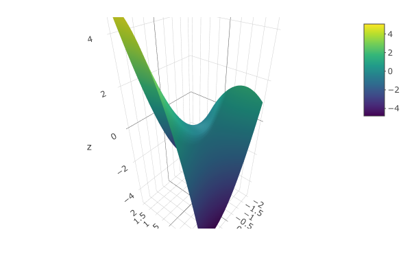

# Local approximations {#sec-local-approximations}

```{r include=FALSE}
source("../starter.R")
```

We have now encountered three concepts in Calculus that will prove a great help in building models.

1. Local functions. In @sec-pattern-book-functions we looked at two functions that describe local behavior: the sigmoid and its derivative, the gaussian. In fact, any function can be used as a local function, so long as the modeler considers only a small part of the domain. 
2. Rates of change. Often, information about a system comes in the form of how the output from the system *changes* with respect to the input.

3. Partial derivatives. We can greatly simplify a complex system by looking at the output *with respect to* only one of the inputs at a time. In science, experiments are often arranged to accomplish this: the output is monitored while one input is changed and the others forced to be constant. 

::: {#thm-simple-experiments style="display: none;"}
The experimental method of varying one factor while holding all other factors constant is an analog of *partial differentiation*.
:::
::: {.callout-note}
## @thm-simple-experiments Simple experiments
Consider the problem of studying how plant growth is influenced by available water. It won't be meaningful to compare tropical rain forests with high-latitude boreal forests. The availability of water is only one of many ways in which they differ. In a plant-growth experiment, one would hold the plant species and light exposure constant, and vary the water between specimens. 
:::

To illustrate how these three concepts simplify modeling, imagine constructing a model of the speed of a bicycle: speed(gear, grade). Consider these three questions that any experienced bicyclist can answer:


1. On a given grade of road, is there an optimal gear for the highest sustained speed? (Have in mind a particular rider, perhaps yourself.)
2. Imagine that the grade of the road is described by a positive number for uphill, a negative number for downhill and zero when the road is level. How does speed change when moving to a higher grade, be that a grade that becomes more positive or a grade that becomes less negative. 
3. Assuming an answer "yes" to question (1): Does the optimal gear choice depend on the grade of the road? (In concrete terms, would you choose different gears for an uphill climb than for a level road or a downhill stretch?) 

Note that the three questions all have to do with derivatives: local rates of change. An "optimal gear" is a gear at which $\partial_\text{gear} \text{speed}(\text{gear}, \text{grade}) = 0$. That you ride slower the higher the numerical value of the slope means that  $\partial_\text{grade} \text{speed}(\text{gear}, \text{grade}) < 0$. And we know that $\partial_\text{gear} \text{speed}(\text{gear}, \text{grade})$ depends on the grade; that is  why there is a different optimal gear at each grade. 


## Eight simple, local shapes

In many modeling situations with a single input, selecting one of ***eight simple shapes***, those shown in @fig-eight-simple-shapes2, can get you far. 

::: {#fig-eight-simple-shapes2}
```{r echo=FALSE}
g <- makeFun(a + b*x + c*x^2 ~ x, a=-1, b=2, c=1)
strip_ticks <- function(P) P + theme(axis.text = element_blank())
P1 <- slice_plot(-g(x, c=0) ~ x, bounds(x=c(-3,1)), size=2  ) %>%
  gf_labs(y="Output", x="Input", title="(A) downward sloping line")
P2 <- slice_plot(g(x, c=0) ~ x, bounds(x=c(-3,1)), size=2  ) %>%
  gf_labs(y="Output", x="Input", title="(B) upward sloping line")
P3 <- slice_plot(g(x) ~ x, bounds(x=c(-3,-1)), size=2) %>%
  gf_labs(y="Output", x="Input", title="(C) downward sloping, concave up; steep then shallow")
P4 <- slice_plot(g(x) ~ x, bounds(x=c(-1,1)), size=2) |> 
  gf_labs(y="Output", x="Input", title="(D) upward sloping, concave up; shallow then steep")
P6 <- slice_plot(-g(x) ~ x, bounds(x=c(-3,-1)), size=2) |> 
  gf_labs(y="Output", x="Input", title="(F) upward sloping, concave down; steep then shallow")
P5 <- slice_plot(-g(x) ~ x, bounds(x=c(-1,1)), size=2) %>%
  gf_labs(y="Output", x="Input", title="(E) downward sloping, concave down; shallow then steep")
P8 <- slice_plot(g(x) ~ x, bounds(x=c(-3,1)), size=2) %>%
  gf_labs(y="Output", x="Input", title="(H) local minimum")
P7 <- slice_plot(-g(x) ~ x, bounds(x=c(-3,1)), size=2) |> 
  gf_labs(y="Output", x="Input", title="(G) local maximum")
gridExtra::grid.arrange(P1 |> strip_ticks(), P2 |> strip_ticks(), 
                        P3 |> strip_ticks(), P4 |> strip_ticks(), ncol=2)
gridExtra::grid.arrange(P5 |> strip_ticks(), P6 |> strip_ticks(), 
                        P7 |> strip_ticks(), P8 |> strip_ticks(), ncol=2)
```

The ***eight simple shapes*** of local functions with one input.
:::


To choose among these shapes, consider your modeling context: 

- is the relationship positive (slopes up) or negative (slopes down)
- is the relationship monotonic or not
- is the relationship concave up, concave down, or neither

Consider these historical examples:

* Newton's Law of Cooling. Let the input be the difference in temperature between an object and its environment. Let the output be the rate at which the object's temperature changes. Newton's Law of Cooling amounts to a choice of shape (B).

* Hooke's Law, describing the force supplied by a compressed or stretched object such as a spring. Let the input be the how much the object is compressed or stretched: negative for compression, positive for stretching. Let the output be the force supplied by the string, with a positive force meaning away from the spring and negative towards the spring. Hooke's Law is shape (A).

* Inverse square law for gravitational force. The input is the distance between the masses, the output is the force, with a negative force corresponding to attraction. The inverse square law corresponds to shape (C).

* Chemistry's Law of Mass Action for an element or molecule reacting with itself. The input is the concentration of the substance, the output is the rate of production of the compound. Shape (D). (For the Law of Mass Action involving two different substances, we need shapes of functions with two inputs. See @sec-low-order-two.)

Some other examples: 

* The incidence of an out-of-control epidemic versus time is concave up, but shallow-then-steep. Shape D. As the epidemic is brought under control, the decline is steep-then-shallow and concave up. Shape C. Notice that in each case we are describing only the *local* behavior of the function.

* How many minutes can you run as a function of speed? Concave down and shallow-then-steep; you wear out faster if you run at high speed. How far can you walk as a function of time? Steep-then-shallow and concave down; your pace slows as you get tired. Shape (E).

* How does the stew taste as a function of saltiness. The taste improves as the amount of salt increases ... up to a point. Too much salt and the stew is unpalatable. Shape (G).

*  How much fuel is consumed by an aircraft as a function of distance? For long flights the function is concave up and shallow-then-steep; fuel use increases with distance, but the amount of fuel you have to carry also increases with distance and heavy aircraft use more fuel per mile. Shape (E).

* In micro-economic theory there are ***production functions*** that describe how much of a good is produced at any given price, and ***demand functions*** that describe how much of the good will be purchased as a function of price.  
    - As a rule, production increases with price and demand decreases with price. In the short term, production functions tend to be concave down, since it is hard to squeeze increased production out of existing facilities. Shape (F). 
    - For demand in the short term, functions will be concave up when there is some group of consumers who have no other choice than to buy the product. An example is the consumption of gasoline versus price: it is hard in the short term to find another way to get to work. Shape (C). In the long term, consumption functions can be concave down as consumers find alternatives to the high-priced good. For example, high prices for gasoline may, in the long term, prompt a switch to more efficient cars, hybrids, or electric vehicles. This will push demand down steeply. Shape (E).

## Low-order polynomials

There is a simple, familiar functional form that, by selecting parameters appropriately, can take on each of the eight simple shapes: the ***second-order polynomial***.
$$g(x) \equiv a + b x + c x^2$$
As you know, the graph of $g(x)$ is a parabola. 

- The parabola opens upward if $0 < c$. That is the shape of a ***local minimum***.
- The parabola opens downward if $c < 0$. That is the shape of a ***local maximum***

Consider what happens if $c = 0$. The function becomes simply $a + bx$, the straight-line function. 

- When $0 < b$ the line slopes upward.
- When $b < 0$ the line slopes downward.

With the appropriate choice of parameters, the form $a + bx + cx^2$ is  capable of representing four of the ***eight simple shapes***. What about the remaining four? This is where the idea of ***local*** becomes important. Those remaining four shapes are the sides of parabolas, as in @fig-four-shapes. 

```{r echo=FALSE, warning=FALSE}
#| label: fig-four-shapes
#| fig-cap: "Four of the ***eight simple shapes*** correspond to the sides of the parabola. The labels refer to the graphs in @fig-eight-simple-shapes2."
f1 <- makeFun(a + b*x + c*x^2 ~ x, a=-2, b=1, c=1)
f2 <- makeFun(a + b*x + c*x^2 ~ x, a=-2, b=1, c=-1)
P1 <- graph_with_boxes(f1, bounds(x=-1.1:0.1), my_letters = c("C", "D"), 
                 intervals = tibble(x = c(-1, -.45), xend=c(-.55, 0)))
P2 <- graph_with_boxes(f2, bounds(x=-.3:1.4), my_letters = c("E", "F"),
                 intervals = tibble(x = c(-.2, .55), xend=c(.45, 1.25)))
gridExtra::grid.arrange(P1, P2, nrow=2)
```


## The low-order polynomial with two inputs {#sec-low-order-two}

For functions with two inputs, the low-order polynomial approximation looks like this:

$$g(x, y) \equiv a_0 + a_x x + a_y y + a_{xy} x y + a_{yy} y^2 + a_{xx} x^2$$
In reading this form, note the system being used to name the polynomial's coefficients. First, we've used $a$ as the root name of all the coefficients. Sometimes we might want to compare two or more low-order polynomials, so it is convenient to be able to use $a$ for one, $b$ for another, and so on. 

The subscripts on the coefficients describes exactly which term in the polynomial involves each coefficient. For instance, the $a_{yy}$ coefficient applies to the $y^2$ term, while $a_x$ applies to the $x$ term.  

Each of $a_0, a_x,$ $a_y,$ $a_{xy}, a_{yy}$, and $a_{xx}$ will, in the final model, be a constant quantity. Don't be confused by the use of $x$ or $y$ in the name of the coefficients. Each coefficient is a constant and not a function of the inputs. Often, your prior knowledge of the system being modeled will tell you something about one or more of the coefficients, for example, whether it is positive or negative. Finding a precise value is often based on quantitative data about the system.  

It helps to have different names for the various terms. It is not too bad to say something like, "the $a_{xy}$ term." (Pronounciation: "a sub x y" or  "a x y") But the proper names are: ***linear terms***, ***quadratic terms***, and ***interaction term***. And a shout out to $a_0$, the ***constant term***. 

$$g(x, y) \equiv a_0 + \underbrace{a_x x + a_y y}_\text{linear terms} \ \ \ + 
\underbrace{a_{xy} x y}_\text{interaction term} +\ \ \  \underbrace{a_{yy} y^2 + a_{xx} x^2}_\text{quadratic terms}$$

```{r echo=FALSE, warning=FALSE}
make_gxy <- function(seed=1) {
  set.seed(seed)
  f <- makeFun(a0 + ax*x + ay*y + axy*x*y + axx*x^2 + ayy*y^2 ~ x + y,
               a0 = runif(1, -1, 1), 
               ax = runif(1, -1, 1), ay = runif(1, -1, 1), 
               axy = runif(1, -1, 1), 
               ayy = runif(1, -1, 1), axx = runif(1, -1, 1)
  )
}
show_poly2 <- function(seed=1, domain=bounds(x=-2:2, y=-2:2)) {
  f <- make_gxy(seed)
  list(P1 = contour_plot(f(x, y) ~ x + y, domain=domain),
  P2 = interactive_plot(f(x, y) ~ x + y, domain=domain))
}


Four <- show_poly2(104)

Four$P1
```

```{r echo=FALSE}
#| label: fig-saddle2
#| fig-cap: "A saddle" 
if (knitr::is_html_output()) {
  Four$P2
} else {
  
}
```


## Thinking partially {#sec-partial-thought}

The expression for a general low-order polynomial in two inputs can be daunting to think about all at once:
$$g(x, y) \equiv a_0 + a_x x + a_y y + a_{xy} x y + a_{xx} x^2 + a_{yy} y^2$$
As with many complicated settings, a good approach can be to split things up into simpler pieces. With a low-order polynomial, one such splitting up involves partial derivatives. There are six potentially non-zero partial derivatives for a low-order polynomial, of which two are the same; so only five quantities to consider.

1. $\partial_x g(x,y) = a_x + a_{xy}y + 2 a_{xx} x$ 
2. $\partial_y g(x,y) = a_y + a_{xy}x + 2 a_{yy} y$
3. $\partial_{xy} g(x,y) = \partial_{yx} g(x,y) = a_{xy}$. These are the so-called ***mixed partial derivatives***. It does not matter whether you differentiate by $x$ first or by $y$ first. The result will always be the same for any smooth function.
4. $\partial_{xx} g(x,y) = 2 a_{xx}$
5. $\partial_{yy} g(x,y) = 2 a_{yy}$

The above list states neutral mathematical facts that apply generally to any low-order polynomial whatsoever.^[Note that any other derivative you construct, for instance $\partial_{xxy} g(x,y)$ must always be zero.] Those facts, however, shape a way of asking questions of yourself that can help you shape the model of a given phenomenon based on what you already know about how things work.

To illustrate, consider the situation of modeling the effect of study $S$ and of tutoring $T$ (a.k.a. office hours, extended instruction) on performance $P(S,T)$ on an exam. In the spirit of partial derivatives, we will assume that all other factors (student aptitude, workload, etc.) are held constant.

To start, pick fiducial values for $S$ and $T$ to define the local domain for the model. Since $S=0$ and $T=0$ are easy to envision, we will use those for the fiducial values. 

Next, ask five questions, in this order, about the system being modeled.

1. Does performance increase with study time? Don't over-think this. Remember that the approximation is around a fiducial point. Here, a reasonable answer is, "yes." we will take$\partial_S P(S, T) > 0$ to imply that $a_S > 0$. This is appropriate because close to the fiducial point, the other contributors to  $\partial_S P(S, T)$, namely $a_{ST}T + 2 a_{SS} S$ will be vanishingly small.
2. Does performance increase with time spent being tutored? Again, don't over-think this. Don't worry (yet) that your social life is collapsing because of the time spent studying and being tutored, and the consequent emotional depression will cause you to fail the exam. We are building a model here and the heuristic being used is to consider factors in isolation. Since (as we expect you will agree) $\partial_T P(S, T) > 0$, we have that $a_T > 0$.

Now the questions get a little bit harder and will exercise your calculus-intuition since you will have to think about *changes* in the rates of change.

3. This question has to do with the mixed partial derivative, which we've written variously as $\partial_{ST} P(S,T)$ or $\partial_{TS} P(S,T)$ and which it might be better to think about as $\partial_S \left[\partial_T P(S,T) \right]$ or $\partial_T \left[\partial S P(S,T)\right]$. Although these are mathematically equal, often your intuition will favor one form or the other. Recall that we are working on the premise that $\partial_S P(S,T) > 0$, or, in other words, study will help you do better on the exam. Now for $\partial_T \left[\partial S P(S,T)\right]$. This is a the matter of whether some tutoring will make your study more effective. Let's say yes here, since tutoring can help you overcome a misconception that is  a roadblock to effective study. So $\partial_{TS} P(S,T) > 0$ which implies $a_{ST} > 0$.

The other way round, $\partial_S \left[\partial_T P(S,T) \right]$ is a matter of whether increasing study will enhance the positive effect of tutoring. We will say yes here again, because a better knowledge of the material from studying will help you follow what the tutor is saying and doing. From pure mathematics, we already know that the two forms of mixed partials are equivalent, but to the human mind they sometimes (and incorrectly) appear to be different in some subtle, ineffable way.

In some modeling contexts, there might be no clear answer to the question of $\partial_{xy}\, g(x,y)$. That is also a useful result, since it tells us that the $a_{xy}$ term may not be important to understanding that system.

4. On to the question of $\partial_{SS} P(S,T)$, that is, whether  $a_{SS}$ is positive, negative, or negligible. We know that $a_{SS} S^2$ will be small whenever $S$ is small, so this is our opportunity to think about bigger $S$. So does the impact of a unit of additional study increase or decrease the more you study? One point of view is that there is some moment when "it all comes together" and you understand the topic well. But after that epiphany, more study might not accomplish as much as before the epiphany. Another bit of experience is that "cramming" is not an effective study strategy. And then there is your social life ... So let's say, provisionally, that there is an argmax to study, beyond which point you're not helping yourself. This means that $a_{SS} < 0$.

5. Finally, consider $\partial_{TT} P(S, T)$. Reasonable people might disagree here, which is itself a reason to suspect that $a_{TT}$ is negligible. 

Answering these questions does not provide a numerical value for the coefficients on the low-order polynomial, and says nothing at all about $a_0$, since all the questions are about change. 

Another step forward in extracting what you know about the system you are modeling is to construct the polynomial informed by questions 1 through 5. Since you don't know the numerical values for the coefficients, this might seem impossible. But there is a another modeler's trick that might help. 

Let's imagine that the domain of both $S$ and $T$ or the interval zero to one. This is not to say that we think one hour of study is the most possible but simply to defer the question of what are appropriate units for $S$ and $T$. Very much in this spirit, for the coefficients we will use $+0.5$ when are previous answers indicated that the coefficient should be greater than zero, $-0.5$ when the answers pointed to a negative coefficient, and zero if we don't know. Using this technique, here is the model, which mainly serves as a basis for checking whether our previous answers are in line with our broader intuition before we move on quantitatively.

::: {#fig-zero-one}
```{r}
P <- makeFun(0.5*S + 0.5*T + 0.5*S*T - 0.5*S^2 ~ S & T)
contour_plot(P(S, T) ~ S & T, bounds(S=0:1, T=0:1))
```

The result of our intuitive investigation of the effects of study and tutoring on exam performance. The units are not yet assigned.
:::

Notice that for small values of $T$, the horizontal spacing between adjacent contours is large. That is, it takes a lot of study to improve performance a little. At large values of $T$ the horizontal spacing between contours is smaller.


## Finding coefficients from data

Low-order polynomials are often used for constructing functions from data. In this section, I'll demonstrate briefly how this can be done. The full theory will be introduced in Block 5 of this text. 

The data I'll use for the demonstration is a set of physical measurements of height, weight, abdominal circumference, etc. on 252 human subjects. These are contained in the `Body_fat` data frame, shown below. 
```{r echo=FALSE}
if (knitr::is_html_output()) {
  Body_fat |> DT::datatable()
} else {
  knitr::kable(Body_fat |> head(10))
}
```

One of the variables records the body-fat percentage, that is, the fraction of the body's mass that is fat. This is thought to be an indicator of fitness and health, but it is extremely hard to measure and involves weighing the person when they are fully submerged in water. This difficulty motivates the development of a method to approximation body-fat percentage from other, easier to make measurements such as height, weight, and so on.

For the purpose of this demonstration, we will build a local polynomial model of body-fat percentage as a function of height (in inches) and weight (in pounds). 

The polynomial we choose will omit the quadratic terms. It will contain the constant, linear, and interaction terms only. That is
$$\text{body.fat}(h, w) \equiv c_0 + c_h h + c_w w + c_{hw} h w$$
The process of finding the best coefficients in the polynomial is called ***linear regression***. Without going into the details, we will use linear regression to build the body-fat model and then display the model function as a contour plot.

::: {#fig-bodyfat-mod}
```{r}
mod <- lm(bodyfat ~ height + weight + height*weight,
          data = Body_fat)
body_fat_fun <- makeFun(mod)
contour_plot(body_fat_fun(height, weight) ~ height + weight,
             bounds(weight=c(100, 250), height = c(60, 80))) %>%
  gf_labs(title = "Body fat percentage")
```

A low order polynomial model of body fat percentage as a function of height (inches) and weight (lbs).
:::
Block 3 looks at linear regression in more detail.


