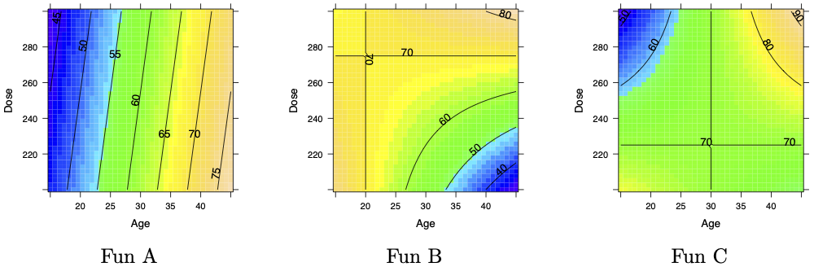

The graph depicts the effect of a drug on heart rate. Each of the lines shows heart rate as a function of dose for a given age. The drug's effect depends both on the dose of the drug and on the age of the person taking the drug.

```{r echo=FALSE, fig-align: "center", out-width: "50%"}
knitr::include_graphics("www/drug-age-dose.png")
```

Using the information shown in the graph, estimate numerically each of the following partial derivatives, giving proper units for each. (Heart rate is measured in “bpm” (beats per minute) and dose in “mg”.)

a. The derivative $\partial_\text{dose} HR$
    i. at dose$=275$, age$=20$
    ii. at dose$=275$, age$=30$
    iii. at dose$=275$, age$=40$
b. $\partial_\text{age} HR$ at dose$=275$, age$=30$.
c. $\partial_\text{dose} \partial_\text{dose} HR$ at dose$=275$, age$=30$.
d. $\partial_\text{age} \partial_\text{age} HR$ at dose$=275$, age$=30$.
e. $\partial_\text{age} \partial_\text{dose} HR$ at dose$=275$, age$=30$.

The graphic above is three slices through the function HR(dose, age). One slice is for age 20, one slice for age 30, and the last for age 40. This is a standard graphical format in the technical literature, sometimes called an ***interaction plot*** since it clearly shows the interaction between age and dose. 

Of course, we can plot the same function HR(dose, age) as a contour plot.

```{r echo=FALSE}

```

a. Which contour plot matches the interaction graph?
b. On the correct contour plot, draw the paths that correspond to the graph of HR versus dose for each of ages 20, 30, and 40 years.
