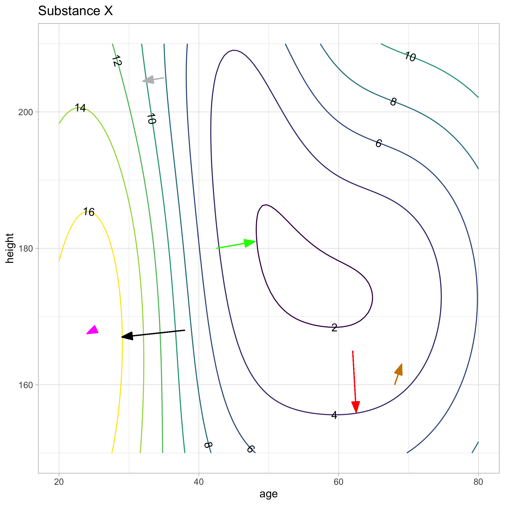

```{r include = FALSE}
library(Zcalc)
```

The contour plot of function $g(y, z)$ is overlaid with vectors. The black vector is a correct representation of the gradient (at the root of the vector). The other vectors are also supposed to represent the gradient, but might have something wrong with them (or might not). You're job is to say what's wrong with each of those vectors.
 
```{r echo=FALSE, eval=FALSE}
# Must be run by hand
f <- rfun( ~ age + height, seed=6293)
F <- makeFun(f((age -40)/10, (height - 180)/12) + 12 ~ age + height)
mF <- makeFun(-F(age, height) ~ age + height)
g <- rfun( ~ age + height, seed = 298)
G <- makeFun(g((age -40)/10, (height - 180)/12)  ~ age + height)
dom <- domain(age = c(20,80), height = c(150,210))

the_arrow <- arrow(type="closed", angle=20, length=unit(0.15, "inches"))

contour_plot(F(age, height) ~ age + height, dom, skip=0, filled=FALSE) %>%
  gf_theme(theme_light()) %>%
  gf_segment(165+156 ~ 62+62.5, color="red", arrow = the_arrow) %>%
  gf_segment( 168 +167 ~ 38 + 29, color="black", arrow=the_arrow) %>%
 gf_segment(180 + 181 ~ 42.5 + 48, color="green", arrow=the_arrow) %>%
  gf_segment(168 + 167.5 ~  25 + 24, color="magenta", arrow=the_arrow) %>%
  gf_segment(160+163~68+69, color="orange3", arrow=the_arrow) %>%
  gf_segment(205+204.5 ~ 35 + 32, color="gray", arrow=the_arrow) %>%
  gf_labs(title="Substance X") %>%
  ggsave("www/substance.png", plot=.)


```


```{r echo=FALSE, out.width= "60%", fig.align="center"}

```


```{r daily-digital-27-QA10, echo=FALSE}
askMC(
  prompt = "What's wrong with the <span style='color:red;'>**red**</span> vector?",
    "nothing" = "",
    "+too long+" = "The red vector is located in a place where the function is almost level. You can tell this because the contour lines are spaced far apart. The magnitude of the gradient will be small in such an area. But here, the red vector is even longer than the black vector, even though black is in a very steep area (with closely spaced contours).",
    "too short" = "",
    "points downhill" = "",
    "points uphill" = "Pointing uphill is what gradient vectors do! No problem with this.",
    "wrong direction entirely" = "",
  random_answer_order = FALSE
)
```

```{r daily-digital-27-QA11, echo=FALSE}
askMC(
  prompt = "What's wrong with the <span style='color:green;'>**green**</span> vector?",
      "nothing" = "",
    "too long" = "Note that the vector reflects the steepness at the point where the root of the vector is drawn. The root of the green vector is in an area  where the contour lines are spaced similarly to the area near the root of the black vector. So it's correct that the length of the green vector is similar to the length of the black vector.",
    "too short" = "",
    "+points downhill+" = "The root of the green vector is near contour=4, the head at contour=2. So the vector is incorrectly pointing downhill. Gradients point in the steepest direction uphill.",
    "points uphill" = "Pointing uphill is what gradient vectors do! No problem with this.",
    "wrong direction entirely" = "",
  random_answer_order = FALSE
)
```


```{r daily-digital-27-QA12, echo=FALSE}
askMC(
  prompt = "What's wrong with the <span style='color:magenta;'>**blue**</span> vector?",
    "+nothing+" = "",
    "too long" = "",
    "too short" = "The blue vector is in a very flat area of the function. That's why it's so short.",
    "points downhill" = "",
    "points uphill" = "Pointing uphill is what gradient vectors do! No problem with this.",
    "wrong direction entirely" = "",
  random_answer_order = FALSE
)
```

```{r daily-digital-27-QA13, echo=FALSE}
askMC(
  prompt = "What's wrong with the <span style='color:orange;'>**orange**</span> vector?",
    "nothing" = "",
    "too long" = "",
    "too short" = "",
    "points downhill" = "",
    "points uphill" = "",
    "+wrong direction entirely+" = "Gradient vectors should be perpendicular to nearby contours and should point uphill. The orange vector is neither",
  random_answer_order = FALSE
)
```

```{r daily-digital-27-QA14, echo=FALSE}
askMC(
  prompt = "What's wrong with the <span style='color:gray;'>**gray**</span> vector?",
    "nothing" = "",
    "too long" = "",
    "+too short+" = "The function is practically as steep at the root of the gray vector as it is at the root of the black vector. (You can tell this from the spacing of the contour lines.) So the magnitude of the gray vector should be just about the same as the magnitude of the black vector.",
    "points downhill" = "",
    "points uphill" = "",
  random_answer_order = FALSE
)
```

