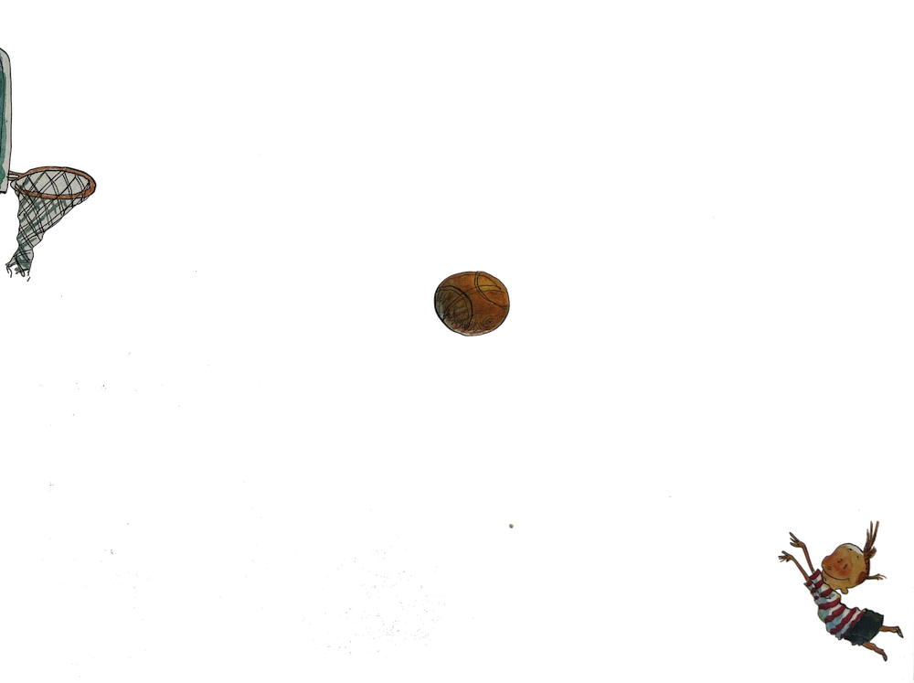

```{r echo=FALSE, fig.align="center"}
#| label: fig-basketball-shot
#| fig-cap: "A drawing from a children's song book, *I'm still here in the bathtub*, illustrated by David Catrow. (Scholastic, Inc. 2004)"
#| fig-location: margin

```

The picture shows an instantaneous position of the ball. However, such a snapshot does not show the instantaneous *velocity* of the ball. If you had a few frames of a movie, your intuition would tell you if the ball is likely to go through the hoop. From a movie, you could even calculate a good finite-difference approximation to the instantaneous velocity of the ball. [In Block VI, you'll see how to use the instantaneous position and velocity to trace out the trajectory of the ball up to the moment it comes into contact with the basket, hoop, or backboard.]{.aside}

Assume for the purposes of the following question that the boy, the center of the ball, and the center of the hoop are all in the same plane, as required for a swish shot. Assume as well that when the ball left the boy's hands it was in the position now occupied by the boy's head and that there was no spin on the ball. Now the question:

> Will the ball swish through the basket?

Use calculus concepts to make a good argument about whether the answer should be "impossible" or "possible."

1. Think of the path of the ball as a function $f(x)$, where $x$ is position along the floor and $f(x)$ gives the corresponding height of the ball. Draw some intuitively plausible paths. That is, draw graphs of possible functions consistent with the picture and with the assumption that the launch point is marked by the current position of the boy's head.

2. From the picture you can easily find the line connecting the ball's current position with the launch point. The slope of this line is the average rate of change of ball height with respect to $x$. 

3. The physics of ball flight (with no spin) requires the function $f(x)$ to be concave down. How does this restrict the set of possible paths?

