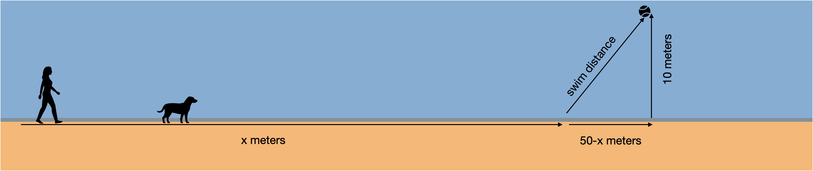

```{r include = FALSE}
library(mosaic)
library(mosaicCalc)
```


You and your pet dog Swimmer often go to the beach and walk along the water's edge. You throw a ball down the beach, but at an angle so it lands in the water. Swimmer goes to work. She runs down the beach (fast) and then plunges into the water, heading toward the ball. She can run fast on the beach: 400 m/minute. But she swims rather slower: 50 m/min. 

Suppose you threw the ball to a point about 50 meters down the beach and 10 meters out in the water. The overall distance to the ball is therefore $\sqrt{50^2 + 10^2} \approx 51$ meters. If Swimmer entered the water immediately, she would take about a minute to reach the ball (51 m / 50 m/min). Swimmer can get to the ball faster by running down the beach a bit and then turning into the water. If Swimmer ran all 50 meters down the beach and then turned to swim the 10 meters, it would take her (50/400 + 10/50) minutes, about one-third of a minute.

```{r echo=FALSE}
#| label: fig-calculus-dog
#| out-width: "100%"
#| fig-align: "center"
#| fig-cap: "Swimmer's optimal path to the ball consists of running $x$ meters along the shore, then swimming diagonally to the ball."

```

Can Swimmer do better? You can set up the calculation like this. Imagine $x$ to be the distance down the beach that Swimmer runs. The time to run this distance will be $x/400$. The distance remaining to the ball can be found by the Pythagorean theorem. One leg of the triangle has length $(50-x)$, the other has length 10 m. So, the length of the third side is $\sqrt{\strut (50-x)^2 + 10^2}$. For instance, if $x$ were 45, the distance to swim in the water would be $\sqrt{(50-45)^2 + 10^2} = 11.2$ m. Divide this distance by 50 m/min to get the time spent in the water.

```{r eval=FALSE}
distance_in_water <- makeFun( __your_pythagorean_formula ~ x)
time_to_ball <- makeFun(x/400 + distance_in_water(x)/50 ~ x)
```

`Time_to_ball()` takes one argument, the distance $x$ Swimmer runs down the beach before turning into the water. Use a `r sandbox_link()` to find the distance that calculus-savvy Swimmer runs down the beach before turning into the water, if Swimmer's goal is to get to the ball as fast as possible.

```{r daily-digital-36-QA1, echo=FALSE}
askMC(
  prompt = "What's the optimal running distance for Swimmer?",
  46.75, 47.50,  "+48.75+",  "49.75",
  random_answer_order = FALSE
)
```

[Here's a news story](https://abcnews.go.com/Technology/story?id=97628&page=1) about a mathematician's dog on the shore of Lake Michigan. It's not plausible that Swimmer has been trained in calculus. Perhaps the way Swimmer solves the running distance problem is simply to graph `time_to_ball(x) ~ x` over a suitable domain and find the argmax by eye!
