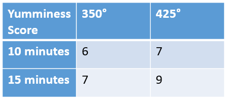

`r insert_calcZ_exercise("XX.XX", "iUQmZ1", "/Users/kaplan/MC2/Differentiation/Exercises/rhinosaurus-send-car.Rmd")`


Your roommate has challenged you to a chocolate chip cookie bakeoff.  Your grandmother has sent you the ingredients for her county-fair award winning recipe, but the baking instructions are missing.  You decide to construct a model to help you find the optimal combination of how hot to set the oven $(H)$ and baking time $(T)$.  You initially come up with the following model for the yumminess $(Y)$ of the cookies as a function of $T$ and $H$:

$$Y(T,H)\equiv Y_0+C_TT+C_HH+C_{TH}TH+C_{TT}T^2+C_{HH}H^2$$

```{r rscd-1, echo=FALSE, results="markup"}
  askMC(
    prompt="Which of the following is a linear term?",
    r"( $Y_0$)",
    r"(+$C_TT$+)",
    r"( $C_{TH}TH$)",
    r"( $C_{HH}H^2$)",
    random_answer_order=FALSE
)
```

```{r rscd-2, echo=FALSE, results="markup"}
  askMC(
    prompt="Which coefficient represents the inherent yumminess of cookie dough.  That is, dough that has no heat applied to it over no time.",
    r"(+$Y_0$+)",
    r"( $C_T$)",
    r"( $C_H$)",
    r"( $C_{TH}$)",
    r"( $C_{TT}$)",
    r"( $C_{HH}$)",
    random_answer_order=FALSE
)
```
  
While making practice batches, you obtain the data in the chart below.  You note that increasing the baking time from 10 to 15 minutes accounts for an increase of yumminess score by 1.  Similarly, increasing the oven heat from 350° to 425° accounts for an increase of yumminess score by 1.  Based on this, when you increase both together, you expect a score increase of 2, but instead observe a score increase of 3.  



```{r rscd-3, echo=FALSE, results="markup"}
  askMC(
    prompt="Therefore, what term do you know SHOULD be included in your equation to model this interaction?",
    r"( $Y_0$)",
    r"( $C_TT$)",
    r"( $C_HH$)",
    r"(+$C_{TH}TH$+)",
    r"( $C_{TT}T^2$)",
    r"( $C_{HH}H^2$)",
    random_answer_order=FALSE
)
```

```{r rscd-4, echo=FALSE, results="markup"}
  askMC(
    prompt="Given that well baked cookies are more yummy than either raw dough or burnt cookies, what do you infer about the value of $C_{TT}$?",
    r"[$C_{TT}>0$ (that is $C_{TT}$ is positive)]",
    r"[+$C_{TT}<0$ (that is $C_{TT}$ is negative)+]",
    r"[$C_{TT}=0$ (that is the $T^2$ term does not affect your model)]",
    random_answer_order=FALSE
)
```


Credit: Math 141Z/142Z 2021-2022 development team

