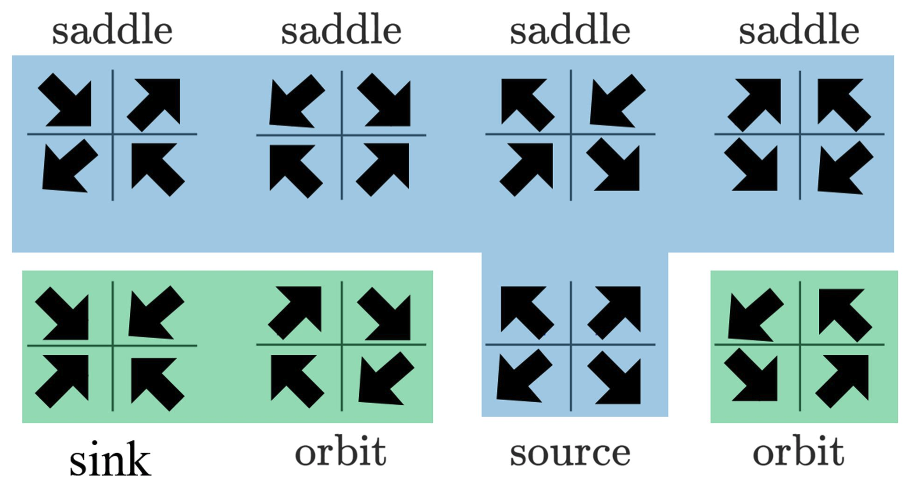

# Flows on the plane {#sec-flow-on-plane}

```{r child="../starter.Rmd"}
```


Let's return the rabbit/fox system as an example of flow. Since there are two state quantities, $r$ and $f$, the state space $(r, f)$ is a plane. At each point in the state space, the flow vector gives the direction and speed of motion. Like all vectors, a flow vector has only two properties: the direction and length. The speed of motion is the length of the flow vector.

The flow itself is a ***vector field***. This is an assignment of a vector to each point of the state space. Graphically, we depict a flow field by selecting a grid of points in the state space, finding the flow vector for each grid point, and drawing those vectors positioned at their respective grid points.

```{r echo=FALSE}
#| label: fig-rf-flow-2
#| fig-cap: "The flow field has a vector at each point in state space but legibility requires that we draw arrows at only a handful of points. Zooming in on a region produces more detail."
#| fig-cap-location: margin
# commands to make the individual plots in the figure
# vectorfield_plot(r ~ 0.66*r - 1.33*r*f,
#                  f ~ -f + r*f,
#                  bounds(r=0:2, f=0:1)) %>%
#   gf_rect(.4 + .7 ~ .8 + 1.3, color="magenta", fill=NA) %>%
#   gf_refine(coord_fixed())
# vectorfield_plot(r ~ 0.66*r - 1.33*r*f,
#                  f ~ -f + r*f,
#                  bounds(r=.8:1.3, f=.4:.7)) %>%
#   gf_rect(.4 + .7 ~ .8 + 1.3, color="magenta", size=2, fill=NA) %>%
#   gf_rect(.47 + .53 ~ .95 + 1.02, color="green", fill=NA) %>%
#   gf_refine(coord_fixed())
# vectorfield_plot(r ~ 0.66*r - 1.33*r*f,
#                  f ~ -f + r*f,
#                  bounds(r=.95:1.02, f=.47:.53)) %>%
#   gf_rect(.47 + .53 ~ .95 + 1.02, color="green", size=2, fill=NA) %>%
#   gf_refine(coord_fixed())
knitr::include_graphics("www/rf-zoom.png")
```

Recall from Block 5 that it is conventional to specify a vector by giving a coordinate pair for the tip of the vector with the understanding that the tail is at the origin. For the rabbit/fox system, the tip's coordinate is $\left({\Large\strut} g_r(r, f),\  g_f(r, f)\right)$. This notation is potentially confusing, because the letters $r$ and $f$ appear in so many places. Each each vector in @fig-rf-flow2 is drawn at a particular point, say $(r=0.96, f=0.48)$. At that point, evaluate the dynamical functions: $g_r(r=0.96, f=0.48) = 0.0207$ and $g_r(r=0.96, f=0.48)= 0.941$. 

<!--

The state space has coordinates $r$ and $f$, and since $r$ and $f$ are quantities with dimension (rabbit density and fox density, respectively). The components of the flow vector have different dimension: rabbit density per time and fox density per time. Still, the direction of the flow vector can be accurately present in state space; it is after all how the state will change. The drawn length of the vector, however, is on a different scale.

-->

A ***fixed point*** of the dynamics is a point in the state space where the dynamical functions both evaluate to zero. It is convenient to mark fixed points as the intersection of zero contours of the dynamical functions. @fig-rf-nullclines shows these zero contours (red for rabbits, blue for foxes) laid on top of the flow field. Such zero contours of dynamical functions are called ***nullclines***. (The word means "zero slope". "Null" corresponds to zero and "cline" is the root of words like "incline" or "decline.")

```{r echo=FALSE, warning=FALSE, message=FALSE}
#| label: fig-rf-nullclines
#| fig-cap: "Flow field and nullclines for the rabbit/fox dynamics."
#| fig-cap-location: margin
dt_rabbit <- function(r, f, alpha=2/3, beta=4/3) {
  alpha*r - beta*r*f
}
dt_fox <- function(r, f, delta=1, gamma=1) {
  -delta*f + gamma*r*f
}
contour_plot(dt_rabbit(r,f) ~ r & f, bounds(r=0.2:2, f=0.05:1), 
             contours_at = 0, contour_color = "red",
             labels=FALSE) %>%
  contour_plot(dt_fox(r,f) ~ r & f, bounds(r=0.2:2, f=0.05:1),
             contours_at = 0, contour_color = "blue",
             labels=FALSE) %>%
  vectorfield_plot(r ~ dt_rabbit(r,f),
                   f ~ dt_fox(r,f), bounds(r=0.2:2, f=0.05:1),
                   transform=function(x) x^0.3)

```

Due to the nature of fixed points, if the initial condition is at the intersection of the nullclines the state will not change. But is the fixed point stable or unstable.

As you will see, in two and higher dimensional dynamical systems, there is more than one kind of stability and more than one kind of instability. These different kinds of stability and instability have a direct correspondence to different kinds of behavior in real-world systems.

Very near the fixed point, dynamics are approximately linear. We will return to a quantitative analysis of this in Chapter @sec-equilibria. Our objective here is to show that there are several generic types of behavior and that the stability of dynamics near the fixed point has to be one of a handful of different types.

## Generic behaviors {#sec-qualitative-stability}

On a nullcline of a dynamical variable $x$, the $x$-component of the flow must be zero. The flow will point to positive $x$ on one side of the nullcline and negative $x$ on the other. This is really nothing more than saying that on one side of a zero contour the function value is positive and on the other side negative. We will indicate this on the following diagrams by shading the positive side of the nullcline with the same color as the nullcline itself. @fig-shaded-nullcline shows the nullclines of a linear system on separate plots. Notice that flow in the shaded side of the $x$ (red) nullcline the flow always has a positive component to the right. Similarly, in the shaded side of the $y$ (blue) nullcline, the flow always has a positive component to the right. 

```{r echo=FALSE}
#| label: fig-shaded-nullcline
#| fig-cap: "The nullclines of a linear dynamical system near the fixed point. $x$ nullcline is red, $y$ nullcline is blue"
pA <- Znotes::show_abcd(.5, 1, 1, -.7, which="y", pow=.2)
pB <- Znotes::show_abcd(.5, 1, 1, -.7, which="x", pow=.2)
gridExtra::grid.arrange(pA, pB, ncol=2)
```

Placing both nullclines on the same plot divides the region near the fixed point into four parts. This is generic behavior. Unless the two nullclines are the same as each other, the two nullclines split the region into four quadrants.

```{r echo=FALSE, warning=FALSE, message=FALSE}
#| label: fig-four-parts
#| fig-cap: "Four quadrants of linear dynamics near the fixed point."
#| fig-cap-location: margin
Znotes::show_abcd(.5, 2, 3, -.7, pow=.2)
```
We can identify the quadrants by their color---white, red, blue, purple. In each quadrant, the "compass direction" of all flow vectors point to one quadrant of the compass: white to the south-west, red to the south-east, blue to the north-west, and purple to the north-east. 

This particular linear flow is unstable. Notice that any initial condition in the purple quadrant will lead to a NE trajectory, away from the fixed point. Similarly, any initial condition in the white quadrant leads to a SW trajectory, again away from the fixed point. For an initial condition in the red or blue quadrants, the flow will take the trajectory into either the white or purple quandrants. The initial part of the trajectory may be towards the fixed point, but as soon as the trajectory crosses into white or purple territory, the trajectory leads away from the fixed point. So, the overall flow is unstable. This particular type of instability, where the initial path might be toward the fixed point but eventually leads away from it, is called a ***saddle***. The flow is analogous to the movement of a marble placed on a horse saddle; it might start to roll toward the center of the saddle, but eventually it will roll off to the side. 

All linear flows will lead to this quadrant structure. Another feature of the structure is that the white quadrant must always be opposite to the purple, and the red opposite to the blue. This allows us to enumerate the different possible types of stability.

A very compact summary of the dynamics shows just the four compass directions and the relative positions of the quadrants.  For instance, 
$$\begin{array}{c|c}
\color{red}{\searrow} & \color{purple}{\nearrow}\\\hline
\color{gray}{\swarrow} & \color{blue}{\nwarrow}
\end{array}\ ,$$
corresponds to the saddle flow seen in the previous flow field.

There are, altogether, eight possible configurations:

```{r echo=FALSE}

```

[[See latex version below]]

<!--
$$\begin{array}{cccc}
\text{saddle} & \text{saddle} & \text{saddle} & \text{saddle} \\
\begin{array}{c|c}
\color{red}{\searrow} & \color{purple}{\nearrow}\\\hline
\color{gray}{\swarrow} & \color{blue}{\nwarrow}
\end{array} &


\begin{array}{c|c}
\color{gray}{\swarrow} & \color{red}{\searrow} \\\hline
\color{blue}{\nwarrow} & \color{purple}{\nearrow} 
\end{array} &

\begin{array}{c|c}
\color{blue}{\nwarrow} & \color{gray}{\swarrow}  \\\hline
\color{purple}{\nearrow} & \color{red}{\searrow} 
\end{array} &

\begin{array}{c|c}
 \color{purple}{\nearrow}&   \color{blue}{\nwarrow}\\\hline
\color{red}{\searrow} &  \color{gray}{\swarrow}
\end{array}
\\
\ \\

\begin{array}{c|c}
\color{red}{\searrow} &  \color{gray}{\swarrow}\\\hline
\color{purple}{\nearrow} & \color{blue}{\nwarrow} 
\end{array} &

\begin{array}{c|c}
\color{purple}{\nearrow}& \color{red}{\searrow} \\\hline
   \color{blue}{\nwarrow}&  \color{gray}{\swarrow}
\end{array} &

\begin{array}{c|c}
   \color{blue}{\nwarrow}& \color{purple}{\nearrow} \\\hline
 \color{gray}{\swarrow}& \color{red}{\searrow}
\end{array}& 
\begin{array}{c|c}
   \color{gray}{\swarrow}& \color{blue}{\nwarrow} \\\hline
 \color{red}{\searrow}& \color{purple}{\nearrow}
\end{array}\\
\text{sink} & \text{orbit} & \text{source} & \text{orbit}
\end{array}
$$
-->

***Saddles*** are unstable, although the trajectory might approach the fixed point at first. A ***source*** is unstable; any trajectory heads away from the fixed point. A ***sink*** is stable; any trajectory heads toward the fixed point.

As for the orbits, one in a clockwise direction and the other counter-clockwise, we cannot yet say from this simple theory whether they are stable or unstable. The orbit we have already met, the rabbit-fox dynamics, has counter-clockwise trajectories that form closed loops. This is called ***neutral stability***. 

```{r echo=FALSE,  message=FALSE, warning=FALSE} 
#| label: fig-rf-orbit
#| fig-cap: "The rabbit/fox system has orbits that are neutrally stable."
#| fig-cap-location: margin
traj1 <- integrateODE(dr ~ dt_rabbit(r, f), 
                      df ~ dt_fox(r,f), r=1.5, f=.25,
                      bounds(t=0:7.5)
                      )
traj2 <- integrateODE(dr ~ dt_rabbit(r, f), 
                      df ~ dt_fox(r,f), r=1, f=.33,
                      bounds(t=0:7.5))
traj_plot(f(t) ~ r(t), traj1, inherit=FALSE) %>%
  traj_plot(f(t) ~ r(t), traj2, inherit=FALSE) %>%
inequality_constraint(dt_rabbit(r, f) < 0 ~ r&f, 
                            fill="red", alpha=0.3, 
                            bounds(r=.1:2, f=0.1:1)) %>%
  inequality_constraint(dt_fox(r, f) < 0 ~ r&f, 
                            fill="blue", alpha=0.3, 
                            bounds(r=.1:2, f=0.1:1)) %>%
  vectorfield_plot(r ~ dt_rabbit(r,f),
                   f ~ dt_fox(r,f),
                   bounds(r=.1:2, f=0.1:1),
                   transform=function(x) x^0.3) %>%
  gf_lims(x = c(.35,2), y=c(0,1.1))
```


## Linearization

For dynamical systems with two state variables, constructing a linear approximation to dynamics near a fixed point follows a similar procedure to that with one-state-variable systems.

1. Locate the fixed point.
2. Construct the first-order polynomial approximation to each of the dynamical functions at the fixed point. 

For instance, the pendulum system has state variables $\theta$ and $v$ with dynamics
$$\partial_t \theta  =  g_\theta(\theta, v) =  v\\
\partial_t v  =  g_{v}(\theta, v) = - \sin(\theta)
$$
There is a fixed point at $\theta = 0$, $v=0$: this is just the situation of a pendulum hanging down that has no motion.

The dynamical function $g_\theta(\theta, v) = v$ is already in first-order polynomial form.

The other dynamical function, $g_v(\theta, v) = - \sin(\theta)$ is nonlinear. The first order polynomial approximation centered on the fixed point will be $$g_v(\theta, v) \approx \underbrace{\color{magenta}{g_{v}(0, 0)}}_0 + \underbrace{\color{magenta}{\partial_\theta g_v(0, 0)}}_{-\cos(0)}\ \theta + \underbrace{\color{magenta}{\partial_v g_v(0, 0)}}_0\, v$$
The term $g_v(0, 0) = 0$ because we are evaluating $g_v()$ at a fixed point. The term $\partial_v g_v(0, 0) = 0$ because $g_v()$ does not depend on $v$. 

We will use $u$ and $w$ as the dynamical variables in the linear approximation to avoid confusion with the original, nonlinear equations. The linearized dynamics are therefore:
$$\partial_t u = \ \ w\\
\partial_t w = - u$$

```{r echo=FALSE, warning=FALSE, message=FALSE}
#| label: fig-linearized-pendulum
#| fig-cap: "Flow field, nullclines, and trajectories of the pendulum (black) and the linearized pendulum ($\\color{magenta}{\\text{magenta}}) from three different initial conditions."
#| fig-cap-location: margin
tnl0 <- integrateODE(dtheta ~ v, dv ~ - sin(theta), theta=1, v = 0, bounds(t=0:6))
tnl1 <- integrateODE(dtheta ~ v, dv ~ - sin(theta), theta=2, v = 0, bounds(t=0:6))
tnl2 <- integrateODE(dtheta ~ v, dv ~ - sin(theta), theta=2.8, v = 0, bounds(t=0:6))
t0 <- integrateODE(dtheta ~ v, dv ~ - theta, theta=1, v = 0, bounds(t=0:6))
t1 <- integrateODE(dtheta ~ v, dv ~ - theta, theta=2, v = 0, bounds(t=0:6))
t2 <- integrateODE(dtheta ~ v, dv ~ - theta, theta=2.8, v = 0, bounds(t=0:6))

contour_plot(-sin(theta) ~ theta & v, 
             contours_at=0, contour_color="blue", 
             bounds(theta=-3:3, v=-2.5:2.5), 
             labels=FALSE) %>%
  contour_plot(v ~ theta & v, 
               bounds(theta=-3:3, v=-2.5:2.5),
               contours_at=0, contour_color="red", labels=FALSE) %>%
vectorfield_plot(theta ~ v, v ~ -sin(theta), bounds(theta=-3:3, v=-2.5:2.5)) %>%
  traj_plot(v(t) ~ theta(t), soln=tnl0, nt=0, size=2, alpha=0.4) %>%
  traj_plot(v(t) ~ theta(t), soln=tnl1, nt=0, size=2, alpha=0.4) %>%
  traj_plot(v(t) ~ theta(t), soln=tnl2, nt=0, size=2, alpha=0.4) %>%
  traj_plot(v(t) ~ theta(t), soln=t0, nt=0, color="magenta") %>%
  traj_plot(v(t) ~ theta(t), soln=t1, nt=0, color="magenta") %>%
  traj_plot(v(t) ~ theta(t), soln=t2, nt=0, color="magenta") %>%
  gf_lims(y=c(-2.5,2.5), x = c(-3, 3)) %>%
  gf_refine(coord_fixed())
```


## Exercises

`r insert_exercises("Dynamics", "flows on the plane")`

<!--
- D-OFZHG: Draw the nullclines of two dynamical functions on the phase plane using software.
- X-HGCV2: Find fixed points of a 2nd-order dynamical function by finding the intersection point(s) of the nullclines.
- N-CB2LE: Linearize a dynamical function of two state variables at a fixed point by constructing a first-order polynomial approximation in two variables.
- N-SCL6M: From a graph of a flow field near a fixed point, identify the qualitative stability of the fixed point as a source, center, saddle, or spiral.
-->

