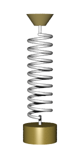

# Force-balance equations {#sec-second-order-de}

```{r child="../starter.Rmd"}
```


Up to now, we have been studying dynamics in the format of one or more first-order differential equations. For instance,
$$\partial_t x = f(x, y)\\
\partial_t y = g(x, y)$$
where $f(x,y)$ and $g(x,y)$ are the dynamical functions. This is not the style in which differential equations were introduced in the late 1600s. Instead, [Isaac Newton](https://en.wikipedia.org/wiki/Isaac_Newton) (1642-1727) wrote his differential equations in the format of his Second Law of Motion, which reads (in a 1792 translation):

> **LAW II**: *The alteration of motion is ever proportional to the motive force impressed; and is made in the direction of the right line in which that force is impressed.* --- [Source](https://cudl.lib.cam.ac.uk/view/PR-ADV-B-00039-00001/9)

In contemporary language, we would say things differently. Instead of "alteration of motion" we would write $\partial_t v$, where $v$ is the velocity of the moving object. We call $\partial_t v$ the acceleration.  Instead of "motive force" we would say simply "force," and instead of "made in the direction of the right line in which that force is impressed", we would say that velocity, acceleration, and force are vector quantities. Newton's "ever proportional to" amounts to saying that 
$$\partial_t \vec{v} = b \vec{F}\,$$
that is, change in motion is proportional to force. Newton stipulated that the constant of proportionality, $b$, is the reciprocal of mass, that is $1/m$. Writing acceleration $\vec{a} = \partial_t \vec{v}$, the previous equation amounts to $$m \vec{a} = \vec{F}\ ,$$  
the form in which beginning physics students first hear it.

Newton, of course, was very interested in ***gravity***. From previous experiments dropping weights and rolling balls down ramps, as was done by Galileo Galilee (1564-1642), Newton knew that the force of gravity on an object (near the surface of Earth) is proportional to the object's mass, that is $$\vec{F} = -g m\ ,$$ where the direction of $\vec{F}$ is straight downwards toward the center of the Earth. The negative sign in front of $g$ reflects this downward direction. We are assuming that position and velocity are both defined in a positive, upward direction.^[it is remarkable that the same $m$ appears both in Newton's Second Law and in the description of the force of gravity. There was no mathematical theory for this until Albert Einstein (1879-1955)] developed his ***Theory of General Relativity***.]

The simple model of an object moving under the force of gravity is $\partial_t v = g$. Notice that this is not a linear differential equation---$g$ is not a linear function of $v$ but a constant, and there is no fixed point---so the solution is not an exponential. But we can find the solution easily enough by integrating both sides of the equation with respect to $t$.

$$\int \partial_t v\, dt = \int -g\, dt \ \ \implies v(t) = -g\, t + C$$
where $C$ captures the constants of integration from both integrals into one number.

It is worth noticing how much mathematics needs to be understood before this method of solution makes sense. The ***fundamental theorem of calculus*** is what tells us that $\int \partial_t v\, dt = v(t) + B$, and you have to know about how to anti-differentiate a constant function to make sense of $\int g\, dt = -g\,t + D$. You also need to know why constants of integration, such as $B$ and $D$, get included when writing the function that results from an anti-differentiation. (You might need to revisit Block 3 to refresh your memory about such things.)

There is also some physical context to be considered. By setting $t=0$ in $v(t) = -g\,t + C$, for instance, we can identify $C$ as the velocity at time zero, which we might write $v(0)$ or $v_0$ for short. And what about the position of the object? The solution $v(t) = -g\,t + v_0$ has nothing to say directly about the position $x(t)$ of the object as a function of time. We can work position $x(t)$ into things by recognizing that $v(t) = \partial_t x(t)$, which is the definition of velocity.

Anti-differentiating both sides of $v(t) = -g\, t + v_0$ gives us a more complete story that include both initial velocity $v_0$ and initial position $x_0$:
$$\int v(t)\, dt = \int \left(\strut -g\, t + v_0\right)\ dt \implies x(t) = -\frac{1}{2} g\,t^2 + v_0\,t + x_0\ ,
$$
where $x_0$ is the constant of integration from this second stage of anti-differentiation. (Plug in $t=0$ to see why we are justified in taking $x_0$ as the initial position.)^[Another bit of physics which is still not included in the differential equation is that it will only hold until the object hits the ground, at which point the force of gravity will be counter-acted by the force of the ground on the object.]

Still one more way to write the dynamics of falling under the influence of gravity .... Recognizing that $v(t) = \partial_t x(t)$, we can see that $\partial_t v(t) = \partial_{tt} x(t)$. So the original differential equation could be written:

$$\partial_{tt} x = -g$$
This is an example of a ***second-order differential equation***, so called because of the appearance of a second derivative, $\partial_{tt}x$. 

In this chapter, we will study second-order differential equations in a variety of contexts. But, as for Newton, movement under the influence of gravity will be a focus. Since the second-order differentiation can be interpreted as representing the balance between force and acceleration, we will call these ***force-balance equations***.

In general, a force-balance equation has the form
$$\partial_{tt} x = f(\partial_t x, x)$$, the acceleration is a function both of position and velocity. In the above example, the dynamical function has a particularly simple form: $f(\partial_t x, x) \equiv -g$.

Second-order differential equations can always be written as a pair of first-order differential equations. To see this, let one of the first-order equations be $$\partial_t x = v\ .$$ The other equation, $\partial_{tt} x = f(\partial_t x, x)$ can be re-written in terms of $v$:
$$\partial_t v = f(v, x)\ .$$

Since we know how to solve sets of first-order differential equations by Euler's method, we can always find the solution $x(t)$ to any second-order differential equation.

## Ballistics {#sec-ballistics}

A lot of the theory of second-order differential equations was developed in the setting of a ball being set off with an initial velocity from an initial position. Such a focus on the flight of balls might seem trivial. Fortunately, language allows us to construct a scientific-sounding word by adding the suffix "istic" to the root "ball." This suffixing produces the word ***ballistics***.

The importance of ballistics to Newton can be seen by a famous diagram he drew, shown in @fig-newton-ballistics. In the diagram, Newton traces the path of a ball shot horizontally from a cannon placed at the top of a mountain. 

```{r echo=FALSE}
#| label: fig-newton-ballistics
#| fig-cap: "Newton's diagram showing ballistic motion under the force of gravity." 
#| fig-cap-location: margin
knitr::include_graphics("www/Newton-cannon.png")
```

Since the motion in Newton's diagram has both vertical and horizontal components, we will need *two* second-order differential equations:

$$\text{Horizontal}: \ \ \partial_{tt} x = 0\\
\ \ \ \text{Vertical}: \ \ \ \ \ \ \partial_{tt} y = -g$$
The zero on the right-hand side of the equation of horizontal movement reflects that gravity does not act horizontally.

We found a solution for the vertical equation in the previous section, $$y(t) = -\frac{1}{2} g\,t^2 + 0\,t + y_0\ .$$ The $0\, t$ component to the solution reflects that the vertical component of the ball, coming out of the cannon, is zero.

The solution for the horizontal component of motion can be found by anti-differentiating both sides of the equation of hortizontal motion:
$$\int \partial_{tt} x(t)\, dt = \partial_t x(t) = \int 0\, dt = v_0$$ where $v_0$ is the initial horizontal velocity. A second stage of anti-differentiation gives $x(t)$ itself:
$$\int \partial_t x(t) = \int v_0 dt = v_0\, t + x_0$$

Regrettably, symbolic anti-differentiation works only in simple cases. To support more realistic models of ballistics, let's see how to translate the two second-order differential equations into sets of first-order equations.  The state variables will be $x(t)$ and $y(t)$, but we also have to add another pair, $u(t)$ and $v(t)$ standing for the horizontal and vertical velocities respectively. The first-order equations will be:
$$\partial_t x = u\\
\partial_t y = v\\
\partial_t u = 0\\
\partial_t v = -g
$$
To illustrate, we will solve this set of four first-order equations numerically. We need to specify the initial values for $x_0$, $y_0$, $u_0$ and $v_0$. We will let the cannon be located at horizontal position $x_0 = 0$ and vertical position $y_0 = 100$ meters. The vertical velocity is, initially, zero, so $v_0 = 0$. And suppose the cannon produces an initial horizontal velocity of $u_0 = 250$ meters/sec. The constant $g$ is known to be 9.8 meters/sec^2^. 

Here's the trajectory:

```{r results="hide"}
traj <- integrateODE(
  dx ~ u, dy ~ v, du ~ 0, dv ~ -9.8, #dynamics
  x=0, y=100, u = 250, v=0, #initial conditions
  bounds(t=0:5)
) 
traj_plot(y(t) ~ x(t), traj)
traj_plot(v(t) ~ u(t), traj)
```

```{r echo=FALSE}
#| label: fig-cannon-shot-1
#| fig-cap: "Trajectory of the cannon ball shot with an initial horizontal velocity and no initial vertical velocity. The trajectory is plotted in slices of state space: position $(x, y)$ and velocity $(u, v)$. The time at which the ball reaches the points marked on the trajectory give the time."
P1 <- traj_plot(y(t) ~ x(t), traj) %>%
  gf_hline(yintercept=~0, color="brown") %>%
  gf_labs(subtitle="(x, y) position as a function of time")
P2 <- traj_plot(v(t) ~ u(t), traj) %>%
  gf_labs(subtitle="(u, v) velocity as a function of time")
gridExtra::grid.arrange(P1, P2, nrow=1)
```
The left panel in @fig-cannon-shot-1 shows that the trajectory is a parabola. At about $t=4.4$ secs the $y$ position is zero. If zero is the location of the ground, the part of the trajectory for $4.4 < t$ is invalid, since the ball has already hit the ground. The ball travels a little more than 1100 meters horizontally before hitting the ground.

The right panel might seem somewhat strange. You can see that the vertical component of velocity, $v(t)$ starts out at zero and increases linearly with time, becoming more and more negative as gravity continuous to accelerate the ball downward. The vertical velocity, $u(t)$, stays constant at $u(t) = 250$ meters per second. This is because there is no horizontal force on the ball.

::: {.intheworld data-latex=""}
The world's first programmable, electronic, general-purpose digital computer was started up in 1945 at the University of Pennsylvania, where it is still on display. The date and location have something to say about why the computer was built. 1945 is, of course, at the end of World War II. The computer was built to carry out some important war-time calculations. The place, Philadelpha, Pennsylvania, has to do with the location of the US Army's center for developing and testing ordnance: the [Aberdeen Proving Ground](https://en.wikipedia.org/wiki/Aberdeen_Proving_Ground#History) which is only 75 miles from the University of Pennsylvania.

The name given to the computer, ENIAC, has a science-fiction flavor but is in fact rooted in its purpose: the Electronic Numerical Integrator and Computer. ENIAC was constructed to calculate the trajectories of artillery shells. Knowing the trajectory is essential to being able to fire artillery accurately.

The ballistics of real world artillery shells is more complex than the simple model we constructed earlier. What's missing from that model is air resistance, which is a function of the shell's velocity and altitude. To illustrate, let's add in a simple model of air resistance to the earlier ballistic model. In this model, the force of air resistence is a vector pointing in the opposite direction to overall velocity and proportional to velocity squared.

The velocity vector is simply $\left[\begin{array}{c}u\\v\end{array}\right]$. The air resistence force will be $$-\alpha\sqrt{\strut u^2 + v^2} \left[\begin{array}{c}u\\v\end{array}\right]\ .$$ Consequently, the horizontal component of the air-resistence vector is $-\alpha\, u \sqrt{\strut u^2 + v^2}$ and the vertical component is $-\alpha\, v \sqrt{\strut u^2 + v^2}$. 

Incorporating air resistence into the model can be done like this:
$$r(u, v) \equiv \alpha \sqrt{\strut u^2 + v^2}\\
\partial_t x = u\\
\partial_t y = v\\
\partial_t u = -u\, r(u,v)\\
\partial_t v = -g - v\, r(u,v)$$
ENIAC would have been programmed to carry out the calculation we now do with `integrateODE()`:

```{r}
r <- makeFun(alpha*sqrt(u^2 + v^2) ~ u & v, alpha=0.003)
traj2 <- integrateODE(
  dx ~ u, dy ~ v, du ~ -u*r(u,v), dv ~ -9.8 - v*r(u,v), #dynamics
  x=0, y=100, u = 250, v=0, #initial conditions
  bounds(t=0:6)
)
traj_plot(y(t) ~ x(t), traj)
traj_plot(v(t) ~ u(t), traj)
```

```{r cannon-shot-2, fig-cap: "Adding air resistence to the model changes the trajectory. For reference, the trajectory *without air resistence* is plotted in $\\color{orange}{\\text{orange}}$.", warning=FALSE}
P1 <- 
  gf_hline(yintercept=~0, color="brown") %>%
  traj_plot(y(t) ~ x(t), traj, nt=2, color="orange") %>%
  traj_plot(y(t) ~ x(t), traj2) %>%
  gf_labs(subtitle="(x, y) position as a function of time")
P2 <- traj_plot(v(t) ~ u(t), traj2) %>%
  gf_labs(subtitle="(u, v) velocity as a function of time")
gridExtra::grid.arrange(P1, P2, nrow=1)
```
Air resistance causes the cannon ball to travel a shorter horizontal distance and to arrive with a much reduced velocity.
:::

## The harmonic oscillator

Consider the motion of a weight attached to a spring, as in @fig-spring-mass. We will denote the vertical position of the mass by $y(t)$. Such a spring-mass system has a fixed point where the spring is stretched just enough to cancel out gravity and the velocity is zero. We will measure $y$ relative to this fixed point. 

```{r echo=FALSE}
#| label: fig-spring-mass1
#| fig.cap = "A spring-mass system in motion. [Source: Svjo](https://commons.wikimedia.org/wiki/File:Animated-mass-spring.gif) [CC BY-SA](https://creativecommons.org/licenses/by-sa/3.0) via Wikimedia Commons"
#| column: margin
if (knitr::is_html_output()) {
  knitr::include_graphics("www/Animated-mass-spring.gif")
} else {
  
}
```

According to Hooke's Law, a stretched or compressed spring exerts a force that is proportional to the amount of extension or compression. With our measuring $y$ relative to the fixed point, the Hooke's Law force will be
$$m\, \partial_{tt} y = - s\, y\ ,$$ where $m$ is the amount of mass and $s$ is the stiffness of the spring.
This force-balance equation corresponds to the second-order differential equation $$\partial_{tt} y = - \frac{s}{m} y\ .$$

You can see that the motion is oscillatory, which suggests that the solution to the differential equation will be of the form $y(t) = A \sin(\omega t)$. Taking this as an ***ansatz*** leads to finding a value of $\omega$, which is called the ***angular frequency*** of the oscillation. (In terms of the period of oscillation $P$, the angular frequency is $\omega = 2 \pi/P$.)

To find $\omega$, plug in the ansatz to the differential equation:

$$\partial_{tt} A \sin(\omega t) = - \frac{s}{m}\, A \sin(\omega t)$$ 
Differentiating $\sin(\omega t)$ once let's us re-write the left-hand side of the equation in terms of a *first derivative*

$$\partial_{t} A \omega\, \cos(\omega t) = - \frac{s}{m}\, A \sin(\omega t)$$
Differentiating again gives
$$- \omega^2 A\sin(\omega\, t) = - \frac{s}{m}\, A\sin(\omega t)\ .$$
Simplifying this by cancelling out the $A \sin(\omega t)$ term gives $\omega^2 = \frac{s}{m}$, where $\omega$ is the angular frequency of the oscillation.

::: {.takenote data-latex=""}
Instead of using $A \sin(\omega t)$ as the *ansatz* we could have used $A \sin(\omega t) + B \cos(\omega t)$. Working through this ansatz would produce the same result, that $\omega^2 = \frac{s}{m}$. So the solution to the spring-mass system will be, in general, a linear combination of the sine and the cosine functions with angular frequency $\omega$.
:::

## Exponential or sinusoid?

In Chapter @sec-eigenvalues, we established that solutions to second-order linear differential equations have the form $m_1 e^{\lambda_1 t} + m_2 e^{\lambda_2 t}$. Yet in the previous section, we saw one linear second-order differential equation, $\partial_{tt} y = - \omega^2 y$ where the solution is a linear combination of a sine and a cosine function: $y(t) = A \sin(\omega t) + B \cos(\omega t)$ with $\omega = \sqrt{\frac{s}{m}}$.

How is it possible for the solution to be both in the form of a linear combination of exponentials and a linear combination of sine and cosine? Sinusoids oscillate up and down and up and down, whereas exponentials are monotonic. 

To find out what might be the relationship between an exponential and a sinusoid, let's plug an exponential *ansatz* $y(t) = A e^{\lambda t}$ into the spring-mass system $\partial_{tt} y = -\omega^2 y$.

$$\partial_{tt} A e^{\lambda t} = \lambda^2 A e^{\lambda t} = -\omega^2 A e^{\lambda t}\ .$$
As before, we will cancel out the common term $A e^{\lambda t}$ to get a simple relationship:
$$\lambda^2 = -\omega^2\ \ \ \implies\ \ \ \lambda = \pm \sqrt{\strut-1}\  \omega \ .$$
Generally, the symbol $i$ is used to stand for $\sqrt{\strut -1}$, so our eigenvalues can be written $\lambda = \pm i \omega$. The solution to the spring-mass system, according to this analysis, is:
$$y(t) = m_1 e^{i\omega t} + m_2 e^{-i \omega t}$$


In other words, $e^{i \omega t}$---notice the $i$ in the argument to the exponential---is a sinusoid with angular frequency $\omega$.


## Exponentials with "imaginary" inputs

The "imaginary" in the section title is used in its mathematical sense. In interpreting the word "imaginary," you should keep in mind a long history in mathematics of assigning insulting names to mathematical objects that, at the time they were first introduced. That is why some numbers are vilified as "negative," and some as "irrational." The insult is even more dire for numbers like $i$, which are called the "imaginary" numbers. Regrettably, the word "imaginary" leads many people to shy away from them, just as many people avoid genres such as fantasy fiction. That imaginary numbers are introduced as kind of freakish---is there  a numerical value for $\sqrt{\strut -1}$?---and rarely touched until advanced calculus, means that students are unused to them.

You will only get comfortable with "imaginary" numbers when you start to work with them extensively, as happens in physics and engineering courses. Our goal here is merely to increase your awareness of imaginary numbers and some of the ways they are used in the sciences. To that end, we offer three different approaches to understanding the function $e^{i\omega t}$.

1. Basic, pragmatic understanding. This is the level of understanding that you **must have** to make sense of the rest of this chapter and Chapter @sec-forcing. Here it is:
$$e^{i\omega t}\ \text{is simply a shorthand for}\ \cos(\omega t).$$
So whenever you see $e^{i \omega t}$, think of $\cos(\omega t)$.

2. Algebraic understanding via Taylor Polynomials. (optional) This level of understanding can give you confidence that the basic, pragmatic understanding in (1) has honest roots. It also shows the way that (1) is not 100% on target (although good enough for a large fraction of mathematical work). But for many people, algebra is a rocky road to understanding.

The starting point for the algebraic understanding is the Taylor polynomial approximation for $e^{\omega t}$. Recall from Chapter `r Chaps$taylor` that
$$e^{\omega t} = 1 + \omega t + \frac{1}{2!}\omega^2 t^2 + \frac{1}{3!}\omega^3 t^3 + \frac{1}{4!} \omega^4 t^4 + \frac{1}{5!} \omega^5 t^5 + \frac{1}{6!} \omega^6 t^6 + \cdots$$
You may also recall the Taylor polynomial expansion of sine and cosine:
$$ \cos(\omega t) = 1 - \frac{1}{2!} \omega^2 t^2 + \frac{1}{4!}\omega^4 t^4 - \frac{1}{6!} \omega^6 t^6 + \cdots$$

$$\color{magenta}{\sin(\omega t) = \omega t - \frac{1}{3!}\omega^3 t^3 + \frac{1}{5!} \omega^5 t^5 +  \cdots}$$
You can see some association between $e^{wt}$, $\cos(\omega t)$, and $\sin{\omega t}$ by looking at
$$\cos(\omega t) + \color{magenta}{i \sin(\omega t)} = 1 + \color{magenta}{i \omega t} -\frac{1}{2!} \omega^2 t^2 - \color{magenta}{i \frac{1}{3!} \omega^3 t^3} + \frac{1}{4!}\omega^4 t^4 + \color{magenta}{i \frac{1}{5!} \omega^5 t^5} - \frac{1}{6!}\omega^6 t^6 + \cdots$$
Now consider the Taylor polynomial for $e^{i\omega t}$. This will be the same as the Taylor polynomial for $e^{\omega t}$ but everywhere substituting $i \omega$ in place of the plain $\omega$. That is:

$$e^{i \omega t} = 1 + \color{magenta}{i\omega t} + \frac{1}{2!}i^2\omega^2 t^2 + \color{magenta}{\frac{1}{3!}i^3\omega^3 t^3} + \frac{1}{4!} i^4\omega^4 t^4 + \color{magenta}{\frac{1}{5!} i^5\omega^5 t^5} + \frac{1}{6!} i^6\omega^6 t^6 + \cdots$$
Since $i\equiv \sqrt{\strut -1}$, we have the following facts for the powers $i^n$:

$$i^2 = -1\ \ \ \ \ \color{magenta}{i^3 = -i}\ \ \ \ \ i^4 = 1\ \ \ \ \ \color{magenta}{i^5 = i}\ \ \ \ \ i^6 = -1\ \ \text{and so on}.$$
Substitute these facts about $i^n$ into the Taylor polynomial for $e^{i\omega t}$:

$$e^{i \omega t} = 1 + \color{magenta}{i\omega t} - \frac{1}{2!}\omega^2 t^2 - \color{magenta}{i \frac{1}{3!}\omega^3 t^3} + \frac{1}{4!} \omega^4 t^4 + \color{magenta}{i \frac{1}{5!} \omega^5 t^5} - \frac{1}{6!} \omega^6 t^6 + \cdots$$
which exactly matches the Taylor polynomial for $\cos{\omega t} + \color{magenta}{i \sin(\omega t)}$.

3. The arithmetic of complex numbers. (optional) A ***complex number*** is a number like $2 - 3i$ which consists of two parts: the real-part $2$ and the imaginary part $-3$. When you multiply one complex number by another you get a complex number (although either the real or imaginary parts might happen to be zero.) For example:
$$(2 + 3i)^2 = (2+3i)(2+3i) = \underbrace{4}_{2\times 2} + \underbrace{ \ 6 i\ }_{2 (3i)} +   \underbrace{\ 6 i\ }_{(3i)2}\ \  \underbrace{- 9}_{(3i)(3i)}\  = -5 +12 i.$$
R knows the rules for arithmetic on complex numbers. Here's a demonstration of the oscillations that result from raising a complex number to successive powers.

```{r}
lambda <- 0.65 + 0.76i
lambda^2
lambda^3
lambda^4
lambda^5
lambda^6
lambda^7
lambda^8
lambda^9
lambda^10
```
Notice that the real part of the result oscillates between negative and positive. The imaginary part also oscillates, but delayed a bit from the real part. Just like sine and cosine.

We can get a clearer picture by plotting $e^{i\omega t}$ over the domain $0 < t < 10$. As an example, in @fig-complex-exponential-plot we will set $\omega = 2$. We need to be a little careful, since our plotting functions are not arranged to display complex numbers. But there is an easy workaround: plot the "real" and "imaginary" parts separately. The R operators `Re()` and `Im()` do this work.

```{r echo=TRUE}
#| label: complex-exponential-plot
#| fig-cap: "The real and imaginary parts of $e^{i \\omega t}$ plotted as a function of $t$."
#| fig-cap-location: margin
f <- makeFun(exp(1i * omega * t) ~ t, omega = 2)
slice_plot(Re(f(t)) ~ t, 
           bounds(t=0:10), color = "magenta") %>%
  slice_plot(Im(f(t)) ~ t, color="brown")
```


## Damping

It is common for there to be friction, called ***damping***, in a spring mass system. To keep things very simple, we will consider that the friction is proportional to the velocity and, as in the cannonball example, in the direction opposite to velocity. That is:
$$\partial_{tt} y = -r\, \partial_t y -b y\ ,$$ where $b$ would be the positive number $\frac{s}{m}$ and $r$ is another positive number reflecting the magnitude of friction. (Think of $r$ as standing for "resistance.")

As always, this second-order differential equation can be written as a pair of first-order differential equations. One of the first-order differential equations will be
$$\partial_t y = v\ ,$$, which is just the definition of velocity $v$. The other first-order equation will be
$$\partial_t v = -r v  - b y\ .$$ Both equations are linear.

In the previous chapter, we wrote such a pair of linear first-order differential equations in terms of a vector
$$\vec{w(t)} = \left[\begin{array}{c}v(t)\\y(t)\end{array}\right]\ .$$
In terms of the vector $\vec{w(t)}$ the dynamics can be written in vector/matrix form:
$$\partial_t \vec{w} = \left[\begin{array}{c}-r \ \ \  -b\ \ \\1 \ \ \ \ \ \ \ 0\end{array}\right]\, \vec{w}\ .$$
This form suggests, at least  to the avid reader of the previous chapter, that we look for a solution $y(t) = m_1\, e^{\lambda_1\, t} + m_2\, e^{\lambda_2\, t}$ in terms of the eigenvectors and eigenvalues of the matrix $\left[\begin{array}{cc}r & b\\1 & 0\end{array}\right]$.

We used the R function `eigen()` to compute the eigenvalues and eigenvectors of the matrix, given numerical values for $r$ and $b$. Let's now try to find an algebraic formula for the eigenvalues. After all, it is the eigenvalues that determine the stability of the fixed point.

As an *ansatz* for the for the original second-order differential equation $$\partial_{tt} y = r\, \partial_t y + b y\ ,$$ let's use $y(t) = A e^{\lambda t}$, a simple exponential function. Plugging in the ansatz to the differential equation gives:
$$A \lambda^2 e^{\lambda t} = - r A \lambda e^{\lambda t} - b A e^{\lambda t}\ .$$ 
We can cancel out the common term $A e^{\lambda t}$ from all the terms in the equation, and bring all the terms to the left-hand side of the equation, leaving us with
$$\lambda^2 + r \lambda + b = 0\ .$$
This is a quadratic polynomial in $\lambda$, so we can use the "quadratic formula" to find values for $\lambda$ that are consistent with the parameters $a$ and $b$. In applying the quadratic formula you have to remember that the standard statement is for the roots of $a x^2 + b x + c = 0$ and make adjustment for the fact that our polynomial uses the parameter names differently: $\lambda^2 + r \lambda + b = 0$.

$$\lambda = \frac{- r \pm \sqrt{\strut r^2 - 4 b}}{2}\ .$$
Recall that the parameter $r$ describes the amount of friction or resistence in the system; it is a positive number. Similarly, the nature of springs is that $b$ is a positive number. The relative values of $r$ and $b$ determine the motion of the system.

Suppose the stiffness of the spring is much larger than the friction. Then $r^2 < 4b$. This being the case, the $\sqrt{\strut r^2 - 4 b}/2$ will be an imaginary number. Altogether, the eigenvalues will be $\lambda = -\frac{r}{2} \pm {i \omega}$. The solution will be $$y = m_1 e^{\lambda_1 t} + m_2 e^{\lambda_2 t} \\
= m_1 e^{-\frac{r}{2}t + i \omega t} + m_2 e^{\frac{r}{2} - i\omega t} \\
= m_1 e^{-r t/2} e^{i\omega t} + m_2 e^{-r t/2} e^{-i \omega t} \\
= e^{-r t/2}\underbrace{\left[m_1 e^{i \omega t} + m2 e^{i\omega t}\right]}_{\text{sinusoid}(\omega t)}$$
Result: an exponentially decaying sinusoid.

To graph this function, we need to choose appropriate numerical values for $r$ and $b$. Let's set $r=1$. Since $r^2 < 4b$, we must have $\frac{1}{4} < b$: we will choose $b = 6$ which meets this criterion. @fig-decay-sinusoid1 shows the solution to the differential equation:

```{r}
#| label: fig-decay-sinusoid1
#| fig-cap: "An exponentially decaying sinusoid arising from $r = 1$ and $b = 6$."
#| fig-cap-location: margin
traj <- integrateODE(dv~ -r*v - b*y, dy ~ v, 
                     v=10, y=0, r=1, b=6, 
                     bounds(t=0:20))
traj_plot(y(t) ~ t, traj)
```
This is the situation with a swinging door. You shove it to swing open, after which it oscillates with a decreasing amplitude.


In contrast, suppose the spring is weak compared to the damping such that $4b < r^2$. Now $\sqrt{\strut r^2 - 4b}$ is a positive number, not imaginary. What's more, since $b$ is positive, $\sqrt{\strut r^2 - 4 b} < r$.  This means that both eigenvalues are negative. We will illustrate the situation with $r=1, b=0.2$:

```{r echo=TRUE}
#| label: fig-overdamped1
#| fig-cap: "A heavily damped spring-mass system with  $r = 1$ and $b = 0.1$."
#| fig-cap-location: margin
traj2 <- integrateODE(dv~ -r*v - b*y, dy ~ v, 
                      v=10, y=0, r=1, b=0.1, 
                      bounds(t=0:20))
traj_plot(y(t) ~ t, traj2) %>%
  gf_lims(y = c(0, NA))
```
The situation in @fig-overdamped1 is the sort of behavior one expects when giving a shove to an exit door in theater or stadium. The shove causes the door to swing open, after which it slowly returns to the closed position. That gives plenty of time for the people following you to get to the door before it closes.

Finally, consider the case where $r^2 - 4 b = 0$, a balance between resistance and springiness. In this case, both eigenvalues are $\lambda = -r/2$.

```{r echo=TRUE}
#| label: fig-critically-damped
#| fig-cap: "A critically damped oscillation with $r=1$, $b=0.25$."
#| fig-cap-location: margin
traj3 <- integrateODE(dv~ -r*v - b*y, dy ~ v, v=10, y=0, r=1, b=0.25, bounds(t=0:20))
traj_plot(y(t) ~ t, traj3) %>%
  gf_lims(y = c(0, NA))
```
This is a situation called ***critically damped***. The door swings open, then closes as fast as it can without any oscillation.


::: {.example data-latex=""}
$\ $
Consider the second-order linear differential equation $$\partial_{tt} y + 2\, \partial_t y - 3\, y = 0\ .$$ Is this system stable?

For this system, $a=2$ and $b = - 3$, so the eigenvalues are 
$$\lambda = \left(-2 \pm \sqrt{\strut 4 + 12}\right)/2 = 1 \pm \sqrt{\strut 16}/2 = -1 \pm 2$$
In other words, $\lambda_1 = -3$ and $\lambda_2 = +1$. This indicates that the system is a saddle: unstable in one direction and stable in the other.

To confirm our work, let's use `eigen()` to find the eigenvalues of the matrix $\left[\begin{array}{cc}2 & 3\\1 & 0\end{array}\right]$:

```{r}
M <- cbind(rbind(-2,1), rbind(3,0))
eigen(M)
```

Although R is doing all the calculations for us, it is possible to write the directions of the eigenvectors only in terms of the eigenvectors:
$$\vec{\Lambda_1} = \left[\begin{array}{c}\lambda_1\\1\end{array}\right]\ \ \text{and}\ \ \vec{\Lambda_2} = \left[\begin{array}{c}\lambda_2\\1\end{array}\right]$$

For the system with $\lambda_1 = 3$ and $\lambda_2 = -1$, you can confirm that the eigenvectors calculated with this formula point in the same directions as the eigenvectors reported by `eigen()`.
:::


Let's return to the car-following control system introduced in Chapter @sec-eigenvalues. Recall that $x$ was defined to be the distance between two cars and $x_0$ the distance to be maintained. In terms of $y = x - x_0$ the system was $$\partial_{tt} y = - b y\ .$$
You can see that this system *has no damping*; $y(t)$ will be a sinusoidal oscillation. The ride will be more pleasant, however, if the oscillations can be damped out. To accomplish this, we should add a new term to the second-order differential equation, a damping term to give
$$\partial_{tt} y = -a\, \partial_t y- b\, y\ .$$
We should set the parameters $a$ and $b$ to make the real part of the eigenvalues negative. Only then will we have designed a workable control system.

::: {.intheworld data-latex=""}
For a human driver, following a car at a steady distance requires careful attention but in practice is not too difficult a task. Could it be the case that drivers have an intuitive understanding of the need for damping? Perhaps complex eigenvalues ought to be a standard topic in driving schools? That might be, but there is a more down-to-earth explanation of how humans handle the car-following task.

The quantity $\partial_{tt} y$ is the acceleration, and the control pedal that leads to positive acceleration is called the "accelerator." But the pedal does not  set acceleration. In reality, the pedal sets velocity as well as acceleration. A simple model is $\text{pedal} = r \partial_t y + s \partial_{tt} y$, where $y$ is the velocity of the car and $r$ and $s$ are positive parameters. 

To understand this model of the pedal, think what happens when you press the accelerator and hold it. The car accelerates, but only up to the point where a steady state velocity is reached. Or, consider what happens if you partially release the pedal. The car slows down until it reaches a new, slower, steady-state velocity.

With a human driver, the control system is not $\partial_{tt} y = - b y$. Instead, the control system is $$\text{pedal} - p_0 =  - b y\ .$$ For steady-state driving at the desired velocity $\partial_t y$ we press the pedal by an amount $p_0$. To perform the car-following task, we push down or lighten up on the pedal, depending on whether we are farther or closer to the car ahead than our desired distance.

Combining the models for how $\text{pedal}$ is controlled and how $\text{pedal}$ relates to velocity and acceleration, we have
$$r \partial_t y + s \partial_{tt} y  - p_0 = -b y$$ or, re-arranging terms
$$ \partial_{tt} y = \underbrace{- \frac{r}{s} \partial_t y}_{\text{damping}} - \frac{b}{s} y + p_0\ .$$
The nature of the gas pedal itself leads to a damping term in the dynamics, without our having to think about it consciously.
:::


## Exercises

`r insert_exercises("Dynamics", "force-balance")`

<!--
- T-ZO94U: Identify the components of a force-balance differential equation: mass, acceleration, friction (damping, air resistance), restorative force.

- S-BOXLN: Identify and interpret mechanistically interaction terms in a second-order differential equation

- F-189B3: Interpret the complex exponential $e^{i\omega t}$ as a sinusoid of frequency $\omega$.

- P-7PXE3: Identify a differential equation in force-balance form and, for linear equations, determine if the solution is stable or unstable and, if oscillatory, what the frequency of oscillation is.

- Z-DPT7M: For a linear differential equation in force-mass form, use the ansatz $e^{kt}$ to find the quadratic polynomial in $k$ ("characteristic equation") that describes the eigenvalues of the differential equation.

- W-5ZT92: Construct and solve numerically a system of two first-order differential equations that represent a vertically rising or falling object in the presence of gravity and air resistance.
-->

