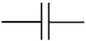
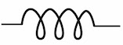

**Passive electrical circuits**

Second-order differential equations are used to model simple electrical circuits. In a step outside of calculus (meaning: you won't be examined on it) it is worth pointing out the correspondence between concepts of motion (acceleration, velocity, position) and electrical circuits (voltage, current, charge). 
There are three classical idealized passive components of circuits:

* capacitor, denoted 
* resistor, denoted 
* inductor, denoted 

In every case, we will be interested in the *voltage* across the two ends of the component. And we will think about the dynamics of the circuit in terms of electrical *charge* which we will denote $x$.

* For a capacitor the voltage is proportional to *charge* $x/C$, where $C$ is the "size" of the capacitor. 
* For a resistor the voltage is proportional to the flow of charge, that is, *current* $r \dot{x}$, where $R$ is the amount of resistance, basically the "size" of the resistor.
* For an inductor the voltage is proportional to the change in the flow of charge, that is, $L \ddot{x}$, where $L$ is the inductance.

Only a capacitor is capable of holding a voltage on its own. The other circuit elements can carry a voltage when they are part of a *circuit*.  we will explore a simple circuit. 

```{r echo=FALSE, out-width: "40%", fig-align: "center"}
knitr::include_graphics("www/lrc.png")
```

To prime the circuit, we will connect the two dots at the bottom of the circuit with a battery. This will charge up the capacitor in much the same way as we "charge up" a spring by pulling on it. Next remove the battery and get ready to observe the motion. Complete the circuit by closing the switch between the two dots. Doing so establishes the circuit, analogous to setting up the dynamics of the system. The initial condition is the amount of charge $x$ on the capacitor and, at the instant the switch is closed, no flow of current, giving $\dot{x} = 0$. 

The "force-balance" is the requirement that the sum of the voltages across the circuit elements be zero.  This amounts to

$$L \partial_{tt} {x} = -R\, \partial_t{x} - \frac{1}{C} x $$ 


1. Consider a circuit with inductance $L=1$, resistance $R=3$ and capacitance $C = 1$. What will be the eigenvalues of the dynamics? **Will the fixed point at $x=0$ be stable or not?**

<!--
Solution: $\lambda_{1,2} = \frac{1}{2}\left[-3 \pm \sqrt{\strut 9 - 4 }\right] = (-3 \pm \sqrt{5})/2$ so $\lambda_1 \approx -0.382$ and $\lambda_2 \approx -2.618$. Since both eigenvalues are negative, the fixed point is stable. 
-->

```{nos2, echo=FALSE, results="markup"}
askMC(
  "2. Let's decrease the the resistence to $R=2$ and the capacitance to $C = 1/2$. What are the eigenvalues of the dynamics?",
  "+$\\lambda_1 = -1 + 1i$ and $\\lambda_2 = -1 - 1i$+",
  "$\\lambda_1 = -1 + 1i$ and $\\lambda_2 = 1 - 1i$"
  "$\\lambda_1 = 1 + 1i$ and $\\lambda_2 = 1 - 1i$+"
)
```

3. **What will be the frequency of the solution $x(t)$?**
