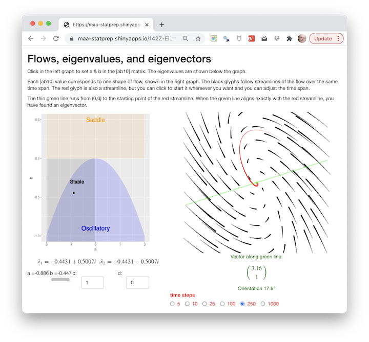

In this exercise, you'll be using an app that allows you to set $a$ and $b$ in the [ab10] matrix and hunt for eigenvectors.

<a href="https://maa-statprep.shinyapps.io/142Z-Eigenflows/" target="_blank">
 
</a>

Open up the app in another browser tab and arrange it side-by-side with this document, so you can see both at the same time.

You used a somewhat similar app when exploring linear, two-dimensional finite-difference equations. [Here's a link](https://maa-statprep.shinyapps.io/142Z-Matrix-iteration/), but you don't need to open that app for this exercise.

This new app does a few things differently:

* In the old app, you had four number-entry boxes to set the values of the [abcd] matrix. Here, because we're using the [ab10] format, you need only set $a$ and $b$. You can do this by clicking within the left-hand graph.
* The a-b selector graph is annotated with the type of generic behavior that the differential-equation system will show for any combination of $a$ and $b$. This allows you to reason backward from the behavior you are interested in to the corresponding values of $a$ and $b$. Since the type of behavior is encoded in the eigenvalues, you are effectively inverting the eigenvalue formula to find $a$ and $b$.
* The flow field (right-hand graph) shows *stream-lines* of continuous-time motion. Imagine you had a bunch of glitter which you cast out over a pool of water with a given flow pattern. If you took a time-exposure photo, you would see each piece of glitter as it moved along with the water in which it is embedded. 
* You can click in the flow field to start a trajectory at that point. You can control the time domain---that is, how long is the time exposure of the photo---with the radio buttons at the bottom.
* There is a thin, green line annotating the flow field. This line runs from the fixed point (right in the center) in the direction of the point on which you click to start a trajectory. A vector with the same orientation as the green line is given numerically below the graph. This orientation is also described using an angle measurement in degrees.
* There is no display of the *solution*, that is, $x()$ versus $t$. This is because we want you to understand the *geometry* of the flow. 

First, play around with the app. Choose miscellaneous values of $a$ and $b$, observe the flow, and click in the flow field to draw a red trajectory. Notice what happens when you make the number of steps larger or smaller. In unstable directions, you can get a good view of the trajectory by starting it near the fixed point. If you start it at the periphery of the graph, most of the trajectory will be outside the display. And if the number of steps is very small, you may not see it at all because the glyph is so thin near the start.

When coming from a stable direction, click near the periphery of the graph to get a good view, since the red trajectory will naturally be heading in towards the origin. When estimating the orientation of an eigenvector, try to get the green line heading straight down the middle of the red trajectory. This often requires a bit of fiddling, moving the starting point just a tiny amount to find one that is just right.

When you are *on* an eigenvector, the trajectory will be dead straight on the green line. Any trajectory not starting on an eigenvector will be curved to a greater or lesser extent, depending on the relative sizes of the eigenvalues.

In the following questions, pick the choice **closest** to the answer you found. The exact choice of $a$ and $b$ stemming from a click depends somewhat on the graphics resolution of your display, so you should expect only to be able to get close to the $a$ and $b$ values given in the question.

```{r ef1-1, echo=FALSE, results="markup"}
askMC(
  "Set $a=-1.0$ and $b = 0.5$ (or as close as you can get) and observe the flow. This is a saddle: stable in one direction, unstable in another. There will be one stable eigenvector, where the flow moves **directly outward** from the origin, and one unstable eigenvector, where the flow moves **directly inward** toward the origin. Which one of these is the orientation (in degrees) of the unstable eigenvector?",
  -149.7,
  -63.6,
  -31.7,
  69.1,
  73.5,
  106.6,
  143.7,
  149.0,
  right_one = 69.1,
  random_answer_order = FALSE
)
```

```{r ef1-a, echo=FALSE, results="markup"}
askMC(
  "Which of these best describes the eigenvalue corresponding to the unstable eigenvector?",
  "Negative and real",
  "Zero and real",
  "+Positive and real+",
  "Complex with a negative real part",
  "Complex with a positive real part",
  random_answer_order = FALSE
)
```

```{r ef1-2, echo=FALSE, results="markup"}
askMC(
  "Keeping $a=-1.0$ and $b = 0.5$, hunt for the stable eigenvector. Which one of these is the orientation (in degrees) of the stable eigenvector?",
  -149.7,
  -63.6,
  -31.7,
  69.1,
  73.5,
  106.6,
  143.7,
  149.0,
  right_one = 143.7,
  random_answer_order = FALSE
)
```

-----

```{r ef2-1, echo=FALSE, results="markup"}
askMC(
  "Set $a=2$ and $b = -0.5$ and observe the flow. This is a source: all initial conditions lead to motion away from the fixed point. But for this $a$ and $b$, some directions are \"faster\" than others. Which one of these is the orientation (in degrees) of the fast eigenvector?",
  -149.7,
  -63.6,
  -31.7,
  69.1,
  73.5,
  106.6,
  143.7,
  149.0,
  right_one = -149.7,
  random_answer_order = FALSE
)
```

```{r ef2-2, echo=FALSE, results="markup"}
askMC(
  "Keeping $a=2$ and $b = -0.5$, what is the orientation of the slow eigenvector?",
  -149.7,
  -63.6,
  -31.7,
  69.1,
  73.5,
  106.6,
  143.7,
  149.0,
  right_one = 73.5,
  random_answer_order = FALSE
)
```

```{r ef2-a, echo=FALSE, results="markup"}
askMC(
  "Staying with the flow from $a=2$ and $b = -0.5$, which of these best describes the pair of eigenvalues?",
  "+Both are real and positive+",
  "Both are real and negative",
  "One is complex, the other real",
  "Both are complex, one has negative real part"
)
```

-----

```{r ef3-1, echo=FALSE, results="markup"}
askMC(
  "Set $a=-2$ and $b = -0.5$ and observe the flow. This is a sink: all initial conditions lead to motion toward the fixed point. Which one of these is the orientation (in degrees) of the fast eigenvector?",
  -149.7,
  -63.6,
  -31.7,
  69.1,
  73.5,
  106.6,
  143.7,
  149.0,
  right_one = 149.0,
  random_answer_order = FALSE
)
```

```{r ef3-2, echo=FALSE, results="markup"}
askMC(
  "Keeping $a=-2$ and $b = -0.5$, what is the orientation of the slow eigenvector?",
  -149.7,
  -63.6,
  -31.7,
  69.1,
  73.5,
  106.6,
  143.7,
  149.0,
  right_one = 106.6,
  random_answer_order = FALSE
)
```

```{r ef3-a, echo=FALSE, results="markup"}
askMC(
  "Staying with the flow from $a=2$ and $b = -0.5$, which of these best describes the pair of eigenvalues?",
  "+Both are real and positive+",
  "Both are real and negative",
  "One is complex, the other real",
  "Both are complex, one has negative real part",
  "Both are complex, both have negative real part"
)
```

-----

```{r ef4-1, echo=FALSE, results="markup"}
askMC(
  "Set $a=-1$ and $b = -1$ and observe the flow. This is a node: the flow is spiral with the fixed point at the center. Is the flow stable or unstable?",
  "+stable+",
  "unstable",
  "neither stable nor unstable" = "Is it getting closer to the fixed point or further away? That's the question that determines stability.",
  random_answer_order = FALSE
)
```

```{r ef4-2, echo=FALSE, results="markup"}
askMC(
  "Keeping $a=-1$ and $b = -1$, what can you correctly say about the eigenvectors?",
  "They have almost the same orientation",
  "There is only one eigenvector" = "There are almost aways two eigenvectors.",
  "+There are no eigenvectors+" = "This is true in the sense that there is no place where the motion is on a straight line toward or away from the origin.",
  random_answer_order = FALSE
)
```

```{r ef4-a, echo=FALSE, results="markup"}
askMC(
  "Staying with the flow from $a=2$ and $b = -0.5$, which of these best describes the pair of eigenvalues?",
  "+Both are real and positive+",
  "Both are real and negative",
  "One is complex, the other real",
  "Both are complex, one has negative real part",
  "Both are complex, both have negative real part"
)
```

-----

```{r ef5-a, echo=FALSE, results="markup"}
askMC(
  "Set $a=0$ and some $b < 0$. The result will be a trajectory that goes around in a closed loop. (You will want to make the number of steps large to see a complete loop.) You may not be able to click on exactly $a=0$, but you should be able to get close enough that the trajectory is a very tightly wound spiral. We're interested here in how many cycles the trajectory covers in a fixed number of time steps, that is, whether the trajectory moves quickly or slowly around the loop. Which of these statements is true about the relationship between $b$ and the speed of the motion?",
  "There's no relationship between $b$ and speed of oscillation.",
  "When $b$ is closer to zero, the speed is higher.",
  "+When $b$ is further from zero, the speed is higher.+",
  random_answer_order = FALSE
)
```

```{r ef5-b, echo=FALSE, results="markup"}
askMC(
  "We're going to look at the relationship between the eigenvalues and the speed of oscillation. Keep $a=0$ and $b < 0$, which guarantees that the motion will be circular. Vary $b$, each time observing how many loops the trajectory makes (for a fixed number of steps), and what the eigenvalues are. Which of these statements is **not** true about the speed of oscillation and the eigenvalues.",
  "The larger the magnitude of the imaginary part of the eigenvalues, the faster the oscillation.",
  "The two eigenvalues have exactly the same imaginary part, except one is positive and the other negative.",
  "+The speed of oscillation relates to the *difference* between the imaginary part of the eigenvalues.+",
  "The real part of the eigenvalues is the same for both when there is oscillatory motion."
)
```

