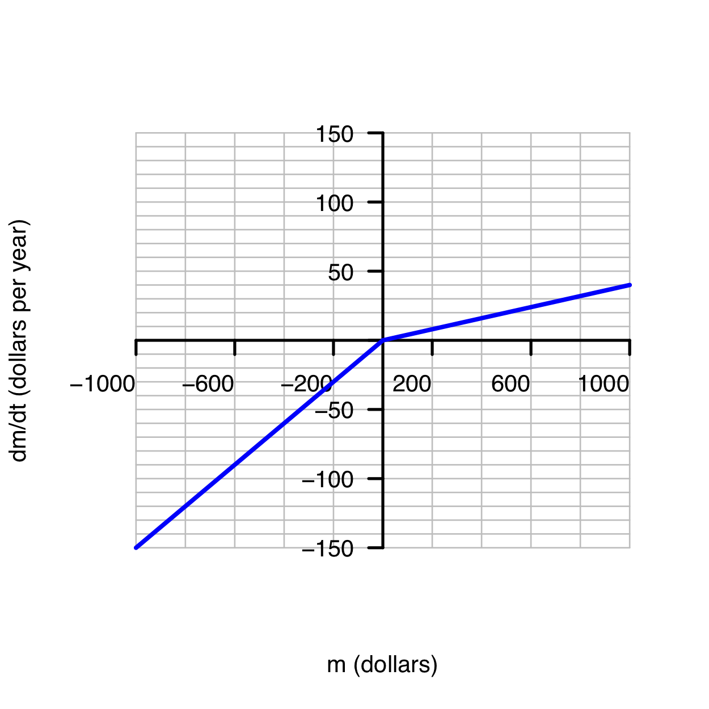
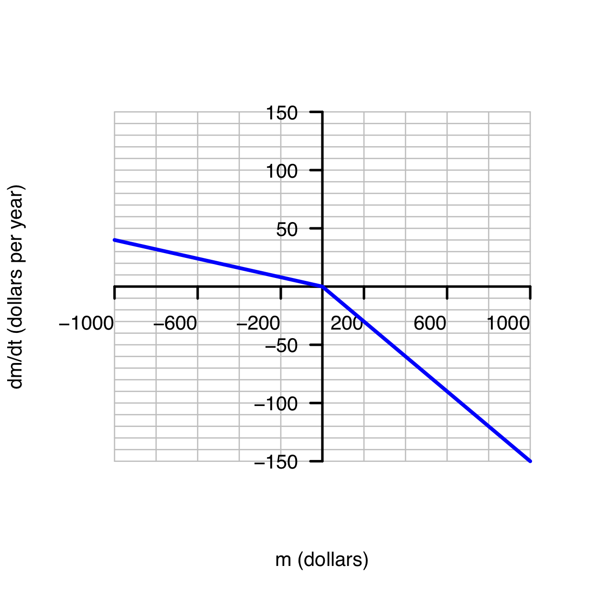
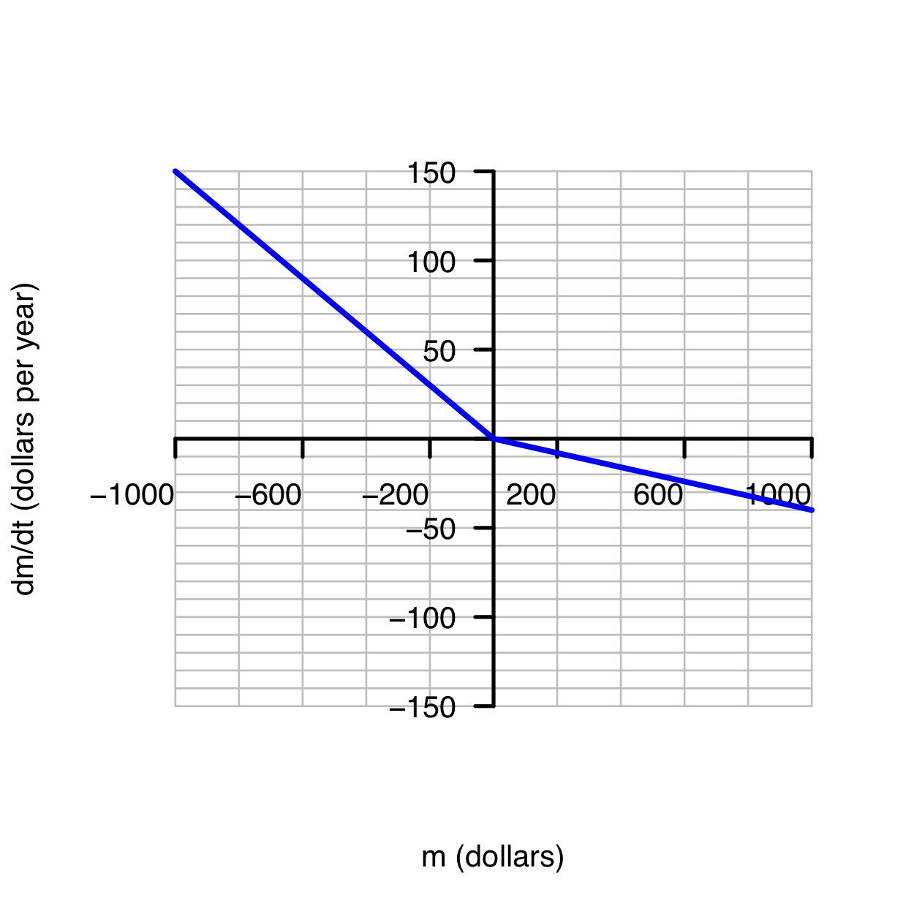
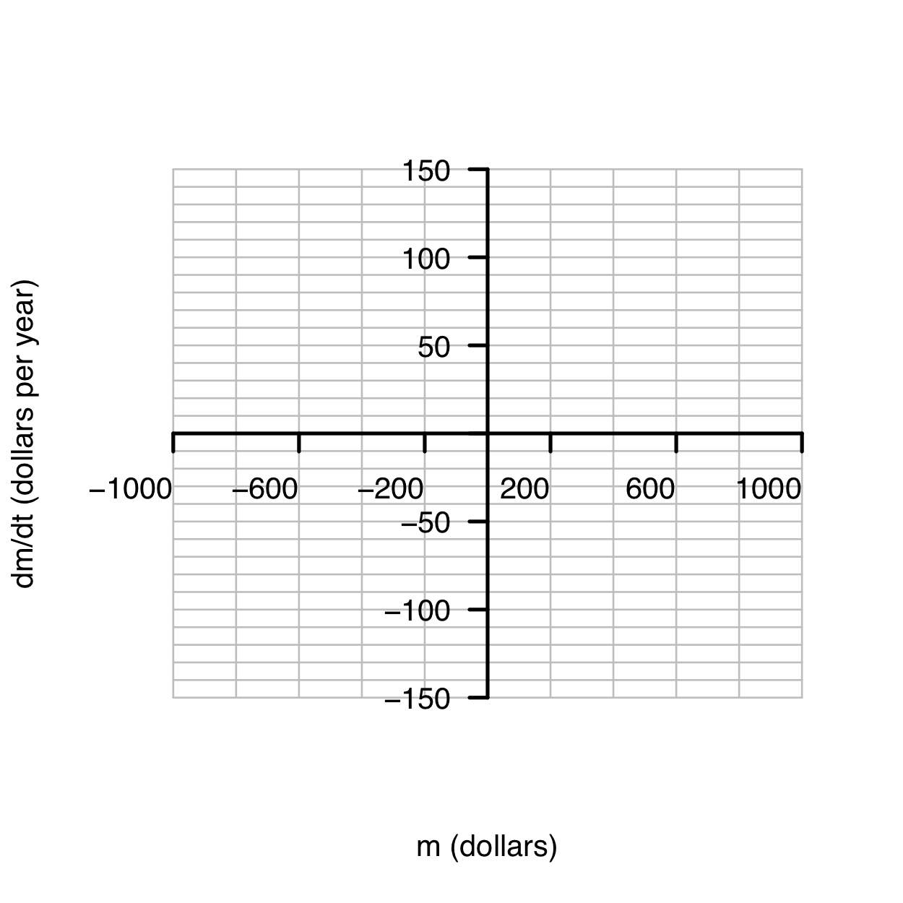

A debit card is a way to make withdrawals from a bank account.  Funds in the account earn interest. In the economic environment of 2021, the interest rate is practically zero. But to make it possible to see the growth on a graph, we will stipulate it to be 4% per year. But if the account is in debt, then the debt grows at a much faster rate, perhaps 15% per year.  

Suppose the amount in the bank account is $m$ (in dollars) and time is $t$ (in years).  If $m$ is positive, you are earning interest.  If negative, you are in debt and the debt will grow.

1. Which of the following graphs reflects the dynamics of the system?

    ```{r one-two,echo=FALSE, out-width: "50%", fig.show="hold", fig-cap: "Scenarios A and B"} 


```

    ```{r three-four,echo=FALSE, out-width: "50%", fig.show="hold", fig-cap: "Scenarios C and D"} 

knitr::include_graphics("www/bank-bank4.png")
```

2. On the graph paper below, sketch out the modifications of the   bank-card dynamics described. Identify any fixed points by marking them on the graph and say if they are stable or unstable.
  
    ```{r echo=FALSE, out-width: "50%", fig.show="hold"} 


```

    a. In addition to the normal bank-card dynamics, your employer makes a steady retirement deposit into your account at the rate of $100 per year.      
    b. Your darling aunt looks at your account balance.  If you have less than $300 in your account, she will add money daily at a rate of $100 per year.  Otherwise, she does nothing.
    


