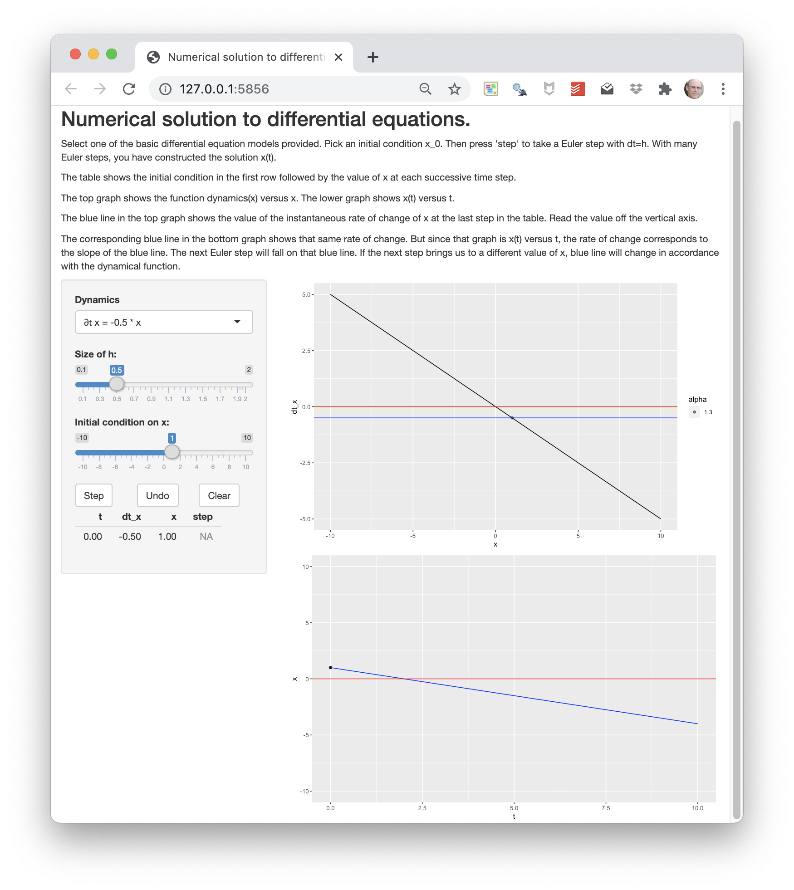

This activity makes use of the following app: 

<a href="https://maa-statprep.shinyapps.io/142Z-DE-Euler" target="_blank"></a>

Click on the picture of the app and it will open in a new browser tab. Arrange that new tab side-by-side with the one where you are reading this.

To solve a differential equation with the Euler method, you need two things:

1. The differential equation itself. Several choices are available in the selector on the left side of the app. On the right side of the equation is the dynamics(x) function.
2. An initial condition $x(0)$. You can select this with the slider.

You will also need

3. A stepsize $h$. So long as this is "small enough," the specifics don't really matter. 

**How Euler works** The first row of the table shows the situation at $t=0$. At that time, the value of $x$, that is $x(t=0)$ is the initial condition that you set with the slider.

In the following, whenever we write $x(t)$ we mean $x$ at the time in the last row of the table.

a. Knowing the value of $x(t)$ the instantaneous value of $\partial_t x$ can be found by plugging $x(t)$ into the dynamics() function. 
b. Now that we know $\partial_t x$, we know how fast $x$ is changing. Multiply this rate of change by $h$ to get the total change of $x$ for the next step.
c. Add a new row to the table at $t+h$ with the $x$-value from the previous row added to the total change of $x$ from that previous row. Loop back to (a) each time the "step" button is pressed.

Select $\partial_t x = -0.5 x$ as the differential equation to solve. Press "step" several times. After each step, try to understand from the table and graphs why the new row added to the table is what it is.

```{r odeE1-a, echo=FALSE, results="markup"}
askMC(
  "For $\\partial_t x = -0.5 x$, which of these best describes the shape of the solution? (You will get a better picture if you set x(0) to, say, 8.)",
  "linear decay to zero",
  "linear growth from zero",
  "+exponential decay to zero+",
  "exponential growth from zero",
  "exponential decay to $x = 5$",
  "exponential growth from $x = 5$",
  random_answer_order = FALSE
)
```

```{r odeE1-b, echo=FALSE, results="markup"}
askMC(
  "For the differential equation $\\partial_t x = +0.5 x$, which of these best describes the shape of the solution? (You will get a better picture if you set x(0) to, say, 1.)",
  "linear decay to zero",
  "linear growth from zero",
  "exponential decay to zero",
  "+exponential growth from zero+",
  "exponential decay to $x = 5$",
  "exponential growth from $x = 5$",
  random_answer_order = FALSE
)
```

```{r odeE1-c, echo=FALSE, results="markup"}
askMC(
  "For the differential equation $\\partial_t x = -0.4\\,(x - 5)$, which of these best describes the shape of the solution when the initial condition is $x=1$? ",
  "linear decay to zero",
  "linear growth from zero",
  "exponential decay to zero",
  "exponential growth from zero",
  "+exponential decay to $x = 5$+",
  "exponential growth from $x = 5$",
  random_answer_order = FALSE
)
```

```{r odeE1-d, echo=FALSE, results="markup"}
askMC(
  "For the differential equation $\\partial_t x = -0.4\\,(x - 5)$, which of these best describes the shape of the solution when the initial condition is $x=9$? ",
  "linear decay to zero",
  "linear growth from zero",
  "exponential decay to zero",
  "exponential growth from zero",
  "+exponential decay to $x = 5$+",
  "exponential growth from $x = 5$",
  random_answer_order = FALSE
)
```

```{r odeE1-e, echo=FALSE, results="markup"}
askMC(
  "For the differential equation $\\partial_t x = 2\\,x\\,(1-x/8)$, which of these best describes the shape of the solution when the initial condition is $x=1$? ",
  "linear decay to $x=8$",
  "exponential decay to $x=8$",
  "+exponential growth from zero followed by exponential decay to $x=8$+",
  "exponential decay to zero followed by exponential growth to $x=8$",
  random_answer_order = FALSE
)
```

