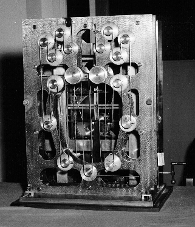

# Fourier transforms

In high school, you learned about *polynomials*, functions of the form

$$f(x) \equiv a + b x + c  x^2 + d x^3  \ldots$$
Perhaps, having been  introduced  to the idea  of  linear  combinations of functions, you can see $f(x)$ as a linear combination  of  power-law  functions:  $x^0$ and $x^1$ and $x^2$  and so on. These are sometimes called *monomials* (where *mono* means "one" and *poly*  means "many").  The monomials are a *basis set* of functions, essentially the building blocks of polynomials.

Historically, these have been extremely important in the development of mathematics, and these  were fundamental  tools  available to Newton and the users of calculus in the 18th century. They are still a staple of calculus curricula world  wide.

In the early 1800s, there was a radical development.  French mathematician Jean-Baptiste Joseph Fourier (1768-1830), studying the propagation of heat in metal bars, introduced a new set of building-block  functions, the familiar sine functions. 

```{r echo=FALSE, out-width: "25%",  fig.show='hold'}
slice_plot(sin(pi*x) ~ x, domain(x = c(-1,  1)))
slice_plot(cos(pi*x) ~ x, domain(x = c(-1,  1)))
slice_plot(sin(2*pi*x) ~ x, domain(x = c(-1,  1)))
slice_plot(cos(2*pi*x) ~ x, domain(x = c(-1,  1)))
slice_plot(sin(3*pi*x) ~ x, domain(x = c(-1,  1)))
slice_plot(cos(3*pi*x) ~ x, domain(x = c(-1,  1)))
slice_plot(sin(4*pi*x) ~ x, domain(x = c(-1,  1)))
slice_plot(cos(4*pi*x) ~ x, domain(x = c(-1,  1)))
slice_plot(sin(5*pi*x) ~ x, domain(x = c(-1,  1)))
slice_plot(cos(5*pi*x) ~ x, domain(x = c(-1,  1)))
slice_plot(sin(6*pi*x) ~ x, domain(x = c(-1,  1)))
slice_plot(1 ~ x, domain(x = c(-1,  1)))
```

In Fourier's honor, the use of the sine-wave basis set is called a *Fourier Transform*. The Fourier basis set is fundamental in many areas of science and engineering. Our purpose here is to show you that linear combinations  of the sine-wave basis provide a valid way to approximate many types of non-sine functions. We will not focus on applications,  since you  will  see so many of those in your later courses.

In recent decades, there have been remarkable developments  in creating  new basis sets for applications such as sound and image compression, approximating smooth functions, etc. You may have  heard  the names  of some  of them,  e.g.  JPEG, wavelets, splines.

Our objective in this Daily Digital  is merely  to de-mystify some of the most  important techniques in science so that,  when  you encounter them  later, you will understand better that their purpose is to approximate functions by a linear combination of simple building blocks.

## Ocean Tides

We're going to start to construct a simple theory of ocean tides. Let's start with some data, several days' tides in Providence, Rhode Island in 2010. The tide `level` is in meters.

```{r}
gf_point(level ~ date_time, data = RI_tide)
```

Look at the graph and pull out some patterns, either regular or irregular.

> Question: *Describe briefly some patterns that you see in the tide data.*

Instead of using the `date_time` variable, we'll use `hour`, which is a simple numerical variable giving the time in hours since the start of April 2010 that the `level` measurement was made. The `hour` variable works better for making model functions.

The next code box contains the basic commands you will be using. You'll see similar code boxes throughout this Daily Digital, each with some refinement in the development of the tide theory.

```{r}
model <- makeFun(
  lm(level ~ fourier_M(hour, 1, fperiod = 24), data = RI_tide)
)
gf_point(level ~ hour, data = RI_tide) %>%
  slice_plot(model(hour) ~ hour, color = "blue", npts = 500) 
```

> Question: *The blue curve shows the sinusoid model fitted to the data. Do you think this is a good model? Explain why or why not, giving some detail about the match or mis-match of the data to the model.*

Now to explain the code being used. There are two expressions. Lines 1-3 construct a model using linear combinations of sines and cosines. Lines 4 and 5 plot out the data and the model respectively.

Some of the commands in the code box will be familiar to you: `makeFun()`, `gf_point()`, `slice_plot()`.

What will be *unfamiliar* are the two functions `lm()` and `fourier_M()`.

- `fourier_M()` generates a set of vectors from the Fourier basis. 
    i. The first argument is the input values at which to evaluate the basis function. 
    ii. The second argument is how many sine/cosine pairs from the basis to generate.
    iii. The third argument is the *fundamental period* of the Fourier basis. We set this to 24 hours.
    
- `lm()` is the workhorse of modeling with linear combinations. It takes as input a tilde expression. The output variable is on the left side of the tilde. On the right side is a list of matrices (separated by `+`) whose vectors we want to include in the linear combination. 

Let's play around a bit with `fourier_M()`. The next code block shows a simple use of `fourier_M()`: for $t = 1$ to $24$ (hours), we are generating the first sine/cosine pair in the Fourier basis.

```{r}
fourier_M(1:24, 1, fperiod = 24)
```


```{r daily-digital-19-TF1, echo=FALSE}
askMC(
  prompt = "True or False: In the output from `fourier_M(1:24, 1, fperiod = 24)`, the first column is the cosine member of the pair and the second is the sine member.",
  "True" = "Remember, at input 0, cosine produces an output of 1.", 
  "+False+",
  random_answer_order = FALSE
  )
```


```{r daily-digital-19-TF2, echo=FALSE}
askMC(
  prompt = "True or False: The period of the sinusoid is the same in both columns of the output of `fourier_M(1:24, 1, fperiod=24)`.",
  "+True+", "False" = "The basis functions come in pairs: a sine and a cosine of each period." ,
  random_answer_order = FALSE
)
```

### The functions, continuously

The `fourier_M()` function is designed to work with the `lm()` linear-combination model-making function.  But for *looking* at the functions, it's convenient to use `fourier_set()`. Instead of generating a set of numerical vectors, `fourier_set()` creates a set of functions that can be graphed in the usual way.  The following code box shows the first Fourier pair. `F_funs` is a function that takes two arguments: the first is the input value; the second is the index of the function -- equivalent to  the column number in the output of $fourier_M()$. So with `fourier_set()`,  we can easily  graph the functions corresponding  to the various columns of  `fourier_M()`. 

```{r}
F_funs <- fourier_set(1, left = 0, right = 24)
slice_plot(F_funs(t, 1) ~ t, domain(t=c(0, 24))) %>%
  slice_plot(F_funs(t, 2) ~ t, color = "blue")
```

The functions in the first pair have the *fundamental* period of the Fourier basis. The next pair have a period *half* as long, the  pair after that have a period one-third as long, and so on. These are called *harmonics* of the fundamental. In music, the first harmonic is one octave higher than the fundamental, the second is two octaves higher, and so on.

In the code box, change the first argument to  `fourier_set()` to generate the fundamental pair, and the pairs for some higher harmonics. For instance, setting the first argument to 5 will generate the fundamental plus 4 harmonics.

Modify the code to generate the fundamental  pair plus 3 more pairs. Then plot out the cosine member of all four pairs (i.e. indices 2, 4, 6, and 8). Use different colors for each one so that you can keep  track of which is which.

```{r daily-digital-19-QA1, echo=FALSE}
askMC(
  prompt = " In the 24 hours of the domain, how many cycles are there of the fundamental (index 2)?",
  "+1+", 2, 3, 4, 5, 6, 7, 8,
  random_answer_order = FALSE
)
```

```{r daily-digital-19-QA2, echo=FALSE}
askMC(
  prompt = " In the 24 hours of the domain, how many cycles are there of the first harmonic (index 4)?",
  1, "+2+", 3, 4, 5, 6, 7, 8,
  random_answer_order = FALSE
)
```

```{r daily-digital-19-QA3, echo=FALSE}
askMC(
  prompt = " In the 24 hours of the domain, how many cycles are there of the second harmonic (index 6)?",
  1, "2", "+3+", 4, 5, 6, 7, 8,
  random_answer_order = FALSE
)
```

```{r daily-digital-19-QA4, echo=FALSE}
askMC(
  prompt = " In the 24 hours of the domain, how many cycles are there of the third harmonic (index 8)?",
1, "2", "3", "+4+", 5, 6, 7, 8,
  random_answer_order = FALSE
)
```

The next code box calculates the linear combination of the sines and cosines in the fundamental and first three harmonics of the 24 hour period.

```{r}
model <- makeFun(
  lm(level ~ fourier_M(hour, 4, fperiod = 24.83), data = RI_tide)
)
gf_point(level ~ hour, data = RI_tide, alpha = 0.05) %>%
  slice_plot(model(hour) ~ hour, color = "blue", npts = 500) 
```

Perhaps you can see in the plot of the period 24-hour model a drift between the model and the actual tide data. There's a good reason for  that. 24 hours describes the period of the rotation  of  the Earth  with respect  to  the Sun.  But it is the Moon that is mostly responsible for tidal oscillations. The  length of the "day"  with respect to  the  Moon is a little longer: 24.83 hours.

Change the `fperiod` argument in `fourier_M()` to 24.83 hours.

> QUESTION: *Describe what in the graph shows that the `fperiod = 24.83` hour model is superior to the `fperiod = 24` hour model.*

QUESTION: *Describe what in the tidal data the `fperiod = 24.83` hour model doesn't capture.*

## The Sun **and** the Moon

While the Moon is the primary influence in shaping the  tides, the Sun also plays a role. The Sun's role is particularly evident  near hide and low tide.

With the technique of linear combinations, it's easy enough to add in a solar periodicity to the tides. That's done in the next code box. You can  see that  the  model incorporates 4 pairs for the Moon period and another 4 pairs for the Sun period.

```{r}
model <- makeFun(
  lm(level ~ fourier_M(hour, 4, fperiod = 24.83) * fourier_M(hour, 4, fperiod = 24), data = RI_tide)
)
gf_point(level ~ hour, data = RI_tide, alpha = 0.05) %>%
  slice_plot(model(hour) ~ hour, color = "blue", npts = 500) 
```
Adding in the Sun's influence to that of the Moon improves the model a bit. But there are still clear deviations between the model and the data.

It's tempting to  look for additional planets as the explanation for shortcomings of the Moon + Sun model. Let's show now that any such  planetary influences are trivial. We'll  do this  by incorporating in to the model a new  phenomenon. It turns out that the Moon's  and Sun's influences *interact*. This  is just to  say  that  the  Sun  can  have greater or lesser influence depending on  the  depth of the tide, which is primarily set by the Moon.  The interactions create new functions that look like the *product* of one sinusoidal with another, for instance,  $sin(2\pi 2 t/24.83) \times sin(2\pi 2 t/24)$,  which is the interaction of the first harmonic of the Moon's period with  the first harmonic of the Sun's period.

Interactions between model components are so important for modeling in general, that `lm()` has a special,  simple notation that means, "and include the interactions." Simply change the `+` in  the tilde expression for the model with  a `*`.  The effect will be to move from having 8 pairs of sines and cosines (four for the Moon and four for the Sun) to having 80 functions which can be combined linearly.

> QUESTION: *Change the `+` in the tilde expression for the model to `*`. Describe what features of the data that were not accounted for by the  previous models are now captured by the model with interactions.*

## Tide prediction

The tide predictions made by the US National Oceanic and Atmospheric Administration are based on  the same sort of linear combination of sinusoids  presented here. Tides differ by location and are influenced by geography both large (continents) and small (bays). So a custom prediction must be made for each location for which a prediction is desired (harbors, beaches, etc).  The overall scheme for doing this involves the linear combination of sinusoids of specific periods.  Often, dozens of different periods are included. Using these periods, past tidal records are examined using essentially the same method we've done here. The result is the coefficients for the linear combinations. To illustrate, here is the [NOAA table for Anchorage, Alaska](https://tidesandcurrents.noaa.gov/harcon.html?id=9455920) which  lists 120 different periods.

The work that we did with `lm()`,  figuring out the  best linear combination of  the sinusoids, is called "harmonic analysis." Before the  1950s and the advent of electronic computers, the work had to  be done by large analog computers involving rollers on  rotating disks and might take weeks of effort.

Once the coefficients are known,  however,  generating  a  model output for any given  time  is  straightforward. We can do  it simply by evaluating the model function. Before electronic computers, this  work was done with analog "harmonic  synthesizers."  The picture shows the harmonic synthesizer built by the U.S. Coast and Geodetic Survey in 1882. This machine and its successors were used until 1966, when they were replaced by mainframe computers.

```{r echo=FALSE, out-width: "50%", fig-align: "center"}

```


The machine sums 19 sinusoids. Seventeen of these are visible in the  picture, each  is a wheel spinning at a specific frequency. Another wheel is positioned off-center on each major wheel according to the amplitude and phase of the sinusoid.

Accurate prediction of tides is essential to amphibious landings. Well before the D-Day invasion in 1944, British surveillance teams were sent secretly to  the Normandy beaches to make careful shallow-water measurements of tide and wave levels. These were then subjected to harmonic analysis (the work we did with `lm()`) and then harmonic synthesis used  to generate the predictions. A general theory held that the best time to attack was at high tide, so the Germans built coastal obstacles that would be just  underwater at high tide to rip out the bottoms of landing craft. The allies were aware of these defenses and so arranged to land at low tide. This required soldiers to cover a  much longer  run  of beach, but also provided the opportunity to spot and demolish the beach  obstacles so that larger craft could  be used as the tide rose. The date of the invasion  was set for a confluence  of low tide at dawn and a late-rising moon.

## Spectroscopy

The prism as a fourier analyzer.


## Exercises

* Show  that the  Legendre polynomials of different degree are orthogonal  to one another.
* Show  that  the  length of a legendre polynomial is 1.  

## Outline

a. Polynomials as transforms: read off the coefficients to represent the function
b. Functions can be represented as vectors
    i. "Time base"
    ii. Evaluate function at time base
c. Polynomial transform as target problem
    i. extreme sensitivity to small changes in $\vec{b}$
        a. highly collinear: the vectors say only two things:
            i. both arms up.
            i. one arm up, one arm down.
    ii. extrapolate poorly
    iii. But low-order (up to quadratic) is OK.
        i. three shapes of function: flat, arms both up, one arm up and one down
d. Transform into the frequency domain
    i. orthogonal sines and cosines
    ii. sines and cosines are important models of system behavior,
        i. pendula of different lengths
        ii. whistling
        iii. transmission by waves/modulation


