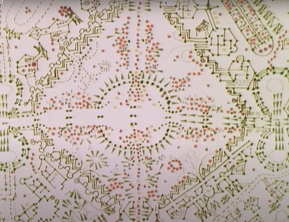

# Vectors {#sec-chap-vectors}

```{r include=FALSE}
source("../starter.R")
```

```{r include=FALSE}
library(Znotes)
knitr::knit_hooks$set(source = function(x, options) {
    if ("compact" %in% names(options)) {
     paste0(c('<div class="column-left compact">\n',
           paste0(c("```r",
                    gsub("\n", "", x),
                    "```", collapse="\n")), '\n</div>'),
           collapse="\n")
    } else {
        paste(c("\n```r", x, "```\n\n"), collapse = "\n")
    }
})
knitr::knit_hooks$set(output = function(x, options) {
    cat(str(x))
    if("compact" %in% names(options)) {
      paste0(
         c('<div class="column-right compact">', 
         paste0(c("```", x, "```", collapse="\n")),
         '\n</div>\n\n'), collapse = '\n')
    } else {
        paste(c("```", x, "```"), collapse = "\n")
    }
})
```


Until now, our encounter with functions has been via formulas relating inputs to an output. Now we turn to a different way of representing functions: columns of numbers that we call ***vectors***. The mathematical notation for the name of a vector shows the name surmounted with an arrow, for instance, $\vec{u}$.

The columns-of-numbers framework is central to technical work in many fields. For instance, an algorithm in this framework was the spark that ignited the modern era of search engines. The name given to it by mathematicians is ***linear algebra***, although only the word "linear" conveys helpful information about the subject. (The physicists who developed the first workable quantum theory called it ***matrix mechanics***. A matrix is a collection of vectors.) 

Although the words "algebra" and "quantum" may suggest that conceptual difficulties are in store, human intuition is well suited to establishing an understanding. In this book, we use two intuitive formats to introduce linear algebra: (1) geometric and visual and (2) simple arithmetic.

## Length & direction

A vector is a mathematical idea deeply rooted in everyday physical experience. Geometrically, a vector is simply an object consisting only of  ***length*** and ***direction***. 

A pencil is a physical metaphor for a vector, but a pencil has other non-vector qualities such as diameter, color, and an eraser. And, being a physical object, a pencil has a *position* in space. 

```{r echo=FALSE}
#| label: fig-two-vectors-pencils 
#| fig-cap: "Three pencils, but just two vectors. The yellow and blue pencils have the same length and direction, so they are the same vector. A pencil has a position, but vectors do not. The green pencil shares the same direction but has a different length, so it differs from the blue/yellow vector." 
#| column: margin
knitr::include_graphics("www/pencils/two-vectors.png")
```

A line segment has an orientation but no forward or backward direction. In contrast, a vector has a unique direction: like an arrow, one end is the ***tip*** and the other the ***tail***. In the pencil metaphor, the writing end is the tip; the eraser is the tail.

```{r echo=FALSE}
#| label: fig-opposing-pencils  
#| fig-cap: "Two different vectors. They have the same length and are parallel but point in opposite directions." 
#| column: margin
knitr::include_graphics("www/pencils/opposing-vectors.png")
```

Vectors are always ***embedded*** in a ***vector space***. Our physical stand-ins for vectors, the pencils, were photographed on a tabletop: a two-dimensional space. Naturally, pencils are embedded in everyday three-dimensional space. (The tabletop is a kind of two-dimensional ***subspace*** of three-dimensional space.)

Vectors embedded in three-dimensional space are central to physics and engineering. Quantities such as force, acceleration, and velocity are not simple numerical quantities but vectors with ***magnitude*** (that is, length) and direction. For instance, the statement, "The plane's velocity is 450 miles per hour to the north-north-west," is perfectly intelligible to most people, describing magnitude and direction. Note that the plane's velocity vector does not specify the plane's location; vectors have only the two qualities of magnitude and direction. 

The gradients that we studied with partial differentiation (Chapter `r Chaps$gradient`) are vectors. A gradient's direction points directly uphill; its magnitude tells how steep the hill is. 

Vectors often represent a change in position, that is, a ***step*** or ***displacement*** in the sense of "step to the left" or "step forward."  As we will see, constructing instructions for reaching a target is a standard mathematical task. Such instructions have a form like, "take three and a half steps along the green vector, then turn and take two steps backward along the yellow vector." An individual vector describes a step of a specific length in a particular direction. 

Vectors are a practical tool to keep track of relative motion. For instance, consider the problem of finding an aircraft heading and speed to intercept another plane that is also moving. The US Navy training movie from the 1950s shows how to perform such calculations with paper and pencil.

::: {.column-margin}
`r if (knitr::is_html_output()) '<iframe width="300" height="169" src="https://www.youtube.com/embed/j197C0XuNUA?start=20" title="YouTube video player" frameborder="0" allow="accelerometer; autoplay; clipboard-write; encrypted-media; gyroscope; picture-in-picture" allowfullscreen></iframe>'`
:::


```{r echo=FALSE, eval=knitr::is_latex_output()}
#| fig-cap: "A 1958 US Navy training film on calculations with relative motion. Available at <https://youtu.be/j197C0XuNUA> "
#| column: margin

```


Nowadays, the computer performs such calculations. On the computer, vectors are represented not by pencils (!) but by columns of numbers. For instance, two numbers will do for a vector embedded in two-dimensional space and three for a vector embedded in three-dimensional space. From these numbers, simple arithmetic can produce the vector magnitude and direction. 

Representing a vector as a set of numbers requires the imposition of a framework: a coordinate system. In @fig-vector-graph-paper, the vector (shown by the green pencil) lies in a two-dimensional coordinate system. The two coordinates assigned to the vector are the difference between the tip and the tail along each coordinate direction. In the figure, there are 20 units horizontally and 16 units vertically, so the vector is $(20, 16)$. 

```{r echo=FALSE}
#| label: fig-vector-graph-paper
#| fig-cap: "Representing a vector as a set of numbers requires reference to a coordinate system, shown here as graph paper." 
#| column: margin
knitr::include_graphics("www/pencils/graph-paper.png")
```

By convention, when we write a vector as a set of coordinate numbers, we write the numbers in a ***column***. For instance, the vector in @fig-vector-graph-paper, which we will call $\vec{green}$,  is written numerically as:

$$\vec{green} \equiv \left[\begin{array}{c}20\\16\end{array}\right]$$
In more advanced linear algebra, the distinction between a ***column vector*** (like $\vec{green}$) and a ***row vector*** (like $\left[20 \ 16\right]$) is important. For our purposes in this block, we need only column vectors. 

::: {.rmosaic data-latex=""}
Construct column vectors with the `rbind()` function, as in

```{r}
green <- rbind(20, 16)
```

Commas separate the arguments---the coordinate numbers---in the same way as any other R function.

Later in this block, we will use data frames to define vectors. We will introduce the R syntax for that when we need it. 
:::

In physics and engineering, vectors describe positions, velocities, acceleration, forces, momentum, and other functions of time or space. In mathematical notation, a vector-valued function can be written $\vec{v}(t)$. It is common to perform calculus operations such differentiation, writing it as $\partial_t \vec{v}(t)$. It is sometimes easier to grasp a vector-valued function by writing it as a column of scalar-valued functions: $$\vec{v}(t) = \left[\begin{array}{c}v_x(t)\\v_y(t)\\v_z(t)\end{array}\right]$$ where the $x$, $y$, and $z$ refer to the axes of the coordinate system. 

## The n^th^ dimension

In many applications, especially those involving data, vectors have more than three components. Indeed, you will soon be working with vectors with hundreds of components. Services like Google search rely on vector calculations with millions of vectors, each having millions of components. 

Living as we do in a palpably three-dimensional space and with senses and brains evolved for use in three dimensions, it is hard and maybe even impossible to grasp high-dimensional spaces.

A lovely 1884 book, *[Flatland](https://en.wikipedia.org/wiki/Flatland)*  features the inhabitants of a two-dimensional world. The central character in the story, named Square, receives a visitor, Sphere. Sphere is from the three-dimensional world which embeds Flatland. Only with difficulty can Square assemble a conception of the totality of Sphere from the appearing, growing, and vanishing of Sphere's intersection with the flat world. (Among other things, Flatland is a parody of humanity's rigid thinking: Square's attempt to convince Sphere that his three-dimensional world might be embedded in a four-dimensional one leads to rejection and disgrace. Sphere thinks he knows everything.) 

```{r echo=FALSE, eval=knitr::is_latex_output()}
#| label: fig-flatland-video
#| column: margin
#| fig-cap: "A still from the movie *Flatland*. Go to <https://youtu.be/yBbZmwROv84> to see the movie."

```

::: {.column-margin}
```{asis eval=knitr::is_html_output()}
<iframe width="305" height="171" src="https://www.youtube.com/embed/yBbZmwROv84" title="YouTube video player" frameborder="0" allow="accelerometer; autoplay; clipboard-write; encrypted-media; gyroscope; picture-in-picture" allowfullscreen></iframe>
```
:::

To use high-dimensional vectors, represent them as a column of numbers. 

$$\left[\begin{array}{r}6.4\\3.0\\-2.5\\17.3\end{array}\right]\ \ \ \left[\begin{array}{r}-14.2\\-6.9\\18.0\\1.5\\-0.3\end{array}\right]\ \ \ \left[\begin{array}{r}5.3\\-9.6\\84.1\\5.7\\-11.3\\4.8\end{array}\right]\ \ \ \cdots\ \ \ \left.\left[\begin{array}{r}7.2\\-4.4\\0.6\\-4.1\\4.7\\\vdots\ \ \\-7.3\\8.3\end{array}\right]\right\} n$$

Sensible people may consider it mathematical ostentation to promote simple columns of numbers into vectors in high-dimensional space. But doing so lets us draw the analogy between data and familiar geometrical concepts: lengths, angles, alignment, etc. Operations that are mysterious as a long sequence of arithmetic steps become concrete when seen as geometry.

There is nothing science-fiction-like about so-called "high-dimensional" spaces; they don't correspond to a physical place. Nevertheless, many-component vectors often appear in advanced physics. Famously, the Theory of Relativity involves 4-dimensional space-time. The vector representing the state of an ordinary particle contains the position and velocity, $(x, y, z, v_x, v_y, v_z)$, as well as angular velocity: nine dimensions. In statistics, engineering, and statistical mechanics, the term ***degrees of freedom*** is the preferred alternative to "dimension." Another example: computer-controlled machine tools have 5 degrees of freedom (or more). There is a cutting tool with an $x, y, z$ position and orientation. (If ever you start to freak out about the idea of a 10-dimensional space, close your eyes and remember that this is only shorthand for the set of arrays with ten elements.) 

## Geometry & arithmetic

Three mathematical tasks are essential to working with vectors:

1. Measure the ***length*** of a vector.
2. Measure the ***angle*** between two vectors.
3. Create a new vector by ***scaling*** a vector. Scaling makes the new vector longer or shorter and may reverse the orientation.

We have simple geometrical tools for undertaking these tasks: a ***ruler*** measures length, and a ***protractor*** measures angles. Along with pen and paper, these tools let us draw new vectors of any specified length.

The geometrical perspective is helpful for many purposes, but often we need to work with vectors using computers. For this, we use the numerical representation of vectors. 

This section introduces the arithmetic of vectors. With this arithmetic in hand, we can carry out the above three tasks (and more!) on vectors that consist of a column of numbers. And while we can't import a ruler, protractor, or paper into high-dimensional space, arithmetic is easy to do, regardless of dimension.

To ***scale a vector*** $\vec{w}$ means more or less to change the vector's length. A good mental image for scaling sees the vector as a ***step*** or ***displacement*** in the direction of $\vec{w}$. Scaling means to go on a simple walk, taking one step after the other in the same direction as the $\vec{w}$. We write a scaled vector by placing a number in front of the name of the vector. $3 \vec{w}$ is a short walk of three steps; $117 \vec{w}$ is a considerably longer walk; $-5 \vec{w}$ means to take five steps backward. You can also take fraction steps: $0.5 \vec{w}$ is half a step, $19.3 \vec{w}$ means to take 19 steps followed by a 30% step. Scaling a vector by $-1$ means flipping the vector tip-for-tail; this does not change the length, just the orientation.

Arithmetically, scaling a vector is accomplished simply by multiplying each of the vector's components by the same number. Two illustrate, consider vectors $\vec{v}$ and $\vec{w}$, each with $n$ components. (We use $\vdots$ to indicate components we haven't bothered to write out.)

$$\vec{v} \equiv \left[\begin{array}{r}6\\2\\-4\\\vdots\\1\\8\end{array}\right]\ \ \ \ \ \ \ \ \ \ \ \ \vec{w} \equiv \left[\begin{array}{r}-3\\1\\-5\\\vdots\\2\\5\end{array}\right]$$
To scale a vector by 3 is accomplished by multiplying each component by 3

$$3\, \vec{v} = 3\left[\begin{array}{r}6\\2\\-4\\\vdots\\1\\8\end{array}\right] = \left[\begin{array}{r}18\\6\\-12\\\vdots\\3\\24\end{array}\right]$$
Vector scaling is perfectly ordinary multiplication applied component by component, that is, *** componentwise ***. 

Scaling involves a number (the "scalar") and a single vector. Other sorts of multiplication involve two or more vectors.

The ***dot product*** is one sort of multiplication of one vector with another. The dot product between $\vec{v}$ and $\vec{w}$ is written $$\vec{v} \bullet \vec{w}$$. 

The arithmetic of the dot product involves two steps:

i. Multiply the two vectors componentwise. For instance:
$$\underset{\Large \vec{v}}{\left[\begin{array}{r}6\\2\\-4\\\vdots\\1\\8\end{array}\right]}\  \underset{\Large \vec{w}}{\left[\begin{array}{r}-3\\1\\-5\\\vdots\\2\\5\end{array}\right]} = \left[\begin{array}{r}-18\\2\\20\\\vdots\\2\\40 \end{array}\right]$$
ii. Sum the elements in the componentwise product. For the component-wise product of $\vec{v}$ and $\vec{w}$, this will be $-18 + 2 + 20 + \cdots +2 + 40$. The resulting sum is an ordinary scalar quantity; a dot product takes two vectors as inputs and produces a scalar as an output.

::: {.rmosaic data-latex=""}
R/mosaic provides a beginner-friendly function for computing a dot product. To mimic the use of the dot, as in $\vec{v} \bullet \vec{w}$, the function will be invoked using ***infix notation***. You have a lot of infix notation experience, even if you have never heard the term. Some examples:

```
3 + 2       7 / 4      6 - 2      9 * 3     2 ^ 4
```

Infix notation is distinct from the ***functional notation*** that you are also familiar with, for instance `sin(2)` or `makeFun(x^2 ~ x)`.

You can, if you like, invoke the `+`, `-`, `*`, `/`, and `^` operations using ***functional*** notation. Nobody does this because the commands are so ugly:

```{r compact=TRUE}
`+`(3, 2)
`/`(7, 4)
`-`(6, 2)
`*`(9, 3)
`^`(2, 4)
```

&nbsp;

The R language makes it possible to define new infix operators, but there is a catch. The new operators must always have a name that begins and ends with the `%` symbol, for example, `%>%` or `%*%` or `%dot%`. 

Here is an example of using `%dot%` to calculate the dot product of two vectors embedded in five-dimensional space:

```{r}
a <- rbind(1, 2, 3, 5, 8, 13)
b <- rbind(1, 4, 2, 3, 2, -1)
a %dot% b
```


The vectors combined with `%dot%` must both have the same number of elements. Otherwise, an error message will result, as here:

```{r error=TRUE}
rbind(2, 1) %dot% rbind(3, 4, 5)
```

:::

::: {.takenote data-latex=""}
We have not yet shown you the use of the dot product in applications. At this point, remember that a ***dot product*** is not ordinary multiplication but a two-stage operation of pairwise multiplication followed by summation. 
:::

## Vector lengths {#sec-vector-length}

The arithmetic used to calculate the length of a vector is based on the Pythagorean theorem. For a vector $\vec{u} = \left[\begin{array}{c}4\\3\end{array}\right]$ the vector is the hypotenuse of a right triangle with legs of length 4 and 3 respectively. Therefore, $$\|\vec{u}\| = \sqrt{4^2 + 3^2} = 5\ .$$
For vectors with more than two components, follow the same pattern: sum the squares of the components, then take the square root.

Compute the length of a vector $\vec{u}$ using the dot product:
$$\|\vec{u}\| = \sqrt{\strut\vec{u} \bullet \vec{u}}\ .$$
Although length has an obvious physical interpretation, in many areas of science, including statistics and quantum physics, the ***square length*** is a more fundamental quantity. The square length of $\vec{u}$ is simply $\|\vec{u}\|^2 = \vec{u}\bullet \vec{u}$.

::: {.example data-latex=""}
Consider the two vectors 
$$\vec{u} \equiv \left(\begin{array}{c}3\\4\end{array}\right) \  \  \ \mbox{and}  \ \ \ \vec{w} \equiv \left(\begin{array}{c}1\\1\\1\\1\end{array}\right)
$$

The length of $\vec{u}$ is $|| \vec{u} || = \sqrt{\strut 3^2 + 4^2} = \sqrt{\strut 25} = 5$.

The length of $\vec{w}$ is $|| \vec{w} || = \sqrt{\strut 1^2 + 1^2 + 1^2 + 1^2} = \sqrt{\strut 4} = 2$.
:::

::: {.callout-note icon=false data-latex=""} 
## Math in the World: Statistical modeling

In statistics, the many applications of linear algebra often involve a simple constant vector, which we will write $\vec{1}$. It is simply a column vector of 1s, 
$$\vec{1} \equiv \left[\begin{array}{c}1\\1\\1\\\vdots\\1\\1\\ \end{array}\right]\ .$$
Common statistical calculations can be expressed compactly in vector notation. For example, if $\vec{x}$ is an $n$-dimensional vector, then the ***mean*** of the components of $\vec{x}$, which is often written $\bar{x}$, is 
$$\bar{x} \equiv \frac{1}{n}\  \vec{x} \bullet \vec{1}\ .$$ The symbol $\bar{}$ is pronounced "bar", and $\bar{x}$ is pronounced "x-bar.".

Another commonly used statistic is the ***variance*** of the components of a vector $\vec{x}$. Calculating the variance is more complicated than the mean:
$$\text{var}(x) \equiv \frac{1}{n-1}\  (\vec{x} - \bar{x}) \bullet (\vec{x} - \bar{x})\ .$$
The quantity $\vec{x} - \bar{x}$ is an example of ***scalar*** subtraction, which is done on a component-wise basis. For instance, with $$\vec{x} = \left[\begin{array}{r}1\\2\\3\\4\\\end{array}\right]$$ then $\bar{x} = 2.5$. This being the case, $$\vec{x} - \bar{x} = \left[\begin{array}{c}-1.5\\-0.5\\\ 0.5\\\ 1.5\\\end{array}\right]\ ,$$
with the variance of $\vec{x}$ being $$\frac{1}{4-1} \left[\begin{array}{r}-1.5\\-0.5\\0.5\\1.5\\\end{array}\right] \bullet \left[\begin{array}{r}-1.5\\-0.5\\0.5\\1.5\\\end{array}\right] = \frac{5}{3}\ .$$
:::

## Angles {#sec-angles-dot-product}

Any two vectors of the same dimension have an ***angle*** between them. Vectors have only two properties: length and direction. To find the angle between two vectors, pick up one vector and relocate its "tail" to meet the tail of the other vector. 

Measure the angle between two vectors the short way round: between 0 and 180 degrees. Any larger angle, say 260 degrees, will be identified with its circular complement: 100 degrees is the complement of a 260-degree angle.

In 2- and 3-dimensional spaces, we can measure the angle between two vectors using a protractor: arrange the two vectors tail to tail, align the baseline of the protractor with one of the vectors and read off the angle marked by the second vector.

It is also possible to measure the angle using arithmetic. Suppose we have vectors $\vec{v}$ and $\vec{w}$ embedded in the same dimensional space. That is, $\vec{v}$ and $\vec{w}$ have the same number of components:

$$\vec{v} = \left[\begin{array}{c}v_1\\v_2\\\vdots\\v_n\\\end{array}\right]\ \ \ \text{and}\ \ \ \vec{w} = \left[\begin{array}{c}w_1\\w_2\\\vdots\\w_n\\\end{array}\right]\ ,$$


Using the dot-product and length notation, we can write the formula for the **cosine of the angle** between two vectors as 
$$\cos(\theta) \equiv \frac{\vec{v}\cdot\vec{w}}{\|\vec{v}\|\ \|\vec{w}\|}\ .$$

::: {.takenote data-latex=""}
Remember that the dot-product-based formula above gives the **cosine of the angle** between the two vectors. It turns out that in many applications, cosine is what's needed.
If you insist on knowing the angle $\theta$ rather than $\cos(\theta)$, the trigonometric function $\arccos()$ will do the job. For instance, if $\theta$ is such that $\cos(\theta) = 0.6$, compute the angle in degrees with
```{r}
acos(0.6)*180/pi
```

The trigonometric functions in R (and in most other languages) do calculations with angles in units of ***radians***. Multiplication by `180/pi` converts radians to degrees. 
@fig-cosine-conversion shows a graph of converting $\cos(\theta)$ to $\theta$ in degrees.

```{r echo=FALSE}
#| label: fig-cosine-conversion 
#| fig-cap: "The $\\arccos()$ function (`acos()` in R) converts $\\cos(\\theta)$ to $\\theta$." 
#| out-width: "60%" 
#| fig-align: "center"
slice_plot(180*acos(theta)/pi ~ theta, bounds(theta=-1:1), npts=300) %>%
    gf_labs(x="cos(theta)", y = "theta (degrees)") %>%
    gf_refine(scale_y_continuous(breaks=c(0,15, 30,45,60,75, 90,105, 120,135,150,165, 180)))
```
:::

::: {.callout-note icon=false data-latex=""} 
## Math in the World: "Correlation" is an angle

What does the angle $\theta$ between two vectors tell us?

The angle quantifies the alignment of the vectors. An angle of 0 tells us the vectors point in the same direction, and an angle of 180 degrees means that the vectors point in exactly opposing directions. Either of these---0 or 180 degrees---indicates that the two vectors are perfectly aligned. Such alignment means that appropriate scalar multiplication can make the two vectors equal. 

Angles such as 5 or 175 degrees indicate that the two vectors are mostly aligned but imperfectly. When the angle is 90 degrees---a right angle---the two vectors are perpendicular.

The vector alignment has an important meaning in terms of data. Suppose the two vectors are two columns in a data frame: two different variables. In statistics, the ***correlation coefficient***, denoted $r$, is a simple way to describe the relationship between two variables. A non-zero correlation indicates a connection between two variables. For instance, among children, height and age are correlated. Since height increases along with age (for children), the two variables are said to be ***positively correlated***. The largest possible correlation is $r=1$. 

A ***negative correlation*** means that one variable decreases as the other increases. Temperature and elevation are negatively correlated; temperature goes down as elevation goes up. The most negative possible correlation is $r=-1$.


A ***zero correlation*** indicates no simple (linear) relationship between the two variables. Zero correlation occurs when the variables are **orthogonal**, a term described in [@sec-orthogonality].

Seeing columns in a data frame as vectors, the correlation coefficient $r$ is exactly the cosine of the angle between the vectors. However, when Francis Galton invented the correlation coefficient in the 1880s, he did not describe it in these terms. Instead, he used arithmetic directly, producing formulas with which many generations of statistics students have struggled. Those students might have done better in statistics if $r$ had been called ***alignment*** and measured in degrees.
:::

## Orthogonality {#sec-orthogonality}

Two vectors are said to be ***orthogonal*** when the angle between them is 90 degrees. In everyday speech, we call a 90-degree angle a "right angle." The word "orthogonal" is a literal translation of "right angle." (The syllable "gon" indicates an angle, as in the five-angled pentagon or six-angled hexagon. "Ortho" means "right" or "correct," as in "orthodox" (right beliefs) or "orthodontics" (right teeth) or "orthopedic" (right feet).)

Two vectors are at right angles---we prefer "orthogonal" since "right" has many meanings not related to angles---when the dot product between them is zero.


::: {.eg}
::: {.example data-latex=""}

&nbsp;
:::


Find a vector that is orthogonal to $\left[\strut\begin{array}{r}1\\2\end{array}\right]$.

The arithmetic trick is to reverse the order of the components and put a minus sign in front of one of them, so $\left[\strut\begin{array}{r}-2\\1\end{array}\right]$.

We can confirm the orthogonality by calculating the dot product: $\left[\begin{array}{c}-2\\\ 1\end{array}\right] \cdot \left[\strut\begin{array}{r}1\\2\end{array}\right] = -2\times1 + 1 \times 2 = 0$.

In R, write this as

```{r}
u <- rbind( 1, 2)
v <- rbind(-2, 1)
u %dot% v
```
:::


::: {.eg}
::: {.example data-latex=""}

&nbsp;
:::

Find a vector orthogonal to $\left[\strut\begin{array}{r}1\\2\\3\end{array}\right]$.

We have a little more scope here. A simple approach is to insert a zero component in the new vector and then use the two-dimensional trick to fill in the remaining components.

For instance, starting with $\left[\strut\begin{array}{r}0\\\_\\ \_\end{array}\right]$ the only non-zero components of the dot product will involve the 2 and 3 of the original vector. So $\left[\strut\begin{array}{r}0\\ -3\\ 2\end{array}\right]$ is orthogonal. Or, if we start with $\left[\strut\begin{array}{r}\_\\0\\\_\end{array}\right]$ we would construct $\left[\strut\begin{array}{r}-3\\ 0\\ 1\end{array}\right]$. 
:::


## Exercises

`r insert_exercises("Linear-combinations", "vectors")`

