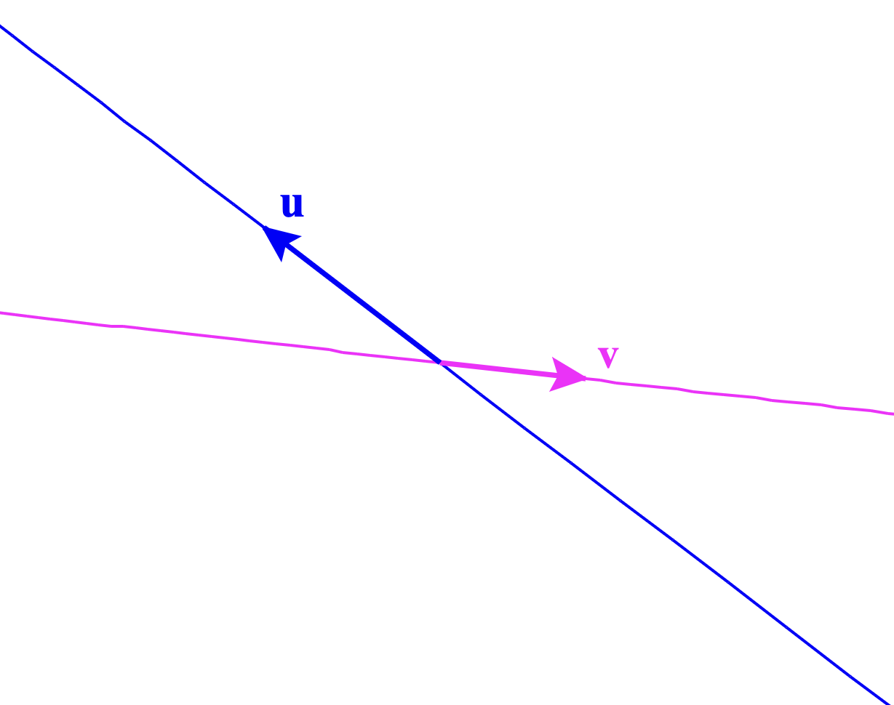
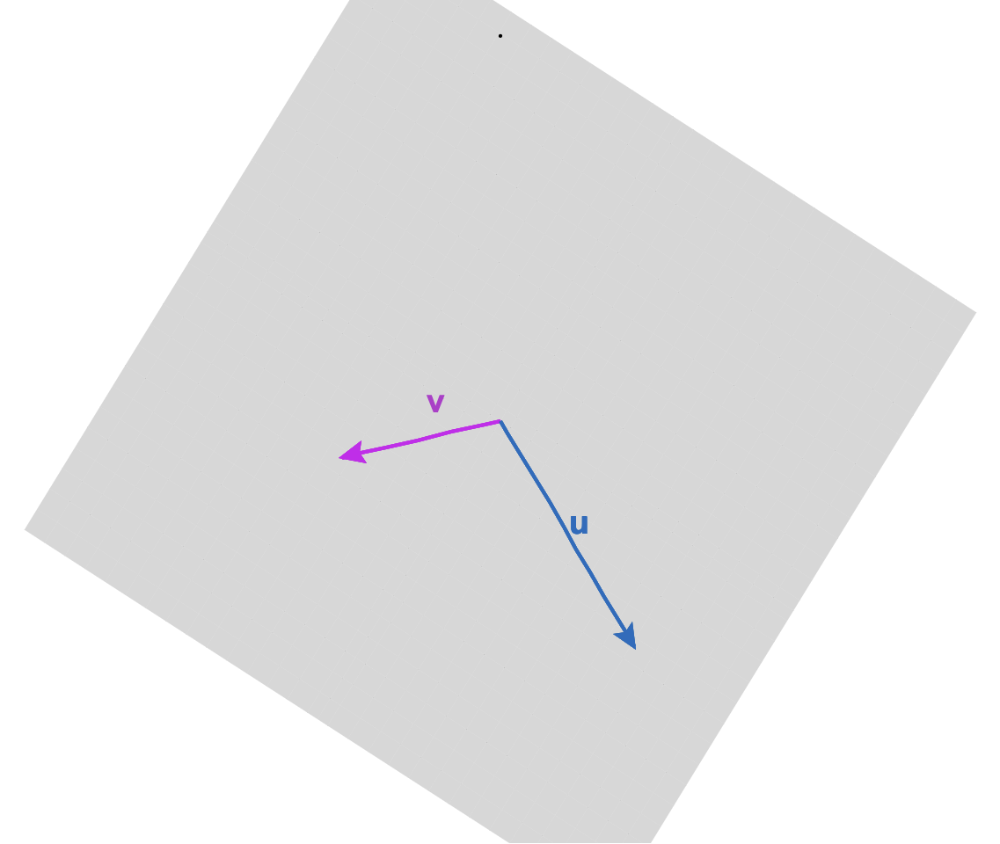

# Linear combinations of vectors {#sec-linear-combs-vectors}

```{r include=FALSE}
source("../starter.R")
```

A linear combination is a sum of basic elements, each of which has been ***scaled***. For instance, in Block 1 we looked at linear combinations of *functions* such as $$g(t) = A + B e^{kt}\ .$$ This combines the basic functions $\text{one}(t)$ and $e^{kt}$ scaled respectively by $A$ and $B$. 

Like functions, vectors can be scaled and added. In one sense, this is just a matter of arithmetic. However, new concepts become accessible using the geometrical interpretation of vectors. This chapter builds gradually to one such concept: "slices" of an embedding space called ***subspaces***. Many questions about constructing approximations---How good can the approximation be? How to make it better?---are clarified by seeing the possibilities for approximation as the elements of a subspace. 

## Scaling vectors

To scale a vector means to change its length without altering its direction. For instance, scaling by a negative number flips the vector tip-for-tail. @fig-scaling shows two vectors $\vec{v}$ and $\vec{w}$ together with several scaled versions.

```{r echo=FALSE}
#| label: fig-scaling
#| fig-cap: "Vectors $\\vec{v}$ and $\\vec{w}$ and some scaled versions of them."
Znotes::gvec(from=c(0,2), to=c(1/2, 1.5), color="magenta", label="W", where=0.5, nudge=0.2, flip=TRUE) %>%
  Znotes::gvec(from=c(0.8,1.8), to=c(1.8,0.8), color="magenta", label="2W", nudge=0.2, flip=FALSE) %>%
  Znotes::gvec(from=c(3,0.7), to=c(1.5,2.2), color="magenta", label="--3W", nudge= 0.2, flip=TRUE) %>%
  Znotes::gvec(from=c(3.5,1.2), to=c(3.75,0.95), color="magenta", label="0.5 W", nudge= 0.4, flip=TRUE) %>%
  Znotes::gvec(from=c(2,3.2), to=c(3,3.2), color="brown", label="V", nudge= 0.2, flip=TRUE) %>%
  Znotes::gvec(from=c(2,2.6), to=c(2.75,2.6), color="brown", label="0.75 V", nudge= 0.3, flip=FALSE) %>%
  Znotes::gvec(from=c(1,3.7), to=c(3,3.7), color="brown", label="2 V", nudge= 0.2, flip=TRUE) %>%
  Znotes::gvec(from=c(1.5,2.5), to=c(0,2.5), color="brown", label="-1.5 V", nudge= 0.2, flip=TRUE) %>%
  gf_refine(coord_fixed(xlim=c(0,4), ylim=c(0,4))) %>%
  Znotes::graph_paper(xticks=seq(0,4,by=0.25))
```

Arithmetically, scaling a vector is accomplished by multiplying each component of the vector by the scalar, e.g.

$$\vec{u} = \left[\begin{array}{r}1.5\\-1\end{array}\right]\ \ \ \ 2\vec{u} = \left[\begin{array}{r}3\\-2\end{array}\right]\ \ \ \ 
-\frac{1}{2}\vec{u} = \left[\begin{array}{r}-0.75\\0.5\end{array}\right]\ \ \ \ $$

Geometrically, however, a vector corresponds to one step in a journey. For example, a vector scaled by 2.5 is a journey of two-and-a-half steps; scaling by -10 means traveling backward ten steps.

The ***subspace*** associated with a single vector is the set of all possible journeys that scaling a vector can accomplish. Visually, this corresponds to all the points on an infinitely long line defined by two points: the tip and the tail of the vector. 

## Adding vectors

To add two vectors, place them tip to tail (without changing the direction). The sum is the new vector running from the tail of the first one to the tip of the second. (@fig-add-yellow-green)

```{r echo=FALSE}
#| label: fig-add-yellow-green
#| fig-align: "center" 
#| out-width: "50%"
#| fig-cap: "Adding two vectors, yellow and green, by placing them tail to tip. The result is the vector going from the tail of yellow to the tip of green. The blue vector shows this result."
knitr::include_graphics("www/pencils/addition.png")
```

Adding vectors in this way takes advantage of the rootlessness of a vector. So long as we keep the direction and length the same, we can move a vector to any convenient place. For adding vectors, the convenient arrangement is to place the tail of the second vector at the tip of the first. The result---the blue pencil in @fig-add-yellow-green---runs from the first (yellow) pencil's tail to the second (green) pencil's tip. 

Arithmetically, vector addition is simply a matter of applying addition component-by-component. For instance, consider adding two vectors $\vec{v}$ and $\vec{w}$:

$$\underbrace{\left[\begin{array}{r}1.5\\-1\\2\\6\end{array}\right]}_\vec{v} + \underbrace{\left[\begin{array}{r}2\\4\\-2\\-3.2\end{array}\right]}_\vec{w} = \underbrace{\left[\begin{array}{r}3.5\\3\\0\\2.8\end{array}\right]}_{\vec{v} + \vec{w}}$$

Adding vectors makes sense only when they inhabit the same embedding space. In other words, the vectors must have the same number of components.  

Arithmetic ***subtraction*** of one vector from another is a simple componentwise operation. For example:


$$\underbrace{\left[\begin{array}{r}1.5\\-1\\2\\6\end{array}\right]}_\vec{v} {\Large -} \underbrace{\left[\begin{array}{r}2\\4\\-2\\-3.2\end{array}\right]}_\vec{w} = \underbrace{\left[\begin{array}{r}-0.5\\-5\\4\\9.2\end{array}\right]}_{\vec{v} - \vec{w}}\ .$$

From a geometrical point of view, many people like to think of $\vec{v} - \vec{w}$ in terms of placing the two vectors **tail to tail** as in @fig-subtract-blue-from-yellow. Read the result as the vector running from the tip of $\vec{v}$ to the tip of $\vec{w}$. In @fig-subtract-blue-from-yellow, the yellow vector is $\vec{v}$ and the blue vector is $\vec{w}$. The result of the subtraction is the green vector.

```{r echo=FALSE} 
#| label: fig-subtract-blue-from-yellow 
#| fig-align: "center"
#| out-width: "50%" 
#| fig-cap: "Subtracting blue from yellow gives green."
knitr::include_graphics("www/pencils/subtraction.png")
```

## Linear combinations

Thinking of a scaled vector as a "step" of a given length in a given direction leads us to conceive of a linear combination of vectors as step-by-step instructions for a journey. A central use for the formalism of vectors is to guide our thinking and our algorithms for figuring out how best to get from one "place" to another. We have used quotation marks around "place" because we are not necessarily referring to a physical destination. We will get to what else we might mean by "place" later in this Block.

As a fanciful example of getting to a "place," consider a treasure hunt. Here are the instructions to get there:

> i. On June 1, go to the flagpole before sunrise.
ii. At 6:32, walk 213 paces away from the Sun.
iii. At 12:19, walk 126 paces toward the Sun.

The Sun's position varies over the day. Consequently, the direction of the Sun on June 1 at 6:32  is different than at 12:19. (@fig-sun-direction)

```{r echo=FALSE}
#| label: fig-sun-direction
#| out-width: "80%" 
#| fig-cap: "For June 1: $\\color{magenta}{\text{Sun's direction at 6:32}}$ and $$\\color{blue}{\text{at 12:19}}. (Location: latitude 38.0091, /longitude -104.8871). Source: [suncalc.org](https://www.suncalc.org/)"
knitr::include_graphics("www/Sun-both-vectors.png")
```

The treasure-hunt directions are in the form of a ***linear combination*** of vectors. So far, we know the direction of each vector. Imagine that the length is one stride or pace. (Admittedly, not a scientific unit of length.)  Scaling $\color{magenta}{\text{the magenta vector}}$ by -213 and  $\color{blue}{\text{the blue vector}}$ by 126, then adding the two scaled vectors gives a vector that takes you from the flagpole to the treasure. 

A stickler for details might point out that the "direction of the sun" has an upward component. Common sense dictates that the walk is in the direction of the Sun as ***projected onto*** Earth's surface. [@sec-projection-residual] deals with projections of vectors. 

## Functions as vectors

Since calculus is about functions, one naturally expects a chapter on vectors in a calculus textbook to make a connection between functions and vectors. Recall from [@sec-functions-as-data] (entitled "Functions and data")  the idea of representing a function as a ***table*** of inputs and the corresponding outputs. 

Here is such a table with some of our pattern-book functions.

```{r echo=FALSE}
CW <- tibble(t=seq(0,5, by=0.1)) %>%
  mutate(`one(t)` = 1) %>%
  mutate("identity(t)" = t) %>%
  mutate("exp(t)" = exp(t)) %>%
  mutate("sin(t)" = sin(t)) %>%
  mutate("pnorm(t)" = pnorm(t))

  Znotes::and_so_on(CW, top=5, bottom=5)
```
In the tabular representation of the pattern-book functions, each function is a column of numbers---a ***vector***.

Functions that we construct by linear combination are, in this vector format, just a linear combination of the vectors. For instance, the function $g(t) \equiv 3 - 2 t$ is $3\cdot \text{one}(t) - 2 \cdot \text{identity}(t)$

```{r echo=FALSE}
CW <- tibble(t=seq(0,5, by=0.1)) %>%
  mutate(`one(t)` = 1) %>%
  mutate("identity(t)" = t) %>%
  mutate("g(t)" = 3 - 2*t)

  Znotes:: and_so_on(CW, top=5, bottom=5)

```

The table above is a collection of four vectors:  $\vec{\mathtt t}$, $\vec{\mathtt{ one(t)}}$,  $\vec{\mathtt{identity(t)}}$, and $\vec{\mathtt{g(t)}}$. Each of those vectors has 51 components. In math-speak, we can say that the vectors are "embedded in a 51-dimensional space."

In the table, the function output is tabulated only for select, discrete values of the input. Such discreteness is not a fundamental problem. Interpolation techniques such as that described in @sec-functions-as-data enable evaluation of the function for a continuous input.

## Matrices and linear combinations

A collection of vectors, such as the one displayed in the previous table, is called a ***matrix***. Each vector in a matrix must have the same number of components. 

As mathematical notation, we will use **bold-faced**, capital letters to stand for matrices, for example, $\mathit{M}$. The symbol $\rightleftharpoons$ is a reminder that a matrix can contain *multiple vectors*, just as the symbol $\rightharpoonup$ in $\vec{v}$ reminds us that the name "$v$" refers to a vector. (It is typical in mathematical writing to use single letters to refer to vectors instead of the descriptive, multi-letter names used in data frames.)

In the conventions for data, we give a name to each data frame column so that we can refer to it individually. In the conventions used in vector mathematics, single letters refer to the individual vectors. 

As a case in point, let's look at a matrix $\mathit{M}$ containing the two vectors which we've previously called $\vec{\mathtt{one(t)}}$ and  $\vec{\mathtt{identity(t)}}$:
$$\mathit{M} \equiv \left[\begin{array}{rr}1 & 0\\
1 & 0.1\\
1 & 0.2\\
1 & 0.3\\
\vdots & \vdots\\
1 & 4.9\\
1 & 5.0\\
\end{array}\right]\ .$$
The linear combination which we might previous have called $3\cdot \vec{\mathtt{t}} - 2\,\vec{\mathtt{identity(t)}}$ can be thought of as 


$$\left[\overbrace{\begin{array}{r}
1\\
1 \\
1 \\
1 \\
\vdots &\\
1 \\
1 
\end{array}}^{3 \times}
\stackrel{\begin{array}{r}
\\
\\
\\
\\
\\
\\
\\
\\
\end{array}}{\Large + \ }
\overbrace{\begin{array}{r}
0\\
0.1 \\
0.2 \\
0.3 \\
\vdots\\
4.9 \\
5.0 
\end{array}}^{-2 \times}\right] = \left[\begin{array}{r}
\\ \\ 3\\
2.8\\2.6\\2.4\\\vdots\\-6.8\\-7.0\\ \\ \\
\end{array}\right]\ ,$$ but this is not conventional notation. Instead, we would write this more concisely as 
$$\stackrel{\Large\mathit{M}}{\left[\begin{array}{rr}1 & 0\\
1 & 0.1\\
1 & 0.2\\
1 & 0.3\\
\vdots & \vdots\\
1 & 4.9\\
1 & 5.0\\
\end{array}\right]} \ 
\stackrel{\Large\vec{w}}{\left[\begin{array}{r}2\\-3\end{array}\right]}$$

In symbolic form, the linear combination of the columns of $\mathit{M}$ using respectively the scalars in $\vec{w}$ is simply $\mathit{M} \, \vec{w}$. The construction of such linear combinations is called ***matrix multiplication***. 

Naturally, the operation only makes sense if there are as many components to $\vec{w}$ as columns in $\mathit{M}$.

::: {.takenote data-latex=""}
"Matrix multiplication" might better have been called "$\mathit{M}$ linearly combined by $\vec{w}$." Nevertheless, "matrix multiplication" is the standard term for such linear combinations.
:::

::: {.rmosaic data-latex=""}
In R, make vectors with the `rbind()` command, short for "bind rows," as in 
```{r}
rbind(2, 5, -3)
```

Note that the vector components appear as successive arguments to the `rbind()` function. 

Collect multiple vectors into a matrix with the `cbind()` command, short for "bind columns." The arguments to `cbind()` will typically be vectors created by `rbind().` For instance, the matrix 
$$\mathit{A} \equiv \left[\vec{u}\ \ \vec{v}\right]\ \ \text{where}\ \ \vec{u} \equiv \left[\begin{array}{r}2\\5\\-3\end{array}\right]\ \ \text{and}\ \ \vec{v} \equiv \left[\begin{array}{r}1\\-4\\0\end{array}\right]$$
can be constructed in R with these commands.


```{r}
u <- rbind(2, 5, -3)
v <- rbind(1, -4, 0)
A <- cbind(u, v)
A
```

To compute the linear combination $3 \vec{u} + 1 \vec{v}$, that is, $\mathit{A} \cdot \left[\begin{array}{r}3\\1\end{array}\right]$ you use the matrix multiplication operator `%*%`. For instance, the following defines a vector $$\vec{x} \equiv \left[\begin{array}{r}3\\1\end{array}\right]$$ to do the job in a way that is  easy to read:

```{r}
x <- rbind(3, 1)
A %*% x
```
:::


::: {.takenote data-latex=""}
It is a mistake to use `*` instead of `%*%` for matrix multiplication. Remember that `*` is for **componentwise multiplication**, which is different from matrix multiplication. Componentwise multiplication with vectors and matrices will usually give an error message as with:

```{r error=TRUE}
A * x
```

The phrase "non-conformable arrays" is R-speak for "I do not know how to do componentwise multiplication with two incompatibly shaped objects. 
:::


## Sub-spaces

Previously, we have said that a vector with $n$ components is "embedded" in an $n$-dimensional space. Think of an embedding space as a kind of club with restricted membership. For instance, a vector with two elements is properly a member of the 2-dimensional club, but a vector with more or fewer than two elements cannot have a place in the two-dimensional club. Similarly, there are clubs for 3-component vectors, 4-component vectors, and so on.

The clubhouse itself is a kind of space, the space in which any and all of the vectors that are eligible for membership can be embedded. 

Now imagine the clubhouse arranged into meeting rooms. Each meeting room is just part of the clubhouse space. Which part? That depends on a set of vectors who sponsor the meeting. For instance, in the ten-dimensional clubhouse, a few members, let's say $\color{blue}{\vec{u}}$ and $\color{magenta}{\vec{v}}$ decide to sponsor a meeting. That meeting room, part of the whole clubhouse space, is called a ***subspace***. 

A subspace has its own rules for admission. Vectors belong to the subspace only if they are a linear combination of the sponsoring members. The sponsoring members *define* the subspace, but the subspace itself consists of an infinity of vectors: *all possible* vectors that amount to a linear combination of the sponsors.

As an example, consider the clubhouse that is open to any and all vectors with three components. The diagram in @fig-two-vecs shows the clubhouse with just two members present, $\color{blue}{\vec{u}}$ and $\color{magenta}{\vec{v}}$.

Any vector can individually sponsor a subspace. In @fig-two-vecs the subspace sponsored by $\color{blue}{\vec{u}}$ is the extended line through $\color{blue}{\vec{u}}$, that is, all the possible scaled versions of $\color{blue}{\vec{u}}$. Similarly, the subspace sponsored by $\color{magenta}{\vec{v}}$ is the extended line through $\color{magenta}{\vec{v}}$. Each of these subspaces is one-dimensional.

```{r child="../www/spaces-A.html", eval=knitr::is_html_output()}
```

::: {.column-margin .content-visible when-format="pdf"}
A stand-alone, interactive version of this diagram is available at <../www/spaces-A.html>.
:::


```{r echo=FALSE, out.width=ifelse(knitr::is_html_output(), "1%", "50%")}
#| label: fig-two-vecs
#| fig-cap: "Two vectors $\\color{blue}{\\vec{u}}$ and $\\color{magenta}{\\vec{v}}$ embedded in 3-dimensional space. The subspace spanned by an individual vector is shown as a line."
if (knitr::is_html_output()) {
  knitr::include_graphics("www/tiny-blank.png")
} else {
  
}
```


Multiple vectors can sponsor a subspace. The subspace sponsored by both $\color{blue}{\vec{u}}$ and $\color{magenta}{\vec{v}}$ contains all the vectors that can be constructed as linear combinations of $\color{blue}{\vec{u}}$ and $\color{magenta}{\vec{v}}$; the gray subspace in @fig-two-vecs-planes.

```{r child="../www/spaces-C.html", eval=knitr::is_html_output()}
```

::: {.column-margin .content-visible when-format="pdf"}
A stand-alone, interactive version of this diagram is available at <../www/spaces-C.html>.
:::


```{r echo=FALSE, out.width=ifelse(knitr::is_html_output(), "1%", "50%")}
#| label: fig-two-vecs-planes
#| fig-cap: "Two vectors $\\vec{u}$ and $\\vec{w}$. The subspace spanned by two vectors is a plane, shown here as a gray surface." 
if (knitr::is_html_output()) {
  knitr::include_graphics("www/tiny-blank.png")
} else {
  
}
```


On the other hand, the subspace sponsored by $\color{magenta}{\vec{v}}$ and $\color{blue}{\vec{u}}$ is not the entire clubhouse. $\color{magenta}{\vec{v}}$ and $\color{blue}{\vec{u}}$ lie in a common plane, but not all the vectors in the 3-dimensional clubhouse lied in that plane. In fact, if you rotate @fig-two-vecs-planes to "look down the barrel" of either $\color{magenta}{\vec{v}}$ or $\color{blue}{\vec{u}}$, the plane will entirely disappear from view. A subspace is an infinitesimal slice of the embedding space.


"Sponsored a subspace" is metaphorical. In technical language, we speak of the ***subspace spanned*** by a set of vectors in the same embedding space. Usually, we refer to a "set of vectors" as a ***matrix***. For instance, letting $$\mathit{M} \equiv \left[{\Large \strut}\color{blue}{\vec{u}}\ \ \color{magenta}{\vec{v}}\right]\ ,$$ the gray plane in @fig-two-vecs-planes is the subspace spanned by $\mathit{M}$ or, more concisely, $span(\mathit{M})$.


For a more concrete, everyday representation of the subspace spanned by two vectors, a worthwhile experiment is to pick up two pencils pointing in different directions. Place the eraser ends together, pinched between thumb and forefinger. Point the whole rigid assembly in any desired direction; the angle between them will remain the same. 

Place a card on top of the pencils, slipping it between pressed fingers to hold it tightly in place. The card is another kind of geometrical object: a planar surface. The orientation of two vectors together determines the orientation of the surface. This simple fact will be significant later on.

One can replace the pencils with line segments drawn on the card underneath each pencil. Now, the angle is readily measurable in two dimensions. The angle between two vectors in three dimensions is the same as the angle drawn on the two-dimension surface that rests on the vectors.

Notice that one can also lay a card along a *single* vector. What is different here is that the card can be rolled around the pencil while still staying in contact; there are many different orientations for such a card even while the vector stays fixed. So a single fixed vector does not uniquely determine the orientation of the planar surface in which the vector can reside. It takes two vectors to determine a unique planar surface. 


## Exercises

`r insert_exercises("linear-combinations", "linear combinations")`
