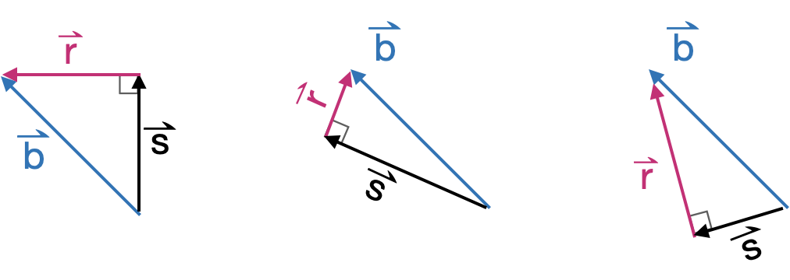
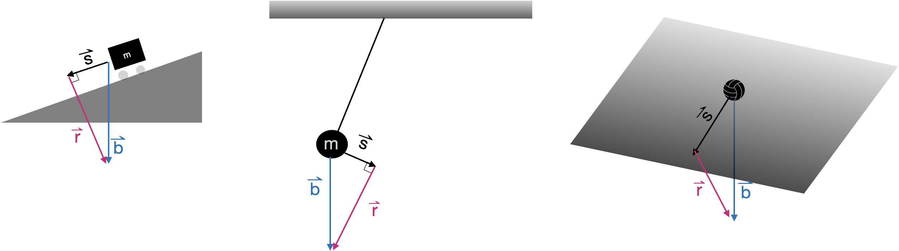

# Projection & residual {#sec-projection-residual}

```{r child="../starter.Rmd"}
```

Many problems in physics and engineering involve the task of ***decomposing*** a vector $\vec{b}$ into two perpendicular component vectors $\hat{b}$ and $\vec{r}$, such that $\hat{b} + \vec{r} = \vec{b}$ and 
$\hat{b} \cdot \vec{r} = 0$. There are infinite ways to accomplish such a decomposition, one for each way or orienting $\hat{b}$ relative to $\vec{b}$. @fig-decompose-1 shows a few examples.

::: {.takenote data-latex=""}
The hat-shaped crown in $\hat{b}$, pronounced "b-hat,"  often appears in statistics and machine learning. The hat indicates that the quantity is an *estimate* made from data.
:::

```{r echo=FALSE}
#| label: fig-decompose-1
#| fig-cap: "A few ways of decomposing $\\vec{b}$ into perpendicular components $\\hat{b}$ and $\\vec{r}$"
#| fig-align: "center"
#| out-width: "60%"

```
::: {.example data-latex=""}
The gravitational force on an object always points downward toward the center of the Earth. For an isolated object---often the word "mass" is used instead of "object"---acceleration is in the same downward direction. However, often the mass is just one component in a mechanically interconnected system, such as the three systems shown in @fig-gravity-settings: a ramp, a pendulum, and an inclined plane. The other components of the system counteract, to some extent, the gravitational force on the mass. The net force on the mass---taking into account gravity and the forces imposed by the other elements of the system---is in a direction $\vec{s}$ determined by the system, respectively pointing down the ramp or perpendicular to the pendulum strut or aligned with the gradient vector of the inclined plane.

```{r echo=FALSE, out.width="100%"}
#| label: fig-gravity-settings
#| fig.cap: "Three different mechanical systems consisting of a mass (in black) constrained in its movement by the other components of a system: left: a mass on a ramp; center: a mass as part of a pendulum; right: a round mass constrained to roll on a planar surface."
#| fig.align: "center"
#| fig.cap.location: "margin"

```

The $\vec{r}$ in each diagram gives the component of gravitational force that the structure counteracts: the pull down into the ramp, the pull along the pendulum strut, or the pull into the inclined plane.  Finding $\vec{s}$ and $\vec{r}$ is a matter of *decomposing* the gravitational force into two components: one whose direction is set by the structure and another component perpendicular to that one.
:::

The above example shows just one way the task of vector ***decomposition*** arises. Our particular interest in this part of the book is in a more general task: finding how to take a linear combination of the columns of a matrix $\mathit{A}$ to make the best approximation to a given vector $\vec{b}$.  This abstract problem is pertinent to many real-world tasks: finding a linear combination of functions to match a relationship laid out in data, constructing statistical models such as those found in machine learning, and effortlessly solving sets of simultaneous linear equations with any number of equations, and any number of unknowns.

## Projection terminology

In a typical vector decomposition task, the setting determines the relevant direction or subspace. The decomposition is accomplished by ***projecting*** the vector onto that direction or subspace. The word "projection" may bring to mind the casting of shadows on a screen in the same manner as an old-fashioned slide projector or movie projector. The light source and focusing lens generate parallel rays that arrive perpendicular to the screen. A movie screen is two-dimensional, a subspace defined by two vectors. Imagining those two vectors to be collected into matrix $\mathit{A}$, the idea is to decompose $\vec{b}$ into a component that lies in the subspace defined by $\mathit{A}$ and another component that is perpendicular to the screen. That perpendicular component is what we have been calling $\vec{r}$ while the vector $\hat{b}$ is the projection of $\vec{b}$ onto the screen. To make it easier to keep track of the various roles played by $\vec{b}$, $\hat{b}$, $\vec{r}$, and $\mathit{A}$, we will give these vectors English-language names. ^[The motivation for these names will become apparent in later chapters.]

- $\vec{b}$ the ***target vector***
- $\hat{b}$ the ***model vector***
- $\vec{r}$ the ***residual vector***
- $\mathit{A}$ the ***model space*** (or "model subspace")


***Projection*** is the process of finding, from all the vectors in the model subspace, the particular vector $\hat{b}$ that is as close as possible to the target vector $\vec{b}$. To state things another way:  projection is the process of finding the model vector that makes the residual vector as short as possible.

::: {.example data-latex=""}
@fig-b-onto-u-v2 shows a solved projection problem in 3-dimensional space. The figure can be rotated or set spinning, which makes it much easier to interpret the diagram as a three-dimensional object. In addition to the target vector $\vec{b}$ and the vectors $\vec{u}$ and $\vec{b}$ that constitute the matrix $\mathit{A}$, the diagram includes a translucent plane marking $span(\mathit{A})$. The goal of projection is, given $\vec{b}$ and $\mathit{A}$, to find the model vector (shown in light green). Once the model vector $\vec{x}$ is known, the residual vector is easy to calculate $$\vec{r} \equiv \vec{b} - \hat{b}\ .$$ Another approach to the problem is to find the residual vector $r$ first, then use that to find the model vector as $$\hat{b} \equiv \vec{b} - \vec{r}\ .$$ 

::: {.column-margin .content-visible when-format="pdf"}
A stand-alone, interactive version of this diagram is available at <dtkaplan.github.io/MC2/www/diagram7.html>.
:::

```{r child="../www/diagram7.html", eval=knitr::is_html_output()}
```

```{r echo=FALSE, out.width=ifelse(knitr::is_html_output(), "1%", "50%")}
#| label: fig-b-onto-u-v2
#| fig-cap: "A three-dimensional diagram showing the target vector $\\vec{b}$ and the vectors $\\vec{u}$ and $\\vec{v}$. The subspace spanned by $\\vec{u}$ and $\\vec{v}$ is indicated with a translucent plane. The model vector (green) is the result produced in solving the projection problem."
knitr::include_graphics(
  ifelse(knitr::is_html_output(), 
        "www/tiny-blank.png", "www/diagram7.png")
)
```

Interpreting such three-dimensional diagrams on a printed page can be difficult. Better to rotate them interactively. For instance, to see that the translucent plane in @fig-b-onto-u-v2 contains $\vec{u}$ and $\vec{v}$,  rotate the diagram to look edge-on at the plane so that the plane appears as a line on the screen. At such times, vectors $\vec{u}$ and $\vec{v}$ disappear. There is no component to $\vec{u}$ and $\vec{v}$ that sticks out from the plane; they are entirely embedded in the plane.
:::


## Projection onto a single vector {#sec-proj-single-vector}

As we said, projection involves a vector $\vec{b}$ and a matrix $\mathit{A}$ that defines the model space. We will start with the simplest case, where $\mathit{A}$ has only one column. That column is, of course, a vector. We will call that vector $\vec{a}$, so the projection problem is to project $\vec{b}$ onto the subspace spanned by $\vec{a}$.

@fig-b-onto-a diagrams the situation of projecting the target vector $\vec{b}$ onto the model space $\vec{a}$.

```{r echo=FALSE}
#| label: fig-b-onto-a 
#| out-width: "100%"
#| fig-align: "center" 
#| fig-cap: "The geometry of projecting $\\vec{b}$ onto $\\vec{a}$ to produce the model vector $\\hat{b}$."
knitr::include_graphics("www/project-b-onto-a.png")
```

The angle between $\vec{a}$ and $\vec{b}$ is labelled $\theta$. As shown in @sec-angles-dot-product, calculating an angle such as $\theta$ from $\vec{b}$ and $\vec{a}$ with a dot product:

$$\cos(\theta) = \frac{\vec{b} \bullet \vec{a}}{\len{b}\, \len{a}}\ .$$
Knowing $\theta$ and $\len{b}$, you can calculate the length of the model vector $\hat{b}$: 
$$\len{s} = \len{b} \cos(\theta) = \vec{b} \bullet \vec{a} / \len{a}\ .$$

Scaling $\vec{a}$ by $\len{a}$ would produce a vector oriented in the model subspace, but it would have the wrong length: length $\len{a} \len{s}$. So we need to divide $\vec{a}$ by $\len{a}$ to get a ***unit length vector*** oriented along $\vec{a}$:

$$\text{model vector:}\ \ \hat{b} = \left[\vec{b} \bullet \vec{a}\right] \,\vec{a} / {\len{a}^2} = \frac{\vec{b} \bullet \vec{a}}{\vec{a} \bullet \vec{a}}\  \vec{a}.$$
. <!-- must have some text before a <div> -->

::: {.rmosaic data-latex=""}

In R/mosaic, calculate the projection of $\vec{b}$ onto $\vec{a}$ using `%onto%`. For instance
```{r}
b <- rbind(-1, 2)
a <- rbind(-2.5, -0.8)
s <- b %onto% a
s
```
Having found $\hat{b}$, the residual vector $\vec{r}$ can be calculated as $\vec{b}- \hat{b}$.

```{r}
r <- b - s
r
```
The two properties that a projection satisfies are:

1. The residual vector is perpendicular to each and every vector in $\mathit{A}$. Since in this example, $\mathit{A}$ contains only the one vector $\vec{a}$, we need only look at $\vec{r} \cdot \vec{a}$ and confirm that it is zero.

```{r}
r %dot% a
```
2. The residual vector plus the model vector exactly equals the target vector. Since we computed ` r <- b - s`, we know this must be true, but still ...

```{r}
(r+s) - b
```

If the difference between two vectors is zero for every coordinate, the two vectors must be identical.
:::

## Projection onto a set of vectors

As we have just seen, projecting a target $\vec{b}$ onto a single vector is a matter of arithmetic. Now we will expand the technique to project the target vector $\vec{b}$ onto multiple vectors collected into a matrix $\mathit{A}$. Whereas in @sec-proj-single-vector we used trigonometry to find the component of $\vec{b}$ aligned with the single vector $\vec{a}$, now we have to deal with multiple vectors **at the same time**. The result will be the component of $\vec{b}$ aligned with the **subspace** sponsored by $\mathit{A}$. 

In one situation, projection is easy: when the vectors in $\mathit{A}$ are **mutually orthogonal**. In this situation, carry out several one-vector-at-a-time projections: 
$$
\vec{p_1} \equiv \modeledby{\vec{b}}{\vec{v_1}}\ \ \ \ \ 
\vec{p_2} \equiv \modeledby{\vec{b}}{\vec{v_2}}\ \ \ \ \ 
\vec{p_3} \equiv \modeledby{\vec{b}}{\vec{v_3}}\ \ \ \ \ 
\text{and so on}$$
The projection of $\vec{b}$ onto $\mathit{A}$ will be the sum $\vec{p_1} + \vec{p2} + \vec{p3}$.

::: {.example data-latex=""}
Consider the following matrix $\mathit{A}$ made up of mutually orthogonal vectors:

```{r}
b  <- rbind( 1,  1,  1, 1)
v1 <- rbind( 1,  2,  0, 0)
v2 <- rbind(-2,  1,  3, 1)
v3 <- rbind( 0,  0, -1, 3)
A <- cbind(v1, v2, v3)
```

To confirm that `v1`, `v2`, and `v3` are mutually orthogonal, calculate the dot product between any two of them and observe that, in each case, the result is zero.

Now construct the one-at-a-time projections:
```{r}
p1 <- b %onto% v1
p2 <- b %onto% v2
p3 <- b %onto% v3
```

To find the projection of $\vec{b}$ onto the subspace spanned by $\mathit{A}$, add up the one-at-a-time projections:

```{r}
b_on_A <- p1 + p2 + p3
```

Now we will confirm that `b_on_A` is the projection of `b` onto `A`.  The strategy is to construct the residual from the projection.

```{r}
resid <- b - b_on_A
```
All that is  needed is to confirm that the residual is perpendicular to each and every vector in `A`:

```{r}
resid %dot% v1
resid %dot% v2
resid %dot% v3
```
:::

## A becomes Q

Now that we have a satisfactory method for projecting $\vec{b}$ onto a matrix $\mathit{A}$ consisting of mutually orthogonal vectors, we need to develop a method for the projection when the vectors in $\mathit{A}$ are ***not mutually orthogonal***. The big picture here is that we will construct a new matrix $\mathit{Q}$ that spans the same space as $\mathit{A}$ but whose vectors are mutually orthogonal. We will construct $\mathit{Q}$ out of linear combinations of the vectors in $\mathit{A}$, so we can be sure that $span(\mathit{Q}) = span(\mathit{A})$.

We introduce the process with an example involving vectors in a 4-dimensional space. $\mathit{A}$ will be a matrix with two columns, $\vec{v_1}$ and $\vec{v_2}$. Here is the setup for the example vectors and model matrix:

```{r}
b <- rbind(1,1,1,1)
v1 <- rbind(2,3,4,5)
v2 <- rbind(-4,2,4,1)
A <- cbind(v1, v2)
```

We start the construction of the $\mathit{Q}$ matrix by pulling in the first vector in $\mathit{A}$. We will call that vector $\vec{q_1}$

```{r}
q1 <- v1
```

The next $\mathit{Q}$ vector will be constructed to be perpendicular to $\vec{q_1}$ but still in the subspace spanned by $\left[{\Large\strut}\vec{v_1}\ \ \vec{v_2}\right]$.  We can guarantee this will be the case by making the $\mathit{Q}$ vector entirely as a linear combination of $\vec{v_1}$ and $\vec{v_2}$. 

```{r}
q2 <- v2 %perp% v1
```

Since $\vec{q_1}$ and $\vec{q_2}$ are orthogonal and define the same subspace as $\mathit{A}$, we can construct the projection of $\vec{b}$ onto $\vec{A}$ by adding up the projections of $\vec{b}$ onto the individual vectors in $\mathit{Q}$, like this:

```{r}
bhat <- (b %onto% q1) + (b %onto% q2)
```
To confirm that this calculation of $\widehat{\strut b}$ is correct, construct the residual vector and show that it is perpendicular to every vector in $\mathit{Q}$ (and therefore in $\mathit{A}$, which spans the same space).

```{r}
r <- b - bhat
r %dot% v1
r %dot% v2
```
Note that we defined $\vec{r} = \vec{b} - \widehat{\strut b}$, so it is guaranteed that $\vec{r} + \widehat{\strut b}$ will equal $\vec{b}$.

This process can be extended to any number of vectors in $\mathit{A}$. Here is the algorithm for constructing $\mathit{Q}$:

i. Take the first vector from $\mathit{A}$ and call it $\vec{q_1}$.
ii. Take the second vector from $\mathit{A}$ and find the residual from projecting it onto $\vec{q_1}$. This residual will be $\vec{q_2}$. At this point, the matrix $\left[\strut \vec{q_1}, \ \ \vec{q_2}\right]$ consists of mutually orthogonal vectors.
iii. Take the third vector from $\mathit{A}$ and project it onto $\left[\strut \vec{q_1}, \ \ \vec{q_2}\right]$. We can do this because we already have an algorithm for projecting a vector onto a matrix with mutually orthogonal columns. Call the residual from this projection $\mathit{q_3}$. It will be orthogonal to the vectors in $\left[\strut \vec{q_1}, \ \ \vec{q_2}\right]$, so all three of the q vectors we've created are mutually orthogonal.
iv. Continue onward, taking the next vector in $\mathit{A}$, projecting it onto the q-vectors already assembled, and finding the residual from that projection.
v. Repeat step (iv) until all the vectors in $\mathit{A}$ have been handled. 

::: {.example data-latex=""}
Project a $\vec{b}$ that lives in 10-dimensional space onto the subspace sponsored by five vectors that are not mutually orthogonal:

```{r}
b <- rbind(3,2,7,3,-6,4,1,-1, 8, 2) # or any set of 10 numbers
v1 <- rbind(4, 7, 1, 0, 3, 0, 6, 1, 1, 2)
v2 <- rbind(8, 8, 4, -3, 3, -2, -4, 9, 6, 0)
v3 <- rbind(12, 0, 4, -2, -6, -4, -1, 4, 6, -7)
v4 <- rbind(0, 3, 9, 6, -4, -5, 4, 0, 5, -4)
v5 <- rbind(-2, 5, -4, 8, -9, 3, -5, 0, 11, -4)
A  <- cbind(v1, v2, v3, v4, v5)
```
Confirm using dot products that the `v`-vectors are **not** mutually orthogonal.

Now to construct the vectors in $\mathit{Q}$.

```{r}
q1 <- v1
q2 <- v2 %perp% q1
q3 <- v3 %perp% cbind(q1, q2)
q4 <- v4 %perp% cbind(q1, q2, q3)
q5 <- v5 %perp% cbind(q1, q2, q3, q4)
Q <- cbind(q1, q2, q3, q4, q5)
```

Since `Q` consists of mutually orthogonal vectors, the projection of `b` onto `Q` can be made one vector at a time.

```{r}
p1 <- b %onto% q1
p2 <- b %onto% q2
p3 <- b %onto% q3
p4 <- b %onto% q4
p5 <- b %onto% q5
# put together the components
b_on_A <- p1 + p2 + p3 + p4 + p5
# check the answer: resid should be perpendicular to A
resid <- b - b_on_A
resid %dot% v1
resid %dot% v2
resid %dot% v3
resid %dot% v4
resid %dot% v5
```
:::


## Exercises

`r insert_exercises("linear-combinations", "projection")`

