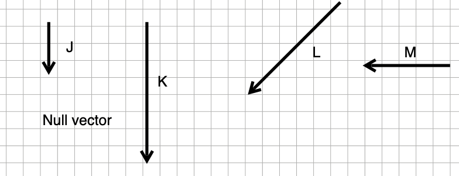

Here are twelve labeled vectors, A through M. There is a thirteenth vector, labeled "Null vector." That's a vector of length zero, so it can't be drawn as an arrow. Note that the direction of the null vector doesn't matter, since the vector length is zero. 

```{r echo=FALSE, out.width = "90%", fig-align: "center"}
knitr::include_graphics("www/vector-projection-1.png")
```

```{r echo=FALSE, out.width = "70%",  fig-align: "center"}

```

Each of the following statements is of the form, "$\vec{v}$ projected onto $\vec{u}$ gives $\vec{w}$. Say whether the statement is true or false. 

```{r daily-digital-17-projection-1, echo=FALSE}
askMC( 
  prompt="$\\vec{A}$ projected onto $\\vec{D}$ gives $\\vec{K}$", 
  "+True+", 
  "False" = "A projected onto D will be in the direction of D. K is in the direction of D, points in the right direction (downwards), and equals the vertical component of A.",
  random_answer_order = FALSE)
#QC
```

```{r daily-digital-17-projection-2, echo=FALSE}
askMC( 
  prompt= "$\\vec{D}$ projected onto $\\vec{E}$ gives $\\vec{L}$", 
  "True"  = "D projected onto E will be in the direction of E. L is in the direction of E but L does not have the right length.",
  "+False+",
  random_answer_order = FALSE)
#QC
```

```{r daily-digital-17-projection-3, echo=FALSE}
askMC( 
  prompt = "$\\vec{J}$ projected onto $\\vec{E}$ gives the null vector.", 
  "True" = "J and E are not orthogonal. So the projection of one onto the other cannot be the null vector.",
  "+False+", 
  random_answer_order = FALSE )
```

```{r daily-digital-17-projection-4, echo=FALSE}
askMC( 
  prompt = "$\\vec{H}$ projected onto $\\vec{A}$ gives the null vector", 
  "+True+", "False", random_answer_order= FALSE)
```

```{r daily-digital-17-projection-5, echo=FALSE}
askMC( 
  prompt = "$\\vec{J}$ projected onto $\\vec{K}$ gives $\\vec{D}$", 
  "True" = "J and K are parallel, so projecting J onto K will produce the vector J. But J is much shorter than D.", 
  "+False+", random_answer_order= FALSE
)
```

```{r daily-digital-17-projection-6, echo=FALSE}
askMC( 
  prompt = "$\\vec{C}$ projected onto $\\vec{D}$ gives $\\vec{L}$", 
 "True" = "C projected onto D will be in the direction of D. L is not in the direction of D.", "+False+", 
 random_answer_order= FALSE
 )
```

```{r daily-digital-17-projection-7, echo=FALSE}
askMC( 
  prompt = "$\\vec{L}$ projected onto $\\vec{B}$ gives the null vector", 
 "True" = "It's only when vectors are orthogonal that the projection of one onto the other produces the null vector. L and B are not orthogonal. ", "+False+", 
 random_answer_order= FALSE)
```

```{r daily-digital-17-projection-8, echo=FALSE}
askMC( 
  prompt= "$\\vec{E}$ projected onto $\\vec{C}$ gives $\\vec{E}$", 
  "+True+", "False", random_answer_order= FALSE)
```

```{r daily-digital-17-projection-9, echo=FALSE}
askMC( 
  prompt = "$\\vec{G}$ projected onto $\\vec{C}$ gives the null vector.", 
  "+True+", "False", random_answer_order= FALSE)
```

```{r daily-digital-17-projection-10, echo=FALSE}
askMC( 
  prompt = "$\\vec{E}$ projected onto $\\vec{D}$ gives $\\vec{J}$", 
  "+True+", "False", random_answer_order= FALSE)
```

```{r daily-digital-17-projection-11, echo=FALSE}
askMC( 
  prompt = "$\\vec{A}$ projected onto $\\vec{B}$ gives $\\vec{K}$", 
 "True"  = "A onto B will be in the direction of B. But K is orthogonal to B.",
 "+False+", random_answer_order= FALSE
 )
```

```{r daily-digital-17-projection-12, echo=FALSE}
askMC( 
  prompt = "$\\vec{H}$ projected onto $\\vec{A}$ gives the null vector", 
  "+True+", "False", random_answer_order= FALSE)
```

```{r daily-digital-17-projection-13, echo=FALSE}
askMC( 
  prompt = "$\\vec{F}$ projected onto $\\vec{C}$ gives $\\vec{H}$", 
 "True", "+False+", random_answer_order= FALSE)
#QC
```

```{r daily-digital-17-projection-14, echo=FALSE}
askMC( 
  prompt = "$\\vec{C}$ projected onto $\\vec{E}$ gives $\\vec{E}$", 
 "True", "+False+", random_answer_order= FALSE)
```

```{r daily-digital-17-projection-15, echo=FALSE}
askMC( 
  prompt = "$\\vec{E}$ projected onto $\\vec{G}$ gives the null vector", 
  "+True+", "False", random_answer_order= FALSE)
```

```{r daily-digital-17-projection-16, echo=FALSE}
askMC( 
  prompt = "$\\vec{G}$ projected onto $\\vec{B}$ gives $\\vec{C}$", 
 "True", "+False+", random_answer_order= FALSE)
#QC
```

