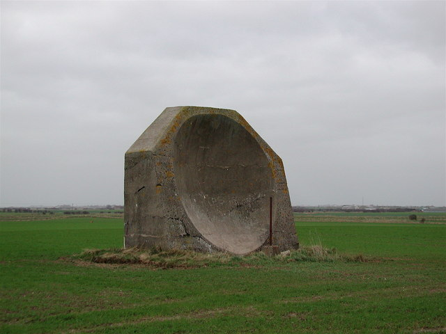

**Locating WW I aircraft**

The photograph shows part of an aircraft detection system from World War I. The concrete block is an "acoustic mirror." Its purpose is to collect and reflect sounds from  an aircraft,  concentrating them at a point where they can be picked up by a microphone. Moving the microphone to a  point where the concentrated sound is strongest allows the aircraft's bearing to be identified, helping observers acquire the aircraft visually.



[Source](https://en.wikipedia.org/wiki/Acoustic_mirror#/media/File:WW1AcousticMirrorKilnsea(PaulGlazzard)Jan2007.jpg)

With two or more such acoustic mirrors, the location of the aircraft can be identified. 

```{r echo=FALSE, out.width  = "60%",  fig.align="center"}
knitr::include_graphics(("www/mirror-vectors.png"))
```

```{r cucE-1, echo=FALSE}
askMC(
  prompt = "Give the position  of the aircraft as a  multiple  of $\\vec{a}$ from sound mirror A and as a multiple of $\\vec{b}$ from sound mirror B. (Choose the closest answer)",
    "+$3 \\vec{a}$ and $4.5 \\vec{b}$+" = "",
    "$4 \\vec{a}$ and $6 \\vec{b}$" = "",
    "$3\\vec{a}$ and $2  \\vec{b}$" = "",
    "$4\\vec{a}$ and $4.5\\vec{b}$" = ""
)
```

