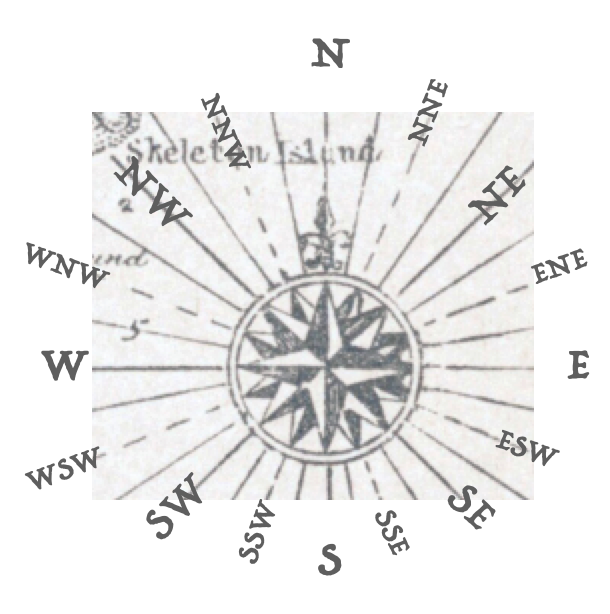

::: {.underconstruction}

This will be an exercise about translating compass directions into linear combinations.

Some initial ramblings ...

Pirates and other mariners use direction terms like "one point north of north-north-east." Their maps are annotated with compass roses that translate the words into a direction.

```{r compass-rose,echo=FALSE, fig.caption="A compass rose from the map in the children's classic book *Treasure Island*. One point north of north-north-east is the direction of the radial line passing through the 'd' in \"Skeleton Island\".", out-width: "20%", fig-align: "center"}

```
Mathematicians can replace a compass rose with just two vectors, say, $\overset{\longrightarrow}{\text{North}}$ and $\overset{\longrightarrow}{\text{East}}$. Other directions can be given as a linear combination. For instance, the compass rose's "north-north-west" is the linear combination $0.9239\,\overset{\longrightarrow}{\text{North}} -0.3827\,\overset{\longrightarrow}{\text{East}}$.
:::
