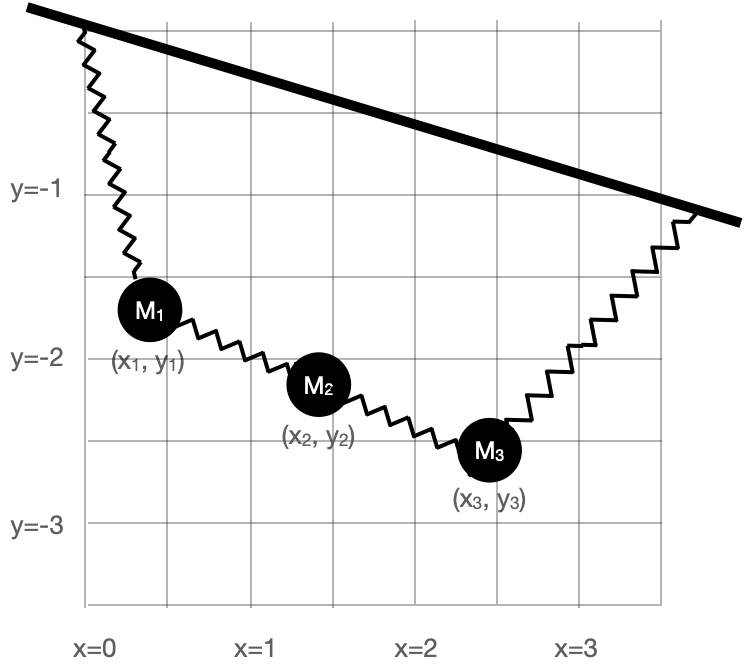
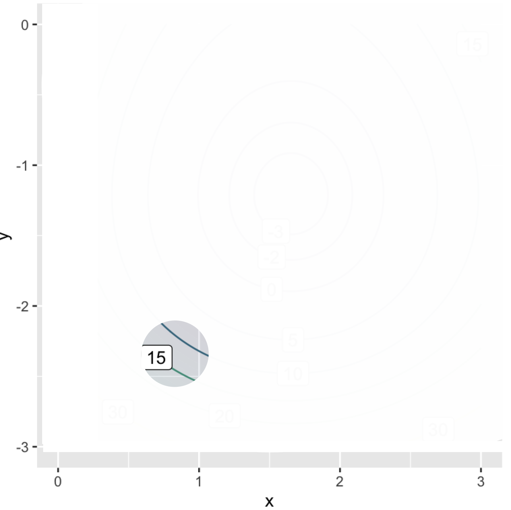
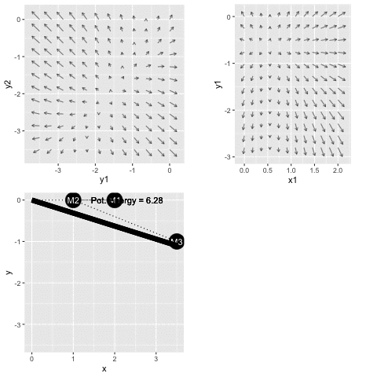
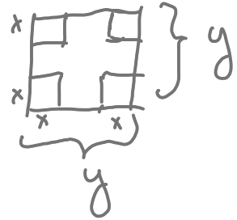

# Optimization and constraint {#sec-optimization-and-constraint}

```{r include=FALSE}
source("../starter.R")
```

@sec-optim-and-shape introduced optimization and some of the terms used to describe optimization problems: 

* ***Objective function***, that is, the quantity that is to be made as large as possible (maximization) or as small as possible (minimization) depending on the modeling context.

* ***argmin*** and ***argmax*** values, that is, the value of the inputs to the objective function that produce the optimal output.

* ***max*** and ***min***, the output value of the objective function when the input is an argmax or argmin respectively. 

A simple optimization problem has three main phases:

i. a modeling phase in which the objective function is identified or constructed;
ii. a solution phase where argmin or argmax inputs are found.
iii. an evaluation phase where the objective function is applied to the argmin and/or argmax, and the result interpreted in terms of the real-world task at hand. 

To illustrate, consider this simple but unrealistic problems found in hundreds of calculus texts: Finding the configuration to construct the rectangular box with the largest possible volume out of a piece of cardboard. The **modeling phase** starts with a representation of the box-construction and volume-finding process. Suppose, for the sake of simplicity, that we are working with a piece of cardboard fixed at 20 inches by 30 inches. For box construction, we will propose cutting out squares from each corner of the box of some side length $x$. Those squares will be discarded and the box formed by folding up the flaps generated by the squares' removal, as in @fig-box-folding. 


::: {#fig-box-folding}
{width="40%" align="center"}

Cardboard for forming the simple box.
:::
  
For the volume of the box, we will multiply the area of the bottom of the box by the height $x$. Examination of @fig-box-folding should be enough to convince you that the volume $V$ is a function of $x$:

$$V(x) = \underbrace{\strut x}_\text{height} \cdot \underbrace{(20-2x)}_\text{width}\cdot \underbrace{(30-2x)}_\text{length} =  x(600 - 100 x + 4 x^2)\ .$$
Since the goal is to find the maximum possible volume, $V(x)$ is our objective function.

The **solution phase** can be completed by drawing a graph of $V(x)$ and finding the $x$ corresponding to the peak value of $V(x)$. We will leave this for you to do in a sandbox; you can figure out the relevant domain by noting that the corner squares cannot overlap. Calculus texts typically emphasize another approach, using symbolic differentiation to examine $\partial_x V(x)$ and solve for $x^\star$ such that $\partial_x V(x^\star) = 0$. The derivative is
$$\partial_x V(x) = 600 - 200 x + 12 x^2\ .$$ The symbolic solution task is to find the zeros of $\partial_x V(x)$. They work out to be $x_1^\star = 3.92$ or $x_2^\star = 12.74$.

The third phase of an optimization problem, **evaluation phase**, can start with plugging in the objective function the values of $x^\star$.

$$V(x_1^\star) = 1056.3\ \text{in}^3 \ \ \ \ \text{and}\ \ \ \ V(x_2^\star) = -315.6\ \text{in}^3$$
It is common sense that $x_2^\star$ is not a viable solution. The negative volume at $x_2^\star$ is a consequence of looking at $V(x)$ beyond the sensible domain for cardboard boxes. More generally, as part of the evaluation phase we can look at the value of the convexity $\partial_{xx} V(x^\star)$ to find out whether an $x^\star$ value is an argmax or an argmin. Since $\partial_{xx} V(x) = 24 x - 200$ we see that $\partial_{xx} V(x_1^\star) < 0$, corresponding to an argmax.  Alternatively, instead of computing the convexity, we could check whether we have an argmin or an argmax by evaluating the objective function at a *nearby* input. 

::: {#try-argmin-x2 style="display: none;"}
:::
::: {.callout-important icon=false}
## @try-argmin-x2 Argmin or argmax?
Show that $x_2^\star$ in the box-shape problem is an argmin by evaluating the convexity of the objective function near $x_2^\star$.

The convexity of the function $V()$ is, of course, indicated by the value of the second derivative. Apply the second derivative function to $x_2^\star$. The sign is positive, so $V()$ has positive convexity: a smile-shaped pattern with $x_2^\star$ at the bottom. That means $x_2^\star$ is an argmin.

:::

Additional examination of the phase-two solution can give useful information, such as an indication of how sensitive the output is to small changes of the input near the argmax (or argmin). For example, setting $x=4$ in will produce a volume output $V(4) = 1056$ in^2^, hardly different than the "exact" maximum of 1056.3 in^3^ and perhaps preferred for the person who wants to make standard-size boxes.

The evaluation phase in a genuine application (as opposed to a textbook toy example) should also include a reflection on how well the model reflects the real-world situation. For example we've neglected the creases that arise from folding cardboard, so a more complete examination would estimate this effect. And the person skeptical about calculus-book chestnuts might wonder whether the object is really to create a box without a top!

Commonly, optimization problems involve much more complicated objective functions with many inputs. The next section considers the basis for a more general and practical approach to the solving phase of optimization. Later sections examine how this more general approach leads to methods for approaching the sort of real-world optimization problem where there are multiple objectives.

## Gradient descent

The general approach we will take to the solving phase of optimization problems will be ***iterative*** as in @sec-operations. Start with an initial guess for an argmin and then construct a new function that can improve the guess. Applying this improvement function iteratively leads to better and better estimates of the true argmin. 

For illustration purposes, we will use optimization problems where the objective function has two inputs. Such objective functions can be graphed on paper or a display screen and it is possible to see the action of the iterative improvement process directly. For optimization in problem with many inputs, the improvement can be monitored from the objective function output at each step.

::: {.callout-tip}
**Spring-mass systems: an example context**

As our example context for discussing the optimization process, we will consider how to use optimization to calculate the configuration of simple mechanical systems consisting of interconnected springs and masses. Such configuration problems are especially important today in understanding the structure and function of proteins, but we will stick to the simpler context of springs and masses.
:::

@fig-spring-mass1 shows a mechanical system consisting of a mass suspended from a fixed mounting by three nonlinear springs.

::: {#fig-spring-mass1}
{width="50%"}

A mass suspended from three springs.
:::
  
The mass is shown by a black circles. Springs are the zig-zag shapes. The bold bar is the fixed mounting, as if from a beam on the ceiling of a room. The system has an equilibrium configuration where the springs are stressed sufficiently to balance each other left to right and to balance the gravitational force downward on the mass. 

We want to calculate the equilibrium position. The basic strategy is to model the ***potential energy*** of the system, which consists of:

i. the gravitational potential energy of the mass. 
ii. the energy stored in stretched or compressed springs. 

Since the configuration of the system is set by the coordinate $(x_1, y_1)$, the potential energy is a function $E(x_1, y_1)$. For brevity, we will leave out the physics of the formulation of the potential-energy function; shown in @fig-spring-mass1-pot.

::: {#fig-spring-mass1-pot}
```{r echo=FALSE}
# E2 <- makeFun(abs(x)^2.7 + abs(y)^2.7 - 1 + abs(x - 2)^1.5 + abs(y)^1.5 - 1 + 9.8 *y + abs(x-3)^3 + abs(y)^3 - 1 ~ x & y)
contour_plot(PE_fun1(x, y) ~ x & y, bounds(x=0:3, y=-3:0),
            skip=0, contours_at=c(30,20, 15, 10, 5, 0, -2, -3)) |>
  gf_refine(coord_fixed()) |>
  gf_labs(title="Potential energy E(x,y)")
```

The potential energy of the spring-mass system in @fig-spring-mass1.
:::

The potential energy function $E(x,y)$ has a bowl-like shape. The bottom of the bowl---the argmin---is near $(x=1.7, y=-1.3)$. In terms of @fig-spring-mass1, the equilibrium position is a bit upward and to the right of the position shown in the figure.

With a graph of the objective function like @fig-spring-mass1-pot, the solution phase is simple; a graph will do the job. But for more complicated objective functions, with more than 2 inputs, drawing a complete graph is not feasible. For example, in the spring-mass system shown in @fig-spring-mass-3, the potential energy function has six inputs: $x_1, y_1, x_2, y_2, x_3, y_3$. In genuine applications of optimization, there are often many more inputs. 

::: {#fig-spring-mass-3}
{width="50%" align="center"}
  
A more complicated spring-mass system.

:::

In a multi-input optimization problem, we don't have a picture of the whole objective function. Instead, we are able merely to  ***evaluate*** the objective function for a single given input at a time. Typically, we have a computer function that implements the objective function and we are free to evaluate it at whatever inputs we care to choose. It is as if, instead of having the whole graph available, the graph is covered with an opaque sheet with a loophole, as in @fig-loophole.


::: {#fig-loophole}
{align="center" width="60%"}

A more realistic view of what we can know about a function.
:::
  
We can see the function only in a small region of the domain and need to use the information provided there to determine which way to move to find the argmin. 

The situation is analogous to standing on the side of a smooth hill in a dense fog and finding your way to the bottom. The way forward is to figure out which direction is uphill, which you can do directly from your sense of balance by orienting your stance in different ways. Then, if your goal is the top of the hill (argmax) start walking uphill. If you seek a low point (argmin), walk downhill.

The mathematical equivalent to sensing which direction is uphill is to calculate the ***gradient*** of the objective function. @sec-partial-change uses partial differentiation with respect to each of the input quantities to assemble the gradient vector, denoted $\nabla f() = \left({\large \strut} \partial_x f(), \ \partial_y f()\right)$. In terms of @fig-loophole, where we are standing at about $(x_i=0.8, y_i=-2.3)$, we would evaluate the each of the partial derivatives in the gradient vector at $(0.8, -2.3)$. 

The gradient points in the steepest direction uphill so, once you know the direction, take a step in that direction to head toward the argmax, or a step in the opposite direction if you seek the argmin. The process of following the gradient toward the top of the hill is called ***gradient ascent***. Correspondingly, following the gradient downhill is ***gradient descent***.

::: {#fig-loopwhole-gradient}
<!-- # gradient_plot(PE_fun1(x, y) ~ x & y, bounds(x=0:3, y=-3:0), alpha=1, color="black") %>%
#  gf_refine(coord_fixed())
# the mask is in figures2.key -->
{width="60%" align="center"}

The gradient provides information about the shape of the local function in a convenient form to guide the step to the next locale in your journey toward the argmin or argmax.
:::

For humans, the length of a step is fixed by the length of our legs and the size of our feet. The mathematical step has no fixed size. Often, the modeler gains some appreciation for what constitutes a small step from the modeling process. Referring to @fig-spring-mass-3 for example you can see that a small increment in $x$ is, say, $0.1$, and similarly for $y$. There is little point in taking an infinitesimal step---that gets you almost nowhere! Instead, be bold and take a finite step. Then, at your new location, calculate the gradient vector again. If it is practically the same as at your earlier position, you can wager on taking a larger step next time. If the new gradient direction is substantially different, you would be well advised to take smaller steps.

Fortunately, a variety of effective ideas for determining step size have been implemented in software and packaged up as algorithms. The modeler need only provide the objective function in a suitable forma starting guess for the inputs. 

::: {#try-argM style="display: none;"}
:::
::: {.callout-important icon=false}
## @try-argM Using `argM()`
The R/mosaic function `argM()` is set up to find argmins and argmaxes using the familiar tilde-formula/domain style of arguments used throughout this book. For instance, the potential energy of the spring-mass system shown in @fig-spring-mass1 is available as `mosaicCalc::PE_fun1()`


```{webr-r}
argM(PE_fun1(x, y) ~ x & y, bounds(x=0:3, y=-3:0))
```
:::

::: {#thm-formulas-algorithms style="display: none;"}
---Algorithms can implement formulas, but the reverse is not necessarily true.
:::
::: {.callout-note icon=false data-latex=""} 
## @thm-formulas-algorithms Formulas and algorithms

Textbook formulas in physics, chemistry, engineering, and economics often have a root in an optimization problem. Since a formula is the desired result, symbolic differentiation is used in the solution phase. This allows parameters to be represented with symbols rather than as specific numbers. Usually the objective functions involved are simple. And to make the objective functions simple enough for symbolic work, it is common to make approximations, for example by replacing functions like $\sin(x)$ with $x$ and $(1+p)^n$ with $1+np$. But simplifying the objective function should really be considered part of the solution phase rather than the modeling phase.

Numerical techniques are the most widely used in practice. Optimization is an important operation in both science and management and much human ingenuity has gone into the development of effective algorithms. The modeler rarely if ever needs to reach beyond the software provided in technical computing environments such as R, MATLAB, Mathematica, or the many packages available for Python.

In data science and machine learning, often advanced solution-phase software is provided as web services and APIs (application programming interfaces). An example is the Google technology product [TensorFlow](https://www.tensorflow.org/) used to find optimal parameters for functions in the machine technique called "deep learning."
:::

<!-- In using such software systems, the modeler needs to understand the structure of the arguments handed off to the systems. It is also important to be able to test whether you have structured those arguments appropriately to represent your intentions. This often involves some level of debugging and the incremental development of objective functions so that you can verify correct performance with a strategy like this: first implement a simple version of the objective function then add more detail; repeat the cycle of verify-then-add-more-detail until you have an objective function that contains all the salient factors.

As a simple example of support for such debugging, we will examine a core R function, `optim()`, for carrying out optimization. The command `?optim`, given in a sandbox or on the R command line will display the documentation for `optim()`. Such documentation is typically aimed at those already proficient with programming in R at a level beyond that covered in this book. (that is  one reason this book uses the R/mosaic `argM()` function and similar functions based on tilde expressions and domains. These R/mosaic functions makes use of `optim()` internally, surrounding it with an interface using tilde expressions and domains.) To illustrate, @fig-SM2-path traces the sequence of ascent steps followed by `optim()` in working toward the argmin of `PE_fun1()`.

```{r message=FALSE, eval=FALSE, warning=FALSE, echo=FALSE}
obj_fun <- vector_arg(PE_fun1)
out <- capture.output(
  results <- optim(c(0,0), obj_fun,
                 control=list(trace=1, REPORT=3), method="CG")
)
lines <- grep("parameters", out)
arg_lines <- outer(seq_len(lines[2] - lines[1] - 1) - 1, lines, "+")
arg_msg <- gsub("parameters", "", out[arg_lines])
steps <- as_tibble(matrix(scan(text = arg_msg), ncol = 2, byrow = TRUE)) %>%
  mutate(rpw = as.character(row_number()-1))
names(steps) <- c("x", "y", "row")
Plot1 <- 
  gf_point(y ~ x, data = steps[1:6,], inherit=FALSE, color="blue") %>%
  gf_path(y ~ x, data = steps[1:6,], color="blue") %>%
  gf_text(y ~ x, data = steps[1:6,], label=~row, 
          inherit=FALSE, color="blue", hjust=-1.2) %>%
  gradient_plot(PE_fun1(x, y) ~ x & y, 
                bounds(x=0:3, y=-3:0), alpha=1, color="black") %>%
  gf_refine(coord_fixed())

Plot2 <- 
  gf_point(y ~ x, data = steps[6:11,], inherit=FALSE, color="blue") %>%
  gf_path(y ~ x, data = steps[6:11,], color="blue") %>%
  gf_text(y ~ x, data = steps[6:11,], label=~row, inherit=FALSE, color="blue", hjust=1.2) %>%
  gradient_plot(PE_fun1(x, y) ~ x & y, 
                bounds(x=1.65:1.656, y=-1.216:-1.20), 
                alpha=1, color="black", npts=10) %>%
  gf_refine(coord_fixed())
Plot3 <- 
  gf_point(y ~ x, data = steps[8:13,], inherit=FALSE, color="blue") %>%
  gf_path(y ~ x, data = steps[8:13,], color="blue") %>%
  gf_text(y ~ x, data = steps[8:13,], label=~row, inherit=FALSE, color="blue", hjust=1.2) %>%
  gradient_plot(PE_fun1(x, y) ~ x & y, 
                bounds(x=1.651:1.652, y=-1.2131:-1.2117), 
                alpha=1, color="black", npts=10) %>%
  gf_refine(coord_fixed())
```


```{r eval=FALSE, echo=FALSE}
#| label: fig-SM2-path
#| fig.show="keep", fig-cap: "The path followed by `optim()` in descending the gradient, starting at (0,0). Successive steps are numbered."
Plot1 
gridExtra::grid.arrange(Plot2, Plot3, nrow=1)
```

Starting at the initial guess, $(x_0, y_0) = (0,0)$ the algorithm takes a step of length about 1.5 to the east-south-east. The gradient at point $(x_1, y_1)$ is discernibly different than at $(x_0, y_0)$; the algorithm follows the new gradient vector but with a shorter step length. At $(x_2, y_2)$ there has been a more severe change in the gradient, so the angle takes an even shorter step to the point labeled 3.

The bottom two graphs zoom in on the gradient field for later steps. The most dramatic changes in direction are at $(x_6, y_6)$ and $(x_9, y_9)$. As the gradient vector gets shorter, so do the step sizes, terminating when the step size is insignificant.
:::
-->

::: {#thm-spring-mass style="display: none;"}
:::
::: {.callout-note icon=false}
## @thm-spring-mass Minimum potential energy
The potential energy function of the spring-mass system in @fig-spring-mass-3 is available as the R/mosaic function `PE_fun2()`. This potential energy function has six inputs: the $x$ and $y$ coordinates of each of the three masses. The code below shows how to use the R/mosaic `argM()` function to locate an argmin of the potential energy.

```{webr-r}
argM(PE_fun2(
  x1, y1, x2, y2, x3, y3) ~ x1 & y1 & x2 & y2 & x3 & y3, 
  bounds(x1 = 0:3, y1=-3:0, x2=0:3, y2=-3:0, x3=0:3, y3=-3:0))
```

The `argM()` function reports the final result, the end of the path followed in descending the gradient field. @fig-SM3-path gives a movie of the path as it is being followed.

::: {#fig-SM3-path}


The path to equilibrium for the 3-body spring-mass system shown in @fig-spring-mass-3. The top two frames show a 2-dimensional slice through the 6-dimensional gradient field. The bottom frame translates the current point on the path into a picture of the spring-mass locations.
:::

At the start of the movie, the masses are (absurdly) misplaced and far from their equilibrium position. As system configuration moves downhill toward the argmin of the potential energy function, the masses sort themselves out.

The two gradient-field frames show a different two-dimensional slices of the potential energy function which has six inputs. Watch the gradient-fields carefully to see that the field itself is changing as time goes by. All six inputs are changing. At each point in time, we are plotting the gradient field as a function of the two inputs shown on the axes. These stay the same through the whole movie, but the other four inputs are changing as the system moves along the gradient descent path. The last frame shows the gradient field at the final position in six-dimensional space. You can see that the early parts of the path are not aligned with the end-of-path gradient fields, but they were aligned at the earlier time when each point in the path was passed.

The familiar tilde-expression format used by `argM()` and the other R/mosaic functions is suitably compact for function of one or two arguments, but for functions with many inputs it becomes ungainly. For objective functions with many inputs, a different programming style is more appropriate that packages up the multiple inputs into a single, ***vector input***. Since this is not a programming book, we won't go into the vector-input programming style, but be aware that in professional-level work, learning new tools for programming becomes essential.
:::

## Objectives and Constraints

Many real-world decision-making settings do not fit neatly into the framework of constructing an objective function and then finding the argmin (or argmax). A common situation is having multiple objectives. These objectives often compete and the output of the respective objective functions may not necessarily be directly comparable. For instance, in health care one objective is to save lives, while another is to minimize costs. But lives and money are not directly comparable.

Often, the original problem statement does not include all of the objectives and the modeler needs to be perceptive to discern important objectives left out of the initial description of the problem. When such missing objectives become apparent, it is necessary to visit the modeling phase of the problem to insert the new objectives. By adopting the right approach to modeling, such situations can be readily handled and, even better, the modeling phase can bring new insight into the real-world problem.

To illustrate, let's returning to the mathematically simplified problem of constructing an optimal cardboard box. Before, we stipulated that the raw cardboard stock has dimension 20 inches by 30 inches. Now we will generalize and work with a piece of cardboard that has edges of length $y$ from which, as before, we will cut out square corners of length $x$ on a side. (See @fig-box-shape). Our objective is to make a box with the largest possible volume. (This will be an **argmax** problem.)

::: {#fig-box-shape}
```{r echo=FALSE}
#| layout-ncol: 2

knitr::include_graphics("www/box-fold-2.png")
```

The cardboard cut lines and the eventual shape of the folded box.
:::

The area of the bottom of the box is $(y - 2x)^2$ and the box height is $x$. The objective function is the volume of the box, area times height:
$$V(x, y) \equiv x (y - 2x)^2\ .$$ There are two inputs, $x$ and $y$, so a simple plot should suffice to find the argmax.

::: {#fig-box2}
```{r echo=FALSE}
V <- makeFun(x*(y-2*x)^2 ~ x & y)
P1 <- contour_plot(V(x,y) ~ x & y, bounds(x=0:10, y=0:30),
             contours_at = c(10,20, 50,100,200,300,500,700, 1000, 1500,2000, 2500, 3000),
             skip=0)
P1
```

The volume of the box (in cubic inches) constructed by cutting corners of size $x$-by$x$ out of a $y$-by-$y$ piece of cardboard.
:::

Scanning @fig-box2 reveals a couple of things that you might not have anticipated. First, the argmax is in the extreme lower-right corner of the graphics frame, not in the center as in previous examples. Second, the argmax in this corner, $(y=0, x=10)$ is logically inconsistent with the idea of a cardboard box.

The inconsistency stems from an inadmissible value for $x$. For $2x > y$, the bottom of the box would have negative edge length. But because the objective function $V(x,y)$ squares this negative quantity---in the $(y - 2x)^2$ term---the output of the objective function does not signal that anything is wrong. The source of the problem is not the objective function formula itself, but neglecting to consider carefully what is the proper practical domain for the function.

To make the calculation realistic, we should search for the argmax only in that region of the graphics frame where $y > 2x$. That restriction on the search domain is called a ***constraint***. In this case, the constraint takes the form of an inequality $y > 2x$ so we call it an ***inequality constraint***. (Later, we will work with ***equality constraints***.)

::: {#fig-box2b}
```{r echo=FALSE}

P1 |>  inequality_constraint(y > 2*x ~ x + y,
                              domain(x=0:10,y=0:30), 
                              alpha=0.35, npts=200)
```

The inequality constraint that $y > 2x$ renders much of the graphics frame inadmissible as a possible solution. The inadmissible region is shaded in blue. The argmax must be sought in the unshaded region of the frame.
:::

With the $(x,y)$-domain restricted to the values that are physically realistic, we can see that the argmax is still on the edge of the frame, at $y=30$ and $x\approx 5$, where the volume of the box will be about 1800 in^3^. This result should cause you pause, since there was nothing in the problem statement that limited $y$ to be 30" or less. If we replotted with a larger domain for $y$, we should see still larger boxes, without any limit.

The interpretation of the problem as originally posed is: With enough cardboard we can make a box of any size! Since the goal was to recommend the "best" size, this conclusion is not so useful. The weak conclusion stems from a fault in the problem statement. The statement omitted an important second objective function: use as little cardboard as possible. 

If using as little cardboard as possible were our sole objective, the optimization problem has an easy-to-find solution: we would make a zero-volume box out of zero-area of cardboard. What we want, somehow, is to make as big a box as possible out of as little cardboard as possible: we have two objectives! In this case, the objectives are in conflict: making a bigger box (good) uses more cardboard (bad). 

Common sense tells us to balance the two objectives, but how to represent this mathematically? Ideally---note that "ideally" is sometimes far from "realistically" or "productively"---we would know how much box-volume is worth to us and how much cardboard costs, and we could construct an objective function that incorporates both value and cost. For instance, if each cubic inch of volume is worth 1 cent, and each square inch of cardboard costs 3 cents, then the objective function will be the following (with output in cents):

$$\text{Profit}(x,y) \equiv 1\, x (y-2x)^2 - 3 y^2$$

::: {#fig-total-cost}
```{r echo=FALSE}
box_P2 <- contour_plot(1*x*(y-2*x)^2 - 1 * y^2 ~ x & y,
                       bounds(x=0:15,y=10:50),
                       skip=0) |> 
  inequality_constraint(y > 2*x ~ x + y, 
                        bounds(x=0:15, y=10:50), 
                        alpha=0.35, npts=200) 
box_P2
```

The "profit" (value minus cost) of the cardboad box (cents).
:::

Even with including the cardboard cost in the objective function, we will still want to make $y$ as large as possible. Not much guidance there!


But let's imagine a new factor coming into play. At the meeting where the box-design decisions are being made and where you are presenting your analysis in @fig-total-cost, the graphic designer speaks up. "The trending shape for this year is cubic. We want the box, whatever it is size, to be a cube."

Luckily, you the modeler can quickly incorporate this into your analysis. To be a cube, the height $x$ of the box has to be the same as the width and depth $y - 2x$. So you can incorporate the designer's wish into the model of the decision factors by adding a new constraint:

$$x = y - 2x \ \ \ \implies y-3x=0\ \ \ \ \text{constraint: box must be cubic}$$
This is called an ***equality constraint***. @fig-cube-total-cost shows the equality constraint in green: to be a cube, $x$ and $y$ must be somewhere along the green line.

::: {#fig-cube-total-cost}
```{r echo=FALSE, warning=FALSE, message=FALSE}
box_P3 <- contour_plot(1*x*(y-2*x)^2 - 1 * y^2 ~ x & y,
                       bounds(x=0:15,y=10:50),
             contours_at=c(100*((-3):3),500, 750, 1000, 1350, 2000, 2500,3500, 4500,5500),
                       skip=0) |> 
  inequality_constraint(y > 2*x ~ x + y, 
                        bounds(x=0:15, y=10:50), 
                              alpha=0.35, npts=200)  %>%
  equality_constraint(y - 3*x ~ x & y, 
                      bounds(x=0:15,y=10:50), alpha=.5, fill="magenta", npts=300)
box_P3
```

The profit function shown in more detail along with the equality constraint (green) for the box to be cube-shaped.
:::

Follow the green path uphill. As $x$ gets larger along the constraint, the output of the objective function grows, reaching a level of 1350 cents when $(x=15, y=45)$ at the right border of the graphics frame. 

It is worth pointing out, for later use, that the be-a-cube constraint is almost parallel to the objective function contours.


::: {#thm-budget-constraints style="display: none;"}
---Using a budget optimally.
:::
::: {.callout-note icon=false data-latex=""} 
## @thm-budget-constraints Budgets

Many organizations use a budget mechanism to manage their affairs. The organization defines divisions or projects, and each of these is given a dollar budget to stay within. The individual division or project manager can arrange things more or less as she thinks best, so long as she stays within the budget. This is a kind of constraint: a ***budget constraint***.

Suppose you have been tasked to set up a new factory and given a budget of $5,500,000 to do so. You were given this task because you have a particular expertise in how best to set up the factory, but your design will of course depend on the relative prices of the different inputs to the production process. 

For simplicity, let's imagine that there are two main inputs: labor $L$ and capital/equipment $K$. It would be silly to spend all the budget on labor and none on capital; the workers would have no tools to work with. Similarly, capital without labor has no productive value. The best design for the factory will be a mix of labor and capital.

Since the purpose of the factory is to make things for sale, a good objective function will be the sales value of the output produced by the factory. Economists have a favored form for production functions of this sort, a power-law called the ***Cobb-Douglas*** function. The essential insight behind the Cobb-Douglas function is that doubling **both** capital and labor (as if you built a second factory alongside the first) should double production. The Cobb-Douglas form for production as a function of capital and labor is $$Q(L, K) = p b L^a K^{1-a}\ .$$ You will use your expertise to set the values of the $a$ and $b$ parameters. The price $p$ of each unit of output will be set by the market: Let's assume for planning purposes that it is $p - \$450$ per unit. Suppose you have determined that $a=0.3$ and $b=40$ are appropriate. This production function is shown in @fig-cobb-doug1.

::: {#fig-cobb-doug1}
```{r echo=FALSE}
P <- makeFun(p*b*(L^a)*(K^(1-a))/1e6 ~ K & L, a=0.3, p=450, b =40)
Plot1 <- contour_plot(P(L, K) ~ L & K, bounds(L=300:1000, K=50:250), skip=0)
Plot1
```

A Cobb-Douglas production function for factory output with $p=100$, $b=40$ and $a=0.3$. (Output units in millions of dollars).
:::

As you can see from @fig-cobb-doug1, the more labor and the more capital you use, the higher the production. Notice that the production function itself does not have an argmax interior to the domain being plotted. It is one of those "more is better" situations.

Suppose that labor costs $6000 per person-month. Capital, in units of production stations, costs $13,000 per unit. Your budget constraint reflects the total cost of capital and labor: $6000 \cdot L + 15000 \cdot K \leq 5500000$. This constraint is graphed in @fig-cobb-doug2.

::: {#fig-cobb-doug2}
```{r echo=FALSE}
Plot1 |>
  inequality_constraint(
    6000*L + 13000*K <= 5500000 ~ L & K, 
    fill="green",
    domain(L=300:1000, K=50:250), alpha=0.6, npts=250)
```

The production function for factory output with the budget constraint shown in green.
:::

Any mixture of labor and capital that falls outside the green zone stays within your budget. What's the best mixture? The one that gives the largest production. You can read this off the graph, $L\approx 650$ person-months and $K\approx 125$ workstations which gives slightly more than $7 million dollars in production. 

The argmax is right on the frontier of the constraint region. Put into more operational terms: You will want to spend your entire budget to maximize production. This is hardly a surprise to anyone who has to work within a budget. Knowing that you're going to use the whole budget, you might as well have found the argmax by walking along the constraint frontier from left to right. As you start near $K=250$ and $L=380$, the path you walk goes *uphill* in terms of the production function. The path continues uphill until you reach the argmax. Near the argmax, the path is level. After the path crosses the argmax, it is leading downhill. At the argmax, the production function contours are ***parallel*** to the constraint boundary. 

You might like to think of this in terms of bicycling along a path in hilly terrain. (The hill is shown in @fig-cobb-doug2 as the contours, the path is the boundary of the green area, running diagonally from top left to bottom right in the graph.) When you reach the local high point on the path, you may not be at the top of the hill. But you will be on a flat spot on the path, meaning that the path is parallel to the contour of the hill at that point. 
:::


## Constraint cost

Optimization techniques have an important role to play as **aids to human decision making**. Let's see how the mathematical representation of a constraint as a **function** can facilitate the human decision-making process.

In the previous section, the box designer's request that the box be cubic was translated into an equality constraint, $y-3x=0$, shown as the green line in @fig-cube-total-cost. The skilled modeler can bring additional power to the analysis by translating that *constraint*, $y-3x=0$ into a *function*, for example 
$$\text{Equation:}\ \  \ y - 3x = 0\ \ \longrightarrow\ \ \ \text{Function:}\ \ \text{cube-box}(x, y) = y / 3x\ .$$ 
Any $(x^+, y^+)$ that produces $\text{cube-box}(x^+, y^+) = 1$ is a pair that satisfies the constraint. In other words, the equality constraint amounts the 1-contour of the cube_box() function.

Translating the constraint into a function provides the opportunity to reframe the situation from the mandate, "the box must be a cube," into a question, "How cubic-like is the box?"  If the value of $\text{cube-box}(x,y) > 1$, the box is flatter than a cube; something in the direction of a pizza box. If $\text{cube-box}(x,y) < 1$ the box is taller than a cube, as if flowers were being shipped in it.}

The constraint-to-function translated situation is shown in @fig-profit-cube:

::: {#fig-profit-cube}
```{r echo=FALSE, warning=FALSE, message=FALSE}
Plot2 <- contour_plot(1*x*(y-2*x)^2 - 1 * y^2 ~ x & y,
                       bounds(x=12:15,y=40:50),
             contours_at=c(100*((-3):3),500, 750, 1000, 1350, 2000, 2500,3500, 4500,5500),
                       skip=0) |> 
  gf_abline(intercept=~ 0, slope=~ 3, color="magenta", size=1.5, alpha=0.7) %>%
  inequality_constraint(y > 2*x ~ x + y, 
                        bounds(x=12:15, y=40:50), 
                              alpha=0.35, npts=200)  %>%
  contour_plot(y/(3*x) ~ x & y, 
               bounds(x=12:15,y=40:50),
               label_color="magenta", 
               contour_color="magenta",
               contours_at=c(.85, .9, .95, 1, 1.05, 1.10, 1.15), 
               skip=0, filled=FALSE) 
Plot2
```

Zooming in on the objective function Profit() and showing the function version of the constraint, cube_box() using [magenta]{style="color: magenta;"} contours, with the heavy green line being the contour at cube_box(x,y)=1.
:::

Earlier, we saw that if restricted to inputs on the contour $\text{cube-box}(x,y) = 1$, the optimal output value of Profit() is about $13.50. Now we have a broader picture. For instance, suppose we allow a "little" deviation in box shape from a cube, say, cube_box(x,y) = 1.05. If we allowed this, the value of the Profit() function could be increased from $13.50 to about $22.50 .

Whether the $9 increase in value justifies the deviation from a cube by 5% is a matter of judgement.  We don't have an immediate way to translate the output of cube_box() into the same units as the output of profit(). The two different units are said to be ***incommensurate***, meaning that they cannot be directly compared. Nonetheless, we now have a basis for a conversation. It might go like this:

Modeler to Designer: *I realize that from your perspective, a cube is the optimal shape for the box.*

Designer: *Right. Cubes are in fashion this year. Last year it was the Golden Ratio.*

Modeler: *It might sound surprising, but we find that so long as you are close to the optimal, it does not much matter if you are exactly on it. How close to a perfect cube would be good enough?*

Designer: *What's really important is that the box be perceived as a cube in our sales material. I think that most customers would think "cube" so long as the edge lengths are within about 15% of one another.*

Modeler: *That's  very helpful. Let's see if I can translate that into the cube_box() function.*

[Modeler does some scribbling while mumbling to himself. "$y-2x$ is the base width and depth of the box, and $x$ is the height of the box. So if $y-2x = 1.15 x$ then $y = 3.15 x$.  $\text{cube-box}(x, 3.15 x) = 1.05$.]


Modeler: [to Designer] *The 15% deviation corresponds to an output of 1.05 from  $\text{cube-box}()$.* 

Modeler: [To product manager] *Making that change in shape increases profit per box from $13.50 to $22.50.*

Product manager: *Good job! How about a 30% deviation? That let's us get up to about $33 in profit.*

Designer: *But it would make the box shaped like a brick! Bricks are so 1990s!*

Modeler: *It sounds like a 15% deviation would be about right.*

Making the constraint negotiable by representing it with a function, broadens the scope of the discussion and points to new ways of improving the result.

::: {#thm-factory-production style="display: none;"}
--- Finding an optimal mixture of capital and labor.
:::
::: {.callout-note icon=false data-latex=""} 
## @thm-factory-production Factory production

Let's return to a previous example about determining optimal levels of labor and capital in a factory. In that example, the objective function was the money value of the product produced. There was also a budget constraint. Translating the budget constraint into a function, which we will call expenditure(K, L), we have 
$\text{expenditure}(K, L) = 6000 L + 13000 K$. Our budget amounts to enforcing  $\text{expenditure}(K, L) = \$5,500,000$.

A manager presented with a budget knows that she should work within the constraints of that budget. Mathematically, however, it is easy to imagine the budget being changed, either ***relaxed*** or tightened. This mathematical possibility provides the means to extract new information that can be helpful in making decisions at a higher level, that is, above the rank of the manager. This can be helpful to higher management---the people who are responsible for seeing the bigger picture. 

@fig-cobb-doug-redux show the production function plotted along with the expenditure function. The budget constraint corresponds to a single output level of the expenditure function, that is, a single contour of the expenditure function. Other contours correspond to different values for the budget constraints. Such a graph makes it easy to calculate the consequences for relaxing (or tightening) the constraint.

::: {#fig-cobb-doug-redux}
```{r echo=FALSE, warning=FALSE, message=FALSE}
Plot1 %>%
  inequality_constraint(6000*L + 13000*K <= 5500000 ~ L & K, fill="green",
                      bounds(L=300:1000, K=50:250), alpha=0.6, npts=250) %>%
  contour_plot((6000*L + 13000*K)/1e6 ~ L & K, contour_color="magenta", 
               bounds(L=300:1000, K=50:250),
               contours_at=c(3.1,3.9,4.6, 5.4, 6.2, 7, 7.7, 8.5), 
               skip=0, filled=FALSE, label_placement=0.1)
```

The production function for factory output (blue, curved lines) and the labor/capital expenditure function (magenta, straight lines). Contour labels are in millions of dollars. Contour levels for expenditure (magenta: 3.1, 3.9, 4.6, etc.) were selected so that the magenta contours are nearly tangent to the blue factory-output contours. This makes it easy to see the K/L position for optimal factory output for each of the indicated expenditure levels.
:::

With the budget fixed at $5.5 million---that is, on the $5.5-million contour of the expenditure function---the maximum production was $7.1 million. 

What happens if we pretend that the budget level was different? Doing so is a matter of looking at a different contour of the expenditure function. For example, if the budget had been smaller, say only $5 million, then production also goes down, to $6.5 million. On the other hand, if we had the means to increase the budget to $6 million, production would go up to $7.7 million.

In this example we see that an increase in budget of $500K produces an increase in production worth $600K. It might seem logical that it is worth raising the budget to harvest the extra production, but that is not necessarily the case. To see why, recall that we use constraints such as the budget constraint in this problem to represent a real-world situation where there are multiple objectives, not just the particular objective represented by the objective function. There is a budget in the first place because there are other, competing uses for the money. For instance, the money might be better spent in some other product line that is even more profitable. Or perhaps higher management, taking a long-term strategic view, would prefer to spend the funds on research and development. 

The point of exploring theoretical changes in the budget is to provide information to the higher-level decision makers, the people who *set the budget* as opposed to the managers who have to work *within* the budget. The format that most non-technical people would find accessible is simple: a $500K increase in the budget will result in $600K greater production. 

In mathematical presentations, this same information is often formatted differently, as a ratio called the ***Lagrange multiplier***. The Lagrange multiplier in this example would be 600/500, that is, 1.2. There is no intrinsic advantage of the Lagrange multiplier format over the common sense format, but the Lagrange multiplier is the format used in many textbooks, so it is worthwhile to know the nomenclature. Some economists have a more evocative name for the ratio: the ***shadow price*** of the constraint. Thus, the theoretical exploration of relaxing the constraint provides a straightforward way to put a cost on the constraint. This gives a reasonable way to determine the value of something when there is no direct market for it. 

An important example of a shadow price comes in the setting of life-saving interventions. For example, increasing spending on highway safety can save lives. If $7.5 billion in increased expenditures saves 1000 lives, the shadow price is $7.5 M per life. People who misinterpret the constraint-to-function methodology often think that it is about cravenly putting a money value on life. In reality, the method merely reveals the money value on life implicit in decisions such as budget allocations. Knowing that the shadow price is $7.5 M does not say what the value of life *should be*. But it provides a mechanism for comparing different uses for the money. For instance, if the shadow price for increased regulation of toxic industrial chemicals is $11.3 M per life, the relative shadow prices provide an indication that budget money might reasonably be shifted from chemical regulation to highway safety. Economists and epidemiologists who undertake such calculations reveal that the mixture of spending on different life-preserving interventions is far from optimal.
:::

::: {.callout-tip}
Generations of calculus students have been taught a method of mathematical optimization in the presence of constraints that involves positing a ***Lagrange multiplier***, typically written as $\lambda$, and carrying out a series of differentiations followed by equation solving to find an argmax, which simultaneously provides a numerical value for $\lambda$. It is easier to understand the motivation behind this by considering the gradient of the objective function and the gradient of the constraint function. If the goal is, say, to maximize production and simultaneously minimize expenditures, we would want to walk up the production gradient and down the expenditure gradient. 

@fig-cobb-doug-grad shows two gradient fields, one for the production function in the factory-design example and one for expenditure. (The negative of the expenditure gradient is shown, since the goal is to keep expenditures small.)

::: {#fig-cobb-doug-grad}
```{r echo=FALSE, warning=FALSE}
P <- makeFun(p*b*(L^a)*(K^(1-a)) ~ K & L, a=0.3, p=450, b =40)
Gplot1 <- gradient_plot(P(L, K) ~ L & K, bounds(L=300:600, K=50:250), color="magenta", alpha=1, npts=10)
Gplot1 |> gradient_plot(-(6000*L + 13000*K) ~ L & K, color="brown", alpha=.8, npts=10, bounds(L=300:600, K=50:250)) %>%
  gf_text(250 ~ 300, label="(a)") %>%
  gf_text(100 ~ 450, label="(b)") %>%
  gf_refine(coord_fixed())
```

The production and expenditure functions displayed as gradient fields. Expenditure is [brown]{style="color: brown;"}, production is [magenta]{style="color: magenta;"}.
:::

At each point in the graphics frame, the two gradient vectors form an angle. For example, near the point labeled (a) the angle is roughly 140 degrees, while near (b) the angle is 180 degrees.

Any value of $K$ and $L$ where the angle is less than 180 degrees is ***sub-optimal*** or ***dominated*** by some other choice of $K$ and $L$. For instance, near label (a), you could improve both production and expenditures by moving to the southeast. When the angle is 180 degrees, the objective and constraint functions are in complete opposition to one another; any movement in favor of one comes at the cost in the other.
:::

## Note: Other optimization algorithms

Contemporary work often involves problems with tens, hundreds, thousands, or even millions of inputs. Even in such large problems, the mechanics of finding the corresponding gradient vector are straightforward. Searching through a high-dimensional space, however, is not generally a task that can be accomplished using calculus tools. Instead, starting in the 1940s, great creativity has been applied to develop algorithms with names like **linear programming**, **quadratic programming**, **dynamic programming**, etc. many of which are based on ideas from linear algebra such as the `qr.solve()` algorithm that you will meet in Block 5, or ideas from statistics and statistical physics that incorporate randomness as an essential component. An entire field, **operations research**, focuses on setting up and solving such problems. Building appropriate algorithms requires deep understanding of several areas of mathematics. But using the methods is mainly a matter of knowing how to set up the problem and communicate the objective function, constraints, etc. to a computer.

Purely as an example, let's examine the operation of an early algorithmic optimization method: [Nelder-Mead](https://en.wikipedia.org/wiki/Nelder%E2%80%93Mead_method), dating from the mid-1960s. (There are better, faster methods now, but they are harder to understand.)

Nelder-Mead is designed to search for maxima of objective functions with $n$ inputs. The video shows an example with $n=2$ in the domain of a contour plot of the objective function. Of course, you can simply scan the contour plot by eye to find the maxima and minima. The point here is to demonstrate the Nelder-Mead algorithm.

Start by selecting $n+1$ points on the domain that are not colinear. When $n=2$, the $2+1$ points are the vertices of a triangle. The set of points defines a **simplex**, which you can think of as a region of the domain that can be fenced off by connecting the vertices.

Evaluate the objective function at the vertices of the simplex. One of the vertices will have the lowest score for the output of the objective. From that vertex, project a line through the midpoint of the fence segment defined by the other $n$ vertices. In the video, this is drawn using dashes. Then try a handful of points along that line, indicated by the colored dots in the video. One of these will have a higher score for the objective function than the vertex used to define the line. Replace that vertex with the new, higher-scoring point. Now you have another simplex and can repeat the process. The actual algorithm has additional rules to handle special cases, but the gist of the algorithm is simple.

::: {#vid-nelder-mead}


A demonstration of successive steps in the Nelder-Mead optimization algorithm. Based on the objective function's values at the three vertices in the previous triangle, a new triangle is formed by discarding the worst of the previous vertices and adding a new vertex in the direction of improvement. Source: [Miles Chen](https://www.smileschen.com/), Department of Statistics, UCLA
:::
