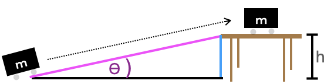
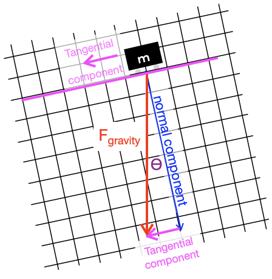
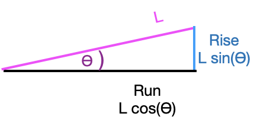
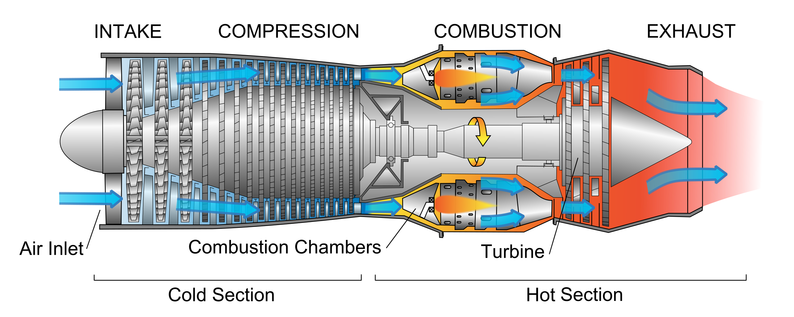
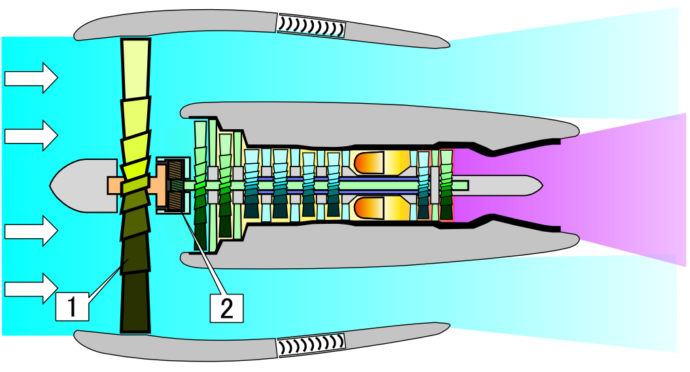

# Mechanics {#sec-mechanics}

```{r include=FALSE}
source("../starter.R")
```

In Block 2, we introduced the ideas of ***instantaneous rate of change*** and ***infinitesimal*** intervals of time. These are mathematical concepts introduced in the 17th century for describing motion. (In the 16th century, Galileo's measurements of motion involved averages over ***finite*** time intervals.) With this new mathematical tool, Newton understood that the velocity of an object is its instantaneous rate of change of position with respect to time, and to define acceleration as the instantaneous rate of change of velocity with respect to time. With these definition, Newton was able to connect motion to the palpable ***forces*** acting on objects. Thus was born the field of ***dynamics***, the study of forces and their effects on motion. 

In contrast, ***statics*** is about physical systems that do not change. A non-changing system is said to be in ***equilibrium*** or balance. Static systems are incredibly important in everyday life; a bridge that is not static is one that you do not want to cross! The equilibrium in a bridge is the balance between the downward force of gravity and the compressive and tensile forces in the materials that make up the bridge.

"***Mechanics***" is a catch-all term for the combination of statics and dynamics studied in physics and used in engineering and design. The sense of the word is the ***study of machines***, with the "-ic" signifying "practice of" in the sense of scientific, physics, mathematics, optics, chiropractic, and such. This starts with simple machines---simple devices that change the direction or strength of a force--- such as the lever, wheel and axle, pulley, inclined plane, wedge, and screw. Mechanics goes on to deal with more complicated machine components such as a gas-filled cylinder and piston, flywheel, valve, turbine, etc. Many concepts originally developed for the theory of machines are familiar, and intuitive to the modern mind: force, pressure, momentum. 

This chapter illustrates the central role of calculus concepts and methods in mechanics.

## Work

"Work" is a familiar, everyday concept, but a nuanced one; one person's work can be another person's play. In mechanics, ***work*** has a much more specific meaning stemming from the study of simple machines. A lever, for instance, can be used to move an object that is otherwise too heavy to handle. It still takes toil and effort to move the object, but the effort is eased by the mechanics of the lever.

Our intuitive sense of work is perhaps rooted in physiology: effort, fatigue, muscle pain. For instance, it takes work to pick up a heavy object, but it is also work to hold the object steady even without moving it. Generations of thinking about machines has brought us to a different notion of work that does not involve human subjectivity. In mechanics, holding an object steady, no matter how heavy, does not involve work. Although a human tasked to hold a heavy load will become exhausted, the same duty can be accomplished by placing the load on a table, completely eliminating the effort. In mechanics, work and motion go hand in hand; *without motion there is no mechanical work*.

The table holding the heavy load does no work. Work is done only when the load is moved, and the amount of work depends on how the load is moved. For instance, moving a block along level ground involves a lot of work, but pulling a cart filled with blocks can be almost effortless. In mechanics, work combines both the amount of motion and the force needed to accomplish the motion. 

> Work is force times displacement.

Consider, for instance, the work involved in lifting a mass $m$ to table height $h$. 

{width="40%"}

The lifting is accomplished by applying an upward force to counter the force of gravity. The gravitational force on the mass is $m g$, where $g$ is the instantaneous acceleration of an object released to fall freely (about 9.8 m/s^2^ near the Earth's surface). The distance traveled is $h$. So the work performed on the mass is $m g h$.

Notice that the mechanical work has nothing to do with the **speed** with which the mass is moved up to the table. Lift it fast or lift it slow, it amounts to the same mechanical work. (Of course, to human perception, lifting an object very slowly up to table height involves more effort than snapping it up quickly. But human effort is only peripherally related to mechanical work.)

Let's introduce a machine to the situation in the form of a ramp or a pulley.  The purpose of the machine is to ease human labor by changing the strength or direction of forces. You can perhaps intuit that rolling the mass up the ramp will be an easier task than lifting it. How so?

{width="80%" align="center"}

The ramp can be seen as a sort of partial table. The ramp does most of what's needed to hold the mass up. To keep the mass in place on the ramp the human worker need only supply a modest additional force parallel to the ramp surface. Calculating that modest additional force can be accomplished by a basic mathematical technique in mechanics: ***decomposing a vector***.

You  encountered vectors (in Section `r Sections$gradient_vector`) in the context of the ***gradient vector*** of a function, say, $f(x,y)$. At any given input $(x,y)$ the gradient vector, written $\nabla f(x,y)$, points in the steepest uphill direction of the function $f(x,y)$. Recall that the gradient vector was written as a set of values; the partial derivative of $f()$ with respect to each of its inputs in turn. That is, $$\nabla f(x,y) = \left({\large\strut} \partial_x f(x,y),\ \  \partial_y f(x,y)\right)\ .$$ In this representation, the vector $\nabla f(x, y)$ is **decomposed** into two components: $\partial_x f(x,y)$ and $\partial_y f(x,y)$.  

::: {#fig-ramp-decomposition}
{align="center"}


Decomposing the vector of gravitational force into two perpendicular components, one tangent to the ramp and the other perpendicular to it. 
:::

To decompose the vector of gravitational forces, we can place a coordinate grid over the gravity vector. In @fig-ramp-decomposition this grid has been arranged so that one cardinal direction is aligned with the ramp itself and the other is perpendicular---that is, "normal"---to the ramp. Merely by noting the coordinates of the gravitational vector in the coordinate grid, we decompose that vector into two components, one along the surface of the ramp and the other perpendicular to the ramp.


We return to the idea of vector decomposition in much more detail in Block 5 of this course; it has a major (though perhaps unexpected) role to play in fitting models to data. But for now, we will simply examine the right triangle in @fig-ramp-decomposition. In that right triangle, the gravitational force vector $F_{gravity} = m g$ is the hypotenuse. The component tangential to the ramp is $m \sin(\theta) g$. The worker pushing the mass up the ramp need provide only tangential component of force which is smaller than the force imposed on the worker picking up the mass without a ramp. Thus human effort is reduced by the machine.

What about the mechanical work? Is that also reduced? Remember that mechanical work is the product of force times distance. The force has been reduced to $m \sin(\theta) g$, but the distance $D_{ramp}$ along the ramp is much longer than the distance $h$ from floor to table top. 

{width=50% align="center"}

Again, referring to the ramp itself as a right triangle, you can see that $D_{ramp}\sin(\theta) = h$ or, $D_{ramp} = h / \sin(\theta)$.  The total mechanical work, the product of applied force times distance moved is $$m \sin(\theta) g \times D_{ramp} = m \sin(\theta) g \times \frac{h}{\sin(\theta)} = m g h\ .$$ The ramp does nothing to reduce the mechanical work needed to lift the mass!

We usually think of ramps as an inclined plane. But, from Blocks 1 to 3 we have the tools to figure out the work for a (smooth) ramp with any shape at all. We will do this not because odd-shaped ramps are encountered frequently, but to provide an example in a relatively familiar setting of some techniques we will use elsewhere in this chapter.

The ramp we have in mind has a surface whose height $f(x)$ is zero at the foot ($x=a$) and reaches $f(x=b) = h$ where it joins the table. 

{width=80% align="center"}

The slope of the ramp at any location $x$ is, as you know, $\partial_x f(x)$. It is helpful to convert this rise/run formulation of slope into the slope-angle form we used to study the simple ramp.  As you can see from the diagram, which zooms in on one place on the ramp, rise over run amounts to $L\sin(\theta) / L\cos(\theta) = \partial_x f(x) = \tan(\theta)$, with the result:
$$\theta = \arctan({\large\strut}\partial_x f(x))\ .$$
Consequently, the force that needs to be applied parallel to the ramp's surface is $m \sin(\arctan(\partial_x f(x))) g = m \sin(\theta) g$. To find the work done in pushing the mass an infinitesimal distance along the ramp we need to know the ***instantaneous length*** of the ramp. This is potentially confusing to the reader since we've already said that the distance is infinitesimal. As you know, infinitesimal is different from zero. We will write $dx$ as an infinitesimal increment along the floor, but the zoomed-in length $dL$ of the corresponding part of the ramp is the hypotenuse of a right triangle where one leg has length $dx$ and the other leg has length $\partial_x f(x) dx$: slope times distance. 


The hypotenuse of the infinitesimal segment of the ramp has length 
$dL = \sqrt{\strut dx + \partial_x f(x) dx}$, or $dL = \sqrt{\strut 1 + \partial_x f(x)}\ dx$. Things are a bit simpler if we write $dL$ in terms of the slope angle $\theta(x)$. Since $dx = \cos(\theta(x)) dL$, we know $dL = dx/\cos(\theta(x))$. Consequently the infinitesimal of work is $$dW \ = \ m g \frac{\sin(\theta(x))}{\cos(\theta(x))}\ dx\  = \ m g \tan(\theta(x)) dx \ .$$

The total work is the accumulation of $dW$ over the extent of the ramp. In other words, $$\int_a^b m g \tan(\theta(x))\ dx\ = \ \int_a^b m g \tan(\arctan(\partial_x f(x)))\ dx = \int_a^b m g \partial_x f(x) dx\ ,$$ where we've used the formula $\theta(x) = \arctan(\partial_x f(x))$. From the "fundamental theorem of calculus" we know that 

$$\int_a^b m g\ \partial_x f(x)\ dx \ = \ \left.m g \ f(x){\Large\strut}\right|_a^b = mg \left[\strut f(b) - f(a)\right] = mg h\ .$$

What's remarkable is that pushing the mass up the $f(x)$-shaped ramp involves an amount of work, $m g h$, that *does not depend on $f(x)$*, only on $f(b) - f(a)$, the net height comprised by the ramp.

We haven't yet said what this notion of work is good for and we've given no detailed justification for the definition of mechanical work as force times distance. You could imagine a dictatorial authority deciding to measure work as the square-root of force times distance squared. But ... that particular measure is not going to make sense if we think about the dimension of the quantity. Force has dimension [force] = M L T^-2^. Square root of force times length squared would have dimension [sqrt(force) $\times$ length-squared] = M^1/2^ L^5/2^ T^-2^. The non-integer exponents mean that this is not a legitimate physical quantity.

The dimension of force-times-length are straightforward: [force $\times$ length] = M L^2^ T^-2^, that is, ***energy***. The particular definition of work as force times length will make sense in the context of a more comprehensive mechanical theory of energy. The significance of energy itself is that, as a fundamental proposition of physics, the various forms of energy are interchangeable but ***conserved***; energy is neither created nor destroyed, just moved around from one form to another and one place to another.

::: {#thm-gravity-on-earth style="display: none;"}
::: 
::: {.callout-note icon=false}
## @thm-gravity-on-earth Lifting very high

Near the surface of the Earth, gravitational acceleration is approximately constant regardless of latitude or longitude. But gravity varies with distance $r$ from the Earth's center. Newton's law of universal gravitation gives the force on an object of mass $m$ due to the Earth's gravity as 
$$F = \frac{m M_e G}{r^2}$$ where $M_e = 5.972 \times 10^{24}$ kg is the mass of the Earth and $G = 6.674 \times 10^{-11}$ N m^2^ / kg^2^ is the universal gravitational constant. The Earth's radius is roughly $6,370,000$ m, so the force on a 1 kg object near the surface of the Earth is $F = 1 \text{kg} (5.972 \times 10^{24} \text{kg}) (6.674 \times 10^{-11})/ (6.37 \times 10^6 \text{m})^2$ N m^2^ kg^-2^. Carrying out the arithmetic and consolidating the units gives
$$F = 9.823 N$$ for the 1 kg object.

Suppose we want to lift the 1 kg object from the Earth's surface to 10000 km away, that is, to a distance of 1,6370,000 m from the center of the Earth. For the purpose of the example, we will ignore the gravitational force exerted by the Sun, Moon, planets, and other galaxies, etc. The work performed in the lifting is 

$$\int_{6.47\times 10^6}^{16.47\times 10^6} \frac{1 \text{kg}\ M_e\ G}{r^2}\ dr = -\left.  {\Large\strut}\frac{1 \text{kg}\ M_e\ G}{r}\right|_{6.47\times 10^6}^{16.47\times 10^6}$$ \\\ \\\ \\
$$= -\ 3.986 \times 10^{14}\left[\strut \frac{1}{16.47 \times 10^6} - \frac{1}{6.47 \times 10^6}\right] \text{N m} \\\ \\\ \\= 37,405,840\ \text{J}.$$

A Newton-meter (N m) is also known as a Joule (J), a unit of energy. With 37,000,000 J, you could toast about 2000 pieces of bread. (A toaster uses about 300 W of power and takes about 60 seconds to process a slice of bread. $\text{300 W} \times \text{60 s} = 18,000 \text{J}$.
:::


## Energy

Mechanical work, as discussed in the previous section, is a form of energy. When we lift a object, we put energy into the object. But we cannot say from examining the object how much work was done to place it on the table. The amount of work depends on how the object came to be on the table: lifted from the floor (positive work; force is positive upward, displacement is also positive upward) or perhaps lowered from a helicopter (negative work: force exerted by the cable is positive upward but the displacement is downward, therefore negative). We might call the work energy ***latent***, the word meaning "unobservable," "hidden," "concealed," "dormant." To have an operational meaning, the work-energy that we assign to an object at rest must be with respect to some "ground state." A convenient ground state here is to imagine the object resting on the ground. The assigned energy will then be the work that would have to be performed to raise the object to table height. Once at table height, the energy is again latent. 

How then to *measure* the work energy that is  latent in the object resting on the table? The idea is to return the object to its ground state, which we could do by lowering it---a negative displacement---to the ground, measuring the force needed to support the object (upward, so positive) and multiplying this by the displacement. 

Another idea for measuring the latent energy is to let the object fall freely back toward its ground state and see what changes about the object. Perhaps you have already caught on to what will happen: the object's speed increases steadily until the instant before it hits the ground. 

"Latent" is an apt but unusual word to express the energy imbued in the object resting on the table. We might equally say that the energy is "associated with position (at the height the table)," or we could call it "gravitational energy." The term that is  generally used is a near synonym of "latent." We call the energy of the stationary object on the table ***potential energy.*** More precisely it can be called ***gravitational potential energy*** to distinguish it from the potential energy created by other forms of work, for instance pulling apart magnets or electric charges or compressing a gas into a cylinder. 

There is also a form of energy associated with motion. We could call this "energy of motion," but the conventional term is ***kinetic energy***. (A dictionary definition of "kinetic" is "relating to or resulting from motion." so we might as well say simply that kinetic energy is "energy relating to motion.)

Velocity is a good way to observe motion. We can use dimensional analysis to anticipate how velocity and kinetic energy are related. Recall that energy has dimension M L^2^ T^-2^ and velocity has dimension L/T. Consequently, if an object's kinetic energy at any instant stems from its mass and its velocity, then the energy must be mass times velocity squared, perhaps multiplied by a scalar, that is:
$$E_{kinetic} = \alpha\, m v^2\ .$$

To find the scalar $\alpha$, we can use calculus and accumulation. We know that the acceleration of a free-falling object due to gravity is $-g$ (where the negative sign reflects the downward direction). Starting from rest (that is zero velocity so zero kinetic energy) the newly released mass will have a velocity that is the accumulated acceleration over time. In other words:
$$v(t) = \int_0^t - g\ dt = -\left.g \ t{\large\strut}\right|_0^t = -g\ t\ .$$
Correspondingly, the position at time $t$ will be the accumulated velocity:
$$x(t) = x(t=0) + \int_0^t v(t) dt \\ = 
h  + \int_0^t -g\ t\ dt$$
$$= h - \frac{1}{2} \left.g\ t^2{\Large\strut}\right|_0^t \ \ =\ \  h - \frac{1}{2} g\ t^2 \ .$$
The mass reaches the ground at time $t_g$ such that $h - \frac{1}{2} g\ t_g^2 = 0$. Solving this for $t_g$ gives $t_g = \sqrt{\strut 2 h/g}$.

Now that we know the time when the object reaches its ground state, we can calculate the velocity at that instant:
$$v(t_g) = -g\ t_g = - g\ \sqrt{\strut 2 h / g} = - \sqrt{\strut 2 g h}$$
As the object reaches its ground state, its gravitation potential energy is zero (because it is at the ground state) and, since total energy is conserved, the kinetic energy will be the same size as the potential energy at $t=0$ when the object was released from the table, that is

$$E_{kinetic}(t_g) = \alpha\ m\ v(t_g)^2 =
= \alpha\ m \left(\sqrt{\strut 2 g h\ }\ \right)^2 = $$

$$2 \alpha\, m g\,h\  = m\, g\, h = E_{potential}(t=0)$$

Solving $2 \alpha\ m\,g\,h = m\,g\,h$ gives $\alpha = \frac{1}{2}$. Thus, the kinetic energy as a function of mass $m$ and velocity $v$ is $\frac{1}{2} m\, v^2$.

::: {#try-how-fast style="display: none;"}
:::
::: {.callout-important icon=false}
## @try-how-fast ... getting there

In the previous section, we calculated the potential energy of a 1 kg object at an altitude of 10,000 km above the Earth's surface: 37,405,840 J. How fast would the 1 kg object need to be moving to have this much kinetic energy?

$$\frac{1}{2} (1 \text{kg}) v^2 = 37,\!405,\!840 \text{J} = 37,\!405,\!840 \ \text{kg}\ \text{m}^2\ \text{t}^{-2}$$

Solving for $v$ we get $v^2 = 2 \times 37,\!405,\!840 \text{kg}\ \text{m}^2\ \text{t}^{-2}\ \text{kg}^{-1}$ or $$v = 8649.4\ \text{m}/\text{s}\ ,$$ about eight-and-a-half kilometers per second.
:::

::: {#thm-work-without-movement  style="display: none;"}
---Mechanical work always involves movement, even when it doesn't seem like it.
:::
::: {.callout-note icon=false} 
## @thm-work-without-movement Work without movement?

@fig-dumbbell shows a simple exercise: holding a dumbbell out horizontally. 

::: {#fig-dumbbell}


Is he working even when the barbells are held still? Of course! [Photo source](https://www.coachmag.co.uk/exercises/dumbbell-exercises)

:::

As anyone who does this exercise can tell you, even when there is no movement of the dumbbell, there is a strong sense of work being done. Your muscle fatigues and, for most people, the dumbbells can be held in place for only a short time.

We've said that mechanical work always involves motion; no motion, no work. So how come the exercise feels like work even though the hands do not move?

To perform the exercise, you contract the muscles of the shoulder and upper arm. There is no skeletal joint that can be locked in place (unlike, say, the knee). It is only the muscle force that holds the arms in place.

On the size scale that we normally perceive, it can appear that nothing is moving during the exercise. But zoom in to the molecular scale to see the action by which force is generated by muscle. The functional unit of muscle force involves two proteins, actin and myosin, that interact in a complicated way. The animation (from the online textbook by Michael D. Mann, [*The Nervous System in Action*](https://michaeldmann.net/The%20Nervous%20System%20In%20Action.html), [chapter 14](https://michaeldmann.net/mann14.html)) shows the situation. The "head" of a myosin unit (red) acts like an oar. It attaches to a site on the actin molecule (orange) causing the head to contract and pull on the actin. Once contracted, a molecule of ATP (green sphere) binds to the myosin, releasing the head and preparing it for another stroke. ATP is an organic molecule that serves as a primary energy carrier and is found in all known forms of life. Transformation of ATP to ADP releases the energy. The ADP is then cycled, though other metabolic processes, back into ATP. This happens rapidly. Humans recycle approximately their own body weight in ATP each day.

::: {#fig-actin-myosin}


Animation of the generation of force by the interaction of actin and myosin, from *The Nervous System in Action*.
:::

When muscle is under tension, the actin can slip back in between strokes of the myosin head. Thus, a constant-length muscle in tension on a macroscopic scale is steadily consuming energy, in much the same way as an oarsman on an anchored boat can do work via the movement of oars against the water even when the boat itself is not moving.
:::


## Momentum

In the previous sections we looked at force $\times$ distance. Dimensional analysis showed that [force $\times$ distance] = [energy] and, in the setting of lifting an object and letting it fall back toward its ground state, we traced out the conversion of the energy of position ("potential energy") into the energy of velocity ("kinetic energy").

Now consider a somewhat different quantity: force $\times$ time. Dimensional analysis gives
$$\underbrace{M^1 L^1 \ T^{-2}}_\text{[force]}\  \times\ \underbrace{T}_\text{[time]} = \underbrace{M^1}_\text{[mass]} \underbrace{L^1 T^{-1}}_\text{[velocity]} $$
The product of force times time is dimensionally equivalent to the product of mass times velocity. The quantity is called ***momentum***. Newton's second law of motion, often written in terms of acceleration, $F = m a$, is more fundamentally written in terms of momentum: $F = \partial_t\, m\, v$. The ***conservation of momentum*** refers to the situation when outside forces on a system are nil. In such case, momentum of the system does not change with time; momentum is constant or "conserved." 

An example of such a system is a deep-space probe, sufficiently far from other matter that gravitational force is negligible. to speed up or slow down (or turn), the probe is made to throw out fast moving molecules of burnt fuel. These particles have "new" momentum, but since momentum of the whole system is conserved, the body of the probe gains "new" momentum in the opposite direction. This is the operating principle of the rocket engine.


::: {#fig-jet-engines layout-ncol=1}

  


A turbo*jet* engine uses air for combustion and emits a relatively low amount of mass at high velocity. A turbo*fan* engine uses a fan blade (1) to convert some of the combustion energy into a large mass of relatively slow velocity, unburnt air.
:::


Aircraft jet engines work in a similar matter, burning fuel to create energy. Whereas the force generated by a rocket engine is entirely produced by the newly created momentum of the burnt fuel, aircraft engines have an additional material to work with: air. The earliest jet engines, ***turbojet engines***, were small in diameter, bringing in air mainly as a fuel for combustion. (@fig-jet-engines (left)^[Source: Jeff Dahl, CC BY-SA 4.0, <https://commons.wikimedia.org/w/index.php?curid=3235265>] Today's more efficient engines are large diameter: ***turbofan engines***. (@fig-jet-engines (right)^[Source: <https://commons.wikimedia.org/wiki/File:Geared_Turbofan_NT.PNG>]) In addition to using air for combustion, they use large fan blades to convert the energy of combustion into a large mass of relatively slowly moving, uncombusted air. This moving air carries momentum; more than that contained in the fast moving particles generated directly through combustion.

## Center of mass {#sec-center-of-mass}

In considering a physical object of extended shape, it can be a great simplification to be able to treat the whole extended object as if it were a simple point object at a single location. For instance, @fig-galaxy-probe imagines a space probe (orange dot) coasting through the edge of a galaxy.

```{r echo=FALSE, warning=FALSE}
n <- 100
set.seed(103)
Stars <- tibble(
  x = rnorm(n),
  y = rnorm(n),
  x2 = runif(n,0.8, 0.9)*x - 0.2*y,
  y2 = runif(n, 0.8,0.9)*y + 0.2*x,
  x3 = runif(n,0.9,1)*x - 0.12*y,
  y3 = runif(n,0.9,1)*y + 0.12*x,
  x4 = runif(n, 0, .5)*x - 0.06*y,
  y4 = runif(n, 0, .5)*y + 0.06*x
) %>%
  mutate(x = x+1, y=y-.5, x2 = x2+1, y2=y2-0.5, 
         x3 = x3+1, y3 = y3 - .5, x4=x4+1, y4=y4-0.5)
P_galaxy <- gf_point(y ~ x, data = Stars, size=runif(n,.1, 2), color="yellow") %>%
  gf_point(y2 ~ x2, size=runif(n,.1, 2), color="yellow") %>%
  gf_point(y3 ~ x3, size=runif(n,.1, 2), color="yellow") %>%
  gf_point(y4 ~ x4, size=runif(n,.1,0.5), color="yellow") %>%
  gf_point(.9 ~ 1.9, size=3, color="orange") %>%
  gf_refine(coord_fixed()) +
  theme(panel.background = element_rect(fill = 'black', colour = 'white'))
```

::: {#fig-galaxy-probe}
```{r echo=FALSE, warning=FALSE}
P_galaxy
```

An imagined space probe (orange dot) on the outer edges of a galaxy.
:::

What is the gravitational attraction of the galaxy on the probe? One way to find this is by adding up the individual gravitational attractions of the individual stars. Another is to find the center of mass of the galaxy and calculate the force *as if* all the mass were at that point. The two calculations give the same answer. 

For the galaxy, the center of mass is located at a point $(\bar{x},\bar{y})$ where $$\bar{x} \equiv \sum_\text{galaxy} m_i x_i\ \ \ \text{and}\ \ \ \ \bar{y} \equiv \sum_\text{galaxy} m_i y_i$$

```{r echo=FALSE, warning=FALSE}
Boundary <- Blob1
Dots <- box_set(1 ~ x + y, Boundary, dx=0.1)

P1 <- gf_polygon(y ~ x, data=Boundary, fill="blue", alpha=0.2) %>%
  gf_refine(coord_fixed(), 
            scale_y_continuous(minor_breaks=seq(-2,2,by=.2)),
            scale_x_continuous(minor_breaks=seq(-2,2,by=.2))) 
P2 <- P1 %>%
  gf_rect((y-.04)+(y+.04) ~ (x-0.04) + (x+0.04), data = Dots, fill=NA, color="black", size=0.1)

P3 <- P1 %>%
  gf_rect(0 + 0.1 ~ (x-0.04) + (x+0.04), data = Dots, fill="black", alpha=0.05)

P4 <- P1 %>%
  gf_rect((y-.04)+(y+.04)  ~ 0 + 0.1, data = Dots, fill="black", alpha=0.05)
```


::: {#fig-shape1}
```{r echo=FALSE}
P1
```

An irregular shape used in the example. The $(x,y)$ coordinates of closely spaced points on the boundary are available as `Blob1` in the sandbox software.
:::

For a continuous shape, such as in @fig-shape1 (left) we can describe the center-of-mass calculation as an accumulation of the mass-density function $\rho(x, y)$ over the entire shape $S$. The mass of the object is the accumulation of mass-density itself
$$M = \int_\text{S} \rho(x,y)\ d\text{S}$$
while the components of the center of mass are the accumulation of $x\ \rho(x,y)$ and $y\ \rho(x,y)$, that is:
$$
\bar{x} = \int_\text{S} x\ \rho(x,y)\ d\text{S} / M\\
\bar{y} = \int_\text{S} y\ \rho(x,y)\ d\text{S} / M
$$
where $S$ refers to the whole object and $d$S is a differential of the object, that is, a tiny piece of the object. 

There are many ways to split an object up into differentials so that they can be accumulated to give the whole integral. One simple way, shown in @fig-shape1 (right), is to 
divide the object into a set of discrete, non-overlapping, adjacent rectangles (or cubes for a three-dimensional object). Then, as with adding up the stars, just add up $x \rho(x, y) d$S or $y \rho(x,y) d$S contained in each of the rectangular $d$A regions. For the rectangle located at $(x_i, y_i), the mass $m_i$ will be $m_i = \rho(x_i, y_i) d$S: density times area of each rectangle. This turns the integrals in Eq. \@ref(eq:cm-integral) into a sum:

$$\bar{x} \approx \sum_\text{rectangles} m_i x_i/ M\ \ \ \text{and}\ \ \ \ \bar{y} \approx \sum_\text{rectangles} m_i y_i / M$$ where $$M = \sum_\text{rectangles} m_i\ .$$

::: {#fig-shape1-blocks}
```{r echo=FALSE}
P2
```

A continuous shape can be approximated by a set of rectangles within the borders of the shape. Integrating over the shape is a matter of adding up across all of the rectangles the relevant quantity for each rectangle.
:::

For the center of mass calculation, the relevant quantity for $\bar{x}$ for each rectangle is the mass times the $x$-position. Similarly, for $\bar{y}$ the relevant quanty is the mass times the $y$-position.

::: {#fig-shape1-cm}
```{r echo=FALSE}
#| layout-ncol: 2
#| fig-subcap:
#| - $y$ component
#| - $x$ component
P4 
P3
```

For the $y$-component of the center of mass (left panel), the $x$-coordinate of each rectangle is irrelevant. It is as if all the rectangles were moved to $x=0$. Similarly for the $x$-component of the center of mass (right panel).
:::

<!-- a break -->

::: {#try-find-CM style="display: none;"}
:::
::: {.callout-important icon=false}
## @try-find-CM Center of mass

Compute the center of mass of the object `Blob1` shown in @fig-shape1, assuming the mass-density $\rho(x,y) = 10$.

The mass of the object is $$M = \int_\text{Blob1} \rho(x, y)\, dA$$
The $x$-component of the center of mass is

$$\bar{x} = \int_\text{Blob1} x \rho(x, y)\, dA / M$$
and similarly for $\bar{y}$.

To find the center of mass, we first need to know the total mass of the object. We will carry out the calculation by dividing the object into a series of rectangles, computing the mass of each rectangle, then adding together the masses. The R/mosaic function `box_set()` takes as input the density function, a data frame with points on the boundary of the object, and a size for the boxes, which we will set to $dx=0.1$. 

```{webr-r}
Boxes <- box_set(10 ~ x + y, Blob1, dx=0.1)
head(Boxes)
nrow(Boxes)
```

Each row of `Boxes` is one box. The `x` and `y` columns give the location of the center of that box, `dx` and `dy` are the lengths of the box sides in the $x$ and $y$ directions. The value ofthe function being accumulated is in the column labelled `.output.` column `dA` gives the area of each box (which is simply $dA = dx\, dy$).

As the notation $$\int_\text{Blob1} \rho(x, y) dx dy$$ suggests, to accumulate the results for the individual boxes we just multiply the `.output.` by `dA` and sum.

```{webr-r}
mass <- with(Boxes, sum(.output. * dA))
mass
```


Computing the $x$-component of the center of mass, $\bar{x}$, is much the same but now the function being integrated is $x \rho(x,y)$ instead of just $\rho(x,y)$:

```{webr-r}
Boxes2 <- box_set(10*x ~ x + y, Blob1, dx=0.1)
xbar <- with(Boxes2, sum(.output. * dA)) / mass
xbar
```


The $y$ component of the center of mass, $\bar{y}$ is computed almost identically, but substituting `10*y ~ x & y` as the function to be integrated. In the next line, we will tell `box_set()` to do the summation over all the boxes directly, instead of our having to do it with the `with(..., sum(.output. * dA))` command.

```{webr-r}
ybar <- box_set(10*y ~ x + y, Blob1, dx=0.1, sum=TRUE) / mass
ybar
```

:::

::: {.callout-tip}
Recall that the summation over the boxes provides an *approximation* to the integral. The quality of the approximation depends on the boxes being small enough. It is responsible to check the result by using smaller box size. (This involves more calculation, so be patient.)

::: {#lst-ybar .column-page-right}
```{webr-r}
ybar <- box_set(10*y ~ x + y, Blob1, 
                dx = 0.01, sum=TRUE) / mass
ybar
box_set(10*y ~ x + y, Blob1, dx = 0.001, sum=TRUE) / mass
```
:::

From this, we conclude that a box size `dx = 0.01` gives 4 digits precision, but `dx = 0.1` was not small enough.

Repeat the calculation for $\bar{x}$ to get the same precision:

::: {#lst-xbar}
```{webr-r}
xbar  <- box_set(10*x ~ x + y, Blob1, dx = 0.01, sum=TRUE) / mass
xbar
```
::: 

There is more than one way to describe the perimeter of an object, and the manner of integration has to be selected to match the description.
:::

Consider this shape that might be the design of a panel in a large sculpture. The panel will be cut out of 3mm thick sheet aluminum $x$ and $y$ are given in meters. In order for the panel to be balanced, it will be mounted at its center of mass

::: {#fig-panel-shape}
```{r echo=FALSE} 
top <- doodle_fun(~ x, seed=120)
bottom <- doodle_fun(~ x, seed=2894)
density <- makeFun(3 - x/2 ~ x)
ribbon <- tibble(
  x = seq(-1.5, 4, length=500),
  top = top(x),
  bottom = bottom(x)
)
P1 <- slice_plot(top(x) ~ x, bounds(x=-1.5:4), 
           label_text="top(x)", label_x=0.3, label_vjust=-1.3) %>%
  slice_plot(bottom(x) ~ x, label_text="bottom(x)", label_vjust=2.8, label_x = 0.4) %>%
  gf_ribbon(bottom + top ~ x, data = ribbon, inherit=FALSE) %>%
  gf_point(-5.43 ~ 1.72, shape="+", color="blue", size=10) %>%
  gf_labs(y = "y")
P1
```

A panel to locate center of mass
:::

The shape is defined by two functions, $f(x)$ and $g(x)$, one of which sets the top edge and the other the bottom edge. The side edges are defined by the leftmost and rightmost values of $x$. Here, that is  $x_\text{left} = - 1.5$ and $x_\text{right} = 4.0$.  

The ***area*** of the object can be found using the integration techniques from Block 3. For the purpose of finding the center of mass, we need to calculate the ***mass*** of the object. For 3mm sheet aluminum the density is about 8.1 kg/m^2^. Here, that is  simply $$\text{mass} = \int_{-1.5}^{4.0} 8.1 \left[\strut f(x) - g(x)\right] dx \approx 880 \text{kg}\ .$$

What about the center of mass? Because the shape is not described as a set of boxes, as we did earlier in this section, we need a way to perform the accumulation that uses only the information in the functions.

The differential $8.1 \left[\strut f(x) - g(x)\right] dx$ gives the mass of each vertical slice of the object, several of which are shown in $\color{magenta}{\text{magenta}}$ in @fig-cm-fun-diff. The tops and bottoms of those slices don't align exactly with the boundaries of the object. That is because we've drawn them at a finite width so that you can see them. But the actual differentials being accumulated will have negligible width, and so will fit exactly.

::: {#fig-cm-fun-diff warning=FALSE}
```{r echo=FALSE, warning=FALSE}
slices <- tibble(
  x = c(-1.3, -.4, 1.2, 2.8, 3.6),
  xend = x+0.1,
  top = top(x),
  bottom = bottom(x),
  middle = (top + bottom)/2
)
P1 %>%
  gf_rect(bottom + top ~ x + xend, data = slices, color="magenta", inherit=FALSE, fill=NA) %>%
  gf_segment(middle + middle ~ x + xend, data=slices, color="blue")
```

The panel can be divided into vertical slices, a few of which are shown here. The vertical mid-point of each slice is marked with a blue dash. Accumulating the slices' mid-point coordinates times the slices' mass, and dividing by the panel's mass, gives the $y$-component of the center of mass.
:::

The horizontal positions of the vertical slices are given by $x$. The $x$-component of the center of mass of each individual vertical slice will be 
$$x \left[\strut \text{top}(x) - \text{bottom}(x)\right] dx\ .$$
The center of mass of the entire object will be the accumulation 
$$\bar{x}= \frac{1}{\text{mass}}\int_{-1.5}^{4.0} x\ \text{density} \left[\strut \text{top}(x) - \text{bottom}(x)\right] dx \approx 1.72 \text{m}\ .$$

Finding the $y$-component of the center of mass could be done in a similar way, by constructing *horizontal* slices. However, we would have to calculate the functions $\text{left}(y)$ and $\text{right}(y)$ that bound each slice.

An easier way is to find the vertical center of each slice. For a slice at position $x$, the vertical center is $$y_{\text{mid}}(x) \equiv\left[\strut \text{top}(x) + \text{bottom}(x)\right]/ 2\ ,$$ the average of the top and bottom positions. (These are marked in $\color{blue}{\text{blue}}$ in @fig-cm-fun-diff.)
The $y$-component of the center of mass is 
\begin{eqnarray}
\bar{y} &=& \frac{1}{\text{mass}} \int_{-1.5}^{4.0} \text{density}\ y_\text{mid}(x)\ \left[\strut \text{top}(x) - \text{bottom}(x)\right] dx = \\ 
&=&\frac{1}{\text{mass}} \int_{-1.5}^{4.0} \text{density}\ \frac{\left[\strut \text{top}(x) + \text{bottom}(x) \right]}{2}\ \left[\strut \text{top}(x) - \text{bottom}(x)\right] dx =\\
&=&\frac{1}{\text{mass}} \int_{-1.5}^{4.0} \text{density}\ \frac{\left[\strut \text{top}(x)^2 - \text{bottom}(x)^2 \right]}{2}\ \approx -5.43 \text{m}\ .
\end{eqnarray}

The center of mass, $(x=1.72, y=-5.43)$, is plotted as $\color{blue}{\Large\mathbf{\text{+}}}$ on the object.

## Angular momentum and torque

The relationship between force and momentum is familiar:
$$F = \partial_t\, m\, v =\ \underbrace{m \ \partial_t\  v}_\text{if mass is constant}\ .$$ Of course, the derivative of velocity with respect to time is also called "acceleration."

Consider the following situation. A space probe is being acted on by a constant force, as in @fig-probe-constant. The mass of the probe is $m$, the thrust from the rocket engine provides the force $F$.  Starting from velocity $\partial_t y(t=0)$ and position $y(t=0) = 0$, the thrust produces an acceleration $\partial_{tt} y(t) = F/m$. Integrating the acceleration gives the velocity as a function of time 
$$\partial_t y(t) = \frac{F}{m} t + C\ .$$

::: {#fig-probe-constant}
{width=50%}

A space probe accelerating along a linear course. The position at time $t$ can be written as $y(t)$ or as $\theta(t)$.
:::

The function $y(t)$ is not the only way to represent where the probe is as a function of $t$. Suppose that the probe is being observed by a telescope which measures the angle $\theta(t)$ with respect to the equatorial plane. If the distance to the probe is $D(t)$, then the pair $\left(\strut\theta(t), D(t)\right)$ gives the position of the probe. As $y(t)$ increases, so do $\theta(t)$ and $D(t)$.

We know the laws of motion in terms of $y(t)$. Can we translate these laws to an expression in terms of $\theta(t)$ and $D(t)$? That is, can we find the function $$\partial_{t} \theta(t) = {\Large ?}$$
If we can find the laws of motion in terms of $\theta(t)$ and $D(t)$, we will have a way to describe the motion of spinning bodies.

::: {#fig-probe-constant-orig}
```{r echo=FALSE}
Arc1 <- tibble(
  theta = seq(0, atan2(.6, .9+.75), length=50),
  x = -0.75 + 1*cos(theta),
  y = 1*sin(theta)
  )
Arc2 <- tibble(
  theta = seq(0, atan2(1.9, .9+.75), length=50),
  x = -0.75 + 1.3*cos(theta),
  y = 1.3*sin(theta)
)

P1 <- gf_point(1.9 ~ .9, size=3, color="orange") %>%
  gf_text(1.9 ~ .9, label="t=10", hjust=-0.6, color="blue") %>%
  gf_segment(1.7 + 1.85 ~ .9 + .9, color="red", arrow=arrow(type = "closed", ends="last", angle=10 )) %>%
  gf_vline(xintercept = ~0.9, linetype="dashed") %>%
  gf_lims(x=c(-1.5,1.3), y=c(-0.5,2.3)) %>%
  gf_point(0.0 ~ -0.75, color="green", size=8) %>%
  gf_point(0 ~ .9, size=3, color="orange") %>%
  gf_segment(-.15 + -.05 ~ .9 + .9, color="red", arrow=arrow(type = "closed", ends="last", angle=10 )) %>%
  gf_vline(xintercept = ~0.9, linetype="dashed") %>%
  gf_text(0 ~ 0.9, label="t=0", hjust=-1) %>%
  gf_text(-.3 ~ .9, label="F", hjust=-1, color="red") %>%
  gf_point(.6 ~ .9, size=3, color="orange") %>%
  gf_segment(.35 + .55 ~ .9 + .9, color="red", arrow=arrow(type = "closed", ends="last", angle=10 )) %>%
  gf_vline(xintercept = ~0.9, linetype="dashed") %>%
  gf_text(.6 ~ 0.9, label="t=5", hjust=-1, color="magenta") %>%
  gf_segment(0 + 0 ~ -0.75 + 0.9, linetype="dotted") %>%
  gf_segment(0 + .6 ~ -0.75 + 0.9, linetype="dotted") %>%
  gf_segment(0 + 1.9 ~ -0.75 + 0.9, linetype="dotted") %>%
  gf_path(y ~ x, color="magenta", data = Arc1, 
          size=2, alpha=0.3) %>%
  gf_path(y ~ x, color="blue", data = Arc2, 
          size=2, alpha=0.3) %>%
  gf_text(.75 ~ .4, 
          label='theta(t=10)', 
          color="blue", angle=40) %>%
  gf_text(.2 ~ .25,
          label='theta(t=5)', 
          color="magenta", angle=8) %>%
  gf_text(0 ~ 0.13, label="D(t=0)", vjust=1.3) %>%
  gf_text(.4 ~ .10, label="D(t=5)", angle=16) %>%
  gf_text( 1 ~ 0, label="D(t=10)", angle=54) %>%
  gf_refine(coord_fixed())
P1
```

A space probe (orange) accelerating in a straight line, but observed as a change in angle $\theta$ seen from a planet (green).
:::

The derivation of $\partial_{t} \theta(t)$ will not be obvious, but you will be able to see how calculus operations come into play.

Three points in the diagram describe a right triangle: 
 the probe's position at $t=0$, the center of the planet, and the probe's position at time $t$. The length of the horizontal leg of the triangle is $D(t=0)$ which not a function of time, so we will
drop the unnecessary parentheses and write it as $D_0$. The vertical leg has length $y(t)$, and the hypotenuse has length $D(t)$. The Pythagorean theorem tells us that $$D(t)^2 = y(t)^2 + D_0^2\ .$$

Step 1: Differentiate both sides with respect to $t$: $$\partial_t \left[\strut D(t)^2\right] = \partial_t \left[\strut y(t)^2\right] \ . $$ Using the chain rule and the fact that $D_0$ does not depend on $t$, gives
$$2\, D(t)\, \partial_t D(t) = 2\, y(t)\ \partial_t y(t)\ \ \implies\ \ \partial_t y(t) = \frac{D(t)}{y(t)}\,\partial_t D(t)\ .$$

Step 2: Trigonometry allows us to see a relationship among the functions $y(t)$, $\theta(t)$, and $D(t)$:

$$y(t) = D(t) \sin\left(\strut\theta(t)\right) \ .$$
Plugging this form of $y(t)$ into the equation for $\partial_t y(t)$ in Step 1 produces $$\partial_t y(t) = \frac{1}{\sin(\theta(t))} \partial_t D(t)$$
and 
$$D_0 = D(t) \cos\left(\strut\theta(t)\right)\ \ \implies\ \ D(t) = \frac{D_0}{\cos\left(\strut\theta(t)\right)}$$


Step 3: Another fact from trigonometry is that $$D(t) = D_0/\cos(\theta(t))\ .$$ Differentiating both sides (chain rule again!) with respect to $t$ gives another form for $\partial_t D(t)$:
$$\partial_t D(t) = D_0\, \partial_t \left(\frac{1}{\cos\left(\strut\theta(t)\right)}\right) = D_0 \frac{\sin\left(\strut\theta(t)\right)}{\cos\left(\strut\theta(t)\right)^2}\, \partial_t \theta(t)$$

Step 4: Combining the results from Steps 1 and 3 gives
$$\partial_t y(t) =  \frac{1}{\sin\left(\strut\theta(t)\right)}D_0 \frac{\sin\left(\strut\theta(t)\right)}{\cos\left(\strut\theta(t)\right)^2}\, \partial_t \theta(t)\ .$$ 
Cancelling out the $\sin(\theta(t))$ terms and remembering that $\partial_t y(t) = \frac{F}{m} t$ gives

$$\frac{F}{m} t = \frac{D_0}{\cos\left(\strut \theta(t)\right)^2}\, \partial_t\theta(t) $$
Multiplying both sides by $D_0$ and recalling that $D(t) = D_0/\cos(\theta(t))$ we arrive at
$$\frac{F D_0}{m} t = \frac{D_0^2}{\cos\left(\strut \theta(t)\right)^2}\, \partial_t\theta(t) = D(t)^2 \partial_t \theta(t)\ . $$


Again re-arranging to find $\partial_t\, \theta(t)$:
$$\partial_t\,\theta(t) = \frac{F\, D_0}{m D(t)^2}\ t\ .$$

To summarize, we have two equivalent expressions for the dynamics of the space probe:

$$\partial_t y(t) = \frac{\overbrace{\ F}^\text{force}}{\underbrace{M}_\text{mass}} t \ \ \text{and}\ \ \partial_t \theta(t) = \frac{\overbrace{F\, D_0}^\text{torque}}{\underbrace{m D(t)^2}_\text{moment of inertia}}\ t\ .$$
In rectangular $(x,y)$ coordinates, the velocity is the accumulation of force divided by mass: the usual statement of Newton's second law of motion. In the angular coordinates $(\theta, D)$ the angular velocity is the accumulation of ***torque*** divided by ***moment of inertia.

The angular coordinate representation is helpful when studying the ***rotation*** of objects. To illustrate, imagine a different configuration for the system than that in in @fig-probe-constant where the space probe was free to accelerate in a straight line. Instead, suppose the rocket is mounted on a carousel, that is a wheel whose axle goes through the center as in @fig-rocket-on-disk.

::: {#fig-rocket-on-disk}
{width=40%}

The space probe mounted on a rigid wheel that can spin around its center.
:::

In the rocket-on-wheel configuration, $D(t)$ is a constant; the rocket stays the same distance from the center. Therefore, the moment of inertia is $m D_0^2$. Following the previous formula, $$\partial_t \theta(t) = \frac{F D_0}{m D_0^2} t$$ which is easily differentiated to give the ***angular acceleration*** $$\partial_{tt} \theta(t) = \frac{F D_0}{m D_0^2}\ .$$

In a typical wheel, there is mass density throughout the wheel, not just at distance $D_0$. To find the moment of inertia of such a distributed mass system, break the wheel down into small pieces and find the moment of inertia due to each bit. Then accumulate the pieces' moments of inertia to find the total moment of inertia:

$$\text{moment of inertia} = \int_\text{wheel} \rho(x,y) \left(\strut x^2 + y^2\right) d \text{wheel}\ .$$

::: {#try-blob1 style="display: none;"}
:::
::: {.callout-important icon=false}
## @try-blob1 Calculating the moment of inertia
Compute the moment of inertia of `Blob1`.

It is not enough to say, "compute the moment of inertia." We also have to specify what is the reference location---the wheel axle in the configuration. We will first do the calculation around the center of mass $(\bar{x}, \bar{y})$ which we computed earlier as `xbar` and `ybar`. (Make sure you have run the code in Interactive R chunks [-@lst-xbar] and [-@lst-ybar] before running this code.)

::: {.column-page-right}
```{webr-r}
# moment of inertia
box_set(10*((x - xbar)^2 + (y-ybar)^2)~ x + y, 
        Blob1, dx = 0.01, sum=TRUE) 
```
:::

:::

