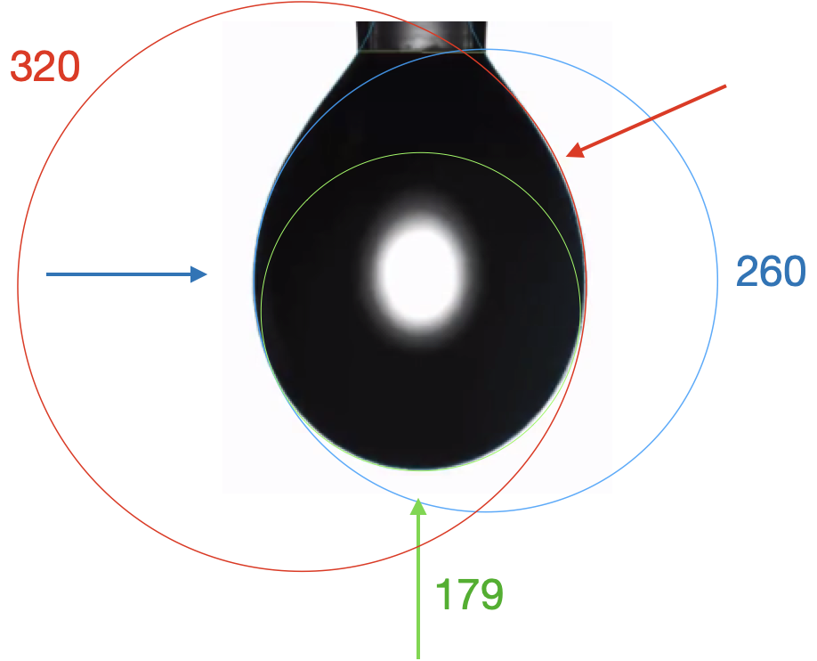

# Pressure, flow, and buoyancy

`r under_construction()`

## Pressure and buoyancy

* pressure times volume has dimension work. Cylinder being compressed.
* pressure from gravity.  solid column principal: holding up the weight above. Equal pressure at all points at the same level.
* droplet shape.  Curvature gets smaller as depth increases.
* In the world: [Grain silo](https://thumbs.dreamstime.com/b/old-silos-old-silos-southern-wisconsin-111890525.jpg)
```{r grain-silo, echo=FALSE, fig-cap: "Compression straps on a grain silo spaced more closely toward the bottom of the silo, where the pressure of the stored grain is higher.", out-width: "30%", fig-align: "center"}

```

## Bouyancy

* buoyancy integration. Center of buoyancy.
* math in the world: stability of a ship.

Add inversion via interpolation to splines chapter.  Divide up into 1-1 segments.  Then pick up on this again in probability chapter to generate random numbers with a given distribution.  Wave-packet shaped distribution.


## TAKEN OUT? Engineering and physics

Generations of engineering and science courses have encountered calculus as part of their studies. There is a very good reason for this, even though it may not be apparent from the many calculus courses that put much too much emphasis on "slopes" and "areas." Slope and area are, obviously two different kinds of quantities with different dimension (area is L$^2$ and slope is dimensionless, rise over run, $L/L$). The development of calculus was an essential step in sorting out the many other kinds of quantities that are needed to describe the physical world and making it clearer how these various quantities are related to one another via differentiation and accumulation, or, to use more everyday words: ***division*** and ***multiplication***.

To illustrate, consider the situation in the 16th century. The science of machines tried to illuminate how arrangements such as a lever or a ramp work. How hard do you have to press on one end of a lever to raise a weight on the other end? How much effort does it take to raise that weight by a given distance? And how is this related to the thump made by the weight when it is pushed off its perch on the raised end of the lever.

A hallmark of the emergence of science in the 17th, 18th, and 19th centuries was the replacement of everyday concepts like "how hard," or "how much effort," or "thump" by specific technical terms and the relationships among them. Nowadays, most of these technical terms sound familiar even to the untrained mind. A challenge for the student setting out in science and engineering is to learn the specific meaning of each term and how it is related to other terms.

A good starting in meeting the challenge can be consider some of the common physical quantities of the worlds of engineering and physics and the words used to name those quantities. Check first if the word is familiar to you, then ask a non-technically oriented friend if he or she knows the word and, if so, can put the word in the context of the other quantity words. Here's a list of a score of such quantities:

flow     velocity     momentum     force     mass     pressure

energy     acceleration     work     stress     displacement     strain

heat     temperature     electrical charge     electrical current

resistance     capacitance     viscoscity     inductance

Often, we have a physical sense of the meaning of a quantity. For instance, honey has higher viscosity than motor oil, which in turn is more viscous than water. But what kind of *quantity* is viscosity?

Dimensional analysis is a fundamental framework for organizing such quantities and putting them in relationship to one another. As you know, the dimension of a physical quantity can be represented by a set of integers: one for time T, one for mass M, one for length L, one for electrical charge, C. So a possible dimension is T$^{-1}$M$^{0}$L^{0}$C^1$ which corresponds to electrical current. Another dimension, which we call "force," is T$^{-2}$M$^{1}$L$^{1}$C$^0$, still another is  T$^{-2}$M$^{1}$L$^{1}$C$^{-1}$ which corresponds to "voltage."


## Droplet shape

Figure \@ref(fig:droplet) shows a photograph of a small droplet. [Source](https://upload.wikimedia.org/wikipedia/commons/f/fd/Surface_tension_Attension_Theta.png). The droplet is **roughly** spherical in shape. Near the top, the shape is governed by the diameter of the cylindrical pipette from which the drop is suspended. Away from that attachment point, the curvature is a balance between the liquid's surface tension---which holds it together---and the pressure of the liquid inside. The pressure increases linearly with distance from the attachment point.

Three tangent circles have been drawn at each of the arrows. The tangent circle highest up is largest in radius. The radius of the tangent circle gets smaller with the vertical position of the point of tangency.


```{r echo=FALSE}
#| label: fig-droplet
#| fig-cap: "Analyzing the shape of the surface of a droplet. The radius of curvature of the droplet is smaller where the pressure is higher, near the bottom of the droplet."

```

## Flow and pressure

Poiseuille Flow: laminar flow in a pipe with velocity u(r) and p(x).

$$\frac{1}{r}\frac{\partial}{\partial r}\left(r \frac{\partial u}{\partial r}\right)= \frac{1}{\mu} \frac{\mathrm{d} p}{\mathrm{d} x}$$
implying that both terms must be the same constant. Evaluating this constant is straightforward. If we take the length of the pipe to be $L$ and denote the pressure difference between the two ends of the pipe by $\Delta p$ (high pressure minus low pressure), then the constant is simply $-\mathrm{d}p/\mathrm{d}x = \Delta p/L= G$ defined such that $G$ is positive. The solution is  $$u = -\frac{Gr^2}{4\mu} + c_1 \ln r + c_2 $$

Since $u$ needs to be finite at $r = 0$, $c_1 = 0 $. The no slip [[boundary condition]] at the pipe wall requires that $u = 0$ at $r = R$ (radius of the pipe), which yields $c_2 = GR^2/(4\mu).$ Thus we have finally the following [[Parabola|parabolic]] [[velocity]] profile:

$$u = \frac{G}{4\mu} (R^2 - r^2).$$

The maximum velocity occurs at the pipe centerline ($r=0$), ${u}_{\rm max}=GR^2/(4\mu)$. The average velocity can be obtained by integrating over the pipe [[Cross section (geometry)|cross section]],
$${u}_\mathrm{avg}=\frac{1}{\pi R^2} \int_0^R 2\pi ru  \mathrm{d}r = \frac{1}{2} {u}_\mathrm{max}.$$

The easily measurable quantity in experiments is the volumetric flow rate $Q=\pi R^2 {u}_\mathrm{avg}$. Rearrangement of this gives the Hagen–Poiseuille equation $$\Delta p  = \frac{8\mu Q L}{\pi R^4}.$$ [the above is a quote from Wikipedia: https://en.wikipedia.org/wiki/Hagen%E2%80%93Poiseuille_equation]

[For ideal, isothermic gasses] $$Q_2 =\frac{\pi R^4}{16 \mu L} \left( \frac{{ p_1^2-p_2^2}}{p_2}\right) = \frac{\pi R^4 ( p_1-p_2)}{8 \mu L}  \frac{( p_1+p_2)}{2 p_2}.$$

This equation can be seen as Poiseuille's law with an extra correction factor $\frac{p_1 + p_2}{2\,p_2}$ expressing the average pressure relative to the outlet pressure.

**Medical application** (also from wikipedia): The Hagen–Poiseuille equation is useful in determining the vascular resistance and hence flow rate of intravenous (IV) fluids that may be achieved using various sizes of peripheral and central cannulas. The equation states that flow rate is proportional to the radius to the fourth power, meaning that a small increase in the internal diameter of the cannula yields a significant increase in flow rate of IV fluids. The radius of IV cannulas is typically measured in "gauge", which is inversely proportional[dubious – discuss] to the radius. Peripheral IV cannulas are typically available as (from large to small) 14G, 16G, 18G, 20G, 22G, 26G. As an example, the flow of a 14G cannula is typically around twice[citation needed] that of a 16G, and ten times[citation needed] that of a 20G. It also states that flow is inversely proportional to length, meaning that longer lines have lower flow rates. This is important to remember as in an emergency, many clinicians favor shorter, larger catheters compared to longer, narrower catheters. While of less clinical importance, an increased change in pressure (∆p) — such as by pressurizing the bag of fluid, squeezing the bag, or hanging the bag higher (relative to the level of the cannula) — can be used to speed up flow rate. It is also useful to understand that viscous fluids will flow slower (e.g. in blood transfusion).


flow = volume per second === same as === area times velocity

## Reynolds number

With respect to [[laminar flow|laminar]] and [[turbulence|turbulent flow]] regimes:
* laminar flow occurs at low Reynolds numbers, where viscous forces are dominant, and is characterized by smooth, constant fluid motion;
* turbulent flow occurs at high Reynolds numbers and is dominated by inertial forces, which tend to produce chaotic [[Eddy (fluid dynamics)|eddies]], [[Vortex|vortices]] and other flow instabilities.<ref name="Hall2015" />

The Reynolds number is defined as{{sfn|Sommerfeld| 1908|pp=116–124}}

$$\mathrm{Re} =\frac{u L}{\nu} = \frac{\rho u L}{\mu}$$

where:
* $\rho$ is the [[density]] of the fluid ([[SI units]]: kg/m<sup>3</sup>)
* $u$ is the [[flow speed]] (m/s)
* $L$ is a characteristic linear dimension (m) (see the below sections of this article for examples)
* $\mu$ is the [[dynamic viscosity]] of the [[fluid]] (Pa·s or N·s/m<sup>2</sup> or kg/(m·s))
* $\nu$ is the [[kinematic viscosity]] of the [[fluid]] (m<sup>2</sup>/s).

## Bouyancy and stability

See illustration at <https://en.wikipedia.org/wiki/Buoyancy#Simplified_model>

1. Semi-circle: $x^2 + (y+b)^2 = r^2$ so $y = \sqrt{\strut r^2 - x^2} - b$

2. Find domain where $y\leq 0$: $$b^2 = r^2 - x^2 \implies x = \pm \sqrt{\strut r^2 - b^2}$$

3. Pressure is $-\rho\, g\, y$. Does this have the right dimension?
    * Pressure has dimension Force per area $M L^{-1} T^{-2}$
    * $[\rho] = M L^{-3}$,
    * $[\rho g] = M T^{-2} L^{-2}$
    * So $[\rho\,g\,y] = M T^{-2} L^{-1}$, same as pressure!

4. Find the submerged area of a slice. $$A = - \int_{x_l}^{x_r} \left[\sqrt{\strut r^2 - x^2} + b\right]\ dx$$

```{r echo=FALSE}
#| label: fig-boat1
#| fig-cap: "A ship" 
# Optionally: put a sine in front of it to get a better flat-bottomed shape.
shape <- makeFun(sin(sqrt(r^2 - x^2)) - b ~ x + b, r=1, b=0.5)

bottomPts <- tibble(x = seq(-0.99,0.999,length=200),
                    y = shape(x))
theta <- pi/15
rotmat <- matrix(c(cos(theta), sin(theta), -sin(theta), cos(theta)), nrow=2)
rotPts <- as_tibble(as.matrix(bottomPts) %*% rotmat)
names(rotPts) <- names(bottomPts)
gf_point(y ~ x, data = rotPts %>% mutate(y=-y)) %>%
  gf_refine(coord_fixed())

bottom <- spliner(y ~ x, data=rotPts)
very_bottom <- rotPts %>% filter(y == max(y)) %>%
  filter(row_number()==1)

fLeft <- spliner(x ~ y, data = rotPts %>% filter(x <= very_bottom$x))
fRight <- spliner(x ~ y, data = rotPts %>% filter(x >= very_bottom$x))

boat_width <- makeFun(fRight(y) - fLeft(y) ~ y)

# x where boat hull is at waterline
left <- fLeft(0)
right <- fRight(0)
dom <- domain(x=c(left,right))


xs <- seq(right, left, len=100)
Water <- tibble(
  x=c(left, -1.2, -1.2, 1.2, 1.2, right, xs),
  y=c(     0,    0, -0.75,-0.75,   0,     0, -bottom(xs))
)
Displacement <- tibble(
  x=c(left, right, xs),
  y=c(     0,     0, -bottom(xs))
)

# area of slice below waterline
area <- Integrate(bottom(x) ~ x, domain=dom)


CBx <- Integrate(x*bottom(x) ~ x, domain=dom) / area
CBy <- Integrate(y*boat_width(y) ~ y, domain(y=0:very_bottom$y)) / area


slice_plot(-bottom(x) ~ x, domain(x=-1:1), npts=200) %>%
  gf_refine(coord_fixed()) %>%
  gf_polygon(y ~ x, data = Water, fill="blue", color=NA, alpha=0.25) %>%
  gf_polygon(y ~ x, data = Displacement, fill="orange", color=NA, alpha=0.25) %>%
  gf_lims(y=c(-.75,1)) %>%
  gf_hline(yintercept=~ -0.49, color="red") %>%
  gf_labs(y="y (water surface=0)", x="x") %>%
  gf_point(-CBy ~ CBx)


slope <- D(bottom(x) ~ x)


angle <- makeFun(atan(slope(x)) ~ x)
len <- makeFun(sqrt(1+slope(x)^2) ~ x)
vert_component <- makeFun(cos(angle(x)) ~ x)
horiz_component <- makeFun(sin(angle(x)) ~ x)
upward_force <- Integrate(len(x)*bottom(x)*vert_component(x) ~ x, dom)
upward_force
area
```


Also show that left-to-right force is zero, by integrating up but using the sin() component of the normal force.

Then find the center of gravity and the center of bouyancy.

## Similitude

See Wikipedia https://en.wikipedia.org/wiki/Similitude submarine example:

Consider a submarine modeled at 1/40th scale. The application operates in sea water at 0.5 °C, moving at 5 m/s. The model will be tested in fresh water at 20 °C. Find the power required for the submarine to operate at the stated speed.

A free body diagram is constructed and the relevant relationships of force and velocity are formulated using techniques from continuum mechanics. The variables which describe the system are:

Variable	Application	Scaled model	Units
L (diameter of submarine)	1	1/40	(m)
V (speed)	5	calculate	(m/s)
{\displaystyle \rho }\rho  (density)	1028	998	(kg/m3)
{\displaystyle \mu }\mu  (dynamic viscosity)	1.88x10−3	1.00x10−3	Pa·s (N s/m2)
F (force)	calculate	to be measured	N   (kg m/s2)
This example has five independent variables and three fundamental units. The fundamental units are: meter, kilogram, second.[1]

Invoking the Buckingham $\pi$ theorem shows that the system can be described with two dimensionless numbers and one independent variable.[2]

Dimensional analysis is used to rearrange the units to form the Reynolds number ($R_{e}$) and pressure coefficient ($C_{p}$). These dimensionless numbers account for all the variables listed above except $F$, which will be the test measurement. Since the dimensionless parameters will stay constant for both the test and the real application, they will be used to formulate scaling laws for the test.

Scaling laws:

$$R_{e}=\left({\frac {\rho VL}{\mu }}\right)\longrightarrow V_{\text{model}}=V_{\text{application}}\times \left({\frac {\rho _{a}}{\rho _{m}}}\right)\times \left({\frac {L_{a}}{L_{m}}}\right)\times \left({\frac {\mu _{m}}{\mu _{a}}}\right)$$

$$C_{p}=\left({\frac {2\Delta p}{\rho V^{2}}}\right),F=\Delta pL^{2}\ \ \ \ \ \longrightarrow F_{\text{application}}=
F_{\text{model}}\times \left({\frac {\rho _{a}}{\rho _{m}}}\right)\times \left({\frac {V_{a}}{V_{m}}}\right)^{2}\times \left({\frac {L_{a}}{L_{m}}}\right)^{2} .$$


The pressure ($p$) is not one of the five variables, but the force ($F$) is. The pressure difference ($\Delta p$) has thus been replaced with ($F/L^{2}$) in the pressure coefficient. This gives a required test velocity of:

$$V_{\text{model}} =V_{\text{application}}\times 21.9 .$$
A model test is then conducted at that velocity and the force that is measured in the model ($F_\text{model}$) is then scaled to find the force that can be expected for the real application ($F_\text{application}$):

$$F_{\text{application}}=F_{\text{model}}\times 3.44 .$$
The power {$P$} in watts required by the submarine is then:

$$P[{\mathrm  {W}}]=F_{{\text{application}}}\times V_{{\text{application}}}=F_{{\text{model}}}[{\mathrm  {N}}]\times 17.2\ {\mathrm  {m/s}}$$
Note that even though the model is scaled smaller, the water velocity needs to be increased for testing. This remarkable result shows how similitude in nature is often counterintuitive.


## Gases

Ideal gas law. PV is energy, units of $k$. See <https://en.wikipedia.org/wiki/Ideal_gas_law#Combined_gas_law>


## Exercises

