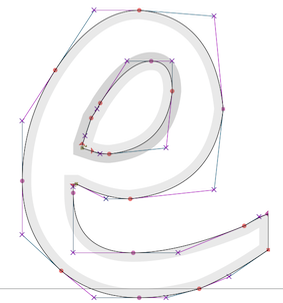

# Data-driven functions {#sec-splines}

<!-- The app for drawing bezier curves is at http://www.mosaic-web.org/bezier-app.svg  There is a copy in the www/ subdirectory of this folder, but that needs to be copied to 
www.mosaic-web.org/bezier-app.svg for the links to work. -->


As early as Chapter 3 of this book, we noted that a function can be described as a table where each row stands for one set of input values together with a corresponding output value. We did not, however, make much use of the table-as-function concept. Instead, we used data tables to motivate the choice of parameters, as in linear combinations of the basic modeling functions. We called this ***function fitting***: constructing a function that stays **near** the data values. (We will say more about function fitting in Block 5 where we introduce new tools for treating functions as geometrical objects.) 


This chapter introduces yet another important method for constructing functions that match with data. What's different here is that each data point will be a **mandate**; the function is required to go through each and every data point exactly.

## Generating smooth motion

As a motivating example, consider the programming of robotic arms as in the video:

<iframe width="560" height="315" src="https://www.youtube.com/embed/0L7Xk5_s3QQ?start=81" title="Robotic arms" frameborder="0" allow="accelerometer; autoplay; clipboard-write; encrypted-media; gyroscope; picture-in-picture" allowfullscreen></iframe>

Since this isn't a robots course, we'll simplify. The arm has a resting position. When a car frame comes into place, the arm moves so that its welding electrodes are at a specific, known place in space near the car body. Then it moves in sequence to other places where a weld is required, perhaps passing through waypoints to avoid obstacles.

The problem of converting the discrete list of weld and waypoints into a continuous signal for the actuator is an instance of a mathematical process called **interpolation**. In real robot arms, there are multiple joints that need to be controlled simultaneously. For our illustration, we'll use a simple setup where the robot hand rolls along a set of rails in the y-direction and another x-rail running crosswise to the y direction.

```{r echo=FALSE, out-width: "50%", fig-align: "center"}
knitr::include_graphics("www/x-y-cnc.png")
```


The task for our example robot will be to visit the points shown in @fig-robot-points in order, taking 15 seconds to traverse the whole path.

```{r robot-points, echo=FALSE, fig-cap: "The waypoints on a path the robot hand is supposed to follow. All the action is taking place in roughly 1x1 meter area."}
nudges <- rep(40, 16)
nudges[c(3,12)] <- -40
gf_path(y ~ x, data = Zcalc::Robot.stations, size = 2) %>%
  gf_point(y ~ x, size=8, color="orange", alpha=.5) %>%
  gf_text(y ~ x, label= ~ t, nudge_y=nudges) %>%
  gf_refine(coord_fixed()) %>%
  gf_labs(x="x (mm)", y="y (mm)")
```

@fig-robot-points shows a continuous path in $(x,y)$ coordinates together with discrete labels indicating *when* each waypoint is to be reached. Note that the path is not a function $y(x)$. Mathematical functions are required to be ***single valued***, meaning that for each value of the input (in the function domain) there can be only one, unique output value. The path in @fig-robot-points often involves two or more different $y$ values for a single $x$ value. There is even a small domain of $x$ near $x=900$ where the path at any given $x$ crosses *six* different $y$-values.

Even so, functions can be a useful way of describing the $(x,y)$ path. The key is the plural: function**s**. For the path in @fig-robot-points  we need *two* quantities varying with time in a coordinated way. One approach, familiar to navigators, is to specify direction of movement and velocity at each instant of time. Perhaps not as familiar, but more fundamental mathematically, is to specify $x$ as a function of time and, separately, $y$ as a function of time. Using this formalism, the trajectory of the robot arm will consist of two functions, $x(t)$ and $y(t)$. To build those functions, well start with the waypoints stored in the data frame `Zcalc::Robot.stations`.

```{r echo=FALSE}
and_so_on(Zcalc::Robot.stations) %>% 
  kableExtra::kable_paper("hover", full_width = FALSE)
```

The $x(t)$ and $y(t)$ functions in this table aren't complete enough to operate the robot. We need to provide the $x,y$-location data in the form of two **continuous** functions of $t$ so that the robot, at any time $t$, can look up where it is supposed to be, what its velocity should be, and how that velocity should be changing in time (acceleration).

One strategy is to construct the functions as piecewise linear functions of $t$, like this:

```{r piecewise-linear-path, echo=FALSE, fig-cap: "Two functions $x(t)$ and $y(t)$ which describe the path shown in Figure \\@ref(fig:robot-points)."}
xl <- mosaic::connector(x ~ t, data = Zcalc::Robot.stations)
yl <- mosaic::connector(y ~ t, data = Zcalc::Robot.stations)
P1 <- slice_plot(xl(t) ~ t, domain(t=1:16), npts=500) %>% gf_labs(y="x(t) (mm)", x="")
P2 <- slice_plot(yl(t) ~ t, domain(t=1:16), npts=500) %>% gf_labs(y="y(t) (mm)", x = "t (sec)")
gridExtra::grid.arrange(P1, P2, nrow=2)
```
It can be difficult at first glance to see the relationship between the $x(t)$ and $y(t)$ functions and the path shown in \@ref(fig:robot-points). As an exercise, look specifically at the segment $9 \leq t \leq 10$. In @fig-piecewise-linear-path, this is the segment connecting points 9 and 10. In the path view, you can see that on this segment $x$ changes a lot while $y$ changes only a little. Correspondingly, in the function view (@fig-piecewise-linear-path) $\partial_t x(t)$ is large in magnitude compared to $\partial_t y(t)$.

Each functions shown in \@ref(fig:piecewise-linear-path) is an ***interpolating function***. You're entitled to think of the $x(t)$ function as connecting with lines the sequence of $x$ versus $t$ coordinates from the table and similarly for $y(t)$. Each of the two functions is clearly continuous. But, based on your work in Blocks 1 through 3, you have a richer set of concepts for interpreting those two functions.

For instance, let's look at $\partial_t y(t)$. Since $y$ is a position along the cross rail, $\partial_t y(t)$ is the velocity in that direction. @fig-y-velocity shows the velocity versus time for both the $x$ and $y$ components of the movement.

```{r y-velocity, echo=FALSE, warning=FALSE, fig-cap: "Velocity versus time time along the path defined by $x(t)$ and $y(t)$ as shown in Figure \\@ref(fig:piecewise-linear-path),"}
labels <- latex2exp::TeX(c('\\partial_t x(t)  (mm/s)', "\\partial_t y(t)  (mm/s)"))
dt_xl <- D(xl(t) ~ t)
dt_yl <- D(yl(t) ~ t)
P1 <- slice_plot(dt_xl(t) ~ t, domain(t=1:16), npts=901, singularities = 1:16) %>% 
  gf_labs(y=labels[[1]], x="")
P2 <- slice_plot(dt_yl(t) ~ t, domain(t=1:16), npts=901,, singularities = 1:16) %>%
  gf_labs(y=labels[[2]], x="t (sec)")
gridExtra::grid.arrange(P1, P2, nrow=2)
```
The speed of the robot arm maxes out at about 600 mm-per-second. You can get a sense for this by moving your finger two feet in 1 second: a normal human speed of movement.


Since the original $x(t)$ and $y(t)$ functions are piecewise linear, it makes sense that the derivatives with respect to time are piecewise constant. But the robot hand is a physical thing; it has to have a velocity at every instant in time. It can't instantaneously have an undefined velocity. 

Think about what it is that causes the change from one velocity step to another. There's a motor that's spinning and changing its rate of spin, perhaps using a pulley and a belt to move the robot hand to the right position at any instant of time. Changing the velocity requires a **force** to create an acceleration. We can differentiate the velocity to see what the acceleration must be to create the simple piecewise linear function shown in @fig-piecewise-linear-path.

```{r x-acceleration, echo=FALSE}
ddt_xl <- D(xl(t) ~ t & t, .hstep=0.1)
ddt_yl <- D(yl(t) ~ t & t, .hstep=0.1)
P1 <- slice_plot(ddt_xl(t) ~ t, domain(t=1:16), npts=901) %>% gf_labs(y="x acceleration (mm/s^2)", x="")
P2 <- slice_plot(ddt_yl(t) ~ t, domain(t=1:16), npts=901) %>%
  gf_labs(y="y acceleration (mm/s^2)", x = "t (time)")
gridExtra::grid.arrange(P1, P2, nrow=2)
```

Mathematically, the second derivatives $\partial_{tt} x(t)$ and $\partial_{tt} y(t)$ do not exist, because $\partial_{t} x(t)$ and $\partial_{t} y(t)$ are discontinuous. There is no physical amount of force that will change the velocity in an instant. 

As an accommodation to the physical existence of the robot hand, we've softened the transition between consecutive velocity segments to allow it to take 0.2 seconds, ramping up from zero force 0.1 second before the hand reaches the station, to maximum force at the station, then back down to zero 0.1 second after the hand reaches the station. Consequently the actual motion is smoother and the maximum acceleration is about half that of gravity. @fig-ramp-force shows the resulting trajectory which can be likened to that of a baseball player rounding a base.

```{r ramp-force, echo=FALSE, fig-cap: "A smoothed x-trajectory near station 2. The position of the station is marked with a dot."}
vx <- antiD(ddt_xl(t) ~ t)
xx <- antiD(vx(t) ~ t)
slice_plot(xx(t) + 500 ~ t, domain(t=1.9:2.1)) %>% 
  gf_point(x ~ t, data = Zcalc::Robot.stations[2,]) %>%
  gf_labs(y="x(t) (mm)", x="t (sec)")
```

A consequence of smoothing the trajectory is that the robot hand comes near, but doesn't actually touch the station. It misses by about 2 mm. For many human tasks that might be good enough, but for precision manufacturing a miss by 2 mm is about 1000 times more than allowed.

If you like working with practical problems, you might find a simple solution to the problem. For instance, we could have aimed the robot hand 2 mm further to the right than the actual station. In falling short by 2mm, the hand would miss the new target but cross right over the originally intended station. 

Solutions like this ae sometimes called ***ad hoc***, meaning that they are so specifically tailored to one situation that they do not generalize well to slightly different problems. The next section introduces an approach that is much more general.

## Piecewise but smooth

The approach we will take to smoothly connect the points on the path is based on ideas of derivatives and on the construction of low-order polynomials.  In Block 2, we emphasized low-order polynomials up to the square term, and we'll pick that up again here for demonstration purposes. For this example, we'll construct only the $y(t)$ function. Constructing $x(t)$ would be done using exactly the same procedure.

Our task is to find a function $y(t)$ to interpolate discrete points such as those shown in @fig-quadratic-spline. The discrete points are called ***knots***^[Called such possibly because the curves are tied together at each of the knots.] in the language of interpolating functions. Each knot is a coordinate pair $(t_i, y(t_i))$ shown as an orange dot in @fig-quadratic-spline.

The piecewise linear interpolating function is easily constructed and is shown as a dotted curve. As we saw in the previous section, such a function has a discontinuous first derivative. We would like something smoother, with a **continuous** first derivative. A curve such as the one we seek is shown as the multi-colored function.

```{r quadratic-spline, echo=FALSE, fig-cap: "Two interpolating functions of the four discrete points (orange). One is piecewise linear (dotted curve), the other is piecewise quadratic (multi-color curve).", echo=FALSE}
Pts <- tibble(
  t = 1:4,
  y = c(0, 2, 0.5, 1.7),
)

f <- qspliner(y ~ t, data=Pts)


gf_point(y ~ t, data = Pts, 
         color="orange", size=6, alpha=0.5) %>%
  gf_line(y ~ t, color="black", linetype="dotted") %>%
  gf_labs(y = "y(t)", x="t") %>%
  slice_plot(f(t) ~ t, domain(t=1:2)) %>%
  slice_plot(f(t) ~ t, domain(t=2:3), color="red") %>%
  slice_plot(f(t) ~ t, domain(t=3:4), color="blue")
```

The framework we will adopt for the smooth interpolating function is piecewise quadratic segments between adjacent knots. There are four knots, requiring three segments. We'll call the segment $p_1(y)$ connecting the first knot to the second, with $p_2(y)$ connecting the second to the third knot and $p_3(y)$ connecting the third to the fourth knot. Each of those segments will be a second-order polynomial. To keep things organized, we'll use coefficient names systematically:

$$p_1(t) \equiv a_1 + b_1 \left[t - t_1\right] + c_1 \left[t - t_1\right]^2\\
p_2(t) \equiv a_2 + b_2 \left[t - t_2\right] + c_2 \left[t - t_2\right]^2\\
p_3(t) \equiv a_3 + b_3 \left[t - t_3\right] + c_3 \left[t - t_3\right]^2\\$$
The four knots are
$$\left[\begin{array}{c}\left(t_1, x_1\right)\\
\left(t_2, y_2\right)\\
\left(t_3, y_3\right)\\
\left(t_4, y_4\right)\\
\end{array}\right]$$ which you can think of as two columns of a data frame, one with the $t$-coordinates of the knots and the other with the $y$-coordinates. For the knots in @fig-quadratic-spline the data table is

```{r echo=FALSE}
Pts %>% kbl() %>%
  kable_classic(full_width=FALSE)
```

Constructing the interpolating function is a matter of making good choices for $a_1,$ $a_2,$ $a_3,$ $b_1,$ $b_2,$ $b_3,$ $c_1,$ $c_2,$ and $c_3$.

We require these things of each of the interpolating polynomials:

1. It passes exactly through the two knots marking the segment's endpoints. That is $p_1(t_1) = y_1$ and $p_1(t_2) = y_2 = p_2(t_2)$ and $p_2(t_3) = y_3 = p_3(t_3)$ and, finally, $p_3(t_4) = y_4$. Note that at the interior knots where two polynomials join, the left-hand polynomial and the right-hand polynomial should exactly match the function value and each other.
2. The derivative (with respect to $t$) should match where the segments join. That is, $\partial_t p_1(t_1) = \partial_t p_2(t_2)$ and $\partial_t p_2(t_3) = \partial_t p_3(t_3)$. Thus, the function we want to build will be $C^1$, that is, have a continuous first derivative.

How to accomplish (1) and (2)?

Notice first that because we wrote each of the polynomials in the style of Taylor polynomials, we can read the values of $a_1$, $a_2$, and $a_3$ directly from the data table: $$p_1(t_1) = a_1 = y_1\\p_2(t_2) = a_2 = y_2\\p_3(t_3) = a_3 = y_3\\$$


We can find other coefficients from the requirement that the right side of each segment pass through the knot on that side. This gives:

$$p_1(t_2) = y_2 = a_1 + b_1 \left[t_2-t_1\right] + c_1\left[t_2-t_1\right]^2\\
p_2(t_c) = y_3 = a_2 + b_2 \left[t_3-t_2\right] + c_2\left[t_3-t_2\right]^2\\
p_3(t_c) = y_4 = a_3 + b_3 \left[t_4-t_3\right] + c_3\left[t_4-t_3\right]^2$$ 
(Notice that $t_2 - t_1$ and the like are simply numbers that can be computed from the known knot points.)

Another two conditions are that the derivatives of the polynomials from either side of each interior knot point must match at the knot point. Finding the derivatives of the segments is a simple exercise:

$$\partial_t p_1(t) = b_1 + 2 c_1 \left[t - t_1\right]\\
\partial_t p_1(t) = b_2 + 2 c_2 \left[t - t_2\right]\\
\partial_t p_1(t) = b_3 + 2 c_3 \left[t - t_3\right]$$
Matching these derivatives at the $t_2$ and $t_3$ knot points---the interior knots where two segments come together---gives two more equations:
$$
\partial_t p_1(t_2) = b_1 + 2 c_1 \left[t_2 - t_1\right] = b_2 = \partial_t p_2(t_2)\\
\partial_t p_2(t_3) = b_2 + 2 c_2 \left[t_3 - t_2\right] = b_3 = \partial_t p_3(t_3) $$
All together, we have **five** equations in **six** unknowns: $b_1, b_2, b_3$ and $c_1, c_2, c_3$.

Plugging in the specific values $t_1$ through $t_4$, and $x_1$ through $x_4$ from the data table translates the equations for the polynomial values and derivatives gives this system of equations:
$$
b_1 + c_1 = x_2 - x_1 = \ \ \ \ \ \ 2\\
b_2 + c_2 = x_3 - x_2 = -1.5\\
b_3 + c_3 = x_4 - x_3= \ \ 1.2\\
b_1 + 2 c_1 - b_2 = 0\\
b_2 + 2 c_2 - b_3 = 0$$

This is not the place to go into the details of solving the five equations to find the six unknowns. (Block 5 introduces the mathematics of such things, which turns out to the same math used to find model parameters to "fit" data.)
But there are some simple things to say about the task. 

First, you may recall being told in high-school mathematics that to find six unknowns you need six equations. We have only five equations to work with. But it is far from true that there is no solution for six unknowns with five equations. There are in fact an *infinite* number of solutions. (Again, Block 5 will show the mathematics behind this statement.) Essentially, all we need to do is make up a sixth equation to identify a particular one of the infinite number of solutions. It's nice if this made-up equation reflects something interpretable about the curve. 

We'll choose to have the sixth equation specify what the derivative of the interpolating function should be at the far right end of the graph. That right-most derivative value will be $$\partial_t p_3(t_4) = b_3 + 2 c_3 \left[t_4 - t_3\right]\ .$$
We can set this value to anything we like. For instance, in @fig-quadratic-spline the right-most derivative is set to zero; you can see this from the curve being flat at the right-most knot point.


```{r four-quads, echo=FALSE, fig-cap: "Four different $C^1$ piecewise quadratic functions that interpolate the knot points. The functions have different values of the derivative at the right end of the domain."}
free_slopes <- c(-5, -1, 2, 5)
P <- list()
for (k in 1:4) {
  id <- LETTERS[k]
  f <- Zcalc::qspliner(y ~ t, data=Pts, free=free_slopes[k])
  P[[k]] <- slice_plot(f(t) ~ t, domain(t=1:2)) %>%
  slice_plot(f(t) ~ t, domain(t=2:3), color="red") %>%
  slice_plot(f(t) ~ t, domain(t=3:4), color="blue") %>%
  gf_point(y ~ t, data = Pts, color="orange", size=4, alpha=0.5) %>%
    gf_lims(y=c(-1.5,4.5)) %>%
    gf_text(4 ~ 4, label=id) %>%
    gf_labs(y="y(t)")
}
gridExtra::grid.arrange(P[[1]], P[[2]], P[[3]], P[[4]], nrow=2)
```

Keeping in mind the piecewise nature of the interpolating polynomial, it may seem surprising that changing the slope at $t_4$ leads to a change in value of the function almost everywhere. Yet the **stiffness** of the parabolic segments means that conditions in one segment have an impact on adjacent segments. In turn, the segments adjacent to these also change, a change that percolates down to every segment in turn.

::: {.rmosaic data-latex=""}
Quadratic spline functions can be created with the R/mosaic `qspliner()` function. The second argument is a data frame giving the knot locations. The first argument is a tilde expression specifying the variables to use from the data frame.

```{r results="hide"}
xfun <- qspliner(x ~ t, data = Zcalc::Robot.stations)
yfun <- qspliner(y ~ t, data = Zcalc::Robot.stations)
```

```{r echo=FALSE}
# evaluate the functions for 1 < t < 16
Path <- tibble(
  t = seq(1,16,length=1000),
  x = xfun(t),
  y = yfun(t)
)
```


```{r qspline-x, echo=FALSE, fig-cap: "A quadratic spline interpolation of the $x$-coordinates of the robot-path knots. The data hardly speak for themselves, since the interpolationg function tends to alternate between concave up and concave down in adjacent segments between the knots."}
slice_plot(xfun(t) ~ t, domain(t=1:16), npts=500) %>%
  gf_point(x ~ t, data = Robot.stations, color="orange", alpha=0.5, size=4) %>%
  gf_labs(y="x(t)")
```
:::

Putting together the $x(t)$ and $y(t)$ interpolating functions, each of which has that extremum between knot points, leads to an absurdly complicated path, as seen in @fig-quad-robot-points-quad.


```{r quad-robot-points-quad, fig-cap: "Connecting the robot-path knots with a piecewise quadratic polynomial, constructed to be $C^1$. The path is pretty perhaps, but absurd.", echo=FALSE}
nudges <- rep(40, 16)
nudges[c(3,12)] <- -40
gf_path(y ~ x, data = Path) %>%
  gf_point(y ~ x, size=8, data = Zcalc::Robot.stations, color="orange", alpha=.5) %>%
  gf_text(y ~ x, label= ~ paste0("t=", t), alpha=0.5, data = Zcalc::Robot.stations, nudge_y=nudges) %>%
  gf_refine(coord_fixed()) %>%
  gf_labs(x="x (mm)", y="y (mm)")
```

Quadratic splines are rarely used in practice. (A ***cubic spline*** provides helpful flexibility. See @sec-cubic-splines.) In @fig-qspline-x you can see one of the reasons: the quadratic form is so ***stiff*** that the interpolating function tends to shift from concave up to concave down (or vice versa) at each knot point. This results in the interpolating function tending to have a local minimum or maximum *between* adjacent knots, even if the data themselves to not indicate such a structure.

## C^2^ smooth functions {#sec-cubic-splines}

In the previous section, we arranged the functions $x(t)$ and $y(t)$ composed from the piecewise quadratic segments to be $C^1$ smooth. (Recall that $C^1$ smooth means that the derivatives $\partial_t x(t)$ and $\partial_t y(t)$ are continuous.) We established this continuity by make sure that each segment has a value of the derivative at its end-point know that matches the derivative of the adjacent segment. 

To arrange $C^2$ continuity requires that the segment include a new parameter. Most commonly, this is done by moving from quadratic segments to ***cubic segments***. This can be done by an approach similar to that of the previous section but somewhat more elaborate. Such a $C^2$  interpolating function is called a ***cubic spline***. Cubic splines are very commonly encountered in applications requiring interpolation. 

With the ability to match piecewise cubic polynomials to a set of knots, we can easily construct the smooth path to connect the knots in \@ref(fig:robot-points). @fig-smooth-robot-points shows a $C^2$ path connecting the knots. The path is constructed by plotting simultaneously the output of two functions, $x(t)$ and $y(t)$, with the input $t$ on the domain $1 \leq t \leq 16$.


::: {.rmosaic data-latex=""}
Cubic spline functions can be created with the R/mosaic `spliner()` function. The second argument is a data frame giving the knot locations. The first argument is a tilde expression specifying the variables to use from the data frame.

```{r results="hide"}
xfun <- spliner(x ~ t, data = Zcalc::Robot.stations)
yfun <- spliner(y ~ t, data = Zcalc::Robot.stations)
```

```{r echo=FALSE}
# evaluate the functions for 1 < t < 16
Path <- tibble(
  t = seq(1,16,length=1000),
  x = xfun(t),
  y = yfun(t)
)
```
:::

```{r smooth-robot-points, fig-cap: "Connecting the robot-path knots with a piecewise cubic polynomial, constructed to be $C^2$. This is a much smoother  path than produced by interpolation with quadratic polynomials.", echo=FALSE}
nudges <- rep(40, 16)
nudges[c(3,12)] <- -40
gf_path(y ~ x, data = Path) %>%
  gf_point(y ~ x, size=8, data = Zcalc::Robot.stations, color="orange", alpha=.5) %>%
  gf_text(y ~ x, label= ~ paste0("t=", t), alpha=0.5, data = Zcalc::Robot.stations, nudge_y=nudges) %>%
  gf_refine(coord_fixed()) %>%
  gf_labs(x="x (mm)", y="y (mm)")
```


```{r cubic-spline-x, echo=FALSE, fig-cap: "A cubic spline interpolation of the $x$-coordinates of the robot-path knots. The cubic spline respects the monotonicity of consecutive knot points."}
slice_plot(xfun(t) ~ t, domain(t=1:16), npts=500) %>%
  gf_point(x ~ t, data = Robot.stations, color="orange", alpha=0.5, size=4) %>%
  gf_labs(y="x(t)")
```

::: {.intheworld data-latex=""}
We saw that using a line-segment interpolation produces discontinuity in the derivative of the function. Mathematically, discontinuity in the velocity can be thought of as an infinite acceleration, requiring an infinite force. In the physical world, accelerations must be finite. Even if a force is large, there is often slack in connections between components and the components are not perfectly rigid.

The videos show motion of a robotic dog. In the left video, the motors in the robot are being asked to make a straight-line transition between waypoints. The result is vibration and a tremor-like movement. The right video shows the same robot, but with smoothly interpolated waypoints. This produces a gentle and vibration-free movement.

<table>
<tr><th>Without interpolation</th><th>With interpolation</th></tr>
<tr>
<td><iframe width="400" height="225" src="https://www.youtubetrimmer.com/view/?v=SgJcj2Gd0Rc&start=695&end=719&loop=0" title="Motion without interpolation" frameborder="0" allow="accelerometer; autoplay; clipboard-write; encrypted-media; gyroscope; picture-in-picture" allowfullscreen></iframe></td>
<td><iframe width="400" height="225" src="https://www.youtubetrimmer.com/view/?v=SgJcj2Gd0Rc&start=782&end=800&loop=0" title="Motion with interpolation" frameborder="0" allow="accelerometer; autoplay; clipboard-write; encrypted-media; gyroscope; picture-in-picture" allowfullscreen></iframe></td>
</tr>
</table>

[Link to entire video](https://www.youtube.com/watch?v=SgJcj2Gd0Rc) by James Bruton.
:::


## Bézier splines

The sort of interpolating functions described in the previous two sections were designed to be smooth at the $C^1$ level (quadratic spline) or the $C^2$ level (cubic spline). Such smoothness makes sense for, say, robotic motion where we want at all times to keep the force on each robot joint small. 

Not all path-related design problems require such smoothness. Indeed, in some settings, non-smoothness is called for. For instance, @fig-letter-e shows the outline of a familiar shape
```{r letter-e, echo=FALSE, fig-cap: "The outline of a letter in a computer font is often specified by a series of knot points (red dots). The path passes smoothly through some of the knot points, but has a discontinuous derivative at others.", out-width: "50%", fig-align: "center", out-width: "60%"}

```

For both quadratic and the more commonly used cubic splines, matching the derivatives on either side of a knot is essential to constructing the function. For Bézier splines, each segment is mathematically independent from every other segment. It is up to the human designer of the curve to determine whether the curves derivative should be continuous or discontinuous at the knot point between two segments. 

The shape of a Bézier spline segment is established by four independent points. The first and last points determine the endpoints of the segment. Each endpoint is associated with a ***control point*** that sets the angle and "speed" with which the path leaves or enters the endpoint. You can interact with the graph in @fig-bezier-1 to develop an intuition.


<p align="center"><iframe width="540" height="540" src="http://www.mosaic-web.org/bezier-app.svg?a=0.3,0.2,0.5,0.5,0.8,0.4,0.9,0.7&b=-100,-100,-100,-100&c=-100,-100,-100,-100&animate=0"></iframe></p>
```{r bezier-1, echo=FALSE, fig-cap: "A single Bézier segment is defined by two endpoints and two control points. Drag the control points to see how the shape of the curve is defined by them.", out-width: "1%"}
knitr::include_graphics("www/tiny-blank.png")
```

The curve for a given segment is gratifyingly smooth. The real power of Bézier splines stems from how segments can be connected in various ways. @fig-bezier-2 shows two Bézier segments that have been initialized to have a smooth junction at endpoints 4 and 5. The smoothness is set by the corresponding control points (marked 3 and 6). So long as those four points (3, 4, 5, 6) are colinear and in order, the junction will be smooth. You can alter control points 2 and 7 in any way you like; the junction will remain smooth.


<p align="center"><iframe width="540" height="540" src="http://www.mosaic-web.org/bezier-app.svg?a=.2,.2,.3,.3,.4,.4,.5,.5&b=.5,.5,.7,.7,.8,.5,.9,.9&c=-100,-100,-100,-100&animate=0"></iframe> </p> 
```{r bezier-2, echo=FALSE, fig-cap: "Two Bézier segments can be arranged in to create a smooth or non-smooth junction between them.", out-width: "1%"}
knitr::include_graphics("www/tiny-blank.png")
```

Consider the path followed by a Bézier curve as it leaves one of the endpoints. @fig-bezier-2 has been initialized so that the tangent to the curve is horizontal at the right endpoint and almost vertical at the left endpoint. The further the control point is from the endpoint, the longer the Bézier curve will stay close to the tangent line. Another way to think of this is that the position of a control point has little impact on the shape of the curve near the opposite endpoint. You can observe this on the canvas by, say, moving control point 2 and observing the relatively little change near endpoint 4.


<p align="center"><iframe width="540" height="540" src="http://www.mosaic-web.org/bezier-app.svg?a=0.1,0.1,0.1,0.9,0.7,0.1,0.9,0.1&b=-100,-100,-100,-100&c=-100,-100,-100,-100&animate=0"></iframe></p>
```{r bezier-3, echo=FALSE, fig-cap: "A Bézier curve leaves each endpoint in a direction that is tangent to the line drawn between the endpoint and its control point.", out-width: "1%"}
knitr::include_graphics("www/tiny-blank.png")
```

Algebraically, each Bézier segement is a pair of cubic functions, $x(t)$ for the x-coordinate and $y(t)$ for the y-coordinate. The input $t$ varies between 0 and 1 for each segment. The coordinate pair $\left({\large\strut} x(0), y(0)\right)$ is one endpoint of the curve, while $\left({\large\strut} x(1), y(1)\right)$. Each intermediate value of $t$ corresponds to a point on the interior of the curve.

The $x(t)$ and $y(t)$ functions have the same form, the difference between the functions being only the values of the end values ($x_1$ and $x_4$ for the $x(t)$ function, and similarly $y_1$ and $y_4$ for the $y(t)$ function), as well as the control-point values ($x_2$ and $x_3$ for one function, $y_2$ and $y_3$ for the other.) 

$$x(t) = (1-t)^3\, x_1 + 3(1-t)^2 t\, x_2 + 3(1-t) t^2\, x_3 + t^3\, x_4\\\text{and}\\
y(t) = (1-t)^3\, y_1 + 3(1-t)^2 t\, y_2 + 3(1-t) t^2\, y_3 + t^3\, y_4$$


```{r echo=FALSE, eval=FALSE, results="hide"}
# Replaced this with the SVG app.
Pts <- tibble(
  x = c(1,5),
  y = c(0,0),
  xc = c(1.5, 2),
  yc = c(3, 0)
)

bezier <- function(Pts, npts=100) {
  p0 <- Pts[1,1:2] %>% as.numeric()
  p1 <- Pts[1,3:4] %>% as.numeric()
  p3 <- Pts[2,1:2] %>% as.numeric()
  p2 <- Pts[2,3:4] %>% as.numeric()
  t <- seq(0,1,length=npts)
  B <- outer((1-t)^3, p0) +
    3*outer((1-t)^2 * t, p1) +
    3*outer((1-t)*t^2, p2) +
    outer(t^3, p3) %>% 
    as_tibble()
  names(B) <- names(Pts)[1:2]
  
  B
}

foo <- bezier(Pts)
gf_path(y ~ x, data = foo) %>%
  gf_point(y ~ x, data = Pts, color="orange", size=2) %>%
  gf_point(yc ~ xc, data = Pts, color = "red", size=2) %>%
  gf_segment(y + yc ~ x + xc, data = Pts, linetype="dotted") %>%
  gf_refine(coord_fixed())
```


::: {.intheworld data-latex=""}
Before the advent of digital design and manufacturing, smooth curves were described by clay or wooden models hand-crafted by skilled workers. Material was removed to conform to the models by machine tools directed by cams running over the models, by hand sanding and polishing, as shown in this video of propeller manufacture during World War II.

<iframe width="560" height="315" src="https://www.youtube.com/embed/BwU9quwgYRo?start=190" title="YouTube video player" frameborder="0" allow="accelerometer; autoplay; clipboard-write; encrypted-media; gyroscope; picture-in-picture" allowfullscreen></iframe>

Spline functions and digital actuators have largely replaced such analog models.
:::


## Exercises

`r insert_calcZ_exercise("33.01", "DP2hxD", "Exercises/ash-fly-canoe.Rmd")`

`r insert_calcZ_exercise("33.03", "zp4ely", "Exercises/spruce-wear-drawer.Rmd")`

`r insert_calcZ_exercise("33.05", "MQ1rZa", "Exercises/ant-lend-scarf.Rmd")`

`r insert_calcZ_exercise("33.07", "1YWZht", "Exercises/fish-swim-socks.Rmd")`

`r insert_calcZ_exercise("33.09", "QQ4ulz", "Exercises/horse-wake-stove.Rmd")`

`r insert_calcZ_exercise("33.11", "gryh1G", "Exercises/chicken-cut-gloves.Rmd")`

`r insert_calcZ_exercise("33.13", "0aGEKY", "Exercises/frog-spend-plate.Rmd")`

`r insert_calcZ_exercise("33.15", "hqLVA", "Exercises/frog-spend-plate2.Rmd")`

`r insert_calcZ_exercise("33.17", "AYTrE", "Exercises/frog-spend-plate3.Rmd")`

`r insert_calcZ_exercise("33.19", "ZGG7SO", "Exercises/reptile-stand-jacket.Rmd")`

`r insert_calcZ_exercise("33.21", "Vru4NQ", "Exercises/rhinosaurus-mute-fridge.Rmd")`

`r insert_calcZ_exercise("33.23", "N6z7nD", "Exercises/giraffe-trim-book.Rmd")`

`r insert_calcZ_exercise("33.25", "lbroLt", "Exercises/doe-rise-vase.Rmd")`

`r insert_calcZ_exercise("33.27", "PmYPik", "Exercises/monkey-keep-kitchen.Rmd")`


