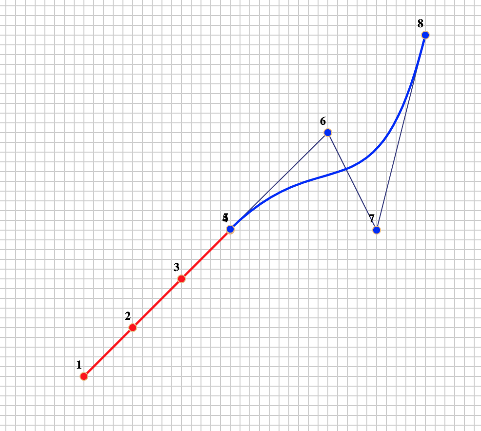

The drawing canvas has been initialized with two Bezier segments. Your task is to re-arrange the endpoints and control points to create a single stroke that resembles the lower-case character "e". On your homework paper, sketch out the resulting curve and mark the locations of the control points that generated it.

```{asis eval=knitr::is_html_output()}
<p align="center"><iframe width="540" height="540" src="http://www.mosaic-web.org/bezier-app.svg?a=.2,.2,.3,.3,.4,.4,.5,.5&b=.5,.5,.7,.7,.8,.5,.9,.9&c=-100,-100,-100,-100&animate=0"></iframe></p> 
```

```{r echo=FALSE, eval=knitr::is_latex_output()}
#| label: fig-bezier-canvas
#| fig-cap: "Follow [this link](http://www.mosaic-web.org/bezier-app.svg?a=.2,.2,.3,.3,.4,.4,.5,.5&b=.5,.5,.7,.7,.8,.5,.9,.9&c=-100,-100,-100,-100&animate=0) to get to the interactive version of the canvas."

```