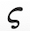

# Data {#sec-data-basics}

```{r child="../starter.Rmd"}
```

```{r include=FALSE}
book_file_name <- "modeling/05-data.html"
```


## Outline

### Organization of data

what's a data frame, what's a variable/column, what's a case/row

### Functions from data

Returns a function: spliner, fitModel

## Graphics layers

MODIFY THIS TO BE ABOUT OVERLAYING a function on data.

You will often want to compare two functions, or compare a function to data. You can do this using the ordinary graphics functions, e.g. `slice_plot()` or `gf_point()`, arranging things so that both types of graphics are drawn together in the same graphics frame. To create this kind of compound graphic, arrange the individual graphics commands into a ***pipeline***, which is a list of commands connected together by `%>%`.  Your pipeline might include two commands or twenty, depending on how complicated is the graphic you want to draw. As long as you use `%>%` after each command, the next command is taken to build upon the previous command.  The very last command in that pipeline should not be followed by `%>%`.”  

::: {.workedexample}
Here is an just-for-demonstration plot composed from three graphs, each displaying one of the pattern-book functions. At the start of the pipeline, the `domain()` must be given explicitly as an argument to `slice_plot()`. You're welcome to specify other domains in the commands further along the pipeline, but if you don't the original `domain()` will be passed down the pipeline.

```{r echo=TRUE}
slice_plot(dnorm(x) ~ x, domain(x=c(-4,4))) %>%
  slice_plot(pnorm(x) ~ x, color="red", size=2) %>%
  slice_plot(sin(x) ~ x, color="green", size=4, alpha = 0.2)
```
Just to show how these things are done, the functions have been drawn in different colors, different widths (e.g., `size=2`) and different levels of transparency (e.g. `alpha=0.2`). You can use such styling arguments in any slice-plot.
:::


## Fitting parameters

Seen very abstractly, a mathematical model is a set of ***functions*** that represent the relationships between inputs and outputs.  

At the most simple level, building a model can be a short process:

1. Develop an understanding of the relationship you want to model. Often, part of this "understanding" is the pattern seen in data.
2. Choose a function type---e.g. exponential, sinusoidal, sigmoid---that you think would be a good match to the relationship.
3. Find ***parameters*** that scales your function to be able to accept real-world inputs and generate real-world outputs.

It's important to distinguish between two basic types of model:

1. ***Empirical models*** which are rooted in ***observation*** and ***data***.
2. ***Mechanistic models*** such as those created by applying fundamental laws of physics, chemistry, and such.

We are going to put off mechanistic models for a while, for two reasons. First, the "fundamental laws of physics, chemistry, and such" are often expressed with the concepts and methods of calculus. We are heading there, but at this point you don't yet know the core concepts and methods of calculus. Second, most students don't make a careful study of the "fundamental laws of physics, chemistry, and such" until *after* they have studied calculus. So examples of mechanistic models will be a bit hollow at this point.

We'll start then with empirical modeling: finding functions that are a good summary of data. The process of constructing a model that is a good match for data is called ***curve fitting***, or, more generally, ***fitting a model***.

## Variations from scaling

A good place to start building a model is to pick one of the basic modeling functions. This works surprisingly often. To remind you, here are our nine ***pattern-book*** functions:   

```{r child="../Preliminaries/pattern-book-list.Rmd"}
```
     
The basic modeling functions are the same, but replace the plain $x$ in the pattern-book function with a straight-line function, for instance $ax + b$ or, equivalently $a(x - x_0)$.  In use, the parameter $a$ is often written with some other letter and, often, the $b$ or $-x_0$ part is not needed. 


Here are some of the common forms of the basic modeling functions you will encounter:

Name | Common forms | note
-----|--------------|------------
Exponential | $e^{k t}$ or  $e^{-k t}$ or $e^{-t/ \tau}$
Sinusoid | $\sin\left(\frac{2 \pi}{P} (t-t_0)\right)$, $\sin\left(\frac{2 \pi}{P} t\right)$, or $\sin(\omega t)$ | $P$ is "period", $\omega$ is "angular frequency."
Monomials | $[x-x_0]$ or $[x-x_0]^2$, and so on
Power-law generally | $x^p$ or $[x-x_0]^p$ | $p$ is "power."
Gaussian | $\dnorm(x, mean, sd)$ | Interpret "mean" as "center."
Sigmoid | $\dnorm(x, mean, sd)$ | $sd$ is "standard deviation" or "spread."


It helps in making the selection to have ready to mind the basic shape of each of these function families. To review, revisit Section \@ref(function-shapes).

Remember also that, in general, we scale the inputs and scale the output. This means that in choosing a model family, we don't have to worry at first about the numbers on the axes. (Of course, those numbers will be critically important later on in the process!) The scaling does, however, allow us to consider some variations on the shapes of the modeling functions. In particular, the ***input scaling*** lets us flip the shape right-for-left. And the ***output scaling*** lets us flip the shape top-for-bottom.

- $f(t)$, basic shape
- $f(-t)$, flipped right-for-left
- $-f(t)$, flipped top-for-bottom
- $-f(-t)$, flipped both top-for-bottom and right-for-left

For functions such as the sinusoid, flipping is not much use, since the flipped sinusoid curve is still a sinusoid, although with a shifted input. Similarly, a right-for-left flipped gaussian function has the same shape as the original. For the straight-line function, flipping of either sort accomplishes the same thing: changing the sign of the slope. 

For the exponential function, the two possible types of flipping---right-for-left and top-for-bottom---produce four different curves, all of which are exponential, shown in @fig-four-variations.

```{r four-variations, out-width: "50%", echo=FALSE, fig-cap: "Four variations of the exponential function.", fig.show="hold"}
ggpubr::ggarrange(
  slice_plot(exp(x) ~ x, domain(x=c(-2,2))) %>%
  gf_refine(theme_void()) %>%
  gf_theme(plot.title = element_text(size=16)) %>%
  gf_labs(title="A. The exponential function, no flipping"), 
  
slice_plot(exp(-x) ~ x, domain(x=c(-2,2))) %>%
  gf_refine(theme_void()) %>%
    gf_theme(plot.title = element_text(size=16)) %>%
  gf_labs(title="B. Flipped right-for-left"), ncol=2)

ggpubr::ggarrange(
  slice_plot(-exp(x) ~ x, domain(x=c(-2,2))) %>%
  gf_refine(theme_void()) %>%
    gf_theme(plot.title = element_text(size=16)) %>%
  gf_labs(title="C. Flipped top-for-bottom"),
slice_plot(-exp(-x) ~ x, domain(x=c(-2,2))) %>%
  gf_refine(theme_void()) %>%
    gf_theme(plot.title = element_text(size=16)) %>%
  gf_labs(title="D. Flipped both right-for-left and top-for-bottom"), ncol=2)

```

## Fitting a straight-line function


To illustrate line fitting, let's return to the cooling mug of water. @fig-Fun-4-a shows the data along with a dozen candidate straight line functions, each one drawn in its own color.

```{r Fun-4-a, echo=FALSE, warning=FALSE, fig-cap: "Some candidate straight-line function models plotted on top of the cooling water data. Which one(s) would you pick as good matches to the data?"}
set.seed(101)
gf_point(temp ~ time, data=CoolingWater %>% sample_n(20)) %>%
  gf_labs(x = "Time (minutes)", y="Temperature (deg. C)") %>%
  gf_lm(temp ~ time, data = CoolingWater %>% sample_n(20), color="dodgerblue") %>%
  gf_lm(temp ~ time, data = CoolingWater %>% sample_n(20), color="aquamarine") %>%
  gf_lm(temp ~ time, data = CoolingWater %>% sample_n(20), color="cadetblue") %>%
  gf_lm(temp ~ time, data = CoolingWater %>% sample_n(20), color="green") %>%
  gf_lm(temp ~ time, data = CoolingWater %>% sample_n(20), color="cadetblue") %>%
  gf_lm(temp ~ time, data = CoolingWater %>% sample_n(20), color="royalblue") %>%
  gf_lm(temp ~ time, data = CoolingWater %>% sample_n(20),color="seagreen") %>%
  gf_abline(intercept = 100, slope=-0.21, color = "plum") %>%
  gf_abline(intercept = 90, slope=-0.19, color = "plum3") %>%
  gf_abline(intercept = 63, slope=-0.05, color = "purple") %>%
  gf_abline(intercept = 120, slope=-0.51, color = "purple3") %>%
  gf_abline(intercept = 7, slope=.21, color = "orchid")
```

Some of the straight-line models are a much better match to the data than others. The blue-shaded functions are pretty good fits, at least when you consider the limitations of matching data with a curved pattern by a straight line.  The green-colored functions are maybe OK but not as good as the blue, and the purple-shaded functions are just horrible.

Now that you know what a reasonable straight-line model looks like, you will find it pretty easy to draw one on data graphics that even remotely show a straight-line pattern. 

Step 1: Draw a reasonable straight-line through the data points. 

Step 2: Find the parameters that correspond to the line you drew. 

## Curve fitting a periodic function {#sec-fit-periodic}

@fig-Fun-4-a-3-1 shows the tide level in [Providence, Rhode Island](https://www.google.com/maps/place/Providence,+RI/@41.8071,-71.4012,14z/data=!4m5!3m4!1s0x89e444e0437e735d:0x69df7c4d48b3b627!8m2!3d41.8071!4d-71.4012), starting at midnight on April 1, 2020 and recorded every minute for four and a half days. (These data were collected by the US National Oceanic and Atmospheric Administration. [Link](https://tidesandcurrents.noaa.gov/api/datagetter?begin_date=20200401%2010:00&end_date=20200405%201:59&station=8454000&product=one_minute_water_level&datum=mllw&units=metric&time_zone=gmt&application=web_services&format=csv))   

```{r Fun-4-a-3-1, echo=FALSE, fig-cap: "About four days of tide-level data from Providence, Rhode Island"}
#gf_line(level ~ hour, data = Zcalc::Anchorage_tide[1:1000,])
gf_line(level ~ hour, data = Zcalc::RI_tide) %>%
  gf_labs(y="Water level (meters)", x="Time (hours)", title="Tide level in Providence, Rhode Island") %>%
  gf_lims(y =c(0, 2))
```

It's not too hard to see what's going on. The tide rises and falls about every 12 hours. The difference between high tide and low tide is a little more than one meter. The tide gauge is calibrated so that a typical reading is 1 meter, although we don't know what that is respect to. (Certainly not sea level, since then the typical reading would be around zero.)

This simple description tells almost everything needed to match a basic modeling function to the tide level. Given the clear pattern in the data, we'll use a sinusoid, that is, a function of the form $$\text{tide}(t) \equiv A \sin(2\pi t/P) + B$$ The procedure is straightforward:

**Step 0**: Determine whether a sinusoid model is appropriate. As you know, sinusoids oscillate up and down repeatedly with a steady ***period***. That certainly seems the case here. But sinusoids are also steady in the ***peak*** and ***trough*** values for each cycle. That's only approximately true in the Providence data. Models inevitably involve approximation. We'll have to keep an eye on whether modeling with sinusoids and their ***fixed amplitude*** still lets us extract useful information. 

**Step 1**: Choose a sensible value to represent the low point repeatedly reached. 0.5 m seems appropriate here, but obviously the exact position of the trough of each cycle varies over the 4.5 day duration of the data.  Similarly, the peak is near 1.6 m. Parameter $B$ is the mean of the peak and trough values: $\frac{1.6 + 0.5}{2} = 1.05$ m here. Parameter $A$ is half the difference between the peak and trough values: $\frac{1.6 - 0.5}{2} = 0.55$. Parameter $B$ is called the ***baseline*** of the sinusoid. Parameter $A$ is the ***amplitude***. (Note that by convention, the amplitude is always *half* the high-to-low range of the sinusoid.)

**Step 2**: Estimate the period $P$ of the sinusoid. This can be done with the horizontal axis scale: measure the horizontal duration of a complete cycle. I like to use the time between peaks, but the time between troughs would work just as well. Another good choice is the time between positive sloping crossings of the baseline. (But be careful. The time between *successive* baseline crossings, one positive sloping and the other negative, give just *half* the period.) 


On the scale of the above plot, it's hard to read off the time of the first peak. So, zoom in until it becomes more obvious.

```{r Fun-4-a-3-2, echo=FALSE, out-width: "50%", fig.show="hold", fig-cap: "Zooming in on the start of the data (left) and on the last part of the data (right)."}
gf_line(level ~ hour, 
         data = Zcalc::RI_tide %>% filter(hour < 25)) %>%
  gf_labs(y="Water level (meters)", x="Time (hours)",
          title="Start of record") %>%
  gf_lims(y =c(0, 2))
gf_line(level ~ hour, 
         data = Zcalc::RI_tide %>% filter(hour > 90)) %>%
  gf_labs(y="Water level (meters)", x="Time (hours)",
          title = "End of record") %>%
  gf_lims(y =c(0, 2))
```

The left panel in @fig-Fun-4-a-3-2 shows about 24 hours at the start of the record. The first peak is at about 6 hours, the second at about 19 hours. That indicates that the period is roughly 19 - 6 = 13 hours. 

**Step 3** Plot out the model over the data. Replacing the symbols $A$, $B$, and $P$ with our estimates, the model is 

$${\color{magenta}{\text{tide}(t)} \equiv \underbrace{1.05}_A + \underbrace{0.55}_B \sin(\ 2\pi t\ /\underbrace{13}_P)}$$

@fig-Fun-4-a-3-3 shows this model in $\color{magenta}{\text{magenta}}$.

```{r Fun-4-a-3-3, echo=FALSE,  fig-cap: "The sinusoid fails to align with the timing of peaks and troughs."}
mod1 <- makeFun(1.05 + 0.55*sin(2*pi*hour/13) ~ hour)
mod2 <- makeFun(1.05 + 0.55*sin(2*pi*(hour-17)/13) ~ hour)
gf_line(level ~ hour, 
         data = Zcalc::RI_tide) %>% 
  slice_plot(mod1(hour) ~ hour, color="magenta") %>%
  gf_labs(y="Water level (meters)", x="Time (hours)") %>%
  gf_lims(y =c(0, 2))
```
@fig-Fun-4-a-3-3 shows the model aligning beautifully with the data at around time 80 hours, but not so well near the very beginning of the record. Looking carefully, you can see the magenta peak gradually move to the left compared to the data as you look at the peaks of the cycles one at a time moving backward from $t=80$ hours. This is diagnostic of our 13-hour estimate for the period being a little too long.

A good way to refine the estimate is to change the model slightly and re-graph the data and model. Keep doing this until you have found the right alignment. In other words, parameter estimation is often an ***iterative*** process of estimate-and-refine. This is one of the aspects of the ***modeling cycle***, where a modeler builds a tentative model, looks for systematic deviations from the data, and refines the model. 

::: {.intheworld  data-latex=""}
Another sort of deviation of the model from the data seen in @fig-Fun-4-a-3-3 concerns the varying heights of the peaks and troughs in the data, which is not captured by the simple sinusoid pattern. Perhaps you can see that at the beginning of the record, the troughs are also *wider* than the peaks. Later on, as this extra width disappears, the amplitude of the peaks and troughs increases. 

You don't yet have the calculus tools or experience to know how or whether this phenomenon can be modeled. For now, a hint: Earth has two large orbiting bodies, the Sun and the Moon. These have slightly different periods: 24 hours for the Sun and slightly longer for the Moon.
:::

**Step 4** Our model omitted one of the parameters of the sinusoid basic modeling function: the time shift $t_0$. A more complete model would be: 
$$\text{tide}_\text{shifted}(t) \equiv A \sin(2\pi (t - t_0)/P) + B$$
Whether including this parameter is important depends on our purpose for the model. If the goal is to find the period of the tides, the time shift hardly matters. But if the goal is to predict a future tide level, the time shift is critical.

Estimating $t_0$ can only be done once the period $P$ is known precisely. In practice, as you'll see in @sec-modeling-cycle, we use a numerical method called ***polishing*** to estimate both $P$ and $t_0$ at the same time.


## Curve fitting an exponential function {#sec-fit-exponential}

The exponential function is particularly useful when the quantity we want to model shows ***constant proportional increase***. Many quantities in everyday life are this way. For instance, an increase in salary is typically presented in a format like "a 3% increase." The population growth of a country is often presented as "percent per year." Inflation in the price of goods is similarly described in percent per year. Interest on money in a bank savings account is also described as percent per year. But if you have the bad fortune to owe money to a loan shark, the proportional increase might be described as "percent per month" or "percent per week."   

When you know the "percent increase per time" of a quantity whose initial value is $A$, the exponential function is easy to write down: $$f(t) = A (1+r)^t$$ 
The number $r$ is often called the ***interest rate*** or ***discount rate*** and is given in **percent**. 

::: {.takenote  data-latex=""}
Regrettably, it's extremely easy and common to forget the rules for addition with percent. If $r = 5\%$, then $(1+r) = 1.05$, not 6. Always keep in mind that $5\%$ means $\frac{5}{100}$.

Another source of error stems from the tradition in mathematics of using the number $e=2.718282$ as the "natural" base of the exponential function, whereas in $f(t) = A (1+r)^t$ the base is $1+r$. 

You can translate an exponential $b^t$ in any base $b$ to the "natural" base. This is just a matter of calculating the appropriate parameter $k$ such that $e^k = b$. Using logarithms, $$e^k = b\ \ \implies \ \  k=\ln(b)$$ For instance, if 
$r=5\%$ per year, we'll have $k = \ln(1+r) = \ln(1.05) = 0.488$ per year.

Almost everybody is happier doing arithmetic with numbers like 2 and 10 rather than $e=2.718282$. For this reason, you may see formulations of the exponential function as $g(t) \equiv 2^{a t}$ or $h(t) \equiv 10^{c t}$. Remember that $2^{a t}$ and $e^{at}$, although both exponential functions, are quantitatively different. If you want to write $2^{at}$ using the "natural" base, it will be $e^{\ln(2) a\, t }$. Similarly, $10^{ct} = e^{\ln(10) c\, t}$.
:::


Exponential functions also describe ***decrease*** or ***decay***. Just replace $t$ with $-t$. That is, a movie of a decreasing quantity is just the movie of an increasing quantity played backwards in time!    

@fig-Fun-4-intro-1 shows some data collected by Prof. Stan Wagon to support his making a detailed mechanistic model of an everyday phenomenon: [The cooling of a mug of hot beverage to room temperature](https://www.researchgate.net/profile/Gianluca_Argentini/post/Is_analogy_reasoning_between_heat_transfert_and_electriocity_allows_to_apply_the_electricity_laws_about_resistance_to_thermal_resistances/attachment/59d6573379197b80779ada64/AS%3A533325451403264%401504166104259/download/Stan+WAGON+How+quickly+does+water+cool.pdf). The mug started at room temperature, which was measured at 26 degrees C. At time 0 he poured in boiling water from a kettle and measured the temperature of the water over the next few hours.

```{r Fun-4-intro-1, echo=FALSE, fig-cap: "Stan's data"}
set.seed(101)
gf_point(temp ~ time, data=CoolingWater %>% sample_n(20)) %>%
  gf_labs(x = "Time (minutes)", y="Temperature (deg. C)")
```

Our task is to translate this data into the form of a function that takes time as input and returns temperature as output. Such a model would be useful for, say, filling in the gaps of the data. For instance, we might want to find the temperature of the water immediately after being poured from the kettle into the mug.

Looking at the data, one sees that the temperature decreases along a curve: cooling fast at first and then more slowly. This is the pattern of the flipped right-for-left exponential. (@fig-four-variations(B)) We can imagine then that an exponential, $A e^{kt} + C$ will be a suitable model form for the cooling water.

What remains is to find the parameters $A$, $k$, and $C$.  Here is a general process for curve-fitting an exponential. Later, we'll apply this process specifically to the water-cooling situation. 

**General process for curve-fitting an exponential**

The goal is to find the parameters $A$, $k$, and $C$ in the formula $A e^{kx} + C$.

**Step 0**: Check that the data show an exponential pattern in one of its varieties, namely a smooth increase or decrease and leveling out beyond some value of $x$. If this isn't true, reconsider whether you should be using an exponential function in the first place. Using your mind's eye (or paper, if you like) sketch out an exponential-shaped curve that follows the overall trend of the data. We'll call this imagined curve $f(x)$.

**Step 1**: Find the ***baseline***. This is the output level at which the function has a horizontal asymptote, that is, at which the function levels off. $C$ is this baseline level. 

**Step 2**: Find the numerical value of the imagined function $f()$ at input $x = 0$. We'll call this value $f(0)$. Then $A \equiv f(0) - C$.

**Step 3** Estimate parameter $k$ using these steps:

a. Pick any input value, which we'll call $x_2$, such that $f(x_2)$ is far from the baseline.

b. Find an input value, which we'll call $x_1$ such that $f(x_1)$ is halfway^[The motivation for the equation is that the distance between $f(x_1)$ and $C$ should be half that of the distance between $f(x_2)$ and $C$. In other words, $$f(x_1) - C = \frac{f(x_2) - C}{2}$$ Simplifying the algebra a little tells you to look for $x_1$ such that $$f(x_1) = \frac{f(x_2) + C}{2}$$] between the baseline $C$ and $f(x_2)$, that is  $$f(x_1) = \frac{f(x_2) + C}{2}$$

 
c. Once you have $x_1$ and $x_2$, you can immediately find $k$: $$k = \frac{\ln(2)}{x_2 - x_1} \approx \frac{0.693}{x_2 - x_1}$$

d. Using this simple test to double-check your work. If the horizontal asymptote of $f()$ (that is, approach to the baseline) is for $x \rightarrow \infty$, then $k$ should be **negative**. If the horizontal asymptote is for $x \rightarrow - \infty$, then $k$ will be positive. 
    

Notice that the question of "growth or decay" depends only on the sign of the parameter $k$. You can have an exponentially decaying process that's increasing. Consider, for instance, the speed of a car as it merges onto a highway from a slow speed on the entrance ramp.  The car's velocity is increasing, but as you approach highway speed the rate of increase gets smaller. That's exponential **decay**.

The procedure in Step 3 for estimating $k$ stems from a very important property of exponential functions: Exponential functions always double/half at a constant pace. By design, the parameter $k$
directly determines that pace. Picking an $x_2$ and finding the corresponding $x_1$ gives the length of the input interval, $x_1 - x_2$ over which the distance from the baseline doubles/halves. 
 
What’s remarkable about the doubling/halving time is that, for a genuinely exponential function, it doesn’t matter which point we choose for $x_1$. In practice working with graphed data, it's best to choose so that  $f(x_1)$ is discernibly far from the baseline. 

The $2$ in $\ln(2)$ corresponds to idea of doubling/halving. The logarithm converts $2$ to a scale that will generate 2 when exponentiated.


**Step 4** If you can plot the data, do so. Add to that a graphics layer showing the function $A e^{k x} + C$ using the values for $A$, $C$, and $k$ that you just found. If you are not satisfied with the way the plotted function approximates the data, tweak the parameters a bit until you are.

**Exponential curve fitting applied to the water-cooling data**

Let's illustrate the general process on the water-cooling data, redrawn in @fig-Fun-4-a-2-1.   

```{r Fun-4-a-2-1, echo=FALSE, fig-cap: "The cooling-water data, repeated here for convenience. We've sketched in an exponential-like curve that matches the data pretty well."}
set.seed(101)
gf_point(temp ~ time, data=CoolingWater %>% sample_n(20)) %>%
  gf_lims(y = c(20, NA)) %>%
  gf_smooth()
```

Step 0: The data indicate a smooth curve. As $t$ gets large, the curve approaches a constant. So an exponential model is reasonable.


**Step 1**: The curve looks like it's leveling out at a temperature of about 25 degrees C for large $t$. So $C \approx 25^{\circ} \text{C}$.

**Step 2**: Looking at our imagined curve (sketched in blue in @fig-Fun-4-a-2-1), it appears to intersect the $t=0$ vertical axis at about $f(0) = 85^\circ\text{C}$. Thus, $$A = 85^\circ\text{C} - 25^\circ\text{C} = 60^\circ\text{C}$$

**Step 3**:

a. Now choose a time $t_2$ where $f(t_2)$ is far from the baseline. ... It looks like $t_2 = 25$ will do the job, at which point we can read off the graph that the function value is $f(25) \approx 65$.
b. Find an input value $t_1$ such that $f(t_1) -C = (f(t_2)-C)/2.$ This tells us that $f(t_1) = 25 + (65-25)/2 = (65+25)/2 = 45$. Referring to the graph, the time at which the function is about 45 is $t_1 \approx 65$, that is, $f(t_1) \approx 65$.
c. We have $t_1 \approx 65$ and $t_2 = 25$. From this, we calculate $k$:
$$ k = \frac{\ln(2)}{25 - 65} = 0.693/(-40) = -0.0173$$
d. The data show exponential decay, so we expect $k$ to be negative. Happily, it is. If it hadn't been, we would go back to look for a sign error someplace.


**Step 4**. Graph the function on top of the data to confirm the fitted function is a good match to the data.

```{r Fun-4-a-2-2, echo=FALSE, fig-cap: "An exponential function that roughly aligns with the data."}
set.seed(101)
gf_point(temp ~ time, data=CoolingWater %>% sample_n(20)) %>%
  gf_lims(y = c(20, NA)) %>%
  slice_plot(60*exp(-.0173*time) + 25 ~ time, 
             domain(time=c(0,250)), color="blue")
```

Step 5: The flat zone of the data is to the right. So we've got exponential decay and $k < 0$. 


## Curve fitting a power-law function

You have been using power-law functions from early in your math and science education.  Some examples:   

Setting | Function formula | exponent
--------|------------------|----------
Circumference of a circle | $C(r) = 2 \pi r$ | 1
Area of a circle | $A(r) = \pi r^2$ | 2
Volume of a sphere | $V(r) = \frac{4}{3} \pi r^3$ | 3
Distance traveled by a falling object | $d(t) = \frac{1}{2} g t^2$ | 2
Gas pressure versus volume | $P(V) = \frac{n R T}{V}$ | $-1$
... perhaps less familiar ... | | 
Distance traveled by a diffusing gas | $X(t) = D \sqrt{
\strut t}$ | $1/2$
Animal lifespan (in the wild) versus body mass | $L(M) = a M^{0.25}$ | 0.25
Blood flow versus body mass | $F(M) = b M^{0.75}$ | 0.75

One reason why power-law functions are so important in science has to do with the logic of physical quantities such as length, mass, time, area, volume, force, power, and so on. We'll discuss this at length later in the course and the principles will appear throughout calculus.

As for finding the power law $f(x) \equiv A x^p$ that provides a good match to data, we'll need some additional tools to be introduced in @sec-magnitudes.


## Gaussian and sigmoid functions

Our last two basic modeling functions express an important idea in modeling: ***localness***. To put this in concrete terms, imagine creating a function to depict the elevation above sea level of a long road as a function of distance in miles, $x$, from the start of the road. If the road were level at 1200 feet elevation, a sensible model would be $\text{elevation}(x) = 1200 \text{ft}$. If the road were gently sloping, a better model would be $\text{elevation}(x) = 1200 + 0.01 x$.   

Now let's add a bump to the road. A bump is a local feature, often only a few feet wide. Or, perhaps the road is crossing a mountain range. That's also a local feature, but unlike a bump in the road a mountain range extends for many miles.

The basic modeling function suited to represent bumps in the road, or potholes, or mountain ranges is generically called a "hump function." In this book, we use a specific hump function called the ***gaussian*** function (`dnorm()`). 

A gaussian function has two parameters: the location^[That is, the input value at which the function value is largest.] of the peak, which we'll call the ***center*** parameter, and the sideways extent of the gaussian, which is called the ***standard deviation***. @fig-Fun-3C-1 shows a few gaussian functions with different parameters.

```{r Fun-3C-1, echo=FALSE, warning=FALSE, fig-cap: "Gaussians with various centers and standard deviations (sd).", fig.show="hold", fig.height=3, fig.width=6}
slice_plot(dnorm(x, 1, 0.5) ~ x, domain(x=c(-3, 3))) %>%
    gf_labs(title="(a) Gaussian with center=1, sd = 0.5")
slice_plot(dnorm(x, -1, 0.05) ~ x, domain(x=c(-3, 3)), npts=500) %>%
    gf_labs(title="(b) Gaussian with center=-1, sd = 0.05")
slice_plot(dnorm(x, 0.25, 1.2) ~ x, domain(x=c(-3, 3)), npts=500) %>%
    gf_labs(title="(c) Gaussian with center=0.25, sd = 1.2") %>%
  gf_hline(yintercept = ~dnorm(1.2+0.25, 0.25, 1.2), color="orange3") %>%
    gf_segment(0.2016 + 0.2016 ~ -0.95 + 1.45, color="orange3", size=3, alpha=.03)
```

It's easy to read off the ***center*** parameter from a graph of a gaussian. It's the location of the top of the function graph. (We mentioned before that a mathematical word for "the location of the top" is ***argmax***; the value for the input of the function that produces the maximum output.)

The ***spread*** parameter is also pretty straightforward, but you first have to become familiar with an unusual feature of the gaussian function. The output of the gaussian *far from the center* is practically zero. But it is not exactly zero. You can see from the graphs that the gaussian function has long flanks which approach zero output more or less in the manner of an exponential function. This means that we can't measure the spread of the gaussian function by the distance between the zeros on either side of the peak. Instead, we need a ***convention*** that will allow us to be precise in quantifying what is admittedly a vague concept of width.

Technically, the convention is that the spread is the length of the interval from the argmax to the inflection point. This can be hard to judge from a graph, but a reasonable approximation is that the spread is the "half-width at half-height." Come down half-way from the peak value of the output. Panel (c) of @fig-Fun-3C-1 marks that elevation with a thin, tan, horizontal line. Along that line, measure the width of the gaussian, as marked by the thick tan line in Panel (c). The ***spread*** parameter is half the width of the gaussian measured in this way.   

If you have a keen eye, you'll notice that the tan line in @fig-Fun-3C-1 is not exactly half-way down from the peak. It's down 39.35% from the peak. This corresponds exactly to the technical convention.

Another seeming oddity about the gaussian function is the value of the maximum. It would have seemed natural to define this as 1, so-called "unit height." The way it actually works is different: the maximum height is set so that the ***area*** under the gaussian function is 1.

This business with the area will make more sense when you've learned some calculus tools, specifically "differentation" and "integration." For now though ...

Consider another road feature, a local ***change*** from one elevation to another as you might accomplish with a ramp. The basic modeling function corresponding to a ***local change*** from one level to another is the ***sigmoid*** function. @fig-Fun-3C-2 shows three sigmoid functions.

```{r Fun-3C-2, echo=FALSE, fig-cap: "Sigmoids with various centers and standard deviations", fig.show="hold", warning=FALSE, fig.height=3, fig.width=6}
slice_plot(pnorm(x, 1, 0.5) ~ x, domain(x=c(-3, 3))) %>%
    gf_labs(title="(a) Sigmoid with center=1, sd = 0.5")
slice_plot(pnorm(x, -1, 0.05) ~ x, domain(x=c(-3, 3)), npts=500) %>%
    gf_labs(title="(b) Sigmoid with center=-1, sd = 0.05")
slice_plot(pnorm(x, 0.25, 1.2) ~ x, domain(x=c(-3, 3)), npts=500) %>%
    gf_labs(title="(c) Sigmoid with center=0.25, sd = 1.2") 
```
The name "sigmoid" comes from vague resemblance of the graph to the letter S (which is "sigma" in Greek: ). 

The parameters of the sigmoid function are the same as for the gaussian function: ***center*** and ***width***. The center is easy to estimate from a graph. It's the value of the input that produces an output of 0.5, half-way between the max and min of the sigmoid. As with the gaussian function, the ***width*** is measured according to a convention. The width is the ***change in input*** needed to go from an output of 0.5 to an output of 0.8413. This use of 0.8413 must seem loony at first exposure, but there is a reason. We'll need more calculus tools before it can make sense.

Gaussian functions and sigmoid functions with the same center and width parameters have a very close relationship. The ***instantaneous rate of change*** of the sigmoid function is the corresponding ***gaussian*** function. Figures \@ref(fig:Fun-3C-1) and \@ref(fig:Fun-3C-2) show corresponding gaussian and sigmoid functions. To the very far left, the sigmoid function is effectively flat: a slope near zero. Moving toward the center the sigmoid has a gentle slope: a low number. In the center, the sigmoid is steepest: a higher number. Then the slope of the sigmoid becomes gentle again before gradually falling off to zero. Near zero, then low, then higher, then low again, then falling off to zero: that's also the description of a gaussian function!

In R, the name of the sigmoid function is `pnorm()`. The gaussian is `dnorm()`. The parameters that specify center and spread are named `mean` and `sd`. The word "mean" accurately conveys the idea of "center." It would be nice to be able to say that `sd` comes from `s`prea`d`, but in fact `sd` is short for ***standard deviation***, a term familiar to students of statistics.   


::: {.intheworld  data-latex=""}
@fig-ebola-data shows the cumulative number of Ebola cases during an outbreak in  Sierra Leone from May 1, 2014 to December 16, 2015.

```{r ebola-data, echo=FALSE, fig-cap: "Cumulative Ebola cases in Sierra Leone"}
gf_point(Cases ~ Day, data = MMAC::EbolaSierraLeone)
```

Although the cumulative case data are roughly sigmoidal in shape, there are systematic differences in shape from a true sigmoid. For comparison, @fig-true-sigmoid is a graph of genuinely sigmoidal data.

```{r true-sigmoid, echo=FALSE, warning=FALSE, fig-cap: "A simulated sigmoidal growth process."}
sigmoid <- makeFun(A * pnorm(t, center,  width) ~ t)
Points <- tibble::tibble(
  t = seq(0, 12, length=100),
  y = sigmoid(t, A=15, center=5, width = 2) + runif(length(t), min=-1, max=0.5)
) %>% 
  mutate(y = pmin(15, cummax(y)))

gf_point(y ~ t, data  = Points,  height = 0.5, alpha = 0.25) %>%
slice_plot(sigmoid(t, A=15, center = 5, width = 2) ~ t,
           domain(t = c(-1, 15))) %>%
  gf_hline(yintercept  = 15, color  = "orange3",  alpha = 0.5) %>%
  gf_vline(xintercept = 5, color = "dodgerblue", alpha = 0.5) %>%
  gf_vline(xintercept =  c(3, 7),  color = "green", alpha = 0.5) %>%
  gf_segment(7.5 + 7.5 ~ -1 + 5, color = "dodgerblue",  alpha = 0.5) %>%
  gf_labs(title  = "A genuine sigmoid and its parameters")
```

The Ebola data have only a rough similarity to the sigmoid shape. Still, fitting a model and then examining closely the deviations of the model from the data can prompt questions that can lead to a better understanding of the data and what's needed in an appropriate model.

:::

Here's a methodology for estimating the parameters `mean` and `sd` of a sigmoid graphically. 

1. Sketch in a S-shaped curve that smoothly follows the data. In @fig-true-sigmoid this has already been done for you. For the Ebola data, you will have to use your judgment. 

2. Find the top plateau of the S-curve. This is indicated by the tan line in @fig-true-sigmoid. The parameter `A` is simply the height of the plateau, in this case $y \approx 15$.

3. Come down half way from the  plateau. Here, that's 15/2 or 7.5, indicated by the horizontal blue line segment.  Find the inverse of the S-curve from that half-way point onto the horizontal-axis. Here, that gives $t \approx 5$. The  parameter `center` is that value.

4. From the center of the S-shaped curve, follow the curve upward about 2/3 of the way to the  plateau. In the diagram, that point is marked with a green line at $t \approx 7$. The `width` is the distance along the horizontal axis from the blue centerline to the green line. Here, that's $7 - 5$ giving 2 as the `width`.

5. You might also want  to trace the S-curve *downward* from the centerline about 2/3 of the way to zero. That's indicated by the  left green line.  In the standard sigmoid, the two green lines will be equally spaced around the centerline. Of course the data may not be in the shape of the standard sigmoid, so you might find the two green lines are not equally spaced from the center.

## Exercises

`r if (knitr::is_latex_output()) knitr::knit_exit()`


`rr insert_calcZ_exercise("8.1", "0rvpbu", "Exercises/kid-type-boat.Rmd")`

`rr insert_calcZ_exercise("8.3", "YLWP1", "Exercises/flipping-1.Rmd")`

`rr insert_calcZ_exercise(8.5, "YELXG", "Exercises/lamb-talk-gloves.Rmd")`

`rr insert_calcZ_exercise(8.7, "VBWD", "Exercises/spirometer.Rmd")`

`rr insert_calcZ_exercise(8.9, "vkwl4", "Exercises/chicken-choose-vase.Rmd")`

`rr insert_calcZ_exercise(8.11, "asevss", "Exercises/cow-type-kayak.Rmd")`

`rr insert_calcZ_exercise(8.13, "IELWV", "Exercises/hump-intro.Rmd")`

`rr insert_calcZ_exercise(8.15, "CKSLE", "Exercises/sigmoid-intro.Rmd")`

`rr insert_calcZ_exercise(8.17, "bllKR", "Exercises/sigmoid-bath.Rmd")`

`rr insert_calcZ_exercise(8.19, "YLWP2", "Exercises/flipping-2.Rmd")`

`rr insert_calcZ_exercise(8.21, "EKCIE", "Exercises/ebola-sigmoid.Rmd")`

## Drill


`r Znotes:::MC_counter$reset(labels="roman")`


```{r drill-Quiz-2-22, echo=FALSE, results='markup'}
Znotes::askMC(
  prompt = r"(What's the period of this sinusoid?<br> )",
r"(1)" = r"( )",
  r"(2)" = r"( )",
  r"(3)" = r"( )",
  r"(4)" = r"( )",
  r"(+5+)" = r"( )",
  random_answer_order=FALSE
)
```


```{r drill-Quiz-2-23, echo=FALSE, results='markup'}
Znotes::askMC(
  prompt = r"(Which function(s) have $k < 0$?<br> )",
r"(blue)" = r"( )",
  r"(+black+)" = r"( )",
  r"(both)" = r"( )",
  r"(neither)" = r"( )",
  random_answer_order=FALSE
)
```


```{r drill-Quiz-2-24, echo=FALSE, results='markup'}
Znotes::askMC(
  prompt = r"(Which function(s) have $k < 0$?<br> )",
r"(blue)" = r"( )",
  r"(black)" = r"( )",
  r"(both)" = r"( )",
  r"(+neither+)" = r"(As the input gets bigger, both functions produce outputs that get further from their respective baselines. That' exponential growth.)",
  random_answer_order=FALSE
)
```


```{r drill-Quiz-2-25, echo=FALSE, results='markup'}
Znotes::askMC(
  prompt = r"(Which function(s) have $k < 0$?<br> )",
r"(blue)" = r"(Exponential decay means that the function output gets closer and closer to baseline as the input gets bigger.)",
  r"(black)" = r"( )",
  r"(both)" = r"( )",
  r"(+neither+)" = r"(As the input gets bigger, both functions produce outputs that get further from their respective baselines. That' exponential growth.)",
  random_answer_order=FALSE
)
```


```{r drill-Quiz-2-26, echo=FALSE, results='markup'}
Znotes::askMC(
  prompt = r"(One of the functions has a half-life, the other a doubling time. Which is bigger, the half-life or the doubling time?<br> )",
r"(+doubling time+)" = r"( )",
  r"(half-life)" = r"( )",
  r"(about the same)" = r"( )",
  r"(they aren't exponential, so the concept of half-life/doubling-time doesn't apply.)" = r"( )",
  random_answer_order=FALSE
)
```


```{r drill-M04-8, echo=FALSE, results='markup'}
Znotes::askMC(
  prompt = r"(In this book, what is meant by the word "**variable**"? )",
r"(It's the same as input.)" = r"(Use **input** rather than variable! Even if you're used to calling quantities like $x$ and $y$ variables, it's a confusing practice since it can mean so many different things. In calculus, in this course, we'll try to be strict about using the words **input** and **output**)",
  r"(It's the same as output.)" = r"( )",
  r"(+A column in a data table.+)" = r"(This is the use in statistics and data science. In calculus, we'll try to avoid confusing by using **input** and **output** instead.)",
  random_answer_order=TRUE
)
```
