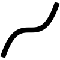

# Low order polynomials {#sec-low-order}

```{r child="../starter.Rmd"}
```

```{r include=FALSE}
book_file_name <- "modeling/06-low-order-polynomials.html"
```

## The modeling polynomial {#sec-modeling-polynomial-1}

Sometimes, in order to model some simple relationship you need to build a function whose graph has a simple, curving shape.  

A simple but surprisingly powerful approach is to use a ***low-order polynomial***. The ***order of a polynomial*** is the highest exponent on the input. For example:

- A ***straight-line function***, $g_1(x) \equiv a_0 + a_1 x$, is a **first-order** polynomial. 
- A ***quadratic***, $g_2(x) \equiv b_0 + b_1 x + b_2 x^2$ is a **second-order** polynomial.

Many modelers are tempted to extend the technique to third-, fourth-, fifth-order and even higher. This is only rarely worthwhile since all second-, fourth-, sixth- and higher-even-order ***monomials*** have basically the same U-shape, like a referee signalling a touch-down. Similarly, first-, third-, fifth- and higher odd-order monomial have  similar  shapes.  

An ofttimes better approach is to compose the polynomial with a curved but monotonic function, such as a logarithm.

::: {.why  data-latex=""}
Notice that in writing low-order polynomials like $$g_1(x) \equiv a_0 + a_1 x$$ or  $$g_2(x) \equiv b_0 + b_1 x + b_2 x^2$$ we are using a specific naming convention for the scalars in the linear combinations. For each different function, we use a different start-of-the-alphabet name, like $a$ and $b$. That same name is used for all the scalars in the function, and a subscript is used to make the distinction between the different functions being combined. Thus, we have $a_1$ for the $x$ function in $g_1()$ and $b_2$ for the $x^2$ function in $g_2()$.

In high-school mathematics, polynomials are often written without subscript, for instance $a x^2 + b x + c$. This can be fine when working with only one polynomial at a time, but in modeling we often need to compare multiple, related polynomials.
:::


## Parentheses

::: {.why  data-latex=""}
In writing $\line(x) \equiv a [x - x_0]$ I used ***square braces*** $\left[\strut\ \right]$ rather than parentheses $\left(\strut\ \right)$ to surround $x - x_0$. Either could be used and there is no difference in meaning. In traditional mathematical notation, either serves to demarcate a sub-expression. We'll be using parentheses very extensively in expressions like $\line(x)$, so it's nice to have a visual break. 
:::


REVIEW STRAIGHT-LINE FUNCTION and zero finding of it.

One of the central techniques in calculus is to use straight-line functions to approximate more complicated functions. We'll start using this technique extensively in Block 2, but it's worth pointing out some basic symbolic manipulations of the straight-line function.

1. Find the zero crossing (which you might have called "x-intercept")
2. Find the slope.
3. Point/slope form. $g(x) \equiv m(x-x_0)$ which implies $b=-m x_0$


NOTE NOTE NOTE

Much of this material is redundant with Block 2 chapter 25. Make sure to take it out of there. Let Chapter 25 focus on the analysis of low-order polynomials by differentiation and the interpretation of terms.


We have focused in this book on a small set of basic modeling functions and three operations for assembling new functions out of old ones: ***linear combination***, ***multiplication***, and ***composition***. All of these have a domain that is the whole number line, or the positive half of the number line, or perhaps the whole number line leaving out zero or some other isolated point. Consider such domains to be ***global***. 

We also discussed the components of ***piecewise functions***. Each component is a function defined on a limited domain, an interval $a \leq x \leq b$. In contrast to the global domains, we'll call the limited domains ***local***.  

In this chapter, we'll explore a simple and surprisingly powerful method to approximate any function ***locally***, that is, over a small domain.  

::: {.why  data-latex=""}
Why would you want to approximate a function? Why not just use the function itself? 

It's often the case that we know about or hypothesize about relationships only from data. We believe there is a definite functional form for the relationship, but it's unknown and unknowable to us. Still, we can approximate even an unknown function, matching the approximation to the data that is the visible manifestation of the unknown function. Local approximations provide a general-purpose method for creating functions that can represent a wide range of relationship patterns, even ones that are not otherwise known to us.

In fields such as physics or engineering, there are often theories that dictate a particular form of function. For example, Newton's universal law of gravitation posits an inverse square law for the force of gravity as a function of distance. Mechanical engineers use power laws to describe the shape of a beam under load, and communications engineers (and others) make extensive use of sinusoids. Textbooks in those fields rightfully emphasize those particular function forms. 

The utility of the local approximation method is that you can move forward even in the absence of a detailed theory. You need only apply your insight to posit which quantities are related to each other and then apply the approximation methods to produce a functional form. This approach is ubiquitous in all fields. 

Sometimes, the local approximation *becomes* the theory. This is seen, for instance, in [Newton's law of cooling](https://en.wikipedia.org/wiki/Newton%27s_law_of_cooling), in [Hooke's law](https://en.wikipedia.org/wiki/Hooke%27s_law) relating force and extension, or the chemist's [law of mass action](https://en.wikipedia.org/wiki/Law_of_mass_action). 

:::

The information that you have about the relationship often takes the form of a data table. Each row records one trial in which the values of the inputs have been measured and the corresponding output value recorded. We'll discuss the methods of constructing functions to match such data in Block 5 of this course. 

Another common form for the information about the relationship is about derivatives. That is, you know something about the derivative of a relationship even though you don't (yet) have a form for the function describing the relationship. As an example, think about building a model of the sustainable speed of a bicycle as a function of the gear selected and the grade of the road---up or down. 

Consider these three questions that any experienced bicyclist can likely answer:

1. On a given grade of road, is there an optimal gear for the highest sustained speed? (Have in mind a particular rider, perhaps yourself.)
2. Imagine that the grade of the road is described by a positive number for uphill and a negative number for downhill: that is, the slope of the road. For a positive (uphill) grade and at a fixed gear, will the bike's sustained speed be higher or lower as a function of the grade?^[It's much the same for downhill biking, but you have to keep in mind that a shallow downhill has a higher numerical slope than a steep downhill. That is, the derivative of the hill is near zero for a very shallow grade and far from zero (that is, more negative) for a steep downhill grade.]
3. Assuming you answered "yes" to question (1): Does the optimal gear choice depend on the grade of the road? (In concrete terms, would you choose different gears for an uphill climb than for a level road or a downhill stretch?) 

Using the methods in this chapter, the answers to those three questions let you choose an appropriate form for the speed(gear, grade) function. Then, using methods in Block 5 of this text, you can make a few measurements for any given rider and construct a model customized to that rider. 

Note that the three questions all have to do with derivatives. An "optimal gear" is a gear at which $\partial_\text{gear} \text{speed}(\text{gear}, \text{grade}) = 0$. That you ride slower the higher the numerical value of the slope means that  $\partial_\text{grade} \text{speed}(\text{gear}, \text{grade}) < 0$. And we know that $\partial_\text{gear} \text{speed}(\text{gear}, \text{grade})$ depends on the grade; that's why there's a different optimal gear at each grade. 

## Eight simple shapes

In many modeling situations with a single input, you can get very close to a good modeling function $f(x)$ by selecting one of ***eight simple shapes***, shown in Figure \@ref(fig:eight-simple-shapes). 

```{r eight-simple-shapes, echo=FALSE, out-width: "40%", fig.show="keep", fig-cap: "The ***eight simple shapes***, locally, of functions with one input. (See Chapter \\@ref(local-approximations).)"}
g <- makeFun(a + b*x + c*x^2 ~ x, a=-1, b=2, c=1)
slice_plot(-g(x, c=0) ~ x, domain(x=c(-3,1)), size=2  ) %>%
  gf_labs(y="Output", x="Input", title="(A) downward sloping line")
slice_plot(g(x, c=0) ~ x, domain(x=c(-3,1)), size=2  ) %>%
  gf_labs(y="Output", x="Input", title="(B) upward sloping line")
slice_plot(g(x) ~ x, domain(x=c(-3,-1)), size=2) %>%
  gf_labs(y="Output", x="Input", title="(C) downward sloping, concave up; steep then shallow")
slice_plot(g(x) ~ x, domain(x=c(-1,1)), size=2) %>% 
  gf_labs(y="Output", x="Input", title="(D) upward sloping, concave up; shallow then steep")
slice_plot(-g(x) ~ x, domain(x=c(-3,-1)), size=2) %>% 
  gf_labs(y="Output", x="Input", title="(E) upward sloping, concave down; steep then shallow")
slice_plot(-g(x) ~ x, domain(x=c(-1,1)), size=2) %>%
  gf_labs(y="Output", x="Input", title="(F) downward sloping, concave down; shallow then steep")
slice_plot(g(x) ~ x, domain(x=c(-3,1)), size=2) %>%
  gf_labs(y="Output", x="Input", title="(G) local minimum")
slice_plot(-g(x) ~ x, domain(x=c(-3,1)), size=2) %>% 
  gf_labs(y="Output", x="Input", title="(H) local maximum")
```


To choose among these shapes, consider your modeling context: 

- is the relationship positive (slopes up) or negative (slopes down)
- is the relationship monotonic or not
- is the relationship concave up, concave down, or neither

Some examples, scenarios where the modeler knows about the derivative and concavity of the relationship being modeled. It's often the case that your knowledge of the system comes in this form. 

* The incidence of an out-of-control epidemic versus time is concave up, but shallow-then-steep. As the epidemic is brought under control, the decline is steep-then-shallow and concave up. Over the whole course of an epidemic, there is a maximum incidence. Experience shows that epidemics can have a phase where incidence reaches a local minimum: a decline as people practice social distancing followed by an increase as people become complacent. 

* How many minutes can you run as a function of speed? Concave down and shallow-then-steep; you wear out faster if you run at high speed. How far can you walk as a function of time? Steep-then-shallow and concave down; your pace slows as you get tired.

* How does the stew taste as a function of saltiness. The taste improves as the amount of salt increases ... up to a point. Too much salt and the stew is unpalatable.

* The temperature of cooling water or the emission of radioactivity as functions of time are concave up and steep-then-shallow. 

*  How much fuel is consumed by an aircraft as a function of distance? For long flights the function is concave up and shallow-then-steep; fuel use increases with distance, but the amount of fuel you have to carry also increases with distance and heavy aircraft use more fuel per mile.

* In micro-economic theory there are ***production functions*** that describe how much of a good is produced at any given price, and ***demand functions*** that describe how much of the good will be purchased as a function of price.  
    - As a rule, production increases with price and demand decreases with price. In the short term, production functions tend to be concave down, since it's hard to squeeze increased production out of existing facilities.  
    - For demand in the short term, functions will be concave up when there is some group of consumers who have no other choice than to buy the product. An example is the consumption of gasoline versus price: it's hard in the short term to find another way to get to work. In the long term, consumption functions can be concave down as consumers find alternatives to the high-priced good. For example, high prices for gasoline may, in the long term, prompt a switch to more efficient cars, hybrids, or electric vehicles. This will push demand down steeply.  

 

## Low-order polynomials


There is a simple, familiar functional form that, by selecting parameters appropriately, can take on each of the eight simple shapes: the ***second-order polynomial***.
$$g(x) \equiv a + b x + c x^2$$
As you know, the graph of $g(x)$ is a parabola. 

- The parabola opens upward if $0 < c$. That's the shape of a ***local minimum***.
- The parabola opens downward if $c < 0$. That's the shape of a ***local maximum***

Consider what happens if $c = 0$. The function becomes simply $a + bx$, the straight-line function. 

- When $0 < b$ the line slopes upward.
- When $b < 0$ the line slopes downward.

With the appropriate choice of parameters, the form $a + bx + cx^2$ is  capable of representing four of the ***eight simple shapes***. What about the remaining four? This is where the idea of ***local*** becomes important. Those remaining four shapes are the sides of parabolas, as in Figure \@ref(fig:four-shapes). 

```{r four-shapes, echo=FALSE, fig-cap: "Four of the ***eight simple shapes*** correspond to the sides of the parabola. The labels refer to the graphs in Figure \\@ref(fig:eight-simple-shapes).", warning=FALSE}
f1 <- makeFun(a + b*x + c*x^2 ~ x, a=-2, b=1, c=1)
f2 <- makeFun(a + b*x + c*x^2 ~ x, a=-2, b=1, c=-1)
P1 <- graph_with_boxes(f1, domain = c(-1.1,0.1), my_letters = c("C", "D"), 
                 intervals = tibble(x = c(-1, -.45), xend=c(-.55, 0)))
P2 <- graph_with_boxes(f2, domain = c(-.3,1.4), my_letters = c("E", "F"),
                 intervals = tibble(x = c(-.2, .55), xend=c(.45, 1.25)))
gridExtra::grid.arrange(P1, P2, nrow=2)
```


## The low-order polynomial with two inputs {#sec-low-order-two}

For functions with two inputs, the low-order polynomial approximation looks like this:

$$g(x, y) \equiv a_0 + a_x x + a_y y + a_{xy} x y + a_{yy} y^2 + a_{xx} x^2$$
In reading this form, note the system being used to name the polynomial's coefficients. First, we've used $a$ as the root name of all the coefficients. Sometimes we might want to compare two or more low-order polynomials, so it's convenient to be able to use $a$ for one, $b$ for another, and so on. 

The subscripts on the coefficients describes exactly which term in the polynomial involves each coefficient. For instance, the $a_{yy}$ coefficient applies to the $y^2$ term, while $a_x$ applies to the $x$ term.  

Each of $a_0, a_x,$ $a_y,$ $a_{xy}, a_{yy}$, and $a_{xx}$ will, in the final model, be a constant quantity. Don't be confused by the use of $x$ or $y$ in the name of the coefficients. Each coefficient is a constant and not a function of the inputs. Often, your prior knowledge of the system being modeled will tell you something about one or more of the coefficients, for example, whether it is positive or negative. Finding a precise value is often based on quantitative data about the system.  

It helps to have different names for the various terms. It's not too bad to say something like, "the $a_{xy}$ term." (Pronounciation: "a sub x y" or  "a x y") But the proper names are: ***linear terms***, ***quadratic terms***, and ***interaction term***. And a shout out to $a_0$, the ***constant term***. 

$$g(x, y) \equiv a_0 + \underbrace{a_x x + a_y y}_\text{linear terms} \ \ \ + 
\underbrace{a_{xy} x y}_\text{interaction term} +\ \ \  \underbrace{a_{yy} y^2 + a_{xx} x^2}_\text{quadratic terms}$$

```{r echo=FALSE, warning=FALSE}
make_gxy <- function(seed=1) {
  set.seed(seed)
  f <- makeFun(a0 + ax*x + ay*y + axy*x*y + axx*x^2 + ayy*y^2 ~ x + y,
               a0 = runif(1, -1, 1), 
               ax = runif(1, -1, 1), ay = runif(1, -1, 1), 
               axy = runif(1, -1, 1), 
               ayy = runif(1, -1, 1), axx = runif(1, -1, 1)
  )
}
show_poly2 <- function(seed=1, domain=list(x=c(-2, 2), y=c(-2, 2))) {
  f <- make_gxy(seed)
  list(P1 = contour_plot(f(x, y) ~ x + y, domain=domain),
  P2 = interactive_plot(f(x, y) ~ x + y, domain=domain))
}


Four <- show_poly2(104)

Four$P1
```

```{r saddle2, echo=FALSE, fig-cap: "A saddle" }
if (knitr::is_html_output()) {
  Four$P2
} else {
  knitr::include_graphics("www/show_poly2_104.png")
}
```

::: {.intheworld data-latex=""}
If you're like many people, you find it harder to walk uphill than down, and find it takes more out of you to walk longer distances than shorter. Let's build a model of this, using nothing more than your intuition and the method of low-order polynomial approximations.

Let's call the map distance walked $d$. ("Map distance" is the horizontal change in position, disregarding vertical changes.) The steepness of the hill will be the "grade" $g$, which is measured as the horizontal distance covered divided by the vertical climb. If you're going downhill, the grade is negative. 

The key ingredient in the model: We'll measure the "difficulty" or "exertion" to walking as the ***energy consumed*** during the walk: $E(d, g)$.

Some assumptions about walking and energy consumed:

1. If you don't walk, you consume zero energy walking.
2. The energy consumed should be proportional to the length of the walk. This is an assumption, and is probably valid, only for walks of short to medium distances, as opposed to forced marches over tens of miles. 


We'll start with the full 2nd-order polynomial in two inputs, and then seek to eliminate terms that aren't needed.

$$E_{big}(d, g) \equiv a_0 + a_d\, d + a_g\, g + a_{dg}\, d\, g + a_{dd}\,d^2 + a_{gg}\,g^2$$
According to assumption (1), when $E(d=0, g) = 0$. Of course, if you are walking zero distance, it doesn't matter what the grade is; the energy consumed is still zero.

Consequently, we know that all terms that don't include a $d$ should go away. This leaves us with

$$E_{medium}(d, g) \equiv  a_d\, d + a_{dg}\, d\, g + a_{dd}\,d^2 = d \left[\strut a_d + a_{dg}\, g + a_{dd}\,d\right]$$
Assumption (2) says that energy consumed is proportional to $d$. The multiplier on $d$ in $E_{medium}()$ is $\left[\strut a_d + a_{dg}\, g + a_{dd}\,d\right]$ which is itself a function of $d$. A proportional relationship implies a multiplier that doesn't depend on the quantity itself. This means that $a_{dd} = 0$.

This leaves us with a very simple model: $$E(d, g) \equiv \left[\strut a_1 + a_2\, g\right]\, d$$ where we have simplified the labeling on the coefficients since there are only two in the model.

Perhaps assumption (2) is mis-placed and that the energy consumed per unit distance in a walk increases with the length of the walk. If so, we would need to return to the question of $a_{dd}$. This is typical of the modeling cycle. Trying to be economical with model terms highlights the question of which terms are so small they can be ignored.
:::


::: {.example   data-latex=""}
In selecting cadets for pilot training, two criteria are the cadet's demonstrated flying aptitude and the leadership potential of the cadet. Let's assume that the overall merit $M$ of a candidate is a function of flying aptitude $F$ and leadership potential $L$. 

Currently, the merit score is a simple function of the $F$ and $L$ scores: $$M_{current}(F, L) \equiv F + L$$

The general in charge of the training program is not satisfied with the current merit function. "I'm getting too many cadets who are great leaders but poor pilots, and too many pilot hot-shots who are not good leaders.  I would rather have an good pilot who is a good leader than have a great pilot who is a poor leader or a poor pilot who is a great leader." (You might reasonably agree or disagree with this point of view, but the general is in charge.)

The general has tasked you to revise the formula to better match her views about the balance betwen flying ability and leadership potential. 

How should you go about constructing $M_{improved}(F, L)$?

You recognize that $F + L$ is a low-order polynomial: just the linear terms are present without a constant or interaction term or quadratic terms. Low-order polynomials are a good way to approximate any formula locally, so you have decided to follow that route.

Quadratic terms are appropriate when a model needs to feature a locally ***optimal*** level of the of the inputs. But it will never be the case that a lower flying score will be more favored than a higher score, and the same thing for the leadership score. So your model doesn't need quadratic terms. 

That leaves the interaction term as the way forward. The low-order polynomial model will be 
$$M_{improved}(F, L) \equiv d_0 + F + L + d_{FL} FL$$
Should $d_{FL}$ be positive or negative? 

Imagine a cadet Drew with acceptable and equal F and L scores. Another cadet, Blake, has scores that are $F+\epsilon$ and $L-\epsilon$, where $\epsilon$ might be positive or negative. Under the original formula for merit, Drew and Blake have equal merit. Under the new criteria, Drew should have a higher merit than Blake. In other words:
$$M_{improved}(F, L) - M_{improved}(F+\epsilon, L-\epsilon) > 0$$

Replace $M_{improved}(F, L)$ with the low-order polynomial approximation given earlier. 
$$\underbrace{d_0 + F + L + d_{FL} FL}_{M_{improved}(F, L)} - \underbrace{\left[{\large\strut} d_0 + \left[ F + \epsilon\right] + \left[ L - \epsilon\right] + d_{FL} (FL -\epsilon L + \epsilon F -  \epsilon^2)\right]}_{M_{improved}(F+\epsilon, L-\epsilon)} > 0$$
Collecting and cancelling terms in the above gives 
$$- d_{FL}(\epsilon(F-L) + \epsilon^2) > 0$$
Since $F$ and $L$ were assumed equal, this results in 
$$M_{improved}(F, L) - M_{improved}(F+\epsilon, L-\epsilon) = d_{FL}\, \epsilon^2 > 0$$
Thus, $d_{FL}$ will have to be positive.
:::


## Two-input modeling polynomial

In @sec-modeling-polynomial-1 we introduced the low-order polynomial, either $g_1(x) \equiv a_0 + a_1 x$ or $g_1(x) \equiv b_0 + b_1 x + b_2 x^2$ as a general-purpose way of generating a function with a smoothly curved shape. The same applies in constructing simple functions of two inputs.

Almost always, you should use at least a first-order polynomial, which is:
$$h_1(x, y) \equiv a_0 + a_x x + a_y y$$
But there is an important extension of this, using what's called a ***bilinear term*** or, more evocatively in statistics, an ***interaction term***.  This is
$$h_2(x, y) \equiv \underbrace{b_0}_\text{intercept} + \underbrace{b_x\, x + b_y\, y}_\text{linear terms} + \underbrace{b_{xy}\,x\, y}_\text{bilinear term}$$

The bilinear term arises  in models of phenemona such as the spread of epidemics, the population dynamics of predator and prey animals, and the rates of chemical reactions. In each of these situations one thing is interacting with another: a predator killing a prey animal, an infective individual meeting a person susceptible to the disease, one chemical compound reacting with another. 

Under certain circumstances, modelers include one or both ***quadratic terms***, as in
$$h_3(x, y) \equiv c_0 + c_x\, x + c_y\, y + c_{xy}\,x\, y + \underbrace{c_{yy}\, y^2}_\text{quadratic in y}$$
The skilled modeler can often deduce which terms to include from basic facts about the system being modeled. We'll need some additional calculus concepts before we can explain this in a straightforward way.


::: {.why  data-latex=""}
In writing polynomials like $$h_1(x, y) \equiv a_0 + a_x x + a_y y$$ or $$h_3(x, y) \equiv c_0 + c_x x + c_y\ y + c_{xy} x\ y$$
we are using **letters** as subscripts on the coefficients. Think of $c_x$ as saying, "I am the coefficient on the $x$ term in the polynomial." Using this style lets us use different letters from the start of the alphabet for the names of coefficients in the different polynomials while still making it clear which term each coefficient is scaling.

:::

## What's wrong with polynomials


## Exercises

`r if (knitr::is_latex_output()) knitr::knit_exit()`

## Drill

`r Znotes:::MC_counter$reset(labels="roman")`


```{r drill-Polynomials-1, echo=FALSE, results='markup'}
Znotes::askMC(
  prompt = r"(In the polynomial $a_0 + a_x x + a_y y + a_{xy} xy$, what is the term $a_{xy}xy$ called?  )",
r"(+Interaction term+)" = r"( )",
  r"( Quadratic term)" = r"( )",
  r"( Linear term)" = r"( )",
  r"( Constant term)" = r"( )",
  random_answer_order=TRUE
)
```


```{r drill-Polynomials-2, echo=FALSE, results='markup'}
Znotes::askMC(
  prompt = r"(In the polynomial $a_0 + a_x x + a_y y + a_{xx} xx$, what is the coefficient on the interaction term?  )",
r"(+0+)" = r"(You can treat a missing term as if it had a coefficient of zero.)",
  r"($a_{xy}$)" = r"(There's no such coefficient in the polynomial.)",
  r"($a_{xx}$)" = r"( )",
  r"($a_0$)" = r"( )",
  random_answer_order=TRUE
)
```


```{r drill-Polynomials-3, echo=FALSE, results='markup'}
Znotes::askMC(
  prompt = r"(Imagine a second-order polynomial in three inputs: $x$, $y$, and $z$, like this: $$b_0 + b_x x + b_y y + b_z z + b_{xy} xy + b_{xz} xz + b_{xx} x^2 + b_{yy} y^2 + b_zz z^2\ .$$ All of the possible second-order (or less) terms are shown, except for one. Which term is missing?  )",
r"(+the interaction between $y$ and $z$+)" = r"( )",
  r"(the quadratic term in $z$)" = r"( )",
  r"(the linear term in $y$)" = r"( )",
  r"(the constant term)" = r"( )",
  random_answer_order=TRUE
)
```


