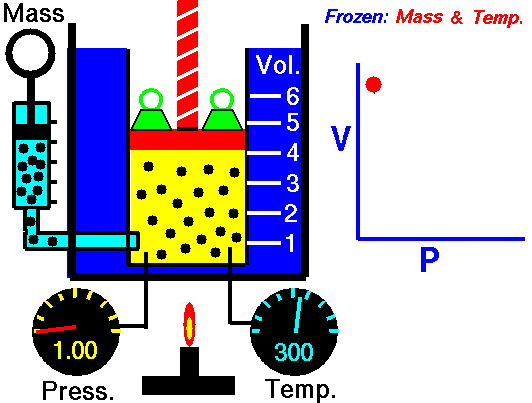

# Magnitude {#sec-magnitude}

```{r child="../starter.Rmd"}
```

People accomplish a familiar mathematical task with hardly any mental effort: comparing two numbers to determine which is bigger. This is easy because we have adopted a system for writing numbers that makes it easy.  For the Romans and Europeans up through the 13th century, numbers were hard to work with. For instance, which of these three numbers is bigger?
$$\text{MLI or CXII or XXXIII}$$


```{r echo=FALSE}
#| label: fig-liber-abaci
#| fig-cap: "An excerpt from Fibonacci's *Liber Abaci* (1202) introducing to European readers the \"Hindu\" numerals. [Source](https://chalkdustmagazine.com/features/roots-legacy-of-fibonacci/)"
#| fig-cap-location: margin
knitr::include_graphics("www/hindu2.png")
```


Now try the same task with Arabic numerals: Which is bigger?

$$\text{512 or 33 or 1051}$$
You can see the answer at a glance. The algorithm is straightforward:  select the number with the largest number of digits. If there is a tie, refer to the first digit. If there is still a tie, refer to the next digit. In contrast, it takes much more work with Roman numerals. For instance, IC is about fifteen times bigger than VI, even though I is much smaller than V.

## Order of magnitude

We'll refer to judging the size of numbers by their count of digits as reading the ***magnitude*** of the number. To get started, consider numbers that start with 1 followed by zeros, e.g. 100 or 1000. We'll quantify the magnitude as the number of zeros: 100 has a magnitude of 2 and 1000 has a magnitude of 3. In comparing numbers by magnitude, we way things like, "1000 is an ***order of magnitude*** greater than 100," or "1,000,000" is five orders of magnitude larger than 10. 

Many phenomena and quantities are better understood in terms of magnitude than in terms of number. An example: Animals, including humans, go about the world in varying states of illumination, from the bright sunlight of high noon to the dim shadows of a half-moon. To be able to see in such diverse conditions, the eye needs to respond to light intensity across many orders of magnitude. 

The ***lux*** is the unit of illuminance in the Système international. This table^[Source: <https://en.wikipedia.org/wiki/Daylight>] shows the illumination in a range of familiar outdoor settings:

Illuminance | Condition
------------|---------------
110,000 lux | Bright sunlight
20,000 lux	| Shade illuminated by entire clear blue sky, midday
1,000 lux	| Typical overcast day, midday
400 lux	| Sunrise or sunset on a clear day (ambient illumination)
0.25 lux |	A full Moon, clear night sky
0.01 lux | 	A quarter Moon, clear night sky

For a creature active both night and day, the eye needs to be sensitive over 7 orders of magnitude of illumination. To accomplish this, eyes use several mechanisms: contraction or dilation of the pupil accounts for about 1 order of magnitude, photopic (color, cones) versus scotopic (black-and-white, rods, nighttime) covers about 3 orders of magnitude, adaptation over minutes (1 order), squinting (1 order).

More impressively, human perception of sound spans more than 16 orders of magnitude in terms of the energy impinging on the eardrum. The energy density of perceptible sound ranges from the threshold of hearing at 0.000000000001 Watt per square meter to a conversational level of 0.000001 W/m^2^ to 0.1 W/m^2^ in the front rows of a rock concert. But in terms of our subjective perception of loudness, each order of magnitude change is perceived in the same way, whether it be from street traffic to vacuum cleaner or from whisper to normal conversation. (The unit of sound measurement is the decibel (dB), with 10 decibels corresponding to an order of magnitude in the energy density of sound.)

::: {#tbl-sound-energy .column-margin}
Situation | Energy level (dB)
:-------------|---------:
Rustling leaves | 10 dB
Whisper | 20 dB
Mosquito buzz | 40 dB
Normal conversation | 60 dB
Busy street traffic | 70 dB
Vacuum cleaner | 80 dB
Large orchestra | 98 dB
Earphones (high level) | 100 dB
Rock concert | 110 dB
Jackhammer | 130 dB
Military jet takeoff | 140 dB

Energy density of sound in various situations. Sound at 85 dB, for extended periods, can cause permanent hearing loss. Exposure to sound at 120 dB over 30 seconds is dangerous.
:::

6, 60, 600, and 6000 miles-per-hour are quantities that differ in size by ***orders of magnitude***. Such differences often point to a substantial change in context. A jog is 6 mph, a car on a highway goes 60 mph, a cruising commercial jet goes 600 mph, and a rocket passes through 6000 mph on its way to orbital velocity. From an infant's crawl to highway cruising is 2 orders of magnitude in speed.

Of course, many phenomena are **not** well represented in terms of orders of magnitudes. For example, the difference between normal body temperature and high fever is 0.01 orders of magnitude in temperature.^[We're using the Kelvin scale, which is the only meaningful scale for a *ratio* of temperatures.] An increase of 1 order of magnitude in blood pressure from the normal level would cause instant death! The difference between a very tall adult and a very short adult is about 1/4 of an order of magnitude. 

Orders of magnitude are used when the relevant comparison is a **ratio**. "A car is 10 times faster than a person," refers to the ratio of speeds. In contrast, quantities such as body temperature, blood pressure, and adult height are compared using a **difference**. Fever is 2$^circ$C higher in temperature than normal. A 30 mmHg increase in blood pressure will likely correspond to developing hypertension. A very tall and a very short adult differ by about 2 feet.

One clue that thinking in terms of orders of magnitude is appropriate is when you are working with a set of objects whose range of sizes spans one or many factors of 2. Comparing baseball and basketball players? Probably no need for orders of magnitudes. Comparing infants, children, and adults in terms of height or weight? Orders of magnitude may be useful. Comparing bicycles? Mostly they fit within a range of 2 in terms of size, weight, and speed (but not expense!). Comparing cars, SUVs, and trucks? Differences by a factor of 2 are routine, so thinking in terms of order of magnitude is likely to be appropriate.

Another clue is whether "zero" means "nothing." Daily temperatures in the winter are often near "zero" on the Fahrenheit or Celcius scales, but that in no way means there is a complete absence of heat. Those scales are arbitrary. Another way to think about this clue is whether ***negative values*** are meaningful. If so, thinking in terms of orders of magnitude is not likely to be useful.

## Counting digits

Imagine having a digit counting function called digit(). It takes a number as input and produces a number as output. We don't have a ***formula*** for digit(), but for some inputs, the output can be calculated just by counting. For example:

- digit(10) $\equiv$ 1
- digit(100) $\equiv$ 2
- digit(1000) $\equiv$ 3
- ... and so on ...
- digit(1,000,000) $\equiv$ 6
- ... and on.

The digit() function easily can be applied to the product of two numbers. For instance:

- digit(1000 $\times$ 100) = digit(1000) + digit(100) = 3 + 2 = 5.

Similarly, applying digit() to a ratio gives the difference of the digits of the numerator and denominator, like this:

- digit(1,000,000 $\div$ 10) = digit(1,000,000) - digit(10) = 6 - 1 = 4

[It is not clear that $\ln()$ is a better user interface as a pattern-book function than digit(), or, as it is written, $\log_{10}()$ and `log10()`. People find it much easier to count by magnitudes of 10 than by the natural logarithm's 2.718282....]{.aside}

In practice, digit() is so useful that it could well have been one of our basic modeling functions: 
$$\text{digit(x)} = 2.302585 \ln(x)$$ or, in R, `log10()`. We elected the natural logarithm $\ln()$ rather than digit() for reasons that will be seen when we study ***differentiation***.

You may have guessed that `digits()` is handy for computing differences in terms of orders of magnitude. Here's how:   

1. Make sure that the quantities are expressed in the same ***units***. 
2. Calculate the difference between the `digits()` of the numerical part of the quantity.

::: {.practice data-latex=""}
What is the order-of-magnitude difference in velocity between a snail and a walking human? A snail slides at about 1 mm/sec, a human walks at about 5 km per hour. Putting human speed in the same units as snail speed: 
\begin{eqnarray}5 \frac{km}{hr} = \left[\frac{1}{3600} \frac{hr}{sec}\right] 5 \frac{km}{hr} &=& \\
\left[10^6 \frac{mm}{km}\right] \left[\frac{1}{3600} \frac{hr}{sec}\right] 5 \frac{km}{hr} &=& 1390 \frac{mm}{sec}
\end{eqnarray}
Calculating the difference in `digits()` between 1 and 1390:

```{r}
log10(1390) - log10(1)
```
So, about 3 orders of magnitude difference in speed. To a snail, we walking humans must seem like rockets on their way to orbit!
:::

The use of factors of 10 in counting orders of magnitude is arbitrary. A person walking and a person jogging are on the edge of being qualitatively different, although their speeds differ by a factor of only 2. Aircraft that cruise at 600 mph and 1200 mph are qualitatively different in design, although the speeds are only a factor of 2 apart. A professional basketball player (height 2 meters or more) is qualitatively different from a third grader (height about 1 meter).


## Magnitude graphics {#sec-magnitude-graphics}

To display a variable from data that varies over multiple orders of magnitude, it helps to plot the ***logarithm*** rather than the variable itself. Let's illustrate using the `Engine` data frame, which contains measurements of many different internal combustion engines of widely varying sizes. For instance, we can graph engine RPM (revolutions per second) versus engine mass, as in @fig-rpm-mass.

```{r}
#| label: fig-rpm-mass
#| fig-cap: "Engine RPM versus mass for 39 different enginges plotted on the standard linear axis."
#| column: margin
gf_point(RPM ~ mass, data = Engines)
```

In the graph, most of the engines have a mass that is ... zero. At least that's what it appears to be. The horizontal scale is dominated by the two huge 100,000-pound monster engines plotted at the right end of the graph.

Plotting the logarithm of the engine mass spreads things out, as in @fig-rpm-mass-log.

```{r}
#| label: fig-rpm-mass-log
#| fig-cap: "Engine RPM versus mass on semi-log axes."
#| column: margin
gf_point(RPM ~ mass, data = Engines) %>%
  gf_refine(scale_x_log10())
```

Note that the horizontal axis has been labeled with the actual mass (in pounds), with the labels evenly spaced in terms of their logarithm. This presentation, with the horizontal axis constructed this way, is called a ***semi-log*** plot.

When both axes are labeled this way, we have a ***log-log*** plot, as shown in @fig-rpm-mass-log-log. 

```{r}
#| label: fig-rpm-mass-log-log
#| fig-cap: "Engine RPM versus mass on log-log axes."
#| column: margin
gf_point(RPM ~ mass, data = Engines) %>%
  gf_refine(
    scale_x_log10(),
    scale_y_log10()
    )
```

Semi-log and log-log axes are widely used in science and economics, whenever data spanning several orders of magnitude need to be displayed. In the case of the engine RPM and mass, the log-log axis shows that there is a graphically simple relationship between the variables. Such axes are very useful for displaying data but can be hard for the newcomer to read quantitatively. For example, calculating the slope of the evident straight-line relationship in @fig-rpm-mass-log-log is extremely difficult for a human reader and requires translating the labels into their logarithms. 


::: {.intheworld  data-latex=""}

Robert Boyle (1627-1691) was a founder of modern chemistry and the scientific method in general. As any chemistry student already knows, Boyle sought to understand the properties of gasses. His results are summarized in *Boyle's Law*.

The data frame `Boyle` contains two variables from one of Boyle's experiments as reported in his lab notebook: pressure in a bag of air and volume of the bag. The units of pressure are mmHg and the units of volume are cubic inches.^[Boyle's notebooks are preserved at the Royal Society in London. The data in the `Boyle` data frame have been copied from [this source](
https://chem.libretexts.org/Courses/University_of_California_Davis/UCD_Chem_002A/UCD_Chem_2A/Text/Unit_III%3A_Physical_Properties_of_Gases/06.03_Relationships_among_Pressure%2C_Temperature%2C_Volume%2C_and_Amount).)] 

Famously, Boyle's Law states that, at a constant temperature, the pressure of a constant mass of gas is inversely proportional to the volume occupied by the gas. @fig-boyle-movie shows a cartoon of the relationship.

```{r echo=FALSE}
#| label: fig-boyle-movie
#| fig-cap: "A cartoon illustrating Boyle's Law. Source: [NASA Glenn Research Center](https://www.grc.nasa.gov/WWW/K-12/airplane/aboyle.html)"
#| fig-cap-location: margin
if (knitr::is_html_output()) {
    
} else {
  knitr::include_graphics("www/Boyle-snapshot.png")
}
```

@fig-boyle-data plots out Boyle's actual experimental data. I

```{r} 
#| label: fig-boyle-data
#| fig-cap: "A plot of Boyle's pressure vs volume data on linear axes. The straight line model is a poor representation of the pattern seen in the data."
#| column: margin
gf_point(pressure ~ volume, data = Boyle) %>%
  gf_lm()
```
You can see a clear relationship between pressure and volume, but it's hardly a linear relationship.

Plotting Boyle's data on log-log axes reveals that, in terms of the logarithm of pressure and the logarithm of volume, the relationship is linear.

```{r}
#| label: fig-boyle-data-log
#| fig-cap: "Plotting the logarithm of pressure against the logarithm of volume reveals a straight-line relationship."
#| column: margin
gf_point(log(pressure) ~ log(volume), data = Boyle) %>%
  gf_lm()
```
:::

@fig-boyle-data-log shows that Boyle's log-pressure and log-volume data are a straight-line function. In other words:

$$\ln(\text{Pressure}) = a + b \ln(\text{Volume})$$

You can find the slope $b$ and intercept $a$ from the graph. For now, we want to point out the consequences of the straight-line relationship between logarithms. 

Exponentiating both sides gives
$$e^{\ln(\text{Pressure})} = \text{Pressure} = e^{a + b \ln(\text{Volume})} = e^a\  \left[e^{ \ln(\text{Volume})}\right]^b = e^a\, \text{Volume}^b$$ or, more simply (and writing the number $e^a$ as $A$)

$$\text{Pressure} = A\,  \text{Volume}^b$$
A power-law relationship!


## Reading logarithmic scales {#sec-reading-log-axes}

Plotting the logarithm of a quantity gives a visual display of the magnitude of the quantity and labels the axis as that magnitude. A useful graphical technique is to label the axis with the original quantity, letting the position on the axis show the magnitude.   

To illustrate, @fig-mag-scales-1(left) is a log-log graph of horsepower versus displacement for the internal combustion engines reported in the `Engines` data frame. The points are admirably evenly spaced, but it is hard to translate the scales to the physical quantity. The right panel in @fig-mag-scales-1 shows *the same data points*, but now the scales are labeled using the original quantity.

```{r fig.show="hold"}
#| label: fig-mag-scales-1
#| out-width: "50%"
#| fig-cap: "Horsepower versus displacement from the `Engines` data.frame plotted with log-log scales."
gf_point(log(BHP) ~ log(displacement), data = Engines)
gf_point(BHP ~ displacement, data = Engines) %>%
  gf_refine(scale_y_log10(), scale_x_log10()) 

```

The tick marks on the vertical axis in the left pane are labeled for 0, 2.5, 5.0, 7.5, and 10. That doesn't refer to the horsepower itself, but to the logarithm of the horsepower. The right pane has tick labels that are in horsepower at positions marked 1, 10, 100, 1000, and 10000.  

Such even splits of a 0-100 scale are not appropriate for logarithmic scales. One reason is that 0 cannot be on a logarithmic scale in the first place since $\log(0) = -\infty$.

Another reason is that 1, 3, and 10 are pretty close to an even split of a logarithmic scale running from  1 to 10. It's something like this:

```
1              2            3          5            10     x
|----------------------------------------------------|
0               1/3         1/2        7/10          1     log(x)
```

It's nice to have the labels show round numbers. It's also nice for them to be evenly spaced along the axis. The 1-2-3-5-10 convention is a good compromise; almost evenly separated in space yet showing simple round numbers.


## Exercises


<!-- Drill

`r Znotes:::MC_counter$reset(labels="roman")`


```{r drill-Scales-1, echo=FALSE, results='markup'}
askMC(
  prompt = r"(What is the correct form for the relationship shown in the graph? <br>)",
r"(+$g(x) \equiv e^{10} e^{-2 x}$+)" = r"( )",
  r"($g(x) \equiv 10 e^{-2 x}$)" = r"(When $x=0$, the ln(output) is 10. This isn't the same as saying the output is 10.)",
  r"($g(x) \equiv e^{10} e^{-1.5 x}$)" = r"(Check the slope again)",
  r"($g(x) \equiv e^{-1.5} e^{10 x}$)" = r"(Isn't it a decaying function of $x$?)",
  r"($g(x) \equiv 10 x^{-1.5}$)" = r"(Are these log-log axes?)",
  random_answer_order=TRUE
)
```


```{r drill-Scales-2, echo=FALSE, results='markup'}
askMC(
  prompt = r"(What is the correct form for the relationship shown in the graph? <br>)",
r"($g(x) \equiv e^{10} e^{-2 x}$)" = r"(Are these semi-log axes?)",
  r"($g(x) \equiv 10 x^{-2}$)" = r"(When $x=0$, the ln(output) is 10. This isn't the same as saying the output is 10.)",
  r"($g(x) \equiv e^{10} e^{-1.5 x}$)" = r"(Check the slope again)",
  r"(+$g(x) \equiv e^{10} x^{-2}$+)" = r"(Isn't it a decaying function of $x$?)",
  r"($g(x) \equiv e^10 x^{-1.5}$)" = r"(Check the slope.)",
  random_answer_order=TRUE
)
```


```{r drill-Scales-3, echo=FALSE, results='markup'}
askMC(
  prompt = r"(What is the correct form for the relationship shown in the graph? <br>)",
r"($g(x) \equiv e^{2} e^{1.5 x}$)" = r"(Are these semi-log axes?)",
  r"($g(x) \equiv 2 x^{1.5}$)" = r"(When $x=0$, the ln(output) is 2. This isn't the same as saying the output is 2.)",
  r"(+$g(x) \equiv e^{2} x^{1.5}$+)" = r"( )",
  r"($g(x) \equiv e^{2} x^{2}$)" = r"(Isn't it a decaying function of $x$?)",
  r"($g(x) \equiv e^2 x^{-1.5}$)" = r"(But the function has positive slope.)",
  random_answer_order=TRUE
)
```


```{r drill-Scales-4, echo=FALSE, results='markup'}
askMC(
  prompt = r"(The figure shows a horizontal axis for a graph. How can you tell that this is a logarithmic axis? <br> )",
r"(The labels are all multiples of 2.)" = r"(On it's own, that has nothing to do with logarithms.)",
  r"(+The labels are evenly spaced **and** each label is a factor of 2 larger than the previous one.+)" = r"( )",
  r"(Trick question. It's not  a log scale.)" = r"( )",
  random_answer_order=TRUE
)
```


```{r drill-Scales-5, echo=FALSE, results='markup'}
askMC(
  prompt = r"(The figure shows a horizontal axis for a graph. How can you tell that this is a logarithmic axis? <br> )",
r"(The labels are 1, 3, 5, 10, ...)" = r"(On it's own, that has nothing to do with logarithms.)",
  r"(The labels are evenly spaced **and** each label is a factor of 3 larger than the previous one.)" = r"(If so, the labels would be 1, 3, 9, 27, 81, 243, ....)",
  r"(+The 3 label is about halfway between the 1 and 10 label for each decade, and the 1 and 10 labels have the same spacing for every decade.+)" = r"(And the 5 label is about 70% of the way from the 1 to the 10 label in each decade.)",
  r"(Trick question. It's not  a log scale.)" = r"( )",
  random_answer_order=TRUE
)
```


```{r drill-Scales-6, echo=FALSE, results='markup'}
askMC(
  prompt = r"(The figure shows a horizontal axis for a graph. How can you tell that this is a logarithmic axis? <br> )",
r"(The labels are 10, 20, 30, 40, ...)" = r"(On a linear scale, such labels would be evenly spaced.)",
  r"(Each label is 10 + the previous label.)" = r"(On a linear scale, such labels would be evenly spaced.)",
  r"(The 3 label is about halfway between the 1 and 10 label for each decade, and the 1 and 10 labels have the same spacing for every decade.)" = r"(And the 5 label is about 70% of the way from the 1 to the 10 label in each decade.)",
  r"(+Trick question. It's not  a linear scale.+)" = r"(It's not even a log scale. The numbers are arithmetically evenly spaced, but graphically they are irregularly spaced, sometimes small spacing, sometimes large.)",
  random_answer_order=TRUE
)
```
-->
