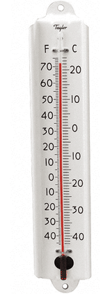
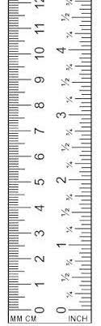

# Parameters {#sec-parameters}

```{r include=FALSE}
source("../starter.R")
```

The variety of shapes of the nine pattern-book functions means that, often, one or another will be suitable for the modeling situation in hand. But, even if the shape of the function used is appropriate, the pattern still needs to be “adjusted” so that the units of output and input are well matched to the phenomenon being modeled. Let's consider data from the outbreak of COVID-19 as an example.  @fig-covid-exp shows, day-by-day, the number of officially confirmed COVID-19 cases as the in the US in March 2020.

During the outbreak, case numbers increased with time. As time went on, the rate of case-number increase itself grew faster and faster. This is the same pattern provided by the exponential function.

Alongside the case-number data @fig-covid-exp shows the function $\text{cases}(t) \equiv e^t$ plotted as a $\color{magenta}{\text{magenta}}$ curve.

::: {#fig-covid-exp}
```{r echo=FALSE, warning=FALSE}
March <- Covid_US |> filter(lubridate::month(date)==3, 
                             lubridate::year(date)==2020) %>%
  mutate(day = lubridate::mday(date),
         confirmed = confirmed/10000)
Pcases <- gf_point(confirmed ~ day, 
         data = March) %>%
  gf_labs(y = "Cumulative cases (10000s)", x = "Day in March, 2020") %>%
  gf_lims(y=c(0,20)) 
Pcases %>%
  slice_plot(exp(t) ~ t, bounds(t=c(0,7)), 
             color="magenta", label_text = "exp(t)\n\n",
             label_x=0.6, label_vjust = "left", size=1) 
```

Cumulative officially confirmed COVID-19 cases (in 10000s) during the month of March, 2020. The $\\color{magenta}{\\text{magenta curve}}$ is $e^t$.
:::

There is an obvious mismatch between the data and the function $e^t$. Does this mean the COVID pattern is not exponential?

This chapter will introduce how modelers stretch and shift the individual patter-book functions so that they can be used in models of real-world situations such as the outbreak of COVID-19. 

## Matching numbers to quantities

The coordinate axes in @fig-covid-exp represent quantities. On the horizontal axis is time, measured in days. The vertical axis is denominated in "10000 cases," meaning that the numbers on the vertical scale should be multiplied by 10000 to get the number of cases.  

The exponential function takes as input a **pure number** and produces an output that is also a pure number. This is true for all the pattern-book functions. Since the graph axes don't show pure numbers, it is no surprise then that the pattern-book exponential function doesn’t align with the COVID case data.

[Recall that ***pure numbers***, like 17.32, do not have units. Quantities, on the other hand, usually do have units, as in 17.3 days or 34 meters.]{.aside}

If we want the input to the model function $\text{cases}(t)$ to be denominated in days, we will have to convert $t$ to a pure pure number (e.g. 10, not "10 days") *before* the quantity is handed off as the argument to $\exp()$. We do this by introducing a ***parameter***. 

[In every case, these parameters are arranged to translate a with-units quantity into a pure number suitable as an input to the pattern-book function. Similarly, parameters will translate the pure-number output from the pattern-book function into a quantity with units.]{.aside}

The standard parameterization for the exponential function is $e^{kt}$. The parameter $k$ will be a quantity with units of "per-day." Suppose we set $k=0.2$ per day. Then $k\, t{\LARGE\left.\right|}_{t=10 days} = 2$. This "2" is a pure number because the units on the 0.2 ("per day") and on the 10 (days) cancel out:
$$0.2\, \text{day}^{-1} \cdot 10\, \text{days} = 2\ .$$
The use of a parameter like $k$ does more than handle the formality of converting input quantities into pure numbers. Having a choice for $k$ allows us to stretch or compress the function to align with the data. @fig-covid-exp2 plots the modeling version of the exponential function to the COVID-case data:

```{r echo=FALSE, warning=FALSE}
#| label: fig-covid-exp2
#| fig-cap: "Using the function form $A e^{kt}$ with parameters $k=0.19$ per day and $A = 0.0573$ cases (in 10000s) matches the COVID-case data well."
Pcases %>%
  slice_plot(.0573*exp(0.19*t) ~ t, bounds(t=0:31), color="blue", label_x=0.5,
             label_text="A exp(k t)\nA = 593 cases\nk=0.19 per day\n", label_vjust = "left")
```


## Parallel scales


At the heart of how we use the pattern-book functions to model the relationship between quantities is the idea of conversion between one scale and another.  Consider these everyday objects: a thermometer and a ruler.

::: {#fig-thermo-ruler layout-ncol=2}
{#fig-thermometer height=400}

{#fig-thermometer height=400}

Two everyday objects that facilitate conversion from one scale to another.
:::

Each object presents a read-out of what's being measured---temperature or length---on two different scales. At the same time, the objects provide a way to convert one scale to another.

A function gives the output for any given input. We represent the input value as a position on a number line---which we call an "axis"---and the output as a position on another output line, almost always drawn perpendicular to one another. But the two number lines can just as well be parallel to one another. To evaluate the function, find the input value on the input scale and read off the corresponding output. 

We can translate the correspondance between one scale and the other into the form of a straight-line function. For instance, if we know the temperature in Fahrenheit ($^\circ$F) and want to convert it to Celsius ($^\circ C$) we have the following function:
$$C(F) \equiv {\small\frac{5}{9}}(F-32)\ .$$
Similarly, converting inches to centimeters  can be accomplished with
$$\text{cm(inches)} \equiv 2.54 \, (\text{inches}-0)\ .$$
Both of these scale conversion functions have the form of the straight-line function, which can be written as 
$$f(x) \equiv a x + b\ \ \ \text{or, equivalently as}\ \ \ \ f(x) \equiv a(x-x_0)\ ,$$ where $a$, $b$, and $x_0$ are ***parameters***.

In @sec-input-scaling, we will use the $ax + b$ form of scale conversion, to scale the **input** to pattern-book functions, but we could equally well have used $a(x-x_0)$.

In @sec-output-scaling we will introduce a second scale conversion function, for the **output** from pattern-book functions. That scaling will also be in the form of a straight-line function: $A x + B$. The use of the lower-case parameter names ($a$, $b$) versus the upper-case parameter names ($A$, $B$) will help us distinguish the two different uses for scale conversion, namely ***input scaling*** versus ***output scaling***.

## Input scaling {#sec-input-scaling}

@fig-tides-ri1 is based on the data frame `RI-tide`, a minute-by-minute record of the tide level in Providence, Rhode Island (USA) for the period April 1 to 5, 2010. The `level` variable is measured in meters; the `hour` variable gives the time of the measurement in hours after midnight at the start of April 1.

::: {#fig-tides-ri1}
```{r echo=FALSE}
Pa <- gf_line(level ~ hour, data = RI_tide, color="blue") %>%
  gf_labs(subtitle="Tide level", x="time (hours)", y="level (meters)") %>%
  gf_theme(axis.text.x = element_text(colour = "blue"),
           panel.grid.minor = element_line(color = "blue", linewidth = 0.1),
           panel.grid.major = element_line(color="blue", linewidth = 0.1),
           axis.text.y = element_text(color = "magenta"),
           axis.title.y = element_text(color = "magenta"),
           axis.title.x = element_text(color = "blue"),
           title = element_text(color="blue")
           ) %>%
  gf_theme(scale_x_continuous(breaks=seq(0, 110, by=10)))
Pb <- slice_plot(sin(t) ~ t, bounds(t=0:(17*pi)), npts=500) %>%
  gf_labs(subtitle=latex2exp::TeX("$sin(t)$ from the pattern book")) %>%
  gf_theme(scale_x_continuous(breaks=seq(0, 55, by=5))) %>%
  gf_lims(y=c(-1.5, 1.5))
gridExtra::grid.arrange(Pa, Pb, ncol=1)
```

Tide levels oscillate up and down over time. This is analogous to the $\\sin(t)$ pattern-book function.
:::

The pattern-book $\sin()$ and the function $\color{magenta}{\text{level}}\color{blue}{(hour)}$ have similar shapes, so it seems reasonable to model the tide data as a sinusoid. However, the scale of the axes is different on the two graphs.

To model the tide with a sinusoid, we need to modify the sinusoid to change the scale of the input and output. First, let's look at how to accomplish the ***input scaling***. Specifically, we want the pure-number input $t$ to the sinusoid be a function of the quantity $hour$. Our framework for this re-scaling is the straight-line function. We will replace the pattern-book input $t$ with a function $$t(\color{blue}{hour}) \equiv a\, \color{blue}{hour} + b\ .$$

The challenge is to find values for the parameters $a$ and $b$ that will transform the $\color{blue}{\mathbf{\text{blue}}}$ horizontal axis into the **black** horizontal axis, like this:

```{r echo=FALSE}
scale_shift(0, 53, r=2, x0=-1, nticks=10) %>%
  gf_vline(xintercept=~ 4) %>%
  gf_vline(xintercept=~49)
```

By comparing the two axes, we can estimate that $\color{blue}{10} \rightarrow 4$ and $\color{blue}{100} \rightarrow 49$. With these two coordinate points, we can find the straight-line function that turns $\color{blue}{\mathbf{\text{blue}}}$ into **black** by plotting the coordinate pairs $(\color{blue}{0},1)$ and $(\color{blue}{100}, 51)$ and finding the straight-line function that connects the points.

```{r echo=FALSE, warning=FALSE}
#| label: fig-blue-to-black-1
#| fig-cap: "The input scaling function must transform 10 into 4 and transform 100 into 49 to properly arrange the time scale with the scale for the pattern-book function."
Pts <- tibble(x=c(10, 100), y=c(4, 49), text=c("(10,4)","(100,49)"))
gf_point(y ~ x, data = Pts) %>%
  gf_vline(xintercept = ~ x, color="blue", alpha=0.5) %>%
  gf_hline(yintercept = ~ y, color="black", alpha=0.5) %>%
  gf_theme(scale_x_continuous(limits=c(-20,110),
                              breaks=seq(-20, 110, by=10))) %>%
  gf_theme(scale_y_continuous(limits=c(-10, 60),
                              breaks=seq(-10, 60, by=5))
  ) %>%
  gf_labs(x = "time (hours)", y="t (pure number)") %>%
  gf_theme(axis.text.x = element_text(colour = "blue"),
           axis.title.x = element_text(color = "blue")
           ) %>%
  gf_text(y ~ x, label=~text, hjust=1, vjust=-.5) %>%
  slice_plot(-1 + .5*hour ~ hour, bounds(hour=c(-20,110)),
             size=3, alpha=.4) %>%
  gf_refine(coord_fixed())
```

You can calculate for yourself that the function that relates $\color{blue}{\mathbf{\text{blue}}}$ to **black** is $$t(\color{blue}{time}) = \underbrace{\frac{1}{2}}_a \color{blue}{time}  \underbrace{-1\LARGE\strut}_b$$

Replacing the pure number $t$ as the input to pattern-book $\sin(t)$ with the transformed $\frac{1}{2} \color{blue}{time}$ we get a new function:
$$g(\color{blue}{time}) \equiv \sin\left(\strut {\small\frac{1}{2}}\color{blue}{time} - 1\right)\ .$$
@fig-tides-ri2 plots $g()$ along with the actual tide data.

```{r echo=FALSE}
#| label: fig-tides-ri2
#| fig-cap: "The sinusoid with input scaling (black) aligns nicely with the tide-level data."
g1 <- ggplotGrob(Pa)
Pb2 <- slice_plot(sin(time/2 - 1) ~ time,
                  bounds(time=0:107), npts=500) %>%
  gf_labs(x="time (hours)",
          y=latex2exp::TeX("$g(time)$")) %>%
  gf_theme(scale_x_continuous(limits=c(0, 110),
                              breaks=seq(0, 110, by=10))) |> 
  gf_lims(y=c(-1.5,1.5)) %>%
  ggplotGrob()
g <- rbind(g1, Pb2, size="first")
g$widths <- grid::unit.pmin(g1$widths, Pb2$widths)

grid::grid.newpage()
grid::grid.draw(g)
 
#gridExtra::grid.arrange(Pa, Pb2,widths=c(.95, 1), ncol=1)
```

## Output scaling {#sec-output-scaling}

Just as the natural input needs to be scaled before it reaches the pattern-book function, so the output from the pattern-book function needs to be scaled before it presents a result suited for interpreting in the real world. 

::: {#fig-scaling-nature}


Natural **quantities** must be scaled to pure numbers before being suited to the pattern-book functions. The output from the pattern-book function is a pure number which is scaled to the natural **quantity** of interest.
:::

The overall result of input and output scaling is to tailor the pattern-book function so that it is ready to be used in the real world.

Let's return to @fig-tides-ri2 which shows that the function $g(\color{blue}{time})$, which scales the input to the pattern-book sinusoid, has a much better alignment to the tide data. Still, the vertical axes of the two graphs in the figure are not the same.

This is the job for ***output scaling***, which takes the output of $g(\color{blue}{time})$ (bottom graph) and scales it to match the $\color{magenta}{level}$ axis on the top graph. That is, we seek to align the **black** vertical scale with the $\color{magenta}{\mathbf{\text{magenta}}}$ vertical scale.
To do this, we note that the range of the $g(\color{blue}{time})$ is -1 to 1, whereas the range of the tide-level is about 0.5 to 1.5. The output scaling will take the straight-line form
$${\color{magenta}{\text{level}}}({\color{blue}{time}}) = A\, g({\color{blue}{time}}) + B$$
or, in graphical terms

```{r echo=FALSE, warning=FALSE, message=FALSE}
scale_shift(-1.5, 1.75, r=.5, x0=-2, color="magenta", nticks=10) %>%
  gf_vline(xintercept=~ 1) %>%
  gf_vline(xintercept=~-1) %>%
  gf_refine(coord_flip())
```

We can figure out parameters $A$ and $B$ by finding the straight-line function that connects the coordinate pairs $(-1, \color{magenta}{0.5})$ and $(1, \color{magenta}{1.5})$ as in @fig-black-to-magenta-1.

```{r echo=FALSE}
#| label: fig-black-to-magenta-1
#| fig-cap: "Finding the straight-line function that converts $-1 \\rightarrow \\color{magenta}{0.5}$ and converts $1 \\rightarrow \\color{magenta}{1.5}$"
Pts <- tibble(x=c(-1, 1), y=c(0.5, 1.5), text=c("(-1,0.5)","(+1,1.5)"))
gf_point(y ~ x, data = Pts) %>%
  gf_vline(xintercept = ~ x, color="black", alpha=0.5) %>%
  gf_hline(yintercept = ~ y, color="magenta", alpha=0.5) %>%
  gf_theme(scale_x_continuous(limits=c(-1.5,1.5),
                              breaks=seq(-1.5, 1.5, by=0.5))) %>%
  gf_theme(scale_y_continuous(limits=c(0, 2),
                              breaks=seq(0, 2, by=.5))
  ) %>%
  gf_labs(x = "g(time)", y="level(g(time))") %>%
  gf_theme(axis.text.y = element_text(colour = "magenta"),
           axis.title.y = element_text(color = "magenta")
           ) %>%
  gf_text(y ~ x, label=~text, hjust=1, vjust=-.5) %>%
  slice_plot(1 + .5*g ~ g, bounds(g=c(-1.5,1.5)),
             size=3, alpha=.4) %>%
  gf_refine(coord_fixed())
```
You can confirm for yourself that the function that does the job is $${\color{magenta}{\text{level}}} = 0.5 g({\color{blue}{time}}) + 1\ .$$


Putting everything together, that is, scaling both the input to pattern-book $\sin()$ and the output from pattern-book $\sin()$, we get

$${\color{magenta}{\text{level}}}({\color{blue}{time}}) = \underbrace{0.5}_A \sin\left(\underbrace{\small\frac{1}{2}}_a {\color{blue}{time}}  \underbrace{-1}_b\right) + \underbrace{1}_B$$

## A procedure for building models

We've been using pattern-book functions as the intermediaries between input scaling and output scaling, using this format.

$$f(x) \equiv A e^{ax + b} + B\ .$$
We can use the other pattern-book functions---the gaussian, the sigmoid, the logarithm, the power-law functions---in the same way. That is, the basic framework for modeling is this:

$$\text{model}(x) \equiv A\, {g_{pattern\_book}}(ax + b) + B\ ,$$ where $g_{pattern\_book}()$ is one of the pattern-book functions. To construct a basic model, you task has two parts:

1. Pick the specific pattern-book function whose shape resembles that of the relationship you are trying to model. For instance, we picked $e^x$ for modeling COVID cases versus time (at the start of the pandemic). We picked $\sin(x)$ for modeling tide levels versus time.

2. Find numerical values for the parameters $A$, $B$, $a$, and $b$. In @sec-fitting-by-feature shows some ways to make this part of the task easier.

It is remarkable that models of a very wide range of real-world relationships between pairs of quantities can be constructed by picking one of a handful of functions, then scaling the input and the output. As we move on to other Blocks in *MOSAIC Calculus*, you will see how to generalize this to potentially complicated relationships among more than two quantities. That is a big part of the reason you're studying calculus.

## Other formats for scaling

Often, modelers choose to use input scaling in the form $a (x - x_0)$ rather than $a x + b$. The two are completely equivalent when $x_0 = - b/a$. The choice between the two forms is largely a matter of convention. But almost always the output scaling is written in the format $A y + B$. 

::: {#thm-covid-scaling style="display: none;"}
---Shifting an exponential horizontally is the same as scaling vertically.
:::
::: {.callout-note}
## @thm-covid-scaling The start of COVID
For the COVID case-number data shown in @fig-covid-exp2, we found that a reasonable match to the data can be had by input- and output-scaling the exponential: $$\text{cases}(t) \equiv  \underbrace{573}_A e^{\underbrace{0.19}_a\ t}\ .$$

You might wonder why the parameters $B$ and $b$ aren't included in the model. One reason is that cases and the exponential function already have the same range: zero and upwards. So there is no need to shift the output with a parameter B. 

Another reason has to do with the algebraic properties of the exponential function. Specifically, 
$$e^{a x + b}= e^b e^{ax} = {\cal A} e^{ax}$$ where ${\cal A} \equiv e^b$.

In the case of exponentials, writing the input scaling in the form $e^{a(x-x_0)}$ can provide additional insight. 

A bit of symbolic manipulation of the model can provide some additional insight. As you know, the properties of exponentials and logarithms are such that
$$A e^{at} = e^{\lb(A)} e^{at} = e^{a t + \ln(A)} = e^{a\left(\strut t + \lb(A)/a\right)} = e^{a(t-t_0)}\ ,$$
where $$t_0 = - \ln(A)/a = - \ln(593)/0.19 = -33.6\ .$$
You can interpret $t_0$ as the starting point of the pandemic. When $t = t_0$, the model output is $e^{k 0} = 1$: the first case. According to the parameters we matched to the data for March, the pandemic's first case would have happened about 33 days before March 1, which is late January. We know from other sources of information, the outbreak began in late January. It is remarkable that even though the curve was constructed without any data from January or even February, the data from March, translated through the curve-fitting process, pointed to the start of the outbreak. This is a good indication that the exponential form for the model is fundamentally correct.
:::

## Parameterization conventions

There are conventions for the symbols used for input-scaling parameterization of the pattern-book functions. Knowing these conventions makes it easier to read and assimilate mathematical formulas. In several cases, there is more than one conventional option. For instance, the sinusoid has a variety of parameterization forms that get used depending on which feature of the function is easiest to measure. @tbl-parameterization list several that are frequently used in practice.

::: {#tbl-parameterization }
Function    | Written form | Parameter 1 | Parameter 2
----------|-------------|-------------|--------------
Exponential | $e^{kt}$     | $k$  | Not used
Exponential | $e^{t/\tau}$     | $\tau$ "time constant" | Not used
Exponential | $2^{t/\tau_2}$     | $\tau_2$ "doubling time" | Not used 
Exponential | $2^{-\tau_{1/2}}$ | $-\tau_{1/2}$ "half life" | Not used
Power-law   | $[x - x_0]^p$    | $x_0$ x-intercept | exponent
Sinusoid    | $\sin\left(\frac{2 \pi}{P} (t-t_0)\right)$ | $P$ "period" | $t_0$ "time shift" 
Sinusoid | $\sin(\omega t + \phi)$ | $\omega$ "angular frequency" | $\phi$ "phase shift"
Sinusoid | $\sin(2 \pi \omega t + \phi)$ | $\omega$ "frequency" | $\phi$ "phase shift"
Gaussian     | dnorm(x, mean, sd) | "mean" (center)| sd "standard deviation"
Sigmoid  | pnorm(x, mean, sd) | "mean" (center) | sd "standard deviation"
Straight-line | $mx + b$ | $m$ "slope" | $b$ "y-intercept"
Straight-line | $m (x-x_0)$ | $m$ "slope" | $x_0$ "center"

Some standard forms of *input scaling* parameterizations
:::

