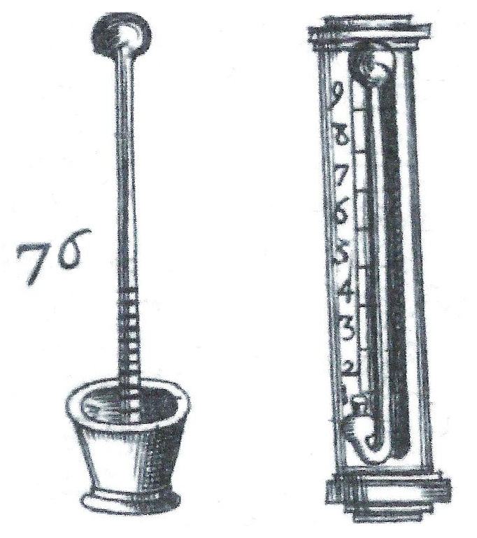
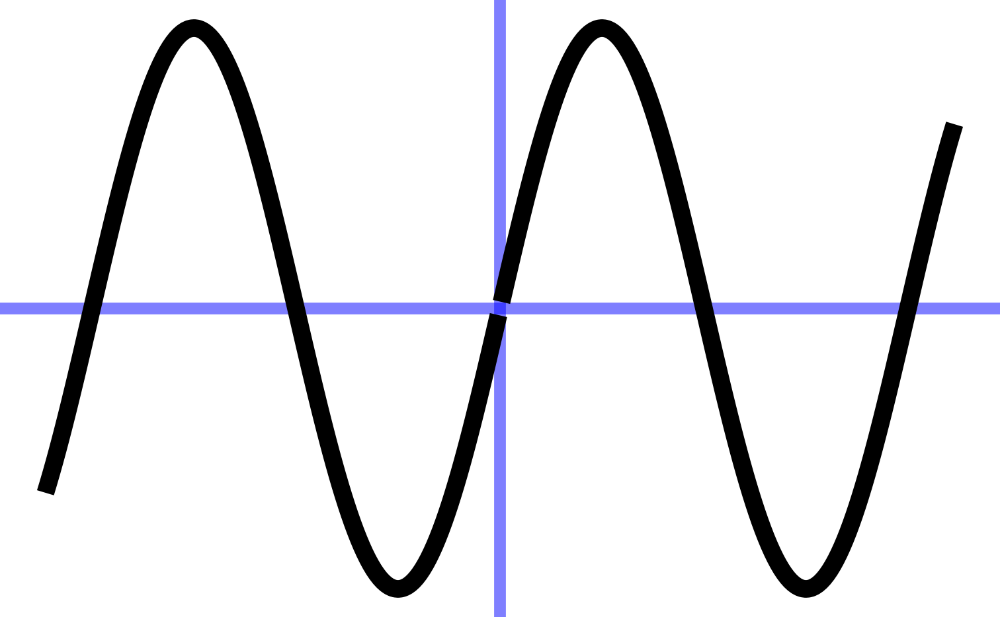
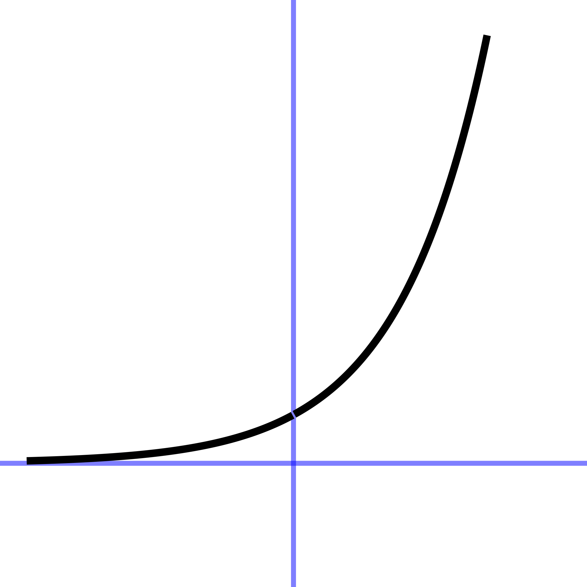
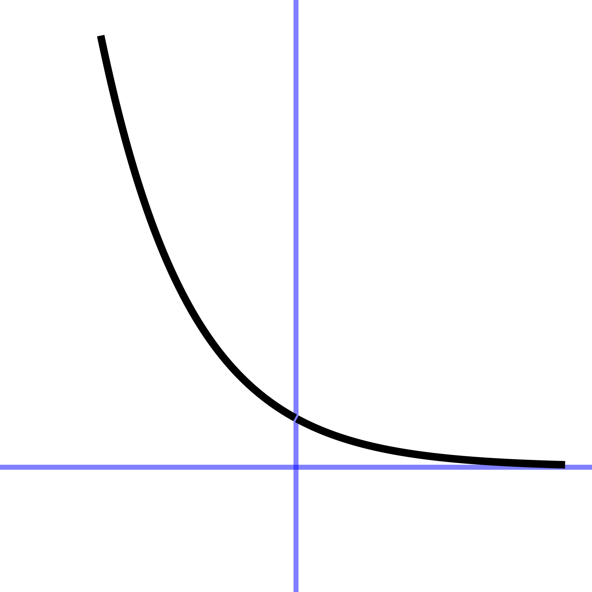
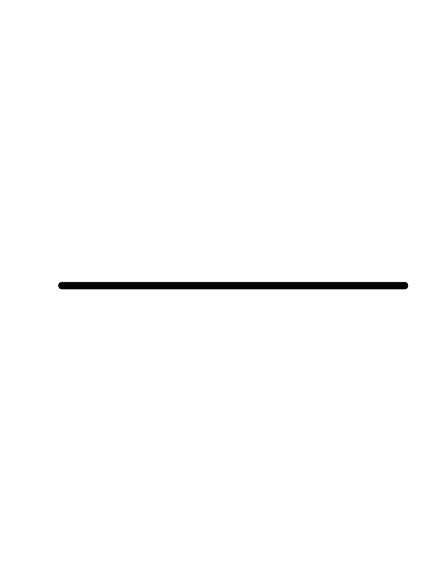
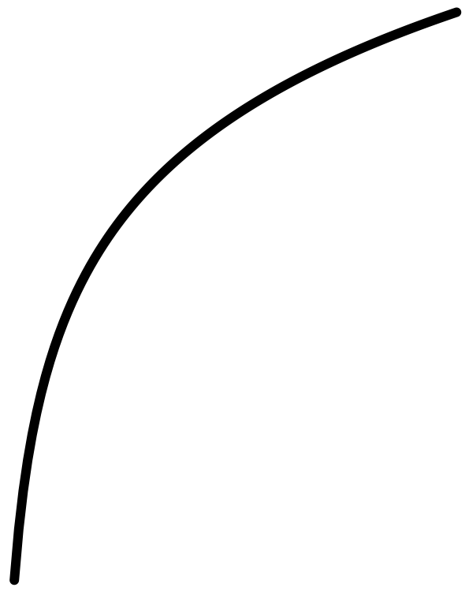

# Fitting features {#sec-fitting-by-feature}

```{r include=FALSE}
source("../starter.R")
```

For more than three centuries, there has been a standard calculus model of an everyday phenomenon: a hot object such as a cup of coffee cooling off to room temperature. The model, called ***Newton's Law of Cooling***, posits that the rate of cooling is proportional to the *difference* between the object's temperature and the ambient temperature. The technology for measuring temperature  (@fig-early-thermometers) was rudimentary in Newton's era, raising the question of how Newton formulated a quantitative theory of cooling. (@sec-low-order returns to this question.)

::: {#fig-early-thermometers}



Thermometers in the 1600s were primitive affairs. This is thought to be the earliest published image of thermometers, by Jean Leurechon in *Recréation Mathématicque* (1626) [Image source](https://commons.wikimedia.org/w/index.php?curid=67780885)
:::

Using today's much more precise technology, Prof. Stan Wagon of Macalester College investigated the accuracy of Newton's "Law." @fig-stans-data shows some of Wagon's data from experiments with cooling water. He poured boiling water from a kettle into an empty room-temperature mug (26 degrees C) and measured the temperature of the water over the next few hours.

::: {#fig-stans-data}
```{r echo=FALSE}
set.seed(101)
gf_point(temp ~ time, data=CoolingWater ) %>%
  gf_labs(x = "Time (minutes)", y="Temperature (deg. C)")
```

Temperature of a mug of hot water as it cools.[Source](https://www.researchgate.net/profile/Gianluca_Argentini/post/Is_analogy_reasoning_between_heat_transfert_and_electriocity_allows_to_apply_the_electricity_laws_about_resistance_to_thermal_resistances/attachment/59d6573379197b80779ada64/AS%3A533325451403264%401504166104259/download/Stan+WAGON+How+quickly+does+water+cool.pdf)
:::

This chapter is about ***fitting***, finding parameters and coefficients that will align a function with data such as in @fig-stans-data. This chapter covers the exponential, sinusoid, and gaussian functions. @sec-magnitude considers the power-law and logarithm functions.

::: {#tbl-three-fitted-shapes}

Gaussian | Sinusoid | Exponential
:--:|:--:|:--:
 |  |  
Function shapes for this chapter
:::

In every instance, the first step, before finding parameters, is to determine that the pattern shown in the data is a reasonable match to the shape of the function you are considering. Here's a reminder of the shapes of the functions we will be fitting to data in this chapter. If the shapes don't match, there is little point in looking for the parameters to fit the data!

## Gaussian

The ability to perceive color comes from "cones": specialized light-sensitive cells in the retina of the eye.  Human color perception involves three sets of cones. The L cones are most sensitive to relatively long wavelengths of light near 570 nanometers. The M cones are sensitive to wavelengths near 540 nm, and the S cones to wavelengths near 430nm.

The current generation of Landsat satellites uses nine different wavelength-specific sensors. This makes it possible to distinguish features that would be undifferentiated by the human eye. 

::: {#fig-bird-views}


Two views of the same scene synthesized by combining the output of different types of cones. The top picture uses V, M, and S cones; the bottom  only S, M, and L cones. The dark geen leaves revealed in the top picture are not distinguishable in the bottom picture. (Source: Tedore and Nilsson)
:::


Back toward Earth, birds have five sets of cones that cover a wider range of wavelengths than humans. (@fig-bird-cones) Does this give them a more powerful sense of the differences between natural features such as foliage or plumage? One way to answer this question is to take photographs of a scene using cameras that capture many narrow bands of wavelengths. Then, knowing the sensitivity spectrum of each set of cones, new "false-color" pictures can be synthesized recording the view from each set.^[Cynthia Tedore & Dan-Eric Nilsson (2019) "[Avian UV vision enhances leaf surface contrasts in forest environments](https://doi.org/10.1038)", *Nature Communications* **10**:238  -@fig-bird-views  and -@fig-bird-cones ] 


::: {#fig-bird-cones}


Sensitivity to wavelength for each of the five types of bird cones. [Source: Tedore and Nilsson]
:::

Creating the false-color pictures on the computer requires a mathematical model of the sensitivities of each type of cone. The graph of each sensitivity function resembles a Gaussian function.

The Gaussian has two parameters: the "mean" and the "sd" (short for standard deviation). It is straightforward to estimate values of the parameters from a graph, as in @fig-gauss-param-estimates. 

::: {#fig-gauss-param-estimates}
```{r echo=FALSE}
myarrow = grid::arrow(ends="both", length=unit(.3, "cm"))
slice_plot(dnorm(w, mean=600, sd=35) ~ w, bounds(w=400:750), color="red") %>%
  gf_vline(xintercept=~600, color="blue", linetype="dashed") %>%
  gf_text(.0016 ~ 590, label="mean", color="blue", angle=90) %>%
  gf_hline(yintercept=~0.0055, color="brown", linetype="dotted") %>%
  gf_text(0.006 ~ 450, label="half-height", color="brown")%>%
  gf_segment(0.0055+0.0055 ~ 600 + 640, color="brown", arrow=myarrow) %>%
  gf_text(0.006 ~ 620, label="sd", color="brown")
 
```

A Gaussian function annotated to identify the parameters mean (location of peak of graph) and sd (half-width at half-height).
:::

The parameter "mean" is the location of the peak. The standard deviation is, roughly, half the width of the graph at a point halfway down from the peak. 

## Sinusoid

We will use three parameters for fitting a sinusoid to data: 
$$A \sin\left(\frac{2\pi}{P}\right) + B$$ 
where 

- $A$ is the "amplitude"
- $B$ is the "baseline" 
- $P$ is the period. 

::: {#fig-tides-ri2}
```{r echo=FALSE, warning=FALSE}
gf_line(level ~ hour, data = RI_tide, color="blue") %>%
  gf_hline(yintercept=c(0.5, 1.6), color="brown", linetype = "dashed") %>%
  gf_hline(yintercept=~1.05, color="magenta") %>%
  gf_labs(x = "t (hours)") %>%
  gf_vline(xintercept = ~ 6, color="black", linetype="dotted") %>%
  gf_vline(xintercept = ~ 106, color="black", linetype="dotted")
```

A reproduction of the data originally shown in @fig-tides-ri1. The baseline for the sinusoid is midway between the top of the oscillation and the bottom.
:::

The ***baseline*** for the sinusoid is the value mid-way between the top of the oscillations and the bottom. For example,  @fig-tides-ri1 shows the sinusoidal-like pattern of tide levels. Dashed horizontal lines ($\color{brown}{\text{brown}}$) have been drawn roughly going through the top of the oscillation and the bottom of the oscillation. The baseline ($\color{magenta}{\text{magenta}}$) will be halfway between these top and bottom levels.

The ***amplitude*** is the vertical distance between the baseline and the top of the oscillations. Equivalently, the amplitude is **half** the vertical distance between the top and the bottom of the oscillations. 

In a pure, perfect sinusoid, the top of the oscillation---the peaks---is the same for every cycle, and similarly with the bottom of the oscillation---the troughs. The data in @fig-tides-ri1 is only approximately a sinusoid so the top and bottom have been set to be representative. In @fig-tides-ri2, the top of the oscillations is marked at level 1.6, the bottom at level 0.5. The baseline is therefore $B \approx = (1.6 + 0.5)/2 = 1.05$. The amplitude is $A  = (1.6 - 0.5)/2 = 1.1/2 = 0.55$.  


To estimate the ***period*** from the data, mark the input for a distinct point such as a local maximum, then count off one or more cycles forward and mark the input for the corresponding distinct point for the last cycle. For instance, in @fig-tides-ri2, the tide level reaches a local maximum at an input of about 6 hours, as marked by a black dotted line. Another local maximum occurs at about 106 hours, also marked with a black dotted line. In between those two local maxima you can count  $n=8$ cycles. Eight cycles in $106-6 = 100$ hours gives a period of $P = 100/8 = 12.5$ hours.

## Exponential {#sec-exponential-water}

To fit an exponential function, such as the ones in @fig-two-exponentials, we estimate the three parameters: $A$, $B$, and $k$ in 
$$A \exp(kt)+ B$$

::: {#fig-two-exponentials}

Exp. growth |  | Exp. decay 
:-----:|---|:-----:
 |  |  

Exponential decay is a left-to-right flip of exponential growth. 
:::

The data in @fig-stans-data illustrates the procedure. The first question to ask is whether the pattern shown by the data resembles an exponential function. After all, the exponential pattern book function grows in output as the input gets bigger, whereas the water temperature is getting smaller---the word *decaying* is used---as time increases. To model exponential decay, use $\exp(-k t)$, where the negative sign effectively flips the pattern-book exponential left to right. 

The exponential function has a horizontal asymptote for negative inputs. The left-to-right flipped exponential $\exp(-k t)$ also has a horizontal asymptote, but for positive inputs.

The parameter $B$, again called the "baseline," is the location of the horizontal asymptote on the vertical axis. @fig-stans-data suggests the asymptote is located at about 25 deg. C. Consequently, the estimated value is $B \approx 25$ deg C.

### Estimating A

The parameter $A$ can be estimated by finding the value of the data curve at $t=0$. In Figure @fig-exp-water-k that is  just under 100 deg C. From that, subtract off the baseline you estimated earlier: ($B = 25$ deg C). The amplitude parameter $A$ is the *difference* between these two: $A = 99 - 25 = 74$ deg C.

### Estimating k {#sec-doubling-time}

The exponential has a unique property of "doubling in constant time" as described in @sec-doubling-time. We can exploit this to find the parameter $k$ for the exponential function.

a. The procedure starts with your estimate of the baseline for the exponential function. In @fig-exp-water-k the baseline has been marked in $\color{magenta}{\text{magenta}}$ with a value of 25 deg C.

b. Pick a convenient place along the horizontal axis. You want a place such that the distance of the data from the baseline to be pretty large. In @fig-exp-water-k the convenient place was selected at $t=25$. 


::: {#fig-exp-water-k}
```{r echo=FALSE}
myarrow = grid::arrow(ends="both", length=unit(.3, "cm"))
baseline=25
Pts <- tibble(
  t = c(25, 65),
  
  y = c(61, 43.5),
  amp = y - baseline
)
gf_point(temp ~ time, data=CoolingWater ) %>%
  gf_labs(x = "Time (minutes)", y="Temperature (deg. C)") %>%
  gf_hline(yintercept=~25, color="magenta") %>%
  gf_segment(25 + y ~ t + t, data = Pts, color="brown", arrow=myarrow ) %>%
  gf_text(43 ~ 25, label="convenient place", color="brown", hjust = -1, angle=90) #%>% slice_plot(74*exp(-0.0173*time) + 25~ time, color="red")
```
Determining parameter $k$ for the exponential function using the doubling time.
:::

c. Measure the vertical distance from the baseline at the convenient place. In @fig-exp-water-k the data curve has a value of about 61 deg C at the convenient place. This is $61-25 = 36$ deg C from the baseline.

d. Calculate half of the value from (c). In @fig-exp-water-k this is $36/2=18$ deg C. But you can just as well do the calculation visually, by marking half the distance from the baseline at the convenient place.

e. Scan horizontally along the graph to find an input where the vertical distance from the data curve to the baseline is the value from (d). In @fig-exp-water-k that half-the-vertical-distance input is at about $t=65$. Then calculate the horizontal distance between the two vertical lines. In @fig-exp-water-k that is  $65 - 25 = 40$ minutes. This is the doubling time. Or, you might prefer to call it the "half-life" since the water temperature is decaying over time.

f. Calculate the magnitude $\|k\|$ as $\ln(2)$ divided by the doubling time from (e). That doubling time is 40 minutes, so $\|k\|= \ln(2) / 40 = 0.0173$.  We already know that the sign of $k$ is negative since the pattern shown by the data is exponential decay toward the baseline. So, $k=-0.0173$.

## Graphics layers

When fitting a function to data, it is wise to plot out the resulting function *on top of* the data. This involves making graphics with two ***layers***, as described in @sec-data-and-data-graphics. As a reminder, here is an example comparing the cooling-water data to the exponential function we fitted in @sec-exponential-water.

The fitted function we found was
$$T_{water}(t) \equiv 74 \exp(-0.0173 t) + 25$$ where $T$ stands for "temperature."

To compare $T_{water}()$ to the data, we will first plot out the data with `gf_point()`, then add a slice plot of the function. We will also show a few bells and whistles of plotting: labels, colors, and such. 

::: {#fig-water-function-compare}
```{r echo=TRUE}
T_water <- makeFun(74*exp(-0.0173*t) + 25 ~ t)
gf_point(temp ~ time, data = CoolingWater, alpha = 0.5 ) %>%
  slice_plot(T_water(time) ~ time, color = "blue") %>%
  gf_labs(x = "Time (minutes)", y = "Temperature (deg. C)")
```

A graphic with two layers: one for the cooling-water data and the other with the exponential function fitted to the data.
:::

The `slice_plot()` command inherited the domain interval from the `gf_point()` command. This happens only when the name of the input used in `slice_plot()` is the same as that in `gf_point()`. (it is `time` in both.) You can add additional data or function layers by extending the pipeline.

By the way, the fitted exponential function is far from a perfect match to the data. @sec-modeling-science-method returns to this mismatch in exploring the ***modeling cycle***.

## Fitting other pattern-book functions

This chapter has looked at fitting the exponential, sinusoid, and Gaussian functions to data. Those are only three of the nine pattern-book functions. What about the others?

::: {.column-page-inset-right}
const | prop | square | recip | gaussian | sigmoid | sinusoid | exp | ln
:--:|:--:|:--:|:--:|:--:|:--:|:--:|:--:|:--:
 |  | | |  |  |  |  |  

: Shapes of the pattern-book functions {#tbl-pattern-book-shapes}
:::

In Blocks 2 and 4, you will see how the Gaussian and the sigmoid are intimately related to one another. Once you see that relationship, it will be much easier to understand how to fit a sigmoid to data.

The remaining five pattern-book functions, the ones we haven't discussed in terms of fitting, are the logarithm and the four power-law functions included in the pattern-book set. @sec-magnitude introduces a technique for estimating from data the exponent of a single power-law function. 

In high school, you may have done exercises where you estimated the parameters of straight-line functions and other polynomials from graphs of those functions. In professional practice, such estimations are done with an entirely different and completely automated method called ***regression***. We will introduce regression briefly in @sec-modeling-science-method. However, the subject is so important that all of Block 3 is devoted to it and its background.

## Polishing parameters {#sec-polishing-promise}

Often, fitting parameters to match a pattern seen in data can be done automatically (or semi-automatically) by software. When there are multiple inputs to the function, practicality demands that automated techniques be used. And even when it's easy to estimate parameters by eye, as with the examples in this chapter, they can be improved by use of function-fitting software. We call this improvement in estimated parameters "**polishing**."

An example of such automated fitting is given in @lst-first-two-layers. @sec-modeling-science-method covers the topic in more depth.


