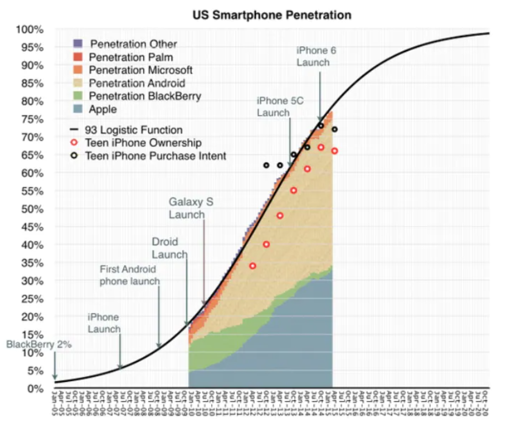

`r insert_calcZ_exercise("XX.XX", "kCUb0E", "/Users/kaplan/MC2/Modeling/Exercises/buck-shut-stove.Rmd")`

The graph shows the proportion $P$ of the US cell-phone users who own a smart phone as a function of the year $y$. 

```{r echo=FALSE}

```

As a rule, when a quantity grows exponentially but is ultimately limited to some maximum level, the sigmoid is the choice for modeling. The proportion of smartphone owners grew exponentially during the early 2000's. As the number of smartphones increased, the broader familiarity with and advertisement of smartphones also increased, which help sustain this exponential growth. However, adoption has slowed as smartphone penetration reaches the maximum carrying capacity. In other words, once everyone has a smartphone, the proportion of smartphone owners cannot increase---everyone already owns a smartphone. So, eventually the exponential growth must taper-off. According to several datasets, this inflection point occurred sometime between 2013 and 2014. This behavior is visible in the graphic below showing US smartphone penetration between Jan 2005 and Oct 2020 with raw data shown from 2010 to 2015.

```{r bssg-1, echo=FALSE, results="markup"}
askMC(
  prompt="During the initial, exponential phase of smartphone penetration, what was the doubling time for penetration? (Note that the horizontal axis labels have 1/4 year inbetween them.)",
  "About 2%"= "That's not a doubling time!",
  "About 6 months",,
  "+About 18 months+" = "The penetration was 5% just after April 2007 and doubled to 10% by October 2008.",
  "About 24 months.",
  random_answer_order = FALSE
)
```

```{r bssg-2, echo=FALSE, results="markup"}
askMC(
  prompt="Referring to the black sigmoidal curve, what is the **mean** parameter?",
  "Jan. 2010",
  "Oct. 2010",
  "+July 2012+",
  "50%" = "50% is the value of the sigmoidal curve when the input equals the mean parameter.",
  random_answer_order = FALSE
)
``` 

```{r bssg-3, echo=FALSE, results="markup"}
askMC(
  prompt="Referring to the black sigmoidal curve, what is the **standard deviation** parameter?",
  "Jan. 2010",
  "Jan. 2011", 
  "Jan. 2014",
  "19 months" = "The standard deviation is a distance along the horizontal axis. Such a distance is measured in months.",
  random_answer_order = FALSE
)
```

Credit: 2021-2022 Math141Z/Math142Z development team.


