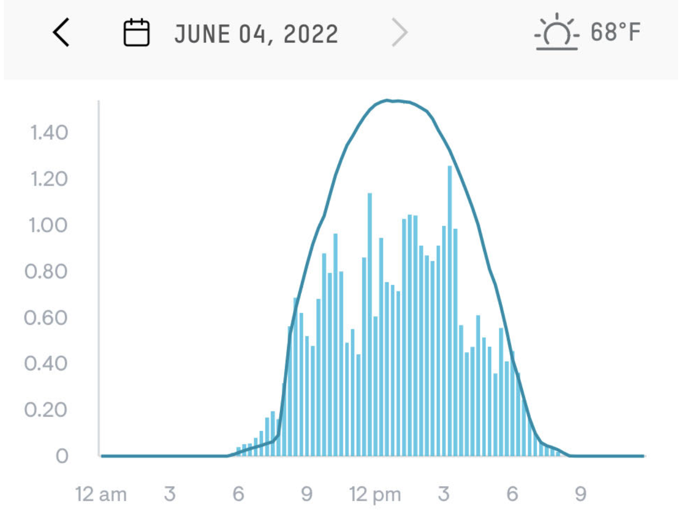

```{r echo=FALSE}
#| label: fig-solar-june
#| fig-cap: "Power produced by the author's rooftop photovoltaic array in June 4 (solid line) and June 3 (bars), 2022."

```

@fig-solar-june comes from the monitoring app for a photovoltaic (solar electricity) array on two consecutive days in June 2022. The vertical axis is in kilowatts (power). The overall pattern for June 4 is a hump function with a peak around 13:00 falling to zero at 6am and 9pm. (13:00 is roughly solar noon, due to daylight savings time.) We'll call this function sun(t). June 3 shows a more complex pattern, due to passing clouds that diminish the available sunlight. 

A reasonable model for the June 3 pattern is the hump function sun(t) *multiplied by* an irregular function of time representing the clouds. Let's call it cloudiness(t), imagining that the range is from 0 (dark, obscuring clouds) to 1 (no clouds at all). The power produced is therefore 

power(t) $\equiv$ solar(t) $\times$ cloudiness(t)

Using @fig-solar-june, sketch out the graph of cloudiness(t) for June 3.


