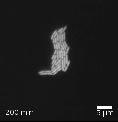

`r insert_calcZ_exercise("XX.XX", "ZLdoAr", "/Users/kaplan/MC2/Modeling/Exercises/horse-find-chair.Rmd")`

Here are four frames from a movie showing (through a microscope) the growth of *E. coli.* bacteria.

::: {layout-nrow=2}





:::

1. In each frame, count the number of bacteria.
2. Construct a data frame recording the time stamp and the number of bacteria in each frame. The unit of observation is a frame. You can use a command like this, replacing the `count` with your own numbers:

```{r results="hide"}
Ecoli <- tibble::tribble(
  ~ time, ~ count,
  100, 36,
  150, 289,
  200, 1683,
  250, 2945
)

```

3. Make a point plot of the number of bacteria versus time. Use linear, logarithmic or semi-logarithmic axes as most appropriate to show a simple pattern.

A. Which type of axes shows the pattern most simply?

B. Is the pattern most consistent with linear growth, exponential growth, or power-law growth.

C. From your graph, find the parameter that describes the growth rate:
    - If linear growth, the slope of the line (give units)
    - If exponential growth, the doubling time (give units)
    - If power law, the exponent (which will not have units).
    
    


