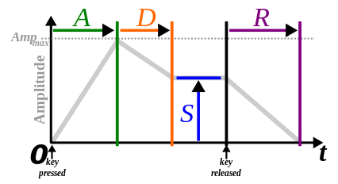

::: {.underconstruction}
Make this a computer exercise about multiplying functions. Try to play the sounds they create.
:::

This example concerns a bit of familiar technology: music synthesis. Generating a pure tone electronically is easily done using a sinusoid. Generating a note with rich instrumental timbre can be accomplished by a linear combination of sinusoids. Of course, the note will be localized in time. This could be accomplished by multiplying the sinusoids by a gaussian function envelope.   

It turns out that the gaussian function, `dnorm()`, does not generate a realistic sound. Instead, a more complicated envelope is used, such as the [ADSR function](https://en.wikipedia.org/wiki/Envelope_(music)) shown in Figure \@ref(fig:ADSR). The function has six (!) parameters: the time the key is pressed, the duration A of the "attack" phase when the sound amplitude is increasing in response to the impulse imposed on the key, a decay of duration D to an output level S that lasts until the key is released, then a decay to zero over duration R. It's reasonable to think of the D and S phases as a piecewise linear approximation to exponential decay.

```{r echo=FALSE}
#| label: fig-ADSR
#| out-width: "65%"
#| fig-align: "center"
#| fig-cap: "The ADSR envelope function used in music synthesis consists of 6 pieces including zero output before the key is pressed and after the pulse ends. [Source](https://en.wikipedia.org/wiki/Envelope_(music))"

```

```{r echo=FALSE}
adsr <- function(a,d,ts, s,r) {
  function(t) {
    ifelse( 
      t < a, 2*t,
      ifelse(
        t < (a+d), 2*a - ((t-a)/d)*(s - 2*a),
        elseif(
          t < (a+d+ts), s,
               elseif(
                 t > a + d + ts + r, 0,
                s - s*(t-(a + d + ts))/r
                )
        )
      )
    )
  }
}
```
