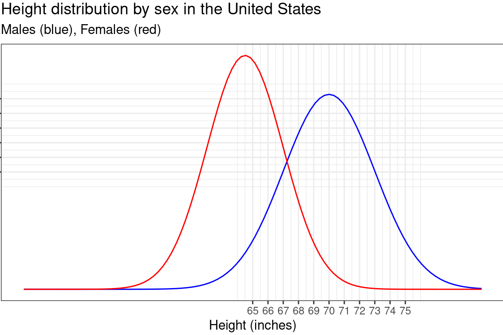

The distribution of adult heights is approximately Gaussian. The graph below shows the distribution of adult males and females separately. Use this graphic to answer the following questions.

```{r echo=FALSE}

```

```{r stg23-1, echo=FALSE}
askMC(
  prompt="Which sex has a larger mean height?",
  "+Males+"="The mean parameter is the argmax of the function. For the blue curve, this is at 70 inches. For the red curve, at 65.5 inches.",
  "Females"
)
```

An important fact about the gaussian function is that the area under the graph is always 1. This means that, when comparing two gaussians, the taller one will be the narrower one.


```{r stg23-2, echo=FALSE}
askMC(
  prompt="Which sex has a larger standard deviation of height?",
  "+Males+",
  "Females"
)
```

The standard deviation of a gaussian can be estimated visually based on its graph. Let's estimate the standard deviation for males. To do this, start at the peak of the male distribution. The output value at the peak is $0.1329$. Find the output value that is 60% of this peak value. We're looking for the value 
$$0.1329(0.6)=0.0797\approx0.08$$
on the output (vertical) axis. Now, measure the **half** the width (i.e. along the horizontal axis) of the Gaussian along the line $$y=0.08$$. This is the standard deviation.

```{r stg23-3, echo=FALSE}
askMC(
  prompt="Which of these is the best estimate of the standard deviation of the distribution of heights for males?",
  "+3 inches+"="The width of the Gaussian along the line $y=0.08$ is approximately $6$. The total width is the distance along the line $y=0.08$ (because that's 60% of 0.1329) from 67 inches to 73 inches (that's 6 inches). So the half-width is $3$.",
  "6 inches",
  "7 inches",
  "8 inches",
  random_answer_order=FALSE)
```

```{r stg23-3, echo=FALSE}
askMC(
  prompt="The female height distribution has a mean of 64.5 and standard deviation of 2.5. Which R command can we use to plot the Gaussian for females?",
  "`slice_plot(dnorm(x,64.5,2.5)~x, bounds(x=0:64.5)`" = "The graphics domain has been set too narrowly to display the whole gaussian.",
  "+`slice_plot(dnorm(x,64.5,2.5)~x, bounds(x=50:80)`+",
  "`slice_plot(pnorm(x,64.5, 2.5)~x, bounds(x=0:64.5))`" = "This plots a sigmoid, not a gaussian.",
  "`pnorm(x,64.5,2.5)~x`"="This doesn't plot anything. It's just a tilde expression.",
  random_answer_order=FALSE)
```

Credit: 2021-2022 Math 141Z development team
