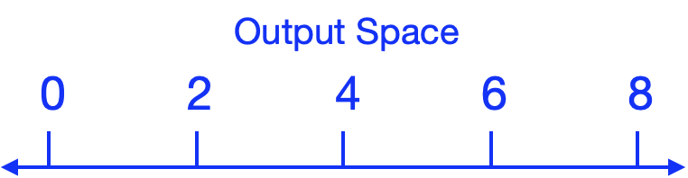

---
execute:
  keep-md: true
---


# Visualizing functions {#sec-graphs-and-graphics}


Although functions are often defined using a formula, humans are particularly adept at interpreting functions when presented graphically. This chapter is about two basic modes of function graphics, that is graphics which present the relationship between function input(s) and the output.

The first graphical model, called a **graph**, is most appropriate when the function has only one input. The second graphical model, called a **contour plot**, works well for functions with two inputs.

When it comes to functions with more than two inputs, a good strategy is  to simplify by taking a one- or two-dimensional **slice** through the input space. On this slice, the function can be presented using either a graph or a contour plot. 

## Graphics for functions with a single input

Most readers will have encountered **graphs** of functions in high-school or earlier. @fig-function-graph-3 shows an example: a graph of a function named `g()`. There is only one input to `g()`.

::: {#fig-function-graph-3}


::: {.cell layout-align="center"}
::: {.cell-output-display}
{fig-align='center' width=90%}
:::
:::


Graph of `g()`, a function with one input.
:::

Many calculus concepts can be made intuitive by referring to the shapes of function graphs. For now, however, we focus on a simple task: finding from a graph the output values corresponding to a given input. At the risk of telling you what you already know, the process is:

1. Find the horizontal location that corresponds to the given input and draw a vertical line through that location.
2. Mark the point where the vertical line in (1) intersects the curve.
3. Read off the output as the vertical location of the point in (2).

@lst-first-graph shows an R/mosaic graphics command that draws a *graph* of a function. 

::: {#lst-first-graph}
```{webr-r}
#| autorun: true
slice_plot(3*cos(z) + 7 ~ z, 
           domain(z = 0:10))
```
:::

You see the typical components of an R/mosaic command: a function name (`slice_plot()`) followed by a pair of parentheses. Inside the parentheses are *two* arguments, both of which are required. As it happens, the second argument is being placed on a new line, indented to align with the first argument, but this is solely for human readability. The two arguments are:

1. a tilde expression for the **function** you wish to graph
2. the **graphical domain** to be covered by the horizontal axis

A tilde expression suitable for `slice_plot()` must have a single input name on the right-hand side, as with the `~ z` in @lst-first-graph. Other than this restriction, the tilde expression is the same sort you have already used in `makeFun()`.

Remember that a function's domain is the space of all possible valid inputs to the function. The domain for most of the functions you studied in high school is infinite, for instance extending from $-\infty$ to $\infty$. A graphical domain, in contrast, is usually a finite part of the function domain.

You set the graphical domain via the second argument to `slice_plot()`. This argument will always involve the use of `domain()`, a function which takes its own argument, which takes the form of a *named argument*, here `z = 0:10`. In @lst-first-graph we use `z` as the name of the argument because `z` has already been specified by the tilde expression as the input to the function being graphed. The name of the argument to `domain()` will always correspond to the name used on the right-hand side of the tilde expression. The low and high bounds of the graphical domain are given as numbers. In `domain()`, the two numbers are separated by a colon, as in `0:10`, that is, "low : high."^[R experts should note that the colon has a different meaning within `domain()` than it does generally in R.]

Sometimes the tilde expression will involve parameters, as with `3 * y + b ~ y`. You can tell that `b` is a parameter because it is *not* listed as an input on the righthand side of the tilde.

When plotting a parameterized function, you must give a numerical value for each parameter. @lst-slice-parameter gives and example of one what to do this, including the parameter values as named arguments *after* the domain, that is, *outside* of the parentheses used with `domain()`.

::: {#lst-slice-parameter}
```{webr-r}
slice_plot(3 * y + b  ~ y, domain(y = -2:5), b=8)
```
:::


    
## Graphics for functions with two inputs {#sec-drawing-contour-plots}

In general, the functions we use in modeling can have multiple inputs. So best not to get to fixated on the format in @lst-first-graph. That format is appropriate only for functions that have **one** input.

Our preferred visual format for a function of *two* inputs is the "**contour plot**." You might be familiar with the idea if you have ever had to use a topographic map for hiking. @lst-contour-1 gives an example:

::: {#lst-contour-1}
```{webr-r}
#| autorun: true
contour_plot(3*x - 2*x*y - y^2 ~ x & y, 
             domain(x = -1:1, y = 0:2))
```

A contour plot
:::

Notice that the righthand side of the tilde expression includes the names of two inputs. Consequently the graphical domain needs to be a space with two dimensions. We signal this by giving two arguments to `domain()`, one for each dimension of the input space. Of course, the names used within `domain()` have to match the names used in the tilde expression. Note that we use only one `domain()` call but it has two arguments: one for the horizontal axis, the other for the vertical axis.

As you move through *MOSAIC Calculus* you will learn to identify shapes found in contour plots. Ssome calculus concepts will be easily interpreted as shapes. But for now, consider a basic task that can be accomplished using contour plots: reading off the output value corresponding to given values of the inputs.

To understand this, note that the output values are *not* displayed as position along an axis. Since there are two inputs to the function, we need both axes for input values. The output values are displayed by the contour lines of the plot. 

Here's the algorithm:

1. Find the position in the input space at the coordinates of the given input values. For example, in the graph from @fig-contour-1, the inputs $x=0, y=1$ correspond to the point right in the middle of the graphics domain.
2. Read off the output as the value of the contour line passing through that point. As it happens, the contour passing through $x=0, y=1$ is not labeled. You need to infer the label from the labels on neighboring contours. These neighbors have labels "0" and "-2". Correspondingly, the contour of interest corresponds to the value -1.

What to do when there is no contour passing through the input point? For example, in @lst-contour-1 the position for input values $x=0, y = 1.5$ does not have a contour. You can see, however, that the position lies between two contours, the one for value -2 and the (unlabelled) one for value -3. Thus, you can infer that the output value at the position  $x=0, y = 1.5$ is somewhere between -3 and -2. 

When starting out with contour plots, you might prefer to show more contours and make sure that every contour is labeled. You can accomplish this with additional arguments to `contour_plot()`, as in @lst-contour-2.

::: {#lst-contour-2}
```{webr-r}
contour_plot(3*x - 2*x*y - y^2 ~ x & y, 
             domain(x = -1:1, y = 0:2),
             skip = 0,
             n_contours = 50)
```
:::

Such graphics are tediously crowded. Some improvement can be found by skipping the labels on contours. For instance, try @lst-contour-2 with `skip = 5`.

::: {.callout-tip}
## Giving functions names

It can be handy to give a function a name before plotting it. This also helps when evaluating the function at a specific set of inputs. Like this:

```{webr-r}
h <- makeFun(3*x - 2*x*y - y^2 ~ x & y)
contour_plot(h(x, y) ~ x & y, domain(x = -1:1, y = 0:2))
h(x=0, y=1.5)
```
:::

## Spaces and graphs of functions

We are going to step back from the instructions for drawing graphics like @lst-first-graph in order to give you a better perspective on the essentials of making graphical displays of functions. This will help in reading and interpreting graphics, especially graphics for functions of multiple inputs such as in @lst-contour-1.

As you know, the domain of a function is the set of all possible valid inputs to that function. @sec-quantity-function-space  defines a **space** to be a set of possibilities. Thus, a function domain can be seen as a space, namely, the "input space" for the function.

In @lst-first-graph, the input space is a number line. Each point in the space is a possible input value to the function.

::: {#fig-input-space}
{width="60%"}

The input space for the function graphed in @lst-first-graph.
:::

There is also an **output space** for a function, the set of all possible outputs. @fig-output-space shows a number line that is the output space for the function graphed in @lst-first-graph.

::: {#fig-output-space}
{width="50%"}

A space suitable for representing output values.
:::

The function itself tells us, for every point in the input space, what is the corresponding point in the output space. @fig-show-lines-function gives an example. The input and output spaces are shown as number lines, while the function is indicated by the thin colored lines.


::: {.cell layout-align="center"}

:::


::: {#fig-show-lines-function}


::: {.cell layout-align="center"}
::: {.cell-output-display}
{fig-align='center' width=90%}
:::
:::


A function relates points from the input space to their corresponding location in output space. 
:::

For example, the function displayed in @fig-show-lines-function translates an input value of -4 (see the [green line]{font-color="green"}) into an output value of 3.7.

The display in @fig-show-lines-function is very hard to interpret. Also, to avoid the display being filled up with colored ink, we can show only a few of the input/output pairs. 

A function graph (like @lst-first-graph) is much easier to read. But let's be clear about where the spaces are shown. In a function graph, the input space is shown horizontally and the output space is shown vertically as in @fig-both-spaces.

::: {#fig-both-spaces}


A function graph shows the input space horizontally and the output space vertically.
:::

Now for every point in the input space the function specifies a corresponding point in the output space. We mark the correspondence with a dot. The horizontal coordinate tells us what is the input value. The vertical coordinate tells us what is the corresponding output value. To show the function as a whole---the output corresponding to every input---we would need a lot of dots! So many dots that they collectively give an appearance of a thin curve, the curve seen in @lst-first-graph.

::: {#fig-graph1}


::: {.cell layout-align="center"}
::: {.cell-output-display}
{fig-align='center' width=90%}
:::
:::


The mapping from @fig-show-lines-function translated into the form of a graph. The input space is marked by the horizontal axis and the output space by the vertical axis. Each of the arrows in @fig-show-lines-function is represented by a point, whose x-coordinate is the position of the tail of the arrow in the input space and whose y-coordinate is the position of the head of the arrow in the output space. This is the ***graph*** of the function.
:::
## Input and output spaces

This background about spaces is important for understanding functions because, for functions with two or more inputs, the input space and the output space can be depicted in different ways. For example, in the contour plot of @lst-contour-1, the input space is the two-dimensional space in the plane of the display (that is, the paper or screen depending on how you are reading this). The output space for the contour plot is depicted using curves, colors, and labels. There is one curve for each output value. Only a handful of output values are shown, but you can get pretty close to estimating the output value even for inputs not on the curve.

The space of all possibilities (y, z, output) is three-dimensional, but very few of those possibilities are consistent with the function to be graphed. You can imagine our putting dots at all of those consistent-with-the-function points, or our drawing lots and lots of continuous curves through those dots, but the cloud of dots forms a ***surface***; a continuous cloud of points floating over the (y, z) input space.

@fig-first-surface displays this surface. Since the image is drawn on a two-dimensional screen, we have to use painters' techniques of perspective and shading. In the interactive version of the plot, you can move the viewpoint for the image which gives many people a more solid understanding of the surface.

Math textbooks---but not so much this one!---often display functions with two inputs using a three-dimensional space. This space is made by laying the two-dimensional input space on a table, and sticking the one-dimensional output space perpendicular to the table. Each point in the input space has a corresponding value in the output space which could, in principle, be marked with a dot. The whole set of dots, one for each value in the input space, appears as a **surface** floating over the table.

::: {#fig-first-surface}


::: {.cell layout-align="center"}
::: {.cell-output-display}


```{=html}
<div class="plotly html-widget html-fill-item" id="htmlwidget-f6bfdd179fdc194e7393" style="width:90%;height:480px;"></div>
<script type="application/json" data-for="htmlwidget-f6bfdd179fdc194e7393">{"x":{"visdat":{"1529178e438d7":["function () ","plotlyVisDat"]},"cur_data":"1529178e438d7","attrs":{"1529178e438d7":{"x":[-6,-5.7551020408163263,-5.5102040816326534,-5.2653061224489797,-5.0204081632653059,-4.7755102040816322,-4.5306122448979593,-4.2857142857142856,-4.0408163265306118,-3.795918367346939,-3.5510204081632653,-3.306122448979592,-3.0612244897959187,-2.8163265306122449,-2.5714285714285716,-2.3265306122448979,-2.0816326530612246,-1.8367346938775508,-1.591836734693878,-1.3469387755102042,-1.1020408163265305,-0.85714285714285765,-0.61224489795918391,-0.36734693877551017,-0.12244897959183731,0.12244897959183643,0.36734693877551017,0.61224489795918391,0.85714285714285676,1.1020408163265305,1.3469387755102042,1.5918367346938771,1.8367346938775508,2.0816326530612237,2.3265306122448983,2.5714285714285712,2.816326530612244,3.0612244897959187,3.3061224489795915,3.5510204081632644,3.795918367346939,4.0408163265306118,4.2857142857142847,4.5306122448979593,4.7755102040816322,5.020408163265305,5.2653061224489797,5.5102040816326525,5.7551020408163254,6],"y":[0,0.040816326530612242,0.081632653061224483,0.12244897959183673,0.16326530612244897,0.2040816326530612,0.24489795918367346,0.2857142857142857,0.32653061224489793,0.36734693877551017,0.4081632653061224,0.44897959183673464,0.48979591836734693,0.53061224489795911,0.5714285714285714,0.61224489795918358,0.65306122448979587,0.69387755102040816,0.73469387755102034,0.77551020408163263,0.81632653061224481,0.8571428571428571,0.89795918367346927,0.93877551020408156,0.97959183673469385,1.0204081632653061,1.0612244897959182,1.1020408163265305,1.1428571428571428,1.1836734693877551,1.2244897959183672,1.2653061224489794,1.3061224489795917,1.346938775510204,1.3877551020408163,1.4285714285714284,1.4693877551020407,1.510204081632653,1.5510204081632653,1.5918367346938773,1.6326530612244896,1.6734693877551019,1.7142857142857142,1.7551020408163265,1.7959183673469385,1.8367346938775508,1.8775510204081631,1.9183673469387754,1.9591836734693877,2],"z":[[0.27941549819892586,0.50387864225234069,0.69827239556539966,0.85099614395107259,0.95293596655529589,0.99800851691157288,0.98352405186613767,0.91034694431078278,0.78284410098816171,0.6086243635813372,0.39808444455136999,0.16378849439183238,-0.080281674842813497,-0.31956096618005969,-0.53977018240064378,-0.72776814939651979,-0.8723359270222536,-0.96484630898376333,-0.99977865878352656,-0.97504835844505511,-0.8921312098810471,-0.75597536514673269,-0.5747060412161793,-0.35914064068089901,-0.1221432139595061,0.12214321395950521,0.35914064068089901,0.5747060412161793,0.75597536514673214,0.8921312098810471,0.97504835844505511,0.99977865878352656,0.96484630898376333,0.87233592702225404,0.72776814939651946,0.53977018240064412,0.31956096618006058,0.080281674842813497,-0.16378849439183193,-0.39808444455136915,-0.6086243635813372,-0.78284410098816171,-0.91034694431078234,-0.98352405186613767,-0.99800851691157288,-0.95293596655529611,-0.85099614395107259,-0.69827239556540022,-0.50387864225234147,-0.27941549819892586],[0.2682403986504614,0.48372623830978567,0.67034529924222919,0.81696092870598935,0.9148237130897201,0.95809360668435972,0.94418844142663261,0.87393801999595921,0.75153459662687327,0.58428270073699462,0.38216323286042225,0.15723784583611503,-0.077070844684612408,-0.30678026635530181,-0.51818231214827282,-0.69866138341492146,-0.83744723657017484,-0.92625770662862206,-0.95979295251328245,-0.93605172962372574,-0.85645081582640181,-0.72574046401863923,-0.5517209267071681,-0.34477696924041562,-0.11725815001722217,0.11725815001722133,0.34477696924041562,0.5517209267071681,0.72574046401863879,0.85645081582640181,0.93605172962372574,0.95979295251328245,0.92625770662862206,0.83744723657017528,0.69866138341492112,0.51818231214827315,0.3067802663553027,0.077070844684612408,-0.15723784583611461,-0.38216323286042142,-0.58428270073699462,-0.75153459662687327,-0.87393801999595877,-0.94418844142663261,-0.95809360668435972,-0.91482371308972033,-0.81696092870598935,-0.67034529924222963,-0.48372623830978645,-0.2682403986504614],[0.25751224227702868,0.46437982086994994,0.64353513481268176,0.78428693687538698,0.87823574238311597,0.91977507567781358,0.90642604136842186,0.83898525454237749,0.72147730207608496,0.56091457195648931,0.36687878300525439,0.15094918757867754,-0.073988430261695839,-0.29451072498009789,-0.49745783924023179,-0.67071872969436397,-0.8039539038968545,-0.88921243839608488,-0.92140645692020529,-0.89861475376345956,-0.82219744338673217,-0.69671479441894113,-0.52965509170994762,-0.33098776650071482,-0.11256846205160212,0.1125684620516013,0.33098776650071482,0.52965509170994762,0.69671479441894069,0.82219744338673217,0.89861475376345956,0.92140645692020529,0.88921243839608488,0.80395390389685495,0.67071872969436375,0.49745783924023212,0.29451072498009873,0.073988430261695839,-0.15094918757867712,-0.36687878300525367,-0.56091457195648931,-0.72147730207608496,-0.83898525454237705,-0.90642604136842186,-0.91977507567781358,-0.87823574238311619,-0.78428693687538698,-0.64353513481268232,-0.46437982086995067,-0.25751224227702868],[0.24721315378357178,0.44580715485832745,0.617797231078558,0.75291972692949161,0.84311109141918239,0.8829890774094632,0.87017393183654057,0.80543040951896405,0.69262213575700793,0.53848104117454432,0.35220562797723831,0.14491204143315267,-0.071029295643399118,-0.28273189849782487,-0.47756223248073904,-0.64389363007867306,-0.77180012228368244,-0.85364877931896921,-0.88455521227897027,-0.86267505323233096,-0.78931401946227153,-0.66884999366627651,-0.50847177004610855,-0.31775005683961338,-0.10806633608667585,0.10806633608667507,0.31775005683961338,0.50847177004610855,0.66884999366627607,0.78931401946227153,0.86267505323233096,0.88455521227897027,0.85364877931896921,0.77180012228368289,0.64389363007867273,0.47756223248073931,0.28273189849782565,0.071029295643399118,-0.14491204143315228,-0.35220562797723759,-0.53848104117454432,-0.69262213575700793,-0.80543040951896361,-0.87017393183654057,-0.8829890774094632,-0.84311109141918261,-0.75291972692949161,-0.61779723107855855,-0.44580715485832811,-0.24721315378357178],[0.23732597278957249,0.42797729442799193,0.59308870344651732,0.72280703470348795,0.80939123537055302,0.84767431890872857,0.83537170942785732,0.77321757571499605,0.66492101908149637,0.51694472955663195,0.33811931930951744,0.13911634828361316,-0.06818851030833803,-0.2714241609828853,-0.45846234173394979,-0.61814138848458466,-0.74093231697713224,-0.81950747309291649,-0.8491778169052423,-0.82817274516427686,-0.75774575356669216,-0.64209963332338282,-0.48813566598432234,-0.30504178353479866,-0.10374427066299399,0.10374427066299324,0.30504178353479866,0.48813566598432234,0.64209963332338227,0.75774575356669216,0.82817274516427686,0.8491778169052423,0.81950747309291649,0.74093231697713258,0.61814138848458433,0.45846234173395006,0.27142416098288602,0.06818851030833803,-0.1391163482836128,-0.33811931930951677,-0.51694472955663195,-0.66492101908149637,-0.77321757571499572,-0.83537170942785732,-0.84767431890872857,-0.80939123537055313,-0.72280703470348795,-0.59308870344651787,-0.42797729442799259,-0.23732597278957249],[0.22783422523635882,0.41086053139750922,0.56936838247360577,0.69389868631476959,0.77701999008450573,0.81377195859034079,0.80196138654669402,0.7422930799839621,0.6383277963433216,0.49626975321821643,0.32459638634087867,0.13355245132403429,-0.065461340929155398,-0.26056867143991536,-0.44012634268907391,-0.59341909642896162,-0.71129905592230336,-0.78673163334331198,-0.81521532484795567,-0.79505034168203714,-0.72744004653498917,-0.61641914183785751,-0.46861289543045997,-0.29284177201283357,-0.099595064338667591,0.099595064338666869,0.29284177201283357,0.46861289543045997,0.61641914183785707,0.72744004653498917,0.79505034168203714,0.81521532484795567,0.78673163334331198,0.71129905592230369,0.59341909642896129,0.44012634268907419,0.26056867143991608,0.065461340929155398,-0.13355245132403393,-0.32459638634087801,-0.49626975321821643,-0.6383277963433216,-0.74229307998396177,-0.80196138654669402,-0.81377195859034079,-0.77701999008450584,-0.69389868631476959,-0.56936838247360622,-0.41086053139750989,-0.22783422523635882],[0.21872209593796557,0.39442834575105168,0.54659674527057245,0.66614651456302354,0.74594341846871337,0.78122550821226755,0.76988729478567253,0.71260539581315985,0.61279815781335689,0.47642166343488895,0.31161429710884664,0.12821107996808681,-0.062843243485832936,-0.25014734241084657,-0.42252368383458777,-0.56968556153451466,-0.68285096406663448,-0.75526664884099082,-0.78261114767334572,-0.76325265411063381,-0.69834640288255068,-0.59176573027686785,-0.44987092946978408,-0.28112969456800158,-0.095611803690298119,0.095611803690297426,0.28112969456800158,0.44987092946978408,0.59176573027686741,0.69834640288255068,0.76325265411063381,0.78261114767334572,0.75526664884099082,0.68285096406663481,0.56968556153451444,0.42252368383458805,0.25014734241084724,0.062843243485832936,-0.12821107996808645,-0.31161429710884597,-0.47642166343488895,-0.61279815781335689,-0.71260539581315951,-0.76988729478567253,-0.78122550821226755,-0.74594341846871348,-0.66614651456302354,-0.54659674527057289,-0.39442834575105229,-0.21872209593796557],[0.20997440222981126,0.37865335811823941,0.52473584964868192,0.6395042786738584,0.71610974062105504,0.74998073875478954,0.73909599217080235,0.68410505747002515,0.5882895659105396,0.45736738924377196,0.29915142080684232,0.12308333440245085,-0.060329855694427774,-0.24014280983751427,-0.40562503555318918,-0.54690123889490705,-0.65554064109100341,-0.72506009250879944,-0.75131096017708454,-0.73272670102179116,-0.6704163466693891,-0.56809832103206759,-0.43187854016714816,-0.26988603649220594,-0.091787851793805122,0.091787851793804456,0.26988603649220594,0.43187854016714816,0.56809832103206714,0.6704163466693891,0.73272670102179116,0.75131096017708454,0.72506009250879944,0.65554064109100374,0.54690123889490683,0.40562503555318941,0.24014280983751493,0.060329855694427774,-0.12308333440245052,-0.29915142080684165,-0.45736738924377196,-0.5882895659105396,-0.68410505747002481,-0.73909599217080235,-0.74998073875478954,-0.71610974062105515,-0.6395042786738584,-0.52473584964868225,-0.37865335811823997,-0.20997440222981126],[0.20157656867128435,0.36350928415452843,0.50374927090029287,0.6139275872522485,0.68746924755374483,0.71998559006390028,0.70953617411625902,0.65674457758213856,0.56476118432558964,0.43907518234055409,0.28718699174285028,0.11816067075791284,-0.057916989738618321,-0.23053840412959742,-0.38940224125267692,-0.5250281651848796,-0.62932258243113359,-0.69606163406739929,-0.72126260986741797,-0.70342161995607688,-0.64360334072934466,-0.54537747937592895,-0.41460574853489096,-0.25909206355948866,-0.088116837165957917,0.088116837165957265,0.25909206355948866,0.41460574853489096,0.54537747937592862,0.64360334072934466,0.70342161995607688,0.72126260986741797,0.69606163406739929,0.62932258243113393,0.52502816518487938,0.38940224125267714,0.23053840412959806,0.057916989738618321,-0.11816067075791252,-0.28718699174284967,-0.43907518234055409,-0.56476118432558964,-0.65674457758213822,-0.70953617411625902,-0.71998559006390028,-0.68746924755374506,-0.6139275872522485,-0.50374927090029331,-0.36350928415452899,-0.20157656867128435],[0.19351460276008875,0.34897089074613619,0.48360204110787341,0.58937382431742358,0.65997421836802828,0.69119008410847971,0.68115858794048889,0.6304783680135857,0.54217380997939679,0.42151456418034527,0.27570107473954386,0.11343488687353818,-0.055600625291948771,-0.22131812238968401,-0.37382827045133021,-0.50402989540561516,-0.60415310345771689,-0.66822295617476446,-0.69241603006848607,-0.67528858267567926,-0.61786270912968222,-0.52356534775545027,-0.39802377458173382,-0.248729790810992,-0.084592643148186014,0.084592643148185404,0.248729790810992,0.39802377458173382,0.52356534775544994,0.61786270912968222,0.67528858267567926,0.69241603006848607,0.66822295617476446,0.60415310345771722,0.50402989540561494,0.37382827045133044,0.22131812238968462,0.055600625291948771,-0.11343488687353787,-0.27570107473954325,-0.42151456418034527,-0.54217380997939679,-0.63047836801358537,-0.68115858794048889,-0.69119008410847971,-0.65997421836802839,-0.58937382431742358,-0.4836020411078738,-0.34897089074613674,-0.19351460276008875],[0.18577507161788293,0.33501395396653078,0.46426059088032179,0.56580207829595786,0.63357884074143722,0.66354624170670762,0.65391595080120191,0.60526266390583017,0.52048980770269959,0.40465627519420821,0.26467453191821627,0.10889810863019928,-0.053376902819145776,-0.21246660174918197,-0.3588771737396162,-0.48387144215994077,-0.5799902666889164,-0.64149767391964119,-0.66472315649903557,-0.64828071380661034,-0.59315156273188141,-0.50262558271375568,-0.38210498935944892,-0.23878195258835094,-0.081209397714979273,0.081209397714978676,0.23878195258835094,0.38210498935944892,0.50262558271375535,0.59315156273188141,0.64828071380661034,0.66472315649903557,0.64149767391964119,0.57999026668891673,0.48387144215994055,0.35887717373961642,0.21246660174918255,0.053376902819145776,-0.10889810863019897,-0.26467453191821572,-0.40465627519420821,-0.52048980770269959,-0.60526266390582983,-0.65391595080120191,-0.66354624170670762,-0.63357884074143733,-0.56580207829595786,-0.46426059088032212,-0.33501395396653127,-0.18577507161788293],[0.17834507960836693,0.32161521871443205,0.44569269341951989,0.54317307385475144,0.6082391345951248,0.63700800258296808,0.62776287091252059,0.5810554507565403,0.4996730475282235,0.38847222603675358,0.25408899081117448,0.10454277683068834,-0.0512421171453461,-0.20396909377064928,-0.34452403954318528,-0.46451921735619445,-0.55679381191397515,-0.61584125753483265,-0.6381378471875323,-0.62235301273477939,-0.56942872772959052,-0.48252329433448943,-0.36682286892740051,-0.22923197376558788,-0.077961463689896537,0.077961463689895968,0.22923197376558788,0.36682286892740051,0.48252329433448904,0.56942872772959052,0.62235301273477939,0.6381378471875323,0.61584125753483265,0.55679381191397537,0.46451921735619423,0.3445240395431855,0.20396909377064987,0.0512421171453461,-0.10454277683068805,-0.25408899081117392,-0.38847222603675358,-0.4996730475282235,-0.58105545075653997,-0.62776287091252059,-0.63700800258296808,-0.60823913459512502,-0.54317307385475144,-0.44569269341952028,-0.32161521871443255,-0.17834507960836693],[0.17121224685052394,0.30875235996607375,0.42786741082391933,0.52144910646032006,0.58391287881408982,0.61153114862204294,0.60265577191301267,0.55781639441486452,0.47968884449079169,0.37293545078356544,0.24392681374946323,0.10036163460455416,-0.049192711282520125,-0.19581143987389116,-0.33074495261511094,-0.44594097624361817,-0.53452508911149899,-0.59121095820153047,-0.61261580559023165,-0.59746227862579837,-0.54665467704467363,-0.46322498810810392,-0.35215195015825407,-0.22006394213157421,-0.074843429352880866,0.074843429352880325,0.22006394213157421,0.35215195015825407,0.46322498810810359,0.54665467704467363,0.59746227862579837,0.61261580559023165,0.59121095820153047,0.53452508911149921,0.44594097624361795,0.33074495261511117,0.19581143987389169,0.049192711282520125,-0.1003616346045539,-0.24392681374946271,-0.37293545078356544,-0.47968884449079169,-0.5578163944148643,-0.60265577191301267,-0.61153114862204294,-0.58391287881409004,-0.52144910646032006,-0.42786741082391966,-0.30875235996607425,-0.17121224685052394],[0.16436468859121536,0.29640394557716332,0.41075504253969147,0.50059397955535756,0.56055954089819404,0.5870732301927194,0.578552820258592,0.53550677387651613,0.4605039008351034,0.35802006200047531,0.23417106847491398,0.096347715316676893,-0.047225270502804832,-0.18798004774487967,-0.31751695418821402,-0.42810576368603137,-0.5131469940506439,-0.56756573682107048,-0.58811450678410881,-0.5735670384435867,-0.52479146446704228,-0.44469850912318049,-0.33806778831121626,-0.21126258187704375,-0.071850099423230882,0.071850099423230354,0.21126258187704375,0.33806778831121626,0.44469850912318015,0.52479146446704228,0.5735670384435867,0.58811450678410881,0.56756573682107048,0.51314699405064412,0.4281057636860312,0.31751695418821424,0.1879800477448802,0.047225270502804832,-0.09634771531667663,-0.23417106847491351,-0.35802006200047531,-0.4605039008351034,-0.53550677387651591,-0.578552820258592,-0.5870732301927194,-0.56055954089819415,-0.50059397955535756,-0.41075504253969181,-0.29640394557716376,-0.16436468859121536],[0.15779099540275987,0.2845494005725614,0.3943270758735517,0.48057294424789448,0.53814020942675556,0.56359349541805248,0.55541385551930733,0.51408941676668751,0.44208625053488732,0.34370120760982042,0.22480549992755164,0.09249433095943399,-0.045336516648871214,-0.18046186868818839,-0.30481800372107726,-0.41098386258426506,-0.49262390646790483,-0.54486619563542904,-0.56459312661166949,-0.55062747784784005,-0.50380266142853503,-0.42691298848979298,-0.32454691630211469,-0.20281322814198077,-0.06897648640320421,0.06897648640320371,0.20281322814198077,0.32454691630211469,0.42691298848979264,0.50380266142853503,0.55062747784784005,0.56459312661166949,0.54486619563542904,0.49262390646790505,0.41098386258426484,0.30481800372107742,0.18046186868818889,0.045336516648871214,-0.09249433095943374,-0.22480549992755117,-0.34370120760982042,-0.44208625053488732,-0.51408941676668718,-0.55541385551930733,-0.56359349541805248,-0.53814020942675578,-0.48057294424789448,-0.39432707587355204,-0.28454940057256184,-0.15779099540275987],[0.15148021417250127,0.27316897286418002,0.37855613848480107,0.46135264141256127,0.51661752922419191,0.54105282227443241,0.53320032346388124,0.49352863740329772,0.4244052060309868,0.32995502948181726,0.21581450316135165,0.088795061009116466,-0.043523302671846016,-0.17324437588520625,-0.29262694217401114,-0.39454674436141751,-0.4729216307164969,-0.52307451258252957,-0.54201247365958338,-0.5286053748552253,-0.48365329630549897,-0.40983879190564576,-0.31156680560245259,-0.19470180258097453,-0.06621780226782982,0.066217802267829334,0.19470180258097453,0.31156680560245259,0.40983879190564548,0.48365329630549897,0.5286053748552253,0.54201247365958338,0.52307451258252957,0.47292163071649712,0.39454674436141735,0.29262694217401136,0.17324437588520672,0.043523302671846016,-0.088795061009116216,-0.2158145031613512,-0.32995502948181726,-0.4244052060309868,-0.49352863740329744,-0.53320032346388124,-0.54105282227443241,-0.51661752922419202,-0.46135264141256127,-0.37855613848480141,-0.2731689728641804,-0.15148021417250127],[0.14542182985269073,0.26224370033997779,0.36341595277742783,0.44290104610748654,0.49595563911868346,0.51941365340631951,0.51187521182050266,0.47379017733737328,0.40743130709963149,0.31675862368205476,0.20718309734321949,0.085243741728027747,-0.041782607387686937,-0.16631554352190456,-0.2809234567537815,-0.37876702142843111,-0.45400733878943822,-0.5021543782769774,-0.52033492395780168,-0.5074640361537659,-0.46430979614893636,-0.3934474702792865,-0.29910582870228913,-0.18691478990582638,-0.063569450487082457,0.063569450487081999,0.18691478990582638,0.29910582870228913,0.39344747027928617,0.46430979614893636,0.5074640361537659,0.52033492395780168,0.5021543782769774,0.45400733878943844,0.37876702142843094,0.28092345675378166,0.16631554352190503,0.041782607387686937,-0.085243741728027511,-0.20718309734321905,-0.31675862368205476,-0.40743130709963149,-0.473790177337373,-0.51187521182050266,-0.51941365340631951,-0.49595563911868357,-0.44290104610748654,-0.36341595277742811,-0.26224370033997818,-0.14542182985269073],[0.13960574794027403,0.25175537926921698,0.34888129211627694,0.42518741421421735,0.47612011219015288,0.49863993354803599,0.49140298860683906,0.4548411482714898,0.39113627176570076,0.30409000230887157,0.19889690079186953,0.081834455894440578,-0.040111530443274264,-0.15966382675138008,-0.26968804706835586,-0.36361840155078706,-0.43584951562140006,-0.48207093551122437,-0.49952435829035485,-0.48716823596430564,-0.44573993074512985,-0.37771171232812134,-0.2871432230743996,-0.17943921536632523,-0.061027018367126928,0.061027018367126484,0.17943921536632523,0.2871432230743996,0.37771171232812106,0.44573993074512985,0.48716823596430564,0.49952435829035485,0.48207093551122437,0.43584951562140029,0.3636184015507869,0.26968804706835603,0.15966382675138052,0.040111530443274264,-0.081834455894440356,-0.19889690079186911,-0.30409000230887157,-0.39113627176570076,-0.45484114827148958,-0.49140298860683906,-0.49863993354803599,-0.47612011219015299,-0.42518741421421735,-0.34888129211627722,-0.25175537926921737,-0.13960574794027403],[0.13402227765739194,0.24168653397133744,0.33492793879433413,0.40818223121175096,0.45707789840799889,0.47869704944834357,0.47174954292651111,0.43664997726116495,0.37549294917918807,0.29192805685703016,0.19094210701501257,0.078561522943299392,-0.038507287483831386,-0.15327814245778668,-0.25890199263527564,-0.34907564404028335,-0.4184179065781839,-0.46279072117635606,-0.47954610201337722,-0.467684157347181,-0.42791275891353669,-0.36260529907225153,-0.27565905657967338,-0.17226262313166893,-0.05858626969787064,0.058586269697870216,0.17226262313166893,0.27565905657967338,0.36260529907225125,0.42791275891353669,0.467684157347181,0.47954610201337722,0.46279072117635606,0.41841790657818412,0.34907564404028318,0.2589019926352758,0.15327814245778712,0.038507287483831386,-0.07856152294329917,-0.19094210701501219,-0.29192805685703016,-0.37549294917918807,-0.43664997726116472,-0.47174954292651111,-0.47869704944834357,-0.45707789840799901,-0.40818223121175096,-0.33492793879433436,-0.2416865339713378,-0.13402227765739194],[0.12866211580456938,0.23202038769791139,0.32153264368109019,0.39185716299932788,0.43879726956300974,0.4595517721977132,0.45288212813338768,0.41918635410789845,0.36047527437635191,0.28025252304664527,0.18330546170492606,0.075419489501241305,-0.0369672055136223,-0.14714785078960582,-0.24854732168951729,-0.33511451769890455,-0.40168346704633523,-0.44428161050573217,-0.46036686728008291,-0.44897933585630728,-0.41079857695247601,-0.34810306014830944,-0.26463419425610779,-0.16537305553651177,-0.056243137694574313,0.056243137694573904,0.16537305553651177,0.26463419425610779,0.34810306014830922,0.41079857695247601,0.44897933585630728,0.46036686728008291,0.44428161050573217,0.4016834670463354,0.33511451769890443,0.24854732168951746,0.14714785078960624,0.0369672055136223,-0.07541948950124111,-0.18330546170492568,-0.28025252304664527,-0.36047527437635191,-0.41918635410789828,-0.45288212813338768,-0.4595517721977132,-0.43879726956300985,-0.39185716299932788,-0.32153264368109047,-0.23202038769791175,-0.12866211580456938],[0.12351633125968887,0.22274083467916109,0.30867308748475131,0.37618500868604515,0.42124776640169992,0.44117220186218903,0.43476930726899915,0.40242118085620365,0.3460582248501734,0.26904394705876322,0.1759742406540758,0.072403120300164631,-0.035488718442195928,-0.14126273743148518,-0.23860678123886866,-0.32171176044470695,-0.38561831403889774,-0.42651276354857814,-0.44195469757642897,-0.43102260544679499,-0.39436886914670805,-0.33418083187050301,-0.2540502664360616,-0.15875903315705681,-0.053993718221759704,0.053993718221759315,0.15875903315705681,0.2540502664360616,0.33418083187050279,0.39436886914670805,0.43102260544679499,0.44195469757642897,0.42651276354857814,0.3856183140388979,0.32171176044470678,0.2386067812388688,0.14126273743148557,0.035488718442195928,-0.072403120300164422,-0.17597424065407544,-0.26904394705876322,-0.3460582248501734,-0.40242118085620343,-0.43476930726899915,-0.44117220186218903,-0.42124776640170003,-0.37618500868604515,-0.30867308748475153,-0.22274083467916142,-0.12351633125968887],[0.11857635009692086,0.21383241328846367,0.29632784356374953,0.36113965526862807,0.40440014787498574,0.42352771433159664,0.417380900682157,0.38632652331048284,0.33221777885775983,0.25828365312133472,0.1689362285539929,0.069507389454205065,-0.034069362808756373,-0.1356129965851075,-0.22906380831692755,-0.30884504055244877,-0.37019567973667394,-0.40945457378434141,-0.42427891447504956,-0.41378404654596679,-0.37859626025444026,-0.3208154169689903,-0.24388963813864453,-0.15240953568399609,-0.051834263288124169,0.051834263288123787,0.15240953568399609,0.24388963813864453,0.32081541696899007,0.37859626025444026,0.41378404654596679,0.42427891447504956,0.40945457378434141,0.37019567973667411,0.30884504055244866,0.22906380831692769,0.13561299658510789,0.034069362808756373,-0.069507389454204885,-0.16893622855399254,-0.25828365312133472,-0.33221777885775983,-0.38632652331048262,-0.417380900682157,-0.42352771433159664,-0.40440014787498585,-0.36113965526862807,-0.29632784356374975,-0.213832413288464,-0.11857635009692086],[0.11383394130081581,0.20528028028013023,0.28447634222559137,0.34669603412184458,0.38822634241663817,0.40658891029353422,0.40068793574350431,0.37087556449096448,0.31893087539522497,0.24795371239157221,0.16217969864208029,0.066727472085585701,-0.032706773677535203,-0.13018921463073213,-0.21990250238582412,-0.29649291944438488,-0.35538986688758306,-0.39307861879219391,-0.40731006651874346,-0.3972349362012515,-0.36345446989459551,-0.30798454593850011,-0.23413537968624493,-0.14631398356042946,-0.04976117480162328,0.049761174801622919,0.14631398356042946,0.23413537968624493,0.30798454593849989,0.36345446989459551,0.3972349362012515,0.40731006651874346,0.39307861879219391,0.35538986688758323,0.29649291944438472,0.21990250238582426,0.13018921463073249,0.032706773677535203,-0.066727472085585521,-0.16217969864207993,-0.24795371239157221,-0.31893087539522497,-0.37087556449096426,-0.40068793574350431,-0.40658891029353422,-0.38822634241663828,-0.34669603412184458,-0.28447634222559159,-0.20528028028013054,-0.11383394130081581],[0.10928120305175486,0.19707018605753296,0.27309883645355743,0.33283007922906643,0.37269940117033168,0.39032756624812581,0.38466259857120999,0.35604255995114897,0.30617537577335663,0.23803691308284369,0.15569339316243605,0.064058736285387094,-0.031398680697326431,-0.12498235444218576,-0.2111075988426839,-0.2846348159692263,-0.34117620598980136,-0.37735761289348618,-0.39101988014834355,-0.38134770022189102,-0.34891826875834053,-0.29566683993279724,-0.22477123849623643,-0.1404622203541662,-0.047770998574316152,0.047770998574315805,0.1404622203541662,0.22477123849623643,0.29566683993279702,0.34891826875834053,0.38134770022189102,0.39101988014834355,0.37735761289348618,0.34117620598980153,0.28463481596922613,0.21110759884268404,0.12498235444218611,0.031398680697326431,-0.064058736285386927,-0.15569339316243574,-0.23803691308284369,-0.30617537577335663,-0.35604255995114881,-0.38466259857120999,-0.39032756624812581,-0.37269940117033179,-0.33283007922906643,-0.27309883645355765,-0.19707018605753326,-0.10928120305175486],[0.10491054955990779,0.18918845093037312,0.26217636900414787,0.31951868708338038,0.35779345308735755,0.37471658748191849,0.36927818768737297,0.34180279488231391,0.2939300267300482,0.22851673178632823,0.14946650460813779,0.061496735395843077,-0.030142904318618668,-0.11998374032916852,-0.20266444358568833,-0.2732509721097478,-0.32753101418734426,-0.36226536168824564,-0.37538121259320512,-0.36609586723471854,-0.33496343657191557,-0.28384177514316772,-0.21578161200086277,-0.13484449583503932,-0.0458604185669843,0.045860418566983967,0.13484449583503932,0.21578161200086277,0.2838417751431675,0.33496343657191557,0.36609586723471854,0.37538121259320512,0.36226536168824564,0.32753101418734443,0.27325097210974764,0.20266444358568847,0.11998374032916885,0.030142904318618668,-0.061496735395842911,-0.14946650460813748,-0.22851673178632823,-0.2939300267300482,-0.34180279488231374,-0.36927818768737297,-0.37471658748191849,-0.3577934530873576,-0.31951868708338038,-0.26217636900414809,-0.1891884509303734,-0.10491054955990779],[0.10071469842576126,0.18162194232152878,0.25169074082045123,0.30673967819243708,0.34348366182018353,0.35972996292256748,0.35450906952791794,0.32813254293360539,0.28217442501803214,0.21937730593964919,0.1434886577137332,0.059037200601302589,-0.028937352162021444,-0.11518504358178558,-0.19455896859735453,-0.2623224200619042,-0.31443155580960147,-0.34777671840996743,-0.36036800664581758,-0.35145402457745561,-0.32156672174072193,-0.27248964860157004,-0.20715152165018,-0.12945144972903469,-0.044026251363934475,0.044026251363934156,0.12945144972903469,0.20715152165018,0.27248964860156982,0.32156672174072193,0.35145402457745561,0.36036800664581758,0.34777671840996743,0.31443155580960164,0.26232242006190404,0.19455896859735466,0.1151850435817859,0.028937352162021444,-0.059037200601302429,-0.1434886577137329,-0.21937730593964919,-0.28217442501803214,-0.32813254293360522,-0.35450906952791794,-0.35972996292256748,-0.34348366182018358,-0.30673967819243708,-0.2516907408204514,-0.18162194232152906,-0.10071469842576126],[0.096686658506156778,0.17435805288550485,0.24162448070880613,0.29447176012289605,0.32974618434003716,0.34534272179908804,0.34033063573185302,0.31500902667910186,0.27088898340891193,0.21060340739661221,0.13774989216793335,0.056676033815512776,-0.027780015531934675,-0.11057826859321908,-0.18677766850435079,-0.25183095063060285,-0.30185600448907585,-0.33386754202597618,-0.34595524724518617,-0.33739777595603748,-0.30870580260742625,-0.26159154535147505,-0.1988665879547393,-0.12427409612216681,-0.042265440868779293,0.042265440868778981,0.12427409612216681,0.1988665879547393,0.26159154535147489,0.30870580260742625,0.33739777595603748,0.34595524724518617,0.33386754202597618,0.30185600448907601,0.25183095063060273,0.1867776685043509,0.11057826859321938,0.027780015531934675,-0.056676033815512623,-0.13774989216793307,-0.21060340739661221,-0.27088898340891193,-0.31500902667910169,-0.34033063573185302,-0.34534272179908804,-0.32974618434003722,-0.29447176012289605,-0.24162448070880632,-0.17435805288550513,-0.096686658506156778],[0.092819718265621326,0.16738467950202576,0.23196081622823184,0.28269449202289215,0.31655813120955983,0.33153089203546149,0.32671926213872476,0.30241037966598,0.26005489805684695,0.20218041705400994,0.13224064601770383,0.054409300853371999,-0.026668966069652373,-0.10615573953741736,-0.17930757807479195,-0.24175908288947323,-0.28978340679420639,-0.32051465701354503,-0.33211891979664149,-0.32390370079541453,-0.29635925025952981,-0.25112930693169289,-0.19091300652642676,-0.11930380848811462,-0.040575053212357728,0.04057505321235743,0.11930380848811462,0.19091300652642676,0.25112930693169272,0.29635925025952981,0.32390370079541453,0.33211891979664149,0.32051465701354503,0.28978340679420656,0.24175908288947312,0.17930757807479206,0.10615573953741765,0.026668966069652373,-0.054409300853371853,-0.13224064601770355,-0.20218041705400994,-0.26005489805684695,-0.30241037966597983,-0.32671926213872476,-0.33153089203546149,-0.31655813120955995,-0.28269449202289215,-0.231960816228232,-0.16738467950202601,-0.092819718265621326],[0.089107434593581503,0.16069020310977047,0.2226836457441233,0.27138825056341054,0.30389752844433965,0.31827146030827125,0.31365226942595209,0.29031560998054795,0.24965411716751329,0.19409430049321674,0.12695173973610241,0.052233224875775704,-0.025602352540324058,-0.10191008757960458,-0.17213625061552087,-0.23209003505408113,-0.27819364731668123,-0.30769581474475183,-0.31883597015863102,-0.31094931521610125,-0.28450649282443324,-0.241085501120676,-0.18327752507753961,-0.1145323053146706,-0.038952271864311216,0.038952271864310932,0.1145323053146706,0.18327752507753961,0.24108550112067581,0.28450649282443324,0.31094931521610125,0.31883597015863102,0.30769581474475183,0.27819364731668134,0.23209003505408102,0.17213625061552099,0.10191008757960487,0.025602352540324058,-0.052233224875775565,-0.12695173973610213,-0.19409430049321674,-0.24965411716751329,-0.29031560998054784,-0.31365226942595209,-0.31827146030827125,-0.3038975284443397,-0.27138825056341054,-0.22268364574412347,-0.16069020310977072,-0.089107434593581503],[0.085543622068828054,0.15426346934664825,0.21377751159964606,0.2605341972418207,0.2917432808997743,0.30554233370181533,0.30110788532045268,0.27870456527143855,0.23966931092013494,0.18633158459598664,0.1218743609273161,0.050144180096632643,-0.024578397748420168,-0.097834238598299969,-0.16525173723338071,-0.22280769652005514,-0.2670674151550671,-0.29538965641573006,-0.30608426622981993,-0.29851303457145034,-0.27312778119250364,-0.23144339289088509,-0.17594742133977359,-0.1099516363050534,-0.037394392940169989,0.037394392940169711,0.1099516363050534,0.17594742133977359,0.23144339289088489,0.27312778119250364,0.29851303457145034,0.30608426622981993,0.29538965641573006,0.26706741515506721,0.22280769652005503,0.1652517372333808,0.097834238598300247,0.024578397748420168,-0.050144180096632504,-0.12187436092731584,-0.18633158459598664,-0.23966931092013494,-0.27870456527143844,-0.30110788532045268,-0.30554233370181533,-0.29174328089977436,-0.2605341972418207,-0.21377751159964622,-0.15426346934664847,-0.085543622068828054],[0.082122342653343422,0.14809376996435783,0.20522757436012959,0.25011424699309182,0.28007513712226095,0.29332230289680594,0.28906520832159827,0.26755789917168465,0.23008384259247056,0.1788793350954925,0.11700004964341369,0.048138685741566302,-0.023595395576562098,-0.093921401398389698,-0.15864256692592349,-0.21389660101953636,-0.25638617173891209,-0.28357567745854861,-0.29384256107250001,-0.28657413748323235,-0.26220415611103293,-0.22218691652482236,-0.16891048186633126,-0.10555416913109317,-0.03589882069613045,0.035898820696130186,0.10555416913109317,0.16891048186633126,0.2221869165248222,0.26220415611103293,0.28657413748323235,0.29384256107250001,0.28357567745854861,0.25638617173891226,0.21389660101953625,0.15864256692592357,0.093921401398389961,0.023595395576562098,-0.04813868574156617,-0.11700004964341346,-0.1788793350954925,-0.23008384259247056,-0.26755789917168454,-0.28906520832159827,-0.29332230289680594,-0.28007513712226101,-0.25011424699309182,-0.20522757436012976,-0.14809376996435808,-0.082122342653343422],[0.078837895798320165,0.14217082498626338,0.19701958808754441,0.24011103805638809,0.26887365560614679,0.28159100683132077,0.27750417287505447,0.25685703906372853,0.2208817408406431,0.17172513502520115,0.11232068428834817,0.046213400248235288,-0.022651708142782907,-0.090165056395611592,-0.1522977274683821,-0.20534190085122378,-0.2461321199397086,-0.2722341933764223,-0.28209045751086032,-0.2751127313155956,-0.25171741659425845,-0.2133006488462717,-0.16215498168183004,-0.10133257671621704,-0.034463063204016951,0.034463063204016701,0.10133257671621704,0.16215498168183004,0.21330064884627153,0.25171741659425845,0.2751127313155956,0.28209045751086032,0.2722341933764223,0.24613211993970874,0.20534190085122367,0.15229772746838222,0.090165056395611842,0.022651708142782907,-0.046213400248235163,-0.11232068428834793,-0.17172513502520115,-0.2208817408406431,-0.25685703906372837,-0.27750417287505447,-0.28159100683132077,-0.26887365560614684,-0.24011103805638809,-0.19701958808754455,-0.1421708249862636,-0.078837895798320165],[0.075684808945884849,0.13648476557885819,0.18913987660386608,0.23050790304683696,0.25812017240021851,0.27032889877512406,0.26640551593947814,0.24658415513365584,0.21204767308762609,0.16485706402967645,0.1078284680857225,0.044365115698609521,-0.021745763071482151,-0.086558944753599085,-0.14620664706505956,-0.19712934214107788,-0.23628817441725006,-0.26134630694532834,-0.2708083741451357,-0.2641097190298814,-0.24165008959681147,-0.20476978352214378,-0.15566966474610378,-0.097279825027046463,-0.033084728199221598,0.033084728199221362,0.097279825027046463,0.15566966474610378,0.20476978352214362,0.24165008959681147,0.2641097190298814,0.2708083741451357,0.26134630694532834,0.23628817441725017,0.19712934214107777,0.14620664706505968,0.086558944753599321,0.021745763071482151,-0.044365115698609403,-0.10782846808572227,-0.16485706402967645,-0.21204767308762609,-0.24658415513365572,-0.26640551593947814,-0.27032889877512406,-0.25812017240021856,-0.23050790304683696,-0.18913987660386625,-0.13648476557885839,-0.075684808945884849],[0.072657828410701258,0.13102611760827673,0.18157531070377525,0.22128884118426884,0.24779677000975533,0.2595172137608302,0.25575074489036409,0.23672213066309197,0.20356691997604517,0.15826367850283779,0.10351591608777107,0.042590752473924909,-0.020876050873527667,-0.083097057955384176,-0.14035917673456261,-0.18924524109246138,-0.22683793315197207,-0.25089387672737978,-0.25997751272500375,-0.25354676736506482,-0.23198540090006223,-0.19658010639210735,-0.14944372519934573,-0.093389161353263792,-0.031761519094703816,0.031761519094703587,0.093389161353263792,0.14944372519934573,0.19658010639210721,0.23198540090006223,0.25354676736506482,0.25997751272500375,0.25089387672737978,0.22683793315197218,0.1892452410924613,0.14035917673456269,0.083097057955384399,0.020876050873527667,-0.042590752473924791,-0.10351591608777086,-0.15826367850283779,-0.20356691997604517,-0.23672213066309186,-0.25575074489036409,-0.2595172137608302,-0.24779677000975539,-0.22128884118426884,-0.18157531070377542,-0.13102611760827693,-0.072657828410701258],[0.06975191062625978,0.1257857858544566,0.1743132862787255,0.21243849163265599,0.2378862475423312,0.24913793731764344,0.24552210670756361,0.22725453350926011,0.1954253508427288,0.15193399252057976,0.099375842703911157,0.040887354123410831,-0.020041122431139011,-0.079773627791983506,-0.13474557339953014,-0.181676461186145,-0.21776565011584464,-0.24085948684349251,-0.24957982682786814,-0.24340627629080541,-0.2227072471628527,-0.18871797178490118,-0.14346678935734355,-0.089654103056220694,-0.030491231154408268,0.030491231154408046,0.089654103056220694,0.14346678935734355,0.18871797178490105,0.2227072471628527,0.24340627629080541,0.24957982682786814,0.24085948684349251,0.21776565011584476,0.18167646118614492,0.13474557339953022,0.079773627791983714,0.020041122431139011,-0.04088735412341072,-0.099375842703910949,-0.15193399252057976,-0.1954253508427288,-0.22725453350926,-0.24552210670756361,-0.24913793731764344,-0.23788624754233126,-0.21243849163265599,-0.17431328627872564,-0.12578578585445679,-0.06975191062625978],[0.066962213741267734,0.12075503885664823,0.16734170331592971,0.20394210790582923,0.2283720920476221,0.23917377545557802,0.23570255839513479,0.2181655887256827,0.18760940017414318,0.14585745953598367,0.095401349728084464,0.039252082438240618,-0.019239586583361896,-0.076583116751386585,-0.12935648365268068,-0.17441039129218913,-0.20905620903628042,-0.23122641795498078,-0.2395979917898407,-0.23367134968220962,-0.2138001690900484,-0.18117027978186445,-0.13772889842680733,-0.086068426767540854,-0.029271747819725222,0.029271747819725007,0.086068426767540854,0.13772889842680733,0.18117027978186431,0.2138001690900484,0.23367134968220962,0.2395979917898407,0.23122641795498078,0.20905620903628053,0.17441039129218905,0.12935648365268076,0.076583116751386793,0.019239586583361896,-0.039252082438240514,-0.09540134972808427,-0.14585745953598367,-0.18760940017414318,-0.21816558872568259,-0.23570255839513479,-0.23917377545557802,-0.22837209204762215,-0.20394210790582923,-0.16734170331592985,-0.12075503885664843,-0.066962213741267734],[0.064284089552138213,0.1159254943650216,0.16064894573727259,0.1957855332968261,0.2192384510034652,0.22960812585014592,0.22627573858423747,0.20944015227790505,0.18010604500348212,0.14002395480662072,0.091585814844939911,0.037682212722497138,-0.018470107808110495,-0.073520208791932135,-0.12418292817212939,-0.16743492465723087,-0.20069509820934345,-0.22197861940573163,-0.2300153758393203,-0.22432576716744282,-0.20524932567420165,-0.17392445438980222,-0.1322204919119899,-0.082626158019719884,-0.028101037182872532,0.028101037182872327,0.082626158019719884,0.1322204919119899,0.17392445438980211,0.20524932567420165,0.22432576716744282,0.2300153758393203,0.22197861940573163,0.20069509820934356,0.16743492465723078,0.12418292817212948,0.073520208791932343,0.018470107808110495,-0.037682212722497034,-0.091585814844939731,-0.14002395480662072,-0.18010604500348212,-0.20944015227790494,-0.22627573858423747,-0.22960812585014592,-0.21923845100346526,-0.1957855332968261,-0.16064894573727273,-0.11592549436502178,-0.064284089552138213],[0.061713075758135609,0.11128910537412971,0.15422386204455713,0.18795517728993211,0.21047010590232618,0.22042505017950084,0.21722594027175826,0.20106368581044787,0.17290278321174996,0.1344237585246677,0.08792288059570659,0.036175129253274103,-0.01773140399691546,-0.070579800484699265,-0.11921628676000785,-0.16073843873216562,-0.19266838632029304,-0.2131006824785405,-0.22081601238507167,-0.21535395710128424,-0.19704046946740869,-0.16696842258681802,-0.12693239168495279,-0.079321561291444798,-0.026977148601323161,0.026977148601322963,0.079321561291444798,0.12693239168495279,0.16696842258681791,0.19704046946740869,0.21535395710128424,0.22081601238507167,0.2131006824785405,0.19266838632029312,0.16073843873216556,0.11921628676000794,0.070579800484699459,0.01773140399691546,-0.036175129253274006,-0.08792288059570641,-0.1344237585246677,-0.17290278321174996,-0.20106368581044778,-0.21722594027175826,-0.22042505017950084,-0.21047010590232623,-0.18795517728993211,-0.15422386204455726,-0.11128910537412988,-0.061713075758135609],[0.059244888526273083,0.10683814671495741,0.1480557467388357,0.18043799291611146,0.20205244689416385,0.21160924756794525,0.20853808464924209,0.19302223242294364,0.16598761269668327,0.1290475396217261,0.084406443785371668,0.0347283209223486,-0.017022244318669909,-0.067756992510154684,-0.11444828397945739,-0.15430977580661137,-0.18496269923117381,-0.20457781472104772,-0.21198457341263022,-0.20674097061959221,-0.18915992284215735,-0.16029059420619834,-0.12185578669293419,-0.076149130451046515,-0.025898209447637145,0.025898209447636957,0.076149130451046515,0.12185578669293419,0.16029059420619823,0.18915992284215735,0.20674097061959221,0.21198457341263022,0.20457781472104772,0.18496269923117389,0.15430977580661129,0.11444828397945746,0.067756992510154879,0.017022244318669909,-0.034728320922348503,-0.084406443785371488,-0.1290475396217261,-0.16598761269668327,-0.19302223242294356,-0.20853808464924209,-0.21160924756794525,-0.20205244689416391,-0.18043799291611146,-0.14805574673883581,-0.10683814671495757,-0.059244888526273083],[0.056875415353573745,0.10256520218321533,0.14213432248286692,0.17322145501409753,0.19397144844344238,0.20314602909155324,0.20019769597852402,0.18530239341509611,0.15934901137480245,0.12388634022136037,0.081030645313513616,0.033339377052162965,-0.016341447168813927,-0.065047081494887873,-0.10987097536606469,-0.14813822441788912,-0.17756519769677614,-0.19639581529849817,-0.20350634394470588,-0.19847245673144967,-0.18159455520161225,-0.15387984262483292,-0.11698221827733937,-0.073103579582162348,-0.024862421989282634,0.024862421989282454,0.073103579582162348,0.11698221827733937,0.15387984262483281,0.18159455520161225,0.19847245673144967,0.20350634394470588,0.19639581529849817,0.17756519769677623,0.14813822441788904,0.10987097536606476,0.065047081494888054,0.016341447168813927,-0.033339377052162875,-0.08103064531351345,-0.12388634022136037,-0.15934901137480245,-0.18530239341509602,-0.20019769597852402,-0.20314602909155324,-0.19397144844344241,-0.17322145501409753,-0.14213432248286703,-0.10256520218321549,-0.056875415353573745],[0.054600708214802389,0.098463152182431873,0.13644972297697705,0.16629353936092123,0.18621364595973017,0.19502129330342904,0.19219087747219885,0.17789130596171451,0.15297591798327181,0.11893156071344987,0.077789860411846656,0.032005983379144634,-0.015687878200540531,-0.062445552174832261,-0.10547673419076478,-0.14221350150354276,-0.17046355597183666,-0.18854105133225588,-0.19536719752303155,-0.19053463840748819,-0.17433176110136378,-0.14772548622399259,-0.11230356607989124,-0.070179834176321787,-0.023868060393247036,0.023868060393246862,0.070179834176321787,0.11230356607989124,0.14772548622399248,0.17433176110136378,0.19053463840748819,0.19536719752303155,0.18854105133225588,0.17046355597183674,0.1422135015035427,0.10547673419076484,0.062445552174832435,0.015687878200540531,-0.032005983379144544,-0.077789860411846504,-0.11893156071344987,-0.15297591798327181,-0.17789130596171443,-0.19219087747219885,-0.19502129330342904,-0.18621364595973022,-0.16629353936092123,-0.13644972297697716,-0.098463152182432012,-0.054600708214802389],[0.052416976984250976,0.094525161861254647,0.13099247651979404,0.15964270263710512,0.17876611336294848,0.18722150273782298,0.18450428813874142,0.17077662168062568,0.14685771364958189,0.11417494542548604,0.074678689272210566,0.030725918197671405,-0.015060448434742741,-0.059948069871915165,-0.10125823875215617,-0.13652573526766151,-0.16364594127383478,-0.18100043518465023,-0.187553572670805,-0.18291428962454964,-0.16735943924618921,-0.14181727059157576,-0.1078120345124588,-0.067373022677781447,-0.022913467850447553,0.022913467850447386,0.067373022677781447,0.1078120345124588,0.14181727059157564,0.16735943924618921,0.18291428962454964,0.187553572670805,0.18100043518465023,0.16364594127383486,0.13652573526766146,0.10125823875215624,0.059948069871915331,0.015060448434742741,-0.030725918197671322,-0.074678689272210413,-0.11417494542548604,-0.14685771364958189,-0.1707766216806256,-0.18450428813874142,-0.18722150273782298,-0.17876611336294851,-0.15964270263710512,-0.13099247651979415,-0.0945251618612548,-0.052416976984250976],[0.050320583120616588,0.090744669725194974,0.12575349022646246,0.15325786319314041,0.17161644154588709,0.17973366135395402,0.17712512055369539,0.16394648605775214,0.1409842041983432,0.10960856886693905,0.071691948049389581,0.02949704865825703,-0.014458112445552385,-0.057550473271600573,-0.097208460177053951,-0.13106544873245571,-0.15710099406716513,-0.17376140265230364,-0.18005245029650407,-0.17559871332843544,-0.16066597232682797,-0.13614535143616768,-0.10350013976801817,-0.064678468366520081,-0.021997053815149509,0.02199705381514935,0.064678468366520081,0.10350013976801817,0.13614535143616757,0.16066597232682797,0.17559871332843544,0.18005245029650407,0.17376140265230364,0.15710099406716521,0.13106544873245565,0.097208460177054007,0.057550473271600733,0.014458112445552385,-0.02949704865825695,-0.071691948049389428,-0.10960856886693905,-0.1409842041983432,-0.16394648605775206,-0.17712512055369539,-0.17973366135395402,-0.17161644154588712,-0.15325786319314041,-0.12575349022646254,-0.090744669725195126,-0.050320583120616588],[0.048308033604450087,0.08711537670384073,0.12072403487804409,0.14712838258520011,0.16475271769810271,0.17254529288195722,0.17004107951989378,0.15738951869507575,0.13534560316571234,0.10522482252377549,0.068824660223769776,0.028317327213789246,-0.013879866618447576,-0.055248767489290994,-0.093320650708954456,-0.12582354394768028,-0.15081780913583606,-0.16681189203160832,-0.17285133200142691,-0.16857572027802675,-0.15424020766317684,-0.1307002781844446,-0.099360697351104893,-0.062091681565869916,-0.021117291354793004,0.021117291354792851,0.062091681565869916,0.099360697351104893,0.13070027818444449,0.15424020766317684,0.16857572027802675,0.17285133200142691,0.16681189203160832,0.15081780913583615,0.12582354394768022,0.093320650708954511,0.055248767489291147,0.013879866618447576,-0.02831732721378917,-0.068824660223769638,-0.10522482252377549,-0.13534560316571234,-0.15738951869507567,-0.17004107951989378,-0.17254529288195722,-0.16475271769810274,-0.14712838258520011,-0.12072403487804419,-0.087115376703840869,-0.048308033604450087],[0.046375975118073801,0.083631235655321268,0.11589573037686014,0.14124404784932365,0.15816350545674884,0.16564442003487537,0.16324036158115465,0.15109479434857517,0.12993251549314885,0.10101640218112319,0.066072048309443188,0.027184788207899015,-0.013324747478026339,-0.053039117414035566,-0.089588332464897766,-0.12079128683159553,-0.14478591741315727,-0.16014032402146963,-0.1659382192548125,-0.16183360873552435,-0.14807143862165181,-0.12547297823459244,-0.09538681010698026,-0.05960835216180032,-0.020272714605812068,0.020272714605811919,0.05960835216180032,0.09538681010698026,0.12547297823459236,0.14807143862165181,0.16183360873552435,0.1659382192548125,0.16014032402146963,0.14478591741315736,0.12079128683159547,0.089588332464897821,0.053039117414035712,0.013324747478026339,-0.027184788207898943,-0.066072048309443049,-0.10101640218112319,-0.12993251549314885,-0.15109479434857509,-0.16324036158115465,-0.16564442003487537,-0.1581635054567489,-0.14124404784932365,-0.11589573037686023,-0.083631235655321393,-0.046375975118073801],[0.044521188458270772,0.080286441290536456,0.11126053178354035,0.1355950544845371,0.15183782585126424,0.15901954455205755,0.15671163535531732,0.14505182472454239,0.12473592187333253,0.096976295752960462,0.063429525893942407,0.026097544599776347,-0.01279183008266023,-0.050917841318453477,-0.086005286641994264,-0.11596029261820658,-0.13899526853814079,-0.15373558242983035,-0.15930159340184261,-0.15536114496896841,-0.14214938677575439,-0.12045474183950307,-0.091571856729565651,-0.057224342421389275,-0.019461916331207162,0.019461916331207019,0.057224342421389275,0.091571856729565651,0.12045474183950297,0.14214938677575439,0.15536114496896841,0.15930159340184261,0.15373558242983035,0.13899526853814084,0.11596029261820652,0.086005286641994319,0.050917841318453616,0.01279183008266023,-0.026097544599776274,-0.063429525893942268,-0.096976295752960462,-0.12473592187333253,-0.14505182472454234,-0.15671163535531732,-0.15901954455205755,-0.15183782585126426,-0.1355950544845371,-0.11126053178354045,-0.080286441290536581,-0.044521188458270772],[0.042740583172436154,0.077075420500362063,0.10681071591251459,0.13017199011655642,0.14576513901017046,0.1526596280407137,0.15044402265385029,0.1392505410039481,0.11974716372215947,0.093097771598551801,0.060892689996342814,0.025053784819975729,-0.012280226483353083,-0.048881404724225863,-0.082565543155631707,-0.11132251188653454,-0.13343621410955134,-0.14758699565182923,-0.15293039647121567,-0.14914754453455159,-0.13646418478011815,-0.11563720759456045,-0.087909480728997222,-0.054935680098517098,-0.018683545575801576,0.018683545575801441,0.054935680098517098,0.087909480728997222,0.11563720759456035,0.13646418478011815,0.14914754453455159,0.15293039647121567,0.14758699565182923,0.13343621410955139,0.11132251188653448,0.082565543155631763,0.048881404724226002,0.012280226483353083,-0.025053784819975659,-0.060892689996342689,-0.093097771598551801,-0.11974716372215947,-0.13925054100394804,-0.15044402265385029,-0.1526596280407137,-0.14576513901017049,-0.13017199011655642,-0.10681071591251468,-0.077075420500362174,-0.042740583172436154],[0.04103119240925323,0.073992823069713831,0.10253886846361136,0.12496581881485359,0.13993532659949767,0.14655407358370226,0.14442708035657195,0.13368127706573671,0.11495792875177606,0.089374367306162342,0.058457313730998876,0.0240517697519722,-0.011789084244236988,-0.046926414512934486,-0.079263370692097379,-0.10687021714864042,-0.1280994916097033,-0.1416843188887322,-0.14681401275031247,-0.14318245430753765,-0.1310063599295003,-0.11101234850583638,-0.084393579840418176,-0.052738551815294743,-0.017936305415274727,0.017936305415274599,0.052738551815294743,0.084393579840418176,0.11101234850583631,0.1310063599295003,0.14318245430753765,0.14681401275031247,0.1416843188887322,0.12809949160970338,0.10687021714864038,0.079263370692097421,0.046926414512934611,0.011789084244236988,-0.024051769751972134,-0.058457313730998758,-0.089374367306162342,-0.11495792875177606,-0.13368127706573665,-0.14442708035657195,-0.14655407358370226,-0.13993532659949773,-0.12496581881485359,-0.10253886846361145,-0.073992823069713942,-0.04103119240925323],[0.039390167975314493,0.071033512762998907,0.098437871668322782,0.11996786603695457,0.13433867496357821,0.14069270808290646,0.138650783011284,0.12833475338109879,0.11036023712061328,0.085799878925362741,0.05611933926469119,0.023089829834438778,-0.011317585022240402,-0.04504961327243491,-0.076093267159041342,-0.10259598997405538,-0.12297620897121857,-0.13601771707800969,-0.14094225109725547,-0.13745593523184543,-0.12576681837532405,-0.1065724586154827,-0.081018295856361847,-0.050629296708199059,-0.01721895079522192,0.017218950795221795,0.050629296708199059,0.081018295856361847,0.10657245861548263,0.12576681837532405,0.13745593523184543,0.14094225109725547,0.13601771707800969,0.12297620897121864,0.10259598997405533,0.076093267159041383,0.045049613272435042,0.011317585022240402,-0.023089829834438715,-0.056119339264691072,-0.085799878925362741,-0.11036023712061328,-0.1283347533810987,-0.138650783011284,-0.14069270808290646,-0.13433867496357824,-0.11996786603695457,-0.098437871668322852,-0.071033512762999018,-0.039390167975314493],[0.037814775589450879,0.068192558766100378,0.094500892430151431,0.11516980417488365,0.12896585894011625,0.13506576530877951,0.1331055061293247,0.12320206155188468,0.1059464281373443,0.082368350629983419,0.053874871055449303,0.022166362279416985,-0.01086494320356181,-0.043247873869343992,-0.073049950517869222,-0.09849270862916347,-0.1180578297610298,-0.13057774850611795,-0.13530532796038933,-0.13195844575955579,-0.12073682997347349,-0.10231014016203478,-0.077778004865784039,-0.048604400328328017,-0.016530286456639943,0.016530286456639825,0.048604400328328017,0.077778004865784039,0.1023101401620347,0.12073682997347349,0.13195844575955579,0.13530532796038933,0.13057774850611795,0.11805782976102985,0.098492708629163428,0.073049950517869278,0.04324787386934411,0.01086494320356181,-0.022166362279416926,-0.053874871055449192,-0.082368350629983419,-0.1059464281373443,-0.12320206155188462,-0.1331055061293247,-0.13506576530877951,-0.12896585894011628,-0.11516980417488365,-0.094500892430151501,-0.068192558766100475,-0.037814775589450879]],"opacity":0.69999999999999996,"alpha_stroke":1,"sizes":[10,100],"spans":[1,20],"type":"surface","contours":{"z":{"show":true,"usecolormap":true,"highlightcolor":"#ff0000","project":{"z":true}}},"inherit":true}},"layout":{"margin":{"b":40,"l":60,"t":25,"r":10},"scene":{"xaxis":{"title":[]},"yaxis":{"title":[]},"zaxis":{"title":[]}},"hovermode":"closest","showlegend":false,"legend":{"yanchor":"top","y":0.5}},"source":"A","config":{"modeBarButtonsToAdd":["hoverclosest","hovercompare"],"showSendToCloud":false},"data":[{"colorbar":{"title":"","ticklen":2,"len":0.5,"lenmode":"fraction","y":1,"yanchor":"top"},"colorscale":[["0","rgba(68,1,84,1)"],["0.0416666666666667","rgba(70,19,97,1)"],["0.0833333333333333","rgba(72,32,111,1)"],["0.125","rgba(71,45,122,1)"],["0.166666666666667","rgba(68,58,128,1)"],["0.208333333333333","rgba(64,70,135,1)"],["0.25","rgba(60,82,138,1)"],["0.291666666666667","rgba(56,93,140,1)"],["0.333333333333333","rgba(49,104,142,1)"],["0.375","rgba(46,114,142,1)"],["0.416666666666667","rgba(42,123,142,1)"],["0.458333333333333","rgba(38,133,141,1)"],["0.5","rgba(37,144,140,1)"],["0.541666666666667","rgba(33,154,138,1)"],["0.583333333333333","rgba(39,164,133,1)"],["0.625","rgba(47,174,127,1)"],["0.666666666666667","rgba(53,183,121,1)"],["0.708333333333333","rgba(79,191,110,1)"],["0.75","rgba(98,199,98,1)"],["0.791666666666667","rgba(119,207,85,1)"],["0.833333333333333","rgba(147,214,70,1)"],["0.875","rgba(172,220,52,1)"],["0.916666666666667","rgba(199,225,42,1)"],["0.958333333333333","rgba(226,228,40,1)"],["1","rgba(253,231,37,1)"]],"showscale":true,"x":[-6,-5.7551020408163263,-5.5102040816326534,-5.2653061224489797,-5.0204081632653059,-4.7755102040816322,-4.5306122448979593,-4.2857142857142856,-4.0408163265306118,-3.795918367346939,-3.5510204081632653,-3.306122448979592,-3.0612244897959187,-2.8163265306122449,-2.5714285714285716,-2.3265306122448979,-2.0816326530612246,-1.8367346938775508,-1.591836734693878,-1.3469387755102042,-1.1020408163265305,-0.85714285714285765,-0.61224489795918391,-0.36734693877551017,-0.12244897959183731,0.12244897959183643,0.36734693877551017,0.61224489795918391,0.85714285714285676,1.1020408163265305,1.3469387755102042,1.5918367346938771,1.8367346938775508,2.0816326530612237,2.3265306122448983,2.5714285714285712,2.816326530612244,3.0612244897959187,3.3061224489795915,3.5510204081632644,3.795918367346939,4.0408163265306118,4.2857142857142847,4.5306122448979593,4.7755102040816322,5.020408163265305,5.2653061224489797,5.5102040816326525,5.7551020408163254,6],"y":[0,0.040816326530612242,0.081632653061224483,0.12244897959183673,0.16326530612244897,0.2040816326530612,0.24489795918367346,0.2857142857142857,0.32653061224489793,0.36734693877551017,0.4081632653061224,0.44897959183673464,0.48979591836734693,0.53061224489795911,0.5714285714285714,0.61224489795918358,0.65306122448979587,0.69387755102040816,0.73469387755102034,0.77551020408163263,0.81632653061224481,0.8571428571428571,0.89795918367346927,0.93877551020408156,0.97959183673469385,1.0204081632653061,1.0612244897959182,1.1020408163265305,1.1428571428571428,1.1836734693877551,1.2244897959183672,1.2653061224489794,1.3061224489795917,1.346938775510204,1.3877551020408163,1.4285714285714284,1.4693877551020407,1.510204081632653,1.5510204081632653,1.5918367346938773,1.6326530612244896,1.6734693877551019,1.7142857142857142,1.7551020408163265,1.7959183673469385,1.8367346938775508,1.8775510204081631,1.9183673469387754,1.9591836734693877,2],"z":[[0.27941549819892586,0.50387864225234069,0.69827239556539966,0.85099614395107259,0.95293596655529589,0.99800851691157288,0.98352405186613767,0.91034694431078278,0.78284410098816171,0.6086243635813372,0.39808444455136999,0.16378849439183238,-0.080281674842813497,-0.31956096618005969,-0.53977018240064378,-0.72776814939651979,-0.8723359270222536,-0.96484630898376333,-0.99977865878352656,-0.97504835844505511,-0.8921312098810471,-0.75597536514673269,-0.5747060412161793,-0.35914064068089901,-0.1221432139595061,0.12214321395950521,0.35914064068089901,0.5747060412161793,0.75597536514673214,0.8921312098810471,0.97504835844505511,0.99977865878352656,0.96484630898376333,0.87233592702225404,0.72776814939651946,0.53977018240064412,0.31956096618006058,0.080281674842813497,-0.16378849439183193,-0.39808444455136915,-0.6086243635813372,-0.78284410098816171,-0.91034694431078234,-0.98352405186613767,-0.99800851691157288,-0.95293596655529611,-0.85099614395107259,-0.69827239556540022,-0.50387864225234147,-0.27941549819892586],[0.2682403986504614,0.48372623830978567,0.67034529924222919,0.81696092870598935,0.9148237130897201,0.95809360668435972,0.94418844142663261,0.87393801999595921,0.75153459662687327,0.58428270073699462,0.38216323286042225,0.15723784583611503,-0.077070844684612408,-0.30678026635530181,-0.51818231214827282,-0.69866138341492146,-0.83744723657017484,-0.92625770662862206,-0.95979295251328245,-0.93605172962372574,-0.85645081582640181,-0.72574046401863923,-0.5517209267071681,-0.34477696924041562,-0.11725815001722217,0.11725815001722133,0.34477696924041562,0.5517209267071681,0.72574046401863879,0.85645081582640181,0.93605172962372574,0.95979295251328245,0.92625770662862206,0.83744723657017528,0.69866138341492112,0.51818231214827315,0.3067802663553027,0.077070844684612408,-0.15723784583611461,-0.38216323286042142,-0.58428270073699462,-0.75153459662687327,-0.87393801999595877,-0.94418844142663261,-0.95809360668435972,-0.91482371308972033,-0.81696092870598935,-0.67034529924222963,-0.48372623830978645,-0.2682403986504614],[0.25751224227702868,0.46437982086994994,0.64353513481268176,0.78428693687538698,0.87823574238311597,0.91977507567781358,0.90642604136842186,0.83898525454237749,0.72147730207608496,0.56091457195648931,0.36687878300525439,0.15094918757867754,-0.073988430261695839,-0.29451072498009789,-0.49745783924023179,-0.67071872969436397,-0.8039539038968545,-0.88921243839608488,-0.92140645692020529,-0.89861475376345956,-0.82219744338673217,-0.69671479441894113,-0.52965509170994762,-0.33098776650071482,-0.11256846205160212,0.1125684620516013,0.33098776650071482,0.52965509170994762,0.69671479441894069,0.82219744338673217,0.89861475376345956,0.92140645692020529,0.88921243839608488,0.80395390389685495,0.67071872969436375,0.49745783924023212,0.29451072498009873,0.073988430261695839,-0.15094918757867712,-0.36687878300525367,-0.56091457195648931,-0.72147730207608496,-0.83898525454237705,-0.90642604136842186,-0.91977507567781358,-0.87823574238311619,-0.78428693687538698,-0.64353513481268232,-0.46437982086995067,-0.25751224227702868],[0.24721315378357178,0.44580715485832745,0.617797231078558,0.75291972692949161,0.84311109141918239,0.8829890774094632,0.87017393183654057,0.80543040951896405,0.69262213575700793,0.53848104117454432,0.35220562797723831,0.14491204143315267,-0.071029295643399118,-0.28273189849782487,-0.47756223248073904,-0.64389363007867306,-0.77180012228368244,-0.85364877931896921,-0.88455521227897027,-0.86267505323233096,-0.78931401946227153,-0.66884999366627651,-0.50847177004610855,-0.31775005683961338,-0.10806633608667585,0.10806633608667507,0.31775005683961338,0.50847177004610855,0.66884999366627607,0.78931401946227153,0.86267505323233096,0.88455521227897027,0.85364877931896921,0.77180012228368289,0.64389363007867273,0.47756223248073931,0.28273189849782565,0.071029295643399118,-0.14491204143315228,-0.35220562797723759,-0.53848104117454432,-0.69262213575700793,-0.80543040951896361,-0.87017393183654057,-0.8829890774094632,-0.84311109141918261,-0.75291972692949161,-0.61779723107855855,-0.44580715485832811,-0.24721315378357178],[0.23732597278957249,0.42797729442799193,0.59308870344651732,0.72280703470348795,0.80939123537055302,0.84767431890872857,0.83537170942785732,0.77321757571499605,0.66492101908149637,0.51694472955663195,0.33811931930951744,0.13911634828361316,-0.06818851030833803,-0.2714241609828853,-0.45846234173394979,-0.61814138848458466,-0.74093231697713224,-0.81950747309291649,-0.8491778169052423,-0.82817274516427686,-0.75774575356669216,-0.64209963332338282,-0.48813566598432234,-0.30504178353479866,-0.10374427066299399,0.10374427066299324,0.30504178353479866,0.48813566598432234,0.64209963332338227,0.75774575356669216,0.82817274516427686,0.8491778169052423,0.81950747309291649,0.74093231697713258,0.61814138848458433,0.45846234173395006,0.27142416098288602,0.06818851030833803,-0.1391163482836128,-0.33811931930951677,-0.51694472955663195,-0.66492101908149637,-0.77321757571499572,-0.83537170942785732,-0.84767431890872857,-0.80939123537055313,-0.72280703470348795,-0.59308870344651787,-0.42797729442799259,-0.23732597278957249],[0.22783422523635882,0.41086053139750922,0.56936838247360577,0.69389868631476959,0.77701999008450573,0.81377195859034079,0.80196138654669402,0.7422930799839621,0.6383277963433216,0.49626975321821643,0.32459638634087867,0.13355245132403429,-0.065461340929155398,-0.26056867143991536,-0.44012634268907391,-0.59341909642896162,-0.71129905592230336,-0.78673163334331198,-0.81521532484795567,-0.79505034168203714,-0.72744004653498917,-0.61641914183785751,-0.46861289543045997,-0.29284177201283357,-0.099595064338667591,0.099595064338666869,0.29284177201283357,0.46861289543045997,0.61641914183785707,0.72744004653498917,0.79505034168203714,0.81521532484795567,0.78673163334331198,0.71129905592230369,0.59341909642896129,0.44012634268907419,0.26056867143991608,0.065461340929155398,-0.13355245132403393,-0.32459638634087801,-0.49626975321821643,-0.6383277963433216,-0.74229307998396177,-0.80196138654669402,-0.81377195859034079,-0.77701999008450584,-0.69389868631476959,-0.56936838247360622,-0.41086053139750989,-0.22783422523635882],[0.21872209593796557,0.39442834575105168,0.54659674527057245,0.66614651456302354,0.74594341846871337,0.78122550821226755,0.76988729478567253,0.71260539581315985,0.61279815781335689,0.47642166343488895,0.31161429710884664,0.12821107996808681,-0.062843243485832936,-0.25014734241084657,-0.42252368383458777,-0.56968556153451466,-0.68285096406663448,-0.75526664884099082,-0.78261114767334572,-0.76325265411063381,-0.69834640288255068,-0.59176573027686785,-0.44987092946978408,-0.28112969456800158,-0.095611803690298119,0.095611803690297426,0.28112969456800158,0.44987092946978408,0.59176573027686741,0.69834640288255068,0.76325265411063381,0.78261114767334572,0.75526664884099082,0.68285096406663481,0.56968556153451444,0.42252368383458805,0.25014734241084724,0.062843243485832936,-0.12821107996808645,-0.31161429710884597,-0.47642166343488895,-0.61279815781335689,-0.71260539581315951,-0.76988729478567253,-0.78122550821226755,-0.74594341846871348,-0.66614651456302354,-0.54659674527057289,-0.39442834575105229,-0.21872209593796557],[0.20997440222981126,0.37865335811823941,0.52473584964868192,0.6395042786738584,0.71610974062105504,0.74998073875478954,0.73909599217080235,0.68410505747002515,0.5882895659105396,0.45736738924377196,0.29915142080684232,0.12308333440245085,-0.060329855694427774,-0.24014280983751427,-0.40562503555318918,-0.54690123889490705,-0.65554064109100341,-0.72506009250879944,-0.75131096017708454,-0.73272670102179116,-0.6704163466693891,-0.56809832103206759,-0.43187854016714816,-0.26988603649220594,-0.091787851793805122,0.091787851793804456,0.26988603649220594,0.43187854016714816,0.56809832103206714,0.6704163466693891,0.73272670102179116,0.75131096017708454,0.72506009250879944,0.65554064109100374,0.54690123889490683,0.40562503555318941,0.24014280983751493,0.060329855694427774,-0.12308333440245052,-0.29915142080684165,-0.45736738924377196,-0.5882895659105396,-0.68410505747002481,-0.73909599217080235,-0.74998073875478954,-0.71610974062105515,-0.6395042786738584,-0.52473584964868225,-0.37865335811823997,-0.20997440222981126],[0.20157656867128435,0.36350928415452843,0.50374927090029287,0.6139275872522485,0.68746924755374483,0.71998559006390028,0.70953617411625902,0.65674457758213856,0.56476118432558964,0.43907518234055409,0.28718699174285028,0.11816067075791284,-0.057916989738618321,-0.23053840412959742,-0.38940224125267692,-0.5250281651848796,-0.62932258243113359,-0.69606163406739929,-0.72126260986741797,-0.70342161995607688,-0.64360334072934466,-0.54537747937592895,-0.41460574853489096,-0.25909206355948866,-0.088116837165957917,0.088116837165957265,0.25909206355948866,0.41460574853489096,0.54537747937592862,0.64360334072934466,0.70342161995607688,0.72126260986741797,0.69606163406739929,0.62932258243113393,0.52502816518487938,0.38940224125267714,0.23053840412959806,0.057916989738618321,-0.11816067075791252,-0.28718699174284967,-0.43907518234055409,-0.56476118432558964,-0.65674457758213822,-0.70953617411625902,-0.71998559006390028,-0.68746924755374506,-0.6139275872522485,-0.50374927090029331,-0.36350928415452899,-0.20157656867128435],[0.19351460276008875,0.34897089074613619,0.48360204110787341,0.58937382431742358,0.65997421836802828,0.69119008410847971,0.68115858794048889,0.6304783680135857,0.54217380997939679,0.42151456418034527,0.27570107473954386,0.11343488687353818,-0.055600625291948771,-0.22131812238968401,-0.37382827045133021,-0.50402989540561516,-0.60415310345771689,-0.66822295617476446,-0.69241603006848607,-0.67528858267567926,-0.61786270912968222,-0.52356534775545027,-0.39802377458173382,-0.248729790810992,-0.084592643148186014,0.084592643148185404,0.248729790810992,0.39802377458173382,0.52356534775544994,0.61786270912968222,0.67528858267567926,0.69241603006848607,0.66822295617476446,0.60415310345771722,0.50402989540561494,0.37382827045133044,0.22131812238968462,0.055600625291948771,-0.11343488687353787,-0.27570107473954325,-0.42151456418034527,-0.54217380997939679,-0.63047836801358537,-0.68115858794048889,-0.69119008410847971,-0.65997421836802839,-0.58937382431742358,-0.4836020411078738,-0.34897089074613674,-0.19351460276008875],[0.18577507161788293,0.33501395396653078,0.46426059088032179,0.56580207829595786,0.63357884074143722,0.66354624170670762,0.65391595080120191,0.60526266390583017,0.52048980770269959,0.40465627519420821,0.26467453191821627,0.10889810863019928,-0.053376902819145776,-0.21246660174918197,-0.3588771737396162,-0.48387144215994077,-0.5799902666889164,-0.64149767391964119,-0.66472315649903557,-0.64828071380661034,-0.59315156273188141,-0.50262558271375568,-0.38210498935944892,-0.23878195258835094,-0.081209397714979273,0.081209397714978676,0.23878195258835094,0.38210498935944892,0.50262558271375535,0.59315156273188141,0.64828071380661034,0.66472315649903557,0.64149767391964119,0.57999026668891673,0.48387144215994055,0.35887717373961642,0.21246660174918255,0.053376902819145776,-0.10889810863019897,-0.26467453191821572,-0.40465627519420821,-0.52048980770269959,-0.60526266390582983,-0.65391595080120191,-0.66354624170670762,-0.63357884074143733,-0.56580207829595786,-0.46426059088032212,-0.33501395396653127,-0.18577507161788293],[0.17834507960836693,0.32161521871443205,0.44569269341951989,0.54317307385475144,0.6082391345951248,0.63700800258296808,0.62776287091252059,0.5810554507565403,0.4996730475282235,0.38847222603675358,0.25408899081117448,0.10454277683068834,-0.0512421171453461,-0.20396909377064928,-0.34452403954318528,-0.46451921735619445,-0.55679381191397515,-0.61584125753483265,-0.6381378471875323,-0.62235301273477939,-0.56942872772959052,-0.48252329433448943,-0.36682286892740051,-0.22923197376558788,-0.077961463689896537,0.077961463689895968,0.22923197376558788,0.36682286892740051,0.48252329433448904,0.56942872772959052,0.62235301273477939,0.6381378471875323,0.61584125753483265,0.55679381191397537,0.46451921735619423,0.3445240395431855,0.20396909377064987,0.0512421171453461,-0.10454277683068805,-0.25408899081117392,-0.38847222603675358,-0.4996730475282235,-0.58105545075653997,-0.62776287091252059,-0.63700800258296808,-0.60823913459512502,-0.54317307385475144,-0.44569269341952028,-0.32161521871443255,-0.17834507960836693],[0.17121224685052394,0.30875235996607375,0.42786741082391933,0.52144910646032006,0.58391287881408982,0.61153114862204294,0.60265577191301267,0.55781639441486452,0.47968884449079169,0.37293545078356544,0.24392681374946323,0.10036163460455416,-0.049192711282520125,-0.19581143987389116,-0.33074495261511094,-0.44594097624361817,-0.53452508911149899,-0.59121095820153047,-0.61261580559023165,-0.59746227862579837,-0.54665467704467363,-0.46322498810810392,-0.35215195015825407,-0.22006394213157421,-0.074843429352880866,0.074843429352880325,0.22006394213157421,0.35215195015825407,0.46322498810810359,0.54665467704467363,0.59746227862579837,0.61261580559023165,0.59121095820153047,0.53452508911149921,0.44594097624361795,0.33074495261511117,0.19581143987389169,0.049192711282520125,-0.1003616346045539,-0.24392681374946271,-0.37293545078356544,-0.47968884449079169,-0.5578163944148643,-0.60265577191301267,-0.61153114862204294,-0.58391287881409004,-0.52144910646032006,-0.42786741082391966,-0.30875235996607425,-0.17121224685052394],[0.16436468859121536,0.29640394557716332,0.41075504253969147,0.50059397955535756,0.56055954089819404,0.5870732301927194,0.578552820258592,0.53550677387651613,0.4605039008351034,0.35802006200047531,0.23417106847491398,0.096347715316676893,-0.047225270502804832,-0.18798004774487967,-0.31751695418821402,-0.42810576368603137,-0.5131469940506439,-0.56756573682107048,-0.58811450678410881,-0.5735670384435867,-0.52479146446704228,-0.44469850912318049,-0.33806778831121626,-0.21126258187704375,-0.071850099423230882,0.071850099423230354,0.21126258187704375,0.33806778831121626,0.44469850912318015,0.52479146446704228,0.5735670384435867,0.58811450678410881,0.56756573682107048,0.51314699405064412,0.4281057636860312,0.31751695418821424,0.1879800477448802,0.047225270502804832,-0.09634771531667663,-0.23417106847491351,-0.35802006200047531,-0.4605039008351034,-0.53550677387651591,-0.578552820258592,-0.5870732301927194,-0.56055954089819415,-0.50059397955535756,-0.41075504253969181,-0.29640394557716376,-0.16436468859121536],[0.15779099540275987,0.2845494005725614,0.3943270758735517,0.48057294424789448,0.53814020942675556,0.56359349541805248,0.55541385551930733,0.51408941676668751,0.44208625053488732,0.34370120760982042,0.22480549992755164,0.09249433095943399,-0.045336516648871214,-0.18046186868818839,-0.30481800372107726,-0.41098386258426506,-0.49262390646790483,-0.54486619563542904,-0.56459312661166949,-0.55062747784784005,-0.50380266142853503,-0.42691298848979298,-0.32454691630211469,-0.20281322814198077,-0.06897648640320421,0.06897648640320371,0.20281322814198077,0.32454691630211469,0.42691298848979264,0.50380266142853503,0.55062747784784005,0.56459312661166949,0.54486619563542904,0.49262390646790505,0.41098386258426484,0.30481800372107742,0.18046186868818889,0.045336516648871214,-0.09249433095943374,-0.22480549992755117,-0.34370120760982042,-0.44208625053488732,-0.51408941676668718,-0.55541385551930733,-0.56359349541805248,-0.53814020942675578,-0.48057294424789448,-0.39432707587355204,-0.28454940057256184,-0.15779099540275987],[0.15148021417250127,0.27316897286418002,0.37855613848480107,0.46135264141256127,0.51661752922419191,0.54105282227443241,0.53320032346388124,0.49352863740329772,0.4244052060309868,0.32995502948181726,0.21581450316135165,0.088795061009116466,-0.043523302671846016,-0.17324437588520625,-0.29262694217401114,-0.39454674436141751,-0.4729216307164969,-0.52307451258252957,-0.54201247365958338,-0.5286053748552253,-0.48365329630549897,-0.40983879190564576,-0.31156680560245259,-0.19470180258097453,-0.06621780226782982,0.066217802267829334,0.19470180258097453,0.31156680560245259,0.40983879190564548,0.48365329630549897,0.5286053748552253,0.54201247365958338,0.52307451258252957,0.47292163071649712,0.39454674436141735,0.29262694217401136,0.17324437588520672,0.043523302671846016,-0.088795061009116216,-0.2158145031613512,-0.32995502948181726,-0.4244052060309868,-0.49352863740329744,-0.53320032346388124,-0.54105282227443241,-0.51661752922419202,-0.46135264141256127,-0.37855613848480141,-0.2731689728641804,-0.15148021417250127],[0.14542182985269073,0.26224370033997779,0.36341595277742783,0.44290104610748654,0.49595563911868346,0.51941365340631951,0.51187521182050266,0.47379017733737328,0.40743130709963149,0.31675862368205476,0.20718309734321949,0.085243741728027747,-0.041782607387686937,-0.16631554352190456,-0.2809234567537815,-0.37876702142843111,-0.45400733878943822,-0.5021543782769774,-0.52033492395780168,-0.5074640361537659,-0.46430979614893636,-0.3934474702792865,-0.29910582870228913,-0.18691478990582638,-0.063569450487082457,0.063569450487081999,0.18691478990582638,0.29910582870228913,0.39344747027928617,0.46430979614893636,0.5074640361537659,0.52033492395780168,0.5021543782769774,0.45400733878943844,0.37876702142843094,0.28092345675378166,0.16631554352190503,0.041782607387686937,-0.085243741728027511,-0.20718309734321905,-0.31675862368205476,-0.40743130709963149,-0.473790177337373,-0.51187521182050266,-0.51941365340631951,-0.49595563911868357,-0.44290104610748654,-0.36341595277742811,-0.26224370033997818,-0.14542182985269073],[0.13960574794027403,0.25175537926921698,0.34888129211627694,0.42518741421421735,0.47612011219015288,0.49863993354803599,0.49140298860683906,0.4548411482714898,0.39113627176570076,0.30409000230887157,0.19889690079186953,0.081834455894440578,-0.040111530443274264,-0.15966382675138008,-0.26968804706835586,-0.36361840155078706,-0.43584951562140006,-0.48207093551122437,-0.49952435829035485,-0.48716823596430564,-0.44573993074512985,-0.37771171232812134,-0.2871432230743996,-0.17943921536632523,-0.061027018367126928,0.061027018367126484,0.17943921536632523,0.2871432230743996,0.37771171232812106,0.44573993074512985,0.48716823596430564,0.49952435829035485,0.48207093551122437,0.43584951562140029,0.3636184015507869,0.26968804706835603,0.15966382675138052,0.040111530443274264,-0.081834455894440356,-0.19889690079186911,-0.30409000230887157,-0.39113627176570076,-0.45484114827148958,-0.49140298860683906,-0.49863993354803599,-0.47612011219015299,-0.42518741421421735,-0.34888129211627722,-0.25175537926921737,-0.13960574794027403],[0.13402227765739194,0.24168653397133744,0.33492793879433413,0.40818223121175096,0.45707789840799889,0.47869704944834357,0.47174954292651111,0.43664997726116495,0.37549294917918807,0.29192805685703016,0.19094210701501257,0.078561522943299392,-0.038507287483831386,-0.15327814245778668,-0.25890199263527564,-0.34907564404028335,-0.4184179065781839,-0.46279072117635606,-0.47954610201337722,-0.467684157347181,-0.42791275891353669,-0.36260529907225153,-0.27565905657967338,-0.17226262313166893,-0.05858626969787064,0.058586269697870216,0.17226262313166893,0.27565905657967338,0.36260529907225125,0.42791275891353669,0.467684157347181,0.47954610201337722,0.46279072117635606,0.41841790657818412,0.34907564404028318,0.2589019926352758,0.15327814245778712,0.038507287483831386,-0.07856152294329917,-0.19094210701501219,-0.29192805685703016,-0.37549294917918807,-0.43664997726116472,-0.47174954292651111,-0.47869704944834357,-0.45707789840799901,-0.40818223121175096,-0.33492793879433436,-0.2416865339713378,-0.13402227765739194],[0.12866211580456938,0.23202038769791139,0.32153264368109019,0.39185716299932788,0.43879726956300974,0.4595517721977132,0.45288212813338768,0.41918635410789845,0.36047527437635191,0.28025252304664527,0.18330546170492606,0.075419489501241305,-0.0369672055136223,-0.14714785078960582,-0.24854732168951729,-0.33511451769890455,-0.40168346704633523,-0.44428161050573217,-0.46036686728008291,-0.44897933585630728,-0.41079857695247601,-0.34810306014830944,-0.26463419425610779,-0.16537305553651177,-0.056243137694574313,0.056243137694573904,0.16537305553651177,0.26463419425610779,0.34810306014830922,0.41079857695247601,0.44897933585630728,0.46036686728008291,0.44428161050573217,0.4016834670463354,0.33511451769890443,0.24854732168951746,0.14714785078960624,0.0369672055136223,-0.07541948950124111,-0.18330546170492568,-0.28025252304664527,-0.36047527437635191,-0.41918635410789828,-0.45288212813338768,-0.4595517721977132,-0.43879726956300985,-0.39185716299932788,-0.32153264368109047,-0.23202038769791175,-0.12866211580456938],[0.12351633125968887,0.22274083467916109,0.30867308748475131,0.37618500868604515,0.42124776640169992,0.44117220186218903,0.43476930726899915,0.40242118085620365,0.3460582248501734,0.26904394705876322,0.1759742406540758,0.072403120300164631,-0.035488718442195928,-0.14126273743148518,-0.23860678123886866,-0.32171176044470695,-0.38561831403889774,-0.42651276354857814,-0.44195469757642897,-0.43102260544679499,-0.39436886914670805,-0.33418083187050301,-0.2540502664360616,-0.15875903315705681,-0.053993718221759704,0.053993718221759315,0.15875903315705681,0.2540502664360616,0.33418083187050279,0.39436886914670805,0.43102260544679499,0.44195469757642897,0.42651276354857814,0.3856183140388979,0.32171176044470678,0.2386067812388688,0.14126273743148557,0.035488718442195928,-0.072403120300164422,-0.17597424065407544,-0.26904394705876322,-0.3460582248501734,-0.40242118085620343,-0.43476930726899915,-0.44117220186218903,-0.42124776640170003,-0.37618500868604515,-0.30867308748475153,-0.22274083467916142,-0.12351633125968887],[0.11857635009692086,0.21383241328846367,0.29632784356374953,0.36113965526862807,0.40440014787498574,0.42352771433159664,0.417380900682157,0.38632652331048284,0.33221777885775983,0.25828365312133472,0.1689362285539929,0.069507389454205065,-0.034069362808756373,-0.1356129965851075,-0.22906380831692755,-0.30884504055244877,-0.37019567973667394,-0.40945457378434141,-0.42427891447504956,-0.41378404654596679,-0.37859626025444026,-0.3208154169689903,-0.24388963813864453,-0.15240953568399609,-0.051834263288124169,0.051834263288123787,0.15240953568399609,0.24388963813864453,0.32081541696899007,0.37859626025444026,0.41378404654596679,0.42427891447504956,0.40945457378434141,0.37019567973667411,0.30884504055244866,0.22906380831692769,0.13561299658510789,0.034069362808756373,-0.069507389454204885,-0.16893622855399254,-0.25828365312133472,-0.33221777885775983,-0.38632652331048262,-0.417380900682157,-0.42352771433159664,-0.40440014787498585,-0.36113965526862807,-0.29632784356374975,-0.213832413288464,-0.11857635009692086],[0.11383394130081581,0.20528028028013023,0.28447634222559137,0.34669603412184458,0.38822634241663817,0.40658891029353422,0.40068793574350431,0.37087556449096448,0.31893087539522497,0.24795371239157221,0.16217969864208029,0.066727472085585701,-0.032706773677535203,-0.13018921463073213,-0.21990250238582412,-0.29649291944438488,-0.35538986688758306,-0.39307861879219391,-0.40731006651874346,-0.3972349362012515,-0.36345446989459551,-0.30798454593850011,-0.23413537968624493,-0.14631398356042946,-0.04976117480162328,0.049761174801622919,0.14631398356042946,0.23413537968624493,0.30798454593849989,0.36345446989459551,0.3972349362012515,0.40731006651874346,0.39307861879219391,0.35538986688758323,0.29649291944438472,0.21990250238582426,0.13018921463073249,0.032706773677535203,-0.066727472085585521,-0.16217969864207993,-0.24795371239157221,-0.31893087539522497,-0.37087556449096426,-0.40068793574350431,-0.40658891029353422,-0.38822634241663828,-0.34669603412184458,-0.28447634222559159,-0.20528028028013054,-0.11383394130081581],[0.10928120305175486,0.19707018605753296,0.27309883645355743,0.33283007922906643,0.37269940117033168,0.39032756624812581,0.38466259857120999,0.35604255995114897,0.30617537577335663,0.23803691308284369,0.15569339316243605,0.064058736285387094,-0.031398680697326431,-0.12498235444218576,-0.2111075988426839,-0.2846348159692263,-0.34117620598980136,-0.37735761289348618,-0.39101988014834355,-0.38134770022189102,-0.34891826875834053,-0.29566683993279724,-0.22477123849623643,-0.1404622203541662,-0.047770998574316152,0.047770998574315805,0.1404622203541662,0.22477123849623643,0.29566683993279702,0.34891826875834053,0.38134770022189102,0.39101988014834355,0.37735761289348618,0.34117620598980153,0.28463481596922613,0.21110759884268404,0.12498235444218611,0.031398680697326431,-0.064058736285386927,-0.15569339316243574,-0.23803691308284369,-0.30617537577335663,-0.35604255995114881,-0.38466259857120999,-0.39032756624812581,-0.37269940117033179,-0.33283007922906643,-0.27309883645355765,-0.19707018605753326,-0.10928120305175486],[0.10491054955990779,0.18918845093037312,0.26217636900414787,0.31951868708338038,0.35779345308735755,0.37471658748191849,0.36927818768737297,0.34180279488231391,0.2939300267300482,0.22851673178632823,0.14946650460813779,0.061496735395843077,-0.030142904318618668,-0.11998374032916852,-0.20266444358568833,-0.2732509721097478,-0.32753101418734426,-0.36226536168824564,-0.37538121259320512,-0.36609586723471854,-0.33496343657191557,-0.28384177514316772,-0.21578161200086277,-0.13484449583503932,-0.0458604185669843,0.045860418566983967,0.13484449583503932,0.21578161200086277,0.2838417751431675,0.33496343657191557,0.36609586723471854,0.37538121259320512,0.36226536168824564,0.32753101418734443,0.27325097210974764,0.20266444358568847,0.11998374032916885,0.030142904318618668,-0.061496735395842911,-0.14946650460813748,-0.22851673178632823,-0.2939300267300482,-0.34180279488231374,-0.36927818768737297,-0.37471658748191849,-0.3577934530873576,-0.31951868708338038,-0.26217636900414809,-0.1891884509303734,-0.10491054955990779],[0.10071469842576126,0.18162194232152878,0.25169074082045123,0.30673967819243708,0.34348366182018353,0.35972996292256748,0.35450906952791794,0.32813254293360539,0.28217442501803214,0.21937730593964919,0.1434886577137332,0.059037200601302589,-0.028937352162021444,-0.11518504358178558,-0.19455896859735453,-0.2623224200619042,-0.31443155580960147,-0.34777671840996743,-0.36036800664581758,-0.35145402457745561,-0.32156672174072193,-0.27248964860157004,-0.20715152165018,-0.12945144972903469,-0.044026251363934475,0.044026251363934156,0.12945144972903469,0.20715152165018,0.27248964860156982,0.32156672174072193,0.35145402457745561,0.36036800664581758,0.34777671840996743,0.31443155580960164,0.26232242006190404,0.19455896859735466,0.1151850435817859,0.028937352162021444,-0.059037200601302429,-0.1434886577137329,-0.21937730593964919,-0.28217442501803214,-0.32813254293360522,-0.35450906952791794,-0.35972996292256748,-0.34348366182018358,-0.30673967819243708,-0.2516907408204514,-0.18162194232152906,-0.10071469842576126],[0.096686658506156778,0.17435805288550485,0.24162448070880613,0.29447176012289605,0.32974618434003716,0.34534272179908804,0.34033063573185302,0.31500902667910186,0.27088898340891193,0.21060340739661221,0.13774989216793335,0.056676033815512776,-0.027780015531934675,-0.11057826859321908,-0.18677766850435079,-0.25183095063060285,-0.30185600448907585,-0.33386754202597618,-0.34595524724518617,-0.33739777595603748,-0.30870580260742625,-0.26159154535147505,-0.1988665879547393,-0.12427409612216681,-0.042265440868779293,0.042265440868778981,0.12427409612216681,0.1988665879547393,0.26159154535147489,0.30870580260742625,0.33739777595603748,0.34595524724518617,0.33386754202597618,0.30185600448907601,0.25183095063060273,0.1867776685043509,0.11057826859321938,0.027780015531934675,-0.056676033815512623,-0.13774989216793307,-0.21060340739661221,-0.27088898340891193,-0.31500902667910169,-0.34033063573185302,-0.34534272179908804,-0.32974618434003722,-0.29447176012289605,-0.24162448070880632,-0.17435805288550513,-0.096686658506156778],[0.092819718265621326,0.16738467950202576,0.23196081622823184,0.28269449202289215,0.31655813120955983,0.33153089203546149,0.32671926213872476,0.30241037966598,0.26005489805684695,0.20218041705400994,0.13224064601770383,0.054409300853371999,-0.026668966069652373,-0.10615573953741736,-0.17930757807479195,-0.24175908288947323,-0.28978340679420639,-0.32051465701354503,-0.33211891979664149,-0.32390370079541453,-0.29635925025952981,-0.25112930693169289,-0.19091300652642676,-0.11930380848811462,-0.040575053212357728,0.04057505321235743,0.11930380848811462,0.19091300652642676,0.25112930693169272,0.29635925025952981,0.32390370079541453,0.33211891979664149,0.32051465701354503,0.28978340679420656,0.24175908288947312,0.17930757807479206,0.10615573953741765,0.026668966069652373,-0.054409300853371853,-0.13224064601770355,-0.20218041705400994,-0.26005489805684695,-0.30241037966597983,-0.32671926213872476,-0.33153089203546149,-0.31655813120955995,-0.28269449202289215,-0.231960816228232,-0.16738467950202601,-0.092819718265621326],[0.089107434593581503,0.16069020310977047,0.2226836457441233,0.27138825056341054,0.30389752844433965,0.31827146030827125,0.31365226942595209,0.29031560998054795,0.24965411716751329,0.19409430049321674,0.12695173973610241,0.052233224875775704,-0.025602352540324058,-0.10191008757960458,-0.17213625061552087,-0.23209003505408113,-0.27819364731668123,-0.30769581474475183,-0.31883597015863102,-0.31094931521610125,-0.28450649282443324,-0.241085501120676,-0.18327752507753961,-0.1145323053146706,-0.038952271864311216,0.038952271864310932,0.1145323053146706,0.18327752507753961,0.24108550112067581,0.28450649282443324,0.31094931521610125,0.31883597015863102,0.30769581474475183,0.27819364731668134,0.23209003505408102,0.17213625061552099,0.10191008757960487,0.025602352540324058,-0.052233224875775565,-0.12695173973610213,-0.19409430049321674,-0.24965411716751329,-0.29031560998054784,-0.31365226942595209,-0.31827146030827125,-0.3038975284443397,-0.27138825056341054,-0.22268364574412347,-0.16069020310977072,-0.089107434593581503],[0.085543622068828054,0.15426346934664825,0.21377751159964606,0.2605341972418207,0.2917432808997743,0.30554233370181533,0.30110788532045268,0.27870456527143855,0.23966931092013494,0.18633158459598664,0.1218743609273161,0.050144180096632643,-0.024578397748420168,-0.097834238598299969,-0.16525173723338071,-0.22280769652005514,-0.2670674151550671,-0.29538965641573006,-0.30608426622981993,-0.29851303457145034,-0.27312778119250364,-0.23144339289088509,-0.17594742133977359,-0.1099516363050534,-0.037394392940169989,0.037394392940169711,0.1099516363050534,0.17594742133977359,0.23144339289088489,0.27312778119250364,0.29851303457145034,0.30608426622981993,0.29538965641573006,0.26706741515506721,0.22280769652005503,0.1652517372333808,0.097834238598300247,0.024578397748420168,-0.050144180096632504,-0.12187436092731584,-0.18633158459598664,-0.23966931092013494,-0.27870456527143844,-0.30110788532045268,-0.30554233370181533,-0.29174328089977436,-0.2605341972418207,-0.21377751159964622,-0.15426346934664847,-0.085543622068828054],[0.082122342653343422,0.14809376996435783,0.20522757436012959,0.25011424699309182,0.28007513712226095,0.29332230289680594,0.28906520832159827,0.26755789917168465,0.23008384259247056,0.1788793350954925,0.11700004964341369,0.048138685741566302,-0.023595395576562098,-0.093921401398389698,-0.15864256692592349,-0.21389660101953636,-0.25638617173891209,-0.28357567745854861,-0.29384256107250001,-0.28657413748323235,-0.26220415611103293,-0.22218691652482236,-0.16891048186633126,-0.10555416913109317,-0.03589882069613045,0.035898820696130186,0.10555416913109317,0.16891048186633126,0.2221869165248222,0.26220415611103293,0.28657413748323235,0.29384256107250001,0.28357567745854861,0.25638617173891226,0.21389660101953625,0.15864256692592357,0.093921401398389961,0.023595395576562098,-0.04813868574156617,-0.11700004964341346,-0.1788793350954925,-0.23008384259247056,-0.26755789917168454,-0.28906520832159827,-0.29332230289680594,-0.28007513712226101,-0.25011424699309182,-0.20522757436012976,-0.14809376996435808,-0.082122342653343422],[0.078837895798320165,0.14217082498626338,0.19701958808754441,0.24011103805638809,0.26887365560614679,0.28159100683132077,0.27750417287505447,0.25685703906372853,0.2208817408406431,0.17172513502520115,0.11232068428834817,0.046213400248235288,-0.022651708142782907,-0.090165056395611592,-0.1522977274683821,-0.20534190085122378,-0.2461321199397086,-0.2722341933764223,-0.28209045751086032,-0.2751127313155956,-0.25171741659425845,-0.2133006488462717,-0.16215498168183004,-0.10133257671621704,-0.034463063204016951,0.034463063204016701,0.10133257671621704,0.16215498168183004,0.21330064884627153,0.25171741659425845,0.2751127313155956,0.28209045751086032,0.2722341933764223,0.24613211993970874,0.20534190085122367,0.15229772746838222,0.090165056395611842,0.022651708142782907,-0.046213400248235163,-0.11232068428834793,-0.17172513502520115,-0.2208817408406431,-0.25685703906372837,-0.27750417287505447,-0.28159100683132077,-0.26887365560614684,-0.24011103805638809,-0.19701958808754455,-0.1421708249862636,-0.078837895798320165],[0.075684808945884849,0.13648476557885819,0.18913987660386608,0.23050790304683696,0.25812017240021851,0.27032889877512406,0.26640551593947814,0.24658415513365584,0.21204767308762609,0.16485706402967645,0.1078284680857225,0.044365115698609521,-0.021745763071482151,-0.086558944753599085,-0.14620664706505956,-0.19712934214107788,-0.23628817441725006,-0.26134630694532834,-0.2708083741451357,-0.2641097190298814,-0.24165008959681147,-0.20476978352214378,-0.15566966474610378,-0.097279825027046463,-0.033084728199221598,0.033084728199221362,0.097279825027046463,0.15566966474610378,0.20476978352214362,0.24165008959681147,0.2641097190298814,0.2708083741451357,0.26134630694532834,0.23628817441725017,0.19712934214107777,0.14620664706505968,0.086558944753599321,0.021745763071482151,-0.044365115698609403,-0.10782846808572227,-0.16485706402967645,-0.21204767308762609,-0.24658415513365572,-0.26640551593947814,-0.27032889877512406,-0.25812017240021856,-0.23050790304683696,-0.18913987660386625,-0.13648476557885839,-0.075684808945884849],[0.072657828410701258,0.13102611760827673,0.18157531070377525,0.22128884118426884,0.24779677000975533,0.2595172137608302,0.25575074489036409,0.23672213066309197,0.20356691997604517,0.15826367850283779,0.10351591608777107,0.042590752473924909,-0.020876050873527667,-0.083097057955384176,-0.14035917673456261,-0.18924524109246138,-0.22683793315197207,-0.25089387672737978,-0.25997751272500375,-0.25354676736506482,-0.23198540090006223,-0.19658010639210735,-0.14944372519934573,-0.093389161353263792,-0.031761519094703816,0.031761519094703587,0.093389161353263792,0.14944372519934573,0.19658010639210721,0.23198540090006223,0.25354676736506482,0.25997751272500375,0.25089387672737978,0.22683793315197218,0.1892452410924613,0.14035917673456269,0.083097057955384399,0.020876050873527667,-0.042590752473924791,-0.10351591608777086,-0.15826367850283779,-0.20356691997604517,-0.23672213066309186,-0.25575074489036409,-0.2595172137608302,-0.24779677000975539,-0.22128884118426884,-0.18157531070377542,-0.13102611760827693,-0.072657828410701258],[0.06975191062625978,0.1257857858544566,0.1743132862787255,0.21243849163265599,0.2378862475423312,0.24913793731764344,0.24552210670756361,0.22725453350926011,0.1954253508427288,0.15193399252057976,0.099375842703911157,0.040887354123410831,-0.020041122431139011,-0.079773627791983506,-0.13474557339953014,-0.181676461186145,-0.21776565011584464,-0.24085948684349251,-0.24957982682786814,-0.24340627629080541,-0.2227072471628527,-0.18871797178490118,-0.14346678935734355,-0.089654103056220694,-0.030491231154408268,0.030491231154408046,0.089654103056220694,0.14346678935734355,0.18871797178490105,0.2227072471628527,0.24340627629080541,0.24957982682786814,0.24085948684349251,0.21776565011584476,0.18167646118614492,0.13474557339953022,0.079773627791983714,0.020041122431139011,-0.04088735412341072,-0.099375842703910949,-0.15193399252057976,-0.1954253508427288,-0.22725453350926,-0.24552210670756361,-0.24913793731764344,-0.23788624754233126,-0.21243849163265599,-0.17431328627872564,-0.12578578585445679,-0.06975191062625978],[0.066962213741267734,0.12075503885664823,0.16734170331592971,0.20394210790582923,0.2283720920476221,0.23917377545557802,0.23570255839513479,0.2181655887256827,0.18760940017414318,0.14585745953598367,0.095401349728084464,0.039252082438240618,-0.019239586583361896,-0.076583116751386585,-0.12935648365268068,-0.17441039129218913,-0.20905620903628042,-0.23122641795498078,-0.2395979917898407,-0.23367134968220962,-0.2138001690900484,-0.18117027978186445,-0.13772889842680733,-0.086068426767540854,-0.029271747819725222,0.029271747819725007,0.086068426767540854,0.13772889842680733,0.18117027978186431,0.2138001690900484,0.23367134968220962,0.2395979917898407,0.23122641795498078,0.20905620903628053,0.17441039129218905,0.12935648365268076,0.076583116751386793,0.019239586583361896,-0.039252082438240514,-0.09540134972808427,-0.14585745953598367,-0.18760940017414318,-0.21816558872568259,-0.23570255839513479,-0.23917377545557802,-0.22837209204762215,-0.20394210790582923,-0.16734170331592985,-0.12075503885664843,-0.066962213741267734],[0.064284089552138213,0.1159254943650216,0.16064894573727259,0.1957855332968261,0.2192384510034652,0.22960812585014592,0.22627573858423747,0.20944015227790505,0.18010604500348212,0.14002395480662072,0.091585814844939911,0.037682212722497138,-0.018470107808110495,-0.073520208791932135,-0.12418292817212939,-0.16743492465723087,-0.20069509820934345,-0.22197861940573163,-0.2300153758393203,-0.22432576716744282,-0.20524932567420165,-0.17392445438980222,-0.1322204919119899,-0.082626158019719884,-0.028101037182872532,0.028101037182872327,0.082626158019719884,0.1322204919119899,0.17392445438980211,0.20524932567420165,0.22432576716744282,0.2300153758393203,0.22197861940573163,0.20069509820934356,0.16743492465723078,0.12418292817212948,0.073520208791932343,0.018470107808110495,-0.037682212722497034,-0.091585814844939731,-0.14002395480662072,-0.18010604500348212,-0.20944015227790494,-0.22627573858423747,-0.22960812585014592,-0.21923845100346526,-0.1957855332968261,-0.16064894573727273,-0.11592549436502178,-0.064284089552138213],[0.061713075758135609,0.11128910537412971,0.15422386204455713,0.18795517728993211,0.21047010590232618,0.22042505017950084,0.21722594027175826,0.20106368581044787,0.17290278321174996,0.1344237585246677,0.08792288059570659,0.036175129253274103,-0.01773140399691546,-0.070579800484699265,-0.11921628676000785,-0.16073843873216562,-0.19266838632029304,-0.2131006824785405,-0.22081601238507167,-0.21535395710128424,-0.19704046946740869,-0.16696842258681802,-0.12693239168495279,-0.079321561291444798,-0.026977148601323161,0.026977148601322963,0.079321561291444798,0.12693239168495279,0.16696842258681791,0.19704046946740869,0.21535395710128424,0.22081601238507167,0.2131006824785405,0.19266838632029312,0.16073843873216556,0.11921628676000794,0.070579800484699459,0.01773140399691546,-0.036175129253274006,-0.08792288059570641,-0.1344237585246677,-0.17290278321174996,-0.20106368581044778,-0.21722594027175826,-0.22042505017950084,-0.21047010590232623,-0.18795517728993211,-0.15422386204455726,-0.11128910537412988,-0.061713075758135609],[0.059244888526273083,0.10683814671495741,0.1480557467388357,0.18043799291611146,0.20205244689416385,0.21160924756794525,0.20853808464924209,0.19302223242294364,0.16598761269668327,0.1290475396217261,0.084406443785371668,0.0347283209223486,-0.017022244318669909,-0.067756992510154684,-0.11444828397945739,-0.15430977580661137,-0.18496269923117381,-0.20457781472104772,-0.21198457341263022,-0.20674097061959221,-0.18915992284215735,-0.16029059420619834,-0.12185578669293419,-0.076149130451046515,-0.025898209447637145,0.025898209447636957,0.076149130451046515,0.12185578669293419,0.16029059420619823,0.18915992284215735,0.20674097061959221,0.21198457341263022,0.20457781472104772,0.18496269923117389,0.15430977580661129,0.11444828397945746,0.067756992510154879,0.017022244318669909,-0.034728320922348503,-0.084406443785371488,-0.1290475396217261,-0.16598761269668327,-0.19302223242294356,-0.20853808464924209,-0.21160924756794525,-0.20205244689416391,-0.18043799291611146,-0.14805574673883581,-0.10683814671495757,-0.059244888526273083],[0.056875415353573745,0.10256520218321533,0.14213432248286692,0.17322145501409753,0.19397144844344238,0.20314602909155324,0.20019769597852402,0.18530239341509611,0.15934901137480245,0.12388634022136037,0.081030645313513616,0.033339377052162965,-0.016341447168813927,-0.065047081494887873,-0.10987097536606469,-0.14813822441788912,-0.17756519769677614,-0.19639581529849817,-0.20350634394470588,-0.19847245673144967,-0.18159455520161225,-0.15387984262483292,-0.11698221827733937,-0.073103579582162348,-0.024862421989282634,0.024862421989282454,0.073103579582162348,0.11698221827733937,0.15387984262483281,0.18159455520161225,0.19847245673144967,0.20350634394470588,0.19639581529849817,0.17756519769677623,0.14813822441788904,0.10987097536606476,0.065047081494888054,0.016341447168813927,-0.033339377052162875,-0.08103064531351345,-0.12388634022136037,-0.15934901137480245,-0.18530239341509602,-0.20019769597852402,-0.20314602909155324,-0.19397144844344241,-0.17322145501409753,-0.14213432248286703,-0.10256520218321549,-0.056875415353573745],[0.054600708214802389,0.098463152182431873,0.13644972297697705,0.16629353936092123,0.18621364595973017,0.19502129330342904,0.19219087747219885,0.17789130596171451,0.15297591798327181,0.11893156071344987,0.077789860411846656,0.032005983379144634,-0.015687878200540531,-0.062445552174832261,-0.10547673419076478,-0.14221350150354276,-0.17046355597183666,-0.18854105133225588,-0.19536719752303155,-0.19053463840748819,-0.17433176110136378,-0.14772548622399259,-0.11230356607989124,-0.070179834176321787,-0.023868060393247036,0.023868060393246862,0.070179834176321787,0.11230356607989124,0.14772548622399248,0.17433176110136378,0.19053463840748819,0.19536719752303155,0.18854105133225588,0.17046355597183674,0.1422135015035427,0.10547673419076484,0.062445552174832435,0.015687878200540531,-0.032005983379144544,-0.077789860411846504,-0.11893156071344987,-0.15297591798327181,-0.17789130596171443,-0.19219087747219885,-0.19502129330342904,-0.18621364595973022,-0.16629353936092123,-0.13644972297697716,-0.098463152182432012,-0.054600708214802389],[0.052416976984250976,0.094525161861254647,0.13099247651979404,0.15964270263710512,0.17876611336294848,0.18722150273782298,0.18450428813874142,0.17077662168062568,0.14685771364958189,0.11417494542548604,0.074678689272210566,0.030725918197671405,-0.015060448434742741,-0.059948069871915165,-0.10125823875215617,-0.13652573526766151,-0.16364594127383478,-0.18100043518465023,-0.187553572670805,-0.18291428962454964,-0.16735943924618921,-0.14181727059157576,-0.1078120345124588,-0.067373022677781447,-0.022913467850447553,0.022913467850447386,0.067373022677781447,0.1078120345124588,0.14181727059157564,0.16735943924618921,0.18291428962454964,0.187553572670805,0.18100043518465023,0.16364594127383486,0.13652573526766146,0.10125823875215624,0.059948069871915331,0.015060448434742741,-0.030725918197671322,-0.074678689272210413,-0.11417494542548604,-0.14685771364958189,-0.1707766216806256,-0.18450428813874142,-0.18722150273782298,-0.17876611336294851,-0.15964270263710512,-0.13099247651979415,-0.0945251618612548,-0.052416976984250976],[0.050320583120616588,0.090744669725194974,0.12575349022646246,0.15325786319314041,0.17161644154588709,0.17973366135395402,0.17712512055369539,0.16394648605775214,0.1409842041983432,0.10960856886693905,0.071691948049389581,0.02949704865825703,-0.014458112445552385,-0.057550473271600573,-0.097208460177053951,-0.13106544873245571,-0.15710099406716513,-0.17376140265230364,-0.18005245029650407,-0.17559871332843544,-0.16066597232682797,-0.13614535143616768,-0.10350013976801817,-0.064678468366520081,-0.021997053815149509,0.02199705381514935,0.064678468366520081,0.10350013976801817,0.13614535143616757,0.16066597232682797,0.17559871332843544,0.18005245029650407,0.17376140265230364,0.15710099406716521,0.13106544873245565,0.097208460177054007,0.057550473271600733,0.014458112445552385,-0.02949704865825695,-0.071691948049389428,-0.10960856886693905,-0.1409842041983432,-0.16394648605775206,-0.17712512055369539,-0.17973366135395402,-0.17161644154588712,-0.15325786319314041,-0.12575349022646254,-0.090744669725195126,-0.050320583120616588],[0.048308033604450087,0.08711537670384073,0.12072403487804409,0.14712838258520011,0.16475271769810271,0.17254529288195722,0.17004107951989378,0.15738951869507575,0.13534560316571234,0.10522482252377549,0.068824660223769776,0.028317327213789246,-0.013879866618447576,-0.055248767489290994,-0.093320650708954456,-0.12582354394768028,-0.15081780913583606,-0.16681189203160832,-0.17285133200142691,-0.16857572027802675,-0.15424020766317684,-0.1307002781844446,-0.099360697351104893,-0.062091681565869916,-0.021117291354793004,0.021117291354792851,0.062091681565869916,0.099360697351104893,0.13070027818444449,0.15424020766317684,0.16857572027802675,0.17285133200142691,0.16681189203160832,0.15081780913583615,0.12582354394768022,0.093320650708954511,0.055248767489291147,0.013879866618447576,-0.02831732721378917,-0.068824660223769638,-0.10522482252377549,-0.13534560316571234,-0.15738951869507567,-0.17004107951989378,-0.17254529288195722,-0.16475271769810274,-0.14712838258520011,-0.12072403487804419,-0.087115376703840869,-0.048308033604450087],[0.046375975118073801,0.083631235655321268,0.11589573037686014,0.14124404784932365,0.15816350545674884,0.16564442003487537,0.16324036158115465,0.15109479434857517,0.12993251549314885,0.10101640218112319,0.066072048309443188,0.027184788207899015,-0.013324747478026339,-0.053039117414035566,-0.089588332464897766,-0.12079128683159553,-0.14478591741315727,-0.16014032402146963,-0.1659382192548125,-0.16183360873552435,-0.14807143862165181,-0.12547297823459244,-0.09538681010698026,-0.05960835216180032,-0.020272714605812068,0.020272714605811919,0.05960835216180032,0.09538681010698026,0.12547297823459236,0.14807143862165181,0.16183360873552435,0.1659382192548125,0.16014032402146963,0.14478591741315736,0.12079128683159547,0.089588332464897821,0.053039117414035712,0.013324747478026339,-0.027184788207898943,-0.066072048309443049,-0.10101640218112319,-0.12993251549314885,-0.15109479434857509,-0.16324036158115465,-0.16564442003487537,-0.1581635054567489,-0.14124404784932365,-0.11589573037686023,-0.083631235655321393,-0.046375975118073801],[0.044521188458270772,0.080286441290536456,0.11126053178354035,0.1355950544845371,0.15183782585126424,0.15901954455205755,0.15671163535531732,0.14505182472454239,0.12473592187333253,0.096976295752960462,0.063429525893942407,0.026097544599776347,-0.01279183008266023,-0.050917841318453477,-0.086005286641994264,-0.11596029261820658,-0.13899526853814079,-0.15373558242983035,-0.15930159340184261,-0.15536114496896841,-0.14214938677575439,-0.12045474183950307,-0.091571856729565651,-0.057224342421389275,-0.019461916331207162,0.019461916331207019,0.057224342421389275,0.091571856729565651,0.12045474183950297,0.14214938677575439,0.15536114496896841,0.15930159340184261,0.15373558242983035,0.13899526853814084,0.11596029261820652,0.086005286641994319,0.050917841318453616,0.01279183008266023,-0.026097544599776274,-0.063429525893942268,-0.096976295752960462,-0.12473592187333253,-0.14505182472454234,-0.15671163535531732,-0.15901954455205755,-0.15183782585126426,-0.1355950544845371,-0.11126053178354045,-0.080286441290536581,-0.044521188458270772],[0.042740583172436154,0.077075420500362063,0.10681071591251459,0.13017199011655642,0.14576513901017046,0.1526596280407137,0.15044402265385029,0.1392505410039481,0.11974716372215947,0.093097771598551801,0.060892689996342814,0.025053784819975729,-0.012280226483353083,-0.048881404724225863,-0.082565543155631707,-0.11132251188653454,-0.13343621410955134,-0.14758699565182923,-0.15293039647121567,-0.14914754453455159,-0.13646418478011815,-0.11563720759456045,-0.087909480728997222,-0.054935680098517098,-0.018683545575801576,0.018683545575801441,0.054935680098517098,0.087909480728997222,0.11563720759456035,0.13646418478011815,0.14914754453455159,0.15293039647121567,0.14758699565182923,0.13343621410955139,0.11132251188653448,0.082565543155631763,0.048881404724226002,0.012280226483353083,-0.025053784819975659,-0.060892689996342689,-0.093097771598551801,-0.11974716372215947,-0.13925054100394804,-0.15044402265385029,-0.1526596280407137,-0.14576513901017049,-0.13017199011655642,-0.10681071591251468,-0.077075420500362174,-0.042740583172436154],[0.04103119240925323,0.073992823069713831,0.10253886846361136,0.12496581881485359,0.13993532659949767,0.14655407358370226,0.14442708035657195,0.13368127706573671,0.11495792875177606,0.089374367306162342,0.058457313730998876,0.0240517697519722,-0.011789084244236988,-0.046926414512934486,-0.079263370692097379,-0.10687021714864042,-0.1280994916097033,-0.1416843188887322,-0.14681401275031247,-0.14318245430753765,-0.1310063599295003,-0.11101234850583638,-0.084393579840418176,-0.052738551815294743,-0.017936305415274727,0.017936305415274599,0.052738551815294743,0.084393579840418176,0.11101234850583631,0.1310063599295003,0.14318245430753765,0.14681401275031247,0.1416843188887322,0.12809949160970338,0.10687021714864038,0.079263370692097421,0.046926414512934611,0.011789084244236988,-0.024051769751972134,-0.058457313730998758,-0.089374367306162342,-0.11495792875177606,-0.13368127706573665,-0.14442708035657195,-0.14655407358370226,-0.13993532659949773,-0.12496581881485359,-0.10253886846361145,-0.073992823069713942,-0.04103119240925323],[0.039390167975314493,0.071033512762998907,0.098437871668322782,0.11996786603695457,0.13433867496357821,0.14069270808290646,0.138650783011284,0.12833475338109879,0.11036023712061328,0.085799878925362741,0.05611933926469119,0.023089829834438778,-0.011317585022240402,-0.04504961327243491,-0.076093267159041342,-0.10259598997405538,-0.12297620897121857,-0.13601771707800969,-0.14094225109725547,-0.13745593523184543,-0.12576681837532405,-0.1065724586154827,-0.081018295856361847,-0.050629296708199059,-0.01721895079522192,0.017218950795221795,0.050629296708199059,0.081018295856361847,0.10657245861548263,0.12576681837532405,0.13745593523184543,0.14094225109725547,0.13601771707800969,0.12297620897121864,0.10259598997405533,0.076093267159041383,0.045049613272435042,0.011317585022240402,-0.023089829834438715,-0.056119339264691072,-0.085799878925362741,-0.11036023712061328,-0.1283347533810987,-0.138650783011284,-0.14069270808290646,-0.13433867496357824,-0.11996786603695457,-0.098437871668322852,-0.071033512762999018,-0.039390167975314493],[0.037814775589450879,0.068192558766100378,0.094500892430151431,0.11516980417488365,0.12896585894011625,0.13506576530877951,0.1331055061293247,0.12320206155188468,0.1059464281373443,0.082368350629983419,0.053874871055449303,0.022166362279416985,-0.01086494320356181,-0.043247873869343992,-0.073049950517869222,-0.09849270862916347,-0.1180578297610298,-0.13057774850611795,-0.13530532796038933,-0.13195844575955579,-0.12073682997347349,-0.10231014016203478,-0.077778004865784039,-0.048604400328328017,-0.016530286456639943,0.016530286456639825,0.048604400328328017,0.077778004865784039,0.1023101401620347,0.12073682997347349,0.13195844575955579,0.13530532796038933,0.13057774850611795,0.11805782976102985,0.098492708629163428,0.073049950517869278,0.04324787386934411,0.01086494320356181,-0.022166362279416926,-0.053874871055449192,-0.082368350629983419,-0.1059464281373443,-0.12320206155188462,-0.1331055061293247,-0.13506576530877951,-0.12896585894011628,-0.11516980417488365,-0.094500892430151501,-0.068192558766100475,-0.037814775589450879]],"opacity":0.69999999999999996,"type":"surface","contours":{"z":{"show":true,"usecolormap":true,"highlightcolor":"#ff0000","project":{"z":true}}},"frame":null}],"highlight":{"on":"plotly_click","persistent":false,"dynamic":false,"selectize":false,"opacityDim":0.20000000000000001,"selected":{"opacity":1},"debounce":0},"shinyEvents":["plotly_hover","plotly_click","plotly_selected","plotly_relayout","plotly_brushed","plotly_brushing","plotly_clickannotation","plotly_doubleclick","plotly_deselect","plotly_afterplot","plotly_sunburstclick"],"base_url":"https://plot.ly"},"evals":[],"jsHooks":[]}</script>
```


:::
:::


A function `g(x, y) ~ x & y` drawn as a surface. The function output value, for any given $(x, y)$ pair, is the height of the surface above the $(x, y)$-plane. Such graphs are best appreciated by interacting with them. When you move the cursor over the graph, a rectangular frame appears from which you can read out coordinates numerically. Dragging while pressing will rotate the graph. Press the  icon to return to the original view.
:::

A variety of drawing techniques such as transparency, color, and interactive annotation are used to help us perceive a two-dimensional surface embedded in a three-dimensional space. (Place your cursor within the space delimited by the x, y, z axes to see the annotations.)  

Pretty as such surfaces are, a contour plot (@fig-first-surface-contour) provides a good view of the same function.

::: {#fig-first-surface-contour}


::: {.cell layout-align="center"}
::: {.cell-output-display}
{fig-align='center' width=90%}
:::
:::


The function from @fig-first-surface shown in contour-plot format.
:::


## Slicing input spaces

Saying "graph" for a display of $f(x)$ versus $x$ is correct and reasonable. But in *MOSAIC Calculus* we have another point to make.

Almost always, when mathematically modeling a real-world situation or phenomenon, we do not try to capture every nuance of every relationship that might exist in the real world. We leave some things out. Such simplifications make modeling problems easier to deal with and encourage us to identify the most important features of the most important relationships.


::: {#fig-contour-pre-slice}


::: {.cell layout-align="center"}
::: {.cell-output-display}
{fig-align='center' width=90%}
:::
:::


The function that we will be taking slices of in Figures [-@fig-contour-slice1] and [-@fig-one-c-three].
:::


In this spirit, it is useful always to assume that our models are leaving something out and that a more complete model involves a function with more inputs than the present candidate. The present candidate model should be considered as a ***slice*** of a more complete model. Our slice leaves out one or more of the input quantities in a more complete model.

To illustrate this, suppose that the actual system involves relationships among three quantities, which we represent in the form of a function of two inputs, as shown in @fig-contour-pre-slice. (The third quantity in the relationship is the output of the function.)

The most common forms of ***slice*** involve constructing a simpler function that has one input but not the other. For example, our simpler function might ignore input 22. There are different ways of collapsing the function of two inputs into a function of one input. An especially useful way in calculus is to take the two-input function and set one of the inputs to a ***constant value***.

For instance, suppose we set input 22 to the constant value 1.5. This means that we can consider any value of input 1, but input 2 has been replaced by 1.5. In @fig-contour-slice1, we've marked in red the points in the contour plot that give the output of the simplified function. 

::: {#fig-contour-slice1 layout-ncol=2}


::: {.cell layout-align="center"}
::: {.cell-output-display}
{fig-align='center' width=90%}
:::
:::

::: {.cell layout-align="center"}
::: {.cell-output-display}
{fig-align='center' width=90%}
:::
:::


A slice through the function in @fig-contour-pre-slice,

:::

Each point along the red line in @fig-contour-slice1(a) corresponds to a specific value of input #1. From the contours, we can read the output corresponding to each of those values of input #1. This relationship, output versus input #1 can be drawn as a mathematical graph (to the right of the contour plot). Study that graph until you can see how the rising and falling parts of the graph correspond to the contours being crossed by the red line.

Slices can be taken in any direction or even along a curved path! The blue line in @fig-one-c-three shows the slice constructed by letting input 2 vary and holding input 1 at the constant value 0.

::: {#fig-one-c-three layout-ncol=2}


::: {.cell layout-align="center"}
::: {.cell-output-display}
{fig-align='center' width=90%}
:::
:::

::: {.cell layout-align="center"}
::: {.cell-output-display}
{fig-align='center' width=90%}
:::
:::


Another one-dimensional slice through the graph of a function with two inputs.
:::

In much the same way, a function with three or more inputs can be graphed by taking a one- or two-dimensional slice. 


