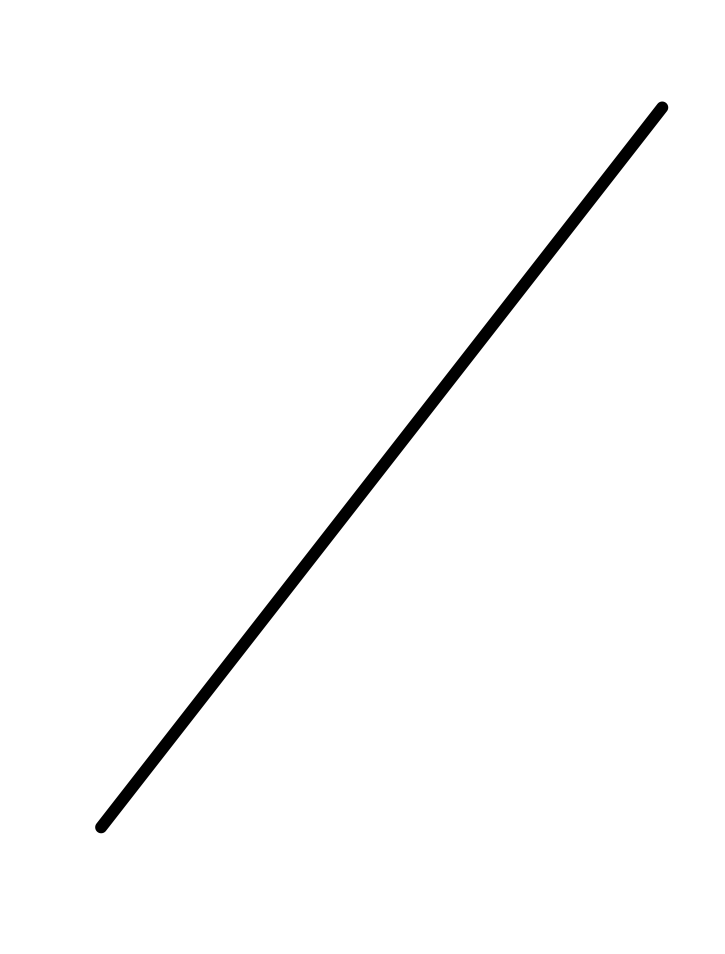
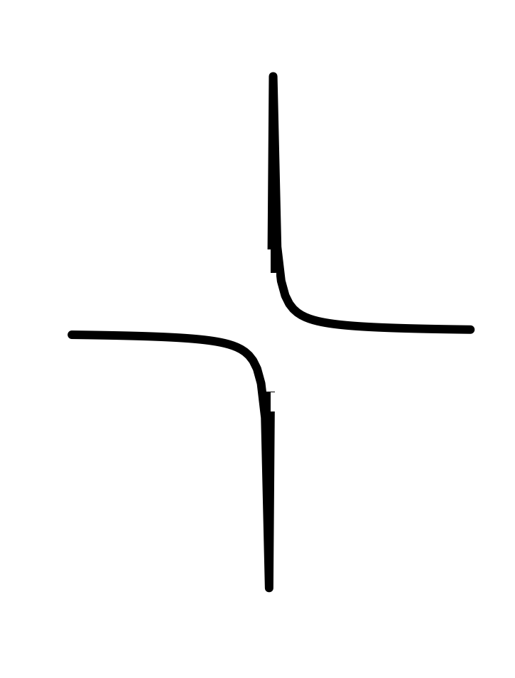

# Pattern-book functions {#sec-pattern-book-functions}

```{r child="../starter.Rmd"}
```


In this Chapter, we introduce the ***pattern-book functions***---a brief list of basic mathematical functions that provide a large majority of the tools for representing the real world as a mathematical object. 
Think of the items in the pattern-book list as different actors, each of whom is skilled in portraying an archetypal character: hero, outlaw, lover, fool, comic. A play brings together different characters, costumes them, and relates them to one another through dialog or other means. 

A mathematical model is a kind of story; a mathematical modeler is a kind of playwright. She combines mathematical character types to tell a story about relationships. We need only a handful of mathematical functions, the analog of the character actors in drama and comedy to sketch a model. In creating a mathematical model, you clothe the actors to suit the era and location and assemble them in harmony or discord.


```{r  echo=FALSE}
#| label: fig-pattern-book
#| fig-cap: "A pattern book of theatrical costumes"
#| column: margin
knitr::include_graphics("www/theatrical-pattern-book.jpg")
```

Costume designers use their imagination, often enhanced by referencing published collections of patterns and  customizing them to the needs at hand. These references are sometimes called "pattern books." (See @fig-pattern-book.) 


Similarly, we will start with a pattern set of functions that have been collected from generations of experience. To remind us of their role in modeling, we will call these ***pattern-book functions***. These pattern-book functions are useful in describing diverse aspects of the real world and have simple calculus-related properties that make them relatively easy to deal with. There are just a handful of pattern-book functions from which untold numbers of useful modeling functions can be constructed. Mastering calculus is in part a matter of becoming familiar with the mathematical connections among the pattern-book functions. (You will see these in due time.) 

Here is a list of our pattern-book functions written traditionally and in R:

[The list of pattern-book functions is short. You should memorize the names and be able easily to associate each name with the traditional notation.]{.aside}

```{r child="pattern-book-list.Rmd"}
```
     
The input name used in the table, $x$, is entirely arbitrary. You can (and will) use the pattern-book functions with other quantities---$y$, $z$, $t$, and so on, even zebra if you like.

In addition to the names of the pattern-book functions, you should be able to draw their shapes easily. @tbl-pattern-book-shapes provides a handy guide.

```{r echo=FALSE, eval=FALSE}
# helper function used to generate the pattern-book png files
make_shape <- function(f, min, max) {
  Pts <- tibble(
    x = seq(min, max, length=100),
    y = f(x)
  ) %>% mutate(ifelse(abs(x) > 0.05, y, NaN))
  plot(Pts$x, Pts$y, type="l", xaxt="n", yaxt="n", xlab="", ylab="", bty="n", lwd=12)
}
```


::: {#tbl-pattern-book-shapes .column-page-inset-right}
const | prop | square | recip | gaussian | sigmoid | sinusoid | exp | ln
:--:|:--:|:--:|:--:|:--:|:--:|:--:|:--:|:--:
 |  | | |  |  |  |  |  

Shapes of the pattern-book functions
:::


These pattern-book functions are widely applicable. But nobody would confuse the pictures in a pattern book with costumes that are ready for wear. Each pattern must be tailored to fit the actor and customized to fit the theme, setting, and action of the story. We will study how this is done starting in Chapter @sec-parameters.

## Pattern and shape

The pattern-book functions are closely related to one another but each has a distinctive shape. The variety of shapes makes the small set of pattern-book functions suited to a wide range of modeling tasks. 


```{r echo=FALSE, warning=FALSE}
my_arrow <- grid::arrow(angle = 30, 
                        length = grid::unit(0.15, "inches"), 
                        ends = "last", type = "open")
dom <- interval(x=-1.25:1.25)
Pa <- slice_plot(x ~ x, dom) %>%
  gf_labs(subtitle="Proportional function", x="input") %>%
  gf_hline(yintercept=~0, color="magenta", linetype="dashed") %>%
  gf_segment(1.2 + 1.25 ~  1.2 + 1.25, arrow=my_arrow) %>%
  gf_segment(-1.2+ -1.25 ~  -1.2 + -1.25, arrow=my_arrow)
Pb <- slice_plot(1 ~ x, dom) %>%
  gf_labs(subtitle="'Constant function", x="input") %>%
  gf_lims(y=c(-1.25, 1.25)) %>%
  gf_hline(yintercept=~0, color="magenta", linetype="dashed")
dom <- interval(x=-3:3)
P1 <- slice_plot(pmax(-100, pmin(x^-1, 100)) ~ x, dom, npts=751, singularities=0) %>%
  gf_labs(subtitle="Reciprocal function") %>%
  gf_lims(y=c(-100, 100)) %>%
  gf_hline(yintercept=~0, color="magenta", linetype="dashed") %>%
  gf_segment(95 + 100 ~  .0105 + .01, arrow=my_arrow) %>%
  gf_segment(-95 + -100 ~  -.0105 + -.01, arrow=my_arrow)
Psquare <- slice_plot(x^2 ~ x, dom) %>% gf_labs(subtitle="Square function", x="input") %>%
  slice_plot(-x^2 ~ x, alpha=0) %>%
  gf_hline(yintercept=~0, color="magenta", linetype="dashed") %>%
  gf_segment(8.7 + 9 ~  2.95 + 3, arrow=my_arrow) %>%
  gf_segment(8.7 + 9 ~  -2.95 + -3, arrow=my_arrow)
```

```{r echo=FALSE}
#| label: fig-constant-pb
#| column: margin
#| fig-cap: "The output of the constant function is always 1, regardless of the input." 
Pb
```

The ***constant function*** is so simple that you may be inclined to deny that it is a function at all. The output of the constant function is always numerical 1, regardless of the input. Its graph is therefore a horizontal line. 

You may wonder why to take the trouble to make a function whose output is always the same. After all, in a formula it shows up simply as the number 1, not looking like a function at all. But formulas are not the only way of representing functions. For instance, in Block @sec-vectors-linear-combinations we will use a mathematical structure called a "vector" to represent functions where the constant function won't be just the number 1.

```{r echo=FALSE}
#| label: fig-proportional-pb
#| column: margin
#| fig-cap: "The output of the proportional function is whatever the input value is." 
Pa
```

The ***proportional function*** is also simple. Whatever is the input will become the output. (Another appropriate name for the proportional function is the "identity function" because the output is identical to the input.) The graph of the proportional function is a straight line going through $(0,0)$ with slope 1.

Despite the simplicity of the proportional function, it is heavily used in modeling. In a formula, the proportional function appears as $x$ or $y$ or whatever the input name is to be. This can make it hard to remember that it is indeed a function. 

The remaining pattern-book functions all have curved shapes.


```{r echo=FALSE, warning=FALSE}
P1 <- slice_plot(exp(x) ~ x, dom) %>%
  gf_labs(subtitle="Exponential", x="input") %>%
  gf_lims(y=c(0, 10))  %>%
  gf_hline(yintercept=~0, color="magenta", linetype="dashed") %>%
  gf_segment(9.02 + 9.977 ~  2.2 + 2.3, arrow=my_arrow)
P2 <- slice_plot(log(x) ~ x, dom) %>%
  gf_labs(subtitle="Logarithm", x="input") %>%
  gf_hline(yintercept=~0, color="magenta", linetype="dashed") %>%
  gf_segment(1.065 + 1.099 ~  2.9 + 3, arrow=my_arrow) %>%
  gf_segment(-2.8 + -3 ~  .0608 + 0.0498, arrow=my_arrow)
P5 <- slice_plot(pnorm(x) ~ x, domain(x=c(-3,3))) %>%
  gf_labs(subtitle="Sigmoid", x="input") %>% 
  gf_hline(yintercept=~0, color="magenta", linetype="dashed")

P4 <- slice_plot(dnorm(x) ~ x, domain(x=c(-3,3))) %>%
  gf_labs(subtitle="Gaussian", x="input") %>%
  gf_hline(yintercept=~0, color="magenta", linetype="dashed")
```


```{r echo=FALSE}
#| label: fig-gaussian-pb
#| column: margin
#| fig-cap: 'The "bell-shaped" Gaussian function.' 
P4
```

The ***Gaussian function** is shaped like a mountain or, in many descriptions, like the outline of a bell. As the input becomes larger---in either the positive or negative directions---the output gets closer and closer to zero but never touches zero exactly.

The Gaussian function shows up so often in modeling that it has another widely used name: the ***normal function***. But "normal" has additional meanings in mathematics, so we will not use that name in this book. 

```{r echo=FALSE}
#| label: fig-sigmoid-pb
#| column: margin
#| fig-cap: "The sigmoid function gives a smooth transition from zero to one." 
P5
```

The ***sigmoid function*** models smooth transitions. For large negative inputs, the output is (very nearly) zero. For large positive inputs, the output is (very nearly) one. The sigmoid is closely related to the Gaussian. As you progress in calculus, the relationship will become evident.

```{r echo=FALSE, warning=FALSE}
#| label: fig-exponential-pb
#| column: margin
#| fig-cap: "The output of the exponential function grows faster and faster as the input increases." 
P1
```

The ***exponential function*** has important applications throughout science, technology, and the economy. For large negative inputs, the value is very close to zero in much the same way as for the Gaussian or sigmoid functions. But the output increases faster and faster as the input gets bigger. Note that the output of the exponential function is never negative for any input.

```{r echo=FALSE, warning=FALSE}
#| label: fig-logarithm-pb
#| column: margin
#| fig-cap: "The logarithm is defined only for inputs greater than zero." 
P2
```

The ***logarithmic function*** is defined only for positive inputs. As the input increase from just above zero, the output t constantly grows but at a slower and slower rate. It never levels out.

The exponential and logarithmic functions are intimate companions. You can see the relationship by taking the graph of the logarithm, and rotating it 90 degrees, then flipping left for right as in @fig-log-flipped.


```{r echo=FALSE}
#| label: fig-log-flipped
#| column: margin
#| fig-cap: "The exponential function is the same as the logarithm but---and this is a big but---reversing the roles of the input and output. Visually, that reversal of roles amounts to flipping the graph." 
knitr::include_graphics("www/log-flipped.png")
```

The output of the ***sinusoid function*** oscillates as the input changes. It is a ***periodic function***, meaning that the pattern repeats itself identically from left to right in the graph. 

If you studied trigonometry, you may be used to the sine of an angle in the context of a right triangle. That is the historical origin of the idea. For our purposes, think of the sinusoid just as a function that takes an input and returns an output. Starting in the early 1800s, oscillatory functions found a huge area of application in representing phenomena such as the diffusion of heat through solid materials and, eventually, radio communications. 

In trigonometry, the sine has the cosine as a partner. But the two functions $\sin()$ and $\cos()$ are so closely connected that we will not often need to make the distinction, calling both of them simply "sinusoids."


```{r echo=FALSE, warning=FALSE}
#| label: fig-sinusoid-pb
#| fig-cap-location: margin
#| fig-cap: "The output of the sinusoid function oscillates as the input increases."
#| fig-width: 7
#| fig-height: 3
slice_plot(sin(x) ~ x, domain(x=c(-20,20)), npts=500) %>%
  gf_labs(subtitle="Sinusoid", x="input") %>%
  gf_hline(yintercept=~0, color="magenta", linetype="dashed")
```

## Exponentials &  doubling time {#sec-doubling-time}

The exponential function has a characteristic property that makes it extremely important in models of many phenomena: The value ***doubles in constant time***. That phrase, "doubles in constant time" can be obscure, so let's look at it carefully with reference to a graph of the exponential function.

@fig-exp-doubling-time is a graph of the exponential function, annotated with a set of evenly spaced vertical lines. The intersection of each vertical line with the function has been marked with a dot to make it easier to read off the output of the exponential when the input has any of the values marked by the vertical lines. For example, one of the vertical lines is at $t=0$. From that you can confirm that $\exp(t=0) = 1$. Looking at the vertical line at $t = 1 \times 0.693$ you can confirm that $\exp(t=0.693) = 2$. Similarly $\exp(t=2\times 0.693) = 4$ and $\exp(t=3\times 0.693) = 8$.


```{r echo=FALSE}
#| label: fig-exp-doubling-time
#| fig-cap: "The exponential function doubles in constant time."
#| column: page-right
#| out-height: "4in"
#| out-width: "8in"
Pts <- tibble(
  n = (-2):3,
  t = 0.693*n,
  y = exp(t),
  z = c(8, 8, 8, 8, 2, 2),
  label = glue::glue("t = {n} × 0.693")
  
)
gf_vline(xintercept=~t, data=Pts, color="brown", 
         alpha=0.5) %>%
slice_plot(exp(t) ~ t, domain(t=-1.6:2.2), color="blue") %>%
  gf_theme(scale_y_continuous(breaks = -1:10)) %>%
  gf_hline(yintercept=~0, linetype="dashed") %>%
  gf_point(y ~ t, data = Pts, color="magenta") %>%
  gf_text(z ~ t, label=~ label, color="brown", size=2.4, angle=90, nudge_x=-.06)
  
```
In other words, the output of the exponential function *doubles* whenever the input is increased by 0.693. Likewise, decreasing the input by 0.693 cuts the output by half. No other function than the exponential has this property that a constant change in the input (namely, 0.693) leads to a doubling of the output. So, 0.693 is "constant time" that leads to doubling. 

## The power-law family {#sec-power-law-family}

Four of the pattern-book functions---$1$, $1/x$, $x$, $x^2$--- belong to an infinite family called the ***power-law functions***. Some other examples of power-law functions are $x^3, x^4, \ldots$ as well as $x^{1/2}$ (also written $\sqrt{x}$), $x^{1.36}$, and so on. Some of these also have special (albeit less frequently used) names, but *all* of the power-law functions can be written as $x^p$, where $x$ is the input and $p$ is a number. `r mark(290)`.

Within the power-law family, it is helpful to know and be able to distinguish between several groups:

1. The ***monomials***. These are power-law functions such as $m_0(x) \equiv x^0$, $m_1(x) \equiv x^1$, $m_2(x) \equiv x^2$, $\ldots$, $m_p(x) \equiv x^p$, $\ldots$, where $p$ is a whole number (i.e., a non-negative integer). Of course, $m_0()$ is the same as the constant function, since $x^0 = 1$. Likewise, $m_1(x)$ is the same as the identity function since $x^1 = x$. As for the rest, they have just two general shapes: both arms up for even powers of $p$ (like in $x^2$, a parabola); one arm up and the other down for odd powers of $p$ (like in $x^3$, a cubic). Indeed, you can see in @fig-the-monomials that $x^4$ has a similar shape to $x^2$ and that $x^5$ is similar in shape to $x^3$. For this reason, high-order monomials are rarely needed in practice.

```{r echo=FALSE, warning=FALSE}
#| column: page-right
#| layout-ncol: 3
#| fig-pos: 'h'
dom <- interval(x=c(-1.25, 1.25))
P0 <- slice_plot(1 ~ x, dom) %>% gf_labs(subtitle=expression(m[0](x) %==% x^0), x="input") %>%
  gf_lims(y=c(-1, 2)) %>%
  gf_hline(yintercept=~0, color="magenta", linetype="dashed")

P1 <-slice_plot(x ~ x, dom) %>% gf_labs(subtitle=expression(m[1](x) %==% x^1), x="input") %>%
  gf_lims(y=c(-2,2)) %>%
  gf_hline(yintercept=~0, color="magenta", linetype="dashed")
P2 <- slice_plot(x^2 ~ x, dom) %>% gf_labs(subtitle=expression(m[2](x) %==% x^2), x="input") %>%
  slice_plot(-x^2 ~ x, alpha=0) %>%
  gf_hline(yintercept=~0, color="magenta", linetype="dashed")
P3 <- slice_plot(x^3 ~ x, dom) %>% gf_labs(subtitle=expression(m[3](x) %==% x^3), x="input") %>%
  slice_plot(-x^2 ~ x, alpha=0) %>%
  gf_hline(yintercept=~0, color="magenta", linetype="dashed")
P4 <- slice_plot(x^4 ~ x, dom) %>% gf_labs(subtitle=expression(m[4](x) %==% x^4), x="input") %>%
  slice_plot(-x^2 ~ x, alpha=0) %>%
  gf_lims(y=c(-2.5,2.5)) %>%
  gf_hline(yintercept=~0, color="magenta", linetype="dashed")
P5 <- slice_plot(x^5 ~ x, dom) %>% gf_labs(subtitle=expression(m[5](x) %==% x^5), x="input") %>%
  slice_plot(-x^2 ~ x, alpha=0) %>%
  gf_lims(y=c(-2.5,2.5)) %>%
  gf_hline(yintercept=~0, color="magenta", linetype="dashed")
P0; P1; P2; P3; P4; P5
# gridExtra::grid.arrange(P0,P1,P2,P3,P4,P5, ncol=3)
```

```{r echo=FALSE, out.width="1%"}
#| label: fig-the-monomials
#| fig-cap: "The monomials $x^0$, $x^1$, $x^2$, $x^3$, $x^4$, $x^5$. The dashed $\\color{magenta}{\\text{magenta}}$ line marks zero output."
#| fig-cap-location: margin
#| fig-pos: 'h'
knitr::include_graphics("www/tiny-blank.png")
```


2. The ***negative powers***. These are power-law functions where $p<0$, such as $f(x) \equiv x^{-1}$, $g(x) \equiv x^{-2}$, $h(x) \equiv x^{-1.5}$. For negative powers, the size of the output is ***inversely proportional*** to the size of the input. In other words, when the input is large (**not** close to zero) the output is small, and when the input is small (close to zero), the output is *very* large. This behavior happens because a negative exponent like $x^{-2}$ can be rewritten as $\frac{1}{x^2}$; the input is *inverted* and becomes the denominator, hence the term "inversely proportional".

```{r echo=FALSE, warning=FALSE}
#| out-width: "150%"
#| layout-ncol: 2
#| label: fig-negative-graphs
#| fig-cap-location: margin
#| fig-pos: "h"
dom <- domain(x=-1.5:1.5)
P1 <- slice_plot(x^-1 ~ x, dom, npts=281, singularities=0) %>%
  gf_labs(subtitle=expression(x^{-1}), y="") %>%
  gf_lims(y=c(-100, 100)) %>%
  gf_hline(yintercept=~0, color="magenta", linetype="dashed") %>%
  gf_segment(95 + 100 ~  .0105 + .01, arrow=my_arrow) %>%
  gf_segment(-95 + -100 ~  -.0105 + -.01, arrow=my_arrow)
P2 <- slice_plot(x^-2 ~ x, dom, npts=501, singularities=0) %>%
  gf_labs(subtitle=expression(x^{-2}), y="") %>%
  gf_lims(y=c(-100, 100)) %>% 
  gf_hline(yintercept=~0, color="magenta", linetype="dashed")%>%
  gf_segment(95 + 100 ~  -.1026 + -.1, arrow=my_arrow) %>%
  gf_segment(95 + 100 ~  .1026 + .1, arrow=my_arrow)
P3 <-slice_plot(x^-3 ~ x, dom, npts=351, singularities = 0) %>%
  gf_labs(subtitle=expression(x^{-3}), y="") %>%
  gf_lims(y=c(-100, 100)) %>%
  gf_hline(yintercept=~0, color="magenta", linetype="dashed") %>%
  gf_segment(95 + 100 ~  .219 + .2154, arrow=my_arrow) %>%
  gf_segment(-95 + -100 ~  -.219 + -.2154, arrow=my_arrow)
P4 <- slice_plot(x^-4 ~ x, dom, npts=351, singularities = 0) %>%
  gf_labs(subtitle=expression(x^{-4}), y="") %>%
  gf_lims(y=c(-100, 100)) %>%
  gf_hline(yintercept=~0, color="magenta", linetype="dashed") %>%
  gf_segment(95 + 100 ~  0.32 + 0.316, arrow=my_arrow) %>%
  gf_segment(95 + 100 ~  -0.32 + -0.316, arrow=my_arrow)
P1; P2; P3; P4
```
```{r echo=FALSE, out.width="1%"}
#| label: fig-negative-graphs-extra
#| fig-cap: "Graphs of power-law functions with negative integer exponents. The arrows point to the output being very large when $x$ is near zero."
#| fig-pos: "h"
knitr::include_graphics("www/tiny-blank.png")
```


3. The **non-integer powers**, e.g. $f(x) = \sqrt{x}$, $g(x) = x^\pi$, and so on. When $p$ is either a fraction or an irrational number (like $\pi$), the real-valued power-law function $x^p$ can only take non-negative numbers as input. In other words, the domain of $x^p$ is $0$ to $\infty$ when $p$ is not an integer. You have likely already encountered this domain restriction when using the power law with $p=\frac{1}{2}$ since $f(x)\equiv x^{1/2}=\sqrt{x}$, and the square root of a negative number is not a *real* number. You may have heard about the *imaginary* numbers that allow you to take the square root of a negative number, but for the moment, you only need to understand that when working with real-valued power-law functions with non-integer exponents, the input must be non-negative. (The story is a bit more complicated since, algebraically, rational exponents like $1/3$ or $1/5$ with an odd-valued denominator can be applied to negative numbers. Computer arithmetic, however, does not recognize these exceptions.)

```{r echo=FALSE,  warning=FALSE}
#| label: fig-non-integer-graphs
#| fig-cap: "The domain of power-law functions with non-integer power is $0 \\leq x < \\infty$."
#| fig-cap-location: margin
dom <- domain(x=c(-1.5, 1.5))
Pa <- slice_plot(x^(1/2) ~ x, dom, npts=501) %>%
  gf_labs(title=expression(x^{1/2})) %>%
  gf_lims(y=c(-2, 2)) %>%
  gf_hline(yintercept=~0, color="magenta", linetype="dashed") %>%
  gf_segment(1.22 + 1.225 ~  1.49 + 1.5, arrow=my_arrow)
Pb <- slice_plot(x^pi ~ x, dom, npts=501) %>%
  gf_labs(title=expression(x^{pi})) %>%
  gf_lims(y=c(-4, 4)) %>%
  gf_hline(yintercept=~0, color="magenta", linetype="dashed") %>%
  gf_segment(3.5 + 3.57 ~  1.49 + 1.5, arrow=my_arrow)
gridExtra::grid.arrange(Pa, Pb, ncol=2)
  
```

### Computing note

When a function like $\sqrt[3]{x}$ is written as $x^{1/3}$ make sure to include the exponent in grouping parentheses: `x^(1/3)`. Similarly, later in the book you will encounter power-law functions where the exponent is written as a formula. Particularly common will be power-law functions written $x^{n-1}$ or $x^{n+1}$. In translating this to computer notation, make sure to put the formula within grouping parentheses, for instance `x^(n-1)` or `x^(n+1)`.

### Some power-law relationships


You have been using power-law functions from early in your math and science education.  Some examples:^[The animal lifespan relationship is true when comparing *species*. Individual-to-individual variation within a species does not follow this pattern.]   

::: {#tbl-power-law-examples .column-page-right}

Setting | Function formula | exponent
-------------|------------------|----------
Circumference of a circle | $C(r) = 2 \pi r$ | 1
Area of a circle | $A(r) = \pi r^2$ | 2
Volume of a sphere | $V(r) = \frac{4}{3} \pi r^3$ | 3
Distance traveled by a falling object | $d(t) = \frac{1}{2} g t^2$ | 2
Gas pressure versus volume | $P(V) = \frac{n R T}{V}$ | $-1$
... perhaps less familiar ... | | 
Distance traveled by a diffusing gas | $X(t) = D \sqrt{
\strut t}$ | $1/2$
Animal lifespan (in the wild) versus body mass | $L(M) = a M^{0.25}$ | 0.25
Blood flow versus body mass | $F(M) = b M^{0.75}$ | 0.75

Examples of power-law relationships
:::

One reason why power-law functions are so important in science has to do with the logic of physical quantities such as length, mass, time, area, volume, force, power, and so on. We will discuss this at length later in the course and the principles will appear throughout calculus.


## Domains of pattern-book functions

Each of our basic modeling functions, with two exceptions, has a domain that is the entire number line $-\infty < x < \infty$. No matter how big or small is the value of the input, the function has an output. Such functions are particularly nice since we never have to worry about the input going out of bounds.  

The two exceptions are:

1. the logarithm function, which is defined only for $0 < x$.
2. some of the power-law functions: $x^p$. 
    - When $p$ is negative, the output of the function is undefined when $x=0$. You can see why with a simple example: $g(x) \equiv x^{-2}$. Most students had it drilled into them that "division by zero is illegal," and $g(0) = \frac{1}{0} \frac{1}{0}$, a double law breaker. 
    - When $p$ is not an integer, that is $p \neq 1, 2, 3, \cdots$ the domain of the power-law function does not include negative inputs. To see why, consider the function $h(x) \equiv x^{1/3}$. 
    


## Symbolic manipulations

Several of the pattern book functions appear so often in *MOSAIC Calculus* that it is worth reviewing how to manipulate them symbolically. As an example, consider the function $$g(x) \equiv e^x e^x\ .$$
This is a perfectly good way of defining $g()$, but it is helpful to be able to recognize that the following definitions are exactly equivalent
$$f(x) \equiv e^{x+x}\\
h(x) \equiv e^{2 x}\ .$$
The ***symbolic manipulation*** we touch on in this chapter involves being able to recall and apply such equivalences.  we will need only a small set of them, all or most of which are found in a high-school algebra course.


::: {.why data-latex=""}
How come some function names, like $\sin()$ are written with other parentheses, while others such as $e^x$ have the input name shown?

The $x$ in the name $e^x$ is  a placeholder. A better, if longer, name would be $\exp()$, which would signal that we mean the abstract concept of the exponential function, and not that function applied to an input named $x$. 

The same is true for functions like $x$ or $1/t$ or $z^2$. If absolute consistency of notation were the prime goal, we could have written this book in a style that gives a name to every pattern-book function in the name/parentheses style. Something like this:

```{r}
reciprocal <- makeFun(1/t ~ t)
one <- makeFun(1 ~ z)
square <- makeFun(x^2 ~ x)
```

These would be used in the ordinary way, for instance:

```{r}
reciprocal(7)
one(123.67)
square(19)
```

Writing reciprocal($x$) instead of $1/x$ is long-winded, which is perhaps why you never see it. But when you see $1/x$ you should think of it as a function being applied to $x$ and not as a bit of arithmetic.

By the way ... I used different names for the inputs in these three functions just to remind the reader that, for functions with one input, the name has no significance. You just have to make sure to use the same name on the left- and right-hand sides of the tilde expression. 
:::


::: {.takenote data-latex=""}
We will be working with exponential and power-law functions in this chapter. It is essential that you recognize that these are utterly different functions.

An exponential function, for instance, $e^x$ or $2^x$ or $10^x$ has a constant quantity raised to a power set by the input to the function.

A power-law function works the reverse way: the input is raised to a constant quantity, as in $x^2$ or $x^10$.

A mnemonic phrase for exponentials functions is

> *Exponential functions have $x$ in the exponent.*

Of course, the exponential function can have inputs with names other than $x$, for instance, $f(y) \equiv 2^y$, but the name "x" makes for a nice alliteration in the mnemonic.
:::

### Exponential and logarithm {#sec-exp-log-symb}

We will Basic symbolic patterns for exponentials are (i) and (ii)

::: {.column-margin}
$\LARGE\mathbf{(i)}\ \ \ \ \ e^x e^y \leftrightarrow e^{x+y}$    
$\LARGE\mathbf{(ii)}\ \ \ \ \ \left(e^x\right)^y \leftrightarrow e^{x y}$
:::


Exponentials with a base other than $e$ can be converted to base $e$.

::: {.column-margin}
$\LARGE\mathbf{(iii)}\ \ \ \ \ 2^x \leftrightarrow e^{\ln(2) x} = e^{0.69315 x}$

$\LARGE\mathbf{(iv)}\  \ \  \ 10^x \leftrightarrow e^{\ln(10) x} = e^{2.30259 x}$$
:::

For mental arithmetic, easier use base 2 or 10. The base $e = 2.718282$ is not conducive to such calculations. In Block 2 we will discuss why it is standard to write an exponential function as $e^x$.

The logarithms, which we will return to in Chapter `r Chaps$magnitudes` are the ***inverse*** function of the exponential: Rule (v).

::: {.column-margin}
$\LARGE\mathbf{(v).a}\ \ \ \ \ \ln(\exp(x)) = x$ 

$\LARGE\mathbf{(v).b}\ \ \ \ \ \exp(\ln(x)) = x$
:::


One place that we will encounter rules (ii) and (v) is in Chapter `r Chaps$parameters` when we look a "doubling times" and "half lives." There we will deal with expressions such as $2^{x/\tau} = e^{\ln(2) x/\tau}$. 

Important symbolic patterns for logarithms are Rules (vi) through (vii).

::: {.column-margin}
$\LARGE\mathbf{(vi)}\ \ \ \ \ \ln(x\ \ \!y) \leftrightarrow \ln(x) + \ln(y)$

$\mathbf{(vii)}\ \ \ \ \! \ln(x / y) \leftrightarrow \ln(x) - \ln(y)$

$\LARGE\mathbf{(viii)}\ \ \ \ \ \ln(x^p) \leftrightarrow p \ln(x)$$
:::

::: {.takenote data-latex=""}
Notice that the symbolic patterns for logarithms involve multiplication, division, and exponentiation, but **not addition**: $\ln(x + y) \neq \ln(x) + \ln(y)$.
:::

### Power-law functions

In power-law functions, the quantity in the exponent is constant: we will call it $m$, $n$, or $p$ in the following examples.

::: {.column-margin}
$\LARGE\mathbf{(ix)}\ \ \ \ x^m x^n \leftrightarrow x^{m+n}$

$\LARGE\mathbf{(x)}\ \ \ \ \ \ \frac{x^m}{x^n} \leftrightarrow x^{m-n}$

$\Huge\mathbf{(xi)}\ \ \ \ \ \left(x^n\right)^p \leftrightarrow x^{n\,p}$

$\LARGE\mathbf{(xii)}\ \ \ \ \ \ x^{-n} \leftrightarrow \frac{1}{x^n}$

$\LARGE\mathbf{(xiii)}\ \ \ \ \ \ \ x^0 \leftrightarrow 1$
:::

### Sinusoids

$\sin(x)$ is periodic with period $2\pi$. Zero-crossings of $\sin(x)$ are at $x=..., -2\pi, -\pi, 0, \pi, 2\pi, ...$

As we mentioned earlier, we will be calling both the $\sin()$ and $\cos()$ function "sinusoids." They are merely shifted versions of one another:
$$\cos(x) = \sin\left(x + \frac{\pi}{2}\right)\ .$$


### The straight-line function

You are probably used to a function that we call the "straight-line function" $$\line(x) \equiv m x + b\ .$$ The name comes from the shape of a graph of $\line(x)$ versus $x$, which is a straight line. You are likely used to calling the parameter $m$ the "slope" of the line, and the parameter $b$ the "intercept." (In general, by "intercept" we will mean the value of the function output when the input is zero. In high-school, this is often called the "y-intercept.")

There are two simple symbolic manipulations that you will be using often in *MOSAIC Calculus*:

1. Find the input $x=x_0$ for which the output $\line(x=x_0) = 0$. This input has many names in mathematics: the "root," the "$x$-intercept," the "zero crossing," etc. We will call any input value that corresponds to an output of zero to be "a zero of the function."

For the straight-line function, the zero is readily found symbolically: $$x_0 = - b/m\ .$$

2. Re-write the straight-line function in the form $$\line(x) = a \left(x - x_0\right)\ .$$

Here, the slope is designated with $a$. And, of course, $x_0$ is the zero of the function, as you can see by setting $x=x_0$:
$\line(x=x_0) = a (x - x_0){\LARGE\left.\right|}_{x = x_0} = 0\ .$


::: {.why  data-latex=""}
Why is it called the "logarithm?"

The name "logarithm" is anything but descriptive. The name was coined by the inventor, John Napier (1550-1617), to emphasize the original purpose of his invention: to simplify the work of multiplication and exponentiation. The name comes from the Greek words *logos*, meaning "reasoning" or "reckoning," and *arithmos*, meaning "number." A catchy marketing term for the new invention, at least for those who speak Greek!

Although invented for the practical work of numerical calculation, the logarithm function has become central to mathematical theory as well as modern disciplines such as thermodynamics and information theory. The logarithm is key to the measurement of information and magnitude. As you know, there are units of information used particularly to describe the information storage capacity of computers: bits, bytes, megabytes, gigabytes, and so on. Very much in the way that there are different units for length (cm, meter, kilometer, inch, mile, ...), there are different units for information and magnitude. For almost everything that is measured, we speak of the "units" of measurement. For logarithms, instead of "units," by tradition another word is used: the ***base*** of the logarithm. The most common units outside of theoretical mathematics are base-2 ("***bit***") and base-10 ("***decade***"). But the unit that is most convenient in mathematical notation is "base e," where $e = 2.71828182845905...$. This is genuinely a good choice for the units of the logarithm, but that is  hardly obvious to anyone encountering it for the first time. To make the choice more palatable, it is marketed as the "base of the natural logarithm." In this book, we will be using this ***natural logarithm*** as our official pattern-book logarithm.
:::


## Drill

`r Znotes:::MC_counter$reset(labels="numbers")`

```{r child="Exercises/Drill-preliminaries-05.Rmd"}
```


## Exercises

`r insert_exercises("Preliminaries", "pattern book functions")`

## New Concepts

`r insert_exercises("Preliminaries", "pattern book functions (conceptual)")`


