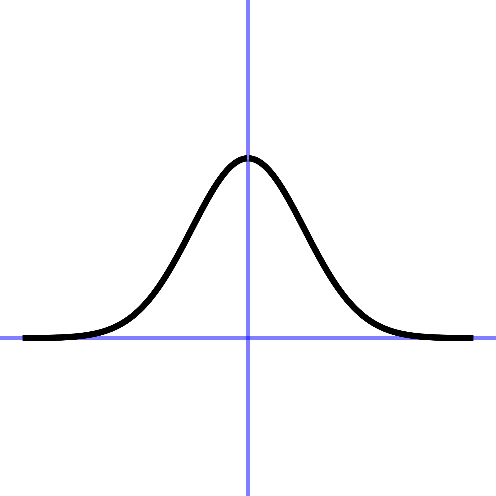
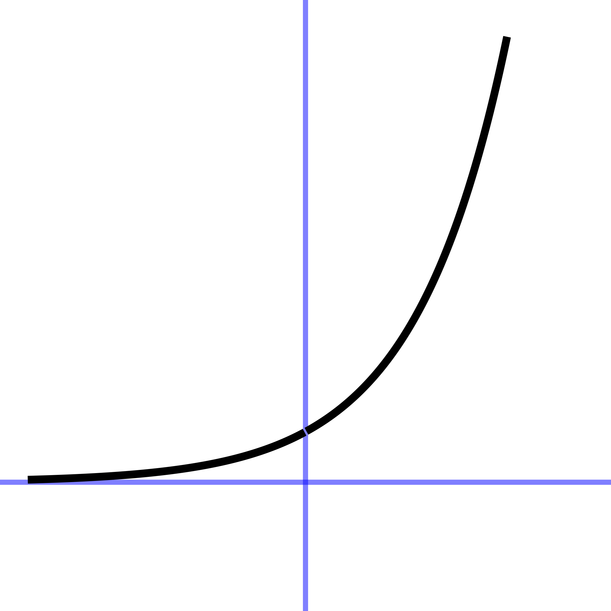

# Pattern-book functions {#sec-pattern-book-functions}

```{r include=FALSE}
source("../starter.R")
```

One of the major tasks in modeling is to construct functions that represent a situation or phenomenon of interest. As you will see in later chapters, there are many ways to build a function. For example, you may have data about a relationship. Or, sometimes, you can figure out the shape of a function by asking simple questions about the situation or phenomenon.

In this Chapter, we introduce the ***pattern-book functions***---a brief list of basic mathematical functions that apply in a surprisingly large range of situations. Think of the items in the pattern-book list as different actors, each of whom is skilled in portraying an archetypal character: hero, outlaw, lover, fool, comic. A play brings together different characters, costumes them, and relates them to one another through dialog or other means. 

:::: {.columns}

::: {.column width="60%"}
Costume designers use their imagination, often enhanced by referencing published collections of patterns and  customizing them to the needs at hand. These references are sometimes called "pattern books," an example of which is shown to the right. Each page of the book gives the pattern and instructions for constructing a particular type of costume.
:::

::: {.column width="5%"}

:::

::: {.column width="25%"}
 
:::
 
::::


Similarly, we will start with a pattern set of functions that have been collected from generations of experience. To remind us of their role in modeling, we will call these ***pattern-book functions***. These pattern-book functions are useful in describing diverse aspects of the real world and have simple calculus-related properties that make them relatively easy to deal with. There are just a handful of pattern-book functions from which untold numbers of useful modeling functions can be constructed. Mastering calculus is in part a matter of becoming familiar with the mathematical connections among the pattern-book functions, just as understanding a play calls for becoming familiear with the relationships among the characters.

@tbl-pattern-book-list is a list of our pattern-book functions written traditionally and in R. The list of pattern-book functions is short. You should memorize the names and be able easily to associate each name with the traditional notation.

::: {#tbl-pattern-book-list}



The pattern-book functions used in *MOSAIC Calculus*.
:::

The input name used in the table, $x$, is entirely arbitrary. You can (and will) use the pattern-book functions with other quantities---$y$, $z$, $t$, and so on, even zebra if you like.

In addition to the names of the pattern-book functions, you should be able to draw their shapes easily. @fig-pattern-book-shapes provides a handy guide.

```{r echo=FALSE, eval=FALSE}
# helper function used to generate the pattern-book png files
# run this chunk interactively
make_shape <- function(f, min, max, file_name = NULL,
                       ylim = as.numeric(c(NA, NA))) {
  Pts <- tibble(
    x = setdiff(seq(min, max, length=300),0), # kill zero
    y = f(x)
  ) # |> mutate(ifelse(abs(x) > 0.05, y, NaN))
  # plot(Pts$x, Pts$y, type="l", xaxt="n", yaxt="n", 
  #   xlab="", ylab="", bty="n", lwd=12)
  P <- ggplot(Pts, aes(x=x, y=y, group=x>0)) + 
    geom_hline(yintercept=0, color = "blue", alpha = 0.5, linewidth=2) + 
    geom_vline(xintercept=0, color = "blue", alpha = 0.5, linewidth=2) + 
    geom_line(linewidth=3, arrow=NULL) + 
    ylim(ylim) +
    theme_void()
  if (!is.null(file_name)) {
    ggsave(file_name, plot = P, device="png", path = "www")
  } 
  return(P)
}

make_shape(function(x) 1, -5, 5, "pb-const-gg.png",
           ylim = c(-.5, 2)) 
make_shape(function(x) x, -5, 5, "pb-identity-gg.png")
make_shape(function(x) x, -2, 2, "pb-cubic-gg.png")
make_shape(function(x) x^2, -3, 3, "pb-square-gg.png",
           ylim=c(-2, 9))
make_shape(function(x) 1/x, -3, 3, "pb-recip-gg.png",
           ylim=c(-10,10))
make_shape(function(x) dnorm(x), -4, 4, "pb-gauss-gg.png",
           ylim=c(-0.3, .7))
make_shape(function(x) pnorm(x), -4, 4, "pb-sigmoid-gg.png",
           ylim=c(-0.5, 1.5))
make_shape(function(x) sin(x), -7, 7, "pb-sin-gg.png")
make_shape(function(x) exp(x), -3, 3, "pb-exp-gg.png",
           ylim=c(-2,9))
make_shape(function(x) log(x), -3, 6.2, "pb-log-gg.png",
           ylim = c(NA, 3))
```


::: {#fig-pattern-book-shapes .column-page-inset-right}
const | identity | square | recip | gaussian | sigmoid | sinusoid | exp | log
:--:|:--:|:--:|:--:|:--:|:--:|:--:|:--:|:--:
 |  | | |  |  |  |  |  

Shapes of the pattern-book functions. Blue axis lines mark the location of zero.
:::


These pattern-book functions are widely applicable. But nobody would confuse the pictures in a pattern book with costumes that are ready for wear. Each pattern must be tailored to fit the actor and customized to fit the theme, setting, and action of the story. We will study how this is done starting in @sec-parameters.

Each of the pattern-book functions takes a *number* as input and produces a *number* as output.  Naturally, a proper graph of a pattern-book function should display specific numerical values for input and output. This section shows such quantitative graphs.

When used in modeling, however, we need to modify the functions so that their inputs and outputs are *quantities*. Chapters [-@sec-parameters] and [-@sec-assembling] present the main techniques for doing this. This allows us to use the *shape* of a pattern-book function while customizing the quantitative input-output relationship to serve the situation at hand. 
In practice, however, it suffices to memorize just a couple of input/output pairs for each function


```{r eval=FALSE, echo=FALSE, warning=FALSE}
my_arrow <- grid::arrow(angle = 30, 
                        length = grid::unit(0.15, "inches"), 
                        ends = "last", type = "open")
dom <- bounds(x=-1.25:1.25)
Pa <- slice_plot(x ~ x, dom) %>%
  gf_labs(subtitle="Identity function", x="input") %>%
  gf_hline(yintercept=~0, color="magenta", linetype="dashed") %>%
  gf_segment(1.2 + 1.25 ~  1.2 + 1.25, arrow=my_arrow) %>%
  gf_segment(-1.2+ -1.25 ~  -1.2 + -1.25, arrow=my_arrow)
Pb <- slice_plot(1 ~ x, dom) %>%
  gf_labs(subtitle="'Constant function", x="input") %>%
  gf_lims(y=c(-1.25, 1.25)) %>%
  gf_hline(yintercept=~0, color="magenta", linetype="dashed")
dom <- bounds(x=-3:3)
P1 <- slice_plot(pmax(-100, pmin(x^-1, 100)) ~ x, dom, npts=751, singularities=0) %>%
  gf_labs(subtitle="Reciprocal function") %>%
  gf_lims(y=c(-100, 100)) %>%
  gf_hline(yintercept=~0, color="magenta", linetype="dashed") %>%
  gf_segment(95 + 100 ~  .0105 + .01, arrow=my_arrow) %>%
  gf_segment(-95 + -100 ~  -.0105 + -.01, arrow=my_arrow)
Psquare <- slice_plot(x^2 ~ x, dom) |> gf_labs(subtitle="Square function", x="input") %>%
  slice_plot(-x^2 ~ x, alpha=0) %>%
  gf_hline(yintercept=~0, color="magenta", linetype="dashed") %>%
  gf_segment(8.7 + 9 ~  2.95 + 3, arrow=my_arrow) %>%
  gf_segment(8.7 + 9 ~  -2.95 + -3, arrow=my_arrow)
```



You may wonder why to take the trouble to make a function whose output is always the same. After all, in a formula it shows up simply as the number 1, not looking like a formula at all. But when we start to combine functions in @sec-assembling, the constant function will almost always have a role to play.



The remaining pattern-book functions all have curved shapes.







The Gaussian function shows up so often in modeling that it has another widely used name: the ***normal function***. But "normal" has additional meanings in mathematics, so we will not use that name in this book. 






If you studied trigonometry, you may be used to the sine of an angle in the context of a right triangle. That is the historical origin of the idea. For our purposes, think of the sinusoid just as a function that takes an input and returns an output. Starting in the early 1800s, oscillatory functions found a huge area of application in representing phenomena such as the diffusion of heat through solid materials and, eventually, radio communications. 

In trigonometry, the sine has the cosine as a partner. But the two functions $\sin()$ and $\cos()$ are so closely connected that we will not often need to make the distinction, calling both of them simply "sinusoids."


## Exponential and logarithm functions

It's a common English phrase to say that something is "growing exponentially." For instance, at the outbreak of an epidemic there are few cases and slow growth in the number of cases. But as the number of cases increases, the growth gets faster.



There is another way to think about exponential growth that makes it easier to comprehend. Again, imagine an epidemic in its eary stages. Suppose there are 20 cases. Time goes by and eventually the number of cases reaches 40, double the initial value. Suppose it takes one week for this doubling. That is, the **doubling time** is one week.

Now a second week goes by. If the growth were *proportional* to the input, after the second week the case number would be 60. For exponential growth, by the end of the second week the output will double. So, there will be 80 cases after two weeks. 

At the end of the third week the output of the exponential will double again, to 160 cases. Fourth week: 320 cases. Fifth week: 640 cases. To summarize, @tbl-doubling-epi shows the number of cases as a function of weeks elapsed.

::: {#tbl-doubling-epi}

Time (weeks) | Number of cases
-------------------|-------------
0 (initial time) | 20
1   | 40
2   | 80
3   | 160
4   | 320
5   | 640
6   | 1280
... | ...
10  | 20,480
... | ...
15 weeks  | 655,360

The number of cases as it increases over time for an epidemic that grows exponentially with a doubling time of one week..
:::

Note: *You might speculate about where the epidemic will go in the long run. Most things that grow exponentially do so only for a short time. After that, other things come into play that limit or reverse the growth. So, over long periods of time the pattern can be better described as **gaussian** or **sigmoidal**.*

I suspect that most people are comfortable with the idea of exponential growth. But many people, even highly-educated professionals, react with fear to the word "logarithmic." [This fear might originate in the way logarithms are typically taught in high-school is heavily algebraic and taken out of any meaningful contemporary context. Logarithms were invented around 1600 to facilitate by-hand mathematical operations like multiplication and exponentiation. Nowadays, we have computers to perform such calculations.] As we'll see in @sec-magnitude, logarithms are an important tool for understanding quantities that can range from very, very small to very, very large. @tbl-doubling-epi gives an example: the left column is a logarithm of the right column.



The exponential and logarithmic functions are intimate companions. You can see the relationship by taking the graph of the logarithm, and rotating it 90 degrees, then flipping left for right as in @fig-log-flipped. (Note in @fig-log-flipped that the graph is shown as if it were printed on a transparency which we are looking at from the back.)


::: {#fig-log-flipped}
{width=50%}

A flipped-over version of @fig-logarithm-pb. The exponential and the logarithmic functions are twins, related by reversing the roles of the input and output. The flipped over logarithm function is the same as the exponential function.
:::

::: {.callout-note icon=FALSE data-latex=""}
## Why is it called the "logarithm?"

The name "logarithm" is anything but descriptive. The name was coined by the inventor, John Napier (1550-1617), to emphasize the original purpose of his invention: to simplify the work of multiplication and exponentiation. The name comes from the Greek words *logos*, meaning "reasoning" or "reckoning," and *arithmos*, meaning "number." A catchy marketing term for the new invention, at least for those who speak Greek!

Although invented for the practical work of numerical calculation, the logarithm function has become central to mathematical theory as well as modern disciplines such as thermodynamics and information theory. The logarithm is key to the measurement of information and magnitude. As you know, there are units of information used particularly to describe the information storage capacity of computers: bits, bytes, megabytes, gigabytes, and so on. Very much in the way that there are different units for length (cm, meter, kilometer, inch, mile, ...), there are different units for information and magnitude. For almost everything that is measured, we speak of the "units" of measurement. For logarithms, instead of "units," by tradition another word is used: the ***base*** of the logarithm. The most common units outside of theoretical mathematics are base-2 ("***bit***") and base-10 ("***decade***"). But the unit that is most convenient in mathematical notation is "base e," where $e = 2.71828182845905...$. This is genuinely a good choice for the units of the logarithm, but that is  hardly obvious to anyone encountering it for the first time. To make the choice more palatable, it is marketed as the "base of the natural logarithm." In this book, we will be using this ***natural logarithm*** as our official pattern-book logarithm.
:::


## The power-law family (optional) {#sec-power-law-family}

Four of the pattern-book functions---$1$, $1/x$, $x$, $x^2$--- belong to an infinite family called the ***power-law functions***. Some other examples of power-law functions are $x^3, x^4, \ldots$ as well as $x^{1/2}$ (also written $\sqrt{x}$), $x^{1.36}$, and so on. Some of these also have special (albeit less frequently used) names, but *all* of the power-law functions can be written as $x^p$, where $x$ is the input and $p$ is a number. 

You have been using power-law functions from early in your math and science education.  Some examples:^[The animal lifespan relationship is true when comparing *species*. Individual-to-individual variation within a species does not follow this pattern.]   

::: {#tbl-power-law-examples}

Setting | Function formula | exponent
-------------|------------------|----------
Circumference of a circle | $C(r) = 2 \pi r$ | 1
Area of a circle | $A(r) = \pi r^2$ | 2
Volume of a sphere | $V(r) = \frac{4}{3} \pi r^3$ | 3
Distance traveled by a falling object | $d(t) = \frac{1}{2} g t^2$ | 2
Gas pressure versus volume | $P(V) = \frac{n R T}{V}$ | $-1$
... perhaps less familiar ... | | 
Distance traveled by a diffusing gas | $X(t) = D \sqrt{
\strut t}$ | $1/2$
Animal lifespan (in the wild) versus body mass | $L(M) = a M^{0.25}$ | 0.25
Blood flow versus body mass | $F(M) = b M^{0.75}$ | 0.75

Examples of power-law relationships
:::

One reason why power-law functions are so important in science has to do with the logic of physical quantities such as length, mass, time, area, volume, force, power, and so on. We introduced this topic in @sec-quantity-function-space and will return to it in more detail in @sec-dimensions-and-units.

Within the power-law family, it is helpful to know and be able to distinguish between several groups:

1. The ***monomials***. These are power-law functions such as $m_0(x) \equiv x^0$, $m_1(x) \equiv x^1$, $m_2(x) \equiv x^2$, $\ldots$, $m_p(x) \equiv x^p$, $\ldots$, where $p$ is a whole number (i.e., a non-negative integer). Of course, $m_0()$ is the same as the constant function, since $x^0 = 1$. Likewise, $m_1(x)$ is the same as the identity function since $x^1 = x$. As for the rest, they have just two general shapes: both arms up for even powers of $p$ (like in $x^2$, a parabola); one arm up and the other down for odd powers of $p$ (like in $x^3$, a cubic). Indeed, you can see in @fig-monomial-graphs that $x^4$ has a similar shape to $x^2$ and that $x^5$ is similar in shape to $x^3$. For this reason, high-order monomials are rarely needed in practice.

```{r echo=FALSE, warning=FALSE}
my_arrow <- grid::arrow(angle = 30, 
                        length = grid::unit(0.15, "inches"), 
                        ends = "last", type = "open")
dom <- domain(x=c(-1.25, 1.25))
P0 <- slice_plot(1 ~ x, dom) |> gf_labs(subtitle=expression(m[0](x) %==% x^0), x="input") %>%
  gf_lims(y=c(-1, 2)) %>%
  gf_hline(yintercept=~0, color="magenta", linetype="dashed")

P1 <-slice_plot(x ~ x, dom) |> gf_labs(subtitle=expression(m[1](x) %==% x^1), x="input") %>%
  gf_lims(y=c(-2,2)) %>%
  gf_hline(yintercept=~0, color="magenta", linetype="dashed")
P2 <- slice_plot(x^2 ~ x, dom) |> gf_labs(subtitle=expression(m[2](x) %==% x^2), x="input") %>%
  slice_plot(-x^2 ~ x, alpha=0) %>%
  gf_hline(yintercept=~0, color="magenta", linetype="dashed")
P3 <- slice_plot(x^3 ~ x, dom) |> gf_labs(subtitle=expression(m[3](x) %==% x^3), x="input") %>%
  slice_plot(-x^2 ~ x, alpha=0) %>%
  gf_hline(yintercept=~0, color="magenta", linetype="dashed")
P4 <- slice_plot(x^4 ~ x, dom) |> gf_labs(subtitle=expression(m[4](x) %==% x^4), x="input") %>%
  slice_plot(-x^2 ~ x, alpha=0) %>%
  gf_lims(y=c(-2.5,2.5)) %>%
  gf_hline(yintercept=~0, color="magenta", linetype="dashed")
P5 <- slice_plot(x^5 ~ x, dom) |> gf_labs(subtitle=expression(m[5](x) %==% x^5), x="input") %>%
  slice_plot(-x^2 ~ x, alpha=0) %>%
  gf_lims(y=c(-2.5,2.5)) %>%
  gf_hline(yintercept=~0, color="magenta", linetype="dashed")
```

::: {#fig-monomial-graphs layout-ncol=2}
```{r echo=FALSE, warning=FALSE}
#| fig-subcap: 
#| - $x^0$, that is, 1
P0
```
```{r echo=FALSE, warning=FALSE}
#| fig-subcap: 
#| - $x^1$, that is, $x$
P1
```
```{r echo=FALSE, warning=FALSE}
#| fig-subcap: 
#| - $x^2$
P2
```
```{r echo=FALSE, warning=FALSE}
#| fig-subcap: 
#| - $x^3$
P3
```
```{r echo=FALSE, warning=FALSE}
#| fig-subcap: 
#| - $x^4$
P4
```
```{r echo=FALSE, warning=FALSE}
#| fig-subcap: 
#| - $x^5$
P5
```

The first six monomial functions: $x^0$, $x^1$, $x^2$, $x^3$, $x^4$, and $x^5$. In each plot the dashed $\color{magenta}{\text{magenta}}$ line marks zero output.
:::

2. The ***negative powers***. These are power-law functions where $p<0$, such as $f(x) \equiv x^{-1}$, $g(x) \equiv x^{-2}$, $h(x) \equiv x^{-1.5}$. For negative powers, the size of the output is ***inversely proportional*** to the size of the input. In other words, when the input is large (**not** close to zero) the output is small, and when the input is small (close to zero), the output is *very* large. This behavior happens because a negative exponent like $x^{-2}$ can be rewritten as $\frac{1}{x^2}$; the input is *inverted* and becomes the denominator, hence the term "inversely proportional".


```{r echo=FALSE, warning=FALSE}
dom <- bounds(x=-1.5:1.5)
P1 <- slice_plot(x^-1 ~ x, dom, npts=281, singularities=0) %>%
  gf_labs(subtitle=expression(x^{-1}), y="") %>%
  gf_lims(y=c(-100, 100)) %>%
  gf_hline(yintercept=~0, color="magenta", linetype="dashed") %>%
  gf_segment(95 + 100 ~  .0105 + .01, arrow=my_arrow) %>%
  gf_segment(-95 + -100 ~  -.0105 + -.01, arrow=my_arrow)
P2 <- slice_plot(x^-2 ~ x, dom, npts=501, singularities=0) %>%
  gf_labs(subtitle=expression(x^{-2}), y="") %>%
  gf_lims(y=c(-100, 100)) |> 
  gf_hline(yintercept=~0, color="magenta", linetype="dashed")%>%
  gf_segment(95 + 100 ~  -.1026 + -.1, arrow=my_arrow) %>%
  gf_segment(95 + 100 ~  .1026 + .1, arrow=my_arrow)
P3 <-slice_plot(x^-3 ~ x, dom, npts=351, singularities = 0) %>%
  gf_labs(subtitle=expression(x^{-3}), y="") %>%
  gf_lims(y=c(-100, 100)) %>%
  gf_hline(yintercept=~0, color="magenta", linetype="dashed") %>%
  gf_segment(95 + 100 ~  .219 + .2154, arrow=my_arrow) %>%
  gf_segment(-95 + -100 ~  -.219 + -.2154, arrow=my_arrow)
P4 <- slice_plot(x^-4 ~ x, dom, npts=351, singularities = 0) %>%
  gf_labs(subtitle=expression(x^{-4}), y="") %>%
  gf_lims(y=c(-100, 100)) %>%
  gf_hline(yintercept=~0, color="magenta", linetype="dashed") %>%
  gf_segment(95 + 100 ~  0.32 + 0.316, arrow=my_arrow) %>%
  gf_segment(95 + 100 ~  -0.32 + -0.316, arrow=my_arrow)
```

::: {#fig-negative-graphs layout-ncol=2}
```{r echo=FALSE, warning=FALSE}
#| fig-subcap:
#| - $x^{-1}$, that is, $1/x$
P1
```

```{r echo=FALSE, warning=FALSE}
#| fig-subcap:
#| - $x^{-2}$, that is, $1/x^2$
P2
```

```{r echo=FALSE, warning=FALSE}
#| fig-subcap:
#| - $x^{-3}$, that is, $1/x^3$
P3 
```

```{r echo=FALSE, warning=FALSE}
#| fig-subcap:
#| - $x^{-4}$, that is, $1/x^4$
P4
```

Graphs of power-law functions with negative integer exponents. The arrows point to the output being very large when $x$ is near zero.
:::

3. The **non-integer powers**, e.g. $f(x) = \sqrt{x}$, $g(x) = x^\pi$, and so on. When $p$ is either a fraction or an irrational number (like $\pi$), the real-valued power-law function $x^p$ can only take non-negative numbers as input. In other words, the domain of $x^p$ is $0$ to $\infty$ when $p$ is not an integer. You have likely already encountered this domain restriction when using the power law with $p=\frac{1}{2}$ since $f(x)\equiv x^{1/2}=\sqrt{x}$, and the square root of a negative number is not a *real* number. You may have heard about the *imaginary* numbers that allow you to take the square root of a negative number, but for the moment, you only need to understand that when working with real-valued power-law functions with non-integer exponents, the input must be non-negative. (The story is a bit more complicated since, algebraically, rational exponents like $1/3$ or $1/5$ with an odd-valued denominator can be applied to negative numbers. Computer arithmetic, however, does not recognize these exceptions.)


```{r echo=FALSE,  warning=FALSE}
dom <- bounds(x=c(-1.5, 1.5))
Pa <- slice_plot(x^(1/2) ~ x, dom, npts=501) %>%
  gf_labs(title=expression(x^{1/2})) %>%
  gf_lims(y=c(-2, 2)) %>%
  gf_hline(yintercept=~0, color="magenta", linetype="dashed") %>%
  gf_segment(1.22 + 1.225 ~  1.49 + 1.5, arrow=my_arrow)
Pb <- slice_plot(x^pi ~ x, dom, npts=501) %>%
  gf_labs(title=expression(x^{pi})) %>%
  gf_lims(y=c(-4, 4)) %>%
  gf_hline(yintercept=~0, color="magenta", linetype="dashed") %>%
  gf_segment(3.5 + 3.57 ~  1.49 + 1.5, arrow=my_arrow)
```

::: {#fig-non-integer-graphs layout-ncol=2}
```{r echo=FALSE, warning=FALSE}
#| fig-subcap:
#| - $x^{1/2}$
Pa 
```

```{r echo=FALSE, warning=FALSE}
#| fig-subcap:
#| - $x^\pi$
Pb
```

The domain of power-law functions with non-integer power is $0 \leq x < \infty$.
:::

::: {.callout-tip}
## Computing power-law functions

When a function like $\sqrt[3]{x}$ is written as $x^{1/3}$ make sure to include the exponent in grouping parentheses: `x^(1/3)`. Similarly, later in the book you will encounter power-law functions where the exponent is written as a formula. Particularly common will be power-law functions written $x^{n-1}$ or $x^{n+1}$. In translating this to computer notation, make sure to put the formula within grouping parentheses, for instance `x^(n-1)` or `x^(n+1)`.
:::


## Domains of pattern-book functions

Each of our basic modeling functions, with two exceptions, has a domain that is the entire number line $-\infty < x < \infty$. No matter how big or small is the value of the input, the function has an output. Such functions are particularly nice since we never have to worry about the input going out of bounds.  

The two exceptions are:

1. the logarithm function, which is defined only for $0 < x$.
2. some of the power-law functions: $x^p$. 
    - When $p$ is negative, the output of the function is undefined when $x=0$. You can see why with a simple example: $g(x) \equiv x^{-2}$. Most students had it drilled into them that "division by zero is illegal," and $g(0) = \frac{1}{0} \frac{1}{0}$, a double law breaker. 
    - When $p$ is not an integer, that is $p \neq 1, 2, 3, \cdots$ the domain of the power-law function does not include negative inputs. To see why, consider the function $h(x) \equiv x^{1/3}$. 
    
    
::: {.callout-tip}
## Exponentials are not power-laws
It is essential that you recognize that the exponential function is utterly different from the functions from the power-law family.

An exponential function, for instance, $e^x$ or $2^x$ or $10^x$ has a constant quantity raised to a power set by the input to the function.

A power-law function works the reverse way: the input is raised to a constant quantity, as in $x^2$ or $x^10$.

A mnemonic phrase for exponentials functions is

> *Exponential functions have $x$ in the exponent.*

Of course, the exponential function can have inputs with names other than $x$, for instance, $f(y) \equiv 2^y$, but the name "x" makes for a nice alliteration in the mnemonic.
:::


