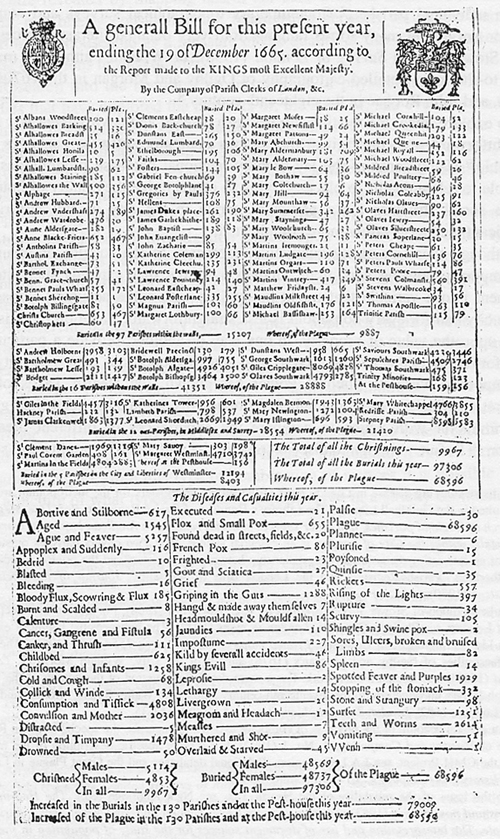

# Data and data graphics {#sec-data-and-data-graphics}

```{r child="../starter.Rmd"}
```


The decade of the 1660s was hugely significant in the emergence of science, although no one realized it at the time. 1665 was a plague year, the last major outbreak of bubonic plague in England. The University of Cambridge closed to wait out the plague, and Isaac Newton, then a 24-year old Cambridge student returned home to Woolsthorpe where he lived and worked in isolation for two years. Biographer James Gleich wrote: "The plague year was his transfiguration. Solitary and almost incommunicado, he became the world’s paramount mathematician." During his years of isolation, Newton developed what we now call "calculus" and, associated with that, his theory of Universal Gravitation. He wrote a tract on his work in 1669, but withheld it from publication until 1711.

```{r echo=FALSE}
#| label: fig-newton-first-pub
#| fig-cap: "Newton's first tract (1669) on the roots of calculus: *On Analysis by Equations with an infinite number of terms*."
#| column: margin
knitr::include_graphics("www/Newton-infinite-terms.png")
```

Plague was also the motivating factor in another important work, published in 1661, *Natural and Political Observations ... Made upon the Bills of Mortality* by [John Graunt](https://en.wikipedia.org/wiki/John_Graunt) (1620-1674). [Bills of mortality](https://en.wikipedia.org/wiki/Bills_of_mortality), listings of the number and causes of deaths in London, had been published intermittently starting in in the plague year of 1532, and then continuously from the onset of plague in 1603. Graunt, a haberdasher by profession, performed what we might now call ***data science***, the extraction of information from data. For instance, Graunt was the first to observe the high rate of child mortality and that the number of deaths attributed to plague was underestimated by about one quarter. Graunt's work led to his election to the Royal Society, the same august group of scientists of which Isaac Newton was a member (and later president). Graunt is considered the first demographer and epidemiologist.

```{r echo=FALSE}
#| label: fig-graunt-cover
#| fig-cap: "The title page of John Graunt's *Natural and Political Observations ... upon the Bills of Mortality*"
#| column: margin
knitr::include_graphics("www/Graunt_Natural_and_political_observations.png")

```

Graunt's publication marks the start of ***statistics***. He built upon a century of work by the city of London, collecting and tabulating data on a quarter of a million deaths. Indeed the word "statistics" stems from "state," the only entity large enough to collect data on populations and the economy. 

Whereas advances in calculus over the next two centuries could be accomplished by the creativity of individuals, statistics could only develop based on the development of the infrastructure of government data collection, a process that took almost two centuries.  But in the last 50 years, extensive data collection has entered non-state domains, such as genetic sequencing, remote sensing of Earth, commercial records, and the vast data warehouses of the social media giants, among others. 

The ability to draw conclusions from masses of data---shown originally by John Graunt---is now an essential skill throughout science, government, and commerce. As you will see, particularly in Block 5, many of those skills are mathematical, effectively a part of calculus.

This chapter introduces some pre-calculus basics of working with data which we'll use extensively in later Blocks of *MOSAIC Calculus*.

## Data frames

Most people encounter data in the form of printed tables, such as the 1665 Bill of Mortality shown below. These tables were developed to be legible to humans and to be compact when printed. 

```{r echo=FALSE}
#| label: fig-bill-of-mortality
#| fig-cap: "Tables of data from the 1665 Bill of Mortality for London."
#| column: margin

```

Although published more than 350 years ago, it's still possible for a literate human to sort out what the table is saying. But the volume of data has exploded beyond any possibility of putting it in print. Instead, today's data are stored and accessed electronically. But the process of accessing such data is very much rooted in the notation of "table," albeit tables that follow a strict set of principles. We'll call such tables ***data frames*** and it's important for you to learn a few of the core principles of data organization.

First, recognize that the data shown in  @fig-bill-of-mortality consist of several different tables.  The first table, just under the title, starts with

::: {#tbl-top-lines .column-page-right}
$\ $   | Buried | Plague | $\ $ | Buried | Plague | $\cdots$   
-----------------------|-----|-----|------------------------|----|----|-----
S^t^ Albans Woodstreet | 100 | 121 | S^t^ Clemens Eastcheap | 18 | 20 | $\cdots$
S^t^ Alhallowes Barking| 514 | 330 | S^t^ Diones Back-church| 78 | 27 | $\cdots$

The first two lines of the main table from the Bill of Mortality
:::


The modern form of this is not spread out across the width of the page. It has a single set of columns rather than sets repeated side by side as in @tbl-top-lines.

::: {#tbl-narrow-parish .column-margin}
parish          | buried | plague
----------------|--------|------
S^t^ Albans Woodstreet   | 100 | 121  
S^t^ Clemens Eastcheap   | 18  | 20 
S^t^ Alhallowes Barking  | 514 | 330  
S^t^ Diones Back-church  | 78  | 27 
$\vdots$              |$\vdots$| $\vdots$

In a modern format, all the parishes are listed in one column, so that each row of the table corresponds to a single parish.
:::

Each ***column*** of the modern table is called a ***variable***. So there is a variable "buried" that contains the number buried and another variable "plague" containing the number who died of plague. 

Each row of the table is called a ***case***, but often simply ***row*** is used. For each table, all the cases are the same kind of thing, for instance, here, a parish.

Another table displayed on the sheet is entitled, "The diseases and casualities this year." In this table, the case is a disease or other cause of death, which we've put under the name "condition." 

condition | deaths     | year
----------|------------|-----
Abortive and Stilborne | 617  | 1665
Aged                   | 1545 | 1665
Ague and Feaver        | 5257 | 1665
Appoplex and Suddenly  | 116  | 1665
Bedrid                 | 10   | 1665


We've added the variable "year" with an eye toward consolidating many years of the Bills into one table.

\newpage

A modern organization for the data being presented in the Bill of Mortality would go back to the raw records that were collected in the field, stacking them into just two tables: Deaths and Births. The Deaths table might look like @tbl-deaths.

::: {#tbl-deaths .column-screen-right}

name | date | parish | sex | age  | cause
--------------|-------------|------------|--|--|------
Percivell Bullingham | 1665-06-01 | S^t^ Mary le Bow    | M | 29 | plague
Owin Swancott        | 1665-08-13 | Trinitie            | M | 2  | plague
Winifred Romford     | 1665-11-09 | S^t^ Swithings      | F | 19 | childbed
Elsebeth Cook        | 1665-06-29 | S^t^ Ethelborough   | F | 5  | plague
Humfray Langham      | 1665-06-05 | S^t^ Bennet Fynch   | M | 53 | aged
Agnes Kirkwood       | 1665-11-22 | S^t^ Mary Hill      | F | 21 | ague
Katherine Murton     | 1665-12-01 | S^t^ Alholowes Lesse| F | 24 | childbed
Bainbridge Fletcher  | 1665-03-17 | S^t^ Martins        | M | 2  | plague
Cicely Ouston        | 1665-03-08 | S^t^ Austins        | F | 35 | plague

An imagined re-organization of the data that went into the Bill of Mortality report.

::: 

The modern conception of data makes a clear distinction between data and the construction of summaries of that data for human consumption. Such summaries might be graphical, or in the form model functions, or even in the form of a set of tables, such as seen in the Bill of Mortality. Learning how to generate such summaries is an essential task in ***statistics*** and data science. The automatic construction of model functions (without much human intervention) is a field called ***machine learning***

In the Deaths table, which would have 97,306 rows for 1665, the each case is "a person who died." Such a table could nowadays be re-tabulated into the "diseases and casualities" table, or the breakdown of burials by sex, or the parish-by-parish breakdown. But there are many other possibilities: looking at cause of death by age and season of year, or broken down by sex, etc. 

## Accessing data tables

In a data science course you will learn several ways of storing and accessing tables of data. One of the most important in professional use is a ***relational database***. ("Relation" is another word for "table," just as functions are about the relationship between inputs and output.)

***Data wrangling*** is a term used to describe working with and summarizing data. This includes merging multiple data frames. In *MOSAIC Calculus* our uses of data will be focused on constructing functions that show the patterns in data and plotting data to reveal those patterns to the eye. 

For our work, you can access the data frames we need directly in R by name. For instance, the `Engines` data frame (@tbl-engine-table) records the characteristics of several internal combustion engines of various sizes:

::: {#tbl-engine-table .column-page-right}
Engine | mass | BHP | RPM | bore | stroke
:------|-----:|----:|----:|-----:|---------:
Webra Speed 20 | 0.25 | 0.78 | 22000 | 16.5 | 16
Enya 60-4C | 0.61 | 0.84 | 11800 | 24.0 | 22
Honda 450 | 34.00 | 43.00 | 8500 | 70.0 | 58
Jacobs R-775 | 229.00 | 225.00 | 2000 | 133.0 | 127
Daimler-Benz 609 | 1400.00 | 2450.00 | 2800 | 165.0 | 180
Daimler-Benz 613 | 1960.00 | 3120.00 | 2700 | 162.0 | 180
Nordberg | 5260.00 | 3000.00 | 400 | 356.0 | 407
Cooper-Bessemer V-250 | 13500.00 | 7250.00 | 330 | 457.0 | 508


Various attributes of internal combustion engines, from the very small to the very large.
:::

## Variable names

The fundamental questions to ask first about any data frame are:

i. What constitutes a row? 
ii. What are the variables and what do they stand for?

The answers to these questions, for the data frames we will be using, are available via R documentation. To bring up the documentation for `Engines`, for instance, give the command:

```r
?Engines
```

When working with data, it's common to forget for a moment what are the variables, how they are spelled, and what sort of values each variable takes on. Two useful commands for reminding yourself are (illustrated here with `Engines`):

```{r}
names(Engines) # the names of the variables
head(Engines) # the first several rows
nrow(Engines) # how many rows
```

In RStudio, the command `View(Engines)` is useful for showing a complete table of data.

## Plotting data

We will use just one graphical format for displaying data: the ***point plot***. In a point plot, also known as a "scatterplot," two variables are displayed, one on each graphical axis. Each case is presented as a dot, whose horizontal and vertical coordinates are the values of the variables for that case. For instance:

```{r echo=FALSE}
#| label: fig-stroke-vs-bore
#| fig-cap: "A point plot showing the relationship between engine `stroke` and `bore`. Each individual point is one row of the data frame SHOWN IN GIVE TABLE A NAME"
#| fig-cap-location: margin
gf_point(stroke ~ bore, data = Engines)
```

The data plotted here show a relationship between the stroke length of a piston and the diameter of the cylinder in which the piston moves. This relationships, however, is not being presented in the form of a function, that is, a single stroke value for each value of the bore diameter. 

For many modeling purposes, it's important to be able to represent a relationship as a function. At one level, this is straightforward: draw a smooth curve through the data and use that curve for the function. 

Later in *MOSAIC Calculus*, we'll discuss ways to construct functions that are a good match to data using the pattern-book functions. Here, our concern is graphing such functions on top of a point plot. So, without explanation (until later chapters), we'll construct a power-law function, called, stroke(bore), that might be a good match to the data. The we'll add a second layer to the point-plot graphic: a slice-plot of the function we've constructed.

```{r}
#| label: fig-first-two-layers
#| fig-cap: "A graphic composed of two layers: 1) a point plot; 2) a slice plot of a function fitted to the data in (1)."
#| fig-cap-location: margin
stroke <- fitModel(stroke ~ A*bore^b, data = Engines)
gf_point(stroke ~ bore, data = Engines) %>%
  slice_plot(stroke(bore) ~ bore, color="blue")
```

The second layer is made with an ordinary `slice_plot()` command. To place it on top of the point plot we connect the two commands with a bit of punctuation called a "pipe": `%>%`.

[The pipe punctuation can never go at the start of a line. Usually, we'll use the pipe at the very end of a line; think of the pipe as connecting one line to the next.]{.aside}

`slice_plot()` is a bit clever when it is used after a previous graphics command. Usually, you need to specify the interval of the domain over which you want to display the function, as with 

```{r echo=FALSE, results="hide"}
slice_plot(stroke(bore) ~ bore, interval(bore=0:1000))
```

You can do that also when `slice_plot()` is the second layer in a graphics command. But `slice_plot()` can also infer the interval of the domain from previous layers.

## Functions as data

In the previous chapters, we've used ***formulas*** to define functions. The link between functions and formulas is important, but not at all essential to the idea of functions. 

Arguably more important in practice to the representation of functions are ***tables*** and ***algorithms***. The computations behind the calculation of the output of functions such as $\sin()$ or $e^x$ or other foundational functions that we'll introduce in [Chapter -@sec-pattern-book-functions) relies on computer software that loops and iterates and which is invisible to almost everybody who uses it. Before the advent of modern computing, functions were presented as printed tables. For instance, the logarithm function, invented about 1600, relied almost complete on printed tables, such as the one shown in @fig-log-table.

```{r echo=FALSE}
#| label: fig-log-table
#| fig-cap: "Part of the first table of logarithms, published by Henry Briggs in 1624."
#| fig-cap-location: margin
knitr::include_graphics("www/Briggs-starttable.png")
```

In  @sec-pattern-book-functions we introduced a small set of pattern-book functions. Each of the functions is indeed a pattern that could be written down once and for all in tabular form. Generating such tables originally required the work of human "computers" who undertook extensive and elaborate arithmetical calculations by hand. What's considered the first programmable engine, a mechanical device designed by Charles Babbage (1791-1871) and programmed by Ada Lovelace (1815-1852), was conceived for the specific purpose of generating printed tables of functions. 

It's helpful to think of functions, generally, as a sort of data storage and retrieval device that uses the input value to locate the corresponding output and return that output to the user. Any device capable of this, such as a table or graph with a human interpreter, is a suitable way of implementing a function.

To reinforce this idea, we ask you to imagine a long corridor with a sequence of offices, each identified by a room number. The input to the function is the room number. To ***evaluate*** the function for that input, you knock on the appropriate door and, in response, you'll receive a piece of paper with a number to take away with you. That number is the output of the function. 

This will sound at first too simple to be true, but ... In a mathematical function each office gives out the same number every time someone knocks on the door. Obviously, being a worker in such an office is highly tedious and requires no special skill. Every time someone knocks on the worker's door, he or she writes down the *same* number on a piece of paper and hands it to the person knocking. What that person will do with the number is of absolutely no concern to the office worker.

The utility of such functions depends on the artistry and insight of the person who creates them: the ***modeler***. An important point of this course is to teach you some of that artistry. Hopefully you will learn through that artistry to translate your insight to the creation of functions that are useful in your own work. But even if you just use functions created by others, knowing how functions are built will be helpful in using them properly.

In the sort of function just described, all the offices were along a single corridor. Such functions are said to have ***one input***, or, equivalently, to be "functions of one variable." To operate the function, you just need one number: the address of the office from which you'll collect the output.

Many functions have more than one input: two, three, four, ... tens, hundreds, thousands, millions, .... In this course, we'll work mainly with functions of two inputs, but the skills you develop will be applicable to functions of more than two inputs.

What does a function of two inputs look like in our office analogy? Imagine that the office building has many parallel corridors, each with a numeric ID. To evaluate the function, you need two numeric inputs: the number of the corridor and the number of the door along that corridor. With those two numbers in hand, you locate the appropriate door, knock on it and receive the output number in return. `r mark(330)`

Three inputs? Think of a building with many floors, each floor having many parallel corridors, each corridor having many offices in sequence. Now you need three numbers to identify a particular office: floor, corridor, and door.

Four inputs? A street with many three-input functions along it. Five inputs? A city with many parallel four-input streets. And on and on.

Applying inputs to a function to receive an output is only a small part of most calculations. Calculations are usually organized as ***algorithms***, which is just to say that algorithms are descriptions of a calculation. The calculation itself is ... a function!

How does the calculation work? Think of it as a business. People come to your business with one or more inputs. You take the inputs and, following a carefully designed protocol, hand them out to your staff, perhaps duplicating some or doing some simple arithmetic with them to create a new number. Thus equipped with the relevant numbers, each member of staff goes off to evaluate a particular function with those numbers. (That is, the staff member goes to the appropriate street, building, floor, corridor, and door, returning with the number provided at that office.) The staff re-assembles at your roadside stand, you do some sorting out of the numbers they have returned with, again following a strict protocol. Perhaps you combine the new numbers with the ones you were originally given as inputs. In any event, you send your staff out with their new instructions---each person's instructions consist simply of a set of inputs which they head out to evaluate and return to you. At some point, perhaps after many such cycles, perhaps after just one, you are able to combine the numbers that you've assembled into a single result: a number that you return to the person who came to your business in the first place.

A calculation might involve just one function evaluation, or involve a chain of them that sends workers buzzing around the city and visiting other businesses that in turn activate their own staff who add to the urban tumult.

::: {.takenote data-latex=""}

The reader familiar with floors and corridors and office doors may note that the addresses are ***discrete***. That is, office 321 has offices 320 and 322 as neighbors. Calculus is about functions with a ***continuous domain***. But it's easy to create a continuous function out of a discrete table by adding on a small, standard calculation.  

It works like this: for an input of, say, 321.487... the messenger goes to both office 321 and 322 and collects their respective outputs. Let's imagine that they are -14.3 and 12.5 respectively. All that's needed is a small calculation, which in this case will look like $$-14.3 \times (1 - 0.487...)   + 12.5 \times 0.487...$$ This is called ***linear interpolation*** and lets us construct continuous functions out of discrete data. There are other types of interpolation have have desirable properties, like "smoothness," which we'll learn about later.

It's very common in science to work with continuous domains by breaking them up into discrete pieces. As you'll see, an important strategy in calculus to to make such discrete pieces very close together, so that they resemble a continuum. 

:::


A table like REFERENCE TO THE TABLE PREVIOUS describes the general relationships between engine attributes. For instance, we might want to understand the relationship (if any) between RPM and engine mass, or relate the diameter (that is, "bore") and depth (that is, "stroke") of the cylinders to the power generated by the engine. Any single entry in the table doesn't tell us about such general relationships; we need to consider the rows and columns as a whole. 

If you examined the relationship between engine power (`BHP`) and bore, stroke, and RPM, you will find that (as a rule) the larger the bore and stroke, the more powerful the engine. That's a ***qualitative*** description of the relationship. Most educated people are able to understand such a qualitative description. Even if they don't know exactly what "power" means, they have some rough conception of it.

Often, we're interested in having a ***quantitative*** description of a relationship such as the one (bore, stroke) $\rightarrow$ power. Remarkably, many otherwise well-educated people are uncomfortable with the idea of using quantitative descriptions of a relationship: what sort of language the description should be written with; how to perform the calculations to use the description; how to translate between data (such as in the table) and a quantitative description; how to translate the quantitative description to address a particular question or make a decision.

::: {.intheworld data-latex=""}
In today's world, software is the means by which expert knowledge and capability is communicated and applied. Before modern computers were available, the expertise was committed to print in the form of tables. @fig-pierce-pnorm-table shows part of the table from an 1899 *A Short Table of Integrals*.^[The tabulated function is called the "error function," amusingly written $\text{Erf}(x)$. It is essentially the same as the gaussian, the relationship being $\text{Erf}(x) + 1 = 2\pnorm(x)$ for $0\leq x < \infty$.] Incredibly, such tables were a standard feature of statistics textbooks up through 2010. 


```{r echo=FALSE}
#| label: fig-pierce-pnorm-table
#| fig-cap: "Before the computer software era, some functions could only be presented using printed tables. This table supports calculations with a gaussian-like function for inputs from 0 to 1."
knitr::include_graphics("www/pierce-pnorm-table.png")
```


In addition to software being more compact and easier to use than printed tables, the interface to numerical integrals can be presented in the same format as any other mathematical function. That's enabled us to include $\pnorm()$ among the pattern book functions. 
:::


## Exercises

<!--

::: {.underconstruction}
`r insert_calcZ_exercise("XX.XX", "evn4OP", "Exercises/beech-tug-lamp.Rmd", skill="Handling data, plotting data")`
:::

EXERCISE: Multiple graphics layers, more than 2? Perhaps data, contour plot, 

EXERCISE: `Chirps` in `Zcalc`. Estimate the slope and intercept and plot that function as well. Or ask them to overplot the function temp = 40 + 0.9 * chirps.

-->


<!-- Drill

`r Znotes:::MC_counter$reset()`


```{r drill-M04-8b, echo=FALSE, results='markup'}
askMC(
  prompt = r"(In the book, what is meant by the word "**variable**"? )",
r"(It's the same as input.)" = r"(Use **input** rather than variable! Even if you're used to calling quantities like $x$ and $y$ variables, it's a confusing practice since it can mean so many different things. In calculus, in this course, we'll try to be strict about using the words **input** and **output**)",
  r"(It's the same as output.)" = r"( )",
  r"(+A column in a data frame.+)" = r"(This is the use in statistics and data science. In calculus, we'll try to avoid confusing by using **input** and **output** instead.)",
  random_answer_order=TRUE,
  item_label = "Drill "
)
```


