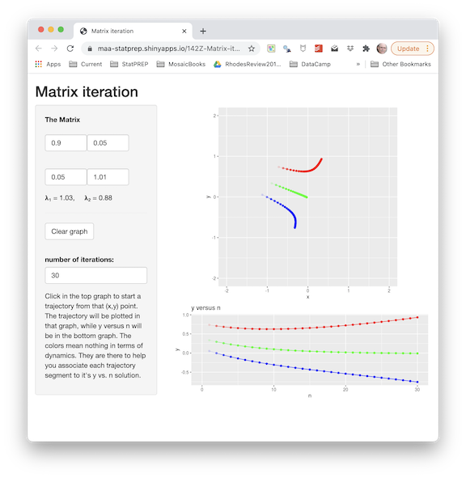
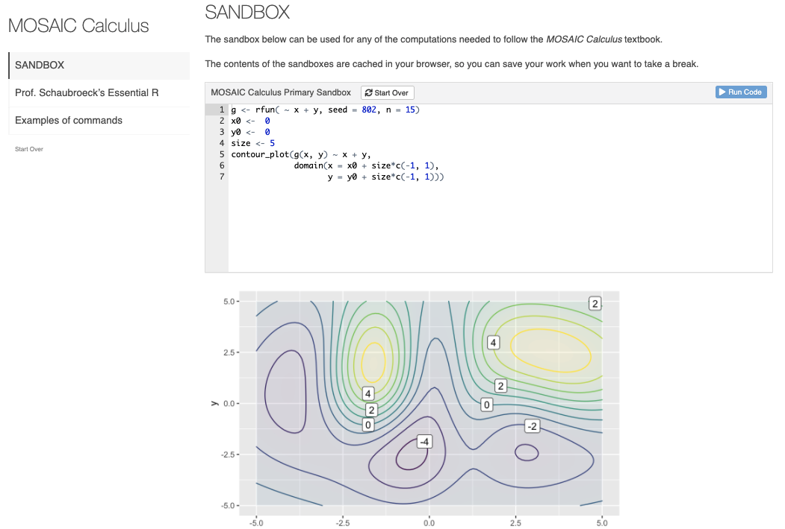

# Setting up R/mosaic {.unnumbered}

The text provides two complementary ways to access computing. The most intuitive is designed purely to exercise and visualize mathematical concepts through mouse-driven, graphical ***apps***. To illustrate, here is an app that we will use in Block 6. You can click on the snapshot to open the app in your browser.

<a href="https://maa-statprep.shinyapps.io/142Z-Matrix-iteration/" target="_blank"></a>

More fundamentally, you will be carrying out computing by composing computer commands and text and having a computer carry out the commands. One good way to do this is in a ***sandbox***--a kind of app which provides a safe place to enter the commands. You will access the sandbox in your browser (click on the image below to try it now).

<a href="https://maa-statprep.shinyapps.io/CalcZ-Sandbox/" target="_blank"></a>


Once you've entered the computer commands, you press the "Run" button to have the commands carried out. (You can also press CTRL+Enter on your keyboard.)


An important technique for teaching and learning computing is to present ***scaffolding*** for computer commands. At first, the scaffolding may be complete, correct commands that can be cut-and-pasted into a ***sandbox*** where the calculation will be carried out. Other times it will be left to the student to modify or fill in missing parts of the scaffolding. For example, when we introduce drawing graphs of functions and the choice of a domain, you might see a scaffold that has blanks to be filled in:

::: {.scaffolding}
```{r eval=FALSE}
slice_plot( exp(-3*t) ~ t, domain( --fill in domain-- ))
```
:::

You can hardly be expected at this point to make sense of any part of the above command, but soon you will.

::: {.tip}
After you get used to computing in a sandbox, you may prefer to install the R and RStudio software on your own laptop. This usually provides a faster response to you and lowers the load on the sandbox cloud servers being used by other students.

Experienced R users may even prefer to skip the sandbox entirely and use the standard resources of RStudio to edit and evaluate their computer commands. You'd use the same R commands regardless of whether you use a cloud server or your own laptop.
:::


### Exercises and feedback {.unnumbered}


Learning is facilitated by rapid, formative feedback. Many of the exercises in this book are arranged to give this.

LINK TO AN EXERCISE HERE

```{r child="Exercises/exercise-intro.Rmd", eval=FALSE}
```

### Practice, practice, practice {.unnumbered}

It is a good practice to practice! The [Drill app](https://maa-statprep.shinyapps.io/Zdrill/) provides multiple-choice questions designed to be answered at a glance or a very small amount of work on scratch paper. Once you choose a topic, the questions are presented in random order. You get immediate feedback on your answer. If your answer was wrong, the question is queued up again so that you will have another chance. At the point where you are answering almost all questions correctly, you're ready to move on.

$\ $ <!-- activate mathjax -->

### Software for the course {.unnumbered}

You can get started with the course using just a web browser. In addition to this textbook, bookmark the `r sandbox_link()` and `r drill_link()` so you can get to them easily.

If you find that the web sites are too slow, you can install both the sandbox and drill apps on your own computer. (You will need a computer running Windows or OS-X or Linux. Smartphones or tablets won't let you do this.)

If you already use RStudio, you can skip to step (3). You can use the *MOSAIC Calculus* software directly from RStudio as an alternative to the sandbox. See step (5).

Here are the steps. Steps (1), (2), and (3) together will take almost half an hour. Once they are completed, you will not need to do them again on that computer.

If you already have R and RStudio installed, skip to Step (3).

1. Install the R software. You can find reasonable video instructions on the Internet, for instance at [YouTube](https://www.youtube.com/watch?v=NZxSA80lF1I)
    - [R installer for Windows](https://cran.r-project.org/bin/windows/base/).
    - [R installer for OS-X](https://cran.r-project.org/bin/macosx/)
2. Install RStudio [RStudio installer](https://www.rstudio.com/products/rstudio/download/#download)

Not everyone has full permission to install external apps on their laptop. This is particularly true when the computer has been issued by your educational institution. If you are in this situation or, for other reasons, cannot complete steps (1) and (2) completely, seek help from a local expert. Both (1) and (2) have been installed by students on tens of millions of computers.

3. Install the MOSAIC Calculus packages within R.  Launch the RStudio app, just as you would launch any other app.
    - When the RStudio app starts, the upper left pane will be labeled "Console" and there will be a prompt: `>`
    - Copy and paste these commands, one at a time, after the console prompt, pressing return after each command:
    
```{r eval=FALSE}
install.apps(c("remotes", "distillr"))
remotes::install_github("dtkaplan/Zcalc")
```

[The first command will take about 15 seconds to complete and will display some messages in the Console, which you can ignore. **NOTE**: If you are given a message asking if you want to install in a "personal" or "private" library, say yes. But if you administer a system used by multiple people who need the software, select the option to install for all users.]{.aside}

[The second command will take about 5 minutes. Hundreds of incomprehensible messages will appear in the Console, all of which you can ignore. (If you are are working from a previous installation of R, you may be asked to update existing packages. Since you can do this at any time in the future, decline the update now.]{.aside}

4. On a daily basis, whenever you need to use the *MOSAIC Calculus* software.
    a. Open the RStudio App in the usual way for your operating system.
    b. In the RStudio console, give these two commands after the console prompt:
    
```{r eval=FALSE}
library(Zcalc)
Sandbox()
```

The computing sandbox will open in a browser tab. Closing that tab will return control to the console.

When you want to practice with the drill questions for this book, give the command `Drill()` instead of `Sandbox()`.

Most people find it convenient, when using the software several times a week, simply to keep the RStudio session open and similarly with the browser tab with the Sandbox.

5. **Not required**. Many students are taught how to use RStudio directly. If you are in this situation, you will be able to take advantage of the many features provided by this sophisticated software. There are two things to keep in mind:
    i. At the start of an RStudio session, give the command `library(Zcalc)` in the console.
    ii. If you are writing RMarkdown documents, then the following should make sense to you: Include `library(Zcalc)` in the start-up chunk so that it will run whenever you compile your document.


